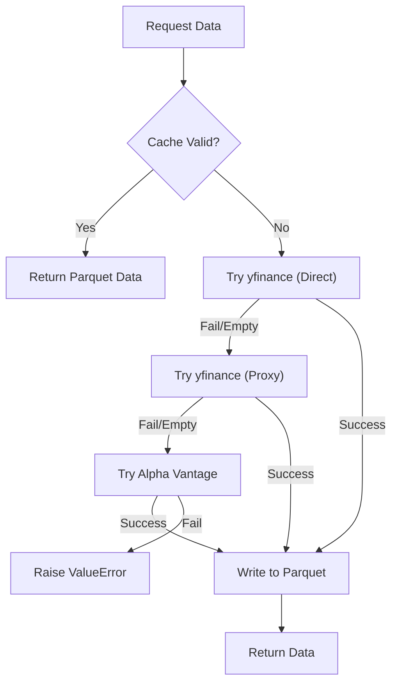

# System Architecture & Infrastructure

## System Role & Architectural Position

The System Architecture & Infrastructure layer serves as the foundational orchestration tier for the AI-powered Financial Intelligence System (AIFIS). It is responsible for maintaining environment parity across development and production, managing global state through a type-safe configuration singleton, and implementing a high-availability data ingestion strategy via a multi-tiered caching and fallback mechanism.

This layer abstracts the underlying hardware and OS specifics, providing the `api/` and `src/` modules with a consistent interface for environment variables, file system paths, and external API credentials.

### Infrastructure Specifications

| Component | Specification | Implementation Detail |
| :--- | :--- | :--- |
| **Runtime Environment** | Python 3.11 (Bookworm) | Containerized via `mcr.microsoft.com/devcontainers/python` |
| **Configuration Pattern** | Singleton Dataclass | `src/config.py` utilizing `python-dotenv` for `.env` resolution |
| **Data Persistence** | Parquet / Local FS | Columnar storage for stock snapshots in `.cache/stocks/` |
| **Orchestration** | DevContainer / Uvicorn | VS Code DevContainer for dev; Uvicorn for production serving |
| **Networking** | HTTP/REST | FastAPI routing with CORS and XSRF protection toggles |

## Core Execution & Data Flow Mechanics

The infrastructure layer operates as a dependency provider for all higher-level services. The system initializes by loading environment variables into a hierarchical dataclass structure, which then governs the behavior of the Transformer model, the Truth Engine, and the LLM sentiment adjusters.

### Data Ingestion & Fallback Workflow

To mitigate API rate limiting and IP blocking (common with `yfinance` in cloud environments), the system implements a tiered fallback chain.



### Key Execution Invariants
*   **Configuration Immutability**: Once the `AppConfig` singleton is instantiated, configuration values are treated as read-only to prevent runtime state drift.
*   **Cache Atomicity**: Cache files are stored as `.parquet` for speed and `.meta` for TTL tracking. A request is only served from cache if `current_time - meta_timestamp < TTL`.
*   **Environment Isolation**: All system paths are calculated relative to the `_PROJECT_ROOT` to ensure the application remains portable across different directory structures.

## Implementation Deep Dive & Code Snippets

### Type-Safe Global Configuration
The system eschews raw `os.getenv` calls throughout the codebase in favor of a centralized, typed configuration tree. This prevents `KeyError` or type mismatch exceptions during deep-model execution.

```python title="src/config.py"
@dataclass
class LLMConfig:
    """Ollama / Llama 3 / Groq configuration."""
    base_url: str = os.getenv("OLLAMA_BASE_URL", "http://localhost:11434")
    model: str = os.getenv("OLLAMA_MODEL", "llama3:8b")
    temperature: float = float(os.getenv("LLM_TEMPERATURE", "0.3"))
    max_tokens: int = int(os.getenv("LLM_MAX_TOKENS", "2048"))
    groq_api_key: str = os.getenv("GROQ_API_KEY", "").strip().strip("'\"")
    groq_model: str = os.getenv("GROQ_MODEL", "llama-3.1-8b-instant")

@dataclass
class AppConfig:
    """Top-level application configuration."""
    llm: LLMConfig = field(default_factory=LLMConfig)
    # ... other configs (News, Model, Flags)
    api_host: str = os.getenv("API_HOST", "0.0.0.0")
    api_port: int = int(os.getenv("API_PORT", "8000"))

# Singleton instance for global import
config = AppConfig()
```
**Mechanics:**
1.  **`dataclass`**: Provides a structured schema for settings, enabling IDE autocompletion and static type checking.
2.  **`field(default_factory=...)`**: Ensures that nested configuration objects (like `LLMConfig`) are instantiated correctly upon `AppConfig` creation.
3.  **Sanitization**: `.strip().strip("'\"")` is applied to API keys to prevent common `.env` formatting errors (e.g., quoted strings being read as part of the key).

### Multi-Source Data Fallback Logic
The `fetch_stock_data` function implements a robust retrieval strategy to ensure the system remains operational regardless of the network environment.

```python title="src/cache.py"
def fetch_stock_data(ticker: str, period: str = 'max', ttl_seconds: int = 900) -> pd.DataFrame:
    # 1. Local Cache Check
    if cache_file.exists() and meta_file.exists():
        cached_ts = float(meta_file.read_text().strip())
        if (time.time() - cached_ts) < ttl_seconds:
            return pd.read_parquet(cache_file)

    # 2. Tiered Fetching
    data = pd.DataFrame()
    try:
        # Attempt direct yfinance fetch with browser-like headers
        stock = yf.Ticker(ticker, session=session)
        data = stock.history(period=period)
    except Exception as e:
        logger.warning(f"yfinance direct failed: {e}")

    # 3. Proxy Fallback
    if data.empty and proxy_url:
        # ... proxy session implementation ...
        
    # 4. Alpha Vantage Final Fallback
    if data.empty:
        data = _fetch_alpha_vantage(ticker, period)

    if data.empty:
        raise ValueError(f"No data found for ticker {ticker}")

    # 5. Atomic Cache Write
    data.to_parquet(cache_file)
    meta_file.write_text(str(time.time()))
    return data
```
**Mechanics:**
1.  **TTL Enforcement**: Uses a secondary `.meta` file to store the UNIX timestamp of the last successful fetch.
2.  **Header Spoofing**: The `requests.Session` uses a `User-Agent` mimicking a modern Chrome browser to avoid immediate 403 blocks from Yahoo Finance.
3.  **Parquet Serialization**: Uses Apache Parquet via `pandas` to maintain data types (floats, timestamps) and minimize I/O overhead compared to CSV.

### Environment Orchestration
The `.devcontainer` configuration ensures that every developer works in an identical Linux environment, automating the installation of system-level dependencies.

```json title=".devcontainer/devcontainer.json"
{
  "image": "mcr.microsoft.com/devcontainers/python:1-3.11-bookworm",
  "updateContentCommand": "[ -f packages.txt ] && sudo apt update && sudo apt upgrade -y && sudo xargs apt install -y <packages.txt; [ -f requirements.txt ] && pip3 install --user -r requirements.txt; pip3 install --user streamlit",
  "postAttachCommand": {
    "server": "streamlit run app.py --server.enableCORS false --server.enableXsrfProtection false"
  },
  "forwardPorts": [8501]
}
```
**Mechanics:**
1.  **`updateContentCommand`**: Executes a shell pipeline that synchronizes OS packages (`packages.txt`) and Python dependencies (`requirements.txt`) upon container creation.
2.  **`postAttachCommand`**: Automates the bootstrap of the application server immediately after the VS Code session attaches to the container.
3.  **Port Mapping**: Explicitly maps port `8501` for the Streamlit/Dashboard interface to ensure accessibility from the host machine.

## Method / State Reference & Error Recovery

### Environment Variable Schema

| Variable | Type | Default | Impact |
| :--- | :--- | :--- | :--- |
| `GROQ_API_KEY` | String | `Required` | Enables LLM-based sentiment adjustment and research reports. |
| `ALPHA_VANTAGE_KEY`| String | `None` | Provides cloud-fallback for stock data when `yfinance` is blocked. |
| `PROXY_URL` | String | `None` | Routes `yfinance` requests through a proxy to bypass IP bans. |
| `NEWS_CACHE_TTL` | Integer | `15` | Determines frequency of news API refreshes (minutes). |
| `ENABLE_NEWS` | Boolean | `true` | Toggles the Truth Engine and news scraping pipeline. |

### Failure Modes & Recovery

| Failure Scenario | Detection | Recovery Mechanism |
| :--- | :--- | :--- |
| **API Rate Limit (429)** | `requests.exceptions.HTTPError` | Trigger fallback to Proxy $\rightarrow$ Alpha Vantage $\rightarrow$ Cache. |
| **Cache Corruption** | `pd.read_parquet` failure | `clear_cache()` called automatically; force-refresh from API. |
| **LLM Unavailability** | Groq API Timeout/500 | Fallback to deterministic data-only research reports (defined in `research.py`). |
| **Missing `.env`** | `load_dotenv` returns `False` | System defaults to `AppConfig` default values; critical keys raise `ValueError`. |