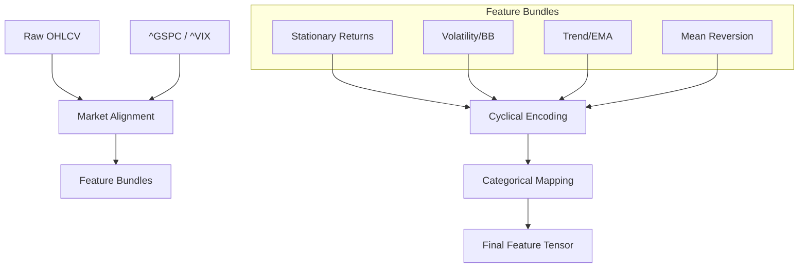

# Feature Synthesis Engine

The Feature Synthesis Engine is the critical transformation layer within the Data Engineering Pipeline. Its primary objective is to convert non-stationary, heterogeneous raw OHLCV (Open, High, Low, Close, Volume) market data into a normalized, scale-agnostic, and stationary feature space suitable for the Multi-Stock Global Transformer. By shifting from absolute price values to logarithmic returns and relative distance metrics, the engine ensures that the model learns universal market dynamics rather than stock-specific price scales.

## A. System Role & Architectural Position

The engine sits between the `Data Ingestion Layer` and the `AI Model Orchestration` layer. It consumes raw time-series data and produces high-dimensional tensors that incorporate both idiosyncratic stock behavior and systemic market context.

| Specification | Detail |
| :--- | :--- |
| **Primary Input** | Raw OHLCV Data (Pandas DataFrame), Ticker Metadata |
| **Primary Output** | Stationary Feature Tensors, Scaled Log Return Targets |
| **Core Dependencies** | `pandas`, `numpy`, `scikit-learn`, `torch` |
| **Mathematical Objective** | Achieving $I(0)$ stationarity via logarithmic transformations |
| **Contextual Integration** | S&P 500 (^GSPC) returns, VIX volatility regimes |

## B. Core Execution & Data Flow Mechanics

The synthesis process follows a multi-stage pipeline to ensure data integrity and feature richness. The transformation logic is partitioned into four distinct functional bundles: Baseline Returns, Volatility Breakouts, Trend Alignment, and Mean Reversion.



### Pipeline Execution Steps:
1.  **Market Context Alignment**: The engine performs a left-join on the stock's timeline with benchmark indices (`^GSPC` for market beta and `^VIX` for volatility regimes). A two-tier fallback mechanism (retrying `period='10y'` if `period='max'` fails) is implemented to prevent pipeline stalls.
2.  **Stationary Transformation**: All price-based features are converted to logarithmic ratios to eliminate scale-dependency.
    *   $\text{Log\_Return}_t = \ln\left(\frac{P_t}{P_{t-1}}\right)$
3.  **Bundle Synthesis**:
    *   **Volatility**: Calculates Bollinger Band squeezes and volume Z-scores to detect liquidity-driven breakouts.
    *   **Trend**: Uses EMA ratios (e.g., $\ln(\text{EMA}_{50}/\text{EMA}_{20})$) to quantify momentum alignment.
    *   **Mean Reversion**: Computes RSI asymmetry and price Z-scores relative to moving averages.
4.  **Temporal/Categorical Injection**: Converts linear timestamps into periodic sin/cos components and maps tickers to `Sector_ID` and `Stock_ID` for embedding lookups.

## C. Implementation Deep Dive

### 1. Stationary Feature Construction
The following implementation demonstrates the core logic for calculating the stationary feature bundles, specifically focusing on the interaction between price action and volume dynamics.

```python title="src/features.py"
def create_input(stock_name, scalers_path=None):
    # ... [Data ingestion and market alignment logic] ...
    
    # --- Baseline Stationary Returns ---
    features_df['close_log_return'] = np.log(close / close.shift(1))
    features_df['open_log_return'] = np.log(open_p / close.shift(1))
    
    # Volume Z-Score: Standardizing liquidity spikes
    vol_mean_20 = volume.rolling(20).mean()
    vol_std_20 = volume.rolling(20).std().replace(0, 1e-8)
    features_df['volume_z_score'] = (volume - vol_mean_20) / vol_std_20
    
    # --- Volatility Breakout Bundle ---
    bb_mean_20 = close.rolling(window=20).mean()
    bb_std_20 = close.rolling(window=20).std()
    bb_upper_20 = bb_mean_20 + (bb_std_20 * 2)
    bb_lower_20 = bb_mean_20 - (bb_std_20 * 2)
    # Squeeze metric: Ratio of mean to bandwidth
    features_df['bb_band_squeeze'] = bb_mean_20 / (bb_upper_20 - bb_lower_20 + 1e-8)
    
    # --- Trend Pullback Bundle ---
    ema20 = close.ewm(span=20, adjust=False).mean()
    ema50 = close.ewm(span=50, adjust=False).mean()
    features_df['trend_alignment_ratio'] = np.log(ema50 / ema20.replace(0, 1e-8))
    
    # ... [Post-processing and categorical mapping] ...
```
*   **`volume_z_score`**: Normalizes volume to detect relative liquidity anomalies.
*   **`bb_band_squeeze`**: Captures periods of low volatility that typically precede high-volatility expansions.
*   **`trend_alignment_ratio`**: Provides a scale-invariant measure of the relative position of short-term vs. long-term momentum.

### 2. Cyclical Temporal Encoding
To capture seasonality without the discontinuity of linear time, the engine applies trigonometric transformations to calendar components.

```python title="src/features.py"
# --- Cyclical Time Encodings ---
# Day of Week (0-4)
day_of_week = features_df.index.dayofweek.values
day_of_week = np.clip(day_of_week, 0, 4) 
features_df['day_sin'] = np.sin(2. * np.pi * day_of_week / 5.0)
features_df['day_cos'] = np.cos(2. * np.pi * day_of_week / 5.0)

# Month of Year (1-12)
month_of_year = features_df.index.month.values
features_df['month_sin'] = np.sin(2. * np.pi * month_of_year / 12.0)
features_df['month_cos'] = np.cos(2. * np.pi * month_of_year / 12.0)
```
*   **Rationale**: Standard integer encoding (e.g., Dec=12, Jan=1) creates a massive distance jump. Sin/Cos encoding ensures that Dec (12) and Jan (1) are mathematically adjacent in the feature space.

## D. Method / State Reference & Error Recovery

The engine utilizes custom scaling classes to manage different target requirements during the training and inference phases.

### Feature Specification Reference

| Feature Name | Mathematical Definition | Operational Purpose |
| :--- | :--- | :--- |
| `close_log_return` | $\ln(C_t / C_{t-1})$ | Primary target and baseline momentum |
| `volume_force_multiplier` | $\text{Return} \times \text{Vol\_Z}$ | Captures price-volume convergence |
| `macro_beta_shield` | $R_{stock} - R_{\text{SPY}}$ | Isolates idiosyncratic alpha from market beta |
| `rsi_asymmetry` | $(RSI - 50) / 100$ | Normalized mean-reversion signal |

### Error Recovery & Robustness

| Failure Mode | Detection Mechanism | Recovery Strategy |
| :--- | :--- | :--- |
| **Market Data Timeout** | `yfinance` exception in `fetch_stock_data` | Two-tier fallback: Attempt `period='10y'` before defaulting to zero-return padding |
| **Zero Volatility** | `std_20 == 0` | Epsilon injection (`1e-8`) in denominators to prevent `inf` values |
| **Data Sparsity** | Rolling window `NaN` generation | `dropna()` applied post-synthesis to ensure tensor density |
| **Unrecognized Ticker** | `stock_name_upper not in TICKERS` | Default to `Stock_ID=0` and `Sector_ID=0` to maintain tensor shape |