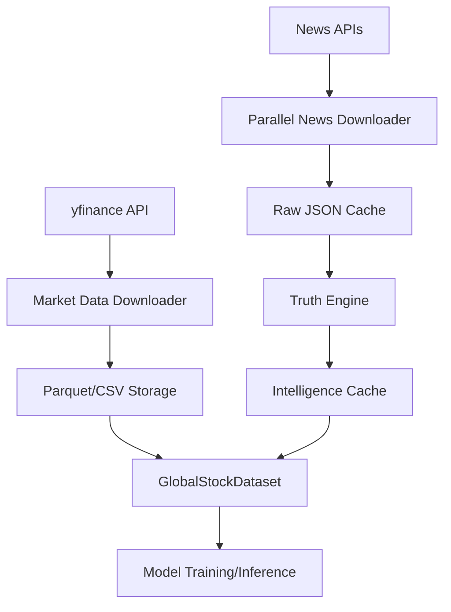

# Data Engineering Pipeline

The Data Engineering Pipeline constitutes the ETL (Extract, Transform, Load) backbone of the Financial Intelligence System. It is responsible for the ingestion of heterogeneous financial data—comprising high-frequency market pricing and unstructured news streams—and the subsequent transformation of this data into tensor-ready analytical datasets for AI model consumption.

### System Role & Architectural Position

The pipeline operates as a decoupled ingestion layer that bridges external financial APIs and the internal AI Model Orchestration layer. It ensures data persistence through a multi-tiered caching strategy and maintains temporal alignment between market price movements and sentiment-bearing news events.

| Component | Responsibility | Primary Source/Sink | Data Format |
| :--- | :--- | :--- | :--- |
| `download_data.py` | Market Data Ingestion | `yfinance` $\rightarrow$ `/data` | Parquet, CSV |
| `download_news.py` | News Orchestration | `NewsAPI`/`Finnhub` $\rightarrow$ Cache | JSON |
| `src/news.py` | News Synthesis & Truth Scoring | Raw JSON $\rightarrow$ `NewsFeed` | Python Dataclass |
| `src/data.py` | Temporal Sequence Generation | Parquet/CSV $\rightarrow$ PyTorch Tensors | `torch.Tensor` |

---

### Core Execution & Data Flow Mechanics

The pipeline bifurcates into two primary streams: the **Market Data Stream** (deterministic, structured) and the **News Intelligence Stream** (probabilistic, unstructured). These streams converge at the `GlobalStockDataset` level where temporal features are aligned for supervised learning.



#### Pipeline Execution Sequence:
1.  **Market Ingestion**: `download_data.py` iterates through a predefined universe of 41 tickers, fetching historical daily data. Data is persisted in Parquet to preserve the `DatetimeIndex` and CSV for human-readability.
2.  **News Aggregation**: `download_news.py` utilizes a `ThreadPoolExecutor` with a concurrency limit of 5 workers to fetch articles from `yfinance`, `NewsAPI`, and `Finnhub` without triggering rate limits.
3.  **Truth Synthesis**: The `TruthEngine` clusters raw articles by normalized titles and applies a weighted scoring algorithm (Consistency, Credibility, Temporal Convergence) to filter noise and identify "ground truth" events.
4.  **Tensorization**: `src/data.py` transforms the processed dataframes into 3D lookback sequences. It maps `Stock_ID` and `Sector_ID` to integer embeddings and calculates `Target_Log_Return` for the prediction horizon.

---

### Implementation Deep Dive

#### 1. The Truth Engine (Probabilistic Filtering)
The `TruthEngine` implements a multi-pillar scoring mechanism to assign a confidence value to news clusters, preventing the AI model from reacting to outlier reports or "fake news."

```python title="src/news.py"
class TruthEngine:
    @classmethod
    def score_cluster(cls, cluster: list) -> tuple:
        texts = [f"{a.title} {a.summary}" for a in cluster]
        sources = [a.source for a in cluster]
        dates = [a.published_date for a in cluster]
        
        # Pillar calculations
        c_score = cls._calculate_consistency(texts) # TF-IDF Cosine Similarity
        w_score = cls._calculate_credibility(sources) # Source Weighting
        t_score = cls._calculate_temporal(dates) # Publication Window
        penalty = cls._detect_contradictions(texts) # Negation Detection
        
        eng = config.news.truth_engine
        s = (eng.w_consistency * c_score) + \
            (eng.w_credibility * w_score) + \
            (eng.w_temporal * t_score) - penalty
        
        final_score = max(min(s, 1.0), 0.0)
        return final_score, breakdown
```
- **Consistency**: Uses `TfidfVectorizer` to compute a similarity matrix across the cluster; high average similarity indicates a consensus event.
- **Credibility**: Maps sources to predefined weights (e.g., `weight_yfinance`). Multi-source validation provides a additive bonus.
- **Temporal Convergence**: Measures the time spread between articles. Events breaking within a 15-minute window receive a maximum score of 1.0.
- **Contradiction Penalty**: Scans for opposing keywords (e.g., "confirmed" vs "denied") within the same cluster to penalize the confidence score.

#### 2. Temporal Sequence Synthesis
To support LSTM/Transformer architectures, the pipeline converts flat time-series data into overlapping windows of historical features and future targets.

```python title="src/data.py"
class GlobalStockDataset(Dataset):
    def __init__(self, data_list, seq_length=60, out_seq_len=5):
        self.samples = []
        for df in data_list:
            # Identifier extraction for Embedding layers
            stock_id = int(df['Stock_ID'].iloc[0])
            sector_id = int(df['Sector_ID'].iloc[0])
            
            # Feature slicing: [Batch, Seq_Len, Features]
            temporal_features = df.drop(columns=['Stock_ID', 'Sector_ID', 'Target_Log_Return']).values.astype(np.float32)
            targets = df['Target_Log_Return'].values.astype(np.float32)
            
            for i in range(len(df) - seq_length - out_seq_len + 1):
                self.samples.append({
                    'X_temporal': torch.tensor(temporal_features[i : i + seq_length]),
                    'X_stock_id': torch.tensor(stock_id, dtype=torch.long),
                    'X_sector_id': torch.tensor(sector_id, dtype=torch.long),
                    'Y_target': torch.tensor(targets[i + seq_length : i + seq_length + out_seq_len])
                })
```
- **Feature Set**: Separates continuous temporal features from categorical identifiers (`Stock_ID`, `Sector_ID`) to allow for mixed-input neural network architectures.
- **Target Engineering**: Predicts a sequence of `out_seq_len` (default 5 days) of log returns, transforming the problem into a multi-step time-series forecasting task.

---

### Method & State Reference

#### Truth Engine Configuration Schema
The following weights govern the `TruthEngine`'s final confidence output $S = \sum (w_i \cdot \text{pillar}_i) - \text{Penalty}$.

| Parameter | Type | Default | Description |
| :--- | :--- | :--- | :--- |
| `w_consistency` | `float` | 0.4 | Weight assigned to semantic similarity between articles. |
| `w_credibility` | `float` | 0.3 | Weight assigned to the reliability of the news source. |
| `w_temporal` | `float` | 0.3 | Weight assigned to the speed of information convergence. |
| `p_contradiction`| `float` | 0.5 | Deduction applied when conflicting reports are detected. |
| `cache_ttl_minutes`| `int` | 60 | Time-to-live for news intelligence cache before refresh. |

#### Error Recovery & Failure Modes

| Failure Scenario | Detection Mechanism | Recovery Strategy |
| :--- | :--- | :--- |
| **API Rate Limiting** | HTTP 429 Response | `ThreadPoolExecutor` workers capped at 5; implement exponential backoff in `requests` wrapper. |
| **Missing Ticker Data** | `data.empty` check | Skip ticker, log warning, and proceed to next ticker in `TICKERS` list. |
| **Cache Stale/Expired** | `datetime.now() - fetched > TTL` | Trigger `bypass_cache=True` in `fetch_news()` to force API refresh. |
| **Sequence Underflow** | `len(df) < (seq_length + out_seq_len)` | Discard the specific stock dataframe from the `GlobalStockDataset` pool. |