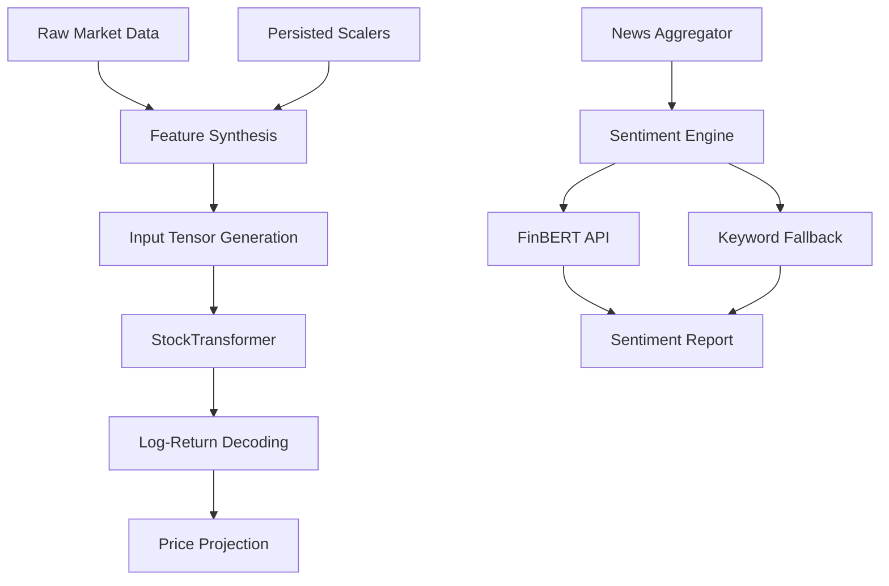

# Inference & Sentiment Analysis

The Inference & Sentiment Analysis component constitutes the decision-making core of the system. It leverages a high-capacity Transformer-based architecture for multivariate time-series forecasting and a dual-mode NLP engine for financial sentiment extraction. This module is responsible for transforming processed temporal features into actionable price projections and qualitative market sentiment reports.

## A. System Role & Architectural Position

This module operates downstream of the **Data Engineering Pipeline** and serves as the primary logic provider for the **Server API Layer**. It bridges the gap between raw feature vectors and domain-specific intelligence.

| Specification | Detail |
| :--- | :--- |
| **Forecasting Engine** | `StockTransformer` (Multi-head Attention) |
| **Sentiment Engine** | FinBERT (Hugging Face API) / Keyword-based Fallback |
| **State Management** | Persistent `joblib` serialized scalers (`models/*.joblib`) |
| **Primary Dependencies** | `torch`, `scikit-learn`, `transformers`, `requests` |
| **Output Formats** | Log-return tensors, `SentimentReport` dataclasses, USD Price Series |
| **Inference Latency Target** | < 500ms (Keyword) / < 2.5s (FinBERT API) |

## B. Core Execution & Data Flow Mechanics

The system executes two parallel intelligence workflows: the **Quantitative Forecast Path** and the **Qualitative Sentiment Path**.



### 1. Quantitative Forecast Workflow
1.  **Contextual Scaling**: To prevent distribution shift (the "Inference Bug"), the `create_input()` function retrieves pre-fitted `MinMaxScaler` and `QuantileTransformer` instances from the `models/` directory.
2.  **Tensor Construction**: Continuous features are cast to `float32` tensors, while categorical identifiers (`Stock_ID`, `Sector_ID`) are processed through embedding layers.
3.  **Autoregressive Inference**: The `StockTransformer` performs a single forward pass, outputting a multi-step prediction horizon (default $H=5$).
4.  **Exponential Recomposition**: Predicted log-returns are transformed back to absolute USD prices using the formula: $P_{t+n} = P_t \cdot \exp(\sum \hat{r})$.

### 2. Qualitative Sentiment Workflow
1.  **Ingestion**: News headlines are retrieved via the news service.
2.  **Model Selection**: The engine attempts a high-fidelity request to the `ProsusAI/finbert` model via the Hugging Face Inference API.
3.  **Heuristic Fallback**: If the API returns a `503 (Service Unavailable)` or if `HF_API_KEY` is absent, the system invokes a deterministic keyword-based scoring algorithm using predefined bullish/bearish lexicons.
4.  **Aggregation**: Individual `SentimentScore` objects are aggregated into a `SentimentReport`, calculating a weighted `overall_score` in the range $[-1.0, 1.0]$.

## C. Implementation Deep Dive

### 1. Transformer Optimization (Stability Fixes)
To mitigate training instability and excessive parameter counts, the `StockTransformer` architecture was refactored to constrain the Feed-Forward Network (FFN) expansion ratio and implement Layer Normalization.

```python title="src/model.py"
class StockTransformer(nn.Module):
    def __init__(self, d_model, nhead, num_layers, dropout_rate=0.2, ...):
        super().__init__()
        # Fix: Controlled FFN expansion (4x instead of PyTorch default 32x)
        self.dim_ff = d_model * 4 
        
        self.input_norm = nn.LayerNorm(d_model)
        self.transformer_encoder = nn.TransformerEncoder(
            nn.TransformerEncoderLayer(
                d_model=d_model, 
                nhead=nhead,
                dim_feedforward=self.dim_ff, 
                dropout=dropout_rate
            ),
            num_layers=num_layers
        )
```
*   **FFN Scaling**: Reducing `dim_feedforward` from 2048 to 256 (for $d_{model}=64$) reduced total parameters by ~79%, preventing memorization and improving generalization.
*   **Layer Normalization**: `self.input_norm` is applied post-linear projection to stabilize the distribution before the attention mechanism.

### 2. Optimized Training Loop
The training procedure was upgraded from a single-step supervision model to a full-sequence supervision model with gradient stabilization.

```python title="src/train.py"
# 1. Full-sequence supervision (5x more gradient signal)
loss = criterion(output, tgt.squeeze(-1)[:, :-1])

# 2. Gradient Clipping (Mitigates Transformer spikes)
loss.backward()
torch.nn.utils.clip_grad_norm_(model.parameters(), max_norm=1.0)
optimizer.step()

# 3. Learning Rate Scheduling
scheduler.step() # CosineAnnealingLR
```
*   **Loss Function**: Utilizing `HuberLoss(delta=1.0)` provides robustness against outliers in the quantile-transformed distribution.
*   **Supervision**: Supervising all timesteps in the horizon rather than just the final step ensures the autoregressive chain remains coherent.

### 3. Scaler Persistence Logic
Crucial for inference integrity, scalers are decoupled from the training data generation to ensure the inference distribution matches the training distribution.

```python title="src/features.py"
def create_input(ticker, scalers_path=None):
    if scalers_path:
        # Inference Path: Load existing state
        feature_scaler, time_scaler, close_scaler = load_scalers(load_dir=scalers_path)
    else:
        # Training Path: Fit fresh distributions
        feature_scaler, time_scaler, close_scaler = fit_new_scalers(data)
        save_scalers(feature_scaler, time_scaler, close_scaler, save_dir=scalers_path)
    
    return transformed_data, feature_scaler, time_scaler, close_scaler
```

## D. Method Reference & Error Recovery

### Model Hyperparameters & Training Constraints
| Parameter | Value | Rationale |
| :--- | :--- | :--- |
| `d_model` | 128 | Balanced capacity for multivariate temporal patterns |
| `dropout` | 0.2 | Consistent regularization across Transformer and FC heads |
| `learning_rate` | $1e^{-4}$ | Base LR for `CosineAnnealingLR` |
| `patience` | 15 | Early stopping threshold for `val_loss` stagnation |
| `Huber delta` | 1.0 | Optimizes for $N(0,1)$ distribution after Quantile Transform |

### Failure Mode Analysis

| Failure Scenario | Detection Mechanism | Recovery Protocol |
| :--- | :--- | :--- |
| **API 503 (HF API)** | `response.status_code == 503` | Immediate transition to `_score_with_keywords` |
| **Distribution Shift** | `MinMaxScaler` refitting during inference | **Critical Failure**: System must reload `.joblib` scalers from `models/` |
| **Vanishing Gradients** | `val_loss` plateau during training | Trigger `CosineAnnealingLR` decay and check `clip_grad_norm` |
| **Data Insufficiency** | `len(input_features) < seq_length` | Return error code to API layer; prevent model forward pass |