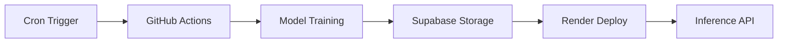

# AI Model Orchestration

The AI Model Orchestration layer serves as the predictive engine of the Financial Intelligence System. It is responsible for the lifecycle management of the `StockTransformer` architecture, encompassing scheduled retraining, hyperparameter optimization, artifact versioning, and automated deployment synchronization.

## Section A: System Role & Architectural Position

The orchestration layer acts as the bridge between the **Data Engineering Pipeline** (providing processed temporal features) and the **Inference & Sentiment Analysis** layer (consuming trained weights). It is designed to handle the low signal-to-noise ratio inherent in financial time-series data through a specialized decoder-only transformer architecture.

### Model Configuration Schema

The following parameters define the structural invariants of the `StockTransformer` as specified in `models/config.json`.

| Parameter | Type | Value | Description |
| :--- | :--- | :--- | :--- |
| `num_continuous_features` | `int` | 17 | Dimensionality of the input temporal vector. |
| `d_model` | `int` | 64 | Hidden state dimension for transformer blocks. |
| `nhead` | `int` | 4 | Number of attention heads for multi-head attention. |
| `num_layers` | `int` | 4 | Depth of the transformer encoder stack. |
| `dropout` | `float` | 0.25 | Regularization probability to prevent noise memorization. |
| `prediction_horizon` | `int` | 5 | Number of future steps (days) to predict. |
| `max_seq_len` | `int` | 70 | Maximum temporal context window. |
| `stock_embed_dim` | `int` | 32 | Latent dimension for stock-specific identity. |
| `sector_embed_dim` | `int` | 8 | Latent dimension for sector-level conditioning. |

## Section B: Core Execution & Data Flow Mechanics

Model orchestration is driven by a continuous integration/continuous training (CI/CT) pipeline via GitHub Actions. The process is triggered on a weekly cron schedule to adapt to shifting market regimes.



### Orchestration Pipeline Lifecycle

1.  **Trigger Phase**: The `.github/workflows/weekend_train.yml` executes every Saturday at 02:00 UTC or via `workflow_dispatch`.
2.  **Environment Provisioning**: A clean `ubuntu-latest` runner is instantiated; the `.cache/stocks/` directory is purged to ensure zero data leakage from stale indices.
3.  **Training Execution**: The `main.py` entry point executes the training loop with a fixed epoch count (e.g., 15) for CI stability.
4.  **Artifact Serialization**: 
    *   Model weights are serialized to `best_model.pth`.
    *   Feature, Time, and Close scalers are exported as `.joblib` files to ensure inference-time normalization parity.
5.  **Remote Synchronization**: Artifacts are pushed to Supabase Storage via `curl` POST requests using `x-upsert: true` to ensure the latest weights overwrite the current production state.
6.  **Deployment Synchronization**: A webhook is dispatched to Render to trigger a redeploy of the API layer, pulling the updated weights from the storage bucket.

## Section C: Implementation Deep Dive

### Decoder-Only Causal Transformer

The `StockTransformer` implements a GPT-style architecture. Unlike standard encoders, it uses a causal mask to ensure that the prediction for time $t$ only utilizes information from $t$ and its predecessors, preventing look-ahead bias.

```python title="src/model.py"
class StockTransformer(nn.Module):
    def __init__(self, ...):
        # ... [Initialization of embeddings and projections]
        self.transformer = nn.TransformerEncoder(
            nn.TransformerEncoderLayer(
                d_model=d_model,
                nhead=nhead,
                dim_feedforward=d_model * 4,
                dropout=dropout,
                activation='gelu',
                batch_first=True,
                norm_first=True,  # Pre-LayerNorm for stability
            ),
            num_layers=num_layers,
        )

    def _generate_causal_mask(self, seq_len, device):
        return nn.Transformer.generate_square_subsequent_mask(seq_len, device=device)

    def forward(self, x_temporal, stock_id, sector_id):
        # [Categorical Embeddings + Temporal Features Projection]
        # [Application of Causal Mask in transformer layer]
        # [Output Head: final_hidden_state -> prediction_horizon]
        ...
```

**Key Architectural Decisions:**
*   **Pre-LayerNorm (`norm_first=True`)**: Ensures smoother gradient flow by normalizing inputs to the sub-layers rather than outputs, crucial for the volatile gradients of financial data.
*   **Categorical Conditioning**: `stock_id` and `sector_id` are expanded across the temporal dimension, allowing the model to learn sector-specific volatility patterns and individual stock idiosyncrasies.
*   **GELU Activation**: Provides a non-zero gradient for negative values, aiding in the learning of complex, non-linear market dynamics.

### Robust Optimization & Training Logic

The training loop in `src/train.py` is engineered for high-variance environments using Huber Loss and adaptive learning rate scheduling.

```python title="src/train.py"
def train_model(model, train_loader, val_loader, ...):
    # AdamW with weight decay for L2 regularization
    optimizer = torch.optim.AdamW(model.parameters(), lr=learning_rate, weight_decay=1e-3)
    
    # LambdaLR: 3-epoch linear warmup followed by Cosine Annealing
    scheduler = LambdaLR(optimizer, lr_lambda)
    
    # HuberLoss: Robust to market outliers (less sensitive to large residuals than MSE)
    criterion = nn.HuberLoss(delta=1.0)
    
    for epoch in range(epochs):
        # ... [Training Step]
        loss.backward()
        # Gradient clipping at 1.0 to mitigate explosive volatility
        torch.nn.utils.clip_grad_norm_(model.parameters(), max_norm=1.0)
        optimizer.step()
        
        # ... [Validation & Early Stopping Logic]
```

**Optimization Mechanics:**
*   **Huber Loss**: By utilizing a linear loss for errors greater than $\delta=1.0$, the model avoids over-correcting for "black swan" events that would otherwise skew an MSE-based loss function.
*   **Gradient Clipping**: Prevents "exploding gradients" during high-volatility training batches by capping the global norm at 1.0.
*   **Directional Accuracy (Hit Rate)**: The primary metric of interest is the sign agreement between `output` and `y_target`. This allows the system to optimize for profitable directionality rather than mere magnitude accuracy.

## Section D: Method / State Reference & Error Recovery

### Training Hyperparameters & Logic

| Component | Implementation | Purpose |
| :--- | :--- | :--- |
| **Optimizer** | `AdamW` | Decoupled weight decay for improved regularization. |
| **Scheduler** | `LambdaLR` (Warmup + Cosine) | Stabilizes initial training; ensures fine-grained convergence. |
| **Loss Function** | `HuberLoss` ($\delta=1.0$) | Mitigates impact of extreme market outliers. |
| **Convergence** | Early Stopping (Patience: 7) | Prevents overfitting to recent temporal noise. |

### Error Recovery & Fault Tolerance

The orchestration logic includes explicit exception handling to prevent the loss of computational progress during long-running training jobs.

*   **Interruption Handling**: If a `KeyboardInterrupt` or a system-level `Exception` occurs, the system captures the current state.
    *   `best_model.pth`: Always contains the state with the lowest validation loss.
    *   `interrupted_model.pth`: A full checkpoint containing `epoch`, `model_state_dict`, and `optimizer_state_dict` for warm-start resumption.
*   **Validation Failures**: If the validation loss fails to improve for 7 consecutive epochs, the `patience_counter` triggers an early exit to save compute resources and prevent model degradation.