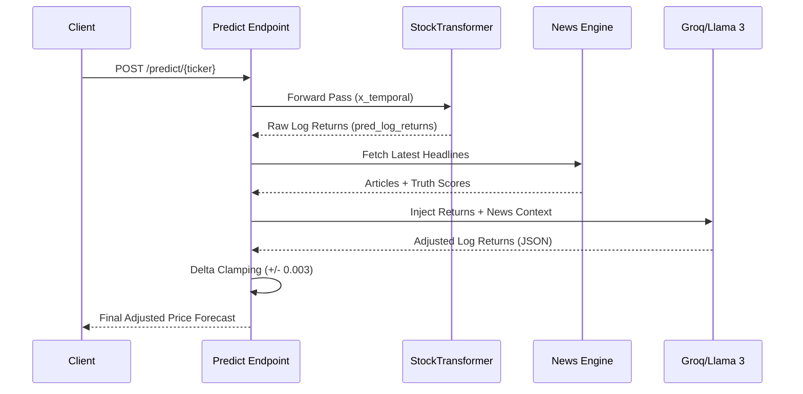

# Financial Intelligence Endpoints

The Financial Intelligence Endpoints constitute the domain-specific orchestration layer of the Server API. This layer abstracts the complexity of the underlying `StockTransformer` inference, the news scraping/sentiment engine, and the LLM-based reasoning agents into a cohesive set of RESTful interfaces. These routes are designed to serve high-fidelity, multi-modal analytical data to the Frontend Experience Layer.

## System Role & Architectural Position

These endpoints act as the high-level controllers within the FastAPI framework, managing the lifecycle of an analytical request from raw ticker input to synthesized intelligence. They orchestrate data from the `src.features` engineering engine, the `src.news` ingestion pipeline, and the `src.model` inference core.

| Component | Responsibility | Dependency |
| :--- | :--- | :--- |
| **Market Router** | Technical indicator retrieval & ticker discovery | `src.features.get_market_snapshot` |
| **News/Sentiment Router** | News aggregation & NLP-based sentiment scoring | `src.news`, `src.sentiment` |
| **Prediction Router** | Transformer inference & LLM-based log-return adjustment | `src.model.StockTransformer`, `Groq API` |
| **Research Router** | Multi-agent synthesis of technical, sentiment, and forecast data | `src.config`, `Groq API` |
| **Analysis Router** | Aggregated "one-stop" analytical snapshot | Full stack orchestration |

## Core Execution & Data Flow Mechanics

The system utilizes two primary high-complexity workflows: **Log-Return Adjustment** (for predictions) and **Intelligence Synthesis** (for research).

### 1. Predictive Adjustment Workflow
When requesting a prediction, the system does not merely return the Transformer's mathematical output. It performs a contextual injection where a Large Language Model (LLM) acts as a "Chief Investment Officer" to adjust the structural forecast based on real-time news catalysts.



### 2. Research Synthesis Workflow
The `POST /research/{ticker}` route follows a fan-out/fan-in pattern. It concurrently gathers technical, news, and predictive data points, then serializes them into a high-density prompt for the LLM to generate a structured, professional-grade equity research report.

## Implementation Deep Dive

### Transformer Model Management & OOM Mitigation
To prevent Out-of-Memory (OOM) errors and excessive latency during frequent inference requests, the API implements a global singleton-style caching mechanism with `mtime` validation. This ensures that model weights are only reloaded if the underlying `.pth` file is updated.

```python title="api/routes/predict.py"
# Global cache to prevent OOM/RAM spikes during high-concurrency inference
global _cached_model, _cached_model_mtime, _cached_max_seq_len

model_path = "best_model.pth"
mtime = os.path.getmtime(model_path)

# Check if model is in memory and if the file has changed
if '_cached_model' not in globals() or _cached_model is None or _cached_model_mtime != mtime:
    print(f"🔄 Loading model weights from {model_path}...")
    checkpoint = torch.load(model_path, map_location=device)
    
    # Dynamic dimension detection for architectural robustness
    ckpt_max_seq_len = checkpoint['pos_embed'].shape[1]
    ckpt_d_model = checkpoint['input_proj.weight'].shape[0]
    # ... [Additional dimension extraction]
    
    model = StockTransformer(
        num_continuous_features=num_features,
        d_model=ckpt_d_model,
        # ... [Config mapping]
    )
    model.load_state_dict(checkpoint)
    model.to(device)
    model.eval()

    _cached_model = model
    _cached_model_mtime = mtime
```
*The implementation uses `torch.no_grad()` during the forward pass to disable gradient computation, significantly reducing memory footprint during inference.*

### LLM Sentiment Delta Clamping
A critical safety invariant in the prediction pipeline is the "Delta Clamping" logic. To prevent the LLM from generating hallucinated or mathematically extreme price targets that diverge from the Transformer's structural foundation, any adjustment to the log-returns is hard-clipped.

```python title="api/routes/predict.py"
# Core Rule: Hard clipping of adjustment delta to prevent model divergence
if len(raw_adjusted) == len(orig_returns_list):
    bounded_adjusted = []
    for orig, adj in zip(orig_returns_list, raw_adjusted):
        delta = adj - orig
        # Clamping the delta to a maximum of +/- 0.003 (approx 0.3% per day)
        clamped_delta = max(min(delta, 0.003), -0.003)
        bounded_adjusted.append(orig + clamped_delta)
    adjusted_log_returns = bounded_adjusted
```
*This ensures the final price sequence $P_t = P_{t-1} \cdot e^{r_{adj}}$ remains within a statistically plausible range governed by the trained Transformer.*

### Structured Research Prompting
The Research route utilizes a strict system prompt to enforce JSON-mode compliance, ensuring the output can be consumed by the frontend without parsing errors.

```json title="api/routes/research.py (Prompt Schema)"
{
  "system_prompt": "You are a senior equity research analyst... Return a JSON object only.",
  "output_constraints": {
    "executive_summary": "string (2-3 sentences)",
    "technical_analysis": {
      "signal": "bullish|bearish|neutral",
      "details": "string"
    },
    "price_forecast": {
      "direction": "up|down|sideways",
      "target_5d": "string (formatted currency)",
      "confidence": "high|medium|low"
    },
    "rating": "STRONG BUY|BUY|HOLD|SELL|STRONG SELL"
  }
}
```

## Method & State Reference

### API Endpoint Specification

| Endpoint | Method | Payload | Description |
| :--- | :--- | :--- | :--- |
| `/analyze/{ticker}` | `POST` | N/A | Returns an aggregated object of market, news, sentiment, and placeholder AI reasoning. |
| `/market/{ticker}` | `GET` | N/A | Returns a technical snapshot (RSI, MACD, Bollinger, VWAP, Volume). |
| `/news/{ticker}` | `GET` | `max_articles`, `include_sentiment` | Returns recent articles and an optional sentiment score. |
| `/predict/{ticker}` | `POST` | `days`, `include_reasoning` | Returns a 5-day price forecast with LLM-adjusted log-returns. |
| `/research/{ticker}` | `POST` | N/A | Orchestrates a full-scale research report via LLM synthesis. |

### Failure Modes & Error Recovery

| Error Code | Trigger Condition | Recovery Strategy |
| :--- | :--- | :--- |
| `404 Not Found` | Invalid ticker or missing market data | Client-side validation via `/market/tickers/search`. |
| `400 Bad Request` | Insufficient historical data for Transformer window | Fallback to data-only report; disable prediction module. |
| `404 Model Error` | `best_model.pth` not detected in filesystem | Trigger training pipeline or return `available: false` in research. |
| `500 Internal Error` | LLM API timeout or Groq connectivity issues | Fallback to `_generate_data_only_report` (deterministic technical logic). |