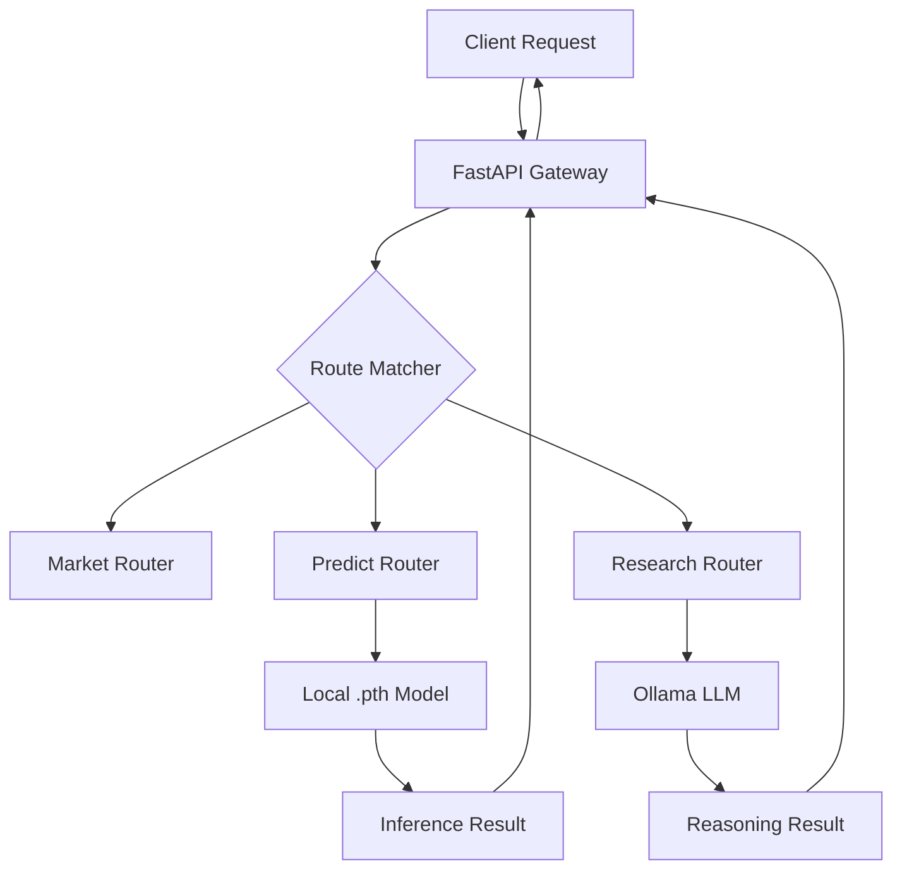

# Server API Layer

The Server API Layer serves as the centralized orchestration gateway for the AI Financial Intelligence System. Built on **FastAPI**, it implements an asynchronous, non-blocking request-response cycle that bridges the Frontend Experience Layer with the underlying AI Model Orchestration and Data Engineering pipelines. This layer manages the application lifecycle, including dynamic model weight synchronization, cross-origin resource sharing (CORS), and health monitoring of dependent LLM services.

### System Role & Architectural Position

The API layer acts as the primary ingress point, decoupling the client-side interface from the compute-heavy inference engines. It is responsible for translating HTTP requests into internal service calls and managing the state of the system's binary assets (model checkpoints).

| Specification | Detail |
| :--- | :--- |
| **Framework** | FastAPI (Python 3.10+) |
| **Concurrency Model** | ASGI (Asynchronous Server Gateway Interface) |
| **Weight Storage** | Supabase Storage (S3-compatible) |
| **LLM Backend** | Ollama (via REST API) |
| **Routing Pattern** | Modular APIRouter decomposition |
| **Static Assets** | Integrated `StaticFiles` mounting for frontend distribution |

### Core Execution & Data Flow Mechanics

The server follows a strict boot sequence to ensure that the inference engine is hydrated with the latest trained weights before accepting prediction requests.



**Lifecycle Execution Sequence:**
1. **Lifespan Trigger:** On startup, the `lifespan` asynccontextmanager is invoked.
2. **Weight Validation:** The system checks for the existence of `best_model.pth` in the root directory.
3. **Remote Synchronization:** If missing, the server performs an authenticated `GET` request to Supabase Storage using the `SUPABASE_KEY`.
4. **Fallback Logic:** If the private authenticated endpoint fails, the system attempts a fetch from the public storage bucket.
5. **Asset Persist:** The binary stream is written to disk in 8KB chunks to prevent memory spikes during large model downloads.
6. **Route Registration:** Five domain-specific routers (`market`, `news`, `predict`, `analyze`, `research`) are mounted to the application instance.

### Implementation Deep Dive

#### Model Hydration Logic
The `lifespan` handler ensures that the server is "warm" before it begins serving traffic, preventing `FileNotFoundError` during the first inference call to the `/predict` endpoint.

```python title="api/main.py"
@asynccontextmanager
async def lifespan(app: FastAPI):
    """Startup and shutdown events."""
    if not _MODEL_PATH.exists():
        try:
            download_url = f"{SUPABASE_URL}/storage/v1/object/models/best_model.pth"
            headers = {"apikey": SUPABASE_KEY, "Authorization": f"Bearer {SUPABASE_KEY}"}
            
            response = requests.get(download_url, headers=headers, stream=True)
            if response.status_code != 200:
                public_url = f"{SUPABASE_URL}/storage/v1/object/public/models/best_model.pth"
                response = requests.get(public_url, headers=headers, stream=True)
            response.raise_for_status()

            with open(_MODEL_PATH, "wb") as f:
                for chunk in response.iter_content(chunk_size=8192):
                    f.write(chunk)
        except Exception as e:
            print(f"Could not download weights: {e}")
    yield
```
**Technical Breakdown:**
- `asynccontextmanager`: Manages the state before and after the FastAPI application starts.
- `stream=True`: Prevents loading the entire model binary into RAM, utilizing a generator to write chunks directly to the filesystem.
- `SUPABASE_KEY` Header: Implements Bearer token authentication for secure access to the `models/` bucket.

#### System Health & Dependency Monitoring
The `/health` endpoint provides a real-time status report of the server's internal state and its connectivity to the Ollama LLM instance.

```python title="api/main.py"
@app.get("/health")
async def health_check():
    from src.config import config
    ollama_status = "unknown"
    try:
        resp = requests.get(f"{config.llm.base_url}/api/tags", timeout=3)
        if resp.status_code == 200:
            models = [m["name"] for m in resp.json().get("models", [])]
            ollama_status = f"running (models: {', '.join(models) if models else 'none'})"
        else:
            ollama_status = "running (no models)"
    except Exception:
        ollama_status = "not reachable"

    return {
        "status": "healthy",
        "service": "AI Financial Intelligence System",
        "model_loaded": _MODEL_PATH.exists(),
        "ollama": ollama_status,
    }
```
**Technical Breakdown:**
- `config.llm.base_url`: Dynamically resolved URL for the Ollama service.
- `/api/tags`: Queries the Ollama API to verify not just connectivity, but the presence of loaded LLM models (e.g., Llama 3).
- `_MODEL_PATH.exists()`: A boolean check confirming that the PyTorch `.pth` file is present for the Transformer model.

### Method / State Reference & Error Recovery

#### Environment Configuration
The API layer relies on the following environment variables for secure asset retrieval and infrastructure mapping.

| Variable | Required | Default/Fallback | Description |
| :--- | :--- | :--- | :--- |
| `SUPABASE_URL` | Yes | `https://oqyqnndynmgthsmmzhpy...` | Base URL for Supabase API/Storage. |
| `SUPABASE_KEY` | Yes | `SUPABASE_ANON_KEY` | API key for authenticated storage access. |
| `LLM_BASE_URL` | Yes | Defined in `src.config` | Endpoint for the Ollama local LLM service. |

#### API Failure Modes & Recovery

| Failure Scenario | System Response | Recovery Mechanism |
| :--- | :--- | :--- |
| **Supabase Auth Failure** | HTTP 401/403 during weight fetch | Automatic fallback to public storage bucket endpoint. |
| **Weight Download Timeout** | Exception caught in `lifespan` | Server starts in "Degraded Mode"; `/predict` endpoints return 500. |
| **Ollama Service Down** | `requests.get` timeout in `/health` | `ollama_status` set to `"not reachable"`; frontend disables reasoning features. |
| **Frontend Asset Missing** | `_FRONTEND_DIR.exists()` is False | Static mount is skipped; root endpoint returns 404. |
| **CORS Violation** | Browser blocks request | `CORSMiddleware` configured with `allow_origins=["*"]` to permit cross-domain traffic. |