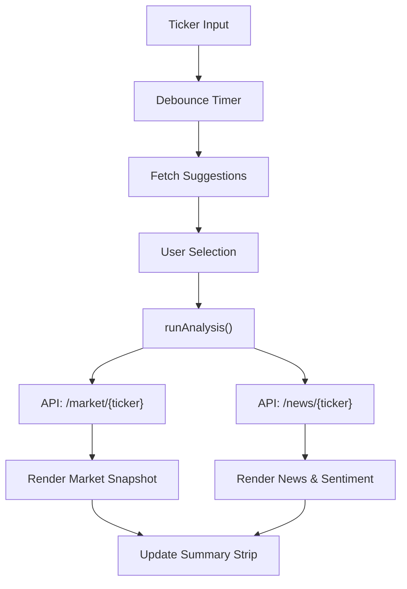

# Frontend Experience Layer

## Section A: System Role & Architectural Position

The Frontend Experience Layer serves as the presentation and orchestration interface for the AI-powered Financial Intelligence System. It is implemented as a high-performance, zero-framework Vanilla JavaScript application to minimize bundle overhead and maximize DOM manipulation speed. The layer is responsible for translating complex analytical outputs from the FastAPI backend—including Transformer-based forecasts and LLM-generated research—into an institutional-grade fintech dashboard.

### Technical Specifications & Dependencies

| Specification | Detail | Implementation / Dependency |
| :--- | :--- | :--- |
| **Architecture** | Single Page Application (SPA) | Vanilla JS / HTML5 / CSS3 |
| **State Pattern** | Centralized Mutable State Object | `const state` (Global scope) |
| **Rendering Strategy** | Imperative DOM Manipulation | `document.querySelector` / Template Literals |
| **API Communication** | Asynchronous REST | `fetch` API with `Promise.allSettled` |
| **Design System** | Institutional Dark Theme | CSS Custom Properties (Tokens) |
| **Visualizations** | Canvas / Dynamic HTML | HTML5 Canvas (Forecasts) / CSS Grid (Signals) |

## Section B: Core Execution & Data Flow Mechanics

The frontend operates on a request-response cycle triggered primarily by ticker symbol updates. The orchestration logic ensures that multiple asynchronous data streams (market data, sentiment, and news) are synchronized before final rendering to prevent layout shift.

### Data Acquisition Workflow



### Execution Pipeline Key Points

*   **Input Debouncing:** To prevent API rate-limiting during ticker searches, the `initSearch` function implements a 150ms debounce timer, delaying the `fetchSuggestions` call until user input pauses.
*   **Concurrent Request Handling:** The `runAnalysis` function utilizes `Promise.allSettled` to fire requests for market data and news sentiment in parallel. This prevents a failure in the news pipeline from blocking the rendering of critical price data.
*   **View Orchestration:** The system uses a data-attribute driven navigation system (`data-view`). Clicking a `.nav-tab` toggles the `.active` class across `.view` sections, ensuring only the required DOM tree is visible.
*   **Signal Classification:** Raw text signals from the backend (e.g., "Bullish", "Overbought") are passed through a `classifySignal` heuristic to map them to specific CSS classes (`bullish`, `bearish`, `neutral-s`) for immediate visual interpretation.

## Section C: Implementation Deep Dive

### Search and Autocomplete Logic
The search system implements a custom keyboard navigation handler to allow professional-grade interaction (Arrow keys, Enter, and "/" shortcut).

```javascript title="frontend/app.js"
async function fetchSuggestions(q) {
  try {
    const res = await fetch(`${API_BASE}/market/tickers/search?q=${encodeURIComponent(q)}`);
    const data = await res.json();
    selectedIdx = -1;
    if (!data.length) { dropdown.classList.remove('active'); return; }
    dropdown.innerHTML = data.slice(0, 8).map((t, i) =>
      `<div class="ticker-dropdown-item" data-symbol="${t.symbol}">
         <span class="ticker-symbol">${t.symbol}</span>
         <span class="ticker-name">${t.name}</span>
       </div>`
    ).join('');
    dropdown.classList.add('active');
    dropdown.querySelectorAll('.ticker-dropdown-item').forEach(item => {
      item.addEventListener('click', () => pickTicker(item.dataset.symbol));
    });
  } catch (e) { /* silent */ }
}
```
**Mechanics:**
1.  **Encoding:** Uses `encodeURIComponent` to sanitize the query string.
2.  **Slicing:** Limits results to the top 8 matches to maintain DOM performance.
3.  **Mapping:** Dynamically generates HTML fragments using template literals for rapid insertion into the `#ticker-dropdown` container.

### Analysis Pipeline Orchestration
The `runAnalysis` function acts as the primary controller for the dashboard's data state.

```javascript title="frontend/app.js"
async function runAnalysis() {
  showLoading('Fetching market data...');
  try {
    const [marketRes, newsRes] = await Promise.allSettled([
      fetch(`${API_BASE}/market/${state.ticker}`),
      fetch(`${API_BASE}/news/${state.ticker}?max_articles=10&include_sentiment=true`),
    ]);

    if (marketRes.status === 'fulfilled' && marketRes.value.ok) {
      state.market = await marketRes.value.json();
      renderMarket(state.market);
    } else {
      toast('Market data unavailable', 'error');
    }

    if (newsRes.status === 'fulfilled' && newsRes.value.ok) {
      state.news = await newsRes.value.json();
      renderNews(state.news);
      renderSentiment(state.news.sentiment);
    } else {
      toast('News data unavailable', 'error');
    }

    renderStrip();
    toast(`Analysis complete for ${state.ticker}`, 'success');
  } catch (err) {
    toast(`Analysis failed: ${err.message}`, 'error');
  } finally {
    hideLoading();
  }
}
```
**Mechanics:**
1.  **State Update:** Populates the global `state` object with `market` and `news` payloads.
2.  **Decoupled Rendering:** Calls specific render functions (`renderMarket`, `renderNews`, `renderSentiment`) based on which promises were fulfilled.
3.  **UI Feedback:** Integrates a `toast` notification system to provide non-blocking error reporting.

### Truth Engine Visualization
The frontend renders the multi-pillar verification score provided by the backend's Truth Engine.

```javascript title="frontend/app.js"
function renderTruthPillars(pillars) {
  const items = [
    { name: 'Consistency', val: pillars.consistency || 0 },
    { name: 'Credibility', val: pillars.credibility || 0 },
    { name: 'Temporal', val: pillars.temporal || 0 },
    { name: 'Contradiction', val: pillars.contradiction_penalty || 0 },
  ];
  $('#truth-pillars').innerHTML = items.map((p) => `
    <div class="pillar-item">
      <span class="pillar-name">${p.name}</span>
      <div class="pillar-bar-wrap">
        <div class="pillar-bar" style="width:${Math.min(p.val * 100, 100)}%; background:${p.name === 'Contradiction' ? 'var(--red)' : 'var(--accent)'}"></div>
      </div>
      <span class="pillar-val">${p.val.toFixed(2)}</span>
    </div>
  `).join('');
}
```
**Mechanics:**
1.  **Normalization:** Ensures the bar width does not exceed 100% using `Math.min`.
2.  **Conditional Styling:** Specifically targets the 'Contradiction' pillar to render in `var(--red)`, while others use `var(--accent)`.

## Section D: Method / State Reference & Error Recovery

### Global State Schema

| Key | Type | Description | Update Trigger |
| :--- | :--- | :--- | :--- |
| `ticker` | `string` | Currently analyzed asset symbol (e.g., "AAPL") | Search input / Dropdown selection |
| `market` | `object\|null` | Market indicators and technical signals | `runAnalysis()` $\rightarrow$ `/market` |
| `news` | `object\|null` | News articles, sentiment scores, and truth pillars | `runAnalysis()` $\rightarrow$ `/news` |
| `forecast` | `object\|null` | Transformer-based price predictions | `runForecast()` $\rightarrow$ `/predict` |
| `research` | `object\|null` | LLM-generated research report | `runResearch()` $\rightarrow$ `/research` |
| `loading` | `boolean` | Global UI loading state | Start/End of any async operation |

### API Contract Interface

| Frontend Action | Endpoint | Method | Payload/Params | Expected Response |
| :--- | :--- | :--- | :--- | :--- |
| Ticker Search | `/market/tickers/search` | `GET` | `q={query}` | `Array<{symbol, name}>` |
| Full Analysis | `/market/{ticker}` | `GET` | `ticker` | `Indicator/Signal Object` |
| News Analysis | `/news/{ticker}` | `GET` | `max_articles`, `include_sentiment` | `Articles/Sentiment Object` |
| Price Forecast | `/predict/{ticker}` | `POST` | `days` (Query Param) | `Prediction Sequence` |
| Health Check | `/health` | `GET` | None | `{"status": "ok"}` |

### Failure Modes & Recovery

| Failure Mode | Trigger | Mitigation Strategy |
| :--- | :--- | :--- |
| **API Timeout** | Network latency $> 3000\text{ms}$ | `AbortSignal.timeout(3000)` used in `checkHealth()`. |
| **Malformed Ticker** | User enters invalid symbol | Backend returns 404; Frontend triggers `toast('Market data unavailable', 'error')`. |
| **Partial Data Load** | News API fails, Market API succeeds | `Promise.allSettled` ensures `renderMarket` executes even if `renderNews` fails. |
| **Empty Dataset** | Ticker has no news coverage | `.join('') \|\| '<p class="table-empty">No news available</p>'` fallback logic. |