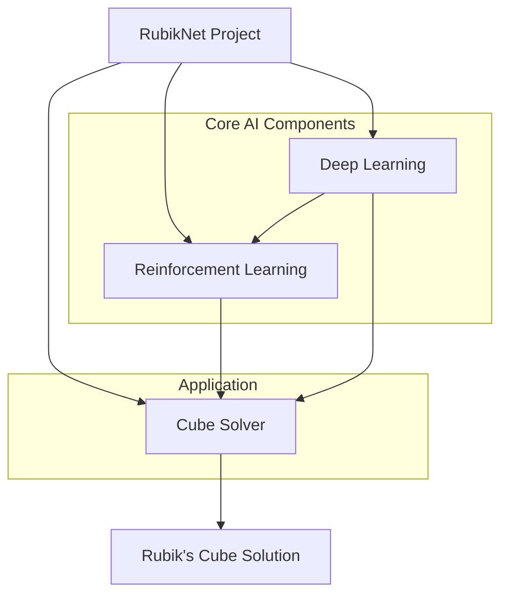
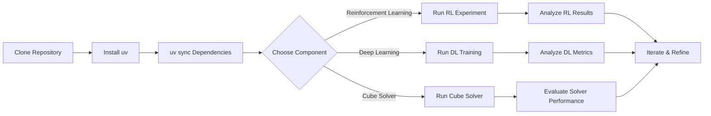

 # Project Overview and Introduction

RubikNet is an ambitious project that delves into the fascinating intersection of Artificial Intelligence and robotics, specifically focusing on solving the iconic Rubik's Cube. This initiative leverages state-of-the-art techniques including **Reinforcement Learning (RL)**, **Deep Learning (DL)**, and **Search-based Solvers** to explore efficient and intelligent solutions for the cube. The core objective is to build a robust system capable of understanding, strategizing, and ultimately solving scrambled Rubik's Cube states.

This document provides a high-level overview of the RubikNet project, outlining its primary components, their individual goals, and how they collectively contribute to the overarching vision.

## Project Architecture

The RubikNet project is modularly organized into three distinct yet interconnected components, each addressing a specific aspect of the AI-driven cube-solving challenge: Reinforcement Learning, Deep Learning, and the Cube Solver itself.

<p align="center">
  
</p>





## Reinforcement Learning

The `reinforcement_learning` folder houses experiments centered around **RL agents** trained on classic control environments. These foundational experiments are crucial for developing an understanding of RL principles and building the necessary skills before tackling more complex tasks like solving the Rubik's Cube.

The repository includes implementations and solutions for several well-known environments:

*   **CartPole**: This environment involves balancing a pole on a cart by moving the cart left or right. It's a classic example for introducing policy gradients and value-based methods.
*   **Taxi**: A grid-world environment where an agent learns to navigate a taxi to pick up a passenger from one location and drop them off at another, handling multiple destinations.
*   **MountainCar**: Here, an underpowered car needs to drive up a steep hill. The agent learns to oscillate back and forth to build enough momentum to reach the goal.
*   **Blackjack**: This project explores learning optimal strategies for the card game using Monte Carlo methods, demonstrating how RL can be applied to discrete, episodic tasks.

These experiments serve as a practical ground for applying various RL algorithms and understanding their performance characteristics.
[View Reinforcement Learning folder on GitHub](https://github.com/Archaive16/RubikNet/tree/main/reinforcement_learning)

## Deep Learning

The `deep_learning` folder is designed as an **introduction to deep learning** concepts. It provides a structured approach to understanding neural networks, their architecture, and how they learn from data. This section is fundamental for anyone looking to grasp the basics before diving into more advanced topics like Reinforcement Learning and Cube Solvers, which often rely on deep learning architectures.

Key topics covered include:

*   **Neural Network Basics**: Explaining the fundamental building blocks of neural networks, including neurons, layers, activation functions, and the forward/backward propagation process.
*   **Hands-on Projects**: Practical implementations to solidify understanding. A notable example is:
    *   **Fashion Classification (Fashion-MNIST)**: A project where a neural network is trained to classify images of clothing articles from the Fashion-MNIST dataset. This provides a tangible experience of building, training, and evaluating a deep learning model.

This component ensures a solid theoretical and practical foundation in deep learning, essential for the more complex AI tasks within RubikNet.
[View Deep Learning folder on GitHub](https://github.com/Archaive16/RubikNet/tree/main/deep_learning)

## Cube Solver

The `cube_solver` folder contains the core **solver logic** for the Rubik’s Cube. This is where the advanced AI techniques converge to find solutions for scrambled cube states. The implementations draw from both modern deep learning approaches and classical search algorithms.

<p align="center">
  
</p>

The primary methodologies explored include:

1.  **Autodidactic Iteration (ADI)**: This project implements ADI, a form of Self-Supervised Learning, for cube solving. ADI allows the model to learn to solve the cube by generating its own training data, essentially teaching itself by playing against itself. This approach is highly effective for complex search spaces like the Rubik's Cube.
    [View ADI implementation details on GitHub](https://github.com/Archaive16/RubikNet/tree/main/cube_solver/adi_implementation)

    ```python
    # Snippet demonstrating a core concept in ADI,
    # often involves sampling states and predicting moves
    # from rubiknet.cube_solver.adi_implementation.model import CubeSolverModel
    # from rubiknet.cube_solver.adi_implementation.trainer import ADITrainer

    # Initialize a cube solver model
    # model = CubeSolverModel(input_shape=(54,), num_moves=12)

    # Instantiate the ADI trainer
    # trainer = ADITrainer(model, dataset, epochs=100)
    # trainer.train()
    print("Example snippet for ADI model setup.")
    print("# Training typically involves generating scrambled states")
    print("# and learning optimal moves or value functions.")
    ```

2.  **Classical Search Approaches**: Alongside ADI, the project incorporates traditional search algorithms. These methods often involve exploring the state space of the cube to find a sequence of moves from a scrambled state to the solved state. Algorithms like A\* search or Breadth-First Search (BFS) with heuristics are commonly used here.

<p align="center">
  
</p>
<p align="center">
  
</p>

The cube solver component is designed to be standalone, meaning it can be used independently to find solutions for various scrambled states. Performance analysis of these solvers, including average solve time and success rate, is also part of this section.

<p align="center">
  
</p>

For detailed instructions on implementing and running the full solver, refer to the `README.md` within the `cube_solver` folder.
[View Cube Solver folder on GitHub](https://github.com/Archaive16/RubikNet/tree/main/cube_solver)

## Usage and Setup

To get the RubikNet project up and running, we highly recommend using [uv](https://docs.astral.sh/uv/) for efficient environment management. `uv` is a fast Python package installer and resolver.

### Initial Project Setup

The following steps will guide you through setting up your development environment for RubikNet:

1.  **Clone the Repository**: Start by cloning the RubikNet repository to your local machine.

    ```bash
    git clone https://github.com/Archaive16/RubikNet
    ```

    [View Repository on GitHub](https://github.com/Archaive16/RubikNet)

2.  **Install `uv`**: If you don't already have `uv` installed, you can install it using `pip`.

    ```bash
    pip install uv
    ```

3.  **Sync Dependencies**: Navigate into the cloned repository directory and use `uv sync` to install all project dependencies.

    ```bash
    cd RubikNet
    uv sync
    ```

    This command will create a virtual environment and install all packages listed in `pyproject.toml` or `requirements.txt` (if present) efficiently.

### Example: Running a Reinforcement Learning Experiment

After setting up the environment, you can run an experiment, for instance, the CartPole RL agent.

```bash
# Navigate to the reinforcement learning directory
cd reinforcement_learning/cartpole

# Run the CartPole script
# The exact command might vary based on the script name,
# e.g., python train_cartpole.py or similar.
python your_cartpole_script_name.py
```

[View CartPole example on GitHub](https://github.com/Archaive16/RubikNet/tree/main/reinforcement_learning/cartpole)

### Example: Deep Learning Fashion-MNIST Training

To run the Deep Learning Fashion-MNIST classification example:

```bash
# Navigate to the deep learning directory for Fashion-MNIST
cd deep_learning/fashion_classification

# Run the training script
python train_fashion_mnist.py
```

[View Fashion Classification example on GitHub](https://github.com/Archaive16/RubikNet/tree/main/deep_learning/fashion_classification)

## Project Workflow Diagram

This diagram illustrates the typical high-level workflow when developing or experimenting with the RubikNet project.





## Connect with Us

The RubikNet project is the result of collaborative effort. Feel free to connect with the primary contributors:

#### Arhan Chavare
[](https://github.com/Archaive16)

#### Rigvedi Borchate
[](https://github.com/rigvedi-3301)

## Acknowledgements

We extend our sincere gratitude to the following for their invaluable support and guidance throughout the RubikNet project:

*   **[SRA VJTI](http://sra.vjti.info/)**, Eklavya 2025: For providing the platform and resources for this project.
*   **Ansh Semwal and Akash Kawle**: Special thanks to our mentors for their continuous support, insights, and expert guidance.