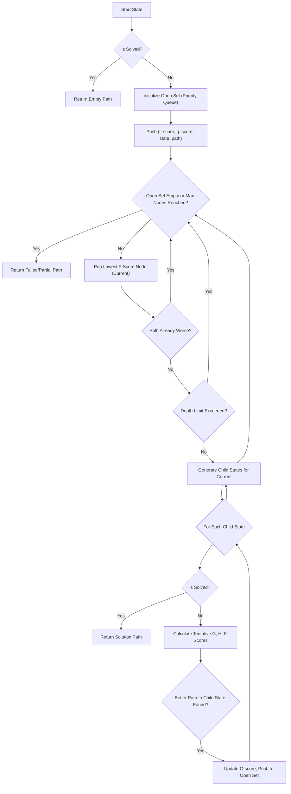
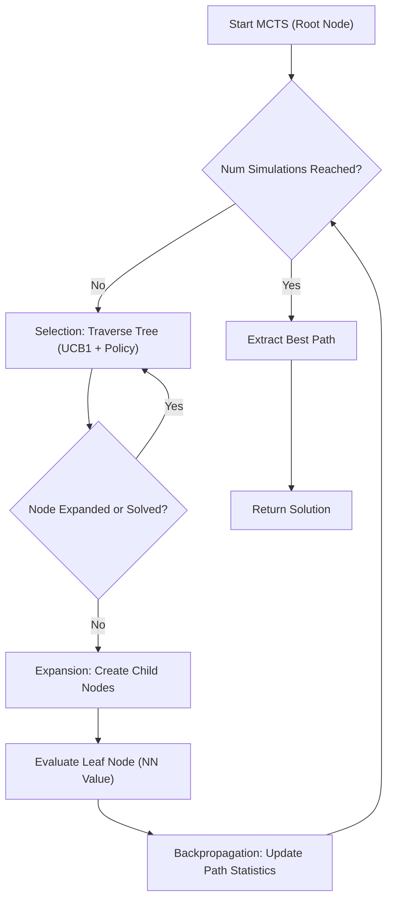

 # Search Algorithms and Heuristics

This section details the search algorithms employed within the Rubik's Cube solver, focusing on A\*, Beam Search, and Monte Carlo Tree Search (MCTS). These algorithms, often augmented with neural network-based heuristics, are critical for navigating the vast state space of the Rubik's Cube to find a solution path.

## A\* Search Algorithm

The A\* search algorithm is an informed search algorithm that efficiently finds the shortest path between nodes in a graph. In the context of the Rubik's Cube, nodes represent cube states, and edges represent single moves. A\* uses a heuristic function to guide its search, prioritizing paths that appear to be closer to the goal state.

The `AStar` class ([View on GitHub](https://github.com/Archaive16/RubikNet/blob/main/cube_solver/scripts/a_star.py)) implements this algorithm.

### Core Components

*   **Heuristic Function (h(n))**: The A\* implementation uses a combined heuristic:
    1.  **Neural Network Model Value**: The `ADI` (Adaptive DeepCube Inference) model predicts a value indicating how "close" a state is to being solved. A higher value means closer to the solved state. The `get_model_value` method queries this model.
    2.  **Misplaced Pieces Count**: A simple heuristic that counts the number of stickers not on their correct face, providing a baseline estimate of moves required.
    These are combined to form `h_score = -model_val + 0.1 * misplaced`.

    ```python
    def get_model_value(self, state_list):
        """Get value from neural network (higher = better/closer to solved)"""
        try:
            state_tensor = self._tensor_from_state_list(state_list)
            with torch.no_grad():
                policy_logits, value = self.model(state_tensor)
            return float(value.item() if torch.is_tensor(value) else value)
        except Exception as e:
            print(f"Model error: {e}")
            return 0.0

    def count_misplaced_pieces(self, state_list):
        # Count number of stickers that do not match their face center color
        if len(state_list) != 54:
            return 54
        # ... implementation details ...
        return misplaced
    ```
    [[View on GitHub](https://github.com/Archaive16/RubikNet/blob/main/cube_solver/scripts/a_star.py#L90-L121)]

*   **Cost Function (g(n))**: This represents the actual cost from the start node to the current node, which is simply the number of moves (depth) taken to reach the current cube state.

*   **Evaluation Function (f(n))**: A\* combines these as `f(n) = g(n) + h(n)`, aiming to minimize this total estimated cost.

### Search Process

The `a_star_search` method uses a priority queue (`heapq`) to manage `open_set` nodes. Each node stores its `f_score`, `g_score`, unique state key, actual state, and the path taken to reach it.

```python
def a_star_search(self, start_state, max_nodes=50000, max_depth=25):
    # ...
    open_set = []  # Priority queue for A* nodes
    # ...
    g_score = 0  # Cost from start node
    h_score = -self.get_model_value(start_list)  # Heuristic (model value)
    f_score = g_score + h_score
    heapq.heappush(open_set, (f_score, g_score, start_key, start_list, []))
    # ...
    while open_set and nodes_expanded < max_nodes:
        current_f, current_g, current_key, current_state, current_path = heapq.heappop(open_set)
        # ... generate children, calculate new f_score, push to open_set ...
    # ...
```
[[View on GitHub](https://github.com/Archaive16/RubikNet/blob/main/cube_solver/scripts/a_star.py#L123-L194)]

### A\* Search Flow





## Beam Search Algorithm

Beam Search is a greedy, best-first search algorithm that explores a graph by expanding the most promising nodes in a limited set. Unlike A\* which explores nodes based on a global priority queue, Beam Search only keeps a fixed number (`beam_width`) of the best nodes at each search depth. This makes it more memory-efficient but sacrifices optimality guarantees.

The `BeamSearch` class ([View on GitHub](https://github.com/Archaive16/RubikNet/blob/main/cube_solver/scripts/beam.py)) implements this approach.

### Heuristic Function

The `BeamSearch` implementation uses a different combined heuristic, `node_score`:

1.  **Heuristic by Centers**: Counts how many stickers on each face match their respective center sticker. A higher count implies a more organized face.
2.  **Neural Network Model Value**: Similar to A\*, the `ADI` model provides a value prediction for the state.

```python
class BeamSearch:
    # ...
    def _heuristic_by_centers(self, state_list):
        # Heuristic: count stickers matching center color on each face
        # ...
        return float(score)

    def _model_value_score(self, state_tensor):
        # Get predicted value from ADI model for given state
        # ...
        return float(v)

    def search(
        self,
        start_state,
        beam_width=5,
        max_depth=20,
        prune_inverses=True,
        avoid_repeats=True
    ):
        # ...
        def node_score(state_list):
            base = self._heuristic_by_centers(state_list)
            st = self._tensor_from_state_list(state_list)
            mv = self._model_value_score(st)
            if mv is None:
                return base
            return base + 50.0 * mv
        # ...
```
[[View on GitHub](https://github.com/Archaive16/RubikNet/blob/main/cube_solver/scripts/beam.py#L86-L127)]

### Search Process

The `search` method iteratively expands nodes layer by layer up to `max_depth`. At each depth, it generates all possible child states from the current beam, scores them using `node_score`, and then selects only the top `beam_width` candidates to form the next beam. It also incorporates pruning mechanisms to avoid inverse moves and repeated states.

```python
    def search(self, start_state, beam_width=5, max_depth=20, prune_inverses=True, avoid_repeats=True):
        # ...
        beam = [(s_list, [], None, node_score(s_list))]  # (state, path, last_move, score)
        seen = {start_key: 0}

        for depth in range(1, max_depth + 1):
            candidates = []
            for state_list, path, last_move, _ in beam:
                # ... generate child states ...
                for idx, child in enumerate(child_states):
                    # ... prune inverses, avoid repeats ...
                    sc = node_score(child)
                    candidates.append((child, path + [move], move, sc))
            
            if not candidates:
                return [], False

            candidates.sort(key=lambda x: x[3], reverse=True) # Sort by score
            beam = candidates[:beam_width] # Keep only top `beam_width`
            # ...
```
[[View on GitHub](https://github.com/Archaive16/RubikNet/blob/main/cube_solver/scripts/beam.py#L131-L188)]

## Monte Carlo Tree Search (MCTS)

Monte Carlo Tree Search (MCTS) is a heuristic search algorithm for some kinds of decision processes, most notably in games. It combines the generality of random simulations with the precision of tree search. The `mcts.py` file ([View on GitHub](https://github.com/Archaive16/RubikNet/blob/main/cube_solver/scripts/mcts.py)) implements an MCTS approach, heavily integrated with a neural network.

### MCTSNode

The core of the MCTS implementation is the `MCTSNode` class, which represents a state in the search tree. Each node stores:

*   **State**: The encoded Rubik's Cube state.
*   **Parent/Action**: Links to build the tree structure.
*   **Action Statistics**: `visit_counts`, `value_sums`, `virtual_losses` for each possible move, and `total_visits` for the node itself. These track the outcomes of simulations.
*   **Neural Network Evaluation**: `policy_probs` (probability distribution over actions) and `value` (estimated win rate/closeness to solved) obtained directly from the `ADI` model.

```python
class MCTSNode:
    def __init__(self, state, model, parent=None, action_from_parent=None):
        self.state = state
        # ...
        self.visit_counts = np.zeros(12)
        self.value_sums = np.zeros(12)
        self.virtual_losses = np.zeros(12)
        self.total_visits = 0
        
        self.policy_probs, self.value = self._evaluate_state(model)
        self.is_solved = self._check_solved()
        # ...
```
[[View on GitHub](https://github.com/Archaive16/RubikNet/blob/main/cube_solver/scripts/mcts.py#L51-L69)]

### MCTS Search Phases

The `mcts_search` function orchestrates the main MCTS loop, which consists of four phases for each `simulation`:

1.  **Selection**: Starting from the root, the algorithm traverses the tree by selecting the child node that maximizes the Upper Confidence Bound 1 (UCB1) score, modified with policy priors from the neural network. This balances exploration (visiting less-explored nodes) and exploitation (visiting promising nodes).
    ```python
    def select_action(self, c_puct=4.0):
        # UCB1 action selection with policy priors
        # ...
        q_value = (self.value_sums[action] - self.virtual_losses[action]) / self.visit_counts[action]
        exploration = c_puct * self.policy_probs[action] * sqrt_total / (1 + self.visit_counts[action])
        ucb_scores.append(q_value + exploration)
        # ...
        return np.argmax(ucb_scores)
    ```
    [[View on GitHub](https://github.com/Archaive16/RubikNet/blob/main/cube_solver/scripts/mcts.py#L90-L107)]

2.  **Expansion**: When a leaf node (a node that has not been fully expanded) is reached, new child nodes are created for all possible next moves. Each new node is initialized with its own policy and value from the neural network.

3.  **Simulation (or Evaluation)**: In this implementation, a "simulation" is effectively the direct value prediction from the `ADI` neural network model at the expanded leaf node. There isn't a long rollout phase, as the neural network provides a strong heuristic.

4.  **Backpropagation**: The value obtained from the simulation is propagated back up the tree to the root. The `visit_counts` and `value_sums` of all nodes along the selected path are updated. `Virtual losses` are used to manage concurrent simulations, preventing multiple simulations from exploring the same path.

### MCTS Search Flow





## Key Integration Points

The search algorithms heavily rely on the `ADI` (Adaptive DeepCube Inference) neural network model for their heuristic functions. This model acts as a "gut feeling" or "intuition" for the solver, guiding it towards states that are likely closer to a solution.

*   **State Encoding/Decoding**: All algorithms require the cube state to be converted into a one-hot encoded tensor for the neural network and back into a readable format.
    ```python
    # Example from a_star.py (similar in beam.py and mcts.py)
    def encode_cube_state(self, state_str):
        # Convert cube state (string) to one-hot encoded vector
        encoded = []
        for color in state_str:
            encoded.extend(self.color_map[color])
        return encoded
    
    def decode_cube_state(self, encoded_state):
        # Convert one-hot encoded vector back to cube color list
        # ...
        return decoded
    ```
    [[View on GitHub](https://github.com/Archaive16/RubikNet/blob/main/cube_solver/scripts/a_star.py#L42-L68)]

*   **`Cube` Class Interaction**: The `Cube` class provides essential functionalities like generating child states (`get_cube_child_states`), checking if a state is solved (`is_solved()`), and applying moves (`move()`). This abstraction allows the search algorithms to operate independently of the cube's internal representation details, focusing solely on state transitions and evaluations.

    ```python
    def get_cube_child_states(self, cube):
        # Generate all possible next states from current cube state
        children = []
        original_state = cube.state.copy()

        for move in cube.moves:
            child_cube = Cube(state=original_state.copy())
            child_cube.move(move)
            children.append(child_cube.state.copy())
        return children
    ```
    [[View on GitHub](https://github.com/Archaive16/RubikNet/blob/main/cube_solver/scripts/a_star.py#L30-L39)]

The choice between A\*, Beam Search, or MCTS depends on the desired balance between solution optimality, search speed, and computational resources. A\* guarantees an optimal solution if the heuristic is admissible (never overestimates the cost to the goal), but can be memory-intensive. Beam Search offers a faster, memory-constrained alternative but doesn't guarantee optimality. MCTS, particularly when combined with strong neural network priors, is highly effective for complex problems with large branching factors, making it a powerful approach for Rubik's Cube solving.