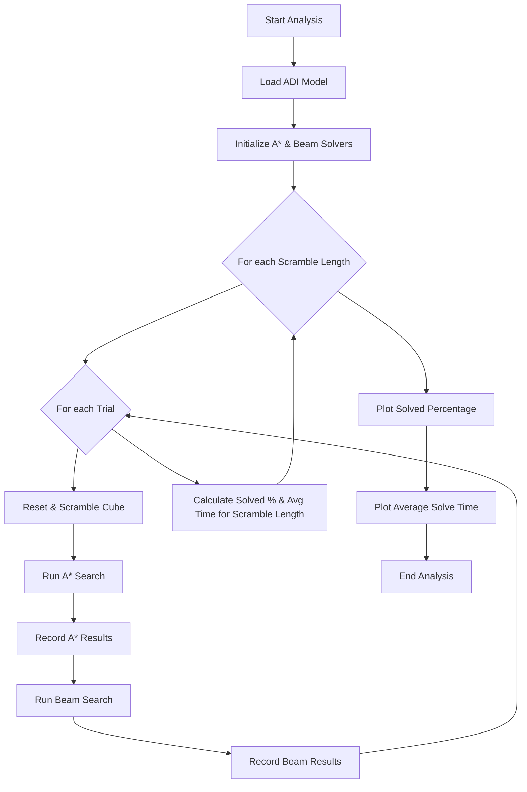

 # Solver Utilities and Analysis

This section details the utility scripts within the `cube_solver/scripts` directory, designed to support the development and evaluation of the Rubik's Cube solver. These scripts cover essential tasks such as generating datasets for training, capturing real-world cube states, and comprehensively analyzing the performance of different search algorithms.

## Overview

The `cube_solver/scripts` directory provides a set of powerful tools to:

*   **Generate Datasets:** Create structured datasets of scrambled cube states and their transitions, valuable for training machine learning models or testing solver logic.
*   **Capture Cube States:** Interface with a camera to scan physical Rubik's Cubes, converting their visual state into a digital representation.
*   **Analyze Solver Performance:** Conduct experiments to benchmark the efficiency and success rates of implemented search algorithms (A* and Beam Search) across varying scramble lengths.

## 1. Solver Performance Analysis (`analysis.py`)

The `analysis.py` script is crucial for evaluating the effectiveness and speed of the A* and Beam Search algorithms. It orchestrates experiments by scrambling a Rubik's Cube to various depths, running each solver, and then plotting the results to visualize performance metrics like solved percentage and average solve time.

**Key Features:**

*   **Experimentation Loop:** Runs multiple trials for different scramble lengths, providing a robust statistical overview.
*   **Solver Integration:** Seamlessly integrates with the `AStar` and `BeamSearch` implementations, both leveraging a pre-trained ADI model.
*   **Performance Metrics:** Captures the percentage of cubes solved and the average time taken by each solver.
*   **Visualization:** Utilizes `matplotlib` to generate informative plots, making it easy to compare solver performance.

**Usage:**

To run a performance analysis, simply execute the `analysis.py` script. You can adjust the `max_scramble` and `num_trials` parameters within the `if __name__ == "__main__":` block to control the experiment's scope.

```python
# cube_solver/scripts/analysis.py - Main execution block
if __name__ == "__main__":
    # Run experiments and visualize results
    scramble_lengths, astar_results, beam_results = run_experiments(
        max_scramble=7,   # Maximum scramble depth to test
        num_trials=25     # Number of trials per scramble length
    )

    plot_results(scramble_lengths, astar_results, beam_results)
```

[View on GitHub](https://github.com/Archaive16/RubikNet/blob/main/cube_solver/scripts/analysis.py#L111-L118)

**Experiment Workflow:**

The `run_experiments` function orchestrates the entire process, from loading models to executing trials and collecting data.

```python
# cube_solver/scripts/analysis.py - run_experiments function snippet
def run_experiments(max_scramble=4, num_trials=5):
    # Load trained ADI model
    model = ADI()
    model.load_state_dict(torch.load("deepcube_adi_model.pth", map_location="cpu"))
    model.eval()

    # Initialize solvers
    astar_solver = AStar("deepcube_adi_model.pth")
    beam_solver = BeamSearch("deepcube_adi_model.pth")

    scramble_lengths = list(range(max_scramble))
    # ... (results storage and loop initialization)

    for scramble_len in scramble_lengths:
        # ... (trial loop and solver execution)
        
        # --- A* Search ---
        start_time = time.perf_counter()
        moves_astar, solved = None, False
        try:
            moves_astar, solved = astar_solver.a_star_search(
                start_state=state,
                max_nodes=70000,
                max_depth=20
            )
        except Exception as e:
            print(f"A* failed: {e}")
            solved = False
        elapsed = time.perf_counter() - start_time
        # ... (time capping and result aggregation)
        
        # --- Beam Search ---
        start_time = time.perf_counter()
        moves_beam, solved = None, False
        try:
            moves_beam, solved = beam_solver.search(
                start_state=state,
                beam_width=200,
                max_depth=50
            )
        except Exception as e:
            print(f"Beam failed: {e}")
            solved = False
        elapsed = time.perf_counter() - start_time
        # ... (time capping and result aggregation)
    
    return scramble_lengths, astar_results, beam_results
```

[View on GitHub](https://github.com/Archaive16/RubikNet/blob/main/cube_solver/scripts/analysis.py#L16-L96)

The `plot_results` function takes the collected data and generates two plots: one for solved percentage and another for average solve time, both against scramble length.

```python
# cube_solver/scripts/analysis.py - plot_results function snippet
def plot_results(scramble_lengths, astar_results, beam_results):
    # Plot percentage of cubes solved
    plt.figure(figsize=(10, 5))
    plt.plot(scramble_lengths, astar_results["percent"], marker="o", label="A* Search")
    plt.plot(scramble_lengths, beam_results["percent"], marker="s", label="Beam Search")
    plt.xlabel("Scramble Length")
    plt.ylabel("Solved Percentage (%)")
    plt.title("Solved Percentage vs Scramble Length")
    plt.legend()
    plt.grid(True)
    plt.show()

    # Plot average time taken
    plt.figure(figsize=(10, 5))
    plt.plot(scramble_lengths, astar_results["times"], marker="o", label="A* Search")
    plt.plot(scramble_lengths, beam_results["times"], marker="s", label="Beam Search")
    plt.xlabel("Scramble Length")
    plt.ylabel("Average Solve Time (s)")
    plt.title("Average Solve Time vs Scramble Length")
    plt.legend()
    plt.grid(True)
    plt.show()
```

[View on GitHub](https://github.com/Archaive16/RubikNet/blob/main/cube_solver/scripts/analysis.py#L99-L108)





## 2. Dataset Generation (`dataset.py`)

The `dataset.py` script is designed to create a CSV file containing a dataset of scrambled Rubik's Cube states and their possible next states after applying a single move. This dataset is invaluable for training models that predict optimal moves or for understanding the state space transitions.

**Key Features:**

*   **Scramble Generation:** Scrambles the cube `k` times for `L` different runs, ensuring a diverse set of starting states.
*   **State Capture:** For each step of a scramble, it captures the current cube state (`base_state`) and all possible states (`child_state`) resulting from applying any single move.
*   **CSV Output:** Stores the generated data in a structured CSV format, including details like `scramble_run`, `scramble_step`, `base_move`, `child_move`, `base_state`, and `child_state`.

**Usage:**

To generate a dataset, call the `generate_dataset` function with your desired scramble length `k` and number of scramble runs `L`.

```python
# cube_solver/scripts/dataset.py - generate_dataset function snippet
import csv
from cube import Cube

def generate_dataset(k, L, filename="cube_dataset.csv"):
    cube = Cube()
    moves = cube.moves

    with open(filename, mode="w", newline="") as file:
        writer = csv.writer(file)

        # Write CSV header
        writer.writerow([
            "scramble_run", "scramble_step", "base_move",
            "child_move", "base_state", "child_state"
        ])

        # Perform L scramble runs
        for scramble_run in range(1, L+1):
            cube.reset_cube()
            cube.scramble(k)

            # Get all children for each scramble step
            all_children = cube.get_child_states_at_all_steps()

            for step_num, children in enumerate(all_children, start=1):
                base_state = cube.scramble_states[step_num-1]["state"]
                base_move = cube.scramble_states[step_num-1]["moves"][-1]

                # Write each child move and resulting state
                for child_move, child_cube in zip(moves, children):
                    writer.writerow([
                        scramble_run, step_num, base_move,
                        child_move,
                        ''.join(base_state),
                        ''.join(child_cube.state)
                    ])

    print(f"Dataset saved to {filename}")
```

[View on GitHub](https://github.com/Archaive16/RubikNet/blob/main/cube_solver/scripts/dataset.py#L4-L40)

This dataset is vital for tasks like:
*   **Reinforcement Learning:** Providing state-action pairs for training agents.
*   **Heuristic Learning:** Generating examples to train models that predict heuristics for search algorithms.
*   **Offline Evaluation:** Creating a diverse set of test cases for solver performance.

## 3. Cube State Capture (`state_capture.py`)

The `state_capture.py` script provides a `RubiksCubeScanner` class to digitize the state of a physical Rubik's Cube using a webcam. It guides the user through capturing images of all six faces, processes these images to identify sticker colors, and allows for manual verification and correction.

**Key Features:**

*   **Webcam Integration:** Captures images of each face using `opencv`.
*   **Interactive Capture:** Guides the user with prompts and visual cues for capturing each face.
*   **Color Classification:** Converts HSV color values from image tiles into symbolic 'w', 'r', 'g', 'b', 'y', 'o' representations.
*   **Manual Correction:** Provides an interactive way to correct misclassified colors, ensuring accurate state capture.
*   **State Representation:** Compiles the detected colors into a 54-element array representing the full cube state.

**Usage:**

Instantiate the `RubiksCubeScanner` class and call its `scan()` method to initiate the capture process.

```python
# cube_solver/scripts/state_capture.py - RubiksCubeScanner class overview
class RubiksCubeScanner:
    def __init__(self, size=150):
        self.size = size
        self.face_names = ["front", "back", "top", "bottom", "right", "left"]
        self.face_images = [f"{name}.jpeg" for name in self.face_names]
        self.colors_array = np.empty(54, dtype=object)
        self.index = 0

    # ... (capture_faces, classify_color, process_faces, verify_face methods)

    def scan(self):
        self.capture_faces()
        self.process_faces()
        print("\nFinal Verified Colors:")
        for i in range(54):
            print(f"a[{i}] = {self.colors_array[i]}")
        return self.colors_array.copy()
```

[View on GitHub](https://github.com/Archaive16/RubikNet/blob/main/cube_solver/scripts/state_capture.py#L7-L91)

**Capturing and Processing Faces:**

The `capture_faces` method handles the webcam interaction and saving of face images.

```python
# cube_solver/scripts/state_capture.py - capture_faces method snippet
    def capture_faces(self):
        cap = cv2.VideoCapture(0)
        i = 0
        while i < 6:
            ret, frame = cap.read()
            # ... (frame processing, rectangle drawing, text overlay)
            cv2.imshow("Rubik's Cube Capture", frame)

            key = cv2.waitKey(1) & 0xFF
            if key == 27:  # ESC
                break
            elif key == ord('c'):
                face_filename = self.face_images[i]
                face_crop = frame[centery - self.size:centery + self.size,
                                  centerx - self.size:centerx + self.size]
                cv2.imwrite(face_filename, face_crop)
                print(f"Saved {face_filename}")
                i += 1
        cap.release()
        cv2.destroyAllWindows()
```

[View on GitHub](https://github.com/Archaive16/RubikNet/blob/main/cube_solver/scripts/state_capture.py#L18-L47)

The `process_faces` method iterates through the captured images, divides them into 9 tiles per face, and uses `classify_color` to determine each sticker's color.

```python
# cube_solver/scripts/state_capture.py - process_faces method snippet
    def process_faces(self):
        for face_num, img_path in enumerate(self.face_images):
            img = cv2.imread(img_path)
            hsv = cv2.cvtColor(img, cv2.COLOR_BGR2HSV)
            height, width = hsv.shape[:2]
            tile_h = height // 3
            tile_w = width // 3

            print(f"\nProcessing face: {self.face_names[face_num]}")
            for row in range(3):
                for col in range(3):
                    y = row * tile_h
                    x = col * tile_w
                    tile = hsv[y + tile_h // 4: y + 3 * tile_h // 4,
                               x + tile_w // 4: x + 3 * tile_w // 4]
                    h, s, v = np.mean(tile.reshape(-1, 3), axis=0)
                    color = self.classify_color(h, s, v)

                    if color == "unknown":
                        print(f"\nUnknown color detected at index a[{self.index}]")
                        # ... (manual correction prompt)

                    self.colors_array[self.index] = color
                    self.index += 1

            # ... (verification prompt)
```

[View on GitHub](https://github.com/Archaive16/RubikNet/blob/main/cube_solver/scripts/state_capture.py#L65-L91)


```mermaid
graph TD
    A["Start RubiksCubeScanner"] --> B["Capture All 6 Faces (Webcam)"];
    B --> C{"For each Captured Face"};
    C --> D["Convert Face Image to HSV"];
    D --> E{"For each 3x3 Tile"};
    E --> F["Extract HSV Values"];
    F --> G["Classify Color"];
    G --> H{Color "unknown"?};
    H -->|"Yes"| I["Prompt for Manual Correction"];
    I --> J["Store Color in colors_array"];
    H -->|"No"| J;
    J --> E;
    E --> K["Display Detected Face Colors"];
    K --> L{"Verify Face Colors?"};
    L -->|"Yes"| M["Prompt for Index & New Color"];
    M --> J;
    L -->|"No"| C;
    C --> N["Return Final colors_array"];
```


## Key Integration Points

These utility scripts play a crucial role in the overall Rubik's Cube solver ecosystem:

*   **`analysis.py`** provides the quantitative backbone for comparing and validating improvements to search algorithms. It directly integrates with the `AStar` and `BeamSearch` solver modules and relies on the `ADI` model for heuristic guidance.
*   **`dataset.py`** is essential for any machine learning components. It generates the raw data needed to train heuristic functions or value networks, acting as a data preparation layer.
*   **`state_capture.py`** serves as the bridge between the physical and digital world, enabling users to input real-world cube states into the solver system, making the project practical for physical cubes.

Together, these scripts form a robust set of tools for developing, training, and evaluating a Rubik's Cube solver, streamlining the workflow from data generation to performance benchmarking.