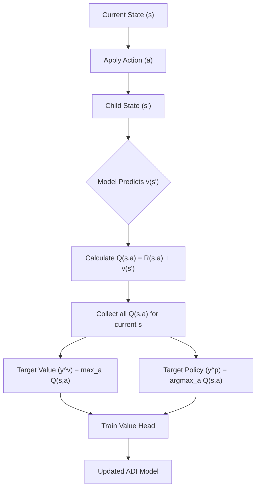
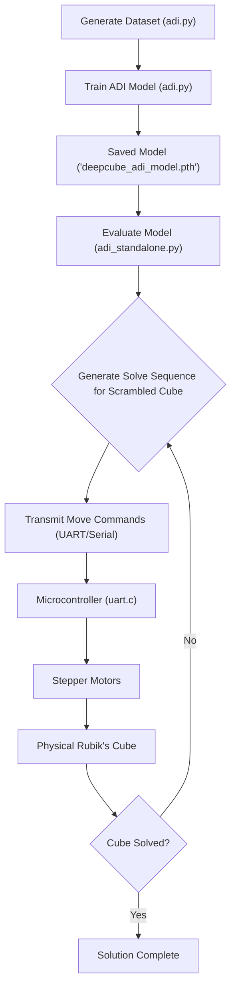

 # ADI Solver Integration

This documentation provides an in-depth look at the Autonomous Device Interface (ADI) solver, a robust solution for the Rubik's Cube problem leveraging advanced deep learning techniques. It covers the core ADI model, its training and standalone evaluation, and the crucial hardware interface for real-world application. The ADI solver addresses the challenge of sparse rewards in reinforcement learning by adopting a self-supervised, backward-learning approach.

## Conceptual Overview: Autodidactic Iteration

The Rubik's Cube presents a formidable challenge for traditional reinforcement learning due to its vast state space ($4.3 \times 10^{19}$ states) and a single, sparse reward state (the solved cube). Random exploration is virtually useless, leading to a critical lack of learning signals. Autodidactic Iteration (ADI) overcomes this by flipping the problem: instead of starting from a random state and searching for the goal, it starts from the solved state and works backward.

The core idea is to generate "solvable states" by applying random moves to a solved cube. These states, by definition, have known solutions, which can then be used as self-supervised training data. The ADI network `f_\theta(s)` outputs two crucial components for each cube state `s`:
- **Value `v(s)`**: An estimate of how close the state `s` is to being solved.
- **Policy `p(s)`**: The probability distribution over possible moves that leads to the best next state.

This backward-learning approach transforms an intractable sparse-reward problem into a manageable self-supervised task, providing a continuous stream of meaningful feedback to the model. For a detailed explanation, refer to the [ADI Blog Post](https://github.com/Archaive16/RubikNet/blob/main/documentation/adi_blog.md).

### ADI Target Computation Logic

The model learns by computing target values and policies based on the predicted outcomes of child states.





## ADI Model (`adi.py`)

The `adi.py` script contains the implementation of the ADI neural network model and its training pipeline. It utilizes PyTorch for efficient GPU-accelerated training.

### Network Architecture

The `ADI` class defines a neural network with shared fully-connected layers, branching into a policy head and a value head.

-   **Input**: A 324-dimensional vector representing the cube's state (one-hot encoded).
-   **Shared Layers**: Two `nn.Linear` layers (`fc1`, `fc2`) with `F.elu` activation.
-   **Policy Head**: Predicts the best move. Consists of `fc3_1` (ELU) and `fc_policy_out` (linear, 12 outputs for 12 possible moves).
-   **Value Head**: Predicts the closeness to the solved state. Consists of `fc3_2` (ELU) and `fc_value_out` (tanh activation, 1 output ranging from -1 to 1).

```python
# From cube_solver/scripts/adi.py
class ADI(nn.Module):
    def __init__(self):
        super().__init__()
        self.fc1 = nn.Linear(324, 4096)
        self.fc2 = nn.Linear(4096, 2048)
        self.fc3_1 = nn.Linear(2048, 512) # Policy Head
        self.fc_policy_out = nn.Linear(512, 12)
        self.fc3_2 = nn.Linear(2048, 512) # Value Head
        self.fc_value_out = nn.Linear(512, 1)
        self.apply_glorot_init()

    def forward(self, x):
        x = F.elu(self.fc1(x))
        x = F.elu(self.fc2(x))
        policy_logits = F.elu(self.fc3_1(x))
        policy_logits = self.fc_policy_out(policy_logits)
        value = F.elu(self.fc3_2(x))
        value = torch.tanh(self.fc_value_out(value))
        return policy_logits, value
```
[View on GitHub](https://github.com/Archaive16/RubikNet/blob/main/cube_solver/scripts/adi.py#L22-L57)

### Training Process (`train_adi`)

The `train_adi` function orchestrates the entire training loop:
1.  **Dataset Generation**: A new dataset is generated each epoch by scrambling cubes to a specified depth (`scramble_depth`) and collecting base states and their 12 child states.
2.  **Dataloader Preparation**: The generated data is converted into `TensorDataset` and `DataLoader` for efficient batch processing.
3.  **Optimizer & Loss Functions**:
    *   An `AdamW` optimizer is used with separate learning rates and weight decay for policy, value, and shared network parameters to optimize training.
    *   `nn.CrossEntropyLoss` for the policy head and `nn.MSELoss` for the value head.
4.  **Target Computation**: For each base state in a batch, the model predicts values for all 12 child states. These predictions, combined with immediate rewards, determine the optimal target policy (best next move) and target value for the base state.
5.  **Weighted Loss**: Losses are weighted by the inverse of the scramble depth (`W = 1 / max(depth, 1.0)`), giving higher importance to states closer to the solution.
6.  **Backpropagation & Clipping**: Gradients are computed, clipped (norm 0.5) to prevent instability, and used to update model weights.
7.  **Model Saving**: The model's state dictionary is saved after each epoch.

```python
# From cube_solver/scripts/adi.py
def train_adi(num_epochs, batch_size, batch_iterations=1, scramble_depth=5, scramble_runs_per_epoch=50):
    model = ADI().to(device)
    optimizer = optim.AdamW([ # Parameter groups with different LRs
        {'params': policy_params, 'lr': 1e-5, 'weight_decay': 1e-4},
        {'params': value_params, 'lr': 5e-5, 'weight_decay': 1e-4},
        {'params': shared_params, 'lr': 1e-5, 'weight_decay': 5e-5}
    ])
    criterion_policy = nn.CrossEntropyLoss()
    criterion_val = nn.MSELoss()
    # ... training loop details ...
    avg_total_loss.backward()
    torch.nn.utils.clip_grad_norm_(model.parameters(), 0.5)
    optimizer.step()
    # ...
    torch.save(model.state_dict(), 'deepcube_adi_model.pth')
    return model, batch_losses, epoch_losses, policy_losses, val_losses
```
[View on GitHub](https://github.com/Archaive16/RubikNet/blob/main/cube_solver/scripts/adi.py#L123-L256)

### Training Visualizations

The `plot_training_results` function generates four plots to monitor training progress:
- Total Loss vs. Batch Iterations
- Average Loss vs. Epochs
- Policy Loss vs. Batch Iterations
- Value Loss vs. Batch Iterations

These plots help diagnose issues like overfitting, underfitting, or unstable training.
```python
# From cube_solver/scripts/adi.py
def plot_training_results(batch_losses, epoch_losses, policy_losses, val_losses):
    plt.figure(figsize=(12, 10))
    plt.subplot(2, 2, 1)
    plt.plot(range(1, len(batch_losses)+1), batch_losses)
    plt.xlabel("Batch Iteration")
    plt.ylabel("Total Loss")
    plt.title("Total Loss vs Batch Iterations")
    plt.grid(True)
    # ... other subplots ...
    plt.tight_layout()
    plt.show()
```
[View on GitHub](https://github.com/Archaive16/RubikNet/blob/main/cube_solver/scripts/adi.py#L261-L298)

## ADI Standalone Tester (`adi_standalone.py`)

The `adi_standalone.py` script provides a comprehensive framework to evaluate the performance of a trained ADI model. It assesses how effectively the model can solve scrambled cubes without any external search algorithms.

### ADITester Class

The `ADITester` class initializes the environment by loading a pre-trained ADI model and provides methods for solving cubes and conducting various tests.

-   **`__init__`**: Loads the `deepcube_adi_model.pth` file onto the specified device (GPU/CPU) and sets the model to evaluation mode.
-   **`solve_cube`**: Attempts to solve a given `Cube` instance by iteratively applying moves predicted by the ADI model until the cube is solved or a `max_moves` limit is reached. It returns whether the cube was solved, the number of moves taken, and the sequence of moves and predicted values.
-   **`test_scramble_depth`**: Evaluates the model's performance on a batch of cubes scrambled to a specific depth. It collects metrics like solve rate, moves to solve, and solve times.
-   **`comprehensive_test`**: Orchestrates testing across a range of scramble depths (e.g., 0-15). It consolidates results and can save them to a JSON file.

```python
# From cube_solver/scripts/adi_standalone.py
class ADITester:
    def __init__(self, model_path='deepcube_adi_model.pth', device=None):
        if device is None:
            self.device = torch.device('cuda' if torch.cuda.is_available() else 'cpu')
        else:
            self.device = device
        self.model = ADI().to(self.device)
        self.model.load_state_dict(torch.load(model_path, map_location=self.device))
        self.model.eval()
        print(f"Model loaded successfully from {model_path}")
        self.results = defaultdict(list)

    def solve_cube(self, cube, max_moves=50, verbose=False):
        # ... logic for solving a single cube ...
        pass
    
    def comprehensive_test(self, max_depth=15, tests_per_depth=100, max_moves=50, save_results=True):
        # ... logic for running tests across depths ...
        pass
```
[View on GitHub](https://github.com/Archaive16/RubikNet/blob/main/cube_solver/scripts/adi_standalone.py#L25-L163)

### Performance Analysis & Plotting

The `plot_results` function generates a detailed visualization of the model's performance metrics:
-   Solve Rate vs. Scramble Depth
-   Average Moves to Solve vs. Scramble Depth
-   Average Solve Time vs. Scramble Depth
-   Move Distribution Histogram for a specific depth
-   Success Rate Bar Chart by Depth
-   A summary statistics table

These plots provide crucial insights into the model's efficiency, robustness, and limitations across different levels of cube complexity.

```python
# From cube_solver/scripts/adi_standalone.py
    def plot_results(self, results=None, save_plots=True):
        if results is None:
            results = [self.results[depth] for depth in sorted(self.results.keys())]
        
        # ... plotting logic with subplots ...
        fig, axes = plt.subplots(2, 3, figsize=(18, 12))
        fig.suptitle('ADI Model Performance Analysis', fontsize=16, fontweight='bold')
        # ... plot generations for solve rates, avg moves, solve times, etc. ...
        
        if save_plots:
            timestamp = datetime.now().strftime("%Y%m%d_%H%M%S")
            filename = f'adi_performance_analysis_{timestamp}.png'
            plt.savefig(filename, dpi=300, bbox_inches='tight')
            print(f"Plots saved as {filename}")
        plt.show()
```
[View on GitHub](https://github.com/Archaive16/RubikNet/blob/main/cube_solver/scripts/adi_standalone.py#L165-L272)

### Main Execution (`main` function)

The `main` function in `adi_standalone.py` handles model path discovery, configuration, initialization of `ADITester`, execution of comprehensive tests, and plotting/printing of results. It includes error handling and guidance for common issues.

```python
# From cube_solver/scripts/adi_standalone.py
def main():
    # ... model path discovery ...
    model_path = pth_files[0]
    
    # Configuration
    MAX_DEPTH = 15
    TESTS_PER_DEPTH = 100
    MAX_MOVES = 50
    
    try:
        tester = ADITester(model_path)
        results = tester.comprehensive_test(
            max_depth=MAX_DEPTH,
            tests_per_depth=TESTS_PER_DEPTH,
            max_moves=MAX_MOVES,
            save_results=True
        )
        tester.plot_results(results, save_plots=True)
        tester.print_detailed_summary(results)
    except Exception as e:
        print(f"An error occurred: {e}")
        # ... error troubleshooting ...

if __name__ == "__main__":
    main()
```
[View on GitHub](https://github.com/Archaive16/RubikNet/blob/main/cube_solver/scripts/adi_standalone.py#L309-L358)

## Hardware Interface (`uart.c`)

The `uart.c` file provides a C program, likely intended for an ESP32 or similar microcontroller, to control stepper motors for a physical Rubik's Cube solver. It establishes a communication interface to receive solve commands and translate them into motor movements.

### Stepper Motor Control

The `step_motor` function takes a step pin, direction pin, and a `clockwise` flag to actuate a single stepper motor. The `STEPS_90` macro defines the number of steps required for a 90-degree rotation.

```c
// From cube_solver/scripts/uart.c
#include <stdio.h>
#include <string.h>
#include "driver/gpio.h"
#include "freertos/FreeRTOS.h"
#include "freertos/task.h"

#define STEPS_90 50  

void step_motor(gpio_num_t step_pin, gpio_num_t dir_pin, int clockwise) {
    gpio_set_level(dir_pin, clockwise ? 1 : 0);
    for (int i = 0; i < STEPS_90; i++) {
        gpio_set_level(step_pin, 1);
        ets_delay_us(800);   // adjust speed
        gpio_set_level(step_pin, 0);
        ets_delay_us(800);
    }
}
```
[View on GitHub](https://github.com/Archaive16/RubikNet/blob/main/cube_solver/scripts/uart.c#L7-L20)

### Face Rotation Functions

Dedicated functions (`rotate_R`, `rotate_L`, `rotate_U`, `rotate_D`, `rotate_F`, `rotate_B`) are implemented for each face of the Rubik's Cube. Each function calls `step_motor` with the appropriate GPIO pins and direction for the corresponding face. Note that some rotations use `!clockwise` due to motor mounting or wiring conventions.

```c
// From cube_solver/scripts/uart.c
void rotate_R(int clockwise) {
    step_motor(GPIO_NUM_19, GPIO_NUM_21, clockwise);
}

void rotate_L(int clockwise) {
    step_motor(GPIO_NUM_18, GPIO_NUM_22, !clockwise);
}
// ... similar functions for U, D, F, B faces ...
```
[View on GitHub](https://github.com/Archaive16/RubikNet/blob/main/cube_solver/scripts/uart.c#L23-L44)

### Main Application Loop (`app_main`)

The `app_main` function, the entry point for ESP-IDF applications, initializes all necessary GPIO pins as outputs. It then enters an infinite loop, continuously reading move commands (e.g., "R", "R'", "U") from standard input (likely UART). Based on the command, it calls the corresponding face rotation function, handling both clockwise and counter-clockwise moves (indicated by an apostrophe `'`).

```c
// From cube_solver/scripts/uart.c
void app_main(void) {
    // ... GPIO pin initialization ...
    gpio_reset_pin(GPIO_NUM_19); gpio_set_direction(GPIO_NUM_19, GPIO_MODE_OUTPUT);
    // ... more pin initializations ...

    char move[20];
    while (1) {
        int len = scanf("%19s", move);
        if (len > 0) {
            int clockwise = (strchr(move, '\'') == NULL); // Check for ' to determine direction

            switch (move[0]) {
                case 'R': rotate_R(clockwise); break;
                case 'L': rotate_L(clockwise); break;
                // ... other cases for U, D, F, B ...
                default: break;
            }
        }
    }
}
```
[View on GitHub](https://github.com/Archaive16/RubikNet/blob/main/cube_solver/scripts/uart.c#L47-L77)

## Key Integration Points

The ADI solver system integrates machine learning capabilities with hardware control to solve a physical Rubik's Cube. The overall workflow involves training the neural network, evaluating its performance, and then deploying the learned policy to control a physical mechanism.

### System Workflow





### Communication Flow

The Python components (`adi.py`, `adi_standalone.py`) are responsible for the intelligent decision-making (training and inferring solve sequences), while the C code (`uart.c`) handles the low-level hardware interaction. The bridge between these two environments is a serial communication channel (UART), where the Python script sends move commands (e.g., "R", "U'") as strings, and the microcontroller interprets them to actuate the stepper motors.

This modular design allows for independent development and optimization of the AI and hardware layers. The `adi_standalone.py` script ensures that the generated solve sequence is efficient and reliable before being sent to the physical device. The `uart.c` firmware provides a robust and responsive interface for motor control, crucial for precise cube manipulations.