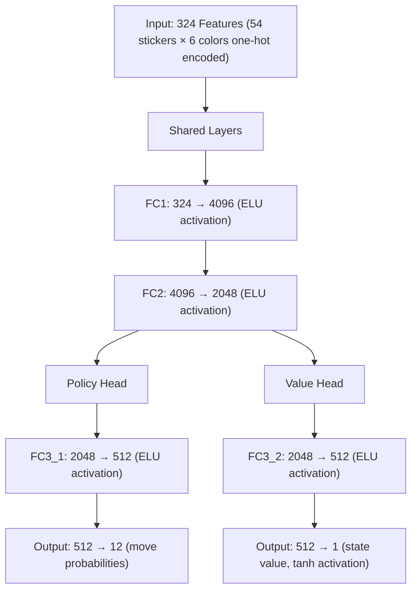
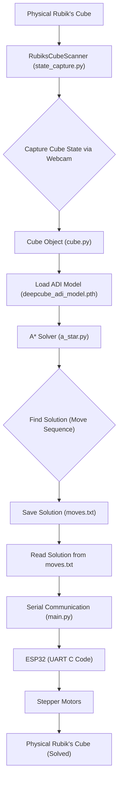

 # Rubik's Cube Solver

This project details a comprehensive Rubik's Cube solver leveraging deep learning techniques, specifically an Audidactic Iteration (ADI) neural network, combined with classical search algorithms. The system supports multiple solving strategies, computer vision for physical cube state capture, and hardware integration for automated physical manipulation.

## Overview

The core of this system is its ability to learn and apply solving strategies to the Rubik's Cube. It encompasses:

*   **Audidactic Iteration (ADI)**: A neural network for efficient state evaluation, guiding the search algorithms towards optimal solutions.
*   **Multiple Search Algorithms**: Implementation of A*, Beam Search, and Monte Carlo Tree Search (MCTS) to find optimal move sequences.
*   **Computer Vision**: A module to capture the state of a physical Rubik's Cube using a webcam, translating real-world colors into a digital state representation.
*   **Hardware Integration**: Capabilities to interface with an ESP32 microcontroller controlling stepper motors to physically execute the calculated solutions.
*   **Comprehensive Tools**: Includes dataset generation, model training, standalone testing, and performance analysis scripts.

## Project Structure

The project is organized into several key files, each serving a distinct purpose in the overall solving pipeline:

```
├── adi.py                  # ADI neural network model and training
├── adi_standalone.py       # Standalone model testing and analysis
├── adi results             # Results obtained by ADI standalone
├── analysis.py             # Performance comparison between algorithms
├── a_star.py               # A* search implementation
├── beam.py                 # Beam search implementation
├── cube.py                 # Rubik's Cube state representation and operations
├── dataset.py              # Training dataset generation
├── main.py                 # Main integration script
├── mcts.py                 # Monte Carlo Tree Search implementation
└── state_capture.py        # Computer vision for cube scanning
```

## Core Components

### Cube State Representation

The `cube.py` module is fundamental, defining how a Rubik's Cube's state is represented and manipulated. It includes functions for encoding and decoding cube states, applying moves, and checking if a cube is solved.

```python
# Color mapping for encoding cube states
color_map = {
    'w': [1, 0, 0, 0, 0, 0],  # White
    'y': [0, 1, 0, 0, 0, 0],  # Yellow
    'b': [0, 0, 1, 0, 0, 0],  # Blue
    'g': [0, 0, 0, 1, 0, 0],  # Green
    'r': [0, 0, 0, 0, 1, 0],  # Red
    'o': [0, 0, 0, 0, 0, 1]   # Orange
}

def encode_cube_state(state_str):
    # Convert cube state string into one-hot encoded vector
    encoded = []
    for color in state_str:
        encoded.extend(color_map[color])
    return encoded

# View on GitHub: https://github.com/Archaive16/RubikNet/blob/main/cube_solver/scripts/cube.py#L7-L21
```

The `Cube` class encapsulates the cube's state and provides methods for `scramble`, `move`, `is_solved`, and `print_cube`. The `switch` method contains the complex logic for applying individual face rotations and side swaps.

### ADI Neural Network

The ADI (Audidactic Iteration) neural network is central to evaluating cube states. It's trained to predict the optimal move and the value of a given cube state, significantly accelerating the search algorithms.





### Search Algorithms

The project implements three primary search algorithms, each leveraging the ADI model for heuristic guidance:

*   **A\* Search**: A best-first search algorithm that finds the shortest path by minimizing the sum of the cost to reach a node and the estimated cost to reach the goal from that node.
    ```python
    from a_star import AStar
    from cube import Cube

    solver = AStar("deepcube_adi_model.pth")
    cube = Cube()
    cube.scramble(10)
    moves, solved = solver.a_star_search(cube.state, max_nodes=50000, max_depth=25)
    # View on GitHub: Not directly in a single file, parts are in a_star.py
    ```
*   **Beam Search**: A variant of best-first search that prunes the search space by only expanding the `beam_width` most promising nodes at each level.
    ```python
    from beam import BeamSearch
    from cube import Cube

    solver = BeamSearch("deepcube_adi_model.pth")
    cube = Cube()
    cube.scramble(10)
    moves, solved = solver.search(cube.state, beam_width=200, max_depth=50)
    # View on GitHub: Not directly in a single file, parts are in beam.py
    ```
*   **Monte Carlo Tree Search (MCTS)**: A heuristic search algorithm that combines the generality of Monte Carlo simulations with tree search.
    ```python
    from mcts import solve_cube
    from cube import Cube

    cube = Cube()
    cube.scramble(10)
    solution, success = solve_cube(cube, num_simulations=15000, max_depth=25)
    # View on GitHub: Not directly in a single file, parts are in mcts.py
    ```

### Computer Vision Integration

The `state_capture.py` module enables the system to interact with a physical Rubik's Cube. It guides the user through capturing images of all six faces via a webcam, detects colors using HSV analysis, and allows for manual correction.

```python
from state_capture import RubiksCubeScanner

scanner = RubiksCubeScanner()
cube_colors = scanner.scan()
# View on GitHub: Not directly in a single file, parts are in state_capture.py
```

## Usage Flow

### 1. Training the Neural Network

Before solving, the ADI model needs to be trained. This process involves generating training data (scrambled cubes and their solving paths) and updating the network's weights.

```python
uv run adi.py
```

**Configuration Parameters (`adi.py`)**:
*   `NUM_EPOCHS`: Number of training epochs (default: 75)
*   `BATCH_SIZE`: Training batch size (default: 64)
*   `SCRAMBLE_DEPTH`: Maximum scramble depth for training (default: 20)
*   `SCRAMBLE_RUNS_PER_EPOCH`: Training samples per epoch (default: 1000)

The system automatically utilizes CUDA for GPU acceleration if available, falling back to CPU otherwise.

### 2. Testing the Trained Model

After training, the model's performance can be thoroughly evaluated.

```python
uv run adi_standalone.py
```

This script will test the model across various scramble depths, generate performance visualizations, and save detailed results in JSON format.

### 3. Complete Solving Pipeline

The `main.py` script orchestrates the end-to-end solving process, from physical cube scanning to robot actuation.





This script integrates the `RubiksCubeScanner` to get the initial cube state, loads the trained ADI model, uses the `AStar` solver to find a sequence of moves, saves these moves, and then sends them via serial communication to an ESP32 microcontroller to actuate the stepper motors.

```python
# Snippet from main.py showing the core solving logic
scanned=RubiksCubeScanner()
cube=scanned.scan() # Scans the physical cube
state=cube.state.copy()

# Load model
model = ADI()
model.load_state_dict(torch.load("deepcube_adi_model.pth", map_location="cpu"))
model.eval()

# Initialize solvers
astar_solver = AStar(model="deepcube_adi_model.pth", device='cpu')

move, solved= astar_solver.a_star_search(start_state=state, max_nodes=150000, max_depth=20)

if solved:
    print("solution found", move)
    save_solution(move, "moves.txt")

# View on GitHub: https://github.com/Archaive16/RubikNet/blob/main/cube_solver/scripts/main.py#L12-L30
```

### 4. Hardware Integration

The system can control a physical robot to solve the cube. The ESP32 code (available in the `scripts` folder, though not provided in the original text, its function is described) listens for serial commands and translates them into stepper motor movements.

```python
# Snippet from main.py demonstrating serial communication
PORT = "COM18"
BAUD = 115200

# Read moves from file
with open("moves.txt", "r") as f:
    moves = [line.strip() for line in f if line.strip()]

# Send over serial
ser = serial.Serial(PORT, BAUD, timeout=1)
time.sleep(2) # Allow ESP32 to initialize

for move in moves:
    print(f"Sending: {move}")
    ser.write((move + "\n").encode())
    time.sleep(1) # Pause between moves

ser.close()
# View on GitHub: https://github.com/Archaive16/RubikNet/blob/main/cube_solver/scripts/main.py#L33-L49
```

**Motor Control Details:**
*   **`step_motor()`**: Controls individual stepper motors via step/direction pins.
*   **50 steps = 90° rotation**: With a 800μs pulse timing.
*   **6 motor functions**: `rotate_R()`, `rotate_L()`, `rotate_U()`, `rotate_D()`, `rotate_F()`, `rotate_B()` handle specific face rotations.

## Algorithm Comparison

To understand the strengths and weaknesses of different solving approaches, a comparative analysis script is provided.

```python
uv run analysis.py
```

This script benchmarks A* versus Beam Search across various scramble depths, generating performance plots for insights into efficiency and solution quality.

## Configuration

### Training Parameters

These parameters, found in `adi.py`, allow fine-tuning of the neural network's training process:

| Parameter               | Default Value | Description                                   |
| :---------------------- | :------------ | :-------------------------------------------- |
| `NUM_EPOCHS`            | `75`          | Total number of training epochs               |
| `BATCH_SIZE`            | `64`          | Number of samples per training batch          |
| `BATCH_ITERATIONS`      | `10`          | Number of iterations per batch (internal)     |
| `SCRAMBLE_DEPTH`        | `20`          | Maximum scramble depth for training data      |
| `SCRAMBLE_RUNS_PER_EPOCH` | `1000`        | Number of training samples generated per epoch |

### Search Algorithm Parameters

Each search algorithm has configurable parameters to balance solution quality with search time:

#### A\* Search
*   `max_nodes`: Maximum nodes to expand (default: 50,000)
*   `max_depth`: Maximum search depth (default: 25)

#### Beam Search
*   `beam_width`: Number of best candidates to keep at each step (default: 200)
*   `max_depth`: Maximum search depth (default: 50)

#### MCTS
*   `num_simulations`: Number of MCTS simulations (default: 15,000)
*   `max_depth`: Maximum tree depth (default: 25)
*   `c_puct`: UCB exploration constant (default: 4.0)

## Troubleshooting

### Common Issues

1.  **Model file not found**: Ensure `deepcube_adi_model.pth` exists after running `adi.py` for training.
2.  **CUDA out of memory**: If training or inference on GPU, reduce `BATCH_SIZE` in `adi.py` or `main.py` to conserve memory.
3.  **Poor color detection**: Ensure good, consistent lighting when using the computer vision scanner. Avoid shadows or reflective surfaces.
4.  **Slow solving**: For faster results, consider reducing `max_nodes` (for A\*) or `num_simulations` (for MCTS). This may impact solution optimality.

## Hardware

This section details the physical components required to bring the solver to life.

### STL Files

All necessary `.stl` files, including customized designs, are provided in the project folder. These are ready for 3D printing to construct the mechanical components of the solver robot.

### Bill of Materials

A comprehensive shopping list with links to all required electronic and mechanical components, streamlining the hardware procurement process.
(Note: Specific BOM content is not provided in the original prompt, so this serves as a placeholder for its expected presence).

### UART (Serial Communication)

The `scripts` folder contains C code for the ESP32 microcontroller, responsible for controlling 6 stepper motors. This code receives move commands via serial communication from the Python application.

#### Usage Flow

1.  **Flash** the provided C code to your ESP32 board after making all necessary hardware connections.
2.  **Run** `main.py` on your computer.
3.  **Python sends** move commands (e.g., `"R"`, `"U'"`) through the configured serial port.
4.  **ESP32 executes** the corresponding motor rotations to manipulate the cube.

#### Integration

This UART communication forms the bridge between the intelligent solving algorithms and the physical world, allowing the neural network solver to physically execute its computed solution sequences on a real Rubik's Cube.

## Key Integration Points

*   **`main.py` as the Orchestrator**: This script is the central hub, bringing together computer vision, the ADI model, the A\* solver, and hardware communication into a cohesive end-to-end pipeline. It demonstrates how different modules seamlessly interact to achieve the final goal of solving a physical cube.
*   **ADI Model's Role**: The trained `deepcube_adi_model.pth` is crucial for performance. Without an accurately trained model, the search algorithms would be significantly slower or unable to find solutions efficiently. This highlights the importance of the training and standalone testing phases (`adi.py`, `adi_standalone.py`).
*   **Modularity of Solvers**: The design allows for easy swapping of search algorithms (A\*, Beam Search, MCTS) by simply initializing a different solver class. This modularity facilitates experimentation and comparison, as seen in `analysis.py`.
*   **Hardware Abstraction**: The serial communication layer between `main.py` and the ESP32 abstracts the complexity of motor control. The Python script only needs to send high-level move commands, while the ESP32 handles the low-level stepper motor actuation details. This separation of concerns simplifies development and debugging.