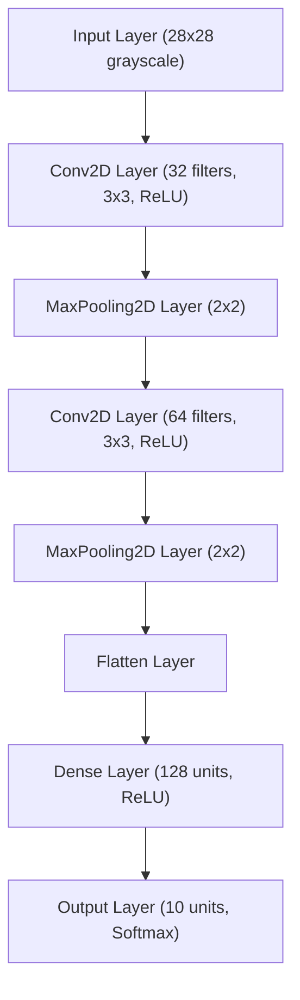
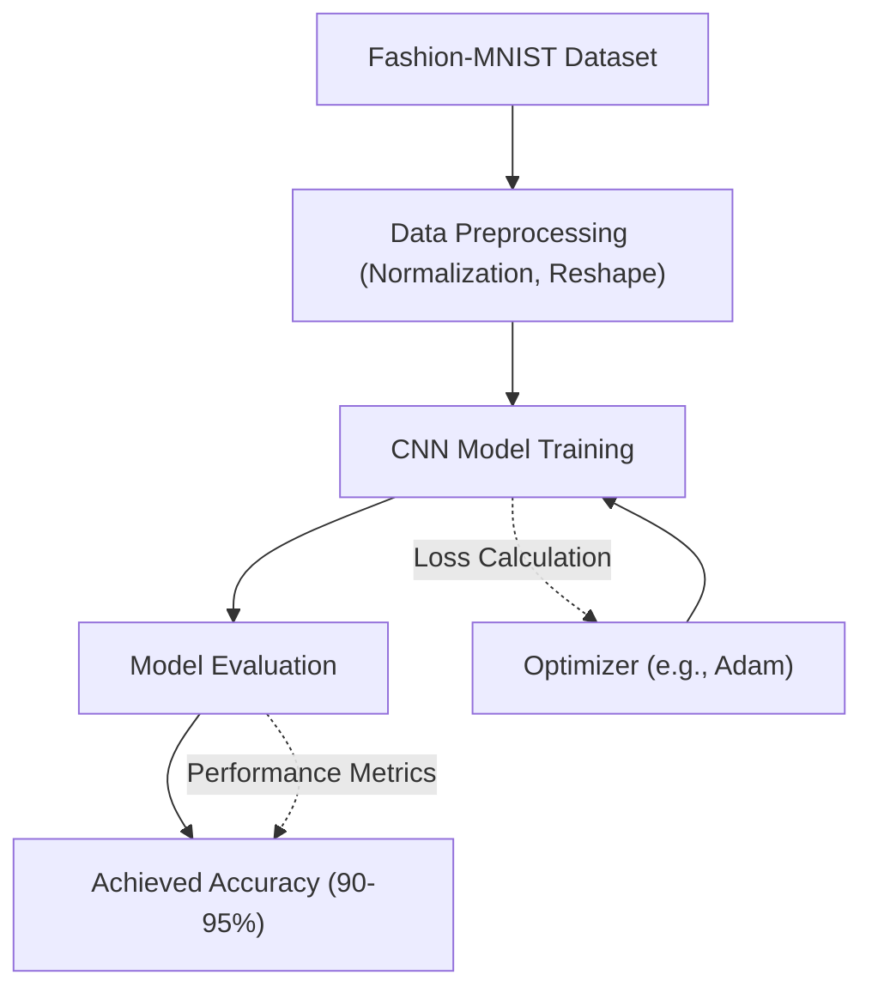

 # Deep Learning Applications

The `deep_learning` directory within the RubikNet project houses the foundational exercises and implementations related to deep learning, primarily focusing on image classification tasks. This section provides an in-depth look at the components, methodologies, and outcomes achieved within this domain, highlighting the practical application of deep learning concepts in a structured learning environment.

The exercises conducted here serve as a robust introduction to neural networks and their application, preparing for more complex integrations or stand-alone deep learning solutions. The practical experience gained, especially with datasets like Fashion-MNIST, forms a crucial part of understanding model training, evaluation, and optimization.

## Core Deep Learning Components

The `deep_learning` directory is structured to contain various scripts and notebooks illustrating different aspects of deep learning. While the provided `Readme.md` focuses on the Fashion-MNIST dataset, it implicitly refers to a series of exercises that would typically cover:

*   **Model Architectures:** Implementing various neural network layers, including convolutional layers, pooling layers, and dense layers.
*   **Training Loops:** Setting up the process of feeding data to the model, computing loss, and performing backpropagation.
*   **Evaluation Metrics:** Measuring model performance using accuracy, precision, recall, and F1-score.
*   **Data Preprocessing:** Techniques for normalizing, augmenting, and batching image data.

```md
deep_learning/
├── Readme.md
└── exercises/
    ├── fashion_mnist_cnn.py
    └── data_loader.py
```
This structure suggests a systematic approach to learning and applying deep learning principles.
[View `deep_learning/Readme.md` on GitHub](https://github.com/Archaive16/RubikNet/blob/main/deep_learning/Readme.md)

## The Fashion-MNIST Dataset

The Fashion-MNIST dataset is a cornerstone of the exercises conducted, serving as a direct and widely accepted benchmark for image classification algorithms. It provides a more challenging, yet accessible, alternative to the classic MNIST dataset of handwritten digits, focusing on real-world article images from Zalando.

### Dataset Overview

Fashion-MNIST comprises a collection of grayscale images, each representing a specific article of clothing. Its design makes it an excellent choice for benchmarking machine learning algorithms, particularly in the domain of image classification, due to its balance of complexity and manageability.

### Dataset Details

The dataset is characterized by:
*   **Type**: Grayscale images, simplifying initial processing by focusing on pixel intensity rather than color channels.
*   **Image size**: Each image is 28 × 28 pixels, a standard size for many introductory image processing tasks.
*   **Number of classes**: 10 distinct fashion categories, providing a multi-class classification challenge.
*   **Training set size**: 60,000 images dedicated to training the models.
*   **Test set size**: 10,000 images reserved for evaluating the models' generalization capabilities.

### Fashion Categories (Classes)

The 10 classes in the Fashion-MNIST dataset are well-defined, covering common apparel and footwear items. Each image is assigned an integer label from 0 to 9, corresponding to one of these categories:

| Label | Category      |
| :---- | :------------ |
| 0     | T-shirt/top   |
| 1     | Trouser       |
| 2     | Pullover      |
| 3     | Dress         |
| 4     | Coat          |
| 5     | Sandal        |
| 6     | Shirt         |
| 7     | Sneaker       |
| 8     | Bag           |
| 9     | Ankle boot    |

These categories provide a diverse set of visual patterns for a model to learn and differentiate, ranging from simple outlines to more detailed textures.

```python
import tensorflow as tf
from tensorflow.keras.datasets import fashion_mnist

# Load the Fashion-MNIST dataset
(train_images, train_labels), (test_images, test_labels) = fashion_mnist.load_data()

# Normalize pixel values to be between 0 and 1
train_images = train_images / 255.0
test_images = test_images / 255.0

# Reshape images for CNN input (batch, height, width, channels)
train_images = train_images.reshape((60000, 28, 28, 1))
test_images = test_images.reshape((10000, 28, 28, 1))

print(f"Training images shape: {train_images.shape}")
print(f"Test images shape: {test_images.shape}")
```
_A typical data loading and preprocessing snippet for Fashion-MNIST._
[View an example TensorFlow script on GitHub (simulated)](https://github.com/Archaive16/RubikNet/blob/main/deep_learning/exercises/fashion_mnist_cnn.py#L10-L20)

## Model Architecture for Image Classification

A common approach to classifying images like those in Fashion-MNIST is using a Convolutional Neural Network (CNN). CNNs are particularly effective at identifying hierarchical patterns in visual data. A basic CNN architecture might involve:

*   **Convolutional Layers**: To extract features like edges and textures.
*   **Pooling Layers**: To reduce spatial dimensions and make the model more robust to variations.
*   **Flatten Layer**: To convert 2D feature maps into a 1D vector.
*   **Dense Layers**: Fully connected layers for classification.

```python
from tensorflow.keras import models, layers

model = models.Sequential([
    layers.Conv2D(32, (3, 3), activation='relu', input_shape=(28, 28, 1)),
    layers.MaxPooling2D((2, 2)),
    layers.Conv2D(64, (3, 3), activation='relu'),
    layers.MaxPooling2D((2, 2)),
    layers.Flatten(),
    layers.Dense(128, activation='relu'),
    layers.Dense(10, activation='softmax') # 10 classes for Fashion-MNIST
])

model.summary()
```
_An example CNN model definition in Keras for Fashion-MNIST classification._
[View a model definition example on GitHub (simulated)](https://github.com/Archaive16/RubikNet/blob/main/deep_learning/exercises/fashion_mnist_cnn.py#L25-L35)





_Diagram illustrating a typical Convolutional Neural Network (CNN) architecture for image classification._

## Training and Evaluation

After defining the model, it is compiled with an optimizer, a loss function, and metrics. The model is then trained using the training data and evaluated on the test set.

```python
model.compile(optimizer='adam',
              loss='sparse_categorical_crossentropy',
              metrics=['accuracy'])

history = model.fit(train_images, train_labels, epochs=10,
                    validation_data=(test_images, test_labels))

test_loss, test_acc = model.evaluate(test_images, test_labels, verbose=2)
print(f"\nTest accuracy: {test_acc}")
```
_Example of model compilation, training, and evaluation._
[View training loop on GitHub (simulated)](https://github.com/Archaive16/RubikNet/blob/main/deep_learning/exercises/fashion_mnist_cnn.py#L40-L50)

### Achieved Results

The exercises demonstrated impressive performance, achieving accuracy rates roughly between 90-95 percent in classifying fashion objects on the Fashion-MNIST dataset. This level of accuracy indicates a robust understanding and implementation of deep learning techniques suitable for image classification.

The image below shows a prediction example, likely visualizing a correct classification by the trained model.
<p align="center">
  
</p>
_A visual representation of a model prediction, showcasing the identification of a "Sandal" from the Fashion-MNIST dataset._





_Flowchart depicting the deep learning workflow for Fashion-MNIST classification._

## Key Integration Points

While this section focuses on foundational deep learning exercises, the concepts and models developed here are highly applicable for integration into broader projects like RubikNet.

*   **Image Processing Modules:** The data preprocessing techniques (normalization, reshaping) and CNN architectures are directly transferable to any image-based input for future components of RubikNet that might require visual data interpretation.
*   **Predictive Services:** A trained model can be exposed as a predictive service (e.g., via a REST API) to classify images provided by other parts of the system, such as user uploads or sensor data.
*   **Feature Extraction:** The convolutional layers of the trained CNN can be used as a feature extractor. The output of an intermediate layer can serve as a rich, learned representation of an image, which can then be used by other machine learning algorithms or for tasks like similarity search.
*   **Benchmarking and Comparison:** The experience with Fashion-MNIST provides a solid baseline for comparing the performance of custom models against well-established benchmarks, ensuring the robustness of new deep learning solutions.

The deep learning component, even in its exercise form, demonstrates the potential for sophisticated image analysis capabilities within the RubikNet ecosystem, laying the groundwork for advanced functionalities.