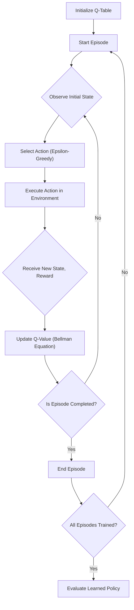
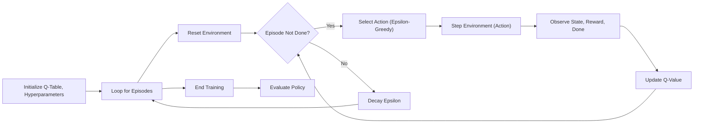

 # Classic RL Environments

This section provides a deep dive into classic reinforcement learning (RL) environments, focusing on practical Q-learning implementations for problems such as Mountain Car and Taxi. These examples illustrate fundamental RL concepts like state discretization, action selection strategies, and reward mechanisms within well-understood scenarios.

## Q-Learning Fundamentals

Q-learning is a model-free reinforcement learning algorithm that seeks to find the best action to take in any given state. It does this by learning a Q-value for each state-action pair, representing the expected future reward for taking that action in that state and then following an optimal policy thereafter.

Key components of our Q-learning implementations include:

*   **Q-Table**: A lookup table storing Q-values for all state-action pairs.
*   **Epsilon-Greedy Policy**: A strategy to balance exploration (trying new actions) and exploitation (choosing the action with the highest known Q-value).
*   **Bellman Equation**: The core update rule for Q-values, incorporating the immediate reward and the discounted maximum future reward.
*   **State Discretization**: Converting continuous state spaces into discrete ones, necessary for tabular Q-learning.

### Q-Learning Process Flow

The following diagram illustrates the general flow of a Q-learning agent interacting with an environment:





## Mountain Car Environment

The Mountain Car problem is a classic control task where a car is situated in a valley between two hills. The goal is to drive the car up the right hill to reach a flag. The car's engine is not powerful enough to drive directly up the hill, requiring the agent to learn to drive back and forth to build momentum.

### Implementation Details

Our `mountain_car.py` script implements Q-learning to solve this problem. Given the continuous nature of the Mountain Car environment's observation space (position and velocity), state discretization is a critical step.

#### State Discretization

The environment's continuous observation space for position and velocity must be converted into discrete bins to be used with a Q-table. This is handled by the `discretize` function.

```python
def discretize(state):
    state = (state - env.observation_space.low) * np.array([10, 100])
    state = np.round(state, 0).astype(int)
    return state
```
This snippet from [reinforcement_learning/mountain_car.py#L40-L43](https://github.com/Archaive16/RubikNet/blob/main/reinforcement_learning/mountain_car.py#L40-L43) shows how continuous state values are scaled and rounded to integer indices for the Q-table.

#### Q-Table Initialization and Update

The Q-table is initialized with random uniform values. During training, the `q_learning` function iteratively updates Q-values using the Bellman equation.

```python
Q = np.random.uniform(low = -1, high = 1, size = (states[0], states[1], len(actions)))    # initialize q
# ...
# bellman equation
Q[state[0], state[1], action] += alpha * (reward + gamma * np.max(Q[next_state[0], next_state[1]]) - Q[state[0], state[1], action])
```
This code from [reinforcement_learning/mountain_car.py#L11-L28](https://github.com/Archaive16/RubikNet/blob/main/reinforcement_learning/mountain_car.py#L11-L28) highlights the initialization of the Q-table and the core Bellman update rule.

#### Epsilon-Greedy Action Selection

To balance exploration and exploitation, an epsilon-greedy policy is used, where `epsilon` decays over time.

```python
def take_action(actions, Q, epsilon, state):
    if np.random.rand() > epsilon:
        action = np.argmax(Q[state[0], state[1]])
    else:
        action = np.random.randint(0, len(actions))
    return action
```
The `take_action` function, found in [reinforcement_learning/mountain_car.py#L48-L53](https://github.com/Archaive16/RubikNet/blob/main/reinforcement_learning/mountain_car.py#L48-L53), demonstrates this mechanism, allowing the agent to initially explore more and then converge to exploiting known optimal actions.

## Taxi Environment

The Taxi environment is a grid-world problem where a taxi agent needs to pick up a passenger at one location and drop them off at another. The environment features discrete states representing the taxi's location, passenger's location, and destination.

### Implementation Details

The `taxi.py` script applies Q-learning to solve the Taxi problem. This environment is inherently discrete, simplifying the state representation compared to Mountain Car.

#### Q-Table Structure

For the Taxi environment, the Q-table is typically initialized with zeros, as there are no inherent prior expectations for rewards, and the environment's state space is directly manageable without complex discretization.

```python
Q = np.zeros((500, 6))  # Initialize Q-table with zeros (500 states, 6 actions)
Q = q_learning(Q, 0.1, 0.9999, 1.0, 0.05, 0.9995, 10000)  # Train agent with Q-learning
```
This snippet from [reinforcement_learning/taxi.py#L56-L57](https://github.com/Archaive16/RubikNet/blob/main/reinforcement_learning/taxi.py#L56-L57) shows the initialization of the Q-table for the Taxi environment. The 500 states correspond to all possible combinations of taxi location, passenger location, and destination.

#### Training Loop and Success Tracking

The `q_learning` function in `taxi.py` includes tracking for successful passenger deliveries, indicated by a reward of 20.

```python
def q_learning(Q, alpha, gamma, epsilon, min_epsilon, decay, num_episodes):  # Main Q-learning training loop
    print("Training...")
    actions = np.arange(0, env.action_space.n)  # Array of all possible actions
    i = 0
    success = 0  # Counter for successful taxi rides
    for i in range(num_episodes + 1):  # Training loop for specified episodes
        # ...
        if reward == 20:  # Successful passenger delivery reward
                success += 1  # Increment success counter
        # ...
    return Q  # Return trained Q-table
```
This excerpt from [reinforcement_learning/taxi.py#L7-L28](https://github.com/Archaive16/RubikNet/blob/main/reinforcement_learning/taxi.py#L7-L28) demonstrates how the training loop iterates through episodes and updates the `success` counter, providing a tangible metric of agent performance during training.

#### Evaluation of Learned Policy

The `evaluate` function renders the environment and displays the agent's performance after training, allowing visual inspection of the learned policy.

```python
def evaluate(Q):  # Test trained agent performance
    print("Evaluating...")
    state, _ = env.reset()  # Reset environment for evaluation
    total_reward = 0  # Track cumulative reward
    completed = 0  # Episode completion flag
    while not completed:  # Continue until episode ends
        action = np.argmax(Q[state])    # take action
        next_state, reward, terminated, truncated, _ = env.step(action)    # generate next state, reward and status
        total_reward += reward  # Accumulate rewards
        completed = terminated or truncated  # Check completion status
        state = next_state  # Move to next state
        frame = env.render()    # storing the frame
        plt.imshow(frame)  # Display current frame
        plt.axis("off")  # Hide plot axes
        plt.pause(1)    # pausing for a small time to show continuous frames
    return total_reward  # Return total episode reward
```
The `evaluate` function, shown from [reinforcement_learning/taxi.py#L39-L54](https://github.com/Archaive16/RubikNet/blob/main/reinforcement_learning/taxi.py#L39-L54), is crucial for understanding how well the agent has learned to navigate the environment and achieve its goal.

## Key Integration Points

Both Mountain Car and Taxi implementations utilize common reinforcement learning patterns and can be adapted to other similar environments.

### Core Q-Learning Loop

The fundamental `q_learning` function structure is highly reusable across tabular RL problems. It encapsulates the interaction between the agent and the environment, Q-value updates, and epsilon decay.

### Environment Interaction Abstraction

Both examples leverage the `gymnasium` API for environment interaction (`env.reset()`, `env.step()`, `env.render()`). This abstraction allows for easy swapping of environments as long as they adhere to the Gymnasium interface.

### Hyperparameter Tuning

The performance of the Q-learning agent is heavily dependent on hyperparameters such as `alpha` (learning rate), `gamma` (discount factor), `epsilon` (initial exploration rate), `min_epsilon`, `decay`, and `num_episodes`. These parameters need careful tuning for optimal performance in each environment.

### Visualization and Evaluation

The `evaluate` function in both scripts provides a simple yet effective way to visualize the agent's learned policy. For more complex scenarios, more sophisticated logging and visualization tools (e.g., TensorBoard) might be integrated.

### Common Module Dependencies

Both implementations rely on `numpy` for numerical operations and `gymnasium` for environment interaction. `matplotlib.pyplot` is used for basic visualization during evaluation.

### High-Level Training Process

The overall training process involves initializing the Q-table, iterating through a predefined number of episodes, and within each episode, performing state transitions, action selections, and Q-value updates until the episode concludes. Finally, the learned policy is evaluated.


