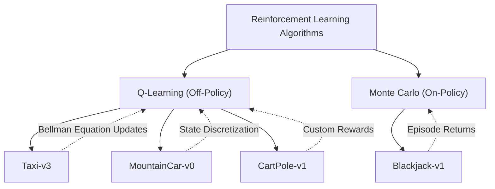
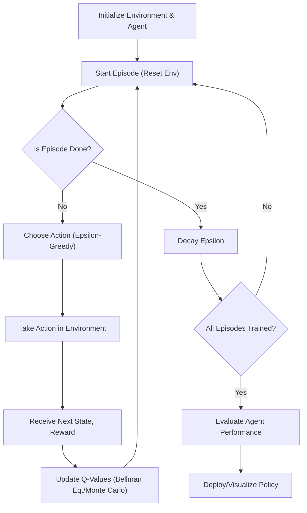

 # Reinforcement Learning Modules

This documentation covers the implementations of various reinforcement learning algorithms applied to different OpenAI Gymnasium environments within this repository. Each module demonstrates core RL concepts using distinct learning approaches, from classical Q-Learning to Monte Carlo methods, and addresses challenges like continuous state spaces through discretization.

## Overview

The repository features several well-known reinforcement learning environments, each tackled with a suitable algorithm. This section provides a high-level view of the files and their respective environments.

### Files and Environments

| File                                | Environment     | Algorithm                      | Key Concept                         |
| :---------------------------------- | :-------------- | :----------------------------- | :---------------------------------- |
| `taxi.py`                           | Taxi-v3         | Q-Learning                     | Discrete state/action, Bellman Eq.  |
| `blackjack.py`                      | Blackjack-v1    | Monte Carlo Method             | Episode-based learning, Return calc.|
| `mountain_car.py`                   | MountainCar-v0  | Q-Learning                     | Continuous state discretization     |
| `cartpole.py`                       | CartPole-v1     | Q-Learning                     | Continuous state discretization, Custom rewards |

## Blackjack Environment

The `blackjack.py` module implements the Monte Carlo method to learn an optimal policy for the classic card game Blackjack-v1. This environment is characterized by discrete states and actions, but with probabilistic outcomes based on card draws.

### Environment Details

*   **Environment**: Blackjack-v1
*   **Description**: The agent plays against a dealer, aiming to achieve a hand total closer to 21 than the dealer, without exceeding 21.
*   **State Space**: Represented as a tuple: (Player's current sum, Dealer's showing card, Player has usable ace (True/False)). Approximately 280 possible states.
*   **Action Space**:
    *   `0`: Stick (take no more cards)
    *   `1`: Hit (take another card)
*   **Algorithm**: Monte Carlo method with first-visit updates.
*   **Key Features**: Episode generation, discounted return calculation, and win rate evaluation (typically ~42-43%).

### Monte Carlo Learning Process

The Monte Carlo method learns by playing complete episodes and then updating the Q-values based on the actual returns observed for each state-action pair visited. This approach is "on-policy," meaning it learns about the policy currently being followed.

```python
def monte_carlo(n_episodes, epsilon, alpha, gamma, Q):
    for i in range(n_episodes):
        episode = generate_ep(Q, epsilon)    # generate one episode (state, action, reward)
        states, actions, rewards = zip(*episode)  # unpack episode
        epsilon *= 0.99995    # decay epsilon after every episode
        n = 0
        for state in states:
            discounted_return = 0
            k = np.arange(len(rewards[n:]))  # indices for discounting
            for j in range(len(rewards[n:])):
                discounted_return += rewards[n + j] * (gamma**k[j])    # compute discounted return
            Q[state][actions[n]] += alpha * (discounted_return - Q[state][actions[n]])    # update Q-value
            n += 1
    return Q
```
The `monte_carlo` function iterates through a specified number of episodes. For each episode, it calls `generate_ep` to simulate gameplay, then calculates the discounted return for each state-action pair observed and updates the Q-table. The exploration rate `epsilon` is decayed over time to shift from exploration to exploitation.

[View on GitHub](https://github.com/Archaive16/RubikNet/blob/main/reinforcement_learning/blackjack.py#L9-L26)

### Episode Generation

An episode in Blackjack involves playing a full hand until the player sticks, goes bust, or the game otherwise terminates. Actions are selected using an epsilon-greedy strategy.

```python
def generate_ep(Q, epsilon):
    state, _ = env.reset()  # reset environment to start new episode
    episode = []

    completed = 0
    while not completed:
        action = generate_action(Q, epsilon, state)  # choose action (epsilon-greedy)
        next_state, reward, terminated, truncated, _ = env.step(action)  # step in env
        completed = terminated or truncated  # check if episode finished
        episode.append((state, action, reward))  # store transition
        state = next_state
    
    return episode  # return full episode
```
This snippet from `blackjack.py` shows how an episode is generated, capturing `(state, action, reward)` tuples until the episode concludes. This full sequence is then used to update the Q-values.

[View on GitHub](https://github.com/Archaive16/RubikNet/blob/main/reinforcement_learning/blackjack.py#L28-L41)

### Action Selection

Actions are chosen using an epsilon-greedy policy, balancing between exploring new actions and exploiting known good actions.

```python
def generate_action(Q, epsilon, state):
    action_space = [0, 1]  # 0=stick, 1=hit
    # Probabilities for epsilon-greedy selection
    probabilities = [1 - epsilon / 2, epsilon / 2] if np.argmax(Q[state]) == 0 else [epsilon / 2, 1 - epsilon / 2]
    action = np.random.choice(action_space, p = probabilities)  # epsilon-greedy action selection
    return action
```
The `generate_action` function determines whether to choose a random action (exploration) or the action with the highest Q-value for the current state (exploitation), based on the `epsilon` parameter.

[View on GitHub](https://github.com/Archaive16/RubikNet/blob/main/reinforcement_learning/blackjack.py#L43-L48)

## CartPole Environment

The `cartpole.py` module applies Q-Learning with state space discretization to the CartPole-v1 environment. This is a classic control problem where the agent must balance a pole on a moving cart.

### Environment Details

*   **Environment**: CartPole-v1
*   **Description**: A pole is attached by an un-actuated joint to a cart, which moves along a frictionless track. The goal is to prevent the pole from falling over.
*   **State Space**: 4 continuous variables: cart position, cart velocity, pole angle, pole angular velocity. These are discretized into `10^4 = 10,000` states.
*   **Action Space**:
    *   `0`: Push cart to the left
    *   `1`: Push cart to the right
*   **Algorithm**: Q-Learning with state space discretization.
*   **Key Features**: Continuous state space handled via binning, custom reward function, epsilon-greedy exploration with decay.

### State Discretization for CartPole

To apply Q-learning to a continuous state space like CartPole's, the observations are discretized into a finite number of bins. This converts the continuous problem into a discrete one that a Q-table can handle.

```python
def discritsize(obs):  # Convert continuous observations to discrete state indices
    cart_pos, cart_vel, pole_pos, pol_vel=obs  # Unpack observation components
    cart_pos_scaled=(cart_pos+4.8)/9.6  # Scale cart position to [0,1]
    cart_vel_scaled=(cart_vel+3)/6  # Scale cart velocity to [0,1]
    pole_pos_scales=(pole_pos+0.418)/0.836  # Scale pole angle to [0,1]
    pol_vel_scaled=(pol_vel+math.radians(50))/(2*math.radians(50))  # Scale pole angular velocity to [0,1]

    cart_pos_want = int(np.clip(cart_pos_scaled * 10, 0, 9))  # Discretize cart position to bins 0-9
    cart_vel_want = int(np.clip(cart_vel_scaled * 10, 0, 9))  # Discretize cart velocity to bins 0-9
    pole_pos_want = int(np.clip(pole_pos_scales * 10, 0, 9))  # Discretize pole angle to bins 0-9
    pole_vel_want = int(np.clip(pol_vel_scaled * 10, 0, 9))  # Discretize pole angular velocity to bins 0-9

    return cart_pos_want, cart_vel_want, pole_pos_want, pole_vel_want  # Return discretized state
```
The `discritsize` function in `cartpole.py` takes the continuous observation array and transforms each component into a discrete integer index. This process involves scaling the observation values to a `[0,1]` range and then mapping them to one of `10` bins.

[View on GitHub](https://github.com/Archaive16/RubikNet/blob/main/reinforcement_learning/cartpole.py#L15-L29)

### Custom Reward Function

For the CartPole environment, a custom reward function is implemented to guide the agent towards better balancing behavior, rather than just the default reward of `+1` per step. This helps shape the learning process.

```python
def calculate_reward(action, current_obs, next_obs):  # Custom reward function for better learning
    reward = 0  # Initialize reward

    # 1. Reward if pole is more vertical
    if abs(next_obs[2]) < 0.05:  # Pole very upright
        reward += 5  # High reward for vertical pole
    elif abs(next_obs[2]) < 0.1:  # Pole somewhat upright
        reward += 1  # Small reward
    else:  # Pole tilted
        reward -= 2  # Penalty for tilted pole

    # 2. Reward if cart is near center
    if abs(next_obs[0]) < 0.25:  # Cart near center
        reward += 2  # Reward for staying centered
    elif abs(next_obs[0]) < 0.5:  # Cart moderately centered
        reward += 0  # Neutral reward
    else:  # Cart far from center
        reward -= 1  # Small penalty

    # 3. Small penalty for high angular velocity (pole speed)
    if abs(next_obs[3]) > 0.75:  # High pole angular velocity
        reward -= 2  # Penalty for fast pole movement

    return reward  # Return calculated reward
```
This custom reward function incentivizes the agent to keep the pole upright and the cart centered, while penalizing excessive pole movement. Such reward shaping can significantly improve learning speed and policy quality.

[View on GitHub](https://github.com/Archaive16/RubikNet/blob/main/reinforcement_learning/cartpole.py#L31-L54)

## Key Reinforcement Learning Concepts

This section provides a summary of the fundamental reinforcement learning concepts demonstrated across the implementations.

### Learning Algorithms





*   **Q-Learning**:
    *   **Temporal Difference Learning**: Updates Q-values after each step.
    *   **Bellman Equation**: `Q(s,a) ← Q(s,a) + α[r + γ·max(Q(s',a')) - Q(s,a)]`.
    *   **Off-policy**: Learns optimal policy while following an epsilon-greedy policy.
*   **Monte Carlo Methods**:
    *   **Episode-based Learning**: Updates Q-values after complete episodes.
    *   **Return Calculation**: Uses discounted cumulative rewards from the episode.
    *   **On-policy**: Updates the policy currently being followed.

### State Space Handling

*   **State Discretization**:
    *   **Continuous to Discrete**: Essential for applying tabular methods like Q-learning to environments with continuous observation spaces.
    *   **Binning Strategy**: Divides the range of continuous variables into a fixed number of intervals or "bins."
    *   **Trade-offs**: Fewer bins lead to faster learning but less precision; more bins increase precision but also the size of the Q-table and computation time.

### Common Elements

*   **Epsilon-greedy Exploration**: A strategy that balances between exploiting known optimal actions and exploring new actions to discover potentially better ones.
*   **Epsilon Decay**: The process of gradually reducing the `epsilon` value over time, allowing the agent to shift from exploration to more exploitation as it learns.
*   **Discount Factor (γ)**: A value (typically `0.9-0.999`) that determines the present value of future rewards. Higher `gamma` values make future rewards more significant.
*   **Learning Rate (α)**: The step size at which the Q-values are updated after each experience. A smaller `alpha` leads to slower but potentially more stable learning.

## Reinforcement Learning Workflow

The general workflow for developing and training a reinforcement learning agent involves environment setup, agent initialization, a training loop, and evaluation.





This diagram illustrates the iterative process of an RL agent training: from initializing the environment and agent, through episode generation with action selection and Q-value updates, to evaluation and deployment.

## Running the Code

Each implementation within the `reinforcement_learning/` directory can be run independently. Ensure you have the necessary dependencies installed by synchronizing with the project's dependency manager.

```bash
# First, ensure uv is installed (if not already)
pip install uv

# Then, synchronize dependencies for the project
uv sync

# To run a specific reinforcement learning script, e.g., for Blackjack
uv run reinforcement_learning/blackjack.py

# Or for CartPole
uv run reinforcement_learning/cartpole.py
```
This snippet provides the commands to set up the environment and execute the individual RL scripts. The `uv sync` command will install all required packages from `uv`.

[View Readme on GitHub](https://github.com/Archaive16/RubikNet/blob/main/reinforcement_learning/Readme.md#running-the-code)

## Key Integration Points

### Continuous State Space Handling
The `mountain_car.py` and `cartpole.py` implementations demonstrate how to adapt Q-Learning, a method traditionally used for discrete state spaces, to continuous environments. This is achieved through **state discretization**, which involves mapping continuous observation values into a finite number of bins. This technique is crucial when dealing with complex real-world control problems where state variables are often continuous. The choice of binning strategy (e.g., number of bins, scaling methods) directly impacts the precision of the learned policy and the computational complexity.

### Reward Function Design
The `cartpole.py` module showcases the importance of a **custom reward function**. While environments often provide default rewards (e.g., `+1` per step for CartPole), shaping the reward signal can significantly accelerate learning and lead to more desirable agent behaviors. By penalizing tilted poles and encouraging the cart to stay centered, the custom reward function guides the agent more effectively than a sparse, general reward. This highlights a critical aspect of applied RL: carefully designing rewards to reflect desired outcomes.

### Policy Evaluation and Convergence
The `blackjack.py` example illustrates **policy evaluation** by calculating the win rate after training. This is a practical way to quantify the performance of a learned policy. Across all Q-Learning implementations, the use of **epsilon decay** is vital for convergence. Starting with a high `epsilon` for exploration and gradually reducing it allows the agent to first discover optimal actions and then refine its policy by exploiting those discoveries. Without proper decay, the agent might never settle on a consistent, high-performing strategy.

### Experimentation and Hyperparameter Tuning
The different implementations implicitly underline the need for **experimentation and hyperparameter tuning**. Values for `alpha` (learning rate), `gamma` (discount factor), and `epsilon` decay rates are critical. These values are often found through trial and error or more advanced tuning techniques, as they significantly influence the speed and stability of learning. Each environment presents unique challenges that may require different hyperparameter settings to achieve optimal performance.