<!-- 1_overview.mdx -->
# 1. Overview
[TOC]

This documentation provides an overview of the MERN Chat App, a web application built using the MERN stack (MongoDB, Express.js, React, Node.js). This project is based on a tutorial by a credited source, aiming to demonstrate real-time chat functionalities.

The application leverages modern web technologies to deliver a responsive and interactive user experience for instant messaging.

## 1.1. Project Origin
The foundation of this project is attributed to a tutorial. For more details on the original source and implementation guide, please refer to the following:
*   [Tutorial Link](https://youtu.be/ntKkVrQqBYY?si=qz02jMCQ80RT1jaH)

## 1.2. Technology Stack
The MERN Chat App is built using a robust and popular technology stack, which includes:
*   **MongoDB**: A NoSQL database for flexible data storage.
*   **Express.js**: A minimalist web framework for Node.js, used for building the API.
*   **React**: A JavaScript library for building user interfaces.
*   **Node.js**: A JavaScript runtime for server-side development.

### 1.2.1. High-Level Architecture
The application follows a client-server architecture, where the React frontend interacts with the Express.js backend, which in turn communicates with the MongoDB database. Real-time communication is typically handled by WebSockets, often integrated with a library like Socket.IO.

```mermaid
graph TD
    A[Client (React Frontend)] -->|HTTP/WebSockets| B(Server (Node.js/Express.js))
    B -->|CRUD Operations| C[Database (MongoDB)]
    B -->|Real-time Events| A
    C --> B
```

---FILEBREAK---
<!-- 2_project_structure.mdx -->
# 2. Project Structure
[TOC]

Given the limited information from the `README.md`, a typical MERN application structure is inferred. This section outlines the expected directories and their responsibilities within the MERN Chat App.

## 2.1. Inferred Directory Layout
A standard MERN project usually segregates the frontend and backend components into distinct directories.

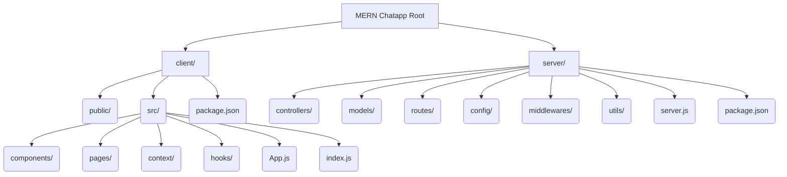

## 2.2. Client-Side (Frontend)
The `client/` directory typically houses the React application.

### 2.2.1. `client/src/`
This is the core of the React application.
*   **`components/`**: Reusable UI elements such as chat message displays, input fields, user lists, etc.
*   **`pages/`**: Top-level components representing different views or routes in the application (e.g., login, signup, chat room).
*   **`context/`**: For managing global state using React's Context API (e.g., authentication status, current user).
*   **`hooks/`**: Custom React hooks for encapsulating reusable logic.
*   **`App.js`**: The root component of the React application.
*   **`index.js`**: The entry point for the React application, where it's rendered into the DOM.

## 2.3. Server-Side (Backend)
The `server/` directory contains the Node.js/Express.js application.

### 2.3.1. Core Backend Components
*   **`server.js`**: The main entry point for the server, where the Express app is initialized, middleware is configured, and the server starts listening for requests.
*   **`controllers/`**: Contains the business logic for handling requests and interacting with models. For a chat app, this might include user management, message sending, and chat room creation.
*   **`models/`**: Defines the Mongoose schemas for MongoDB, representing data structures like `User` and `Message`.
*   **`routes/`**: Defines the API endpoints and maps them to corresponding controller functions.
*   **`config/`**: Stores configuration files, such as database connection strings or environment variables.
*   **`middlewares/`**: Contains Express middleware functions, often used for authentication, logging, or error handling.
*   **`utils/`**: Utility functions that can be reused across the backend.
---FILEBREAK---
<!-- 3_setup_and_installation.mdx -->
# 3. Setup and Installation
[TOC]

This section outlines the general steps required to set up and run a MERN Chat App. While specific commands are inferred, they represent the common practices for such projects.

## 3.1. Prerequisites
Before setting up the project, ensure you have the following installed:
*   **Node.js**: (LTS version recommended) [Download Node.js](https://nodejs.org/en/download/)
*   **npm** or **Yarn**: Package managers (npm comes with Node.js)
*   **MongoDB**: Either a local instance or a cloud-hosted service (e.g., MongoDB Atlas). [Install MongoDB](https://docs.mongodb.com/manual/installation/)

## 3.2. Project Cloning
First, you'll need to clone the repository to your local machine.

```bash
git clone https://github.com/shinymack/Chat-App-MERN.git
cd Chat-App-MERN
```

## 3.3. Backend Setup
Navigate into the `server` directory and install the necessary dependencies.

```bash
cd server
npm install # or yarn install
```

### 3.3.1. Environment Variables
Create a `.env` file in the `server` directory and add your environment variables, such as your MongoDB URI and JWT secret for authentication.

```plaintext
# Example .env content for server
MONGO_URI="your_mongodb_connection_string"
JWT_SECRET="your_secret_key_for_jwt"
PORT=5000
```
**Note:** Replace `your_mongodb_connection_string` with your actual MongoDB connection string and `your_secret_key_for_jwt` with a strong, random secret.

### 3.3.2. Starting the Backend Server
Once dependencies are installed and environment variables are set, you can start the backend server.

```bash
npm start # or node server.js
```
This will typically start the server on the port specified in your `.env` file (e.g., `http://localhost:5000`).

## 3.4. Frontend Setup
Open a new terminal window, navigate into the `client` directory, and install the necessary dependencies.

```bash
cd ../client # From the server directory, go back to root and then into client
npm install # or yarn install
```

### 3.4.1. Starting the Frontend Development Server
After installing dependencies, start the React development server.

```bash
npm start # or yarn start
```
This will typically open the application in your browser at `http://localhost:3000`.

## 3.5. Full Application Flow
Here's a diagram illustrating the setup and interaction between client and server during development.

```mermaid
graph TD
    A[User Clones Repo] --> B[cd Chat-App-MERN/server]
    B --> C{npm install}
    C --> D[Create .env file]
    D --> E{npm start (Backend)}
    A --> F[cd Chat-App-MERN/client]
    F --> G{npm install}
    G --> H{npm start (Frontend)}
    E --Starts Backend--> I(Server Running on Port 5000)
    H --Starts Frontend--> J(Client Running on Port 3000)
    J --API Requests--> I
    I --DB Operations--> K[MongoDB Database]
```

---

<!-- 1_overview.mdx -->
# Overview
[TOC]

This documentation provides an overview of the backend component of the Chat-App-MERN project, focusing on the dependencies and development tools as defined in the `package-lock.json` file. The backend is a Node.js application, likely serving as an API and real-time communication server for a chat application.

## 1.1 Project Structure Overview

The `package-lock.json` file indicates a Node.js project named "backend" with version "1.0.0". It details the exact dependency tree, ensuring consistent installs across different environments. This file is crucial for understanding the project's foundational technologies and their specific versions.

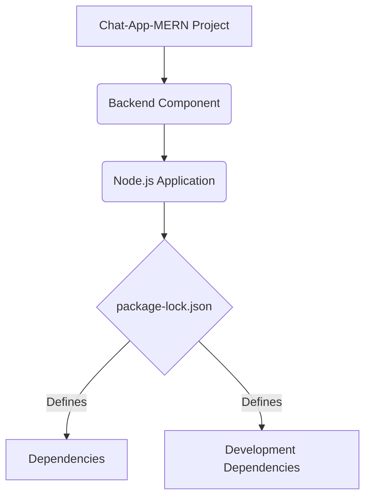

## 1.2 Key Technologies and Purpose

The backend leverages a variety of Node.js modules to provide core functionalities:

*   **Express.js**: A fast, unopinionated, minimalist web framework for building the API.
*   **Mongoose**: An ODM (Object Data Modeling) library for MongoDB, used to interact with the database.
*   **Socket.IO**: A library for real-time, bidirectional, event-based communication, essential for a chat application.
*   **Authentication & Authorization**: `bcryptjs`, `jsonwebtoken`, `cookie-parser`, `express-session`, `passport`, `passport-google-oauth20` indicate robust security measures including password hashing, JWT for token-based authentication, cookie management, session handling, and Google OAuth2.0 integration.
*   **Cloudinary**: For cloud-based image and video management, suggesting media sharing capabilities within the chat.
*   **Dotenv**: To manage environment variables securely.

This setup indicates a comprehensive backend capable of handling user authentication, data persistence, real-time messaging, and media uploads.

```mermaid
graph TD
    A[Backend Core] --> B(Express.js Web Framework);
    A --> C(Mongoose ORM for MongoDB);
    A --> D(Socket.IO for Real-time Communication);

    B --> B1[API Endpoints];
    C --> C1[Database Interactions];
    D --> D1[Live Chat Features];

    SubGraph Authentication & Authorization
        E[Bcryptjs]
        F[JSONWebToken]
        G[Cookie-Parser]
        H[Express-Session]
        I[Passport.js]
        J[Passport-Google-OAuth20]
    End

    K[Cloudinary] --> K1[Media Uploads];
    L[Dotenv] --> L1[Environment Variables];

    B --- E;
    B --- F;
    B --- G;
    B --- H;
    B --- I;
    I --- J;

    A --- K;
    A --- L;

```
---
<!-- 2_backendarchitecture.mdx -->
# Backend Architecture
[TOC]

The backend architecture is primarily driven by the dependencies listed in `package-lock.json`, suggesting a robust MERN (MongoDB, Express.js, React, Node.js) stack with real-time capabilities. This section details the main architectural components and their interconnections.

## 2.1 Core Components and Their Roles

The `package-lock.json` provides insights into the key modules forming the backend.

### 2.1.1 Web Server and API (Express.js)

`express` is the foundation for the web server and RESTful API. It handles incoming HTTP requests, routes them to appropriate handlers, and sends back responses. It integrates with various middleware for common web development tasks.

*   **`express`**: [package](https://www.npmjs.com/package/express)
*   **`body-parser`**: [package](https://www.npmjs.com/package/body-parser) (likely used by `express` for parsing request bodies)
*   **`cookie-parser`**: [package](https://www.npmjs.com/package/cookie-parser) (for parsing HTTP request cookies)
*   **`cors`**: [package](https://www.npmjs.com/package/cors) (for Cross-Origin Resource Sharing)

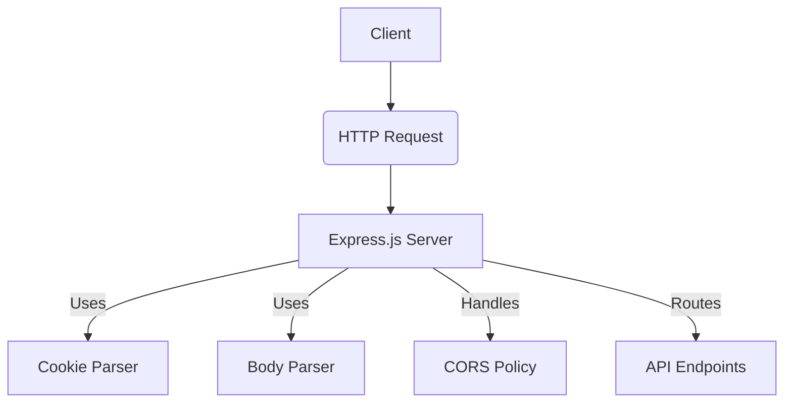

### 2.1.2 Database Management (Mongoose & MongoDB)

`mongoose` is the ODM (Object Data Modeling) library that provides a straightforward, schema-based solution to model application data. It sits on top of the `mongodb` driver, simplifying interactions with the MongoDB database.

*   **`mongoose`**: [package](https://www.npmjs.com/package/mongoose)
*   **`mongodb`**: [package](https://www.npmjs.com/package/mongodb)
*   **`bson`**: [package](https://www.npmjs.com/package/bson) (Binary JSON, part of MongoDB driver)

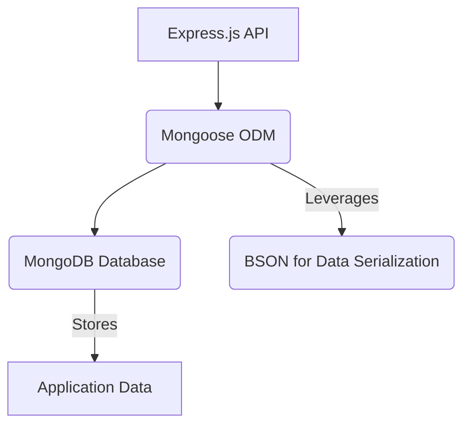

### 2.1.3 Real-time Communication (Socket.IO)

`socket.io` enables real-time, bidirectional communication between the web clients and the server, which is crucial for a chat application. It abstracts various transport mechanisms like WebSockets and long polling.

*   **`socket.io`**: [package](https://www.npmjs.com/package/socket.io)
*   **`engine.io`**: [package](https://www.npmjs.com/package/engine.io) (underlying low-level transport)
*   **`socket.io-adapter`**: [package](https://www.npmjs.com/package/socket.io-adapter) (for scaling across multiple servers)
*   **`socket.io-parser`**: [package](https://www.npmjs.com/package/socket.io-parser) (for encoding/decoding packets)

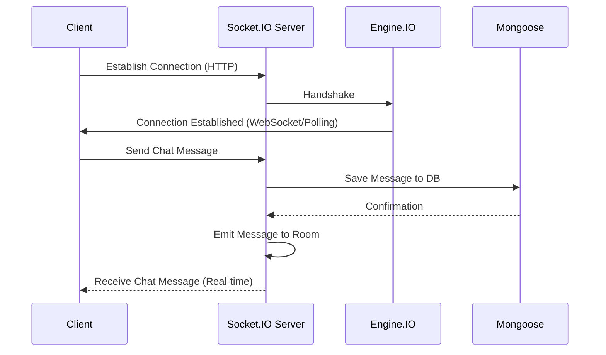
<!-- Corrected invalid syntax -->

## 2.2 Security and Authentication

The backend incorporates multiple libraries for securing the application and managing user identities.

### 2.2.1 User Authentication and Authorization

*   **`bcryptjs`**: [package](https://www.npmjs.com/package/bcryptjs) (for hashing user passwords securely)
*   **`jsonwebtoken`**: [package](https://www.npmjs.com/package/jsonwebtoken) (for creating and verifying JSON Web Tokens for stateless authentication)
*   **`express-session`**: [package](https://www.npmjs.com/package/express-session) (for managing user sessions)
*   **`passport`**: [package](https://www.npmjs.com/package/passport) (authentication middleware for Node.js)
*   **`passport-google-oauth20`**: [package](https://www.npmjs.com/package/passport-google-oauth20) (Passport strategy for authenticating with Google using the OAuth 2.0 API)

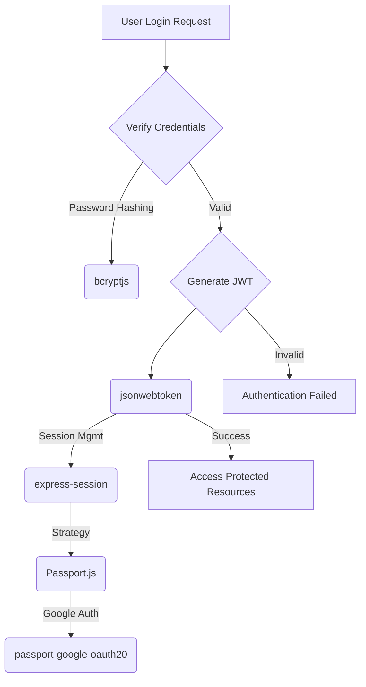

### 2.2.2 Environment Configuration

*   **`dotenv`**: [package](https://www.npmjs.com/package/dotenv) (loads environment variables from a `.env` file into `process.env`)

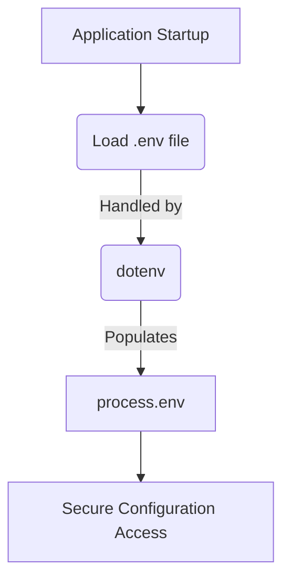

## 2.3 File and Media Handling

*   **`cloudinary`**: [package](https://www.npmjs.com/package/cloudinary) (a cloud-based image and video management service)

This indicates that the chat application supports sharing media files, which are offloaded to Cloudinary to reduce server load and storage requirements.

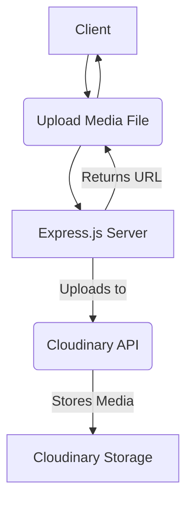

## 2.4 Development Tools

*   **`nodemon`**: [package](https://www.npmjs.com/package/nodemon) (monitors for any changes in your source and automatically restarts your server, essential for development workflow)

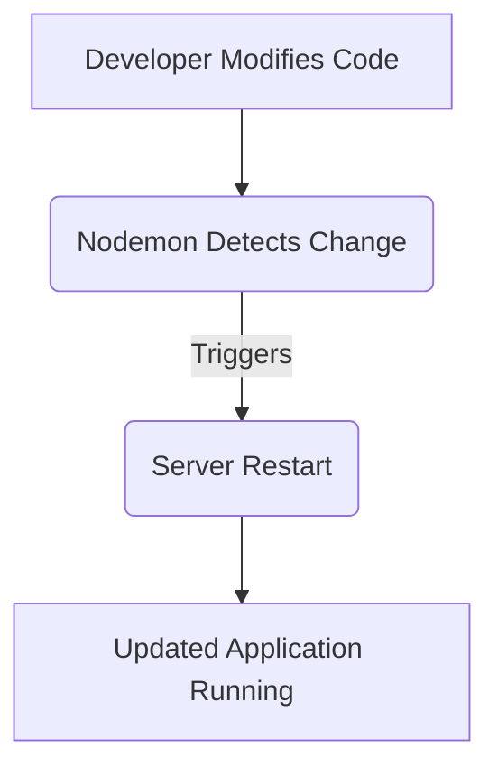
---
<!-- 3_dependencies.mdx -->
# Backend Dependencies
[TOC]

This section details the production and development dependencies of the backend application, as inferred from the `backend/package-lock.json` file. Understanding these dependencies is crucial for maintaining the project, troubleshooting issues, and identifying potential security vulnerabilities.

## 3.1 Production Dependencies

These are the modules required for the application to run correctly in a production environment.

### 3.1.1 Web Framework and Utilities
The core web functionality is built upon Express and related middleware.

*   **`express@4.21.2`**: [GitHub](https://github.com/expressjs/express)
    *   A minimalist web framework for Node.js, used for building the API.
*   **`cookie-parser@1.4.7`**: [GitHub](https://github.com/expressjs/cookie-parser)
    *   Middleware for parsing `Cookie` header and populating `req.cookies`.
*   **`body-parser@1.20.3`**: [GitHub](https://github.com/expressjs/body-parser)
    *   Parse incoming request bodies in a middleware before your handlers.
*   **`cors@2.8.5`**: [GitHub](https://github.com/expressjs/cors)
    *   Provides a Connect/Express middleware that can be used to enable CORS with various options.

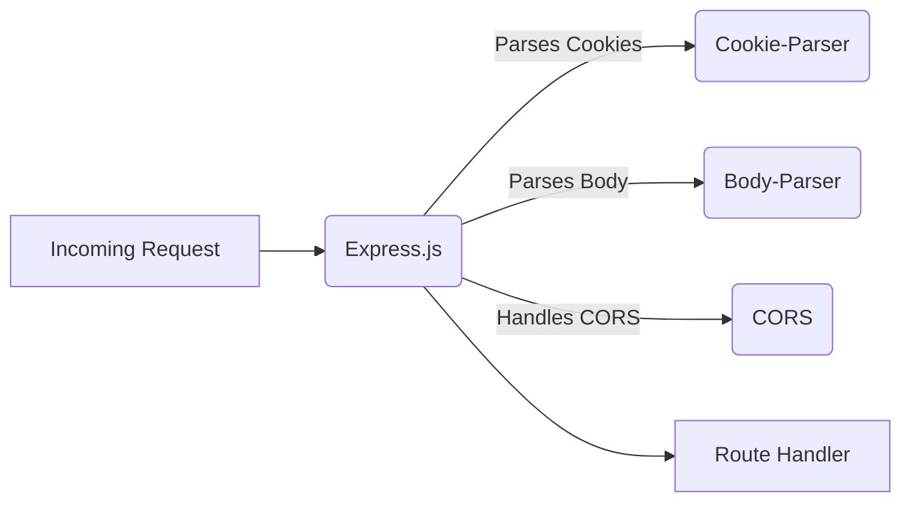

### 3.1.2 Database and ODM
The application interacts with a MongoDB database using Mongoose.

*   **`mongoose@8.16.0`**: [GitHub](https://github.com/Automattic/mongoose)
    *   MongoDB object modeling tool designed to work in an asynchronous environment.
*   **`mongodb@6.17.0`**: [GitHub](https://github.com/mongodb/node-mongodb-native)
    *   The official MongoDB driver for Node.js. Mongoose uses this internally.
*   **`bson@6.10.4`**: [GitHub](https://github.com/mongodb/js-bson)
    *   Native BSON (Binary JSON) parser and serializer. Used by MongoDB driver.

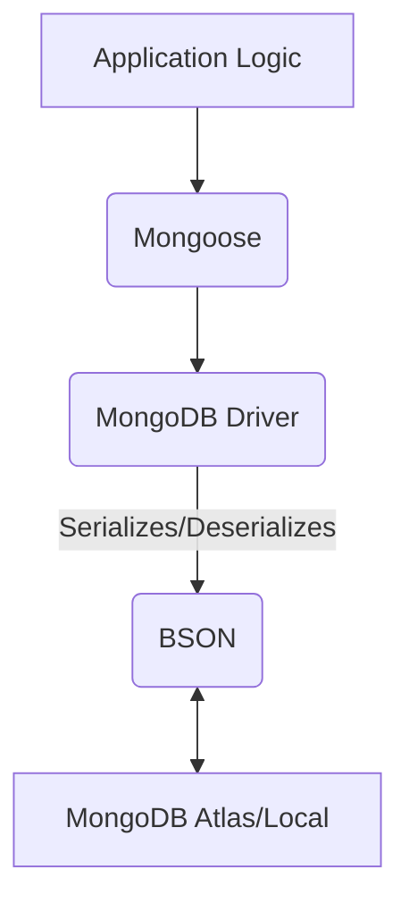

### 3.1.3 Authentication and Authorization
Multiple components ensure secure user authentication and session management.

*   **`bcryptjs@2.4.3`**: [GitHub](https://github.com/dcodeIO/bcrypt.js)
    *   A library for hashing passwords, commonly used to secure user credentials.
*   **`jsonwebtoken@9.0.2`**: [GitHub](https://github.com/auth0/node-jsonwebtoken)
    *   An implementation of JSON Web Tokens for authentication.
*   **`express-session@1.18.1`**: [GitHub](https://github.com/expressjs/session)
    *   HTTP session middleware for Express.
*   **`passport@0.7.0`**: [GitHub](https://github.com/jaredhanson/passport)
    *   Simple, unobtrusive authentication middleware for Node.js.
*   **`passport-google-oauth20@2.0.0`**: [GitHub](https://github.com/jaredhanson/passport-google-oauth2)
    *   Passport strategy for authenticating with Google using the OAuth 2.0 API.

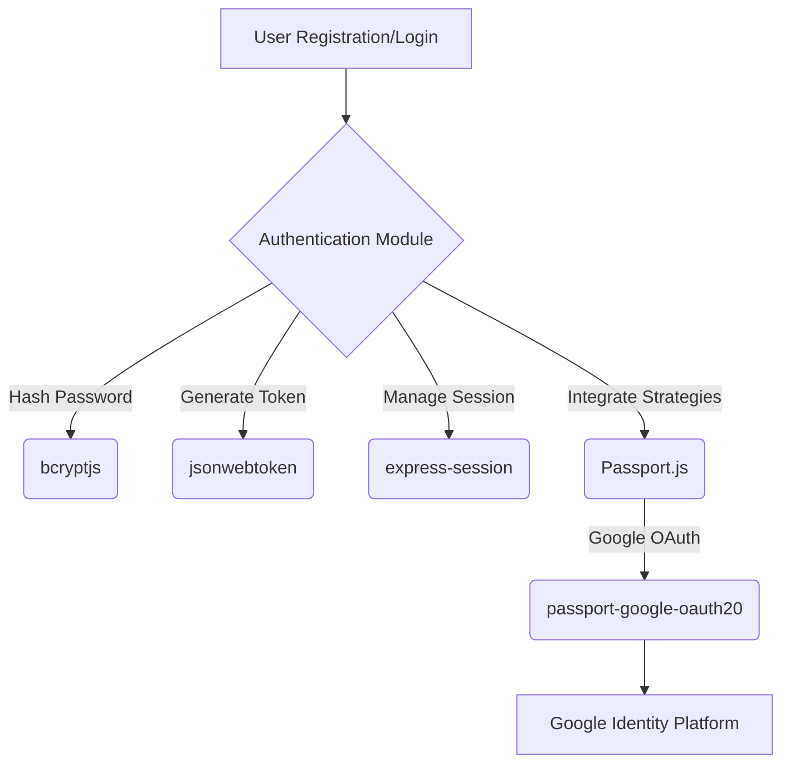

### 3.1.4 Real-time Communication
Socket.IO is central to the chat functionality.

*   **`socket.io@4.8.1`**: [GitHub](https://github.com/socketio/socket.io)
    *   Enables real-time, bidirectional and event-based communication.
*   **`engine.io@6.6.4`**: [GitHub](https://github.com/socketio/engine.io)
    *   The low-level transport layer for Socket.IO.
*   **`socket.io-adapter@2.5.5`**: [GitHub](https://github.com/socketio/socket.io-adapter)
    *   Default adapter for Socket.IO, allows for scaling across multiple servers.
*   **`socket.io-parser@4.2.4`**: [GitHub](https://github.com/socketio/socket.io-parser)
    *   Encodes and decodes Socket.IO packets.

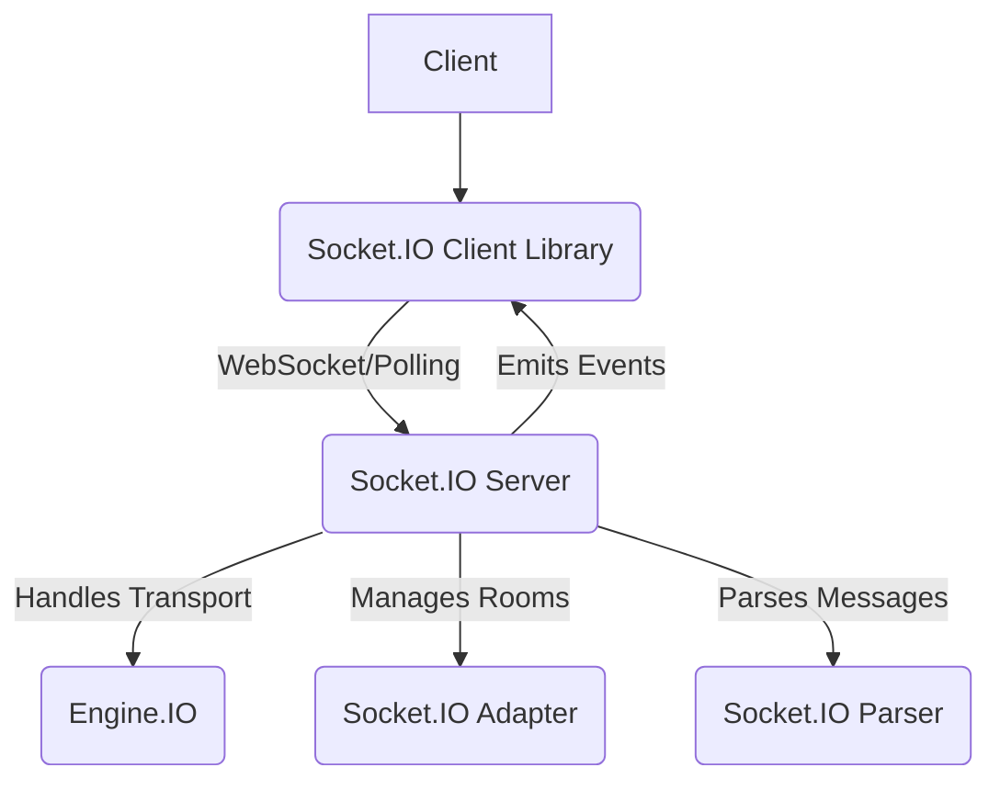

### 3.1.5 Cloud Services and Utilities
External services and general utilities.

*   **`cloudinary@2.6.1`**: [GitHub](https://github.com/cloudinary/cloudinary_npm)
    *   Node.js library for Cloudinary's image and video management service.
*   **`dotenv@16.5.0`**: [GitHub](https://github.com/motdotla/dotenv)
    *   Loads environment variables from a `.env` file.

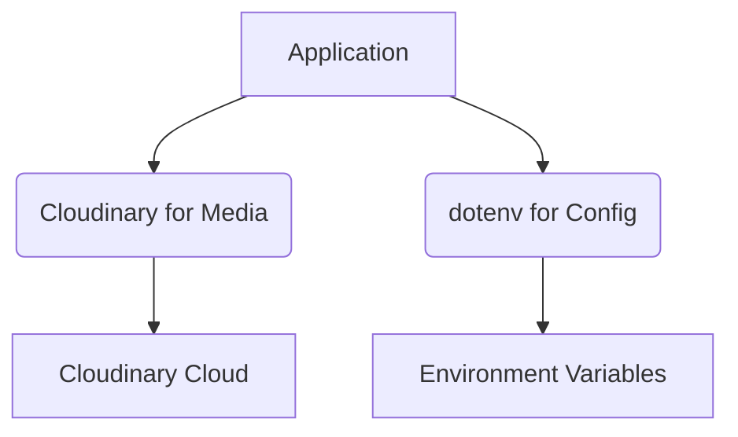

## 3.2 Development Dependencies

These dependencies are only needed during development and are not part of the production bundle.

*   **`nodemon@3.1.10`**: [GitHub](https://github.com/remy/nodemon)
    *   A tool that helps develop Node.js based applications by automatically restarting the Node application when file changes in the directory are detected.

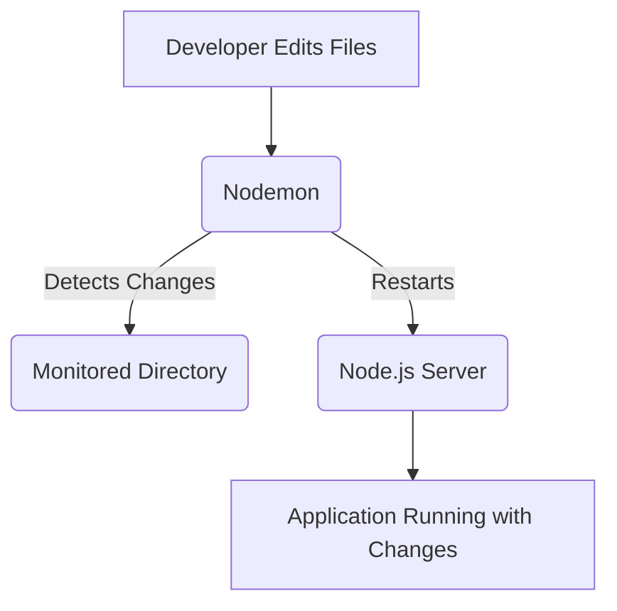

---

<!-- 1_overview.mdx -->
# Overview
[TOC]

This documentation provides a comprehensive overview of the `Chat-App-MERN` backend, focusing on its core components, dependencies, and authentication mechanisms. The backend is built using the MERN stack (MongoDB, Express.js, React.js, Node.js) and includes features like user authentication (email/password and Google OAuth), profile management, and real-time communication via WebSockets.

The project structure is organized to ensure modularity and maintainability, with clear separation of concerns between controllers, models, and utility functions.

## Project Structure
The backend is primarily located in the `backend/` directory.

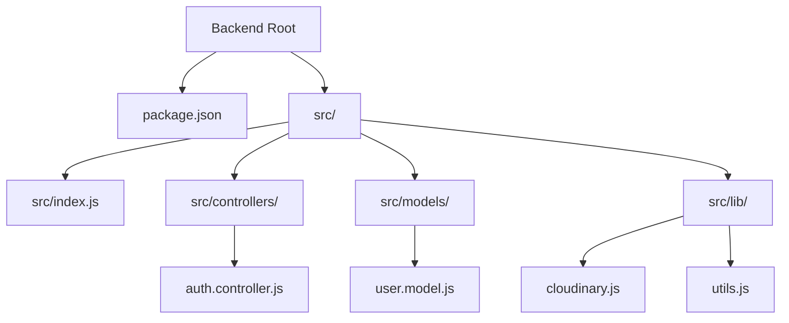

## Technologies Used
The backend leverages a variety of technologies and libraries to deliver its functionalities.

### Core Dependencies
The primary dependencies are defined in the [backend/package.json](https://github.com/shinymack/Chat-App-MERN/backend/package.json) file.

```json
{
  "name": "backend",
  "version": "1.0.0",
  "main": "src/index.js",
  "type": "module",
  "dependencies": {
    "bcryptjs": "^2.4.3",
    "cloudinary": "^2.5.1",
    "cookie-parser": "^1.4.7",
    "dotenv": "^16.4.7",
    "express": "^4.21.2",
    "express-session": "^1.18.1",
    "jsonwebtoken": "^9.0.2",
    "mongoose": "^8.9.5",
    "passport": "^0.7.0",
    "passport-google-oauth20": "^2.0.0",
    "socket.io": "^4.8.1"
  },
  "devDependencies": {
    "nodemon": "^3.1.9"
  }
}
```

Key dependencies include:
*   **Express**: Web framework for Node.js.
*   **Mongoose**: MongoDB object modeling tool.
*   **bcryptjs**: For password hashing.
*   **jsonwebtoken**: For generating and verifying JWTs.
*   **cookie-parser**: To parse Cookie header and populate `req.cookies`.
*   **dotenv**: To load environment variables.
*   **cloudinary**: For cloud-based image and video management.
*   **socket.io**: For real-time, bidirectional, event-based communication.
*   **passport** and **passport-google-oauth20**: For Google OAuth authentication.

### Development Dependencies
*   **nodemon**: A tool that helps develop Node.js based applications by automatically restarting the node application when file changes in the directory are detected.

---
FILEBREAK---
<!-- 2_backendarchitecture.mdx -->
# Backend Architecture
[TOC]

The backend architecture is designed to handle API requests, manage user authentication, interact with the database, and facilitate real-time communication. It follows a typical Model-View-Controller (MVC) pattern, with controllers handling request logic, models defining database schemas, and views (though not explicitly present in a pure API backend) conceptually represented by the JSON responses.

## Request Flow
All incoming HTTP requests are handled by the Express.js server. Authentication-related requests are processed by the `auth.controller.js`.

```mermaid
graph TD
    A[Client Request] --> B{Express Server}
    B --> C{Router}
    C --> D[Controller (e.g., auth.controller.js)]
    D --> E{Service/Utility (e.g., JWT generation, Cloudinary)}
    D --> F[Model (e.g., User.model.js)]
    F --> G[Database (MongoDB)]
    G --> F
    F --> D
    E --> D
    D --> H[Response (JSON/Cookie)]
    H --> B
    B --> A
```

## Authentication System
The authentication system supports both traditional email/password login and Google OAuth. It uses JWTs (JSON Web Tokens) for session management, stored as HTTP-only cookies.

### Authentication Flow (Email/Password)
The email/password authentication flow involves user registration (`signup`), login (`login`), and logout (`logout`).

```mermaid
sequenceDiagram
    participant C as Client
    participant B as Backend
    participant DB as Database
    C->>B: POST /api/auth/signup (username, email, password)
    B->>B: Validate input
    alt Email/Username exists
        B-->>C: 400 Bad Request (Error: Email/Username exists)
    else New User
        B->>B: Hash Password (bcryptjs)
        B->>DB: Save New User (User.model.js)
        DB-->>B: User Created
        B->>B: Generate JWT (generateToken utility)
        B-->>C: 201 Created (User data, JWT in cookie)
    end

    C->>B: POST /api/auth/login (email, password)
    B->>DB: Find User by Email
    DB-->>B: User Data
    alt User not found or Google auth only
        B-->>C: 400 Bad Request (Error: Invalid credentials)
    else User found
        B->>B: Compare Password (bcryptjs)
        alt Incorrect Password
            B-->>C: 400 Bad Request (Error: Invalid credentials)
        else Correct Password
            B->>B: Generate JWT (generateToken utility)
            B-->>C: 200 OK (User data, JWT in cookie)
        end
    end

    C->>B: POST /api/auth/logout
    B->>B: Clear JWT cookie
    B-->>C: 200 OK (Logged out)
```

### Google OAuth Flow
Google OAuth is integrated using `passport` and `passport-google-oauth20`, allowing users to sign in with their Google accounts.

```mermaid
sequenceDiagram
    participant C as Client
    participant B as Backend
    participant G as Google OAuth
    participant DB as Database

    C->>B: GET /api/auth/google (Initiate Google OAuth)
    B->>G: Redirect to Google for authentication
    G-->>C: Redirect to Google login page
    C->>G: User logs in/authorizes app
    G-->>B: Redirect to /api/auth/google/callback with code
    B->>G: Exchange code for tokens (via Passport)
    G-->>B: User Profile and Tokens
    B->>DB: Check if user exists (by Google ID/email)
    alt User exists
        B->>DB: Update user if necessary
    else New user
        B->>DB: Create new user (authProvider: 'google')
    end
    DB-->>B: User record
    B->>B: Generate JWT (generateToken utility)
    B-->>C: Redirect to frontend URL with JWT in cookie
    C->>C: Frontend processes cookie and logs in user
```

### Profile Management
The backend provides endpoints for checking username availability and updating user profiles, including username and profile picture.

#### Check Username Availability
The `checkUsernameAvailability` endpoint allows clients to verify if a username is already taken or meets length requirements before a user attempts to update their profile or sign up.

```mermaid
sequenceDiagram
    participant C as Client
    participant B as Backend
    participant DB as Database

    C->>B: GET /api/auth/checkUsername/:username (e.g., "/api/auth/checkUsername/johndoe")
    B->>B: Validate username length (3-20 characters)
    alt Invalid Length
        B-->>C: 400 Bad Request (Error: Invalid username length)
    else Valid Length
        B->>DB: Find user with requested username
        DB-->>B: Existing User Data (if any)
        alt Username matches current user's username
            B-->>C: 200 OK ({available: true, message: "This is your current username."})
        alt Username already exists for another user
            B-->>C: 200 OK ({available: false, message: "Username is already taken."})
        else Username is unique
            B-->>C: 200 OK ({available: true, message: "Username is available."})
        end
    end
```

#### Update Profile
Users can update their profile information, such as their username and profile picture. Profile picture updates utilize Cloudinary for image hosting.

```mermaid
sequenceDiagram
    participant C as Client
    participant B as Backend
    participant CL as Cloudinary
    participant DB as Database

    C->>B: PUT /api/auth/updateProfile (profilePic, username)
    B->>B: Authenticate User (via JWT in cookie)
    B->>DB: Find User by ID
    alt User not found
        B-->>C: 404 Not Found (Error: User not found)
    else User found
        alt Username provided and changed
            B->>B: Validate new username (length, unique)
            DB->>B: Check for existing username (excluding current user)
            alt New username invalid or taken
                B-->>C: 400 Bad Request (Error: Username invalid/taken)
            end
        end
        alt Profile picture provided
            B->>CL: Upload profilePic (base64/file)
            CL-->>B: Secure URL of uploaded image
            B->>B: Store secure_url for profilePic
        end
        B->>DB: Update User record with new data
        DB-->>B: Updated User data
        B->>B: Re-generate JWT (if sensitive data like username changed)
        B-->>C: 200 OK (Updated User data, new JWT in cookie)
    end
```

---
FILEBREAK---
<!-- 2.1_authenticationcontroller.mdx -->
# Authentication Controller
[TOC]

The [backend/src/controllers/auth.controller.js](https://github.com/shinymack/Chat-App-MERN/backend/src/controllers/auth.controller.js) file contains all the core logic for user authentication and authorization within the application. It handles user registration, login, logout, Google OAuth callbacks, and profile-related actions like checking username availability and updating user details.

## Overview of Functions

This controller exports several asynchronous functions, each responsible for a specific authentication-related task:

*   `signup`: Registers a new user with an email and password.
*   `login`: Authenticates an existing user with their email and password.
*   `logout`: Clears the authentication cookie, logging out the user.
*   `checkAuth`: Verifies the current user's authentication status and returns their details.
*   `googleAuthCallback`: Handles the callback from Google OAuth after successful authentication.
*   `checkUsernameAvailability`: Checks if a given username is available or already taken.
*   `updateProfile`: Allows authenticated users to update their username and profile picture.

## `signup` Function

Handles the registration of new users. It validates input, checks for existing users, hashes passwords, and generates a JWT for the new user.

### Request Body
```json
{
  "username": "newuser",
  "email": "newuser@example.com",
  "password": "securepassword123"
}
```

### Logic
1.  **Input Validation**: Checks if `username`, `email`, and `password` are provided.
2.  **Length Constraints**: Enforces minimum/maximum length for username and password.
3.  **Existence Check**: Verifies if an email or username already exists in the database.
4.  **Password Hashing**: Uses `bcryptjs` to hash the password securely.
5.  **User Creation**: Creates a new `User` document in MongoDB.
6.  **Token Generation**: Calls `generateToken` to create a JWT and set it as an HTTP-only cookie.
7.  **Response**: Returns the new user's details (excluding password) and a 201 status code.

```mermaid
flowchart TD
    A[Start Signup] --> B{Request Body Received (username, email, password)};
    B --> C{Validate Inputs?};
    C -- No --> D[400 Error: Missing fields/Invalid length];
    C -- Yes --> E{Email/Username Exists?};
    E -- Yes --> D;
    E -- No --> F[Generate Salt];
    F --> G[Hash Password];
    G --> H[Create New User in DB];
    H --> I[Generate JWT Token];
    I --> J[Set JWT Cookie & 201 Response];
    J --> K[End Signup];
    D --> K;
```

## `login` Function

Manages user login. It validates credentials, ensures non-Google users have a password, and generates a JWT upon successful authentication.

### Request Body
```json
{
  "email": "user@example.com",
  "password": "userpassword"
}
```

### Logic
1.  **Find User**: Locates the user by `email` in the database.
2.  **Credential Check**:
    *   If user not found, returns invalid credentials error.
    *   If user signed up with Google and tries to log in with email/password, prompts to use Google login.
3.  **Password Comparison**: Uses `bcryptjs` to compare the provided password with the stored hashed password.
4.  **Token Generation**: If passwords match, calls `generateToken` to create a JWT and set it as an HTTP-only cookie.
5.  **Response**: Returns the authenticated user's details and a 200 status code.

```mermaid
flowchart TD
    A[Start Login] --> B{Request Body Received (email, password)};
    B --> C{Find User by Email?};
    C -- No --> D[400 Error: Invalid credentials];
    C -- Yes --> E{Auth Provider is 'google' & No Password?};
    E -- Yes --> F[400 Error: Please sign in with Google];
    E -- No --> G{Compare Password (bcryptjs)?};
    G -- No --> D;
    G -- Yes --> H[Generate JWT Token];
    H --> I[Set JWT Cookie & 200 Response];
    I --> J[End Login];
    D --> J;
    F --> J;
```

## `logout` Function

Handles user logout by clearing the JWT cookie.

### Logic
1.  **Clear Cookie**: Sets the `jwt` cookie's `maxAge` to 0, effectively deleting it.
2.  **Response**: Returns a 200 status code with a "Logged out successfully" message.

## `checkAuth` Function

Verifies if a user is currently authenticated and returns their details. This function typically relies on a middleware (not shown here, but inferred from `req.user`) that populates `req.user` if a valid JWT is present.

### Logic
1.  **Access `req.user`**: Assumes `req.user` is populated by an authentication middleware.
2.  **Response**: Returns the authenticated user's details and a 200 status code.

## `googleAuthCallback` Function

Processes the callback from Google after a user has authenticated via Google OAuth.

### Logic
1.  **User Check**: Ensures `req.user` is populated, indicating successful Passport.js processing.
2.  **Token Generation**: Calls `generateToken` for the Google-authenticated user.
3.  **Redirection**: Redirects the user to the frontend URL.

## `checkUsernameAvailability` Function

Checks if a given username is available for use.

### Request Parameters
`GET /api/auth/checkUsername/:username`

### Logic
1.  **Input Validation**: Validates `username` length.
2.  **Current User Check**: If the provided username is the current authenticated user's username, it's considered available.
3.  **Database Check**: Queries the database to see if any other user already has this username.
4.  **Response**: Returns `available: true` or `available: false` along with a message.

## `updateProfile` Function

Allows an authenticated user to update their `username` and/or `profilePic`.

### Request Body
```json
{
  "username": "updatedusername",
  "profilePic": "base64encodedimage_or_url"
}
```

### Logic
1.  **User Authentication**: Identifies the user via `req.user._id`.
2.  **Username Update**:
    *   Validates new username length and uniqueness (ensuring it's not taken by another user).
    *   If valid and different from current, updates `username`.
3.  **Profile Picture Update**:
    *   If `profilePic` is provided (e.g., base64 string), uploads it to Cloudinary.
    *   Stores the `secure_url` from Cloudinary.
4.  **Database Update**: Updates the user document in MongoDB.
5.  **Token Refresh**: Re-generates and sets a new JWT cookie with potentially updated user information.
6.  **Response**: Returns the `updatedUser` object and a 200 status code.

```mermaid
flowchart TD
    A[Start UpdateProfile] --> B{Authenticated User?};
    B -- No --> C[401 Unauthorized];
    B -- Yes --> D{Find User by ID};
    D -- Not Found --> E[404 User Not Found];
    D -- Found --> F{Username Update Requested?};
    F -- Yes --> G{Validate New Username & Check Uniqueness};
    G -- Invalid/Taken --> H[400 Error: Username issue];
    G -- Valid/Unique --> I[Prepare username for update];
    F -- No --> I;
    I --> J{ProfilePic Update Requested?};
    J -- Yes --> K[Upload to Cloudinary];
    K -- Fail --> L[500 Cloudinary Error];
    K -- Success --> M[Prepare profilePic URL for update];
    J -- No --> M;
    M --> N{Any fields to update?};
    N -- No --> O[400 Error: No changes provided];
    N -- Yes --> P[Update User in DB];
    P -- Fail --> Q[500 Internal Server Error];
    P -- Success --> R[Generate New JWT Token];
    R --> S[Set New JWT Cookie & 200 Response];
    S --> T[End UpdateProfile];
    C --> T; E --> T; H --> T; L --> T; O --> T; Q --> T;
```

---

<!-- 1_overview.mdx -->
# 1. Overview
[TOC]

This documentation provides a comprehensive overview of the backend services for a chat application. It details the core components, their functionalities, and how they interact to support features like user authentication, friend management, and real-time messaging.

The backend is built using Node.js with Express, MongoDB for data persistence, and leverages real-time communication via WebSockets. Authentication is handled using Passport.js, supporting both local and Google OAuth strategies.

## 1.1. Project Structure
The `backend/src` directory contains the main source code, organized into controllers, libraries, models, and routes.

```mermaid
graph TD
    A[backend/] --> B[src/]
    B --> C[controllers/]
    B --> D[lib/]
    B --> E[models/]
    B --> F[routes/]
    B --> G[index.js]
    C --> C1[friend.controller.js]
    C --> C2[message.controller.js]
    D --> D1[cloudinary.js]
    D --> D2[db.js]
    D --> D3[passport.config.js]
    D --> D4[socket.js]
    F --> F1[auth.route.js]
    F --> F2[friend.route.js]
    F --> F3[message.route.js]
```

## 1.2. Key Technologies
*   **Node.js & Express**: The foundation for the backend server.
*   **MongoDB**: NoSQL database for storing application data.
*   **Mongoose**: ODM (Object Data Modeling) library for MongoDB.
*   **Passport.js**: Authentication middleware for Node.js.
*   **Socket.IO**: For real-time, bidirectional event-based communication.
*   **Cloudinary**: Cloud-based image and video management.

---FILEBREAK---
<!-- 2_backendarchitecture.mdx -->
# 2. Backend Architecture
[TOC]

The backend architecture is designed to be modular and scalable, separating concerns into distinct layers: routes, controllers, models, and utility libraries. This section details the overall structure and how different components interact.

## 2.1. Application Entry Point
The primary entry point for the backend is `backend/src/index.js`, which sets up the Express server, middleware, database connection, and routes.

### 2.1.1. Server Setup and Configuration
The `index.js` file handles:
*   **Environment Variables**: Loaded using `dotenv`.
*   **Middleware**: `cookieParser`, `express.json`, `express.urlencoded`, `cors`, `express-session`, `passport.initialize()`, `passport.session()`.
*   **Database Connection**: Established via `connectDB` from [backend/src/lib/db.js](https://github.com/shinymack/Chat-App-MERN/backend/src/lib/db.js).
*   **Passport Configuration**: Initialized from [backend/src/lib/passport.config.js](https://github.com/shinymack/Chat-App-MERN/backend/src/lib/passport.config.js).
*   **Routes**: Registered for authentication, messages, and friends.
*   **Socket.IO**: Integrated for real-time features.
*   **Static File Serving**: For production builds, serves frontend assets.

```mermaid
graph TD
    A[index.js] --> B(Express App)
    B --> C{Middleware Setup}
    C --> C1[cookieParser]
    C --> C2[express.json]
    C --> C3[express.urlencoded]
    C --> C4[CORS]
    C --> C5[express-session]
    C --> C6[passport.initialize]
    C --> C7[passport.session]
    B --> D{Route Handlers}
    D --> D1[/api/auth]
    D --> D2[/api/messages]
    D --> D3[/api/friends]
    B --> E(Database Connection)
    E --> F[connectDB]
    B --> G(Socket.IO Server)
    G --> H[Real-time Events]
    F -- Connects --> I[MongoDB]
```

## 2.2. Database Management
The application uses MongoDB for data storage, managed through Mongoose.

### 2.2.1. MongoDB Connection
The [backend/src/lib/db.js](https://github.com/shinymack/Chat-App-MERN/backend/src/lib/db.js) file contains the `connectDB` function, which establishes a connection to MongoDB using the URI provided in environment variables.

```mermaid
graph TD
    A[index.js] --> B[connectDB()]
    B --> C{Mongoose.connect(MONGODB_URI)}
    C -- Success --> D[MongoDB Connected]
    C -- Error --> E[Log Error]
```

## 2.3. Utility Libraries
Several utility files are used for external service integrations and core functionalities.

### 2.3.1. Cloudinary
The [backend/src/lib/cloudinary.js](https://github.com/shinymack/Chat-App-MERN/backend/src/lib/cloudinary.js) file configures the Cloudinary SDK for image uploads, using API credentials from environment variables. This is primarily used in the message controller for handling image attachments.

```mermaid
graph TD
    A[Cloudinary Config] --> B{Cloudinary SDK}
    B -- Uses --> C[CLOUDINARY_CLOUD_NAME]
    B -- Uses --> D[CLOUDINARY_API_KEY]
    B -- Uses --> E[CLOUDINARY_API_SECRET]
    F[sendMessage] -- Uploads Image --> A
```

---FILEBREAK---
<!-- 3_authentication.mdx -->
# 3. Authentication System
[TOC]

The authentication system is built using Passport.js, supporting both local (username/password) and Google OAuth 2.0 strategies. It handles user registration, login, logout, and session management.

## 3.1. Passport Configuration
The [backend/src/lib/passport.config.js](https://github.com/shinymack/Chat-App-MERN/backend/src/lib/passport.config.js) file contains the logic for configuring Passport.js strategies and user serialization/deserialization.

### 3.1.1. Google OAuth Strategy
The GoogleStrategy is configured to allow users to sign in with their Google accounts.
*   It retrieves `clientID`, `clientSecret`, and `callbackURL` from environment variables.
*   Upon successful authentication, it checks if a user with the Google ID already exists.
*   If not, a new user is created with details from the Google profile, ensuring uniqueness for username and handling cases where email might be missing or an existing account uses the same email.

```mermaid
sequenceDiagram
    participant User
    participant Frontend
    participant Backend (Passport)
    participant MongoDB

    User->Frontend: Click "Sign in with Google"
    Frontend->Backend: Redirect to /api/auth/google
    Backend->User: Redirect to Google Auth Page
    User->Google: Authenticate & Grant Permissions
    Google->Backend: Callback with profile data (to callbackURL)
    Backend->Backend: `GoogleStrategy` callback executed
    Backend->MongoDB: Find user by `googleId`
    alt User Exists
        MongoDB-->Backend: User data
        Backend->Backend: `done(null, user)`
    else User Not Exists
        Backend->MongoDB: Check existing username/email
        MongoDB-->Backend: No existing user
        Backend->MongoDB: Create new User (with googleId, email, username)
        MongoDB-->Backend: New user saved
        Backend->Backend: `done(null, newUser)`
    end
    Backend->Backend: Serialize user (`user.id`)
    Backend->Frontend: Redirect with session cookie
    Frontend->User: User logged in
```

### 3.1.2. Serialization and Deserialization
*   **`passport.serializeUser`**: Stores the user's MongoDB `_id` in the session after successful authentication.
*   **`passport.deserializeUser`**: Retrieves the full user object from the database using the stored `_id` and attaches it to `req.user` for subsequent requests.

```mermaid
graph TD
    A[User Object] --> B{serializeUser}
    B -- MongoDB _id --> C[Session]
    C --> D{deserializeUser}
    D -- MongoDB _id --> E[MongoDB]
    E -- User Data --> F[req.user]
```

## 3.2. Authentication Routes
The `auth.route.js` file (not provided in detail but inferred) defines the API endpoints for authentication actions.

### 3.2.1. Integration with Express
The routes are integrated into the main Express application in [backend/src/index.js](https://github.com/shinymack/Chat-App-MERN/backend/src/index.js) via `app.use("/api/auth", authRoutes)`.

---FILEBREAK---
<!-- 4_friendmanagement.mdx -->
# 4. Friend Management
[TOC]

The friend management system allows users to send, accept, reject, and remove friend requests, as well as view their friends and pending requests. These functionalities are handled by the [backend/src/controllers/friend.controller.js](https://github.com/shinymack/Chat-App-MERN/backend/src/controllers/friend.controller.js) controller.

## 4.1. Core Friend Actions

### 4.1.1. Send Friend Request (`sendFriendRequest`)
Allows a user to send a friend request to another user identified by their username or email.

*   **Endpoint**: `POST /api/friends/send-request` (inferred)
*   **Input**: `identifier` (username or email of the receiver).
*   **Process**:
    1.  Finds the receiver user by identifier.
    2.  Checks for various conditions: self-request, already friends, request already sent, or existing incoming request.
    3.  Adds the receiver's ID to the sender's `sentRequests` array.
    4.  Adds the sender's ID to the receiver's `friendRequests` array.
    5.  Saves both user documents.

```mermaid
sequenceDiagram
    participant Sender
    participant Backend (friend.controller)
    participant UserDB

    Sender->Backend: POST /api/friends/send-request { identifier }
    Backend->UserDB: Find Sender (req.user._id)
    Backend->UserDB: Find Receiver by identifier
    alt Receiver Not Found
        Backend-->Sender: 404 User not found
    else Conditions check (self, existing friend/request)
        Backend-->Sender: 400 Bad Request
    else Valid Request
        Backend->UserDB: Add Receiver ID to Sender.sentRequests
        Backend->UserDB: Add Sender ID to Receiver.friendRequests
        UserDB-->Backend: Users updated
        Backend-->Sender: 200 Friend request sent
    end
```
[Source Code: sendFriendRequest](https://github.com/shinymack/Chat-App-MERN/backend/src/controllers/friend.controller.js#L7)

### 4.1.2. Accept Friend Request (`acceptFriendRequest`)
Allows a user to accept a pending friend request.

*   **Endpoint**: `PUT /api/friends/accept-request/:senderId` (inferred)
*   **Input**: `senderId` (ID of the user who sent the request).
*   **Process**:
    1.  Finds both sender and receiver (current user).
    2.  Verifies the request exists in the receiver's `friendRequests`.
    3.  Adds each user's ID to the other's `friends` array.
    4.  Removes the request from `receiver.friendRequests` and `sender.sentRequests`.
    5.  Saves both user documents.

```mermaid
sequenceDiagram
    participant Receiver
    participant Backend (friend.controller)
    participant UserDB

    Receiver->Backend: PUT /api/friends/accept-request/:senderId
    Backend->UserDB: Find Sender (senderId)
    Backend->UserDB: Find Receiver (req.user._id)
    alt Users Not Found / Request Not Found
        Backend-->Receiver: 404/400 Error
    else Valid Request
        Backend->UserDB: Add senderId to Receiver.friends
        Backend->UserDB: Add receiverId to Sender.friends
        Backend->UserDB: Remove senderId from Receiver.friendRequests
        Backend->UserDB: Remove receiverId from Sender.sentRequests
        UserDB-->Backend: Users updated
        Backend-->Receiver: 200 Friend request accepted
    end
```
[Source Code: acceptFriendRequest](https://github.com/shinymack/Chat-App-MERN/backend/src/controllers/friend.controller.js#L68)

### 4.1.3. Reject Friend Request (`rejectFriendRequest`)
Allows a user to reject a pending friend request.

*   **Endpoint**: `PUT /api/friends/reject-request/:senderId` (inferred)
*   **Input**: `senderId` (ID of the user who sent the request).
*   **Process**:
    1.  Finds both sender and receiver (current user).
    2.  Removes the request from `receiver.friendRequests` and `sender.sentRequests`.
    3.  Checks if any request was actually removed to confirm the request existed.
    4.  Saves both user documents.

```mermaid
sequenceDiagram
    participant Receiver
    participant Backend (friend.controller)
    participant UserDB

    Receiver->Backend: PUT /api/friends/reject-request/:senderId
    Backend->UserDB: Find Sender (senderId)
    Backend->UserDB: Find Receiver (req.user._id)
    alt Users Not Found
        Backend-->Receiver: 404 User not found
    else Valid Request
        Backend->UserDB: Remove senderId from Receiver.friendRequests
        Backend->UserDB: Remove receiverId from Sender.sentRequests
        UserDB-->Backend: Users updated
        Backend-->Receiver: 200 Friend request rejected
    end
```
[Source Code: rejectFriendRequest](https://github.com/shinymack/Chat-App-MERN/backend/src/controllers/friend.controller.js#L115)

### 4.1.4. Remove Friend (`removeFriend`)
Allows a user to remove an existing friend.

*   **Endpoint**: `DELETE /api/friends/remove/:friendId` (inferred)
*   **Input**: `friendId` (ID of the friend to remove).
*   **Process**:
    1.  Finds both the current user and the friend to remove.
    2.  Verifies they are actually friends.
    3.  Removes each user's ID from the other's `friends` array.
    4.  Saves both user documents.

```mermaid
sequenceDiagram
    participant User
    participant Backend (friend.controller)
    participant UserDB

    User->Backend: DELETE /api/friends/remove/:friendId
    Backend->UserDB: Find User (req.user._id)
    Backend->UserDB: Find FriendToRemove (friendId)
    alt Users Not Found / Not Friends
        Backend-->User: 404/400 Error
    else Valid Request
        Backend->UserDB: Remove friendId from User.friends
        Backend->UserDB: Remove userId from FriendToRemove.friends
        UserDB-->Backend: Users updated
        Backend-->User: 200 Friend removed successfully
    end
```
[Source Code: removeFriend](https://github.com/shinymack/Chat-App-MERN/backend/src/controllers/friend.controller.js#L159)

## 4.2. Friend List Retrieval

### 4.2.1. Get Friends (`getFriends`)
Retrieves a list of all friends for the current user.

*   **Endpoint**: `GET /api/friends/` (inferred)
*   **Output**: An array of friend objects (username, email, profilePic, _id).
*   **Process**:
    1.  Finds the current user.
    2.  Populates the `friends` array, selecting specific fields.

[Source Code: getFriends](https://github.com/shinymack/Chat-App-MERN/backend/src/controllers/friend.controller.js#L199)

### 4.2.2. Get Pending Requests (`getPendingRequests`)
Retrieves a list of friend requests received by the current user.

*   **Endpoint**: `GET /api/friends/pending` (inferred)
*   **Output**: An array of user objects who sent requests.
*   **Process**:
    1.  Finds the current user.
    2.  Populates the `friendRequests` array, selecting specific fields.

[Source Code: getPendingRequests](https://github.com/shinymack/Chat-App-MERN/backend/src/controllers/friend.controller.js#L219)

### 4.2.3. Get Sent Requests (`getSentRequests`)
Retrieves a list of friend requests sent by the current user.

*   **Endpoint**: `GET /api/friends/sent` (inferred)
*   **Output**: An array of user objects to whom requests were sent.
*   **Process**:
    1.  Finds the current user.
    2.  Populates the `sentRequests` array, selecting specific fields.

[Source Code: getSentRequests](https://github.com/shinymack/Chat-App-MERN/backend/src/controllers/friend.controller.js#L239)

---FILEBREAK---
<!-- 5_messaging.mdx -->
# 5. Messaging System
[TOC]

The messaging system enables users to send and receive real-time messages, including text and images, and view their chat history. The core logic resides in the [backend/src/controllers/message.controller.js](https://github.com/shinymack/Chat-App-MERN/backend/src/controllers/message.controller.js) controller.

## 5.1. Message Actions

### 5.1.1. Send Message (`sendMessage`)
Handles sending a new message between two users.

*   **Endpoint**: `POST /api/messages/send/:id`
*   **Input**: `text` (message content), optional `image` (base64 encoded image string).
*   **Process**:
    1.  If an `image` is provided, uploads it to Cloudinary using [backend/src/lib/cloudinary.js](https://github.com/shinymack/Chat-App-MERN/backend/src/lib/cloudinary.js).
    2.  Creates a new `Message` document with `senderId`, `receiverId`, `text`, and `imageUrl`.
    3.  Saves the message to MongoDB.
    4.  Uses Socket.IO ([backend/src/lib/socket.js](https://github.com/shinymack/Chat-App-MERN/backend/src/lib/socket.js)) to emit a `newMessage` event to the receiver in real-time if they are online.

```mermaid
sequenceDiagram
    participant Sender
    participant Backend (message.controller)
    participant Cloudinary
    participant MessageDB
    participant Socket.IO Server
    participant Receiver

    Sender->Backend: POST /api/messages/send/:receiverId { text, image }
    alt Image Provided
        Backend->Cloudinary: Upload image
        Cloudinary-->Backend: secure_url
    end
    Backend->MessageDB: Create and Save New Message
    MessageDB-->Backend: Message saved
    Backend->Socket.IO Server: Get receiver socket ID
    alt Receiver Online
        Socket.IO Server->Receiver: emit("newMessage", newMessage)
    end
    Backend-->Sender: 201 New Message
```
[Source Code: sendMessage](https://github.com/shinymack/Chat-App-MERN/backend/src/controllers/message.controller.js#L46)

### 5.1.2. Get Messages (`getMessages`)
Retrieves all messages exchanged between the current user and a specific chat partner.

*   **Endpoint**: `GET /api/messages/:id`
*   **Input**: `id` (ID of the user to chat with).
*   **Output**: An array of message objects.
*   **Process**:
    1.  Queries the `Message` collection for messages where:
        *   `senderId` is the current user and `receiverId` is the chat partner, OR
        *   `senderId` is the chat partner and `receiverId` is the current user.

```mermaid
sequenceDiagram
    participant User
    participant Backend (message.controller)
    participant MessageDB

    User->Backend: GET /api/messages/:userToChatId
    Backend->MessageDB: Find messages ($or conditions)
    MessageDB-->Backend: Array of messages
    Backend-->User: 200 Messages
```
[Source Code: getMessages](https://github.com/shinymack/Chat-App-MERN/backend/src/controllers/message.controller.js#L30)

## 5.2. User Sidebar Retrieval

### 5.2.1. Get Users for Sidebar (`getUsersForSidebar`)
Retrieves a list of all users excluding the currently logged-in user, typically used to populate a chat sidebar.

*   **Endpoint**: `GET /api/messages/conversations` (inferred)
*   **Output**: An array of user objects (excluding password).
*   **Process**:
    1.  Finds all users in the `User` collection where the `_id` is not equal to the logged-in user's `_id`.
    2.  Selects all fields except `password`.

[Source Code: getUsersForSidebar](https://github.com/shinymack/Chat-App-MERN/backend/src/controllers/message.controller.js#L8)

---FILEBREAK---
<!-- 6_realtimemessaging.mdx -->
# 6. Real-time Messaging with Socket.IO
[TOC]

The application integrates Socket.IO for real-time communication, enabling instant delivery of messages and notifications. The core Socket.IO setup is in [backend/src/lib/socket.js](https://github.com/shinymack/Chat-App-MERN/backend/src/lib/socket.js).

## 6.1. Socket.IO Server Setup
The `socket.js` file initializes the Socket.IO server and handles user connections.

### 6.1.1. User Tracking
*   A `userSocketMap` object is used to store the mapping between `userId` and `socketId`. This allows sending messages to specific users.
*   On `connection`, a user's `userId` is extracted from the handshake query and added to the map.
*   On `disconnect`, the user's entry is removed from the map.

```mermaid
sequenceDiagram
    participant Client
    participant Server (socket.js)

    Client->Server: Connect (socket.io, query={userId: '...' })
    Server->Server: `socket.on('connection')`
    Server->Server: Extract `userId` from `socket.handshake.query`
    Server->Server: Store `userSocketMap[userId] = socket.id`
    Server->Server: `io.emit('getOnlineUsers', Object.keys(userSocketMap))`
    Client->Server: Disconnect
    Server->Server: `socket.on('disconnect')`
    Server->Server: Delete `userSocketMap[userId]`
    Server->Server: `io.emit('getOnlineUsers', Object.keys(userSocketMap))`
```

### 6.1.2. Global `io` Instance
The `io` instance is exported, allowing other parts of the application (e.g., [backend/src/controllers/message.controller.js](https://github.com/shinymack/Chat-App-MERN/backend/src/controllers/message.controller.js)) to emit events.

### 6.1.3. Receiver Socket ID Retrieval
The `getReceiverSocketId` function provides a way to get the active socket ID for a given user ID, crucial for targeted message delivery.

## 6.2. Integration with Messaging
The `sendMessage` function in `message.controller.js` uses `getReceiverSocketId` and the `io` instance to emit a `newMessage` event to the recipient in real-time.

```mermaid
graph TD
    A[Message Controller] --> B{getReceiverSocketId(receiverId)}
    B -- socketId --> C[io.to(socketId).emit('newMessage', ...)]
    C --> D[Receiver Client]
    A -- New Message Saved --> E[MongoDB]
```

---

<!-- 1_overview.mdx -->
# 1. Overview
[TOC]

This documentation provides a comprehensive overview of the Chat-App-MERN project, a real-time chat application built using the MERN stack (MongoDB, Express.js, React, Node.js). It details the architecture, core functionalities, and key components of both the frontend and backend.

## 1.1 Project Description
The Chat-App-MERN is designed to facilitate real-time communication between users, including features such as user authentication, friend management, and instant messaging. It leverages WebSockets for real-time updates and JWT for secure authentication.

## 1.2 Core Features
*   **User Authentication:** Secure signup, login, and logout functionalities with JWT-based authentication. Supports both email/password and Google OAuth.
*   **Friend Management:** Send, accept, reject, and remove friend requests. View lists of friends, pending requests, and sent requests.
*   **Real-time Messaging:** Exchange messages instantly with friends, powered by Socket.IO.
*   **User Profiles:** Update user profiles including profile pictures.
*   **Online Status:** View which friends are currently online.

## 1.3 Technology Stack

The application is built using the following key technologies:

### Frontend
*   **React:** A JavaScript library for building user interfaces.
*   **Vite:** A fast build tool for modern web projects.
*   **ESLint:** For code quality and consistency.

### Backend
*   **Node.js:** A JavaScript runtime for server-side development.
*   **Express.js:** A web application framework for Node.js.
*   **MongoDB:** A NoSQL database for data storage.
*   **Mongoose:** An ODM (Object Data Modeling) library for MongoDB and Node.js.
*   **Socket.IO:** A library for real-time, bidirectional, event-based communication.
*   **JWT (JSON Web Tokens):** For secure user authentication.
*   **Passport.js:** For Google OAuth integration.

### Overall Architecture
```mermaid
graph TD
    A[Client (React App)] -->|HTTP/S Requests| B(Express.js Backend)
    B -->|API Endpoints| C(MongoDB Database)
    A -->|WebSocket Connection| D(Socket.IO Server)
    D -->|Real-time Events| A
    B -- Backend Logic --> D
    D -- User Online Status --> C
```

---
<!-- 2_backendarchitecture.mdx -->
# 2. Backend Architecture
[TOC]

The backend of the Chat-App-MERN is built with Node.js and Express.js, providing a robust API for user management, authentication, friend interactions, and real-time messaging. It uses MongoDB as its database and Socket.IO for real-time communication.

## 2.1 Project Structure

The backend follows a modular structure, organizing code into `controllers`, `middleware`, `models`, `routes`, and `lib` directories.

```mermaid
graph TD
    A[Backend Root] --> B[src/]
    B --> B1[controllers/]
    B --> B2[middleware/]
    B --> B3[models/]
    B --> B4[routes/]
    B --> B5[lib/]
    B --> B6[server.js (Entry Point)]
```

## 2.2 Core Components

### 2.2.1 Models

Mongoose models define the schema and interact with the MongoDB database.

*   **User Model** (`backend/src/models/user.model.js`)
    *   Defines the structure for user data, including `email`, `username`, `password`, `profilePic`, `friends`, `friendRequests`, `sentRequests`, `authProvider`, and `googleId`.
    *   Includes pre-save hooks for handling Google authenticated users and password requirements.
    *   [Source Code](https://github.com/shinymack/Chat-App-MERN/blob/main/backend/src/models/user.model.js)
    ```mermaid
    classDiagram
        class User {
            +String email
            +String username
            +String password
            +String profilePic
            +ObjectId[] friends
            +ObjectId[] friendRequests
            +ObjectId[] sentRequests
            +String authProvider
            +String googleId
            +Date createdAt
            +Date updatedAt
        }
    ```

*   **Message Model** (`backend/src/models/message.model.js`)
    *   Defines the structure for messages, including `senderId`, `receiverId`, `text`, and `image`.
    *   [Source Code](https://github.com/shinymack/Chat-App-MERN/blob/main/backend/src/models/message.model.js)
    ```mermaid
    classDiagram
        class Message {
            +ObjectId senderId
            +ObjectId receiverId
            +String text
            +String image
            +Date createdAt
            +Date updatedAt
        }
        User "1" --> "*" Message : sends
        User "1" --> "*" Message : receives
    ```

### 2.2.2 Middleware

Middleware functions are used to process requests before they reach the route handlers.

*   **Authentication Middleware** (`backend/src/middleware/auth.middleware.js`)
    *   The `protectRoute` middleware verifies the JWT token from cookies, authenticates the user, and attaches the user object to the request.
    *   [Source Code](https://github.com/shinymack/Chat-App-MERN/blob/main/backend/src/middleware/auth.middleware.js)
    ```mermaid
    sequenceDiagram
        actor Client
        participant ExpressApp
        participant AuthMiddleware
        participant JWTService
        participant UserService
        Client->>ExpressApp: Request with JWT cookie
        ExpressApp->>AuthMiddleware: protectRoute(req, res, next)
        AuthMiddleware->>JWTService: Verify JWT Token
        alt Token Valid
            AuthMiddleware->>UserService: Find User by userId from token
            UserService-->>AuthMiddleware: User Data
            AuthMiddleware->>ExpressApp: next() (Request proceeds)
        else Token Invalid/Missing
            AuthMiddleware-->>Client: 401 Unauthorized
        end
    ```

### 2.2.3 Utility Functions

*   **JWT Utility** (`backend/src/lib/utils.js`)
    *   The `generateToken` function creates a JWT for a given `userId` and sets it as an HTTP-only cookie.
    *   [Source Code](https://github.com/shinymack/Chat-App-MERN/blob/main/backend/src/lib/utils.js)

### 2.2.4 Real-time Communication (Socket.IO)

*   **Socket Configuration** (`backend/src/lib/socket.js`)
    *   Initializes a Socket.IO server alongside the Express app.
    *   Manages online users using a `userSocketMap`.
    *   Emits `getOnlineUsers` events to connected clients when user status changes (connect/disconnect).
    *   Provides `getReceiverSocketId` to retrieve the socket ID of a specific user.
    *   [Source Code](https://github.com/shinymack/Chat-App-MERN/blob/main/backend/src/lib/socket.js)
    ```mermaid
    sequenceDiagram
        participant Client
        participant SocketServer
        participant UserSocketMap
        Client->>SocketServer: Connect (with userId)
        SocketServer->>UserSocketMap: Store userId:socketId
        SocketServer->>SocketServer: io.emit("getOnlineUsers", ...)
        Client->>SocketServer: Disconnect
        SocketServer->>UserSocketMap: Delete userId from map
        SocketServer->>SocketServer: io.emit("getOnlineUsers", ...)
    ```
---
<!-- 2.3_backendroutes.mdx -->
# 2.3 Backend Routes
[TOC]

The backend defines several API routes, categorized by their functionality, to handle user authentication, friend management, and messaging. All sensitive routes are protected by the `protectRoute` middleware.

## 2.3.1 Authentication Routes (`backend/src/routes/auth.route.js`)

These routes handle user registration, login, logout, profile updates, and Google OAuth.

*   `POST /api/auth/signup`: Registers a new user.
*   `POST /api/auth/login`: Authenticates a user and issues a JWT cookie.
*   `POST /api/auth/logout`: Clears the JWT cookie, logging the user out.
*   `PUT /api/auth/update-profile`: Updates the authenticated user's profile. (Protected)
*   `GET /api/auth/username/check/:username`: Checks if a username is available. (Protected)
*   `GET /api/auth/check`: Checks if a user is authenticated. (Protected)
*   `GET /api/auth/google`: Initiates Google OAuth authentication.
*   `GET /api/auth/google/callback`: Handles the callback from Google OAuth.
*   [Source Code](https://github.com/shinymack/Chat-App-MERN/blob/main/backend/src/routes/auth.route.js)

```mermaid
graph TD
    subgraph Auth Flow
        A[Client] --> B(POST /signup)
        A --> C(POST /login)
        A --> D(POST /logout)
        A --> E(PUT /update-profile)
        A --> F(GET /username/check/:username)
        A --> G(GET /check)
        A --> H(GET /google)
        H --> I[Google OAuth]
        I --> J(GET /google/callback)
    end
    E,F,G -- Protected --> Middleware[protectRoute]
    J -- Callback Handler --> LoginLogic[googleAuthCallback]
```

## 2.3.2 Friend Management Routes (`backend/src/routes/friend.route.js`)

These routes manage friend requests and the friend list for authenticated users. All routes are protected.

*   `POST /api/friends/request/send/`: Sends a friend request.
*   `POST /api/friends/request/accept/:senderId`: Accepts an incoming friend request.
*   `POST /api/friends/request/reject/:senderId`: Rejects an incoming friend request.
*   `DELETE /api/friends/remove/:friendId`: Removes a friend from the list.
*   `GET /api/friends/list`: Retrieves the authenticated user's friends list.
*   `GET /api/friends/requests/pending`: Retrieves pending incoming friend requests.
*   `GET /api/friends/requests/sent`: Retrieves outgoing friend requests sent by the user.
*   [Source Code](https://github.com/shinymack/Chat-App-MERN/blob/main/backend/src/routes/friend.route.js)

```mermaid
graph TD
    subgraph Friend Management Flow
        A[Client] --> B(POST /request/send/)
        A --> C(POST /request/accept/:senderId)
        A --> D(POST /request/reject/:senderId)
        A --> E(DELETE /remove/:friendId)
        A --> F(GET /list)
        A --> G(GET /requests/pending)
        A --> H(GET /requests/sent)
    end
    B,C,D,E,F,G,H -- Protected --> Middleware[protectRoute]
```

## 2.3.3 Message Routes (`backend/src/routes/message.route.js`)

These routes handle sending and retrieving messages. All routes are protected.

*   `GET /api/messages/users`: Retrieves a list of users for the sidebar (e.g., friends to chat with).
*   `GET /api/messages/:id`: Retrieves messages between the authenticated user and a specific user identified by `:id`.
*   `POST /api/messages/send/:id`: Sends a message to a specific user identified by `:id`.
*   [Source Code](https://github.com/shinymack/Chat-App-MERN/blob/main/backend/src/routes/message.route.js)

```mermaid
graph TD
    subgraph Messaging Flow
        A[Client] --> B(GET /users)
        A --> C(GET /:id)
        A --> D(POST /send/:id)
    end
    B,C,D -- Protected --> Middleware[protectRoute]
```

---
<!-- 3_frontendarchitecture.mdx -->
# 3. Frontend Architecture
[TOC]

The frontend of the Chat-App-MERN is built with React and uses Vite for a fast development experience. It provides the user interface for all chat functionalities, interacting with the backend API.

## 3.1 Project Setup

The project is initialized with `create-vite` and uses the `@vitejs/plugin-react` for Fast Refresh.

*   **`frontend/README.md`**: Provides basic setup instructions and details about the Vite + React template.
    *   [Source Code](https://github.com/shinymack/Chat-App-MERN/blob/main/frontend/README.md)
*   **`frontend/index.html`**: The main HTML file serving the React application.
    *   [Source Code](https://github.com/shinymack/Chat-App-MERN/blob/main/frontend/index.html)

## 3.2 Development Tools and Configuration

### 3.2.1 ESLint Configuration (`frontend/eslint.config.js`)

ESLint is configured to maintain code quality and consistency across the React codebase.

*   Ignores the `dist` directory.
*   Applies ESLint rules for JavaScript and React, including `eslint-plugin-react`, `eslint-plugin-react-hooks`, and `eslint-plugin-react-refresh`.
*   Disables `react/jsx-no-target-blank` and `react/prop-types` for flexibility in this project.
*   Warns about `react-refresh/only-export-components` to ensure proper Fast Refresh functionality.
*   [Source Code](https://github.com/shinymack/Chat-App-MERN/blob/main/frontend/eslint.config.js)

```mermaid
graph TD
    A[ESLint Configuration] --> B{Applies to **/*.{js,jsx}}
    B --> C[Ignores: 'dist']
    B --> D[Language Options: ECMAScript 2020, Browser Globals, JSX, Modules]
    B --> E[Plugins: react, react-hooks, react-refresh]
    B --> F[Rules: Recommended JS, React, React Hooks, React Refresh specific rules]
    F --> F1[react/jsx-no-target-blank: off]
    F --> F2[react/prop-types: off]
    F --> F3[react-refresh/only-export-components: warn]
```

---

<!-- 1_overview.mdx -->
# 1. Overview
[TOC]

This document provides a comprehensive technical overview of the `frontend` directory, based on the `package-lock.json` file. It details the project's dependencies, development tools, and inferred architectural components, offering insights into its structure and functionality.

## 1.1 Project Identification
The `frontend` directory houses a JavaScript-based application, likely a web client, given the presence of `react`, `react-dom`, and various UI/network-related libraries.

- **Project Name**: `frontend`
- **Version**: `0.0.0` (Indicates an early stage or placeholder version)
- **Lockfile Version**: `3`

## 1.2 Core Technologies
The project is built around the React ecosystem, utilizing modern development practices for a dynamic user interface.

```mermaid
graph TD
    A[Frontend Application] --> B(React Framework)
    B --> C{State Management}
    C --> D[Zustand]
    B --> E{UI Toolkit}
    E --> F[DaisyUI]
    B --> G{Styling}
    G --> H[Tailwind CSS]
```
<!-- Inferred core technologies based on package-lock.json -->

<!-- 2_frontendarchitecture.mdx -->
# 2. Frontend Architecture
[TOC]

The `frontend` application's architecture can be primarily divided into client-side dependencies for building the user interface, managing state, handling network requests, and optimizing the development workflow.

## 2.1 Core UI Components and Libraries
The core of the user interface is built using React, complemented by several libraries for rich interactive experiences and standardized styling.

### 2.1.1 React Ecosystem
- **`react`**: `^18.3.1` - The primary library for building user interfaces.
- **`react-dom`**: `^18.3.1` - Provides DOM-specific methods for React, used to mount the React application in the browser.
- **`react-router-dom`**: `^7.1.1` - Essential for client-side routing, enabling navigation between different views without full page reloads.

### 2.1.2 UI and Icon Libraries
- **`lucide-react`**: `^0.471.1` - A collection of open-source icons, integrated as React components for easy use.
- **`react-icons`**: `^5.5.0` - Another popular library offering a wide variety of customizable icons.
- **`daisyui`**: `^4.12.23` - A Tailwind CSS component library that simplifies the creation of modern UI elements.

### 2.1.3 Styling Frameworks
- **`tailwindcss`**: `^3.4.17` - A utility-first CSS framework for rapidly building custom designs.
- **`autoprefixer`**: `^10.4.20` - A PostCSS plugin to parse CSS and add vendor prefixes to CSS rules.
- **`postcss`**: `^8.5.0` - A tool for transforming CSS with JavaScript, used by Tailwind CSS and Autoprefixer.

## 2.2 State Management and Communication
The application utilizes a modern, lightweight state management solution and includes capabilities for real-time communication.

### 2.2.1 State Management
- **`zustand`**: `^5.0.3` - A small, fast, and scalable bear-bones state-management solution using simplified flux principles.

```mermaid
graph TD
    A[React Components] -->|Uses| B(Zustand Store)
    B -->|Manages Application State| A
    style A fill:#f9f,stroke:#333,stroke-width:2px
    style B fill:#bbf,stroke:#333,stroke-width:2px
```
<!-- Diagram for Zustand state management flow -->

### 2.2.2 Network and Real-time Communication
- **`axios`**: `^1.7.9` - A promise-based HTTP client for making API requests.
- **`socket.io-client`**: `^4.8.1` - The client-side library for Socket.IO, enabling real-time, bidirectional, event-based communication between the browser and a server.
- **`cors`**: `^2.8.5` - Likely used on the development server to allow cross-origin requests, though primarily a backend concern, its presence here suggests frontend-specific configuration or testing.

```mermaid
sequenceDiagram
    participant C as Client (Frontend)
    participant S as Server (Backend)
    C ->> S: HTTP Request (axios)
    S -->> C: HTTP Response (JSON/Data)
    C ->> S: Establish WebSocket (socket.io-client)
    S -->> C: Real-time Data Updates
    C ->> C: Manage UI State (Zustand)
```
<!-- Sequence diagram for network and real-time communication -->

## 2.3 Development Workflow and Tooling
The `frontend` project leverages a modern development setup for efficient coding, building, and linting.

### 2.3.1 Build and Development Tools
- **`vite`**: `^6.3.5` - A next-generation frontend tooling that provides a fast development server and optimized build process.
- **`@vitejs/plugin-react`**: `^4.3.4` - A plugin to enable React HMR (Hot Module Replacement) and other React-specific optimizations with Vite.
- **`react-refresh`**: `^0.17.0` - Used for Hot Module Replacement in React development.

### 2.3.2 Linting and Code Quality
- **`eslint`**: `^9.17.0` - A pluggable linting utility for JavaScript.
- **`@eslint/js`**: `^9.17.0` - ESLint's core configuration.
- **`eslint-plugin-react`**: `^7.37.2` - React-specific linting rules.
- **`eslint-plugin-react-hooks`**: `^5.0.0` - Rules for React Hooks.
- **`eslint-plugin-react-refresh`**: `^0.4.16` - Linting rules for React Fast Refresh.
- **`@types/react`**: `^18.3.18` - TypeScript type definitions for React.
- **`@types/react-dom`**: `^18.3.5` - TypeScript type definitions for `react-dom`.

### 2.3.3 Utilities and Helpers
- **`react-hot-toast`**: `^2.5.1` - A lightweight, aesthetically pleasing, and customizable toast notification library for React.

## 2.4 Dependencies Overview
A categorized list of direct dependencies and dev dependencies from `package-lock.json`.

### 2.4.1 Production Dependencies
These are essential for the application's runtime.
- `axios`
- `cors`
- `lucide-react`
- `react`
- `react-dom`
- `react-hot-toast`
- `react-icons`
- `react-router-dom`
- `socket.io-client`
- `zustand`

### 2.4.2 Development Dependencies
These are used during development and build processes.
- `@eslint/js`
- `@types/react`
- `@types/react-dom`
- `@vitejs/plugin-react`
- `autoprefixer`
- `daisyui`
- `eslint`
- `eslint-plugin-react`
- `eslint-plugin-react-hooks`
- `eslint-plugin-react-refresh`
- `globals`
- `postcss`
- `tailwindcss`
- `vite`
---

---

<!-- 1_overview.mdx -->
# 1. Overview
[TOC]

This document provides a comprehensive overview of the frontend application for the Chat App, a MERN (MongoDB, Express, React, Node.js) stack project. The frontend is built with React, leveraging modern tools and libraries for an efficient and responsive user experience.

## 1.1 Project Structure
The frontend directory contains the core application code, configurations, and dependencies.

```mermaid
graph TD
    A[frontend/] --> B[package.json]
    A --> C[postcss.config.js]
    A --> D[src/]
    D --> E[src/App.jsx]
    D --> F[src/components/]
    D --> G[src/pages/]
    D --> H[src/store/]
    D --> I[src/lib/]
```

## 1.2 Key Technologies

The frontend utilizes a modern stack to deliver a robust and interactive chat experience.

### Core Technologies
*   **React**: A JavaScript library for building user interfaces.
*   **Vite**: A fast build tool that provides a lightning-fast development experience.
*   **Tailwind CSS & DaisyUI**: For rapid UI development and a customizable component library.
*   **Zustand**: A small, fast, and scalable state-management solution.
*   **React Router DOM**: For declarative routing in a React application.

### Dependencies
The [package.json](https://github.com/shinymack/Chat-App-MERN/frontend/package.json) file lists all the project's dependencies and development dependencies.

```json
{
  "name": "frontend",
  "private": true,
  "version": "0.0.0",
  "type": "module",
  "scripts": {
    "dev": "vite",
    "build": "vite build",
    "lint": "eslint .",
    "preview": "vite preview",
    "mobile": "vite --host"
  },
  "dependencies": {
    "axios": "^1.7.9",
    "cors": "^2.8.5",
    "lucide-react": "^0.471.1",
    "react": "^18.3.1",
    "react-dom": "^18.3.1",
    "react-hot-toast": "^2.5.1",
    "react-icons": "^5.5.0",
    "react-router-dom": "^7.1.1",
    "socket.io-client": "^4.8.1",
    "zustand": "^5.0.3"
  },
  "devDependencies": {
    "@eslint/js": "^9.17.0",
    "@types/react": "^18.3.18",
    "@types/react-dom": "^18.3.5",
    "@vitejs/plugin-react": "^4.3.4",
    "autoprefixer": "^10.4.20",
    "daisyui": "^4.12.23",
    "eslint": "^9.17.0",
    "eslint-plugin-react": "^7.37.2",
    "eslint-plugin-react-hooks": "^5.0.0",
    "eslint-plugin-react-refresh": "^0.4.16",
    "globals": "^15.14.0",
    "postcss": "^8.5.0",
    "tailwindcss": "^3.4.17",
    "vite": "^6.3.5"
  }
}
```

### Build Tools and Linters
*   **Vite**: Primary build tool.
*   **ESLint**: For code quality and consistency.
*   **PostCSS**: For transforming CSS with JavaScript plugins.
*   **Autoprefixer**: A PostCSS plugin to parse CSS and add vendor prefixes.

The [postcss.config.js](https://github.com/shinymack/Chat-App-MERN/frontend/postcss.config.js) configures PostCSS plugins.

```javascript
export default {
  plugins: {
    tailwindcss: {},
    autoprefixer: {},
  },
}
```

---
<!-- 2_frontendarchitecture.mdx -->
# 2. Frontend Architecture
[TOC]

The frontend architecture of the Chat App is built around React components, state management with Zustand, and client-side routing. The application follows a component-based structure, where UI elements are broken down into reusable and manageable components.

## 2.1 Application Entry Point
The main application logic resides in [App.jsx](https://github.com/shinymack/Chat-App-MERN/frontend/src/App.jsx). This file is responsible for setting up routing, managing global state related to authentication and theme, and rendering the main layout of the application.

```mermaid
graph TD
    A[App.jsx] --> B{Router}
    B -- Authenticated --> C[HomePage]
    B -- Not Authenticated --> D[LoginPage]
    B -- SignUp --> E[SignUpPage]
    B -- Settings --> F[SettingsPage]
    B -- Profile --> G[ProfilePage]
    A -- Uses --> H[Navbar]
    A -- Uses --> I[Toaster]
    A -- Manages --> J[Authentication State]
    A -- Manages --> K[Theme State]
```

### Authentication Flow
The application checks user authentication status on load. If a user is authenticated, they are directed to the `HomePage`; otherwise, they are redirected to `LoginPage` or `SignUpPage`.

```mermaid
sequenceDiagram
    participant App
    participant AuthStore
    participant Router

    App->>AuthStore: checkAuth()
    AuthStore-->>App: isCheckingAuth, authUser
    alt isCheckingAuth is true
        App->>App: Display Loader
    else authUser exists
        App->>Router: Navigate to HomePage (/)
    else authUser does not exist
        App->>Router: Navigate to LoginPage (/login)
    end
```

## 2.2 Core UI Components
The `src/components` directory houses various reusable UI components.

```mermaid
graph TD
    A[src/components/] --> B[Navbar.jsx]
    A --> C[AuthImagePattern.jsx]
    A --> D[ChatContainer.jsx]
    A --> E[ChatHeader.jsx]
    A --> F[FriendsBox.jsx]
    A --> G[...]
```

### 2.2.1 AuthImagePattern
The [AuthImagePattern.jsx](https://github.com/shinymack/Chat-App-MERN/frontend/src/components/AuthImagePattern.jsx) component provides a visual background pattern for authentication pages, enhancing the user interface with a decorative, animated grid.

```mermaid
graph TD
    A[AuthImagePattern.jsx] --> B{props: title, subtitle}
    B --> C[Hidden on small screens]
    B --> D[Flex container]
    D --> E[Text content]
    D --> F[Grid of animated divs]
    F --> G[Div 1 (animated)]
    F --> H[Div 2]
    F --> I[Div 3 (animated)]
    F --> J[...]
```

### 2.2.2 ChatContainer
The [ChatContainer.jsx](https://github.com/shinymack/Chat-App-MERN/frontend/src/components/ChatContainer.jsx) component is the central hub for displaying and managing messages within a selected chat. It fetches messages, subscribes to real-time updates, and handles message rendering and input.

```mermaid
graph TD
    A[ChatContainer.jsx] --> B[ChatHeader]
    A --> C[MessageInput]
    A --> D{Messages List}
    D --> E[Individual Message (chat-end)]
    D --> F[Individual Message (chat-start)]
    A -- Uses --> G[useChatStore]
    A -- Uses --> H[useAuthStore]
    A -- Manages --> I[Scroll to End]

    subgraph Message Flow
        J[useEffect] -- Fetch messages --> G
        J -- Subscribe to new messages --> G
        G -- Provides --> D
        K[useEffect] -- Scroll to view --> D
    end
```

### 2.2.3 ChatHeader
The [ChatHeader.jsx](https://github.com/shinymack/Chat-App-MERN/frontend/src/components/ChatHeader.jsx) component displays information about the currently selected chat user, including their profile picture, username, and online status. It also allows closing the chat.

```mermaid
graph TD
    A[ChatHeader.jsx] --> B[Profile Picture]
    A --> C[Username]
    A --> D[Online/Offline Status]
    A --> E[Close Chat Button (X)]
    A -- Uses --> F[useAuthStore (for online status)]
    A -- Uses --> G[useChatStore (for selected user)]
    E -- OnClick --> G[setSelectedUser(null)]
```

### 2.2.4 FriendsBox
The [FriendsBox.jsx](https://github.com/shinymack/Chat-App-MERN/frontend/src/components/FriendsBox.jsx) component provides an interface for managing friends, including viewing existing friends, pending requests, and sent requests, as well as sending new friend requests.

```mermaid
graph TD
    A[FriendsBox.jsx] --> B[Toggle Button (X)]
    A --> C[Add Friend Form]
    C --> D[Input Field]
    C --> E[Submit Button (UserPlus)]
    A --> F[Tabs (Friends, Pending, Sent)]
    F -- Click --> G{Active Tab Content}
    G -- Friends --> H[List of Friends]
    G -- Pending --> I[List of Pending Requests]
    G -- Sent --> J[List of Sent Requests]

    H --> H1[Friend Entry]
    H1 --> H2[Remove Button (Trash2)]
    I --> I1[Pending Request Entry]
    I1 --> I2[Accept Button (Check)]
    I1 --> I3[Reject Button (X)]

    A -- Uses --> K[useChatStore]
    K -- Provides --> L[Friends Data]
    K -- Provides --> M[Pending Requests Data]
    K -- Provides --> N[Sent Requests Data]
    K -- Actions --> O[sendFriendRequest]
    K -- Actions --> P[acceptFriendRequest]
    K -- Actions --> Q[rejectFriendRequest]
    K -- Actions --> R[removeFriend]
```

---

---

<!-- 1_overview.mdx -->
# Overview
[TOC]

This documentation provides a comprehensive overview of the `Chat-App-MERN` project's frontend architecture, focusing on key components, utilities, and their interactions. The project is a chat application built using the MERN stack (MongoDB, Express, React, Node.js), with this documentation specifically detailing the React frontend.

The frontend is structured to provide a responsive and interactive user experience, managing real-time chat functionalities, user authentication, and profile management.

## Project Structure
The frontend directory is organized into several key areas:
- `components`: Contains reusable UI components like message input, navigation, and user lists.
- `constants`: Stores application-wide constants, such as theme definitions.
- `lib`: Houses utility functions and configurations, including Axios for API communication.
- `store`: Manages global state using Zustand, covering authentication and chat-related data.
- `src`: The main source directory for the React application.

```mermaid
graph TD
    A[frontend/] --> B[src/]
    B --> C[components/]
    B --> D[constants/]
    B --> E[lib/]
    B --> F[store/]
    B --> G[App.jsx]
    B --> H[main.jsx]
    B --> I[index.css]
```

## Technologies Used
The frontend leverages modern web technologies to deliver a robust and scalable application:
- **React**: For building the user interface.
- **Vite**: As a fast development build tool.
- **Tailwind CSS / DaisyUI**: For styling and theming.
- **Zustand**: For state management.
- **React Router DOM**: For client-side routing.
- **Axios**: For making HTTP requests to the backend API.
- **Lucide-React**: For icons.
- **React Hot Toast**: For notifications.

## Key Features
- **Real-time Chat**: Send and receive messages instantly.
- **Image Sharing**: Share images within chats.
- **User Authentication**: Secure login and logout.
- **User Presence**: Display online/offline status of friends.
- **Theme Support**: Customizable application themes.

---FILEBREAK---
<!-- 2_frontendarchitecture.mdx -->
# Frontend Architecture
[TOC]

The frontend architecture of ShinyChat is built upon React, utilizing a component-based structure, global state management with Zustand, and a modular approach for utility functions and API interactions. This section delves into the core components and their responsibilities.

## 2.1 Core UI Components
The `components` directory houses various React components, each responsible for a specific part of the user interface.

### 2.1.1 MessageInput Component
The [MessageInput.jsx](https://github.com/shinymack/Chat-App-MERN/frontend/src/components/MessageInput.jsx) component handles user input for sending messages, including text and images. It manages local state for the message text and image preview, interacts with the chat store to send messages, and provides UI elements for image selection and removal.

#### State Management
- `text`: Stores the current message text.
- `imagePreview`: Stores the base64 encoded image data for preview.
- `fileInputRef`: A ref to the hidden file input element for programmatic clicks.

#### Key Functions
- `handleImageChange`: Processes selected image files, validates them, and creates a preview.
- `removeImage`: Clears the image preview and resets the file input.
- `handleSendMessage`: Triggers the `sendMessage` action from `useChatStore` with the current text and image.

```mermaid
graph TD
    A[MessageInput Component] --> B{User Types Text}
    A --> C{User Selects Image}
    C --> D[handleImageChange]
    D --> E[Image Preview State]
    E --> F{User Clicks Send}
    B --> F
    F --> G[handleSendMessage]
    G --> H[useChatStore.sendMessage()]
    H --> I[Clear Input & Preview]
```

### 2.1.2 Navbar Component
The [Navbar.jsx](https://github.com/shinymack/Chat-App-MERN/frontend/src/components/Navbar.jsx) component serves as the primary navigation bar for the application. It includes links to various sections (home, settings, profile), buttons for interacting with chat features (like toggling the friends list), and user authentication actions (logout). It dynamically renders profile and logout options based on the `authUser` state from `useAuthStore`.

#### Key Features
- Application title and logo.
- Navigation links for "Friends", "Settings", and "Profile".
- Logout button for authenticated users.
- Integration with `useAuthStore` for user authentication status.
- Integration with `useChatStore` for toggling the friends box.

```mermaid
graph TD
    A[Navbar Component] --> B[ShinyChat Logo (Link to /)]
    A --> C{AuthUser Exists?}
    C -- Yes --> D[Profile Link (to /profile)]
    C -- Yes --> E[Logout Button (calls useAuthStore.logout)]
    A --> F[Friends Button (calls useChatStore.toggleFriendsBox)]
    A --> G[Settings Link (to /settings)]
```

### 2.1.3 NoChatSelected Component
The [NoChatSelected.jsx](https://github.com/shinymack/Chat-App-MERN/frontend/src/components/NoChatSelected.jsx) component is displayed when no specific chat conversation is selected. It provides a friendly message guiding the user to select a conversation from the sidebar.

### 2.1.4 Sidebar Component
The [Sidebar.jsx](https://github.com/shinymack/Chat-App-MERN/frontend/src/components/Sidebar.jsx) component displays a list of the user's friends, allowing them to select a conversation partner. It features a toggle to show only online users and indicates the online/offline status of each friend. It fetches friends data from `useChatStore` and monitors online users from `useAuthStore`.

#### State Management
- `showOnlineOnly`: Boolean state to filter friends by online status.

#### Key Features
- Displays a list of friends.
- Shows online/offline status using a visual indicator.
- Allows filtering to show only online friends.
- Updates the `selectedUser` in `useChatStore` when a friend is clicked.
- Conditionally hides itself on smaller screens if a chat is selected.

```mermaid
graph TD
    A[Sidebar Component] --> B[useChatStore.getFriends()]
    A --> C[useAuthStore.onlineUsers]
    A --> D{showOnlineOnly State}
    D -- True --> E[Filter Users (Online Only)]
    D -- False --> F[Display All Users]
    E --> G[Render User List]
    F --> G
    G --> H[User Click]
    H --> I[useChatStore.setSelectedUser()]
```

## 2.2 Skeleton Components
To improve user experience during data fetching, the application uses skeleton loading components.

### 2.2.1 MessageSkeleton Component
The [MessageSkeleton.jsx](https://github.com/shinymack/Chat-App-MERN/frontend/src/components/skeletons/MessageSkeleton.jsx) provides a loading placeholder for the message display area. It simulates the layout of incoming and outgoing messages, indicating to the user that content is being loaded.

### 2.2.2 SidebarSkeleton Component
The [SidebarSkeleton.jsx](https://github.com/shinymack/Chat-App-MERN/frontend/src/components/skeletons/SidebarSkeleton.jsx) provides a loading placeholder for the sidebar. It simulates the appearance of the friends list, indicating that the friend data is being fetched.

## 2.3 Utilities and Configurations

### 2.3.1 Constants
The [index.js](https://github.com/shinymack/Chat-App-MERN/frontend/src/constants/index.js) file exports application-wide constants, such as `THEMES`, which defines the available themes for the application.

### 2.3.2 Axios Instance
The [axios.js](https://github.com/shinymack/Chat-App-MERN/frontend/src/lib/axios.js) file creates a pre-configured Axios instance. This instance sets the base URL for API requests and enables sending cookies with credentials, which is crucial for authenticated sessions.

```mermaid
graph TD
    A[axiosInstance] --> B{baseURL: Development?}
    B -- Yes --> C[http://localhost:5001/api]
    B -- No --> D[/api]
    A --> E[withCredentials: true]
```

### 2.3.3 Utility Functions
The [utils.js](https://github.com/shinymack/Chat-App-MERN/frontend/src/lib/utils.js) file contains helper functions used across the application. Currently, it includes `formatMessageTime`, which formats a given date into a human-readable time string, including date and time.

### 2.3.4 Global Styles
The [index.css](https://github.com/shinymack/Chat-App-MERN/frontend/src/index.css) file imports necessary fonts and applies global Tailwind CSS styles and utilities, including the custom `font-chivo` to the body.

## 2.4 Application Entry Point
The [main.jsx](https://github.com/shinymack/Chat-App-MERN/frontend/src/main.jsx) file is the entry point of the React application. It renders the `App` component within `StrictMode` and `BrowserRouter` for client-side routing.

```mermaid
graph TD
    A[main.jsx] --> B[StrictMode]
    B --> C[BrowserRouter]
    C --> D[App Component]
```

---

<!-- 1_overview.mdx -->
# 1. Overview

[TOC]

This documentation provides an overview of the frontend architecture of the Chat-App-MERN project, focusing on the main pages and their functionalities. The frontend is built using React and organized into components and pages, leveraging Zustand for state management.

## 1.1 Project Structure

The frontend directory contains the source code for the client-side application. Key directories typically include:
- `src/pages`: Contains the main page components of the application.
- `src/components`: Houses reusable UI components.
- `src/store`: Manages global state using Zustand.
- `src/assets`: Stores static assets like images.

## 1.2 Core Technologies

-   **React**: For building the user interface.
-   **Zustand**: A fast and scalable state-management solution.
-   **React Router Dom**: For declarative routing within the application.
-   **Tailwind CSS**: For styling components.

---FILEBREAK---
<!-- 2_frontend_architecture.mdx -->
# 2. Frontend Architecture

[TOC]

The frontend architecture of this application is structured around pages and reusable components, adhering to a modular design principle. Each major view of the application is represented by a "page" component, which orchestrates the smaller, more focused "components" to build the complete UI.

## 2.1 Page Structure

Pages are top-level components that define the layout and functionality for specific routes in the application. They often interact with global state management (Zustand) and handle routing logic.

### 2.1.1 HomePage

The `HomePage.jsx` component serves as the main dashboard for authenticated users. It dynamically renders different UI elements based on the application's state, specifically whether a chat is selected or the friends box is open.

-   **File**: [frontend/src/pages/HomePage.jsx](https://github.com/shinymack/Chat-App-MERN/frontend/src/pages/HomePage.jsx)
-   **Purpose**: Displays the main chat interface, including the sidebar, chat container, and an optional friends list.
-   **Key Components**:
    -   `Sidebar`: Navigation and user list.
    -   `ChatContainer`: Displays messages for the selected chat.
    -   `NoChatSelected`: Placeholder when no chat is active.
    -   `FriendsBox`: Displays a list of friends or online users.
-   **State Management**: Utilizes `useChatStore` for managing `selectedUser` and `isFriendsBoxOpen`.

```mermaid
graph TD
    A[HomePage] --> B{isFriendsBoxOpen?}
    B -- Yes --> C[FriendsBox]
    B -- No --> D{selectedUser?}
    D -- Yes --> E[ChatContainer]
    D -- No --> F[NoChatSelected]
    A --> G[Sidebar]
    style A fill:#f9f,stroke:#333,stroke-width:2px
    style G fill:#bbf,stroke:#333,stroke-width:2px
    style E fill:#bfb,stroke:#333,stroke-width:2px
    style F fill:#fbb,stroke:#333,stroke-width:2px
    style C fill:#ccf,stroke:#333,stroke-width:2px
    linkStyle 0 stroke-width:2px,fill:none,stroke:green;
    linkStyle 1 stroke-width:2px,fill:none,stroke:red;
    linkStyle 2 stroke-width:2px,fill:none,stroke:green;
    linkStyle 3 stroke-width:2px,fill:none,stroke:red;
```

### 2.1.2 LoginPage

The `LoginPage.jsx` component handles user authentication, allowing users to log in using their email and password or via Google OAuth.

-   **File**: [frontend/src/pages/LoginPage.jsx](https://github.com/shinymack/Chat-App-MERN/frontend/src/pages/LoginPage.jsx)
-   **Purpose**: Provides the user login interface.
-   **Key Features**:
    -   Email/Password authentication form.
    -   Toggle password visibility.
    -   Google OAuth integration.
    -   Navigation to the signup page.
-   **State Management**: Uses `useAuthStore` for `login` functionality and `isLoggingIn` status.
-   **Components**: `AuthImagePattern` for visual appeal on one side of the layout.

```mermaid
graph TD
    A[LoginPage] --> B{Submit Form}
    B -- Manual Login --> C[useAuthStore.login(formData)]
    A --> D{Google Login Button}
    D -- Click --> E[Redirect to Google Auth URL]
    C --> F{isLoggingIn?}
    F -- Yes --> G[Display Loader]
    F -- No --> H[Sign In Button]
    A --> I[Toggle Password Visibility]
    I --> J{showPassword State}
    style A fill:#f9f,stroke:#333,stroke-width:2px
    style C fill:#bfb,stroke:#333,stroke-width:2px
    style E fill:#bbf,stroke:#333,stroke-width:2px
    style G fill:#fbb,stroke:#333,stroke-width:2px
    style H fill:#bfb,stroke:#333,stroke-width:2px
    linkStyle 0 stroke-width:2px,fill:none,stroke:blue;
    linkStyle 1 stroke-width:2px,fill:none,stroke:green;
    linkStyle 2 stroke-width:2px,fill:none,stroke:orange;
    linkStyle 3 stroke-width:2px,fill:none,stroke:purple;
```

## 2.2 Global State Management

The application uses Zustand for managing global state, which simplifies state management across different components and pages.

### 2.2.1 useChatStore

Manages chat-related state, such as the currently selected user for a chat and the visibility of the friends box. This store is critical for the dynamic rendering within the `HomePage`.

### 2.2.2 useAuthStore

Handles authentication-related state, including user login, logout, and the loading status during authentication attempts. It provides functions to interact with the backend authentication API.

---

<!-- 1_frontend_architecture.mdx -->
# Frontend Architecture
[TOC]

This section provides an overview of the frontend architecture, focusing on the main components and how they interact to deliver the user interface and experience. The application utilizes React for building the UI, integrated with a global state management system and utility libraries.

## 1.1 Core UI Components
The frontend is structured around various React components, each serving a specific purpose within the user interface. Components are organized by their role, such as pages, reusable UI elements, or state management hooks.

### 1.1.1 Pages
Pages are top-level components that represent distinct views within the application. They often orchestrate several smaller components and interact with the global state or backend APIs to fetch and display data.

#### 1.1.1.1 ProfilePage
The `ProfilePage.jsx` component is responsible for displaying and allowing users to manage their profile information. This includes their profile picture, username, email, and account status. It integrates with the authentication store for user data and handles updates to the profile.

- **Location**: [frontend/src/pages/ProfilePage.jsx](https://github.com/shinymack/Chat-App-MERN/frontend/src/pages/ProfilePage.jsx)

```mermaid
graph TD
    A[ProfilePage] --> B{AuthStore};
    B -- authUser, updateProfile --> A;
    A --> C{useState (selectedImg)};
    A --> D{useState (isEditingUsername)};
    A --> E{useState (newUsername)};
    A --> F{useState (usernameStatus)};
    A -- handleImageUpload --> B;
    A -- handleSaveUsername --> B;
    A -- Debounced Username Check --> G[axiosInstance];
    G -- check username availability --> F;

    subgraph Profile Features
        A --> A1[Profile Picture Upload];
        A --> A2[Username Edit];
        A --> A3[Email Display];
        A --> A4[Account Information Display];
    end
```
<!-- Corrected invalid syntax: Replaced --gt; with -->, added labels to nodes. -->

##### Profile Picture Management
Users can update their profile picture directly from the `ProfilePage`. The process involves selecting an image file, converting it to a Base64 string, and then sending it to the backend via the `updateProfile` action from the `useAuthStore`.

- **State**: `selectedImg` manages the preview of the selected image.
- **Functionality**: `handleImageUpload` triggers the upload process.
- **Dependencies**: Uses `FileReader` for image conversion and `Camera` icon from `lucide-react` for the UI.

##### Username Editing
The `ProfilePage` allows users to edit their username. This feature includes real-time validation for username availability using a debounced input to reduce API calls.

- **State**: `isEditingUsername` controls the edit mode, `newUsername` holds the input value, and `usernameStatus` tracks the availability and any messages.
- **Functions**: `handleSaveUsername` persists the new username, `handleCancelEdit` reverts changes, and a `useEffect` hook implements the debounced check.
- **Dependencies**: `axiosInstance` for API calls, `Edit`, `Save`, `X`, `Loader2` icons from `lucide-react`, and `toast` for notifications.

```mermaid
sequenceDiagram
    participant User
    participant ProfilePage
    participant AuthStore
    participant API
    User->>ProfilePage: Clicks Edit (Username)
    ProfilePage->>ProfilePage: Sets isEditingUsername to true
    User->>ProfilePage: Types new username
    ProfilePage->>ProfilePage: Updates newUsername state
    ProfilePage->>ProfilePage: Debounce timer starts
    ProfilePage->>ProfilePage: Debounce timer finishes
    ProfilePage->>API: GET /auth/username/check/{newUsername}
    API-->>ProfilePage: Response (available, message)
    ProfilePage->>ProfilePage: Updates usernameStatus
    alt Username is Available and Different
        User->>ProfilePage: Clicks Save
        ProfilePage->>AuthStore: call updateProfile({username: newUsername})
        AuthStore->>API: PUT /auth/profile
        API-->>AuthStore: Success Response
        AuthStore->>ProfilePage: Updates authUser, sets isUpdatingProfile to false
        ProfilePage->>ProfilePage: Sets isEditingUsername to false, displays success toast
    else Username is Unavailable or Unchanged
        User->>ProfilePage: Clicks Save (button disabled or error toast)
        ProfilePage->>ProfilePage: Displays error toast
    end
    User->>ProfilePage: Clicks Cancel
    ProfilePage->>ProfilePage: Resets newUsername, usernameStatus, isEditingUsername
```
<!-- Corrected invalid syntax: Fixed line breaks for clarity. -->

##### Account Information Display
This section displays static user details such as email, member since date, and account status.

- **Data Source**: `authUser` object from `useAuthStore`.

## 1.2 State Management
The application uses Zustand for global state management, specifically for authentication-related data.

### 1.2.1 `useAuthStore`
The `useAuthStore` hook provides access to the authenticated user's data (`authUser`), a flag indicating if profile updates are in progress (`isUpdatingProfile`), and the `updateProfile` action to modify user details.

- **Location**: [frontend/src/store/useAuthStore.js](https://github.com/shinymack/Chat-App-MERN/frontend/src/store/useAuthStore.js) (inferred)
- **Purpose**: Centralized management of user authentication state.

## 1.3 Utilities and Libraries
Several utility libraries and configurations are used to enhance the frontend's functionality and user experience.

### 1.3.1 `axiosInstance`
A pre-configured Axios instance is used for making HTTP requests to the backend API, ensuring consistent headers and error handling.

- **Location**: [frontend/src/lib/axios.js](https://github.com/shinymack/Chat-App-MERN/frontend/src/lib/axios.js) (inferred)
- **Purpose**: Standardized API communication.

### 1.3.2 `lucide-react`
Icons from `lucide-react` are used for visual cues across the application, such as `Camera`, `Mail`, `User`, `Edit`, `Save`, `X`, and `Loader2`.

### 1.3.3 `react-hot-toast`
This library is used for displaying lightweight, customizable notifications to the user, particularly for feedback on profile updates or errors.

---