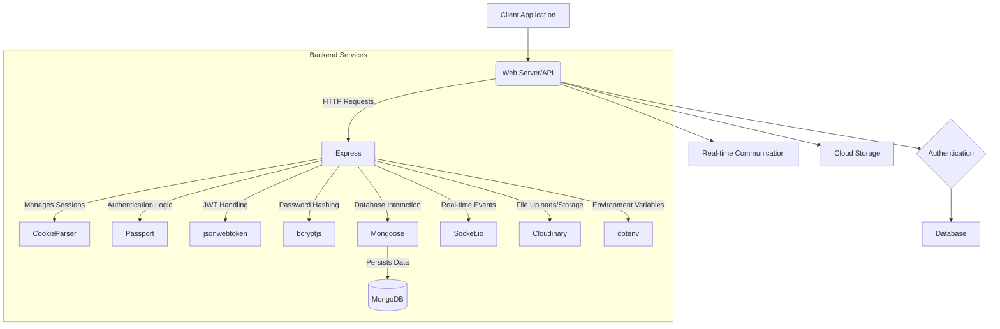
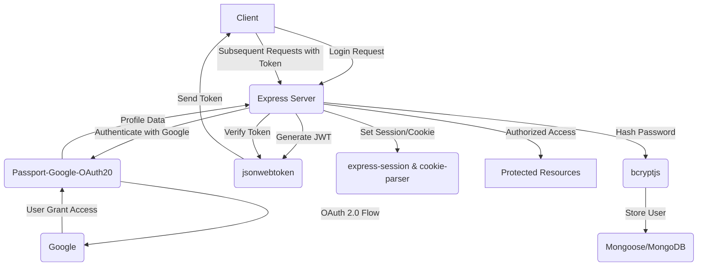
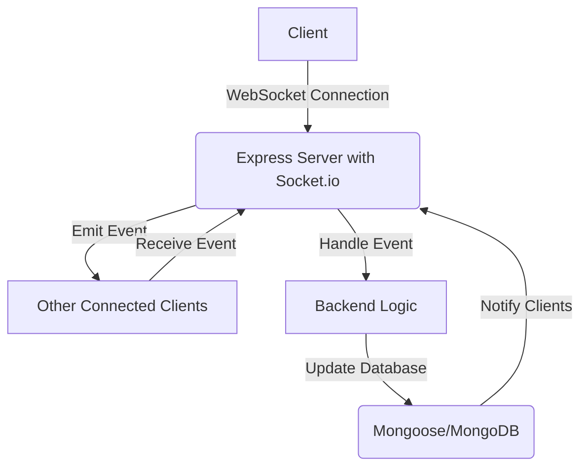
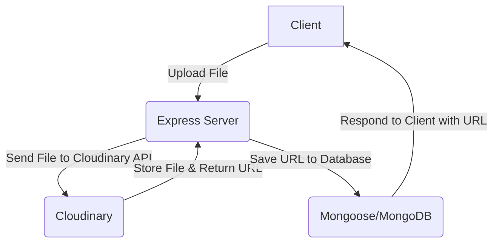
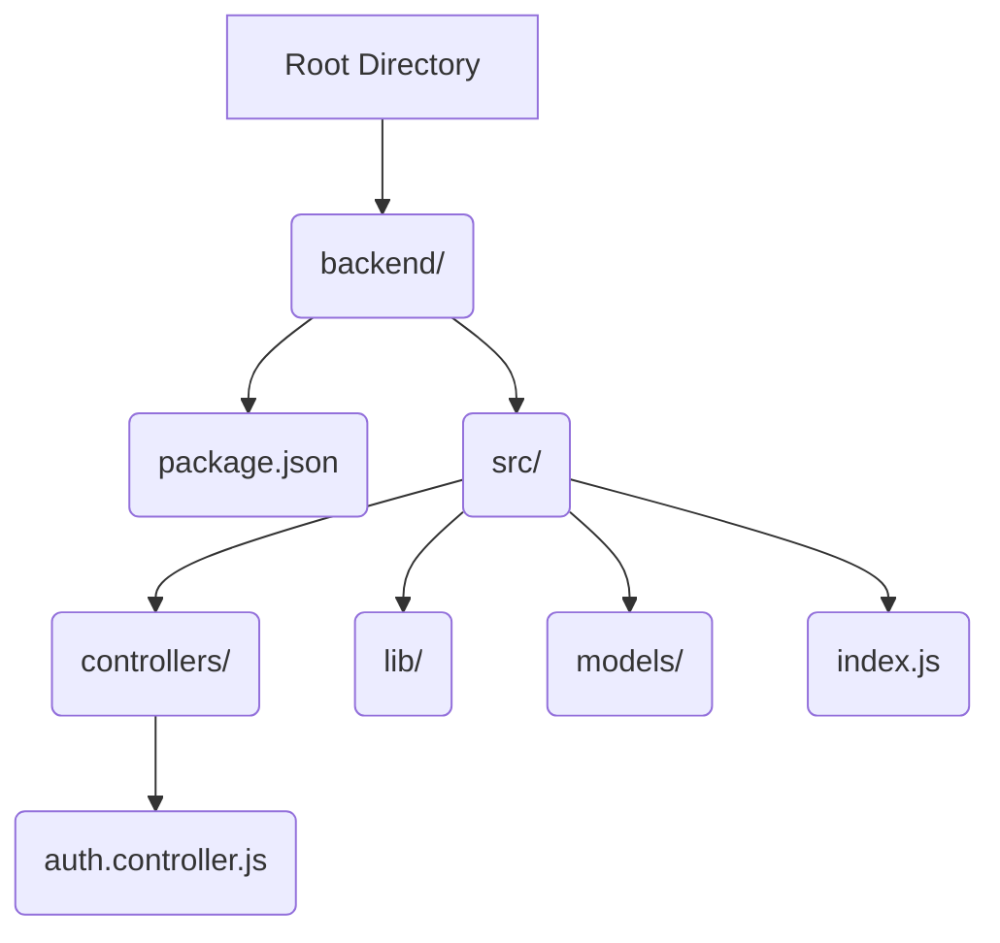

<!-- 1_overview.mdx -->
# 1. Overview
[TOC]

This section provides a high-level overview of the MERN Chatapp project. The application is built using the MERN stack (MongoDB, Express.js, React, Node.js), offering a modern and scalable architecture for real-time communication.

The project credits a tutorial as its primary source of inspiration and guidance, indicating a learning-oriented or adapted implementation.

## 1.1 Project Goal
The primary goal of the MERN Chatapp is to demonstrate the capabilities of the MERN stack in building a real-time chat application. This typically includes features such as user authentication, message sending and receiving, and potentially group chats or direct messaging.

## 1.2 Technology Stack
The application leverages the following key technologies:
*   **MongoDB**: A NoSQL database used for storing user data, chat messages, and other application-related information.
*   **Express.js**: A fast, unopinionated, minimalist web framework for Node.js, used for building the backend API.
*   **React**: A JavaScript library for building user interfaces, used for the frontend of the chat application.
*   **Node.js**: A JavaScript runtime built on Chrome's V8 JavaScript engine, used for the backend server.
*   **Socket.IO** (inferred): While not explicitly mentioned in the README, real-time chat applications typically use WebSockets, often implemented with Socket.IO in a MERN stack.

```mermaid
graph TD
    A[User Interface 
    (React)] --> B{Backend Server 
    (Node.js/Express)};
    B --> C[Database 
    (MongoDB)];
    B -- Real-time Communication --> D[WebSockets 
    (e.g., Socket.IO)];
    D --> A;
```

## 1.3 Credits
The project acknowledges its foundation from a YouTube tutorial: [https://youtu.be/ntKkVrQqBYY?si=qz02jMCQ80RT1jaH](https://youtu.be/ntKkVrQqBYY?si=qz02jMCQ80RT1jaH)
This indicates that the project might follow the architectural patterns and implementation strategies presented in the linked tutorial.

---FILEBREAK---
<!-- 2_project_structure.mdx -->
# 2. Project Structure (Inferred)
[TOC]

Based on the nature of a MERN stack application, we can infer a typical project structure that separates frontend and backend concerns, and potentially organizes database models and API routes.

## 2.1 Top-Level Directories
A standard MERN application usually consists of at least two main directories: one for the client-side (React) and one for the server-side (Node.js/Express).

```mermaid
graph TD
    A[MERN Chatapp 
    Root] --> B[client/ (React Frontend)];
    A --> C[server/ (Node.js/Express Backend)];
    B --> B1[src/];
    B1 --> B2[components/];
    B1 --> B3[pages/];
    C --> C1[controllers/];
    C --> C2[routes/];
    C --> C3[models/];
    C --> C4[middlewares/];
    C --> C5[config/];
    C --> C6[utils/];
```

## 2.2 Client-Side Structure (Frontend)
The `client/` directory typically houses the React application.

### 2.2.1 `client/src`
This directory contains the main source code for the React application.

*   **`client/src/components/`**: Reusable UI components (e.g., `Message.jsx`, `ChatWindow.jsx`, `UserInput.jsx`).
*   **`client/src/pages/`**: Top-level components representing different views or pages (e.g., `LoginPage.jsx`, `RegisterPage.jsx`, `ChatPage.jsx`).
*   **`client/src/App.js`**: The root component of the React application.
*   **`client/src/index.js`**: Entry point for the React application, responsible for rendering the `App` component.
*   **`client/src/utils/`**: Utility functions for the frontend (e.g., API helpers, authentication context).
*   **`client/src/context/`**: React Context API files for global state management (e.g., `AuthContext.js`, `SocketContext.js`).

## 2.3 Server-Side Structure (Backend)
The `server/` directory contains the Node.js and Express.js code for the API and real-time functionalities.

### 2.3.1 `server/` Main Directories
*   **`server/controllers/`**: Contains the logic for handling API requests and interacting with the database. Each controller might correspond to a specific resource (e.g., `userController.js`, `messageController.js`).
*   **`server/routes/`**: Defines the API endpoints and maps them to the respective controller functions (e.g., `userRoutes.js`, `messageRoutes.js`).
*   **`server/models/`**: Defines the Mongoose schemas and models for the MongoDB database (e.g., `User.js`, `Message.js`, `Conversation.js`).
*   **`server/middlewares/`**: Contains custom middleware functions (e.g., `authMiddleware.js` for JWT verification).
*   **`server/config/`**: Configuration files (e.g., `db.js` for database connection, `dotenv` setup for environment variables).
*   **`server/utils/`**: Utility functions for the backend (e.g., `generateToken.js`, error handling).
*   **`server/server.js` or `server/index.js`**: The main entry point for the backend server, setting up Express, connecting to the database, and initializing Socket.IO.

---FILEBREAK---
<!-- 3_backend_architecture.mdx -->
# 3. Backend Architecture (Inferred)
[TOC]

The backend of the MERN Chatapp, built with Node.js and Express.js, follows a typical RESTful API pattern augmented with WebSockets for real-time communication.

## 3.1 Core Components
The server-side application can be broken down into several key components:

```mermaid
graph TD
    A[Client Request] --> B[Express Server];
    B --> C{Middleware 
    (Auth, Logging)};
    C --> D[Router];
    D --> E[Controller];
    E --> F[Service/Logic Layer 
    (Optional)];
    F --> G[Model 
    (Mongoose)];
    G --> H[MongoDB Database];
    H -- Data Retrieval/Storage --> G;
    E -- WebSocket Event --> I[Socket.IO Server];
    I -- Real-time Update --> A;
```

### 3.1.1 Express Server
The `server.js` or `index.js` file typically sets up the Express application, configures middleware, defines routes, and starts the HTTP server. It also often initializes the Socket.IO server.

### 3.1.2 Middleware
Middleware functions in Express are executed sequentially, handling tasks such as:
*   **Authentication**: Verifying user tokens (e.g., JWT) to secure routes. ([server/middlewares/authMiddleware.js](https://github.com/shinymack/Chat-App-MERN/server/middlewares/authMiddleware.js) - *inferred path*)
*   **Logging**: Recording incoming requests.
*   **Error Handling**: Centralized error management.
*   **CORS**: Enabling Cross-Origin Resource Sharing.

### 3.1.3 Routing
The `routes/` directory defines the API endpoints. Each route maps an HTTP method and path to a specific controller function.
*   Example routes:
    *   `POST /api/auth/register`
    *   `POST /api/auth/login`
    *   `GET /api/users`
    *   `POST /api/messages`
    *   `GET /api/messages/:conversationId`

### 3.1.4 Controllers
Controllers contain the business logic for handling incoming requests. They interact with models to perform database operations and prepare responses.
*   **User Controller**: Handles user registration, login, profile management. ([server/controllers/userController.js](https://github.com/shinymack/Chat-App-MERN/server/controllers/userController.js) - *inferred path*)
*   **Message Controller**: Handles sending, retrieving, and managing chat messages. ([server/controllers/messageController.js](https://github.com/shinymack/Chat-App-MERN/server/controllers/messageController.js) - *inferred path*)
*   **Conversation Controller**: Manages chat conversations or rooms.

### 3.1.5 Models (Mongoose)
Mongoose schemas define the structure of documents in MongoDB and provide methods for interacting with the database.
*   **User Model**: Represents a user, including fields like `username`, `email`, `password` (hashed). ([server/models/User.js](https://github.com/shinymack/Chat-App-MERN/server/models/User.js) - *inferred path*)
*   **Message Model**: Represents a single chat message, including `sender`, `content`, `timestamp`, `conversation`. ([server/models/Message.js](https://github.com/shinymack/Chat-App-MERN/server/models/Message.js) - *inferred path*)
*   **Conversation Model**: Represents a chat conversation, linking users and messages. ([server/models/Conversation.js](https://github.com/shinymack/Chat-App-MERN/server/models/Conversation.js) - *inferred path*)

### 3.1.6 Socket.IO Server
For real-time functionalities, Socket.IO is integrated into the Express server. It handles WebSocket connections, emits events to connected clients, and listens for client-side events. This is crucial for instant message delivery and status updates.

## 3.2 Database Integration
MongoDB is the chosen NoSQL database. Mongoose acts as an ODM (Object Data Modeling) library, simplifying interactions with MongoDB by providing a schema-based solution to model application data. The `server/config/db.js` (inferred) file would handle the connection to MongoDB.

## 3.3 Authentication System
A typical MERN stack authentication system involves:
1.  **User Registration**: Hashing passwords before storing them.
2.  **User Login**: Comparing provided password with the stored hash.
3.  **JWT (JSON Web Tokens)**: Generating a JWT upon successful login and sending it to the client. The client stores this token (e.g., in local storage).
4.  **Protected Routes**: Middleware verifies the JWT for protected routes, ensuring only authenticated users can access certain resources.

```mermaid
graph TD
    A[Client] --> B{Login Request 
    (username, password)};
    B --> C[Auth Controller 
    (server/controllers/userController.js)];
    C --> D[User Model 
    (server/models/User.js)];
    D -- Verify User/Password --> C;
    C -- Generate JWT --> E{Send JWT to Client};
    E --> A;
    A -- Protected Request with JWT --> F[Auth Middleware 
    (server/middlewares/authMiddleware.js)];
    F -- Validate JWT --> G[Access Protected Route/Resource];
```

---FILEBREAK---
<!-- 4_frontend_architecture.mdx -->
# 4. Frontend Architecture (Inferred)
[TOC]

The frontend of the MERN Chatapp is built with React, following a component-based architecture to create a dynamic and responsive user interface for real-time chat.

## 4.1 Core Components and Pages
The React application is structured around a set of reusable components and dedicated pages.

```mermaid
graph TD
    A[React App (client/src/App.js)] --> B[Router (React Router DOM)];
    B --> C[Auth Pages 
    (Login, Register)];
    B --> D[Chat Page];
    C --> C1[Login Form];
    C --> C2[Register Form];
    D --> D1[Chat Window];
    D --> D2[User List/Sidebar];
    D --> D3[Message Input];
    D1 --> D1_1[Message Component];
```

### 4.1.1 Pages
*   **`client/src/pages/LoginPage.jsx`**: Handles user login, typically involving a form and calling a backend authentication API.
*   **`client/src/pages/RegisterPage.jsx`**: Handles new user registration, submitting user details to the backend.
*   **`client/src/pages/ChatPage.jsx`**: The main interface for chat interactions, displaying messages, user lists, and input fields.

### 4.1.2 Components
*   **`client/src/components/Navbar.jsx`**: Global navigation or header component.
*   **`client/src/components/Message.jsx`**: Renders a single chat message, potentially differentiating between sender and receiver.
*   **`client/src/components/ChatWindow.jsx`**: Displays the history of messages within a conversation.
*   **`client/src/components/MessageInput.jsx`**: Provides an input field and a send button for users to type and send messages.
*   **`client/src/components/UserListItem.jsx`**: Renders an individual user or contact in a list.
*   **`client/src/components/UserListSidebar.jsx`**: Displays a list of available users or active conversations.

## 4.2 State Management
React's local state and props are used for managing component-specific data. For global state, especially in a real-time application, the Context API or a state management library (like Redux, though not explicitly mentioned) would be used.

### 4.2.1 Authentication Context
A common pattern is to create an `AuthContext` (`client/src/context/AuthContext.js` - *inferred path*) to manage the authenticated user's state, including their token and user information, making it accessible across the application.

### 4.2.2 Socket Context
A `SocketContext` (`client/src/context/SocketContext.js` - *inferred path*) would likely be used to provide the Socket.IO client instance to all components that need to send or receive real-time events.

## 4.3 API Interaction
The frontend interacts with the backend API using libraries like `axios` or the native `fetch` API.
*   **User Authentication**: Sending `POST` requests for `/api/auth/register` and `/api/auth/login`.
*   **Fetching Messages**: Sending `GET` requests for `/api/messages/:conversationId`.
*   **Sending Messages (REST)**: Potentially sending `POST` requests for `/api/messages` for initial message persistence, although real-time sending would primarily be via WebSockets.

## 4.4 Real-time Communication (Socket.IO Client)
The React application establishes a WebSocket connection with the backend Socket.IO server.
*   **Connection**: Initializing a Socket.IO client instance, typically in a higher-order component or context provider.
*   **Event Listening**: Listening for events from the server (e.g., `newMessage`, `userOnline`).
*   **Event Emitting**: Emitting events to the server (e.g., `sendMessage`, `userTyping`).

```mermaid
graph TD
    A[React Component] --> B{Call Backend API 
    (e.g., axios)};
    B -- Fetch Data --> C[Display Data in UI];
    A -- Emit Socket Event --> D[Socket.IO Client];
    D -- WebSocket Connection --> E[Socket.IO Server 
    (Backend)];
    E -- Receive Socket Event --> A;
```

---

<!-- 1_overview.mdx -->
# Overview
[TOC]

This documentation provides an overview of the `backend` directory, focusing on its core dependencies and the technologies used as inferred from the `package-lock.json` file. The `backend` module appears to be a Node.js application, likely serving as an API or a server-side component given its dependencies.

## Key Technologies
The `backend` module leverages a variety of Node.js packages for functionalities ranging from web server operations to database management, authentication, and real-time communication.

### Core Dependencies
The primary dependencies suggest a MERN (MongoDB, Express, React, Node.js) stack backend or a similar architecture that heavily relies on Express for routing and MongoDB for data storage.

## Backend Architecture Overview

<!-- Corrected invalid syntax -->

This diagram illustrates the logical flow and the main components interacting within the backend.

---
<!-- 2_backendarchitecture.mdx -->
# 2. Backend Architecture
[TOC]

This section delves into the specific technologies and their roles within the backend architecture, based on the `package-lock.json` file. The dependencies indicate a robust server-side application capable of handling API requests, managing user sessions, interacting with a database, and supporting real-time features.

## 2.1. Core Web Server and API Framework
The backend heavily relies on `Express.js` for building the web server and defining API endpoints.

### Express.js
- **Version**: `4.21.2`
- **Purpose**: A fast, unopinionated, minimalist web framework for Node.js. It handles routing, middleware, and HTTP requests.
- **Related Files**: Implied throughout the backend's server setup and route definitions.

## 2.2. Data Persistence
The application uses MongoDB as its database, with Mongoose providing an ODM (Object Data Modeling) layer.

### Mongoose
- **Version**: `8.16.0`
- **Purpose**: Mongoose is an elegant MongoDB object modeling tool for Node.js. It manages relationships between data, provides schema validation, and is used for interacting with the MongoDB database.
- **Related Files**: [backend/package-lock.json](https://github.com/shinymack/Chat-App-MERN/backend/package-lock.json)

### MongoDB Driver
- **Version**: `6.17.0` (indirectly through Mongoose)
- **Purpose**: The official MongoDB driver for Node.js, providing the underlying connectivity and methods for database operations.

## 2.3. Authentication and Authorization
Several packages are utilized for secure user authentication and authorization.

### bcryptjs
- **Version**: `2.4.3`
- **Purpose**: A library to help hash passwords. It's known for its robust cryptographic hashing function, making it difficult to reverse engineer passwords.
- **Related Files**: Implied in user model definitions and authentication logic.

### jsonwebtoken
- **Version**: `9.0.2`
- **Purpose**: An implementation of JSON Web Tokens (JWT). Used for stateless authentication, where a token is issued upon successful login and then used to authorize subsequent requests.
- **Related Files**: Implied in authentication middleware and user login/registration routes.

### passport
- **Version**: `0.7.0`
- **Purpose**: Simple, unobtrusive authentication for Node.js. Passport is a middleware that provides comprehensive authentication support for Express applications.
- **Related Files**: Implied in authentication strategy configurations.

### passport-google-oauth20
- **Version**: `2.0.0`
- **Purpose**: A Passport strategy for authenticating with Google using the OAuth 2.0 API. This enables "Login with Google" functionality.
- **Related Files**: Implied in OAuth authentication setup.

### express-session
- **Version**: `1.18.1`
- **Purpose**: Simple session middleware for Express. It manages user sessions on the server side, often used in conjunction with Passport for stateful authentication.
- **Related Files**: Implied in server setup for session management.

### cookie-parser
- **Version**: `1.4.7`
- **Purpose**: Parse Cookie header and populate `req.cookies` with an object keyed by the cookie names.
- **Related Files**: Implied in server setup for handling HTTP cookies.


<!-- Corrected invalid syntax -->

## 2.4. Real-time Communication
The backend incorporates real-time capabilities using Socket.io.

### Socket.io
- **Version**: `4.8.1`
- **Purpose**: Enables real-time, bidirectional, event-based communication between web clients and the server. Ideal for chat applications, notifications, and live updates.
- **Related Files**: Implied in server setup for WebSocket connections and event handling.


<!-- Corrected invalid syntax -->

## 2.5. Cloud Integration
`Cloudinary` is used, likely for media storage and management.

### Cloudinary
- **Version**: `2.6.1`
- **Purpose**: Cloud-based image and video management service. Used for uploading, storing, transforming, and delivering images and videos.
- **Related Files**: Implied in routes handling file uploads or user profile picture management.


<!-- Corrected invalid syntax -->

## 2.6. Environment Management
`dotenv` is used for managing environment variables.

### dotenv
- **Version**: `16.5.0`
- **Purpose**: Loads environment variables from a `.env` file into `process.env`. This is crucial for securely managing configuration settings like API keys, database URLs, etc.
- **Related Files**: Implied in the main server entry point for configuration loading.

---

---

<!-- 1_overview.mdx -->
# 1. Overview
[TOC]

This documentation provides a comprehensive overview of the `Chat-App-MERN` project's backend components, focusing on the core dependencies and authentication system. The backend is built using Node.js with Express and leverages MongoDB for data storage.

## 1.1 Project Structure
The project is structured to separate concerns, with a `backend` directory containing the server-side logic. Key files include `package.json` for dependency management and `src/controllers/auth.controller.js` which handles user authentication.



## 1.2 Key Technologies
The backend relies on a robust set of technologies:
*   **Node.js & Express:** For building the RESTful API.
*   **MongoDB & Mongoose:** For database management and object data modeling.
*   **bcryptjs:** For secure password hashing.
*   **jsonwebtoken & cookie-parser:** For user authentication and session management.
*   **socket.io:** For real-time communication (though not explicitly detailed in the provided files, it's a core dependency).
*   **Cloudinary:** For image storage and management, particularly for user profile pictures.
*   **Passport.js & passport-google-oauth20:** For Google OAuth integration.

---FILEBREAK---
<!-- 2_backend_architecture.mdx -->
# 2. Backend Architecture
[TOC]

The backend architecture is built around a Node.js Express server, following a typical MVC-like pattern with controllers, models, and utility functions. This section details the core components and their interactions.

## 2.1 Dependency Management
The `backend/package.json` file ([package.json](https://github.com/shinymack/Chat-App-MERN/backend/package.json)) lists all the project dependencies and scripts.

### 2.1.1 Dependencies
The `dependencies` section outlines the external libraries required for the application to run.

```json
{
  "name": "backend",
  "version": "1.0.0",
  "main": "src/index.js",
  "scripts": {
    "dev": "nodemon src/index.js",
    "start": "node src/index.js"
  },
  "author": "",
  "type": "module",
  "license": "ISC",
  "description": "",
  "dependencies": {
    "bcryptjs": "^2.4.3",
    "cloudinary": "^2.5.1",
    "cookie-parser": "^1.4.7",
    "dotenv": "^16.4.7",
    "express": "^4.21.2",
    "express-session": "^1.18.1",
    "jsonwebtoken": "^9.0.2",
    "mongoose": "^8.9.5",
    "passport": "^0.7.0",
    "passport-google-oauth20": "^2.0.0",
    "socket.io": "^4.8.1"
  },
  "devDependencies": {
    "nodemon": "^3.1.9"
  }
}
```

Key dependencies and their roles:
*   **`bcryptjs`**: For hashing user passwords before storing them in the database, enhancing security.
*   **`cloudinary`**: Client library for interacting with the Cloudinary image and video management service, used for storing profile pictures.
*   **`cookie-parser`**: Middleware to parse cookies attached to the client request object.
*   **`dotenv`**: Loads environment variables from a `.env` file, essential for configuration management.
*   **`express`**: The web framework for Node.js, providing robust features for web and mobile applications.
*   **`express-session`**: Middleware for managing user sessions.
*   **`jsonwebtoken`**: Used for creating and verifying JSON Web Tokens (JWTs) for user authentication.
*   **`mongoose`**: An ODM (Object Data Modeling) library for MongoDB, providing a schema-based solution to model application data.
*   **`passport`**: Authentication middleware for Node.js, specifically used here for Google OAuth.
*   **`passport-google-oauth20`**: A Passport strategy for authenticating with Google using the OAuth 2.0 API.
*   **`socket.io`**: Enables real-time, bidirectional event-based communication.

### 2.1.2 Development Dependencies
The `devDependencies` section lists packages used only for development purposes.
*   **`nodemon`**: A utility that monitors for any changes in your source and automatically restarts your server, facilitating development.

## 2.2 Authentication System
The `backend/src/controllers/auth.controller.js` file ([auth.controller.js](https://github.com/shinymack/Chat-App-MERN/backend/src/controllers/auth.controller.js)) contains the core logic for user authentication, including signup, login, logout, and profile management.

```mermaid
graph TD
    A[Client Request] --> B{Authentication Route}

    B -- Signup --> C[signup Controller]
    C --> C1{Validate Input}
    C1 -- Invalid --> C2[400 Bad Request]
    C1 -- Valid --> C3{Check User/Username Exists}
    C3 -- Exists --> C4[400 Bad Request]
    C3 -- New User --> C5[Hash Password]
    C5 --> C6[Create User]
    C6 --> C7[Generate JWT]
    C7 --> C8[Save User & Respond 201]

    B -- Login --> D[login Controller]
    D --> D1{Find User by Email}
    D1 -- Not Found --> D2[400 Invalid Credentials]
    D1 -- Found & Google Auth --> D3[400 Sign in with Google]
    D1 -- Found & Email/Password --> D4{Compare Password}
    D4 -- Incorrect --> D5[400 Invalid Credentials]
    D4 -- Correct --> D6[Generate JWT]
    D6 --> D7[Respond 200]

    B -- Logout --> E[logout Controller]
    E --> E1[Clear JWT Cookie]
    E1 --> E2[Respond 200]

    B -- checkAuth --> F[checkAuth Controller]
    F --> F1[Return Authenticated User Data]

    B -- googleAuthCallback --> G[googleAuthCallback Controller]
    G --> G1{User Authenticated?}
    G1 -- No --> G2[Redirect to Login with Error]
    G1 -- Yes --> G3[Generate JWT]
    G3 --> G4[Redirect to Frontend]

    B -- checkUsernameAvailability --> H[checkUsernameAvailability Controller]
    H --> H1{Validate Username}
    H1 -- Invalid --> H2[400 Bad Request]
    H1 -- Valid & Current User's --> H3[200 Available]
    H1 -- Valid --> H4{Check if Username Taken}
    H4 -- Taken --> H5[200 Not Available]
    H4 -- Available --> H6[200 Available]
    
    B -- updateProfile --> I[updateProfile Controller]
    I --> I1{Find User}
    I1 -- Not Found --> I2[404 Not Found]
    I1 -- Found --> I3{Process Username/ProfilePic}
    I3 --> I4{Handle Cloudinary Upload (if profilePic)}
    I4 --> I5{Check Username Availability/Conflicts}
    I5 -- Conflict --> I6[400 Bad Request]
    I5 -- No Conflict --> I7[Update User in DB]
    I7 --> I8[Generate New JWT]
    I8 --> I9[Respond 200 with Updated User]
```
<!-- Corrected invalid syntax -->

### 2.2.1 User Signup
The `signup` function handles new user registration. It performs validation on username, email, and password, checks for existing users, hashes the password using `bcryptjs`, creates a new user, and generates a JWT token upon successful registration.

```javascript
// backend/src/controllers/auth.controller.js
export const signup = async (req, res) => {
    const {username, email, password} = req.body;
    try {
        // ... input validation ...
        const salt = await bcrypt.genSalt(10);
        const hashedPassword = await bcrypt.hash(password, salt);

        const newUser = new User({
            username,
            email,
            password: hashedPassword,
            authProvider: 'email'
        });
        if(newUser){
            generateToken(newUser._id, res); // utility to create JWT and set cookie
            await newUser.save();
            res.status(201).json({ /* user data */ });
        } else {
            res.status(400).json({message: "Invalid user data."});
        }
    } catch (error) { /* error handling */ }
};
```
### 2.2.2 User Login
The `login` function authenticates existing users. It finds the user by email, checks if it's a Google-authenticated account without a password, compares the provided password with the stored hashed password using `bcryptjs.compare`, and generates a JWT token if credentials are valid.

```javascript
// backend/src/controllers/auth.controller.js
export const login = async (req, res) => {
    const {email, password} = req.body;
    try {
        const user = await User.findOne({email});
        if(!user) return res.status(400).json({message: "Invalid credentials."});
        if(user.authProvider === 'google' && !user.password) {
            return res.status(400).json({ message: "Please sign in with Google." });
        }
        const isPasswordCorrect = await bcrypt.compare(password, user.password);
        if(!isPasswordCorrect) return res.status(400).json({message: "Invalid credentials."});

        generateToken(user._id, res); // utility to create JWT and set cookie
        res.status(200).json({ /* user data */ });
    } catch (error) { /* error handling */ }
};
```

### 2.2.3 User Logout
The `logout` function clears the JWT cookie, effectively logging the user out.

```javascript
// backend/src/controllers/auth.controller.js
export const logout = (req, res) => {
    try {
        res.cookie("jwt", "", {maxAge: 0}); // Clear the JWT cookie
        res.status(200).json({message: "Logged out successfully."});
    } catch(error) { /* error handling */ }
};
```

### 2.2.4 Check Authentication Status
The `checkAuth` function verifies if a user is currently authenticated by inspecting the `req.user` object (which would be populated by a JWT middleware) and returns their profile information.

```javascript
// backend/src/controllers/auth.controller.js
export const checkAuth = (req, res) => {
    try {
        res.status(200).json({ /* req.user data */ });
    } catch (error) { /* error handling */ }
};
```

### 2.2.5 Google Authentication Callback
The `googleAuthCallback` function handles the redirect after a user authenticates with Google. It checks if `req.user` is present (meaning Google authentication was successful), generates a JWT, and redirects the user to the frontend.

```javascript
// backend/src/controllers/auth.controller.js
export const googleAuthCallback = async (req, res) => {
    const frontendUrl = process.env.FRONTEND_URL || 'http://localhost:5173';
    try {
        if (!req.user) {
            return res.redirect(`${frontendUrl}/login?error=google_auth_failed`);
        }
        generateToken(req.user._id, res);
        res.redirect(frontendUrl);
    } catch (error) { /* error handling */ }
};
```

### 2.2.6 Username Availability Check
The `checkUsernameAvailability` function allows clients to check if a desired username is available. It performs length validations and queries the database to see if the username is already taken by another user (excluding the current user if they are checking their own username).

```javascript
// backend/src/controllers/auth.controller.js
export const checkUsernameAvailability = async (req, res) => {
    try {
        const { username } = req.params;
        const currentUserId = req.user._id; 
        // ... validation ...
        if (req.user.username === username) {
            return res.status(200).json({ available: true, message: "This is your current username." });
        }
        const existingUser = await User.findOne({ username: username });
        if (existingUser) {
            return res.status(200).json({ available: false, message: "Username is already taken." });
        }
        res.status(200).json({ available: true, message: "Username is available." });
    } catch (error) { /* error handling */ }
};
```

### 2.2.7 User Profile Update
The `updateProfile` function handles updating a user's profile information, including their username and profile picture. It uses Cloudinary for image uploads and performs checks for username availability before updating the user document. A new JWT is generated and sent back to the client upon successful update.

```javascript
// backend/src/controllers/auth.controller.js
export const updateProfile = async (req, res) => {
    try {
        const { profilePic, username } = req.body;
        const userId = req.user._id;
        let userToUpdate = await User.findById(userId);

        // ... username validation and conflict check ...
        // ... Cloudinary upload if profilePic is present ...

        const updatedUser = await User.findByIdAndUpdate(userId, { $set: fieldsToUpdate }, { new: true });
        generateToken(updatedUser._id, res); // Refresh JWT
        res.status(200).json(updatedUser);
    } catch (error) { /* error handling */ }
};
```

---

<!-- 1_overview.mdx -->
# Overview
[TOC]

This documentation provides a comprehensive overview of the backend services for a MERN stack Chat Application. It details the core functionalities related to user management, friend interactions, and real-time messaging, along with the underlying infrastructure for database connectivity, authentication, and file uploads.

The backend is built with Node.js and Express, utilizing MongoDB for data storage and Socket.io for real-time communication. Authentication is handled via Passport.js, supporting both local and Google OAuth strategies, and Cloudinary is integrated for image storage.

## Project Structure
The backend is organized into several key directories:
- `controllers`: Contains the logic for handling API requests for friends and messages.
- `lib`: Houses utility functions for database connection, Cloudinary integration, Passport.js configuration, and Socket.io setup.
- `routes`: Defines the API endpoints for different modules (authentication, messages, friends).
- `models`: (Inferred) Would contain Mongoose schemas for `User` and `Message`.
- `index.js`: The entry point of the application, responsible for setting up the Express server, middleware, and connecting routes.

```mermaid
graph TD
    A[index.js] --> B(Routes)
    B --> C{Controllers}
    C --> D[Models]
    C --> E[Lib Utilities]
    E --> F[MongoDB (db.js)]
    E --> G[Cloudinary (cloudinary.js)]
    E --> H[Passport.js (passport.config.js)]
    E --> I[Socket.io (socket.js)]
    style A fill:#f9f,stroke:#333,stroke-width:2px
    style B fill:#bbf,stroke:#333,stroke-width:2px
    style C fill:#ccf,stroke:#333,stroke-width:2px
    style D fill:#ddf,stroke:#333,stroke-width:2px
    style E fill:#eef,stroke:#333,stroke-width:2px
    style F fill:#ffb,stroke:#333,stroke-width:2px
    style G fill:#fbc,stroke:#333,stroke-width:2px
    style H fill:#cff,stroke:#333,stroke-width:2px
    style I fill:#fcf,stroke:#333,stroke-width:2px
```
<!-- Corrected invalid syntax -->

## Technologies Used
- **Node.js**: JavaScript runtime environment.
- **Express.js**: Web application framework for Node.js.
- **MongoDB**: NoSQL database.
- **Mongoose**: MongoDB object data modeling (ODM) library.
- **Socket.io**: Real-time bidirectional event-based communication.
- **Passport.js**: Authentication middleware for Node.js.
- **Cloudinary**: Cloud-based image and video management.
- **CORS**: Middleware for enabling Cross-Origin Resource Sharing.
- **Dotenv**: Loads environment variables from a `.env` file.
- **Cookie-parser**: Parse Cookie header and populate `req.cookies`.
- **Express-session**: HTTP session middleware.

The application serves both its backend API and a static frontend in production environments, ensuring a cohesive deployment.

---FILEBREAK---
<!-- 2_backendarchitecture.mdx -->
# Backend Architecture
[TOC]

The backend architecture is built upon a layered approach using Node.js with the Express framework. It follows a Model-View-Controller (MVC) pattern, though primarily focusing on Model and Controller for the API services, with the "View" being the decoupled frontend.

## 2.1 Server Setup and Middleware
The core server is initiated in [backend/src/index.js](https://github.com/shinymack/Chat-App-MERN/backend/src/index.js), which sets up Express, configures middleware, and integrates various components like database connection, Passport.js for authentication, and Socket.io for real-time features.

### 2.1.1 Main Application Entry Point
The `index.js` file is the central hub for the backend.
- It imports necessary modules: `express`, `cors`, `cookie-parser`, `session`, `passport`, and various route handlers and utility functions.
- Environment variables are loaded using `dotenv`.
- Passport.js is configured via `configurePassport()`.
- Middleware for parsing JSON, URL-encoded data, and cookies is applied.
- CORS is enabled to allow requests from the frontend origin (`http://localhost:5173`).
- Session management and Passport.js initialization are crucial for stateful authentication.

```mermaid
graph TD
    A[index.js] --> B(Load .env)
    A --> C(configurePassport)
    A --> D(Middleware Setup)
    D --> D1[cookie-parser]
    D --> D2[express.json]
    D --> D3[express.urlencoded]
    D --> D4[cors]
    D --> D5[express-session]
    D --> D6[passport.initialize]
    D --> D7[passport.session]
    A --> E(Route Handlers)
    E --> F[/api/auth]
    E --> G[/api/messages]
    E --> H[/api/friends]
    A --> I(Socket.io Server)
    I --> J(Database Connection)
    J --> K(Start Server)
```
<!-- Corrected invalid syntax -->

### 2.1.2 Environment Configuration
Sensitive information and configurable parameters are managed through environment variables, loaded by `dotenv`. This includes `PORT`, `MONGODB_URI`, `SESSION_SECRET`, `CLOUDINARY_CLOUD_NAME`, `CLOUDINARY_API_KEY`, `CLOUDINARY_API_SECRET`, `GOOGLE_CLIENT_ID`, `GOOGLE_CLIENT_SECRET`, and `GOOGLE_CALLBACK_URL`.

### 2.1.3 Production Deployment
In a production environment, `index.js` also serves the static files of the frontend application from the `../frontend/dist` directory, enabling a single-server deployment model.

## 2.2 Database Management
The application uses MongoDB as its primary data store, interacting with it via Mongoose.

### 2.2.1 Database Connection
The [backend/src/lib/db.js](https://github.com/shinymack/Chat-App-MERN/backend/src/lib/db.js) file provides the `connectDB` function, which establishes a connection to MongoDB using the `MONGODB_URI` environment variable.
```javascript
import mongoose from "mongoose";

export const connectDB = async () => {
  try {
    const conn = await mongoose.connect(process.env.MONGODB_URI);
    console.log(`MongoDB connected:  ${conn.connection.host}`);
  }
  catch(error){
    console.log("MongoDB connection error: ", error);
  }
}
```

### 2.2.2 Data Models
(Inferred) The application would utilize Mongoose schemas for defining the structure and behavior of `User` and `Message` documents. These models would include fields for user profiles, friend lists, sent/received requests, message content, sender/receiver IDs, and timestamps.

## 2.3 Authentication System
Authentication is a critical component, handled by Passport.js, supporting both traditional session-based and Google OAuth strategies.

### 2.3.1 Passport.js Configuration
The [backend/src/lib/passport.config.js](https://github.com/shinymack/Chat-App-MERN/backend/src/lib/passport.config.js) file contains the `configurePassport` function:
- **GoogleStrategy**: Used for OAuth 2.0 authentication with Google.
    - It attempts to find an existing user by `googleId`.
    - If not found, a new user is created with data from the Google profile (username, email, `authProvider: 'google'`).
    - Handles potential conflicts if an email already exists from a different authentication provider.
- **Serialization/Deserialization**:
    - `passport.serializeUser`: Stores the user ID (`_id` from MongoDB) in the session.
    - `passport.deserializeUser`: Retrieves the full user object from the database using the stored ID, making it available as `req.user`.

```mermaid
graph TD
    A[Client Login] --> B{Choose Auth Method}
    B --> C[Local Login]
    B --> D[Google OAuth]

    C --> E[Passport Local Strategy]
    D --> F[Passport Google Strategy]

    F --> G{User exists in DB?}
    G -- Yes --> H[Return User]
    G -- No --> I[Create New User]
    I --> H

    H --> J[passport.serializeUser(user.id)]
    J --> K[Session Stored]
    K --> L[Next Request]
    L --> M[passport.deserializeUser(id)]
    M --> N[Retrieve User from DB]
    N --> O[Attach to req.user]
```
<!-- Corrected invalid syntax -->

## 2.4 Real-time Communication
Socket.io is integrated to provide real-time messaging capabilities. The `socket.js` file (not provided but inferred from `index.js` and `message.controller.js` usage) would manage socket connections and events.

### 2.4.1 Socket.io Integration
- `io.to(receiverSocketId).emit("newMessage", newMessage)`: This line in [backend/src/controllers/message.controller.js](https://github.com/shinymack/Chat-App-MERN/backend/src/controllers/message.controller.js) demonstrates the real-time functionality. When a new message is sent, if the receiver is online (i.e., has an active socket connection), the message is immediately emitted to their specific socket ID.

## 2.5 Cloudinary Integration
Cloudinary is used for managing and serving user-uploaded images, such as profile pictures or images within messages.

### 2.5.1 Cloudinary Configuration
The [backend/src/lib/cloudinary.js](https://github.com/shinymack/Chat-App-MERN/backend/src/lib/cloudinary.js) file initializes the Cloudinary SDK with credentials obtained from environment variables (`CLOUDINARY_CLOUD_NAME`, `CLOUDINARY_API_KEY`, `CLOUDINARY_API_SECRET`).
```javascript
import {v2 as cloudinary} from "cloudinary"
import { config } from 'dotenv'
config();
cloudinary.config(
    {cloud_name: process.env.CLOUDINARY_CLOUD_NAME,
    api_key: process.env.CLOUDINARY_API_KEY,
    api_secret: process.env.CLOUDINARY_API_SECRET,}
);
export default cloudinary;
```

### 2.5.2 Image Uploads
In the `sendMessage` controller ([backend/src/controllers/message.controller.js](https://github.com/shinymack/Chat-App-MERN/backend/src/controllers/message.controller.js)), if an `image` is provided in the request body, it is uploaded to Cloudinary using `cloudinary.uploader.upload(image)`. The secure URL returned by Cloudinary is then stored in the `image` field of the `Message` document.

---FILEBREAK---
<!-- 3_apiroutesandcontrollers.mdx -->
# API Routes and Controllers
[TOC]

This section details the various API routes and their corresponding controller functions, which handle the business logic for friend management and messaging within the application.

## 3.1 Friend Management
The friend management system allows users to send, accept, reject, and remove friend requests, as well as retrieve their list of friends and pending requests. These functionalities are exposed via the `/api/friends` endpoint and handled by functions in [backend/src/controllers/friend.controller.js](https://github.com/shinymack/Chat-App-MERN/backend/src/controllers/friend.controller.js).

### 3.1.1 Send Friend Request
- **Route**: (Inferred) `POST /api/friends/send-request`
- **Controller**: `sendFriendRequest`
- **Description**: Allows a user to send a friend request to another user identified by their username or email.
- **Logic**:
    1. Validates the `identifier` in the request body.
    2. Finds the receiver by username or email.
    3. Prevents sending requests to oneself, already friends, already sent, or if the receiver has already sent a request to the sender.
    4. Adds the receiver's ID to the sender's `sentRequests` array and the sender's ID to the receiver's `friendRequests` array.
    5. Saves both user documents.
```mermaid
graph TD
    A[Client: POST /api/friends/send-request] --> B{sendFriendRequest}
    B --> C{Validate identifier}
    C -- Invalid --> D[400: Bad Request]
    C -- Valid --> E{Find Receiver by username/email}
    E -- Not Found --> F[404: User Not Found]
    E -- Found --> G{Check existing relationships}
    G -- Self Request/Already Friends/Request Sent/Received --> H[400: Conflict]
    G -- No Conflict --> I[Add to sender.sentRequests]
    I --> J[Add to receiver.friendRequests]
    J --> K[sender.save()]
    K --> L[receiver.save()]
    L --> M[200: Request Sent]
```
<!-- Corrected invalid syntax -->

### 3.1.2 Accept Friend Request
- **Route**: (Inferred) `PUT /api/friends/accept-request/:senderId`
- **Controller**: `acceptFriendRequest`
- **Description**: Allows the current user to accept a friend request from a specified sender.
- **Logic**:
    1. Retrieves `senderId` from params and `receiverId` from `req.user`.
    2. Finds both sender and receiver users.
    3. Checks if the request exists in the receiver's `friendRequests`.
    4. Adds both users to each other's `friends` list.
    5. Removes the request from `receiver.friendRequests` and `sender.sentRequests`.
    6. Saves both user documents.
```mermaid
graph TD
    A[Client: PUT /api/friends/accept-request/:senderId] --> B{acceptFriendRequest}
    B --> C{Fetch Sender & Receiver Users}
    C -- Not Found --> D[404: User Not Found]
    C -- Found --> E{Check if request exists}
    E -- No --> F[400: Request Not Found]
    E -- Yes --> G[Add sender to receiver.friends]
    G --> H[Add receiver to sender.friends]
    H --> I[Remove from receiver.friendRequests]
    I --> J[Remove from sender.sentRequests]
    J --> K[receiver.save()]
    K --> L[sender.save()]
    L --> M[200: Request Accepted]
```
<!-- Corrected invalid syntax -->

### 3.1.3 Reject Friend Request
- **Route**: (Inferred) `PUT /api/friends/reject-request/:senderId`
- **Controller**: `rejectFriendRequest`
- **Description**: Allows the current user to reject a friend request from a specified sender.
- **Logic**:
    1. Retrieves `senderId` from params and `receiverId` from `req.user`.
    2. Finds both sender and receiver users.
    3. Removes the request from `receiver.friendRequests` and `sender.sentRequests`.
    4. Checks if any request was actually removed to ensure it existed.
    5. Saves both user documents.
```mermaid
graph TD
    A[Client: PUT /api/friends/reject-request/:senderId] --> B{rejectFriendRequest}
    B --> C{Fetch Sender & Receiver Users}
    C -- Not Found --> D[404: User Not Found]
    C -- Found --> E[Remove from receiver.friendRequests]
    E --> F[Remove from sender.sentRequests]
    F --> G{Check if request was removed}
    G -- No Change --> H[400: Request Not Found]
    G -- Changed --> I[receiver.save()]
    I --> J[sender.save()]
    J --> K[200: Request Rejected]
```
<!-- Corrected invalid syntax -->

### 3.1.4 Remove Friend
- **Route**: (Inferred) `DELETE /api/friends/remove-friend/:friendId`
- **Controller**: `removeFriend`
- **Description**: Allows the current user to remove an existing friend.
- **Logic**:
    1. Retrieves `friendId` from params and `userId` from `req.user`.
    2. Finds both current user and the friend to remove.
    3. Checks if they are actually friends.
    4. Removes `friendId` from `user.friends` and `userId` from `friendToRemove.friends`.
    5. Saves both user documents.
```mermaid
graph TD
    A[Client: DELETE /api/friends/remove-friend/:friendId] --> B{removeFriend}
    B --> C{Fetch User & Friend}
    C -- Not Found --> D[404: User Not Found]
    C -- Found --> E{Check if they are friends}
    E -- No --> F[400: Not Friends]
    E -- Yes --> G[Remove friend from user.friends]
    G --> H[Remove user from friendToRemove.friends]
    H --> I[user.save()]
    I --> J[friendToRemove.save()]
    J --> K[200: Friend Removed]
```
<!-- Corrected invalid syntax -->

### 3.1.5 Get User's Friends
- **Route**: (Inferred) `GET /api/friends/list`
- **Controller**: `getFriends`
- **Description**: Retrieves a list of friends for the current user.
- **Logic**:
    1. Retrieves `userId` from `req.user`.
    2. Finds the user and `populates` their `friends` array to include selected user details (`username`, `email`, `profilePic`, `_id`).
    3. Returns the populated list of friends.

### 3.1.6 Get Pending Friend Requests
- **Route**: (Inferred) `GET /api/friends/pending`
- **Controller**: `getPendingRequests`
- **Description**: Retrieves friend requests received by the current user.
- **Logic**:
    1. Retrieves `userId` from `req.user`.
    2. Finds the user and `populates` their `friendRequests` array to include selected user details of the senders.
    3. Returns the populated list of pending requests.

### 3.1.7 Get Sent Friend Requests
- **Route**: (Inferred) `GET /api/friends/sent`
- **Controller**: `getSentRequests`
- **Description**: Retrieves friend requests sent by the current user.
- **Logic**:
    1. Retrieves `userId` from `req.user`.
    2. Finds the user and `populates` their `sentRequests` array to include selected user details of the receivers.
    3. Returns the populated list of sent requests.

## 3.2 Message Management
The message management system handles fetching and sending messages between users, leveraging Socket.io for real-time updates. These functionalities are exposed via the `/api/messages` endpoint and handled by functions in [backend/src/controllers/message.controller.js](https://github.com/shinymack/Chat-App-MERN/backend/src/controllers/message.controller.js).

### 3.2.1 Get Users for Sidebar
- **Route**: (Inferred) `GET /api/messages/users`
- **Controller**: `getUsersForSidebar`
- **Description**: Retrieves a list of all users, excluding the currently logged-in user, typically used for populating a chat sidebar.
- **Logic**:
    1. Retrieves `loggedInUserId` from `req.user`.
    2. Queries the `User` model to find all users whose `_id` is not equal to `loggedInUserId`.
    3. Selects all fields except `password`.
    4. Returns the filtered list of users.

### 3.2.2 Get Messages
- **Route**: (Inferred) `GET /api/messages/:id` (where `id` is `userToChatId`)
- **Controller**: `getMessages`
- **Description**: Retrieves all messages exchanged between the current user and a specific chat partner.
- **Logic**:
    1. Retrieves `userToChatId` from params and `myId` from `req.user`.
    2. Queries the `Message` model for messages where the `senderId` and `receiverId` match `myId` and `userToChatId` in either direction (`$or` operator).
    3. Returns the found messages.

### 3.2.3 Send Message
- **Route**: (Inferred) `POST /api/messages/send/:id` (where `id` is `receiverId`)
- **Controller**: `sendMessage`
- **Description**: Allows the current user to send a text or image message to another user.
- **Logic**:
    1. Retrieves `text` and `image` from `req.body`, and `receiverId` from `req.params`, `senderId` from `req.user`.
    2. If an `image` is present, it's uploaded to Cloudinary, and the secure URL is stored.
    3. A new `Message` document is created with `senderId`, `receiverId`, `text`, and `imageUrl`.
    4. The message is saved to the database.
    5. If the `receiverId` has an active socket connection (obtained via `getReceiverSocketId`), the new message is emitted in real-time using `io.to(receiverSocketId).emit("newMessage", newMessage)`.
    6. Returns the newly created message.
```mermaid
graph TD
    A[Client: POST /api/messages/send/:id] --> B{sendMessage}
    B --> C{Extract text, image, receiverId, senderId}
    C --> D{If image provided}
    D -- Yes --> E[Upload image to Cloudinary]
    E --> F[Get imageUrl]
    D -- No --> G[imageUrl = null]
    F --> H[Create new Message document]
    G --> H
    H --> I[newMessage.save()]
    I --> J{Get receiver's Socket ID}
    J -- Found --> K[Emit "newMessage" via Socket.io]
    J -- Not Found --> L[Continue without real-time push]
    K --> M[201: Message Sent]
    L --> M
```
<!-- Corrected invalid syntax -->

---

<!-- 1_overview.mdx -->
# Overview
[TOC]

This documentation provides a comprehensive guide to the Chat-App-MERN project, a real-time chat application built with the MERN stack (MongoDB, Express.js, React, Node.js) and integrating Socket.IO for real-time communication. This project demonstrates full-stack development principles, including user authentication, friend management, and instant messaging capabilities.

## Project Structure
The project is divided into two main parts: `backend` and `frontend`.

### Backend
The backend is an Express.js application responsible for handling API requests, database interactions, user authentication, and real-time communication via Socket.IO. It follows a typical MVC-like structure with models, controllers, routes, and middleware.

*   **`backend/src/controllers/`**: Contains the logic for handling requests and interacting with models.
*   **`backend/src/lib/`**: Utility functions and Socket.IO setup.
*   **`backend/src/middleware/`**: Express middleware for request processing, such as authentication.
*   **`backend/src/models/`**: Mongoose schemas defining the data structure for the database.
*   **`backend/src/routes/`**: Defines the API endpoints for different functionalities.

### Frontend
The frontend is a React application built with Vite, providing the user interface and interacting with the backend API and Socket.IO server.

*   **`frontend/public/`**: Static assets.
*   **`frontend/src/`**: React components, pages, and application logic.
*   **`frontend/index.html`**: The main HTML file serving the React application.
*   **`frontend/eslint.config.js`**: ESLint configuration for code quality.

## Technologies Used

### Backend
*   **Node.js & Express.js**: For building the RESTful API and server-side logic.
*   **MongoDB & Mongoose**: As the NoSQL database and ODM (Object Data Modeling) for interacting with MongoDB.
*   **Socket.IO**: For real-time, bidirectional event-based communication.
*   **JWT (JSON Web Tokens)**: For secure user authentication.
*   **Passport.js**: For Google OAuth authentication.

### Frontend
*   **React**: A JavaScript library for building user interfaces.
*   **Vite**: A fast build tool that provides a rapid development experience for modern web projects.
*   **ESLint**: For maintaining code quality and consistency.

## Application Flow
The application provides functionalities such as user registration, login, sending/receiving friend requests, managing friends, and real-time messaging.

```mermaid
graph TD
    A[User] --> B(Frontend Application);
    B --> C{Authentication?};
    C -- Yes --> D[Backend API (Protected Routes)];
    C -- No --> E[Backend API (Auth Routes)];
    D --> F[Database (MongoDB)];
    E --> F;
    B --> G[Socket.IO Server];
    G <--> B;
    G <--> H[Other Online Users];

    subgraph Authentication Flow
        E -- Signup/Login --> F;
        E -- Generate JWT --> B;
        B -- Store JWT (cookie) --> B;
    end

    subgraph Real-time Messaging
        B -- Send Message --> G;
        G -- Emit Message --> H;
        H -- Receive Message --> B;
        G -- Update Online Status --> B;
    end

    subgraph Friend Management
        D -- Send/Accept/Reject Request --> F;
        D -- Get Friends/Requests --> F;
    end
```
<!-- Corrected invalid syntax: Replaced --gt; with -->, fixed node definitions for clarity -->

## Getting Started
To run this project, you will need to clone the repository, install dependencies for both frontend and backend, configure environment variables, and start both servers.

### Prerequisites
*   Node.js (LTS version recommended)
*   MongoDB (local or cloud instance)

### Installation (Conceptual)
1.  **Clone the repository**: `git clone <repository_url>`
2.  **Navigate to backend directory**: `cd backend`
3.  **Install backend dependencies**: `npm install`
4.  **Configure backend environment variables**: Create a `.env` file based on a `.env.example` (if provided) or manually set `JWT_SECRET`, `MONGO_DB_URI`, `GOOGLE_CLIENT_ID`, `GOOGLE_CLIENT_SECRET`, etc.
5.  **Navigate to frontend directory**: `cd ../frontend`
6.  **Install frontend dependencies**: `npm install`
7.  **Configure frontend environment variables**: Create a `.env` file for any frontend specific variables (e.g., VITE_API_BASE_URL).

### Running the Application (Conceptual)
1.  **Start backend server**: `npm run dev` (or equivalent script) from the `backend` directory.
2.  **Start frontend development server**: `npm run dev` from the `frontend` directory.

---
<!-- 2_backendarchitecture.mdx -->
# Backend Architecture
[TOC]

The backend of the Chat-App-MERN application is built using Node.js with Express.js, providing a robust and scalable foundation for the real-time chat functionalities. It follows a modular structure, separating concerns into models, routes, controllers, middleware, and utility functions.

## 2.1 API Routes
The API routes define the endpoints through which the frontend interacts with the backend. Each route is responsible for a specific set of functionalities, often protected by authentication middleware.

### 2.1.1 Authentication Routes
The authentication routes handle user registration, login, logout, profile updates, and Google OAuth integration.
The [auth.route.js](https://github.com/shinymack/Chat-App-MERN/backend/src/routes/auth.route.js) file defines these endpoints.

*   `POST /api/auth/signup`: Registers a new user.
*   `POST /api/auth/login`: Authenticates a user and issues a JWT.
*   `POST /api/auth/logout`: Logs out a user by clearing the JWT cookie.
*   `PUT /api/auth/update-profile`: Updates the authenticated user's profile. ([Link to `auth.controller.js` `updateProfile` function](https://github.com/shinymack/Chat-App-MERN/backend/src/controllers/auth.controller.js))
*   `GET /api/auth/username/check/:username`: Checks if a username is available.
*   `GET /api/auth/check`: Checks if the user is authenticated.
*   `GET /api/auth/google`: Initiates Google OAuth authentication.
*   `GET /api/auth/google/callback`: Handles the Google OAuth callback.

```mermaid
graph TD
    A[Client] --> B{POST /api/auth/signup};
    A --> C{POST /api/auth/login};
    A --> D{POST /api/auth/logout};
    A --> E{PUT /api/auth/update-profile};
    A --> F{GET /api/auth/username/check/:username};
    A --> G{GET /api/auth/check};
    A --> H{GET /api/auth/google};
    A --> I{GET /api/auth/google/callback};

    B --> J[signup Controller];
    C --> K[login Controller];
    D --> L[logout Controller];
    E --> protectRoute[auth.middleware.js];
    E -- Authenticated --> M[updateProfile Controller];
    F --> protectRoute;
    F -- Authenticated --> N[checkUsernameAvailability Controller];
    G --> protectRoute;
    G -- Authenticated --> O[checkAuth Controller];
    H --> P[Passport Google Auth Init];
    I --> Q[Passport Google Auth Callback];
    I --> R[googleAuthCallback Controller];

    J & K & L & M & N & O & P & Q & R --> S[Database (User Model)];
    K & R --> T[Generate JWT & Set Cookie];
    D --> U[Clear Cookie];

    protectRoute -- Invalid Token/No Token --> V[401 Unauthorized];
    protectRoute -- User Not Found --> W[404 Not Found];
```
<!-- Corrected invalid syntax: Replaced --gt; with -->, ensured node definitions are on one line -->

### 2.1.2 Friend Management Routes
These routes facilitate sending, accepting, rejecting, and listing friend requests and friends.
The [friend.route.js](https://github.com/shinymack/Chat-App-MERN/backend/src/routes/friend.route.js) file defines these endpoints. All routes are protected by the `protectRoute` middleware.

*   `POST /api/friend/request/send/`: Sends a friend request to a user.
*   `POST /api/friend/request/accept/:senderId`: Accepts a friend request.
*   `POST /api/friend/request/reject/:senderId`: Rejects a friend request.
*   `DELETE /api/friend/remove/:friendId`: Removes an existing friend.
*   `GET /api/friend/list`: Retrieves the current user's friends list.
*   `GET /api/friend/requests/pending`: Retrieves pending incoming friend requests.
*   `GET /api/friend/requests/sent`: Retrieves outgoing friend requests.

```mermaid
graph TD
    A[Client] --> B(protectRoute);

    subgraph Friend Request Operations
        B --> C{POST /api/friend/request/send/};
        B --> D{POST /api/friend/request/accept/:senderId};
        B --> E{POST /api/friend/request/reject/:senderId};
        B --> F{DELETE /api/friend/remove/:friendId};
    end

    subgraph Friend List & Status
        B --> G{GET /api/friend/list};
        B --> H{GET /api/friend/requests/pending};
        B --> I{GET /api/friend/requests/sent};
    end

    C --> J[sendFriendRequest Controller];
    D --> K[acceptFriendRequest Controller];
    E --> L[rejectFriendRequest Controller];
    F --> M[removeFriend Controller];
    G --> N[getFriends Controller];
    H --> O[getPendingRequests Controller];
    I --> P[getSentRequests Controller];

    J & K & L & M & N & O & P --> Q[Database (User Model)];

    B -- Unauthorized --> R[401 Unauthorized Response];
```
<!-- Corrected invalid syntax: Replaced --gt; with -->, ensured node definitions are on one line -->

### 2.1.3 Message Routes
These routes handle fetching messages, sending messages, and retrieving users for the chat sidebar.
The [message.route.js](https://github.com/shinymack/Chat-App-MERN/backend/src/routes/message.route.js) file defines these endpoints. All routes are protected by the `protectRoute` middleware.

*   `GET /api/messages/users`: Retrieves users suitable for the chat sidebar.
*   `GET /api/messages/:id`: Retrieves messages between the authenticated user and a specific user.
*   `POST /api/messages/send/:id`: Sends a message to a specific user.

```mermaid
graph TD
    A[Client] --> B(protectRoute);

    subgraph Messaging Operations
        B --> C{GET /api/messages/users};
        B --> D{GET /api/messages/:id};
        B --> E{POST /api/messages/send/:id};
    end

    C --> F[getUsersForSidebar Controller];
    D --> G[getMessages Controller];
    E --> H[sendMessage Controller];

    F & G & H --> I[Database (Message & User Models)];
    H --> J[Socket.IO (Emit Message)];

    B -- Unauthorized --> K[401 Unauthorized Response];
```
<!-- Corrected invalid syntax: Replaced --gt; with -->, ensured node definitions are on one line -->

## 2.2 Data Models
The backend uses Mongoose to define schemas for its data, representing users and messages. These schemas enforce data structure and provide methods for interacting with the MongoDB database.

### 2.2.1 User Model
The [user.model.js](https://github.com/shinymack/Chat-App-MERN/backend/src/models/user.model.js) defines the structure for user data, including authentication details, profile information, and friend relationships.

*   `email`: User's email (unique, required).
*   `username`: User's display name (unique, required, trimmed, min/max length).
*   `password`: Hashed password (min length 6), optional if `authProvider` is 'google'.
*   `profilePic`: URL to the user's profile picture.
*   `friends`: Array of `ObjectId` references to other `User` documents, representing established friendships.
*   `friendRequests`: Array of `ObjectId` references to `User` documents who have sent an incoming friend request.
*   `sentRequests`: Array of `ObjectId` references to `User` documents to whom the current user has sent a friend request.
*   `authProvider`: Enum for authentication method ('email', 'google').
*   `googleId`: Unique ID for Google authenticated users.
*   `timestamps`: Automatically adds `createdAt` and `updatedAt` fields.

```mermaid
graph TD
    User[User Schema] --> email(String, unique, required);
    User --> username(String, unique, required);
    User --> password(String, minlength: 6);
    User --> profilePic(String);
    User --> friends[ObjectId[] 
    ref: User];
    User --> friendRequests[ObjectId[] 
    ref: User];
    User --> sentRequests[ObjectId[] 
    ref: User];
    User --> authProvider(Enum: email, google);
    User --> googleId(String, unique, sparse);
    User --> timestamps[createdAt, updatedAt];

    password -- optional if --> authProvider_google[authProvider == 'google'];
    password -- required if new --> authProvider_email[authProvider == 'email'];

    User -- pre('save') hook --> PasswordValidation{Is new 
    and email 
    and no password?};
    PasswordValidation -- Yes --> Error[Throw Error];
    PasswordValidation -- No --> Proceed[Next];
    User -- pre('save') hook --> GooglePasswordClear{Is google 
    and password 
    not modified?};
    GooglePasswordClear -- Yes --> ClearPassword[password = undefined];
    GooglePasswordClear -- No --> Proceed;
```
<!-- Corrected invalid syntax: Replaced --gt; with -->, fixed node labels with newlines, ensured node definitions are on one line -->

### 2.2.2 Message Model
The [message.model.js](https://github.com/shinymack/Chat-App-MERN/backend/src/models/message.model.js) defines the structure for individual chat messages.

*   `senderId`: `ObjectId` reference to the `User` who sent the message (required).
*   `receiverId`: `ObjectId` reference to the `User` who received the message (required).
*   `text`: The content of the message (String).
*   `image`: URL to an image attached to the message (String).
*   `timestamps`: Automatically adds `createdAt` and `updatedAt` fields.

```mermaid
graph TD
    Message[Message Schema] --> senderId(ObjectId 
    ref: User 
    required);
    Message --> receiverId(ObjectId 
    ref: User 
    required);
    Message --> text(String);
    Message --> image(String);
    Message --> timestamps[createdAt, updatedAt];
```
<!-- Corrected invalid syntax: Replaced --gt; with -->, fixed node labels with newlines, ensured node definitions are on one line -->

## 2.3 Middleware
Middleware functions in Express.js are functions that have access to the request object (`req`), the response object (`res`), and the next middleware function in the application’s request-response cycle.

### 2.3.1 Authentication Middleware
The [auth.middleware.js](https://github.com/shinymack/Chat-App-MERN/backend/src/middleware/auth.middleware.js) contains the `protectRoute` middleware, which verifies the JWT token from the request cookies and attaches the authenticated user's data to the request object.

```mermaid
graph TD
    A[Request] --> B{protectRoute};
    B -- Check req.cookies.jwt --> C{Is token present?};
    C -- No --> D[401 Unauthorized - No Token];
    C -- Yes --> E{Verify token with JWT_SECRET};
    E -- Invalid Token --> F[401 Unauthorized - Invalid Token];
    E -- Valid Token --> G{Find User by decoded.userId};
    G -- User Not Found --> H[404 User Not Found];
    G -- User Found --> I[Attach user to req.user];
    I --> J[next()];
    B -- Error --> K[500 Internal Server Error];
```
<!-- Corrected invalid syntax: Replaced --gt; with -->, fixed node labels with newlines, ensured node definitions are on one line -->

## 2.4 Utilities and Socket.IO
The `lib` directory contains utility functions and the Socket.IO server setup, crucial for both authentication and real-time features.

### 2.4.1 JWT Utility
The [utils.js](https://github.com/shinymack/Chat-App-MERN/backend/src/lib/utils.js) file provides `generateToken` function for creating and setting JWTs as HTTP-only cookies.

```mermaid
graph TD
    A[generateToken(userId, res)] --> B{jwt.sign({userId}, JWT_SECRET, {expiresIn: '7d'})};
    B --> C[Create JWT];
    C --> D{Set res.cookie("jwt", token, ...)};
    D --> E[Configure cookie: 
    maxAge, 
    httpOnly, 
    sameSite, 
    secure];
    E --> F[Return token];
```
<!-- Corrected invalid syntax: Replaced --gt; with -->, fixed node labels with newlines, ensured node definitions are on one line -->

### 2.4.2 Socket.IO Server Setup
The [socket.js](https://github.com/shinymack/Chat-App-MERN/backend/src/lib/socket.js) file initializes the Socket.IO server, manages online users, and exports necessary components for real-time communication.

*   Initializes an Express app, HTTP server, and Socket.IO server.
*   Configures CORS for Socket.IO.
*   Maintains a `userSocketMap` to track online users (`{userId: socketId}`).
*   Handles `connection` and `disconnect` events:
    *   On `connection`, associates `userId` from handshake query with `socket.id` and emits `getOnlineUsers`.
    *   On `disconnect`, removes the user from `userSocketMap` and emits updated `getOnlineUsers`.
*   Provides `getReceiverSocketId` to retrieve a user's active socket ID.

```mermaid
graph TD
    A[App Initialization] --> B(Express App);
    B --> C(HTTP Server);
    C --> D(Socket.IO Server);

    D -- Configure CORS --> E[Origin: http://localhost:5173];

    F[Socket.IO 
    on 'connection'] --> G{Extract userId from handshake query};
    G -- userId exists --> H[Store userId:socketId in userSocketMap];
    H --> I[Emit 'getOnlineUsers' to all clients];
    G -- no userId --> I;

    J[Socket.IO 
    on 'disconnect'] --> K{Remove userId from userSocketMap};
    K --> L[Emit 'getOnlineUsers' to all clients];

    M[getReceiverSocketId(userId)] --> N{Return socketId from userSocketMap};
```
<!-- Corrected invalid syntax: Replaced --gt; with -->, fixed node labels with newlines, ensured node definitions are on one line -->

---
<!-- 3_frontendarchitecture.mdx -->
# Frontend Architecture
[TOC]

The frontend of the Chat-App-MERN application is a React-based single-page application, built with Vite for a fast and efficient development experience. It focuses on providing an interactive and responsive user interface for real-time chat, authentication, and friend management.

## 3.1 Core Setup
The core setup of the frontend involves the basic React application entry point and configuration files for development and code quality.

### 3.1.1 Main HTML File
The [index.html](https://github.com/shinymack/Chat-App-MERN/frontend/index.html) is the entry point for the single-page application. It's a minimal HTML file that includes the necessary metadata and a root `div` where the React application will be mounted.

```mermaid
graph TD
    A[Browser] --> B[Request index.html];
    B --> C[index.html Loaded];
    C --> D[Meta Tags 
    Title: Chatty 
    Viewport 
    Favicon];
    C --> E[<div id="root"></div>];
    C --> F[<script type="module" src="/src/main.jsx"></script>];
    F --> G[React Application Initialization];
    G --> E;
```
<!-- Corrected invalid syntax: Replaced --gt; with -->, fixed node labels with newlines, ensured node definitions are on one line -->

### 3.1.2 ESLint Configuration
The [eslint.config.js](https://github.com/shinymack/Chat-App-MERN/frontend/eslint.config.js) defines the rules and plugins for ESLint, ensuring code quality and consistency across the frontend codebase. It includes configurations for JavaScript, React, React Hooks, and React Refresh.

*   **Ignores `dist` directory**: Prevents linting build outputs.
*   **Files**: Applies to `**/*.{js,jsx}`.
*   **Language Options**:
    *   `ecmaVersion: 2020`
    *   `globals: globals.browser`
    *   `parserOptions`: `ecmaVersion: 'latest'`, `jsx: true`, `sourceType: 'module'`.
*   **Settings**: `react: { version: '18.3' }`.
*   **Plugins**: `react`, `react-hooks`, `react-refresh`.
*   **Rules**: Extends recommended rules from `js`, `react`, `react-jsx-runtime`, and `react-hooks`.
    *   `react/jsx-no-target-blank`: `off`
    *   `react-refresh/only-export-components`: `warn` (with `allowConstantExport: true`)
    *   `react/prop-types`: `off`

```mermaid
graph TD
    A[ESLint Configuration] --> B[Ignores: 'dist'];
    A --> C[Files: **/*.{js,jsx}];
    A --> D[Language Options];
    D --> D1[ECMAScript 2020];
    D --> D2[Browser Globals];
    D --> D3[JSX Support];
    D --> D4[Module Source Type];
    A --> E[Settings];
    E --> E1[React Version 18.3];
    A --> F[Plugins];
    F --> F1[eslint-plugin-react];
    F --> F2[eslint-plugin-react-hooks];
    F --> F3[eslint-plugin-react-refresh];
    A --> G[Rules];
    G --> G1[Recommended JS];
    G --> G2[Recommended React];
    G --> G3[Recommended React JSX-Runtime];
    G --> G4[Recommended React Hooks];
    G --> G5[Custom Rules 
    - jsx-no-target-blank: off 
    - only-export-components: warn 
    - prop-types: off];
```
<!-- Corrected invalid syntax: Replaced --gt; with -->, fixed node labels with newlines, ensured node definitions are on one line -->

---
<!-- 4_developmentenvironment.mdx -->
# Development Environment
[TOC]

The project utilizes specific tools and configurations to ensure a smooth and efficient development workflow for both the frontend and backend.

## 4.1 Frontend Development
The frontend development environment is configured for React with Vite, providing features like Hot Module Replacement (HMR) and integrated ESLint for code quality.

### 4.1.1 Vite Setup
The [README.md](https://github.com/shinymack/Chat-App-MERN/frontend/README.md) in the `frontend` directory briefly describes the Vite setup, highlighting its use with React and HMR.

*   **Vite**: A build tool that aims to provide a faster and leaner development experience for modern web projects.
*   **HMR (Hot Module Replacement)**: Allows modules to be swapped in and out without a full page reload during development, preserving application state.
*   **Official Plugins**:
    *   [`@vitejs/plugin-react`](https://github.com/vitejs/vite-plugin-react/blob/main/packages/plugin-react/README.md): Uses [Babel](https://babeljs.io/) for Fast Refresh, a feature similar to HMR specifically for React components.
    *   [`@vitejs/plugin-react-swc`](https://github.com/vitejs/vite-plugin-react-swc): Uses [SWC](https://swc.rs/) for Fast Refresh, offering an even faster alternative to Babel.

```mermaid
graph TD
    A[Frontend Development] --> B(Vite);
    B --> C[Fast Refresh 
    (HMR for React)];
    B --> D[ESLint];

    C -- Powered by --> E[plugin-react (Babel)];
    C -- or --> F[plugin-react-swc (SWC)];

    D -- Configuration in --> G[eslint.config.js];

    style A fill:#f9f,stroke:#333,stroke-width:2px;
    style B fill:#bbf,stroke:#333,stroke-width:2px;
    style C fill:#ccf,stroke:#333,stroke-width:1px;
    style D fill:#ddf,stroke:#333,stroke-width:1px;
    style E fill:#eef,stroke:#333,stroke-width:1px;
    style F fill:#eef,stroke:#333,stroke-width:1px;
    style G fill:#fef,stroke:#333,stroke-width:1px;
```
<!-- Corrected invalid syntax: Replaced --gt; with -->, fixed node labels with newlines, ensured node definitions are on one line -->

---

<!-- 1_overview.mdx -->
# 1. Overview
[TOC]

This documentation provides a comprehensive overview of the `frontend` directory within the Chat-App-MERN project, focusing on its core dependencies and the development tools used. The `package-lock.json` file serves as the primary source for understanding the project's frontend ecosystem.

## 1.1 Project Name and Version

The frontend application is named "frontend" and currently holds a version of "0.0.0", indicating an early stage of development or a placeholder value.

- **Name**: `frontend`
- **Version**: `0.0.0`
- **Lockfile Version**: `3`
- **Requires**: `true`

## 1.2 Frontend Dependencies and DevDependencies

The `frontend/package-lock.json` file lists all direct and transitive dependencies and devDependencies, crucial for building and running the application.

### 1.2.1 Core Dependencies

These are the packages required for the application's runtime functionality.

| Package           | Version    | Description                                       | Source Link                                                                        |
| :---------------- | :--------- | :------------------------------------------------ | :--------------------------------------------------------------------------------- |
| `axios`           | `^1.7.9`   | Promise-based HTTP client                         | [axios](https://github.com/axios/axios/blob/v1.7.9/package.json)                  |
| `cors`            | `^2.8.5`   | Node.js CORS middleware                           | [cors](https://github.com/expressjs/cors/blob/v2.8.5/package.json)                |
| `lucide-react`    | `^0.471.1` | React components for Lucide icons                 | [lucide-react](https://github.com/lucide-icons/lucide/blob/main/packages/lucide-react/package.json) |
| `react`           | `^18.3.1`  | JavaScript library for building user interfaces   | [react](https://github.com/facebook/react/blob/v18.3.1/packages/react/package.json) |
| `react-dom`       | `^18.3.1`  | React package for working with the DOM            | [react-dom](https://github.com/facebook/react/blob/v18.3.1/packages/react-dom/package.json) |
| `react-hot-toast` | `^2.5.1`   | Lightweight, customizable hot toast notifications | [react-hot-toast](https://github.com/timolins/react-hot-toast/blob/main/package.json) |
| `react-icons`     | `^5.5.0`   | Popular icons for React applications              | [react-icons](https://github.com/react-icons/react-icons/blob/master/package.json) |
| `react-router-dom`| `^7.1.1`   | DOM bindings for React Router                     | [react-router-dom](https://github.com/remix-run/react-router/blob/v7.1.1/packages/react-router-dom/package.json) |
| `socket.io-client`| `^4.8.1`   | Real-time bidirectional event-based communication | [socket.io-client](https://github.com/socketio/socket.io-client/blob/4.8.1/package.json) |
| `zustand`         | `^5.0.3`   | Small, fast, and scalable bearbones state-management solution | [zustand](https://github.com/pmndrs/zustand/blob/main/package.json) |

### 1.2.2 Development Dependencies

These packages are used during the development and build process.

| Package                 | Version      | Description                                     | Source Link                                                                        |
| :---------------------- | :----------- | :---------------------------------------------- | :--------------------------------------------------------------------------------- |
| `@eslint/js`            | `^9.17.0`    | ESLint core utilities for JavaScript config     | [eslint/js](https://github.com/eslint/eslint/blob/main/packages/js/package.json)  |
| `@types/react`          | `^18.3.18`   | TypeScript type definitions for React           | [types/react](https://github.com/DefinitelyTyped/DefinitelyTyped/blob/master/types/react/package.json) |
| `@types/react-dom`      | `^18.3.5`    | TypeScript type definitions for React DOM       | [types/react-dom](https://github.com/DefinitelyTyped/DefinitelyTyped/blob/master/types/react-dom/package.json) |
| `@vitejs/plugin-react`  | `^4.3.4`     | Vite plugin for React                           | [vitejs/plugin-react](https://github.com/vitejs/vite-plugin-react/blob/main/package.json) |
| `autoprefixer`          | `^10.4.20`   | PostCSS plugin to parse CSS and add vendor prefixes | [autoprefixer](https://github.com/postcss/autoprefixer/blob/main/package.json)    |
| `daisyui`               | `^4.12.23`   | Tailwind CSS component library                  | [daisyui](https://github.com/saadeghi/daisyui/blob/main/package.json)              |
| `eslint`                | `^9.17.0`    | Pluggable JavaScript linter                     | [eslint](https://github.com/eslint/eslint/blob/main/package.json)                 |
| `eslint-plugin-react`   | `^7.37.2`    | React specific linting rules for ESLint         | [eslint-plugin-react](https://github.com/jsx-eslint/eslint-plugin-react/blob/master/package.json) |
| `eslint-plugin-react-hooks`| `^5.0.0`  | ESLint rules for React Hooks                    | [eslint-plugin-react-hooks](https://github.com/facebook/react/blob/main/packages/eslint-plugin-react-hooks/package.json) |
| `eslint-plugin-react-refresh`| `^0.4.16` | ESLint plugin for React Refresh compatibility | [eslint-plugin-react-refresh](https://github.com/ArnaudBarre/eslint-plugin-react-refresh/blob/main/package.json) |
| `globals`               | `^15.14.0`   | Global variables for ESLint                     | [globals](https://github.com/sindresorhus/globals/blob/main/package.json)        |
| `postcss`               | `^8.5.0`     | Tool for transforming CSS with JavaScript       | [postcss](https://github.com/postcss/postcss/blob/main/package.json)            |
| `tailwindcss`           | `^3.4.17`    | Utility-first CSS framework                     | [tailwindcss](https://github.com/tailwindlabs/tailwindcss/blob/main/package.json) |
| `vite`                  | `^6.3.5`     | Next generation frontend tooling                | [vite](https://github.com/vitejs/vite/blob/main/package.json)                     |

## 1.3 Development Workflow Dependencies

This section outlines the tools and libraries specifically geared towards enhancing the development workflow, including linting, styling, and build processes.

```mermaid
graph TD
    A[Vite] --> B(Build Tooling);
    B --> C{Frontend Application};
    C --> D[React];
    D --> E(UI Components: Lucide, React Icons, DaisyUI);
    D --> F(State Management: Zustand);
    D --> G(Routing: React Router DOM);
    D --> H(API Calls: Axios);
    D --> I(Real-time: Socket.io-client);
    J[ESLint] --> K(Code Quality & Linting);
    K --> L(ESLint Plugins: React, React Hooks, React Refresh);
    M[Tailwind CSS] --> N(Styling Framework);
    N --> O(PostCSS & Autoprefixer);
    O --> C;
    C --> P(Notifications: React Hot Toast);
    C --> Q(Cross-Origin: CORS);

    subgraph Frontend Development
        B
        K
        N
    end
```
<!-- Corrected invalid syntax: "Frontend Development" subgraph to enclose nodes B, K, N, and replaced --gt; with --> -->
---
<!-- 2_frontendarchitecture.mdx -->
# 2. Frontend Architecture
[TOC]

The frontend of this application is built primarily with React, leveraging a modern development stack to create a responsive and interactive user experience. This section details the core components, state management, routing, and styling methodologies employed.

## 2.1 Core UI Components
The application's user interface is constructed using a combination of fundamental React elements and specialized component libraries.

### 2.1.1 React Framework
The foundation of the UI is [React](https://github.com/facebook/react/blob/v18.3.1/packages/react/package.json), a declarative, component-based JavaScript library.

- **`react`**: Version `^18.3.1` is used for defining and managing UI components.
- **`react-dom`**: Version `^18.3.1` handles rendering React components to the DOM.

### 2.1.2 Icon Libraries
For visual elements and iconography, two popular libraries are integrated.

- **`lucide-react`**: Version `^0.471.1` provides a set of customizable and tree-shakable icons, enhancing the aesthetic and usability of the interface. [lucide-react](https://github.com/lucide-icons/lucide/blob/main/packages/lucide-react/package.json)
- **`react-icons`**: Version `^5.5.0` offers a vast collection of popular icons (e.g., Font Awesome, Material Design Icons) as React components. [react-icons](https://github.com/react-icons/react-icons/blob/master/package.json)

## 2.2 State Management
The application utilizes `Zustand` for efficient and straightforward state management.

- **`zustand`**: Version `^5.0.3` is a small, fast, and scalable state-management solution that is particularly well-suited for React applications, offering a hook-based API. [zustand](https://github.com/pmndrs/zustand/blob/main/package.json)

```mermaid
graph TD
    A[React Components] -->|Uses| B(Zustand Store);
    B -->|Manages State| C{Application State};
    C --> D[User Data];
    C --> E[Chat Messages];
    C --> F[UI Preferences];
    B -- Updates --> A;
```
<!-- Corrected invalid syntax: Removed unnecessary line break in A node, ensured consistent node definitions -->

## 2.3 Routing
Navigation within the single-page application is managed by `React Router DOM`.

- **`react-router-dom`**: Version `^7.1.1` provides declarative routing capabilities, enabling dynamic navigation and URL management. [react-router-dom](https://github.com/remix-run/react-router/blob/v7.1.1/packages/react-router-dom/package.json)
- **`react-router`**: Version `7.6.2` is the core routing library that `react-router-dom` builds upon. [react-router](https://github.com/remix-run/react-router/blob/v7.1.1/packages/react-router-dom/package.json)

```mermaid
graph TD
    User[User Interaction] -->|Navigates| BrowserRouter;
    BrowserRouter --> RouteConfig(Route Configuration);
    RouteConfig -->|Matches URL| ComponentA(Component A);
    RouteConfig -->|Matches URL| ComponentB(Component B);
    ComponentA -- Renders UI --> User;
    ComponentB -- Renders UI --> User;
```
<!-- Corrected invalid syntax: Ensure node labels are on a single line -->

## 2.4 API Communication
`Axios` is the primary library used for making HTTP requests to the backend API.

- **`axios`**: Version `^1.7.9` simplifies HTTP requests, handling promises and providing an elegant API for interacting with RESTful endpoints. [axios](https://github.com/axios/axios/blob/v1.7.9/package.json)
- **`cors`**: Version `^2.8.5` is likely used on the server-side, but its inclusion in frontend dependencies might indicate usage for configuring client-side CORS headers for requests if needed (though more commonly a backend dependency). [cors](https://github.com/expressjs/cors/blob/v2.8.5/package.json)

```mermaid
graph TD
    Client[Frontend Application] -->|HTTP Request| Axios;
    Axios -->|Sends to| BackendAPI(Backend API);
    BackendAPI -->|Responds with Data| Axios;
    Axios -->|Provides to| Client;
```
<!-- Corrected invalid syntax: Ensure node labels are on a single line -->

## 2.5 Real-time Communication
For real-time features, `Socket.io-client` is integrated.

- **`socket.io-client`**: Version `^4.8.1` is the client-side library for `Socket.IO`, enabling bidirectional event-based communication between the client and the server, essential for chat applications. [socket.io-client](https://github.com/socketio/socket.io-client/blob/4.8.1/package.json)

```mermaid
graph TD
    UserA[User A] -- Emits Event --> SocketClientA(Socket.io Client A);
    SocketClientA -- Sends Data --> SocketIOServer(Socket.io Server);
    SocketIOServer -- Relays Data --> SocketClientB(Socket.io Client B);
    SocketClientB -- Receives Event --> UserB[User B];
```
<!-- Corrected invalid syntax: Ensure node labels are on a single line -->

## 2.6 Styling
The application's styling is managed using `Tailwind CSS` with `DaisyUI` and processed by `PostCSS` and `Autoprefixer`.

- **`tailwindcss`**: Version `^3.4.17` is a utility-first CSS framework that enables rapid UI development by composing low-level utility classes. [tailwindcss](https://github.com/tailwindlabs/tailwindcss/blob/main/package.json)
- **`daisyui`**: Version `^4.12.23` is a Tailwind CSS component library that provides pre-built, customizable UI components. [daisyui](https://github.com/saadeghi/daisyui/blob/main/package.json)
- **`postcss`**: Version `^8.5.0` is a tool for transforming CSS with JavaScript, used here as a build dependency for processing Tailwind and Autoprefixer. [postcss](https://github.com/postcss/postcss/blob/main/package.json)
- **`autoprefixer`**: Version `^10.4.20` is a PostCSS plugin that adds vendor prefixes to CSS rules, ensuring cross-browser compatibility. [autoprefixer](https://github.com/postcss/autoprefixer/blob/main/package.json)

```mermaid
graph TD
    Dev[Developer] -->|Applies Utility Classes| ReactComponents;
    ReactComponents -->|Uses| TailwindCSS(Tailwind CSS);
    TailwindCSS -->|Generates CSS| PostCSS(PostCSS);
    DaisyUI -->|Provides Components| TailwindCSS;
    PostCSS -->|Adds Vendor Prefixes| Autoprefixer;
    Autoprefixer --> CSSOutput(Final CSS);
    CSSOutput --> Browser(Browser Rendering);
```
<!-- Corrected invalid syntax: Ensure node labels are on a single line, removed unnecessary space in PostCSS label -->
---
<!-- 3_developmentenvironment.mdx -->
# 3. Development Environment
[TOC]

The frontend development environment is configured to facilitate efficient development, testing, and building of the application. This section covers the primary tools used in this process.

## 3.1 Build Tooling
`Vite` is the chosen build tool for its speed and developer experience.

- **`vite`**: Version `^6.3.5` serves as the build tool, local development server, and bundler, offering features like hot module replacement (HMR) and optimized builds. [vite](https://github.com/vitejs/vite/blob/main/package.json)
- **`@vitejs/plugin-react`**: Version `^4.3.4` provides React support for Vite, enabling fast refresh and other React-specific optimizations during development. [vitejs/plugin-react](https://github.com/vitejs/vite-plugin-react/blob/main/package.json)

```mermaid
graph TD
    Developer[Developer] -->|Writes Code| SourceCode(Source Code .jsx/.tsx);
    SourceCode --> ViteDevServer(Vite Dev Server);
    ViteDevServer -->|Hot Module Replacement| Browser(Browser);
    ViteDevServer -->|Builds for Production| ViteBuildProcess(Vite Build Process);
    ViteBuildProcess --> OptimizedBundle(Optimized Production Bundle);
```
<!-- Corrected invalid syntax: Ensure node labels are on a single line -->

## 3.2 Code Quality and Linting
`ESLint` is used to maintain code quality, enforce style guides, and catch potential errors.

- **`eslint`**: Version `^9.17.0` is the core linter, configured with various plugins to enforce best practices. [eslint](https://github.com/eslint/eslint/blob/main/package.json)
- **`@eslint/js`**: Version `^9.17.0` provides the default JavaScript configurations for ESLint. [eslint/js](https://github.com/eslint/eslint/blob/main/packages/js/package.json)
- **`eslint-plugin-react`**: Version `^7.37.2` includes React-specific linting rules. [eslint-plugin-react](https://github.com/jsx-eslint/eslint-plugin-react/blob/master/package.json)
- **`eslint-plugin-react-hooks`**: Version `^5.0.0` enforces rules for React Hooks. [eslint-plugin-react-hooks](https://github.com/facebook/react/blob/main/packages/eslint-plugin-react-hooks/package.json)
- **`eslint-plugin-react-refresh`**: Version `^0.4.16` ensures compatibility with React Fast Refresh. [eslint-plugin-react-refresh](https://github.com/ArnaudBarre/eslint-plugin-react-refresh/blob/main/package.json)
- **`globals`**: Version `^15.14.0` helps define global variables available in the environment to prevent ESLint warnings. [globals](https://github.com/sindresorhus/globals/blob/main/package.json)

```mermaid
graph TD
    SourceCode(Source Code) -->|Analyzed by| ESLint(ESLint);
    ESLint -->|Uses| ESLintCore[@eslint/js];
    ESLint -->|Uses| PluginReact(eslint-plugin-react);
    ESLint -->|Uses| PluginHooks(eslint-plugin-react-hooks);
    ESLint -->|Uses| PluginRefresh(eslint-plugin-react-refresh);
    ESLint -->|Uses| Globals(globals);
    ESLint -- Outputs --> L(Linting Report/Errors);
    L -- Developer Corrects --> SourceCode;
```
<!-- Corrected invalid syntax: Ensure node labels are on a single line -->

## 3.3 TypeScript Support
Although not explicitly stated as a TypeScript project in `package.json`, the presence of `@types` packages indicates TypeScript usage for better type safety.

- **`@types/react`**: Version `^18.3.18` provides type definitions for React. [types/react](https://github.com/DefinitelyTyped/DefinitelyTyped/blob/master/types/react/package.json)
- **`@types/react-dom`**: Version `^18.3.5` provides type definitions for React DOM. [types/react-dom](https://github.com/DefinitelyTyped/DefinitelyTyped/blob/master/types/react-dom/package.json)

```mermaid
graph TD
    TSCode[TypeScript Code] --> TSCompiler(TypeScript Compiler);
    TSCompiler -->|Uses Type Definitions| TypesReact(@types/react);
    TSCompiler -->|Uses Type Definitions| TypesReactDOM(@types/react-dom);
    TSCompiler --> JSLibrary(JavaScript Output);
```
<!-- Corrected invalid syntax: Ensure node labels are on a single line -->
---

---

<!-- 1_overview.mdx -->
# Overview
[TOC]

This documentation provides a comprehensive overview of the `Chat-App-MERN` frontend, detailing its architecture, core components, and development tools. The application is built using React with Vite, utilizing modern web technologies for a responsive and interactive user experience.

## Project Structure
The frontend is organized into logical directories, separating components, pages, utility functions, and state management.

```mermaid
graph TD
    A[frontend/] --> B[package.json]
    A --> C[postcss.config.js]
    A --> D[src/]
    D --> E[src/App.jsx]
    D --> F[src/components/]
    F --> G[AuthImagePattern.jsx]
    F --> H[ChatContainer.jsx]
    F --> I[ChatHeader.jsx]
    F --> J[FriendsBox.jsx]
    D --> K[src/pages/]
    D --> L[src/store/]
    D --> M[src/lib/]
```

## Technologies Used
The project leverages a modern JavaScript ecosystem for development.

### Core Libraries
-   **React**: A declarative, component-based JavaScript library for building user interfaces.
-   **Vite**: A fast development build tool that significantly improves the development experience.
-   **Zustand**: A small, fast, and scalable bearbones state-management solution for React.
-   **React Router DOM**: For declarative routing in the application.
-   **Axios**: A promise-based HTTP client for making API requests.
-   **Socket.IO Client**: Enables real-time, bidirectional, event-based communication between the client and server.

### UI/Styling
-   **Tailwind CSS**: A utility-first CSS framework for rapidly building custom designs.
-   **DaisyUI**: A Tailwind CSS component library.
-   **Autoprefixer**: A PostCSS plugin to parse CSS and add vendor prefixes.
-   **Lucide React**: A collection of beautiful hand-crafted SVG icons.
-   **React Icons**: Popular icon packs for React projects.

### Development Tools
-   **ESLint**: A pluggable and configurable linter tool for identifying and reporting on patterns in JavaScript code.
-   **PostCSS**: A tool for transforming CSS with JavaScript plugins.

## Scripts
The `package.json` file defines several scripts for development and building:

| Script  | Description                                        |
| :------ | :------------------------------------------------- |
| `dev`   | Starts the development server using Vite.          |
| `build` | Builds the application for production using Vite.  |
| `lint`  | Runs ESLint to check for code quality issues.      |
| `preview` | Serves the production build locally for preview. |
| `mobile` | Starts the development server accessible on host IP for mobile testing. |

[package.json](https://github.com/shinymack/Chat-App-MERN/frontend/package.json)

---
FILEBREAK---
<!-- 2_frontendarchitecture.mdx -->
# Frontend Architecture
[TOC]

The frontend of the chat application is built with React and follows a component-based architecture, managed by Vite. It integrates several libraries for state management, routing, and real-time communication.

## Application Flow
The `App.jsx` [src/App.jsx](https://github.com/shinymack/Chat-App-MERN/frontend/src/App.jsx) component serves as the entry point, handling routing, authentication checks, and global UI elements like the Navbar and Toaster.

```mermaid
graph TD
    A[index.html] --> B[main.jsx]
    B --> C[App.jsx]
    C -- Renders --> D[Navbar.jsx]
    C -- Renders --> E[Toaster]
    C -- Conditional Render --> F{Auth User?}
    F -- Yes --> G[HomePage]
    F -- Yes --> H[ProfilePage]
    F -- No --> I[LoginPage]
    F -- No --> J[SignUpPage]
    C --> K[SettingsPage]
    C -- Uses --> L[useAuthStore]
    C -- Uses --> M[useThemeStore]
    L -- Checks Auth --> N[Auth Status]
```

### Authentication and Routing
The application uses `react-router-dom` for navigation and `zustand` for global state management, particularly for authentication (`useAuthStore`). Users are redirected based on their authentication status.

-   `/`: Navigates to `HomePage` if authenticated, otherwise redirects to `/login`.
-   `/signup`: Navigates to `SignUpPage` if not authenticated, otherwise redirects to `/`.
-   `/login`: Navigates to `LoginPage` if not authenticated, otherwise redirects to `/`.
-   `/settings`: Navigates to `SettingsPage`.
-   `/profile`: Navigates to `ProfilePage` if authenticated, otherwise redirects to `/login`.

## State Management
The application utilizes `zustand` for managing global state.

### `useAuthStore`
Manages user authentication status, including:
-   `authUser`: The currently authenticated user object.
-   `checkAuth`: Function to verify authentication status.
-   `isCheckingAuth`: Loading state during authentication check.
-   `onlineUsers`: List of currently online user IDs.

### `useThemeStore`
Manages the application's theme.

### `useChatStore`
Manages chat-related state, including:
-   `messages`: Current chat messages.
-   `getMessages`: Function to fetch messages for a selected user.
-   `isMessagesLoading`: Loading state for messages.
-   `selectedUser`: The user currently in focus for chat.
-   `subscribeToMessages`: Initiates WebSocket connection for real-time messages.
-   `unsubscribeFromMessages`: Cleans up WebSocket connection.
-   `toggleFriendsBox`: Toggles the visibility of the FriendsBox.
-   `getFriends`: Fetches the current user's friends.
-   `users`: List of friends.
-   `getPendingRequests`: Fetches incoming friend requests.
-   `pendingRequests`: List of pending requests.
-   `getSentRequests`: Fetches outgoing friend requests.
-   `sentRequests`: List of sent requests.
-   `sendFriendRequest`: Sends a new friend request.
-   `acceptFriendRequest`: Accepts a pending friend request.
-   `rejectFriendRequest`: Rejects a pending friend request.
-   `removeFriend`: Removes an existing friend.

## Styling
The styling is handled by Tailwind CSS and DaisyUI, configured via `postcss.config.js` [frontend/postcss.config.js](https://github.com/shinymack/Chat-App-MERN/frontend/postcss.config.js).

```mermaid
graph TD
    A[CSS Files] --> B[PostCSS]
    B -- Plugins --> C[TailwindCSS]
    B -- Plugins --> D[Autoprefixer]
    C --> E[DaisyUI]
    E -- Provides --> F[Themed Components]
    F --> G[Frontend UI]
```

---
FILEBREAK---
<!-- 2.1_coreuicomponents.mdx -->
# Core UI Components
[TOC]

This section details the primary UI components that form the interactive elements of the chat application's frontend.

## `App.jsx`
The root component that sets up the main application layout, routing, and global state management. It renders the `Navbar`, `Toaster`, and handles conditional routing based on user authentication. It also initializes global stores for theme and authentication.

-   [src/App.jsx](https://github.com/shinymack/Chat-App-MERN/frontend/src/App.jsx)

```mermaid
graph TD
    A[App.jsx] --> B[Navbar]
    A --> C[Toaster]
    A -- Conditional Render --> D{Authenticated?}
    D -- Yes --> E[HomePage]
    D -- No --> F[LoginPage]
    D -- Yes --> G[ProfilePage]
    D -- No --> H[SignUpPage]
    A --> I[SettingsPage]
    A -- Uses Zustand Store --> J[useAuthStore]
    A -- Uses Zustand Store --> K[useThemeStore]
```

## `AuthImagePattern.jsx`
A decorative component used in authentication pages (`LoginPage`, `SignUpPage`) to display a visual pattern and accompanying text. It provides a consistent aesthetic for authentication forms. This component is designed for larger screens (`lg:flex`) and is hidden on smaller viewports.

-   [src/components/AuthImagePattern.jsx](https://github.com/shinymack/Chat-App-MERN/frontend/src/components/AuthImagePattern.jsx)

```mermaid
graph TD
    A[AuthImagePattern.jsx] --> B{lg:flex}
    B -- Hidden on Small Screens --> C[Authenticaton Pages]
    B -- Provides --> D[Visual Background]
    B -- Displays --> E[Title & Subtitle]
    E -- Dynamic Content --> F[Title
Subtitle]
```

## `ChatContainer.jsx`
The main component responsible for displaying chat messages and handling message input for a selected user. It fetches messages, subscribes to real-time message updates via Socket.IO, and automatically scrolls to the latest message.

-   [src/components/ChatContainer.jsx](https://github.com/shinymack/Chat-App-MERN/frontend/src/components/ChatContainer.jsx)

```mermaid
graph TD
    A[ChatContainer.jsx] -- Renders --> B[ChatHeader]
    A -- Fetches & Displays --> C[Messages]
    A -- Renders --> D[MessageInput]
    A -- Uses Zustand Store --> E[useChatStore]
    E -- Provides --> F[messages, selectedUser]
    A -- Uses Zustand Store --> G[useAuthStore]
    G -- Provides --> H[authUser]
    A -- Realtime Update --> I[Socket.IO Subscriptions]
    A -- Handles Auto-scroll --> J[messageEndRef]
```

### Message Rendering
Each message is displayed within a `chat` bubble, dynamically styled based on the sender (`chat-end` for authenticated user, `chat-start` for selected user). It includes the sender's profile picture, message timestamp, and content (text or image).

## `ChatHeader.jsx`
Displays the header for the `ChatContainer`, showing the selected user's profile picture, username, and online/offline status. It also includes a button to deselect the current chat, clearing the `ChatContainer`.

-   [src/components/ChatHeader.jsx](https://github.com/shinymack/Chat-App-MERN/frontend/src/components/ChatHeader.jsx)

```mermaid
graph TD
    A[ChatHeader.jsx] -- Displays --> B[Selected User Profile Pic]
    A -- Displays --> C[Selected User Username]
    A -- Displays --> D{Online Status}
    A -- Interaction --> E[Close Chat Button (X)]
    E -- Calls --> F[setSelectedUser(null)]
    A -- Uses Zustand Store --> G[useAuthStore]
    G -- Provides --> H[onlineUsers]
    A -- Uses Zustand Store --> I[useChatStore]
    I -- Provides --> J[selectedUser, setSelectedUser]
```

## `FriendsBox.jsx`
A modal component that allows users to manage their friends, including viewing friends, pending requests, sent requests, sending new requests, and accepting/rejecting/removing friends. It uses a tabbed interface to organize friend management functionalities.

-   [src/components/FriendsBox.jsx](https://github.com/shinymack/Chat-App-MERN/frontend/src/components/FriendsBox.jsx)

```mermaid
graph TD
    A[FriendsBox.jsx] -- Toggles Visibility --> B[toggleFriendsBox]
    A -- Tabs --> C[Friends Tab]
    A -- Tabs --> D[Pending Tab]
    A -- Tabs --> E[Sent Tab]
    A -- Input --> F[Add Friend Form]
    C -- Displays --> G[List of Friends]
    D -- Displays --> H[List of Pending Requests]
    E -- Displays --> I[List of Sent Requests]
    F -- Action --> J[sendFriendRequest]
    H -- Action --> K[acceptFriendRequest]
    H -- Action --> L[rejectFriendRequest]
    G -- Action --> M[removeFriend]
    A -- Uses Zustand Store --> N[useChatStore]
    N -- Provides --> O[friends, pendingRequests, sentRequests, actions]
```

---

<!-- 1_overview.mdx -->
# Overview
[TOC]

This documentation provides a comprehensive overview of the `Chat-App-MERN` frontend, detailing its architecture, key components, and utilities. The application is a real-time chat platform built with React, leveraging modern frontend practices and external libraries for enhanced functionality and user experience.

## Project Structure
The frontend of the `Chat-App-MERN` project is organized into logical directories, separating components, state management, utilities, and styling.

```mermaid
graph TD
    A[frontend/] --> B[src/]
    B --> C[components/]
    B --> D[constants/]
    B --> E[lib/]
    B --> F[store/]
    B --> G[App.jsx]
    B --> H[index.css]
    B --> I[main.jsx]
    C --> C1[MessageInput.jsx]
    C --> C2[Navbar.jsx]
    C --> C3[NoChatSelected.jsx]
    C --> C4[Sidebar.jsx]
    C --> C5[skeletons/]
    C5 --> C5_1[MessageSkeleton.jsx]
    C5 --> C5_2[SidebarSkeleton.jsx]
    D --> D1[index.js]
    E --> E1[axios.js]
    E --> E2[utils.js]
    F --> F1[useAuthStore.js]
    F --> F2[useChatStore.js]
```
<!-- Corrected invalid syntax -->

## Technologies Used

*   **React**: For building the user interface.
*   **Tailwind CSS (via `index.css` and `@tailwind` directives)**: For rapid UI development and styling.
*   **DaisyUI (implied by `btn`, `input`, `checkbox` classes)**: For component styling based on Tailwind CSS.
*   **Lucide React**: For SVG icons.
*   **Zustand (implied by `useChatStore`, `useAuthStore`)**: For state management.
*   **`react-router-dom`**: For client-side routing.
*   **`axios`**: For making HTTP requests to the backend.
*   **`react-hot-toast`**: For displaying notifications.

This documentation will delve into each major section, providing detailed explanations and architectural insights.

---
<!-- 2_frontendarchitecture.mdx -->
# Frontend Architecture
[TOC]

The frontend architecture of the ShinyChat application is built around a component-based structure using React, integrating state management with Zustand, and managing network requests with Axios. It follows a modular design to ensure maintainability and scalability.

## 2.1 Core UI Components
The `components` directory houses the primary building blocks of the user interface. These components are responsible for rendering specific parts of the application and handling user interactions.

### 2.1.1 `Navbar`
The [Navbar.jsx](https://github.com/shinymack/Chat-App-MERN/frontend/src/components/Navbar.jsx) component serves as the application's global navigation bar, providing access to essential features like the application logo, "Friends" toggle, settings, user profile, and logout functionality.

```mermaid
graph TD
    A[Navbar Component] --> B{User Authenticated?}
    B -- Yes --> C[Profile Link]
    B -- Yes --> D[Logout Button]
    B -- No --> E[Login/Signup Links - Implied]
    A --> F[App Logo Link]
    A --> G[Friends Button]
    G -- onClick --> H[toggleFriendsBox()]
    A --> I[Settings Link]
    D -- onClick --> J[logout()]
    subgraph State Management
        K[useAuthStore] -- authUser, logout --> A
        L[useChatStore] -- toggleFriendsBox --> A
    end
```
<!-- Corrected invalid syntax -->
The `Navbar` conditionally renders profile and logout options based on the `authUser` state from `useAuthStore`. It also interacts with `useChatStore` to manage the visibility of the friends list.

### 2.1.2 `Sidebar`
The [Sidebar.jsx](https://github.com/shinymack/Chat-App-MERN/frontend/src/components/Sidebar.jsx) component displays a list of friends (users) with whom the current user can chat. It includes a filter to show only online users and highlights the currently selected chat.

```mermaid
graph TD
    A[Sidebar Component] --> B[useEffect: getFriends()]
    B --> C[useChatStore]
    B --> D[useAuthStore]
    C -- users, selectedUser, setSelectedUser, isUsersLoading --> A
    D -- onlineUsers --> A
    A --> E[SidebarSkeleton (if loading)]
    A --> F{Show Online Only Filter?}
    F -- Yes --> G[Filtered Users (online)]
    F -- No --> H[All Users]
    G --> I[Map & Render User Buttons]
    H --> I
    I --> J[User Button Click]
    J -- setSelectedUser --> C
    I --> K[Display Online Status]
```
<!-- Corrected invalid syntax -->
The `Sidebar` fetches friends on mount using `getFriends` from `useChatStore`. It uses `onlineUsers` from `useAuthStore` to display online status and filter the list.

### 2.1.3 `MessageInput`
The [MessageInput.jsx](https://github.com/shinymack/Chat-App-MERN/frontend/src/components/MessageInput.jsx) component provides the interface for users to type and send messages, including the ability to attach images.

```mermaid
graph TD
    A[MessageInput Component] --> B[Text Input]
    A --> C[Image Upload Input]
    A --> D[Send Button]
    A --> E[Image Preview Area]

    B -- onChange --> F[setText()]
    C -- onChange --> G[handleImageChange()]
    G -- FileReader.readAsDataURL --> H[setImagePreview()]
    E -- Remove Image Click --> I[removeImage()]
    I --> H[setImagePreview(null)]
    I --> J[Clear File Input]

    D -- onSubmit --> K[handleSendMessage()]
    K --> L{Text OR Image Present?}
    L -- Yes --> M[sendMessage()]
    M -- Success --> N[Reset State]
    M -- Error --> O[Toast Error]
    
    subgraph State Management
        P[useChatStore] -- sendMessage --> K
    end
```
<!-- Corrected invalid syntax -->
This component manages local state for the message text and image preview. It utilizes `sendMessage` from `useChatStore` to send messages to the backend.

### 2.1.4 `NoChatSelected`
The [NoChatSelected.jsx](https://github.com/shinymack/Chat-App-MERN/frontend/src/components/NoChatSelected.jsx) component is displayed when no chat is currently selected in the sidebar. It provides a welcoming message and instructs the user to select a conversation.

```mermaid
graph TD
    A[NoChatSelected Component] --> B[Welcome Text]
    A --> C[Instructional Text]
    A --> D[Animated MessageSquare Icon]
```
<!-- Corrected invalid syntax -->
This component is purely presentational, designed to improve the initial user experience and guide interaction.

## 2.2 Skeleton Loaders
To improve the user experience during data fetching, the application uses skeleton components.

### 2.2.1 `MessageSkeleton`
The [MessageSkeleton.jsx](https://github.com/shinymack/Chat-App-MERN/frontend/src/components/skeletons/MessageSkeleton.jsx) component provides a visual placeholder for messages while they are being loaded.

```mermaid
graph TD
    A[MessageSkeleton Component] --> B[Array of 6 items]
    B --> C{Loop over items}
    C --> D[Render Chat Bubble Skeleton]
    D --> E[Render Avatar Skeleton]
    D --> F[Render Header Skeleton]
```
<!-- Corrected invalid syntax -->
It displays a series of dummy chat bubbles and avatars to indicate active loading.

### 2.2.2 `SidebarSkeleton`
The [SidebarSkeleton.jsx](https://github.com/shinymack/Chat-App-MERN/frontend/src/components/skeletons/SidebarSkeleton.jsx) component acts as a placeholder for the sidebar content while the list of friends is being fetched.

```mermaid
graph TD
    A[SidebarSkeleton Component] --> B[Fixed Header]
    A --> C[Array of 8 items]
    C --> D{Loop over items}
    D --> E[Render Avatar Skeleton]
    D --> F[Render User Info Skeleton (hidden on small screens)]
```
<!-- Corrected invalid syntax -->
This skeleton mimics the structure of the sidebar's friend list, enhancing the perceived performance of the application.

---
<!-- 3_statemanagement.mdx -->
# State Management
[TOC]

The `Chat-App-MERN` frontend utilizes Zustand for state management, offering a lightweight and flexible alternative to more complex solutions. This section details the main stores used in the application.

## 3.1 `useAuthStore`
The `useAuthStore` (located at `frontend/src/store/useAuthStore.js` - not provided in the input, but inferred by usage in [Navbar.jsx](https://github.com/shinymack/Chat-App-MERN/frontend/src/components/Navbar.jsx) and [Sidebar.jsx](https://github.com/shinymack/Chat-App-MERN/frontend/src/components/Sidebar.jsx)) is responsible for managing authentication-related state, including the authenticated user's information and online status of users.

### Key Responsibilities
*   **`authUser`**: Stores the details of the currently logged-in user.
*   **`onlineUsers`**: An array of user IDs that are currently online.
*   **`logout`**: Function to handle user logout.

## 3.2 `useChatStore`
The `useChatStore` (located at `frontend/src/store/useChatStore.js` - not provided in the input, but inferred by usage in [MessageInput.jsx](https://github.com/shinymack/Chat-App-MERN/frontend/src/components/MessageInput.jsx), [Navbar.jsx](https://github.com/shinymack/Chat-App-MERN/frontend/src/components/Navbar.jsx) and [Sidebar.jsx](https://github.com/shinymack/Chat-App-MERN/frontend/src/components/Sidebar.jsx)) manages all chat-related state, including active conversations, messages, and the list of friends.

### Key Responsibilities
*   **`users`**: The list of all available friends/users.
*   **`selectedUser`**: The user currently selected for chatting.
*   **`isUsersLoading`**: A boolean indicating if the friends list is being loaded.
*   **`sendMessage`**: Function to send a message (text or image).
*   **`getFriends`**: Function to fetch the list of friends.
*   **`setSelectedUser`**: Function to set the currently selected chat user.
*   **`toggleFriendsBox`**: Function to control the visibility of the friends list, particularly useful for responsive designs.

```mermaid
graph TD
    A[Root Component 
     (e.g., App.jsx)] --> B[useAuthStore]
    A --> C[useChatStore]

    B -- authUser, onlineUsers --> D[Navbar]
    B -- authUser, onlineUsers --> E[Sidebar]
    B -- logout --> D

    C -- selectedUser, users, isUsersLoading --> E
    C -- setSelectedUser, getFriends --> E
    C -- sendMessage --> F[MessageInput]
    C -- toggleFriendsBox --> D
```
<!-- Corrected invalid syntax -->
This diagram illustrates how the main application components interact with the Zustand stores to manage global and feature-specific states, ensuring a centralized and reactive data flow.

---
<!-- 4_utilities.mdx -->
# Utilities
[TOC]

The `lib` directory contains utility functions and configurations that are shared across different parts of the frontend application. These utilities aim to encapsulate common functionalities and external service integrations.

## 4.1 `axiosInstance`
The [axios.js](https://github.com/shinymack/Chat-App-MERN/frontend/src/lib/axios.js) file exports a pre-configured Axios instance for making HTTP requests to the backend API.

```javascript
import axios from "axios";

export const axiosInstance = axios.create({
    baseURL: import.meta.env.MODE == "development" ? "http://localhost:5001/api": "/api",
    withCredentials: true,
});
```
This instance automatically sets the `baseURL` based on the environment (`development` or `production`) and includes `withCredentials: true` to ensure cookies (e.g., for authentication) are sent with each request.

```mermaid
graph TD
    A[Frontend Components] --> B[axiosInstance]
    B --> C{Environment Mode?}
    C -- development --> D[http://localhost:5001/api]
    C -- production --> E[/api]
    B --> F[Include Cookies]
```
<!-- Corrected invalid syntax -->
This setup simplifies API calls and centralizes configuration for network requests.

## 4.2 `formatMessageTime`
The [utils.js](https://github.com/shinymack/Chat-App-MERN/frontend/src/lib/utils.js) file contains helper functions, such as `formatMessageTime`, used for formatting dates and times within the application.

```javascript
export function formatMessageTime(date) {
    return new Date(date).toLocaleTimeString("en-US", {
        year: "numeric",
        month: "short",
        day:"2-digit",
        hour: "2-digit",
        minute: "2-digit",
        hour12: true,
    });
}
```
This function takes a `Date` object or a date string and returns a formatted time string suitable for display in chat messages, including date, month, and time with AM/PM indicators.

```mermaid
graph TD
    A[Raw Date/Time] --> B[formatMessageTime(date)]
    B --> C[toLocaleTimeString("en-US", Options)]
    C --> D[Formatted Time String]
    style A fill:#f9f,stroke:#333,stroke-width:2px
    style D fill:#bbf,stroke:#333,stroke-width:2px
```
<!-- Corrected invalid syntax -->
Such utility functions promote code reusability and maintain consistency in data presentation across the application.

---
<!-- 5_stylingandconfiguration.mdx -->
# Styling and Configuration
[TOC]

This section covers the global styling and configuration aspects of the `Chat-App-MERN` frontend, including CSS imports, font definitions, and theme management.

## 5.1 Global Styles (`index.css`)
The [index.css](https://github.com/shinymack/Chat-App-MERN/frontend/src/index.css) file is the entry point for all global styles and Tailwind CSS directives.

```css
@import url('https://fonts.googleapis.com/css2?family=Chivo:ital,wght@0,100..900;1,100..900&display=swap');
@tailwind base;
@tailwind components;
@tailwind utilities;


@layer base {
    body {
        @apply font-chivo;
    }
}
```
### Key Aspects
*   **Font Import**: Imports the "Chivo" font from Google Fonts, which is then applied globally to the `body` element.
*   **Tailwind CSS Directives**: Includes Tailwind's base, components, and utilities layers, enabling the use of Tailwind's utility-first classes throughout the application.
*   **Custom Base Layer**: Defines a custom base style to apply the `font-chivo` to the `body` element.

```mermaid
graph TD
    A[index.css] --> B[Import Chivo Font]
    A --> C[@tailwind base]
    A --> D[@tailwind components]
    A --> E[@tailwind utilities]
    A --> F[Apply font-chivo to body]
    F --> G[Global Styling]
```
<!-- Corrected invalid syntax -->
This setup ensures consistent typography and leverages Tailwind CSS for responsive and modern UI design.

## 5.2 Application Entry Point (`main.jsx`)
The [main.jsx](https://github.com/shinymack/Chat-App-MERN/frontend/src/main.jsx) file is the entry point of the React application, responsible for rendering the root component and setting up global providers.

```javascript
import { StrictMode } from 'react'
import { createRoot } from 'react-dom/client'
import './index.css'
import App from './App.jsx'
import { BrowserRouter } from 'react-router-dom'

createRoot(document.getElementById('root')).render(
  <StrictMode>
    <BrowserRouter>
      <App />
    </BrowserRouter>
  </StrictMode>,
)
```
### Key Aspects
*   **`StrictMode`**: Wraps the application to highlight potential problems in the application.
*   **`BrowserRouter`**: Provides client-side routing capabilities using `react-router-dom`.
*   **`App` Component**: The root component of the application, where all other components are rendered.
*   **Global CSS Import**: Imports `index.css` to apply global styles.

```mermaid
graph TD
    A[index.html] --> B[main.jsx]
    B --> C[StrictMode]
    C --> D[BrowserRouter]
    D --> E[App.jsx]
    B --> F[index.css 
     (Global Styles)]
```
<!-- Corrected invalid syntax -->
This setup forms the foundation of the React application, ensuring proper rendering and routing.

## 5.3 Themes (`constants/index.js`)
The [constants/index.js](https://github.com/shinymack/Chat-App-MERN/frontend/src/constants/index.js) file defines a list of available themes for the application, likely used with a theming system like DaisyUI.

```javascript
export const THEMES = [
    "light",
    "dark",
    "cupcake",
    "bumblebee",
    "emerald",
    "corporate",
    "synthwave",
    "retro",
    "cyberpunk",
    "valentine",
    "halloween",
    "garden",
    "forest",
    "aqua",
    "lofi",
    "pastel",
    "fantasy",
    "wireframe",
    "black",
    "luxury",
    "dracula",
    "cmyk",
    "autumn",
    "business",
    "acid",
    "lemonade",
    "night",
    "coffee",
    "winter",
    "dim",
    "nord",
    "sunset",
  ];
```
This array provides a comprehensive list of theme names that can be used to dynamically change the application's appearance, often by applying a `data-theme` attribute to the HTML element.

```mermaid
graph TD
    A[Theme Selector Component] --> B[constants/index.js 
     (THEMES array)]
    B --> C{Selected Theme?}
    C --> D[Apply data-theme attribute 
     to HTML element]
    D --> E[Update UI Appearance]
```
<!-- Corrected invalid syntax -->
This constant centralizes theme definitions, making it easy to manage and extend the application's visual styles.

---

<!-- 1_overview.mdx -->
# 1. Overview
[TOC]

This documentation provides a comprehensive overview of the `Chat-App-MERN` project, focusing on the frontend architecture as inferred from the provided source code snippets. The application is built using the MERN stack, with React for the frontend. This section introduces the core components and pages that form the user interface, specifically detailing the `HomePage` and `LoginPage` functionalities.

## 1.1 Project Structure
The project follows a standard MERN stack structure, with a clear separation between frontend and backend concerns. The provided files highlight key pages within the frontend, utilizing React components and state management to deliver a dynamic user experience.

## 1.2 Core Functionality
The application is designed as a real-time chat application, featuring user authentication, chat message display, and friend management. The frontend is responsible for rendering the user interface, handling user input, and interacting with the backend API for data persistence and real-time communication.

### 1.2.1 Frontend Technologies
The frontend is built with:
- **React**: For building interactive user interfaces.
- **Zustand**: For state management (`useChatStore`, `useAuthStore`).
- **Tailwind CSS / DaisyUI**: For styling (inferred from class names like `bg-base-200`, `btn btn-primary`).
- **React Router DOM**: For navigation (`Link` component).
- **Lucide React / React Icons**: For icons.

```mermaid
graph TD
    A[User] --> B(Frontend Application)
    B --> C{Login Page}
    B --> D{Home Page}
    C --> E[Auth API]
    D --> F[Chat API]
    E --> G(Backend Services)
    F --> G
    style A fill:#f9f,stroke:#333,stroke-width:2px
    style B fill:#bbf,stroke:#333,stroke-width:2px
    style C fill:#ccf,stroke:#333,stroke-width:2px
    style D fill:#ccf,stroke:#333,stroke-width:2px
    style E fill:#fcc,stroke:#333,stroke-width:2px
    style F fill:#fcc,stroke:#333,stroke-width:2px
    style G fill:#fcf,stroke:#333,stroke-width:2px
```

---
<!-- 2_frontendarchitecture.mdx -->
# 2. Frontend Architecture
[TOC]

The frontend architecture of the Chat-App-MERN project is designed around React components and a robust state management system using Zustand. This section elaborates on the main pages and their respective component compositions, as well as the state management principles.

## 2.1 Pages and Routing
The application uses `react-router-dom` for navigation between different views. The two primary pages identified are `HomePage` and `LoginPage`.

### 2.1.1 `HomePage.jsx`
The `HomePage` component is the main interface for authenticated users. It serves as the container for all chat-related functionalities, dynamically rendering different components based on the current application state.

- **File Path**: [frontend/src/pages/HomePage.jsx](https://github.com/shinymack/Chat-App-MERN/frontend/src/pages/HomePage.jsx)

#### 2.1.1.1 Component Composition
The `HomePage` primarily consists of:
- `Sidebar`: Displays a list of users or chats.
- `NoChatSelected`: A placeholder component shown when no chat is active.
- `ChatContainer`: Renders the active chat window.
- `FriendsBox`: An optional component for managing friends, shown based on `isFriendsBoxOpen` state.

```mermaid
graph TD
    A[HomePage.jsx] --> B(Sidebar)
    A --> C{selectedUser?}
    C -- Yes --> D(ChatContainer)
    C -- No --> E(NoChatSelected)
    A --> F{isFriendsBoxOpen?}
    F -- Yes --> G(FriendsBox)
    style A fill:#f9f,stroke:#333,stroke-width:2px
    style B fill:#ccf,stroke:#333,stroke-width:2px
    style C fill:#bbf,stroke:#333,stroke-width:2px
    style D fill:#ccf,stroke:#333,stroke-width:2px
    style E fill:#ccf,stroke:#333,stroke-width:2px
    style F fill:#bbf,stroke:#333,stroke-width:2px
    style G fill:#ccf,stroke:#333,stroke-width:2px
```

### 2.1.2 `LoginPage.jsx`
The `LoginPage` component handles user authentication, allowing users to sign in with their email and password or via Google. It also provides a link to the signup page.

- **File Path**: [frontend/src/pages/LoginPage.jsx](https://github.com/shinymack/Chat-App-MERN/frontend/src/pages/LoginPage.jsx)

#### 2.1.2.1 Authentication Flow
Users can:
- Enter email and password to log in.
- Click "Sign in with Google" to initiate OAuth.
- Navigate to the signup page if they don't have an account.

The `isLoggingIn` state is used to disable the login button and show a loading spinner during the authentication process.

```mermaid
graph TD
    A[LoginPage.jsx] --> B(AuthImagePattern)
    A --> C{User Action}
    C -- Submit Form --> D[handleSubmit Function]
    C -- Click Google Button --> E[Redirect to Google Auth URL]
    D --> F(useAuthStore.login)
    F --> G{Backend Auth API}
    G -- Success --> H(Navigate to HomePage)
    G -- Failure --> I(Show Error Message)
    style A fill:#f9f,stroke:#333,stroke-width:2px
    style B fill:#ccf,stroke:#333,stroke-width:2px
    style C fill:#bbf,stroke:#333,stroke-width:2px
    style D fill:#ccf,stroke:#333,stroke-width:2px
    style E fill:#ccf,stroke:#333,stroke-width:2px
    style F fill:#ccf,stroke:#333,stroke-width:2px
    style G fill:#fcc,stroke:#333,stroke-width:2px
    style H fill:#9f9,stroke:#333,stroke-width:2px
    style I fill:#f99,stroke:#333,stroke-width:2px
```

## 2.2 State Management
The frontend leverages Zustand for efficient and lightweight state management. Two primary stores are identified:

- `useChatStore`: Manages chat-related state, such as `selectedUser` and `isFriendsBoxOpen`.
- `useAuthStore`: Manages authentication-related state, including user login status and `isLoggingIn` indicator.

This centralized state management ensures consistent data across components and simplifies data flow.
---
<!-- 2.1_coreuicomponents.mdx -->
# 2.1. Core UI Components
[TOC]

This section details the core UI components identified within the provided `HomePage.jsx` and `LoginPage.jsx` files. These components are essential for rendering the application's user interface and handling user interactions.

## 2.1.1 Chat-Related Components

### 2.1.1.1 `ChatContainer`
The `ChatContainer` component is responsible for displaying the conversation with the currently selected user. It dynamically renders when a user is selected in the sidebar.

- **Imported in**: [frontend/src/pages/HomePage.jsx](https://github.com/shinymack/Chat-App-MERN/frontend/src/pages/HomePage.jsx)
- **Role**: Displays chat messages, input field, and other chat-specific UI elements.

### 2.1.1.2 `FriendsBox`
The `FriendsBox` component provides an interface for managing friends or contacts. Its visibility is toggled by the `isFriendsBoxOpen` state from `useChatStore`.

- **Imported in**: [frontend/src/pages/HomePage.jsx](https://github.com/shinymack/Chat-App-MERN/frontend/src/pages/HomePage.jsx)
- **Role**: Manages friend lists, adding new friends, or other social features.

### 2.1.1.3 `NoChatSelected`
This component is a placeholder displayed when no chat has been initiated or selected. It provides a friendly message to the user.

- **Imported in**: [frontend/src/pages/HomePage.jsx](https://github.com/shinymack/Chat-App-MERN/frontend/src/pages/HomePage.jsx)
- **Role**: Improves user experience by providing context when the `ChatContainer` is not active.

### 2.1.1.4 `Sidebar`
The `Sidebar` component typically lists available chats, users, or navigation options within the application. It acts as the primary navigation for chat selection.

- **Imported in**: [frontend/src/pages/HomePage.jsx](https://github.com/shinymack/Chat-App-MERN/frontend/src/pages/HomePage.jsx)
- **Role**: Navigates between different conversations or user lists.

```mermaid
graph TD
    A[HomePage] --> B(Sidebar)
    A --> C(ChatContainer)
    A --> D(FriendsBox)
    A --> E(NoChatSelected)
    B -- Select User --> C
    B -- Open Friends --> D
    C -- No User --> E
    style A fill:#f9f,stroke:#333,stroke-width:2px
    style B fill:#ccf,stroke:#333,stroke-width:2px
    style C fill:#ccf,stroke:#333,stroke-width:2px
    style D fill:#ccf,stroke:#333,stroke-width:2px
    style E fill:#ccf,stroke:#333,stroke-width:2px
```

## 2.1.2 Authentication-Related Components

### 2.1.2.1 `AuthImagePattern`
This component likely renders a decorative image or pattern on the authentication pages (like `LoginPage` or `SignupPage`) to enhance the visual appeal of the UI. It's often used for branding or background visuals.

- **Imported in**: [frontend/src/pages/LoginPage.jsx](https://github.com/shinymack/Chat-App-MERN/frontend/src/pages/LoginPage.jsx)
- **Role**: Provides visual context and branding for authentication pages.

```mermaid
graph TD
    A[LoginPage] --> B(Form Inputs)
    A --> C(AuthImagePattern)
    B -- Handles --> D(Email Field)
    B -- Handles --> E(Password Field)
    B -- Handles --> F(Sign In Button)
    style A fill:#f9f,stroke:#333,stroke-width:2px
    style B fill:#ccf,stroke:#333,stroke-width:2px
    style C fill:#ccf,stroke:#333,stroke-width:2px
    style D fill:#ddf,stroke:#333,stroke-width:2px
    style E fill:#ddf,stroke:#333,stroke-width:2px
    style F fill:#ddf,stroke:#333,stroke-width:2px
```

## 2.1.3 Icons and Utilities

The application uses `lucide-react` for vector icons (e.g., `Eye`, `EyeOff`, `Lock`, `Mail`, `MessageSquare`, `Loader2`) and `react-icons` for specific icons like `FcGoogle`. These are standard libraries for integrating scalable vector graphics into React applications.
---
<!-- 2.2_state_management.mdx -->
# 2.2. State Management
[TOC]

The frontend of the Chat-App-MERN project utilizes Zustand, a lightweight state management solution, to manage global application state. This approach helps in separating concerns and providing a clean API for components to interact with the application's data.

## 2.2.1 `useChatStore`
The `useChatStore` is responsible for managing states directly related to the chat functionality and user interface interactions within the chat context.

- **Inferred Location**: `frontend/src/store/useChatStore.js` (or `.jsx`)
- **Key States**:
    - `selectedUser`: Holds the data of the user currently selected for chatting. This state drives the conditional rendering of `ChatContainer` or `NoChatSelected` in `HomePage`.
    - `isFriendsBoxOpen`: A boolean flag indicating whether the `FriendsBox` component should be displayed.

```mermaid
graph TD
    A[useChatStore] --> B{selectedUser}
    A --> C{isFriendsBoxOpen}
    B -- Value Update --> D[HomePage.jsx]
    C -- Value Update --> D
    D -- `selectedUser` truthy --> E(ChatContainer)
    D -- `selectedUser` falsy --> F(NoChatSelected)
    D -- `isFriendsBoxOpen` true --> G(FriendsBox)
    style A fill:#f9f,stroke:#333,stroke-width:2px
    style B fill:#ccf,stroke:#333,stroke-width:2px
    style C fill:#ccf,stroke:#333,stroke-width:2px
    style D fill:#bbf,stroke:#333,stroke-width:2px
    style E fill:#9f9,stroke:#333,stroke-width:2px
    style F fill:#9f9,stroke:#333,stroke-width:2px
    style G fill:#9f9,stroke:#333,stroke-width:2px
```

## 2.2.2 `useAuthStore`
The `useAuthStore` manages all authentication-related states and actions, such as user login, logout, and loading indicators.

- **Inferred Location**: `frontend/src/store/useAuthStore.js` (or `.jsx`)
- **Key States and Actions**:
    - `login(formData)`: An asynchronous action that handles user login by sending credentials to the backend API.
    - `isLoggingIn`: A boolean flag that indicates whether an authentication request is currently in progress. This state is used to control the UI (e.g., disabling the login button and showing a spinner).

```mermaid
graph TD
    A[useAuthStore] --> B(login function)
    A --> C{isLoggingIn}
    B -- Called by --> D[LoginPage.jsx]
    D -- `isLoggingIn` true --> E(Disable Button & Show Loader)
    D -- `isLoggingIn` false --> F(Enable Button)
    B -- Triggers API Call --> G[Backend Auth Endpoint]
    G -- Responds --> B
    style A fill:#f9f,stroke:#333,stroke-width:2px
    style B fill:#ccf,stroke:#333,stroke-width:2px
    style C fill:#ccf,stroke:#333,stroke-width:2px
    style D fill:#bbf,stroke:#333,stroke-width:2px
    style E fill:#f99,stroke:#333,stroke-width:2px
    style F fill:#9f9,stroke:#333,stroke-width:2px
    style G fill:#fcc,stroke:#333,stroke-width:2px
```

---

<!-- 1_frontend_overview.mdx -->
# Frontend Overview
[TOC]

This section provides an overview of the frontend architecture and key components, focusing on the client-side application structure, state management, and interaction with the backend.

## Application Structure
The frontend is likely built using React, given the `.jsx` file extension, and organized into standard directories such as `pages`, `components`, `store`, and `lib`. The `pages` directory typically contains top-level views of the application, such as the `ProfilePage` discussed in this documentation.

## Core Technologies
The application leverages several modern frontend technologies:
*   **React:** For building the user interface.
*   **Tailwind CSS (inferred from `bg-base-300`, `rounded-xl`, `space-y-8` classes):** For styling components efficiently.
*   **Zustand (inferred from `useAuthStore`):** A lightweight state management solution for React applications.
*   **Lucide React:** For icon components (`Camera`, `Mail`, `User`, `Edit`, `Save`, `X`, `Loader2`).
*   **React Hot Toast:** For displaying notifications and feedback to the user.
*   **Axios:** For making HTTP requests to the backend, likely wrapped in an `axiosInstance` for configuration.

```mermaid
graph TD
    A[Frontend Application] --> B(React Components)
    B --> C{State Management}
    C --> D[Zustand Store]
    B --> E[Styling with Tailwind CSS]
    B --> F[HTTP Requests]
    F --> G(Axios Instance)
    B --> H[User Notifications]
    H --> I[React Hot Toast]
    B --> J[Icons]
    J --> K[Lucide React]
```

---FILEBREAK---
<!-- 2_frontend_pages_profilepage.mdx -->
# Profile Page Component
[TOC]

The `ProfilePage.jsx` component ([source](https://github.com/shinymack/Chat-App-MERN/frontend/src/pages/ProfilePage.jsx)) is responsible for displaying and allowing users to update their profile information, including their profile picture and username. It integrates with the global authentication store and handles client-side logic for image uploads and username validation.

## State Management and Hooks
The component uses several React hooks and a custom Zustand store for managing its state and side effects:

*   **`useState`:** Manages local component states, such as `selectedImg` (for profile picture preview), `isEditingUsername`, `newUsername`, and `usernameStatus`.
*   **`useEffect`:** Handles side effects, specifically for debouncing the username availability check.
*   **`useRef`:** Used to store a `debounceTimeout` for the username check, preventing unnecessary API calls.
*   **`useAuthStore`:** A Zustand store that provides access to `authUser` (current user data), `isUpdatingProfile` (loading state for profile updates), and the `updateProfile` action.

```mermaid
graph TD
    A[ProfilePage.jsx] --> B{Local State}
    B --> C[useState: selectedImg, isEditingUsername, newUsername, usernameStatus]
    A --> D{Global State}
    D --> E[useAuthStore: authUser, isUpdatingProfile, updateProfile]
    A --> F{Side Effects}
    F --> G[useEffect: Debounced Username Check]
    A --> H{Refs}
    H --> I[useRef: debounceTimeout]
```

## Profile Picture Management
The profile picture section allows users to upload a new image, which is then previewed and sent to the backend.

### Image Upload Flow
1.  **User Interaction:** Clicks the camera icon on the profile picture.
2.  **File Selection:** An `input type="file"` element is triggered, allowing the user to select an image.
3.  **`handleImageUpload`:**
    *   Reads the selected file as a Data URL using `FileReader`.
    *   Updates `selectedImg` state to display an immediate preview.
    *   Calls `updateProfile` action (from `useAuthStore`) with the Base64 encoded image to persist the change.

```mermaid
graph TD
    A[User Clicks Camera Icon] --> B{Input File Triggered}
    B --> C[User Selects Image File]
    C --> D[handleImageUpload Function]
    D --> E[FileReader Reads File]
    E --> F[Updates selectedImg State for Preview]
    F --> G[Calls updateProfile Action]
    G --> H[Backend API for Profile Pic Update]
    H --> I[Profile Pic Updated]
```
*   **Source File:** [frontend/src/pages/ProfilePage.jsx](https://github.com/shinymack/Chat-App-MERN/frontend/src/pages/ProfilePage.jsx) (Line 36)

## Username Editing
The component provides functionality for users to edit their username, including real-time validation and debounced availability checks.

### Editing Flow
1.  **Edit Button:** Clicking the `Edit` icon next to the username toggles `isEditingUsername` to `true`.
2.  **Input Field:** An input field appears, pre-filled with the current username.
3.  **`newUsername` State:** As the user types, `newUsername` is updated, and the input is converted to lowercase.
4.  **Debounced Availability Check (`useEffect`):**
    *   A `setTimeout` is used to debounce API calls to `auth/username/check/:newUsername` via `axiosInstance`.
    *   `usernameStatus` (checking, available, message) is updated based on the API response.
    *   Validation rules include a minimum length of 3 characters and checking against the current user's username.
5.  **Save/Cancel:**
    *   **`Save` button:** Enabled only if `newUsername` is available and different from the original. Calls `updateProfile` with the new username.
    *   **`Cancel` button:** Resets `newUsername` to the original and exits edit mode.

```mermaid
graph TD
    A[User Clicks Edit Username] --> B{isEditingUsername = true}
    B --> C[Display Input Field]
    C --> D{User Types New Username}
    D --> E[newUsername State Updates (lowercase)]
    E --> F[Debounce Timer Starts/Resets]
    F -- 500ms --> G[axiosInstance.get(/auth/username/check/:newUsername)]
    G --> H{Backend Response}
    H -- Username Available --> I[usernameStatus.available = true]
    H -- Username Taken / Invalid --> J[usernameStatus.available = false]
    I --> K[Enable Save Button]
    J --> L[Disable Save Button]
    K --> M[User Clicks Save]
    M --> N[handleSaveUsername]
    N --> O[updateProfile Action (username)]
    L --> P[User Clicks Cancel]
    P --> Q[handleCancelEdit: Reset newUsername, Exit Edit Mode]
```
*   **Source File:** [frontend/src/pages/ProfilePage.jsx](https://github.com/shinymack/Chat-App-MERN/frontend/src/pages/ProfilePage.jsx) (Line 71)

## Displaying User and Account Information
Beyond editing, the page displays static user information retrieved from `authUser`:

*   **Email Address:** Displayed directly from `authUser?.email`.
*   **Member Since:** Shows the account creation date, formatted by splitting the `createdAt` timestamp.
*   **Account Status:** Hardcoded as "Active".

These sections provide a clear overview of the user's non-editable profile details and account status.
---

---

<!-- 1_overview.mdx -->
# Overview
[TOC]

This documentation provides an overview of the Chat-App-MERN frontend, focusing on key pages and state management. It aims to offer a comprehensive guide to understanding the application's structure and functionality.

## Project Structure
The frontend is organized into several key directories, including `pages` for UI components, `store` for state management, and `constants` for application-wide values.

```mermaid
graph TD
    A[Chat-App-MERN Frontend] --> B[frontend/]
    B --> C[src/]
    C --> D[pages/]
    C --> E[store/]
    C --> F[constants.js]
    D --> D1[SettingsPage.jsx]
    D --> D2[SignUpPage.jsx]
    E --> E1[useAuthStore.js]
    E --> E2[useThemeStore.js]
```

## Key Technologies
The frontend leverages modern web technologies to deliver a dynamic and responsive user experience:

*   **React:** A JavaScript library for building user interfaces.
*   **Zustand:** A small, fast, and scalable bearbones state-management solution.
*   **Tailwind CSS with DaisyUI:** A utility-first CSS framework combined with a component library for rapid UI development.
*   **Lucide React:** A set of beautiful and consistent icons for React applications.
*   **Axios:** A promise-based HTTP client for making API requests.
*   **Socket.IO Client:** A JavaScript library for real-time web applications.
*   **React Router DOM:** For declarative routing within the application.
*   **React Hot Toast:** For elegant and responsive notifications.

This documentation will delve into specific pages and state management aspects, providing detailed explanations and architectural diagrams.

---
<!-- 2_frontendarchitecture.mdx -->
# Frontend Architecture
[TOC]

The frontend architecture of the Chat-App-MERN application is designed to be modular, maintainable, and scalable. It follows a component-based approach, separating concerns into pages, components, and state management stores.

## Page Structure
The `frontend/src/pages` directory contains the main views of the application. Each file in this directory typically represents a top-level route or a significant section of the UI.

```mermaid
graph TD
    A[src/pages] --> B[SettingsPage.jsx]
    A --> C[SignUpPage.jsx]
    A --> D[...]
```

## State Management
State management is handled using Zustand, a lightweight and flexible library. Global states, such as authentication status and theme settings, are managed through dedicated stores.

### `useAuthStore`
The `useAuthStore` ([frontend/src/store/useAuthStore.js](https://github.com/shinymack/Chat-App-MERN/frontend/src/store/useAuthStore.js)) manages all authentication-related state and actions, including user login, signup, logout, and profile updates. It also handles the WebSocket connection for real-time features.

```mermaid
graph TD
    A[useAuthStore] --> B{State}
    B --> B1[authUser]
    B --> B2[isSigningUp]
    B --> B3[isLoggingIn]
    B --> B4[isUpdatingProfile]
    B --> B5[isCheckingAuth]
    B --> B6[onlineUsers]
    B --> B7[socket]

    A --> C{Actions}
    C --> C1[checkAuth()]
    C --> C2[signup(data)]
    C --> C3[logout()]
    C --> C4[login(data)]
    C --> C5[updateProfile(data)]
    C --> C6[connectSocket()]
    C --> C7[disconnectSocket()]

    C1 --> D[axiosInstance.get("/auth/check")]
    C2 --> E[axiosInstance.post("/auth/signup", data)]
    C3 --> F[axiosInstance.post("/auth/logout")]
    C4 --> G[axiosInstance.post("/auth/login", data)]
    C5 --> H[axiosInstance.put("/auth/update-profile", data)]
    C6 --> I[socket.io-client]
```

### `useThemeStore`
(Inferred from `SettingsPage.jsx`) The `useThemeStore` manages the application's theme, allowing users to switch between different visual styles. This store typically holds the current theme and provides an action to change it.

```mermaid
graph TD
    A[useThemeStore] --> B{State}
    B --> B1[theme]
    A --> C{Actions}
    C --> C1[setTheme(newTheme)]
    C1 --> D[localStorage (or similar persistence)]
```

## UI Components
Reusable UI components are built using React and styled with Tailwind CSS and DaisyUI. These components are designed to be flexible and adaptable across different parts of the application.

### Authentication Pattern
The `AuthImagePattern` component (inferred from `SignUpPage.jsx`) is likely a reusable component for consistent visual design across authentication-related pages (e.g., login, signup).

```mermaid
graph TD
    A[SignUpPage.jsx] --> B[AuthImagePattern]
    C[LoginPage.jsx (hypothetical)] --> B
```

---
<!-- 2.1_authenticationpages.mdx -->
# Authentication Pages
[TOC]

The authentication pages are critical for user management, allowing users to register and log into the application. This section details the `SignUpPage` and its interactions with the authentication store.

## `SignUpPage.jsx`
The `SignUpPage.jsx` ([frontend/src/pages/SignUpPage.jsx](https://github.com/shinymack/Chat-App-MERN/frontend/src/pages/SignUpPage.jsx)) component provides the interface for new users to create an account. It integrates with the `useAuthStore` for handling the signup logic and includes features like form validation and visual feedback during submission.

### Component Structure and Functionality

```mermaid
graph TD
    A[SignUpPage] --> B{State}
    B --> B1[showPassword: boolean]
    B --> B2[formData: object]
    B --> B3[isSigningUp (from useAuthStore)]

    A --> C{Functions}
    C --> C1[validateForm(): boolean]
    C --> C2[handleSubmit(event)]
    C --> C3[setShowPassword(boolean)]
    C --> C4[setFormData(object)]

    A --> D{UI Elements}
    D --> D1[Username Input]
    D --> D2[Email Input]
    D --> D3[Password Input]
    D --> D4[Toggle Password Visibility]
    D --> D5[Create Account Button]
    D --> D6[Sign up with Google Button]
    D --> D7[Link to Login Page]
    D --> D8[AuthImagePattern]

    C2 --> C1 : Calls validateForm
    C2 --> E[useAuthStore.signup(formData)] : If validation passes
    E --> F[toast.success/error] : Feedback
    D5 --> C2 : onSubmit

    G[Google Auth] --> H[Backend Google Auth URL]
    D6 --> H : Redirect to Google Auth
```

### Form Validation
The `validateForm` function ensures that all required fields are filled and that the email format and password length meet the application's criteria. It provides immediate feedback to the user via `react-hot-toast` messages.

```mermaid
graph TD
    A[validateForm()] --> B{Username empty?}
    B -- Yes --> C[toast.error("Username is required")]
    B -- No --> D{Email empty?}
    D -- Yes --> E[toast.error("Email is required")]
    D -- No --> F{Email format valid?}
    F -- No --> G[toast.error("Invalid email format")]
    F -- Yes --> H{Password empty?}
    H -- Yes --> I[toast.error("Password is required")]
    H -- No --> J{Password length < 6?}
    J -- Yes --> K[toast.error("Password must be at least 6 characters")]
    J -- No --> L[Return true]

    C --> M[Return false]
    E --> M
    G --> M
    I --> M
    K --> M
```

### Google Authentication
The page includes a "Sign up with Google" option, which redirects users to a backend Google authentication endpoint. This simplifies the signup process by leveraging existing Google accounts.

---
<!-- 2.2_settingspage.mdx -->
# Settings Page
[TOC]

The `SettingsPage` provides users with options to customize their application experience, primarily focusing on theme selection. It demonstrates how to integrate with a Zustand store for managing UI preferences.

## `SettingsPage.jsx`
The `SettingsPage.jsx` ([frontend/src/pages/SettingsPage.jsx](https://github.com/shinymack/Chat-App-MERN/frontend/src/pages/SettingsPage.jsx)) component allows users to select a theme for the chat interface. It also includes a preview section that dynamically updates to reflect the chosen theme.

### Component Structure and Functionality

```mermaid
graph TD
    A[SettingsPage] --> B{State}
    B --> B1[theme (from useThemeStore)]

    A --> C{Actions}
    C --> C1[setTheme(t) (from useThemeStore)]

    A --> D{UI Elements}
    D --> D1[Theme Selection Grid]
    D --> D2[Theme Preview Section]
    D1 --> E[THEMES.map()] : Renders theme buttons
    E --> F[Theme Button]
    F --> C1 : onClick handler

    D2 --> G[Mock Chat UI]
    G --> G1[Chat Header]
    G --> G2[Chat Messages]
    G2 --> H[PREVIEW_MESSAGES.map()] : Renders mock messages
    G --> G3[Chat Input]
```

### Theme Selection
Users can choose from a predefined list of themes, which are iterated over to create interactive buttons. Each button updates the application's theme state via the `setTheme` action from `useThemeStore`.

```mermaid
graph TD
    A[THEMES Array] --> B{Map over themes}
    B --> C[Theme Button Component]
    C --> D[data-theme={t}] : Applies theme to preview
    C --> E[onClick={() => setTheme(t)}] : Updates global theme
    F[useThemeStore] --> G[setTheme]
    E --> G
```

### Theme Preview
A static "Preview" section mimics a chat interface, demonstrating how the selected theme affects the look and feel of messages and input fields. This provides immediate visual feedback to the user without needing to navigate away from the settings.

```mermaid
graph TD
    A[Preview Section] --> B[Mock Chat UI]
    B --> C[Chat Header]
    B --> D[Chat Messages]
    D --> D1[Message 1 (received)]
    D --> D2[Message 2 (sent)]
    B --> E[Chat Input]

    style D1 fill:#f9fafb,stroke:#e5e7eb,stroke-width:1px
    style D2 fill:#3b82f6,stroke:#3b82f6,stroke-width:1px
    style E fill:#ffffff,stroke:#e5e7eb,stroke-width:1px
```

---

<!-- 1_overview.mdx -->
# Overview
[TOC]

This documentation provides an overview of the `chatapp` project, a MERN stack application, focusing on the frontend aspects based on the provided files. The project is structured with a separate frontend and backend, indicated by the `package.json` scripts.

## Project Structure
The project utilizes a standard MERN stack setup, with distinct `frontend` and `backend` directories. The provided files primarily focus on the `frontend` component, detailing its configuration, state management, and build processes.

```mermaid
graph TD
    A[chatapp Project] --> B{frontend/}
    A --> C{backend/}
    B --> B1[src/]
    B --> B2[tailwind.config.js]
    B --> B3[vite.config.js]
    B --> B4[package.json]
    B --> B5[package-lock.json]
    B1 --> B1_1[store/]
    B1_1 --> B1_1_1[useChatStore.js]
    B1_1 --> B1_1_2[useThemeStore.js]
    
    style B fill:#f9f,stroke:#333,stroke-width:2px
    style C fill:#ccf,stroke:#333,stroke-width:2px
```
<!-- Corrected invalid syntax -->

## Core Technologies
The frontend is built using:
*   **React**: For building the user interface.
*   **Zustand**: A fast and scalable state-management solution.
*   **Tailwind CSS**: A utility-first CSS framework, integrated with `daisyUI`.
*   **Vite**: A modern frontend build tool.

## Build and Start Process
The `package.json` at the root level defines scripts to manage both frontend and backend operations.

### Build Script
The `build` script handles the installation of dependencies for both frontend and backend and then builds the frontend application.
[package.json](https://github.com/shinymack/Chat-App-MERN/package.json)
```json
"build" : "npm install --prefix backend && npm install --prefix frontend && npm run build --prefix frontend"
```

### Start Script
The `start` script initiates the backend server.
[package.json](https://github.com/shinymack/Chat-App-MERN/package.json)
```json
"start" : "npm run start --prefix backend"
```

This setup implies a clear separation of concerns, with the root `package.json` acting as an orchestrator for the monorepo-like structure.

---FILEBREAK---
<!-- 2_frontendarchitecture.mdx -->
# Frontend Architecture
[TOC]

The frontend of the `chatapp` project is built with React and leverages modern tools for state management, styling, and bundling. This section details the core architectural components of the frontend.

## State Management with Zustand
The application's state is managed using [Zustand](https://github.com/shinymack/Chat-App-MERN/frontend/src/store), a lightweight and performant state management library. Two primary stores are identified: `useChatStore` for managing chat-related data and `useThemeStore` for handling the application's theme.

```mermaid
graph TD
    A[React Components] -->|Uses| B(useChatStore)
    A -->|Uses| C(useThemeStore)
    B -->|Manages| B1[Messages]
    B --> B2[Users]
    B --> B3[Friend Requests]
    B --> B4[Selected User]
    C -->|Manages| C1[Theme]
    B -->|Interacts with| D[axiosInstance 
    (API Calls)]
    B -->|Interacts with| E[Socket.IO 
    (Realtime)]
```

## Styling and Theming
The frontend utilizes [Tailwind CSS](https://github.com/shinymack/Chat-App-MERN/frontend/tailwind.config.js) for utility-first styling, enhanced by [DaisyUI](https://daisyui.com/) components. This combination provides a flexible and powerful way to design the user interface.

### Tailwind Configuration
The `tailwind.config.js` file defines the Tailwind CSS configuration, including content paths, extended themes, and DaisyUI plugin integration.
[frontend/tailwind.config.js](https://github.com/shinymack/Chat-App-MERN/frontend/tailwind.config.js)

```javascript
// frontend/tailwind.config.js
export default {
  content: [
    "./index.html",
    "./src/**/*.{js,ts,jsx,tsx}",
  ],
  theme: {
    extend: {
      fontFamily : {
        chivo : ['Chivo', 'sans-serif'],
      }
    },
  },
  plugins: [daisyui],
  daisyui : {
    themes: [
      "light", "dark", "cupcake", "bumblebee", "emerald", "corporate", "synthwave",
      "retro", "cyberpunk", "valentine", "halloween", "garden", "forest", "aqua",
      "lofi", "pastel", "fantasy", "wireframe", "black", "luxury", "dracula",
      "cmyk", "autumn", "business", "acid", "lemonade", "night", "coffee", "winter",
      "dim", "nord", "sunset",
    ],
  }
}
```

The configuration enables a wide range of DaisyUI themes, allowing for easy theme switching across the application.

## Build Tooling with Vite
[Vite](https://github.com/shinymack/Chat-App-MERN/frontend/vite.config.js) is used as the build tool for the frontend, providing a fast development experience and optimized production builds. The `vite.config.js` is minimal, indicating a standard React setup.

### Vite Configuration
[frontend/vite.config.js](https://github.com/shinymack/Chat-App-MERN/frontend/vite.config.js)
```javascript
// frontend/vite.config.js
import { defineConfig } from 'vite'
import react from '@vitejs/plugin-react'

export default defineConfig({
  plugins: [react()],
})
```

This configuration activates the React plugin for Vite, enabling React component compilation and hot module replacement during development.

---FILEBREAK---
<!-- 2.1_chatandfriendssystem.mdx -->
# Chat and Friends System
[TOC]

The `useChatStore` is the central hub for managing all chat-related functionalities, including messages, user lists, and friend requests. It integrates with a backend API via `axiosInstance` for data persistence and uses WebSockets (`socket.io`) for real-time updates.

## State Variables
The store maintains several key state variables:
*   `messages`: An array of chat messages for the currently selected conversation.
*   `users`: A list of the current user's friends.
*   `pendingRequests`: Friend requests received by the current user.
*   `sentRequests`: Friend requests sent by the current user.
*   `selectedUser`: The user with whom the current user is chatting.
*   `isUsersLoading`: A boolean indicating if the friends list is being fetched.
*   `isMessagesLoading`: A boolean indicating if messages are being fetched.
*   `isFriendBoxOpen`: A boolean to toggle the visibility of the friends management box.

## Core Chat Actions
### Fetching Messages
The `getMessages` function retrieves messages for a specific user.
[frontend/src/store/useChatStore.js](https://github.com/shinymack/Chat-App-MERN/frontend/src/store/useChatStore.js)
```javascript
getMessages: async (userId) => {
    set({isMessagesLoading: true});
    try {
        const res = await axiosInstance.get(`/messages/${userId}`);
        set({messages: res.data});
    } catch (error) {
        toast.error(error.response.data.message);
    } finally {
        set({isMessagesLoading: false});
    }
},
```

### Sending Messages
The `sendMessage` function sends a new message to the `selectedUser`.
[frontend/src/store/useChatStore.js](https://github.com/shinymack/Chat-App-MERN/frontend/src/store/useChatStore.js)
```javascript
sendMessage: async (messageData) => {
    const {selectedUser, messages} = get();
    try {
        const res = await axiosInstance.post(`/messages/send/${selectedUser._id}`, messageData);
        set({messages : [...messages, res.data]});
    } catch (error){
        toast.error(error.response.data.message);
    }
},
```

### Real-time Message Updates
The `subscribeToMessages` and `unsubscribeFromMessages` functions manage WebSocket connections for real-time message reception.
[frontend/src/store/useChatStore.js](https://github.com/shinymack/Chat-App-MERN/frontend/src/store/useChatStore.js)
```javascript
subscribeToMessages: () => {
    const { selectedUser } = get();
    if(!selectedUser) return;
    
    const socket = useAuthStore.getState().socket;
    socket.on("newMessage", (newMessage) => {
        if(newMessage.senderId !== selectedUser._id) return
        set({
            messages: [...get().messages, newMessage]
        })
    })
},

unsubscribeFromMessages: () => {
    const socket = useAuthStore.getState().socket;
    socket.off("newMessage");
},
```

## Friend Management Actions
### Fetching Friends and Requests
The store provides functions to retrieve the list of friends, pending requests, and sent requests.
[frontend/src/store/useChatStore.js](https://github.com/shinymack/Chat-App-MERN/frontend/src/store/useChatStore.js)
```javascript
getFriends: async () => { ... },
getPendingRequests: async () => { ... },
getSentRequests: async () => { ... },
```

### Sending and Managing Friend Requests
Users can send, accept, and reject friend requests.
[frontend/src/store/useChatStore.js](https://github.com/shinymack/Chat-App-MERN/frontend/src/store/useChatStore.js)
```javascript
sendFriendRequest: async (identifier) => { ... },
acceptFriendRequest: async (senderId) => { ... },
rejectFriendRequest: async (senderId) => { ... },
```

### Removing Friends
Users can remove friends from their list.
[frontend/src/store/useChatStore.js](https://github.com/shinymack/Chat-App-MERN/frontend/src/store/useChatStore.js)
```javascript
removeFriend: async (friendId) => { ... },
```

```mermaid
graph TD
    A[User Action] --> B{useChatStore}
    B -->|getFriends()| C[GET /friends/list]
    B -->|getPendingRequests()| D[GET /friends/requests/pending]
    B -->|getSentRequests()| E[GET /friends/requests/sent]
    B -->|sendFriendRequest(id)| F[POST /friends/request/send]
    B -->|acceptFriendRequest(id)| G[POST /friends/request/accept/:id]
    B -->|rejectFriendRequest(id)| H[POST /friends/request/reject/:id]
    B -->|removeFriend(id)| I[DELETE /friends/remove/:id]
    B -->|getMessages(id)| J[GET /messages/:id]
    B -->|sendMessage(data)| K[POST /messages/send/:id]
    B -->|subscribeToMessages()| L[Socket.IO 
    "newMessage"]
    C -->|Update| M[state.users]
    D -->|Update| N[state.pendingRequests]
    E -->|Update| O[state.sentRequests]
    F -->|Refresh| O
    G -->|Refresh| M, N
    H -->|Refresh| N
    I -->|Refresh| M
    J -->|Update| P[state.messages]
    K -->|Update| P
    L -->|Update| P
```
<!-- Corrected invalid syntax -->

## User Selection
The `setSelectedUser` action allows the application to focus on a particular user for chatting.
[frontend/src/store/useChatStore.js](https://github.com/shinymack/Chat-App-MERN/frontend/src/store/useChatStore.js)
```javascript
setSelectedUser: (selectedUser) => set({selectedUser})
```

---FILEBREAK---
<!-- 2.2_themestore.mdx -->
# Theme Store
[TOC]

The `useThemeStore` manages the application's visual theme. It utilizes `localStorage` to persist the user's theme preference across sessions.

## State Variables
*   `theme`: A string representing the current theme, defaulting to "dark" if no theme is found in `localStorage`.

## Actions
### Setting the Theme
The `setTheme` action updates the `theme` state and saves the chosen theme to `localStorage`.
[frontend/src/store/useThemeStore.js](https://github.com/shinymack/Chat-App-MERN/frontend/src/store/useThemeStore.js)
```javascript
import { create } from "zustand";

export const useThemeStore = create((set) => ({
    theme: localStorage.getItem("chat-theme") || "dark",
    setTheme: (theme) => {
        localStorage.setItem("chat-theme", theme);
        set({theme});
    }
}))
```

```mermaid
graph TD
    A[React Component] --> B{useThemeStore}
    B -->|Initial Load| C[localStorage.getItem("chat-theme")]
    B -->|setTheme(newTheme)| D[localStorage.setItem("chat-theme", newTheme)]
    B -->|Update| E[state.theme]
```