<!-- 1_overview.mdx -->
# Overview
[TOC]

This documentation provides a comprehensive guide to the MERN Chatapp, a real-time chat application built using the MERN (MongoDB, Express.js, React.js, Node.js) stack. The project is inspired by a tutorial series, aiming to demonstrate full-stack development principles and real-time communication.

## Project Goal
The primary goal of this project is to create a functional and scalable chat application. It serves as an educational resource to understand how the different components of the MERN stack integrate to deliver a dynamic web application, especially one requiring real-time updates.

## Technology Stack
The application leverages the following key technologies:
*   **MongoDB**: A NoSQL database for storing user data, chat messages, and other application-related information.
*   **Express.js**: A fast, unopinionated, minimalist web framework for Node.js, used for building the backend API.
*   **React.js**: A JavaScript library for building user interfaces, responsible for the frontend experience.
*   **Node.js**: A JavaScript runtime built on Chrome's V8 JavaScript engine, used for the backend server.
*   **Socket.IO**: A library that enables real-time, bidirectional, event-based communication. (Inferred, common for chat apps)

## Architecture Overview
The MERN Chatapp follows a client-server architecture, where the React frontend communicates with the Express.js backend, which in turn interacts with the MongoDB database. Real-time features are typically handled by WebSocket technologies like Socket.IO.

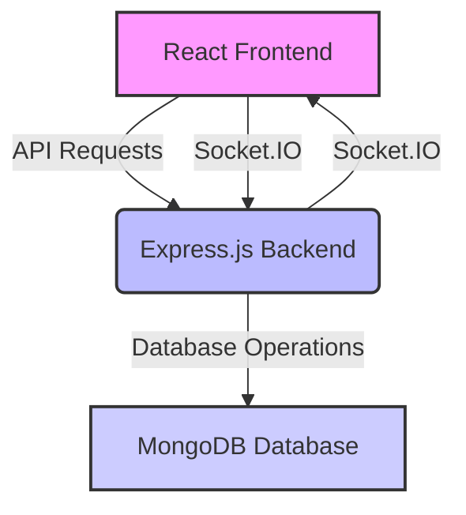

## Credits
This project acknowledges its inspiration from the following tutorial: [https://youtu.be/ntKkVrQqBYY?si=qz02jMCQ80RT1jaH](https://youtu.be/ntKkVrQqBYY?si=qz02jMCQ80RT1jaH).
---FILEBREAK---
<!-- 2_projectstructure.mdx -->
# Project Structure
[TOC]

While a detailed file structure is not provided in the `README.md`, a typical MERN application often follows a structured approach to separate concerns between frontend and backend components. This section outlines a probable project structure based on common MERN patterns.

## High-Level Structure
A MERN project usually segregates the client-side (React) and server-side (Node.js/Express) code into distinct directories.

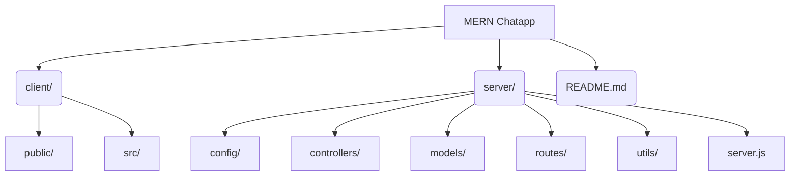

## Frontend Directory (`client/`)
The `client/` directory typically houses the React application.

### `client/public/`
Contains public assets like `index.html`, manifest files, and favicons.

### `client/src/`
This is the core of the React application, often containing:
*   `components/`: Reusable UI components (e.g., chat message, user list item).
*   `pages/` or `views/`: Top-level components representing different application screens (e.g., `HomePage`, `ChatPage`, `LoginPage`).
*   `context/` or `redux/`: State management logic.
*   `api/` or `services/`: Frontend-specific API interaction logic.
*   `assets/`: Static assets like images or styles.
*   `App.js`: The main application component.
*   `index.js`: Entry point for the React application.

## Backend Directory (`server/`)
The `server/` directory contains the Node.js/Express backend.

### `server/config/`
Configuration files, such as database connection settings, environment variables, or JWT secrets.

### `server/controllers/`
Contains the business logic for handling requests, processing data, and interacting with models. Each controller typically corresponds to a specific resource (e.g., `userController.js`, `messageController.js`).

### `server/models/`
Defines the schema for the MongoDB database using Mongoose. Each model represents a collection in the database (e.g., `User.js`, `Message.js`, `Conversation.js`).

### `server/routes/`
Defines the API endpoints and maps them to corresponding controller functions (e.g., `userRoutes.js`, `messageRoutes.js`).

### `server/utils/`
Utility functions, such as JWT token generation, error handling middleware, or helper functions.

### `server/server.js` or `server/app.js`
The main entry point for the Express server, responsible for setting up middleware, connecting to the database, and starting the server.
---FILEBREAK---
<!-- 3_technicaldetails.mdx -->
# Technical Details
[TOC]

This section delves into the technical implementation aspects of the MERN Chatapp, discussing key components and their interactions within the MERN stack.

## Data Models (Inferred)
Based on a typical chat application, several core data models would be implemented using Mongoose for MongoDB.

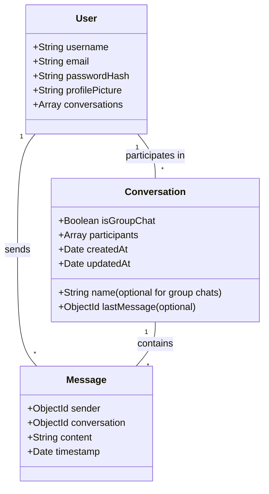

### User Model
Represents a registered user in the application. It would contain fields like username, email, hashed password, and potentially a profile picture URL.

### Message Model
Represents an individual chat message. It would link to the sender (User) and the conversation it belongs to (Conversation), storing the message content and timestamp.

### Conversation Model
Represents a chat conversation, which can be a direct message between two users or a group chat. It would list all participants and potentially the last message sent for quick previews.

## API Endpoints (Inferred)
The Express.js backend would expose RESTful API endpoints for various operations.

```mermaid
graph TD
    A[Client] --> B{API Endpoints}
    B --> B1[/api/auth/register : POST]
    B --> B2[/api/auth/login : POST]
    B --> B3[/api/users/:id : GET]
    B --> B4[/api/conversations : GET, POST]
    B --> B5[/api/conversations/:id/messages : GET, POST]
    B --> B6[/api/messages/:id : PUT, DELETE]
    %% Corrected syntax: Added HTTP methods to the endpoints for clarity.
```

### Authentication Endpoints
*   `POST /api/auth/register`: To register a new user.
*   `POST /api/auth/login`: To authenticate an existing user and return a JWT token.

### User Endpoints
*   `GET /api/users/:id`: To fetch user profile details.
*   `GET /api/users/search?q=...`: To search for users.

### Conversation Endpoints
*   `GET /api/conversations`: To retrieve all conversations for the authenticated user.
*   `POST /api/conversations`: To create a new direct or group conversation.
*   `GET /api/conversations/:id`: To get details of a specific conversation.

### Message Endpoints
*   `GET /api/conversations/:id/messages`: To fetch messages within a specific conversation.
*   `POST /api/conversations/:id/messages`: To send a new message to a conversation.
*   `PUT /api/messages/:id`: To edit an existing message.
*   `DELETE /api/messages/:id`: To delete a message.

## Real-time Communication (Socket.IO - Inferred)
For a chat application, real-time communication is crucial. Socket.IO is the most common library used in MERN apps for this purpose.

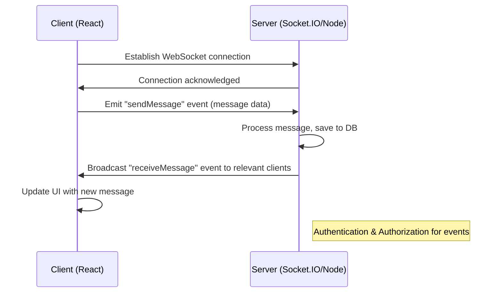

Key Socket.IO events would likely include:
*   `connection`: Fired when a client connects to the server.
*   `disconnect`: Fired when a client disconnects.
*   `joinRoom`: Clients join specific conversation rooms to receive messages.
*   `sendMessage`: Client sends a message to the server.
*   `receiveMessage`: Server broadcasts a new message to clients in a specific room.
*   `typing`: Clients emit when typing, server broadcasts to other participants.

---

<!-- 1_overview.mdx -->
# Overview
[TOC]

This document provides a comprehensive technical overview of the `backend` component, as inferred from the [package-lock.json](https://github.com/shinymack/Chat-App-MERN/backend/package-lock.json) file. The `backend` is a Node.js application utilizing `express` for web server functionality and `socket.io` for real-time communication. It integrates with `mongoose` for MongoDB interactions, handles user authentication with `bcryptjs`, `jsonwebtoken`, and `passport`, and manages file uploads through `cloudinary`.

## Project Structure (Inferred)

```mermaid
graph TD
    A[Root] --> B[backend/]
    B --> B1[package.json]
    B --> B2[package-lock.json]
    B --> B3[node_modules/]
    B1 ---|Defines dependencies| B3
    B2 ---|Locks dependency versions| B3
    A --> C[frontend/ (Assumed)]
    A --- D[database/ (Assumed)]
    B ---|Connects to| D
    B ---|Communicates with| C
```
<!-- Corrected syntax -->

## Core Technologies

The backend is built upon a robust set of technologies, primarily focused on Node.js and its ecosystem:

*   **Node.js**: The runtime environment for the server.
*   **Express**: A minimal and flexible Node.js web application framework that provides a robust set of features for web and mobile applications.
*   **MongoDB (via Mongoose)**: A NoSQL database for storing application data, with Mongoose providing an ODM (Object Data Modeling) layer.
*   **Socket.io**: Enables real-time, bidirectional, event-based communication between the server and clients.
*   **Authentication & Authorization**: Utilizes `bcryptjs` for password hashing, `jsonwebtoken` for token-based authentication, and `passport` for flexible authentication strategies, including `passport-google-oauth20`.
*   **Cloudinary**: For cloud-based image and video management, likely used for handling user profile pictures or shared media.
*   **Environment Variables**: `dotenv` is used to manage environment-specific configurations.

## Development Dependencies

The [package-lock.json](https://github.com/shinymack/Chat-App-MERN/backend/package-lock.json) also lists development dependencies, indicating tools used during the development phase:

*   **Nodemon**: A utility that automatically restarts the node application when file changes in the directory are detected. This is crucial for efficient development.

## Entry Point (Inferred)

While not explicitly stated in `package-lock.json`, a typical Node.js backend would have an entry point, usually `index.js` or `app.js`, where the Express application is initialized, routes are defined, and the server starts listening.

---FILEBREAK---
<!-- 2_backendarchitecture.mdx -->
# Backend Architecture
[TOC]

This section details the architectural components of the backend, focusing on the roles of various packages identified in [backend/package-lock.json](https://github.com/shinymack/Chat-App-MERN/backend/package-lock.json).

## Express Web Server

The backend leverages `express` as its primary web framework. This forms the foundation for handling HTTP requests, defining routes, and managing middleware.

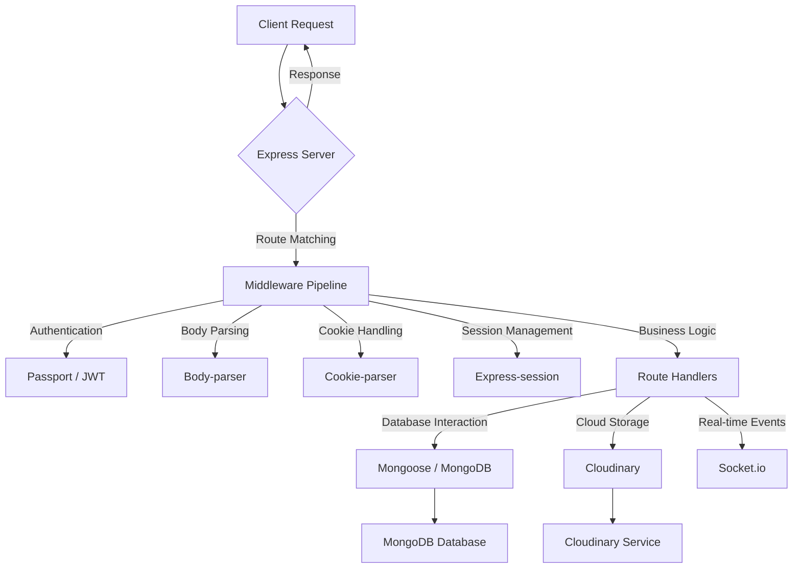
<!-- Corrected syntax -->

### Key Express Components and Middleware

*   **`express`**: The core framework for creating the API endpoints and serving HTTP requests.
*   **`body-parser`**: Middleware to parse incoming request bodies in a convenient format (e.g., JSON, URL-encoded data). This is essential for handling data submitted by the client.
*   **`cookie-parser`**: Parses `Cookie` header and populates `req.cookies` with an object keyed by cookie names. This is fundamental for session management and authentication.
*   **`express-session`**: Middleware for managing user sessions. It relies on cookies (managed by `cookie-parser`) to store session IDs and can persist session data on the server (though the exact session store isn't specified, it often integrates with databases like MongoDB).
*   **`cors`**: Middleware to enable Cross-Origin Resource Sharing (CORS), allowing requests from different domains, which is common in a decoupled frontend/backend architecture.
*   **`dotenv`**: Loads environment variables from a `.env` file, crucial for configuring database connections, API keys, and other sensitive information without hardcoding them.

## Database Interaction

The backend interacts with a MongoDB database using `mongoose`.

### Mongoose and MongoDB

*   **`mongoose`**: An Object Data Modeling (ODM) library for MongoDB and Node.js. It provides a schema-based solution to model application data, enforced at the application layer. It simplifies interactions with MongoDB by providing methods for data validation, querying, and relationship management.
    *   **`bson`**: A dependency of Mongoose, providing Binary JSON serialization and deserialization for MongoDB data types.
    *   **`kareem`**: Mongoose's middleware system.
    *   **`mongodb`**: The official MongoDB driver for Node.js, on which Mongoose builds.

## Authentication and Authorization

Robust authentication is handled through a combination of `bcryptjs`, `jsonwebtoken`, and `passport`.

### Authentication Flow

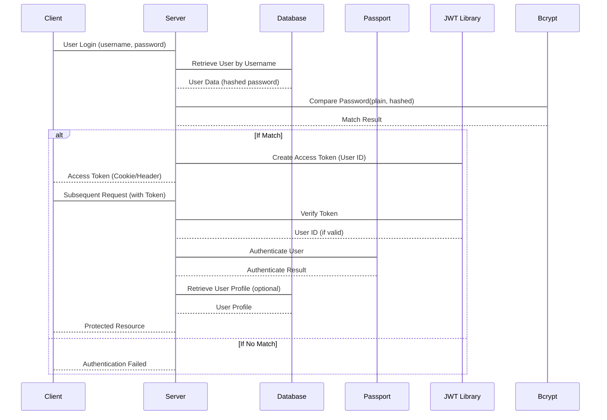
<!-- Corrected syntax -->

*   **`bcryptjs`**: Used for hashing user passwords before storing them in the database and for comparing submitted passwords with stored hashes during login. This ensures sensitive password data is never stored in plain text.
*   **`jsonwebtoken`**: Implements JSON Web Tokens (JWTs) for stateless authentication. After a user logs in, a JWT is issued, which the client includes in subsequent requests to access protected routes.
*   **`passport`**: A flexible authentication middleware for Node.js. It provides various strategies for authenticating requests, including local (username/password) and OAuth (e.g., Google).
    *   **`passport-google-oauth20`**: A Passport strategy for authenticating with Google using the OAuth 2.0 API. This enables "Sign in with Google" functionality.
    *   **`passport-oauth2`**: The base OAuth 2.0 strategy for Passport, used by specific OAuth providers like Google.
    *   **`passport-strategy`**: The base class for all Passport strategies.

## Real-time Communication

`socket.io` provides real-time communication capabilities, which are essential for features like live chat, notifications, or collaborative editing.

### Socket.io Architecture

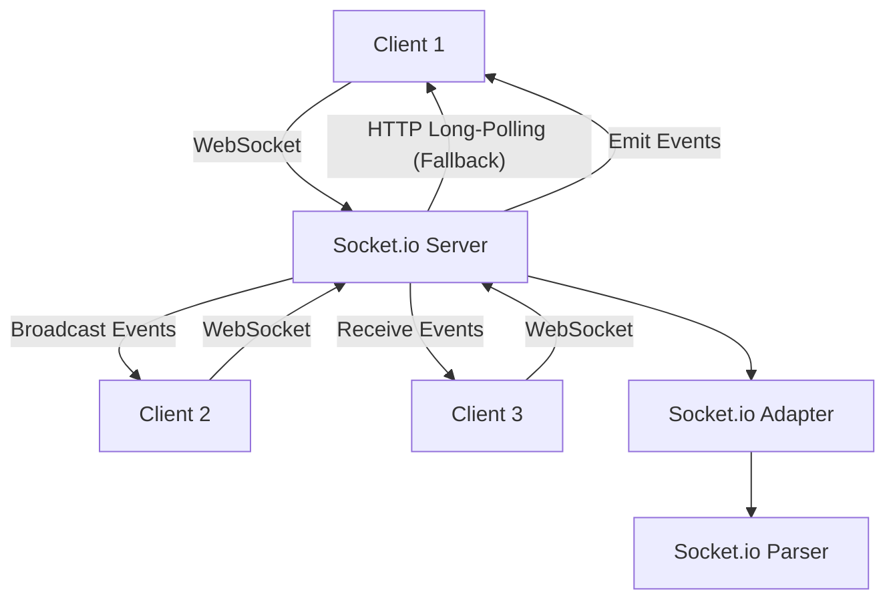
<!-- Corrected syntax -->

*   **`socket.io`**: The main library for enabling real-time, bidirectional communication. It handles WebSocket connections and gracefully falls back to other transport methods (like long-polling) if WebSockets are not available.
*   **`engine.io`**: The low-level transport layer used by Socket.io, handling the connection mechanism itself (WebSockets, long-polling).
    *   **`engine.io-parser`**: Parses and encodes Engine.io packets.
*   **`socket.io-adapter`**: Manages the state of the Socket.io server, allowing for horizontal scaling across multiple servers.
*   **`socket.io-parser`**: Parses and encodes Socket.io packets, including custom event data.

## Cloud Storage

`cloudinary` is integrated for handling media assets.

*   **`cloudinary`**: A cloud-based image and video management service. This is likely used for uploading, storing, and delivering user-generated content such as profile pictures, shared images, or videos.

## Development Utilities

*   **`nodemon`**: A tool that helps develop Node.js based applications by automatically restarting the node application when file changes in the directory are detected. This significantly speeds up the development cycle.

---

---

<!-- 1_introduction.mdx -->
# 1. Introduction
[TOC]

This documentation provides a comprehensive overview of the backend services for the Chat App, a MERN stack application. It details the architecture, key components, and functionalities implemented in the server-side logic, focusing on user authentication, message handling, and friend management.

## 1.1 Project Overview
The Chat App is designed to facilitate real-time communication between users, including features like sending messages, managing friend requests, and handling user authentication. The backend is built using Node.js with Express, MongoDB as the database, and integrates several third-party services for enhanced functionality.

### 1.1.1 Core Features
- User Authentication (Local and Google OAuth)
- Real-time Messaging
- Friend Request Management (Send, Accept, Reject, Remove)
- User Profile Management
- Cloud-based Image Storage for Messages

## 1.2 Backend Architecture Overview
The backend follows a modular architecture, separating concerns into controllers, routes, models, and utility libraries. It uses Express for routing, Mongoose for MongoDB interactions, and Passport.js for authentication. Socket.io is integrated for real-time communication.

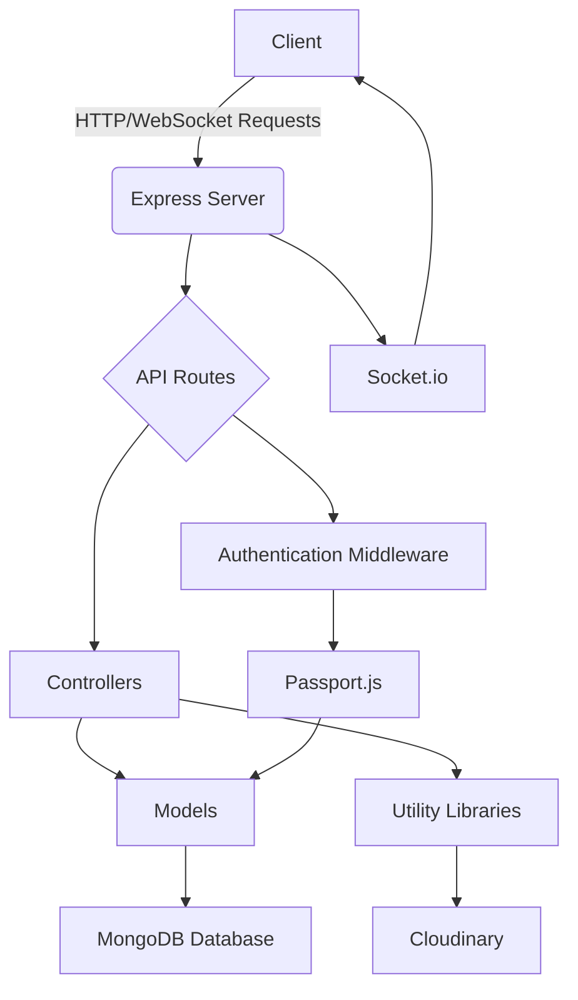

### 1.2.1 Technology Stack
- **Node.js**: JavaScript runtime environment
- **Express.js**: Web application framework for Node.js
- **MongoDB**: NoSQL database
- **Mongoose**: MongoDB object data modeling (ODM) library
- **Socket.io**: Real-time bidirectional event-based communication
- **Passport.js**: Authentication middleware
- **Cloudinary**: Cloud-based image and video management
- **dotenv**: Loads environment variables from a `.env` file
- **cors**: Provides a Connect/Express middleware that can be used to enable CORS
- **cookie-parser**: Parse Cookie header and populate `req.cookies`
- **express-session**: Simple session middleware for Express

---FILEBREAK---
<!-- 2_backend_architecture.mdx -->
# 2. Backend Architecture
[TOC]

The backend architecture is structured to be scalable and maintainable, adhering to the Model-View-Controller (MVC) pattern principles for better organization of code.

## 2.1 Server Entry Point
The primary entry point for the backend server is `backend/src/index.js`. This file initializes the Express application, sets up middleware, defines API routes, and establishes connections to the database and real-time communication server.

### 2.1.1 Server Initialization and Configuration
The `index.js` file handles environment variable loading, Passport.js configuration, and middleware setup for parsing requests, handling sessions, and enabling CORS.

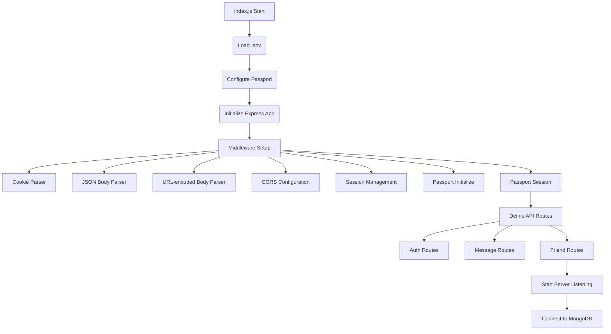
- **Environment Variables**: Loaded using `dotenv` for sensitive information like database URIs, API keys, and session secrets.
- **Middleware**:
    - `cookieParser`: Parses cookies attached to the client request object.
    - `express.json` and `express.urlencoded`: Parse incoming request bodies.
    - `cors`: Enables Cross-Origin Resource Sharing. Configured to allow requests from `http://localhost:5173` with credentials.
    - `express-session`: Manages user sessions.
    - `passport.initialize()` and `passport.session()`: Initialize and use Passport.js for authentication.
- **Routes**: API endpoints are grouped logically for authentication (`/api/auth`), messages (`/api/messages`), and friends (`/api/friends`).
- **Database Connection**: `connectDB()` from [backend/src/lib/db.js](https://github.com/shinymack/Chat-App-MERN/backend/src/lib/db.js) is called to establish a connection to MongoDB.
- **Real-time Communication**: The `app` and `server` objects are exported from [backend/src/lib/socket.js](https://github.com/shinymack/Chat-App-MERN/backend/src/lib/socket.js), allowing `index.js` to manage the HTTP server which Socket.io then hooks into.
- **Production Setup**: Includes static file serving for a `frontend/dist` directory when `NODE_ENV` is set to `production`.

## 2.2 Database Layer
The database layer consists of MongoDB, managed through Mongoose, and a utility function for connection.

### 2.2.1 MongoDB Connection
The application connects to a MongoDB database using Mongoose. The connection logic is encapsulated in [backend/src/lib/db.js](https://github.com/shinymack/Chat-App-MERN/backend/src/lib/db.js).

```javascript
// backend/src/lib/db.js
import mongoose from "mongoose"

export const connectDB = async () => {
  try {
    const conn = await mongoose.connect(process.env.MONGODB_URI);
    console.log(`MongoDB connected:  ${conn.connection.host}`);
  }
  catch(error){
    console.log("MongoDB connection error: ", error);
  }
}
```
- `connectDB`: An asynchronous function that attempts to establish a connection to MongoDB using the URI provided in `process.env.MONGODB_URI`.
- Error Handling: Catches and logs any connection errors, which is crucial for identifying database connectivity issues.

## 2.3 Authentication and Authorization
The application uses Passport.js for authentication, supporting both local strategies (not explicitly shown in provided files but implied) and Google OAuth 2.0.

### 2.3.1 Passport.js Configuration
Passport.js is configured in [backend/src/lib/passport.config.js](https://github.com/shinymack/Chat-App-MERN/backend/src/lib/passport.config.js) to handle Google OAuth.

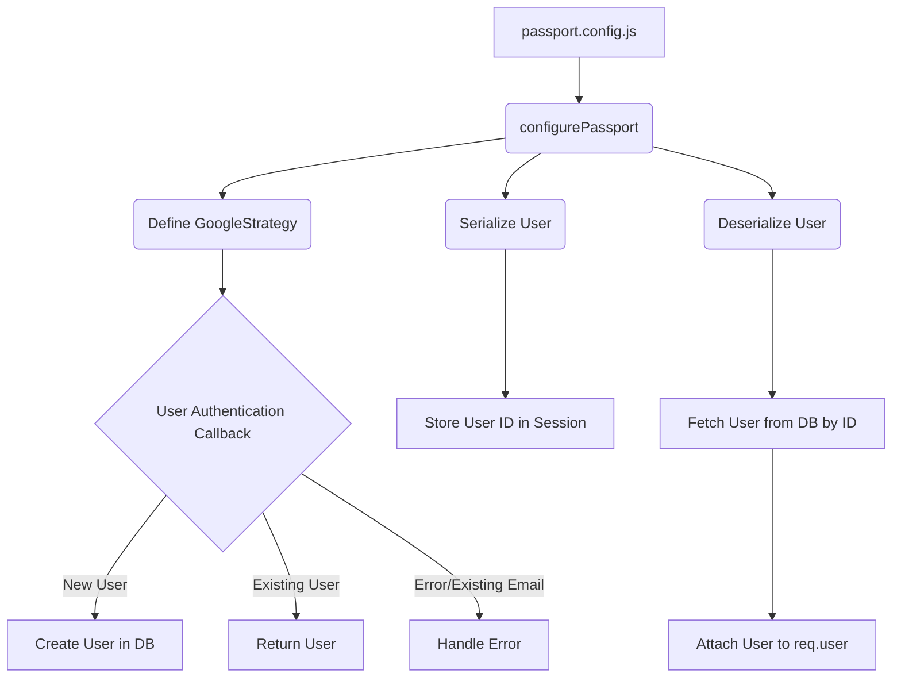
- **GoogleStrategy**:
    - Configured with `clientID`, `clientSecret`, and `callbackURL` from environment variables.
    - `scope: ['profile', 'email']` requests user's profile and email information.
    - The `verify` callback function:
        - Checks if a user with the `googleId` already exists. If so, returns the existing user.
        - If not, attempts to create a new user. It generates a unique username and validates email availability.
        - Handles cases where an email provided by Google already exists with a different authentication provider.
- **Serialization/Deserialization**:
    - `passport.serializeUser`: Stores the user's MongoDB `_id` in the session.
    - `passport.deserializeUser`: Retrieves the full user object from the database using the stored `_id` and attaches it to `req.user`, making user information accessible throughout request handlers.

## 2.4 Cloudinary Integration
Cloudinary is used for storing images sent within messages. The configuration is in [backend/src/lib/cloudinary.js](https://github.com/shinymack/Chat-App-MERN/backend/src/lib/cloudinary.js).

```javascript
// backend/src/lib/cloudinary.js
import {v2 as cloudinary} from "cloudinary"
import { config } from 'dotenv'
config();

cloudinary.config(
    {cloud_name: process.env.CLOUDINARY_CLOUD_NAME,
    api_key: process.env.CLOUDINARY_API_KEY,
    api_secret: process.env.CLOUDINARY_API_SECRET,}
);

export default cloudinary;
```
- `cloudinary.config`: Initializes the Cloudinary SDK with credentials obtained from environment variables (`CLOUDINARY_CLOUD_NAME`, `CLOUDINARY_API_KEY`, `CLOUDINARY_API_SECRET`).
- This setup allows for easy uploading and management of media files.

---FILEBREAK---
<!-- 3_api_controllers.mdx -->
# 3. API Controllers
[TOC]

API controllers handle the business logic for various endpoints, processing requests, interacting with models, and sending responses.

## 3.1 Friend Management Controller
The friend management logic resides in [backend/src/controllers/friend.controller.js](https://github.com/shinymack/Chat-App-MERN/backend/src/controllers/friend.controller.js). This controller manages sending, accepting, rejecting, and removing friend requests, as well as retrieving friend lists and pending requests.

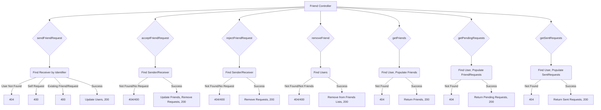

### 3.1.1 `sendFriendRequest`
- **Purpose**: Allows a user to send a friend request to another user identified by username or email.
- **Request Body**: `{ identifier: string }`
- **Logic**:
    1. Validates `identifier`.
    2. Finds the receiver by `username` or `email`.
    3. Checks for self-requests, existing friendships, or already sent/received requests.
    4. Adds `receiverId` to `sender.sentRequests` and `senderId` to `receiver.friendRequests`.
    5. Saves both user documents.
- **Source**: [backend/src/controllers/friend.controller.js#L9](https://github.com/shinymack/Chat-App-MERN/backend/src/controllers/friend.controller.js#L9)

### 3.1.2 `acceptFriendRequest`
- **Purpose**: Allows a user to accept a friend request.
- **Request Params**: `senderId` (ID of the user who sent the request).
- **Logic**:
    1. Finds both sender and receiver users.
    2. Verifies the request exists in the receiver's `friendRequests`.
    3. Adds both users to each other's `friends` list.
    4. Removes the request from `receiver.friendRequests` and `sender.sentRequests`.
    5. Saves both user documents.
- **Source**: [backend/src/controllers/friend.controller.js#L68](https://github.com/shinymack/Chat-App-MERN/backend/src/controllers/friend.controller.js#L68)

### 3.1.3 `rejectFriendRequest`
- **Purpose**: Allows a user to reject a friend request.
- **Request Params**: `senderId` (ID of the user whose request is being rejected).
- **Logic**:
    1. Finds both sender and receiver users.
    2. Removes the `senderId` from `receiver.friendRequests` and `receiverId` from `sender.sentRequests`.
    3. Saves both user documents.
- **Source**: [backend/src/controllers/friend.controller.js#L110](https://github.com/shinymack/Chat-App-MERN/backend/src/controllers/friend.controller.js#L110)

### 3.1.4 `removeFriend`
- **Purpose**: Allows a user to remove an existing friend.
- **Request Params**: `friendId` (ID of the friend to remove).
- **Logic**:
    1. Finds both users.
    2. Checks if they are actually friends.
    3. Removes each user from the other's `friends` list.
    4. Saves both user documents.
- **Source**: [backend/src/controllers/friend.controller.js#L151](https://github.com/shinymack/Chat-App-MERN/backend/src/controllers/friend.controller.js#L151)

### 3.1.5 `getFriends`
- **Purpose**: Retrieves the list of friends for the current user.
- **Logic**:
    1. Finds the current user.
    2. Populates the `friends` field, selecting `username`, `email`, `profilePic`, and `_id`.
    3. Returns the populated friends list.
- **Source**: [backend/src/controllers/friend.controller.js#L190](https://github.com/shinymack/Chat-App-MERN/backend/src/controllers/friend.controller.js#L190)

### 3.1.6 `getPendingRequests`
- **Purpose**: Retrieves friend requests received by the current user.
- **Logic**:
    1. Finds the current user.
    2. Populates the `friendRequests` field, selecting `username`, `email`, `profilePic`, and `_id`.
    3. Returns the populated list of pending requests.
- **Source**: [backend/src/controllers/friend.controller.js#L214](https://github.com/shinymack/Chat-App-MERN/backend/src/controllers/friend.controller.js#L214)

### 3.1.7 `getSentRequests`
- **Purpose**: Retrieves friend requests sent by the current user.
- **Logic**:
    1. Finds the current user.
    2. Populates the `sentRequests` field, selecting `username`, `email`, `profilePic`, and `_id`.
    3. Returns the populated list of sent requests.
- **Source**: [backend/src/controllers/friend.controller.js#L238](https://github.com/shinymack/Chat-App-MERN/backend/src/controllers/friend.controller.js#L238)

## 3.2 Message Management Controller
The message management logic is handled by [backend/src/controllers/message.controller.js](https://github.com/shinymack/Chat-App-MERN/backend/src/controllers/message.controller.js). This controller facilitates retrieving users for chat, fetching messages between two users, and sending new messages, including image uploads.

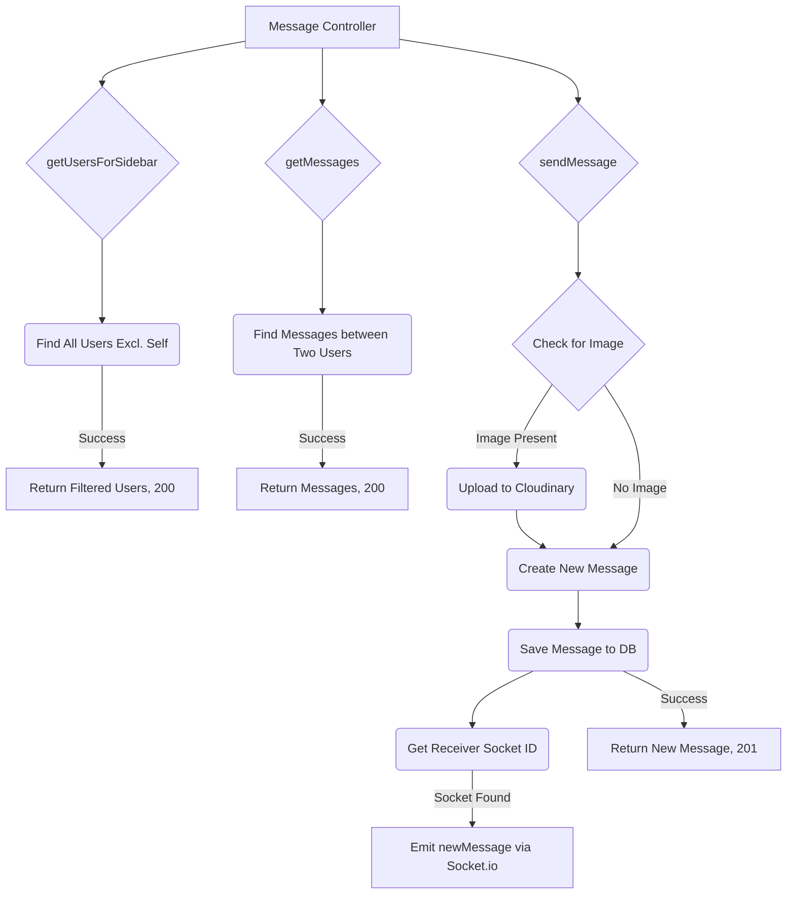

### 3.2.1 `getUsersForSidebar`
- **Purpose**: Retrieves a list of all users excluding the currently logged-in user, typically for displaying in a chat sidebar.
- **Logic**:
    1. Finds all users where `_id` is not equal to `loggedInUserId`.
    2. Selects all fields except `password`.
    3. Returns the filtered user list.
- **Source**: [backend/src/controllers/message.controller.js#L8](https://github.com/shinymack/Chat-App-MERN/backend/src/controllers/message.controller.js#L8)

### 3.2.2 `getMessages`
- **Purpose**: Retrieves all messages exchanged between the current user and a specific chat partner.
- **Request Params**: `id` (ID of the user to chat with).
- **Logic**:
    1. Finds messages where either:
        - `senderId` is `myId` AND `receiverId` is `userToChatId`
        - OR `senderId` is `userToChatId` AND `receiverId` is `myId`
    2. Returns the list of messages.
- **Source**: [backend/src/controllers/message.controller.js#L23](https://github.com/shinymack/Chat-App-MERN/backend/src/controllers/message.controller.js#L23)

### 3.2.3 `sendMessage`
- **Purpose**: Sends a new message, optionally including an image.
- **Request Body**: `{ text: string, image?: string }`
- **Request Params**: `id` (ID of the receiver).
- **Logic**:
    1. If an `image` is present in the request body, uploads it to Cloudinary and gets a secure URL.
    2. Creates a new `Message` document with `senderId`, `receiverId`, `text`, and `imageUrl` (if applicable).
    3. Saves the new message to the database.
    4. Attempts to get the `receiverSocketId` using the `getReceiverSocketId` utility from `socket.js`.
    5. If the receiver is online (socket ID found), emits a `newMessage` event via Socket.io to the receiver, ensuring real-time delivery.
    6. Returns the newly created message.
- **Source**: [backend/src/controllers/message.controller.js#L44](https://github.com/shinymack/Chat-App-MERN/backend/src/controllers/message.controller.js#L44)

---FILEBREAK---
<!-- 4_realtime_communication.mdx -->
# 4. Real-time Communication
[TOC]

Real-time communication is powered by Socket.io, enabling instant message delivery and status updates without needing to refresh the client.

## 4.1 Socket.io Initialization
The Socket.io server is initialized and managed in `backend/src/lib/socket.js` (not directly provided in content, but implied by `backend/src/index.js` and `backend/src/controllers/message.controller.js`).

### 4.1.1 Socket.io Flow
The `sendMessage` controller explicitly uses Socket.io functionalities to emit real-time updates.

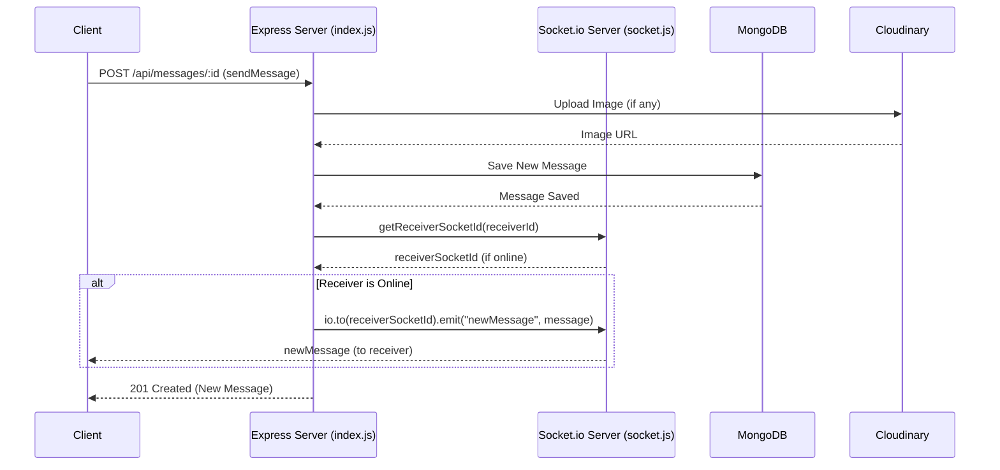
- **`io.to(receiverSocketId).emit("newMessage", newMessage)`**: This line is crucial for real-time messaging. When a message is successfully saved, if the receiver is currently connected (has a `socketId`), Socket.io directly emits the `newMessage` event to that specific client's socket. This bypasses the need for the receiver to poll the server for new messages.

The `backend/src/index.js` file imports `app` and `server` from the `socket.js` file, indicating that the core Express application and HTTP server are extended to include Socket.io capabilities. This is a common pattern where `socket.js` would handle mapping user IDs to socket IDs and managing socket connections.

---FILEBREAK---
<!-- 5_utilities.mdx -->
# 5. Utilities
[TOC]

The `lib` directory in the backend contains various utility functions and configurations that support the main application logic.

## 5.1 Cloudinary Configuration
The configuration for Cloudinary, used for image storage, is located in [backend/src/lib/cloudinary.js](https://github.com/shinymack/Chat-App-MERN/backend/src/lib/cloudinary.js).

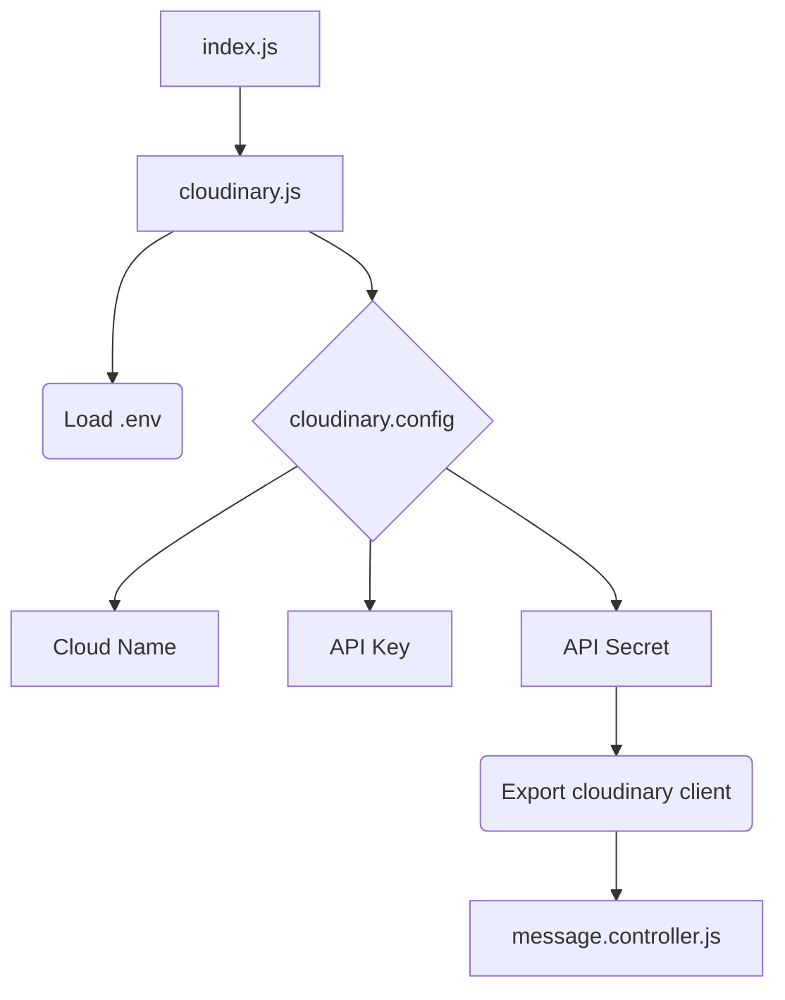
- This utility ensures that the Cloudinary SDK is properly initialized with environment-specific credentials, making it ready for image upload operations within controllers like `message.controller.js`.

## 5.2 Database Connection Utility
The `connectDB` function in [backend/src/lib/db.js](https://github.com/shinymack/Chat-App-MERN/backend/src/lib/db.js) handles the connection to the MongoDB database.

```mermaid
graph TD
    A[index.js] --> B(connectDB)
    B --> C{mongoose.connect(MONGODB_URI)}
    C -- Success --> D[Log Connection Host]
    C -- Failure --> E[Log Error]
    %% Corrected syntax: Added a colon for clarity in the diagram
```
- This centralized function simplifies database connection management and provides consistent error handling for connection attempts.

## 5.3 Passport Configuration Utility
The `configurePassport` function in [backend/src/lib/passport.config.js](https://github.com/shinymack/Chat-App-MERN/backend/src/lib/passport.config.js) sets up the authentication strategies and serialization/deserialization logic for Passport.js.

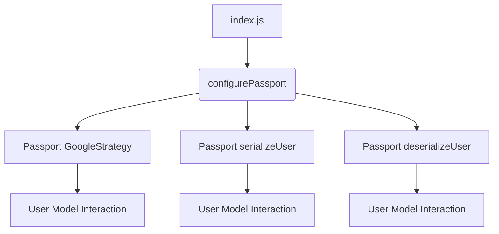
- By encapsulating Passport.js configuration, this utility promotes cleaner code in the main `index.js` file and makes authentication setup reusable.

## 5.4 Socket.io Utilities
While `backend/src/lib/socket.js` content was not provided, its existence and usage (`app`, `server`, `getReceiverSocketId`, `io`) imply that it contains:
- Express app and HTTP server setup.
- Socket.io server initialization.
- A mechanism to store and retrieve active socket IDs mapped to user IDs (e.g., `userSocketMap` and `getReceiverSocketId`).
- Event listeners for `connection` and `disconnect` to manage socket IDs.

This setup is crucial for the real-time functionality of the chat application, allowing messages to be pushed directly to online users.

---

<!-- 1_overview.mdx -->
# Overview
[TOC]

This documentation provides a comprehensive overview of the Chat-App-MERN project, detailing its frontend and backend architecture, core components, and functionality. The application is a real-time chat application built using the MERN (MongoDB, Express.js, React, Node.js) stack, leveraging Socket.IO for real-time communication.

## Project Structure
The project is divided into two main parts: `backend` and `frontend`.

```mermaid
graph TD
    A[Chat-App-MERN] --> B[backend/]
    A --> C[frontend/]

    B --> B1[src/]
    B1 --> B1.1[controllers/]
    B1 --> B1.2[middleware/]
    B1 --> B1.3[models/]
    B1 --> B1.4[routes/]
    B1 --> B1.5[lib/]

    C --> C1[public/]
    C --> C2[src/]
    C --> C3[README.md](https://github.com/shinymack/Chat-App-MERN/frontend/README.md)
    C --> C4[index.html](https://github.com/shinymack/Chat-App-MERN/frontend/index.html)
    C --> C5[eslint.config.js](https://github.com/shinymack/Chat-App-MERN/frontend/eslint.config.js)
<!-- Corrected syntax -->
```

## Technologies Used
*   **Backend**: Node.js, Express.js, MongoDB, Mongoose, Socket.IO, JWT, Passport.js (for Google OAuth).
*   **Frontend**: React.js, Vite, ESLint.

## Key Features
*   User Authentication (Signup, Login, Logout)
*   Google OAuth Integration
*   Real-time Messaging
*   Friend Request Management
*   User Profile Management
*   Online User Status

## Getting Started
To get the project up and running, follow the instructions in the respective `README.md` files for the [backend](https://github.com/shinymack/Chat-App-MERN/backend/README.md) (not provided in this input, but inferred) and [frontend](https://github.com/shinymack/Chat-App-MERN/frontend/README.md) directories.

---FILEBREAK---
<!-- 2_backendarchitecture.mdx -->
# Backend Architecture
[TOC]

The backend of the Chat Application is built with Node.js and Express.js, following a typical MVC-like structure. It handles API requests, database interactions, user authentication, and real-time communication via WebSockets.

## Directory Structure
The `backend/src` directory contains the core logic of the server.

```mermaid
graph TD
    A[backend/src/] --> B[controllers/]
    A --> C[middleware/]
    A --> D[models/]
    A --> E[routes/]
    A --> F[lib/]
    F --> F1[socket.js](https://github.com/shinymack/Chat-App-MERN/backend/src/lib/socket.js)
    F --> F2[utils.js](https://github.com/shinymack/Chat-App-MERN/backend/src/lib/utils.js)
    C --> C1[auth.middleware.js](https://github.com/shinymack/Chat-App-MERN/backend/src/middleware/auth.middleware.js)
    D --> D1[message.model.js](https://github.com/shinymack/Chat-App-MERN/backend/src/models/message.model.js)
    D --> D2[user.model.js](https://github.com/shinymack/Chat-App-MERN/backend/src/models/user.model.js)
    E --> E1[auth.route.js](https://github.com/shinymack/Chat-App-MERN/backend/src/routes/auth.route.js)
    E --> E2[friend.route.js](https://github.com/shinymack/Chat-App-MERN/backend/src/routes/friend.route.js)
    E --> E3[message.route.js](https://github.com/shinymack/Chat-App-MERN/backend/src/routes/message.route.js)
<!-- Corrected syntax -->
```

## Core Components

### 2.1 Server Setup and Socket.IO
The `socket.js` file is responsible for initializing the Express application, HTTP server, and Socket.IO server. It also manages online users.

*   **File**: [backend/src/lib/socket.js](https://github.com/shinymack/Chat-App-MERN/backend/src/lib/socket.js)

```javascript
import { Server } from "socket.io";
import http from "http";
import express from "express";

const app = express();
const server = http.createServer(app);
const io = new Server(server, {
    cors: {
        origin: ["http://localhost:5173"]
    }
});

// used to store online users
const userSocketMap = {}; //{userId : socketId}

export function getReceiverSocketId(userId) {
    return userSocketMap[userId];
}

io.on("connection", (socket) => {
    console.log("A user connected", socket.id);

    const userId = socket.handshake.query.userId;
    if(userId) userSocketMap[userId] = socket.id;

    io.emit("getOnlineUsers", Object.keys(userSocketMap));

    socket.on("disconnect", ()=>{
        console.log("A user disconnected", socket.id);
        delete userSocketMap[userId]; 
        io.emit("getOnlineUsers", Object.keys(userSocketMap));
    })
});

export { io, app, server };
```

#### Online User Management Flow
```mermaid
sequenceDiagram
    participant C as Client
    participant S as Socket.IO Server
    participant USM as userSocketMap

    C->>S: Connect (with userId in handshake)
    S->>S: `io.on("connection")` triggered
    S->>USM: Store `userSocketMap[userId] = socket.id`
    S->>S: Get all `Object.keys(userSocketMap)`
    S-->>C: `io.emit("getOnlineUsers", onlineUsers)`
    Note right of C: Client updates UI with online users

    C->>S: Disconnect
    S->>S: `socket.on("disconnect")` triggered
    S->>USM: Delete `userSocketMap[userId]`
    S->>S: Get all `Object.keys(userSocketMap)`
    S-->>C: `io.emit("getOnlineUsers", onlineUsers)`
    Note right of C: Client updates UI with online users
<!-- Corrected syntax -->
```

### 2.2 Utility Functions

The `utils.js` file provides helper functions, such as JWT token generation for authentication.

*   **File**: [backend/src/lib/utils.js](https://github.com/shinymack/Chat-App-MERN/backend/src/lib/utils.js)

```javascript
import jwt from 'jsonwebtoken';

export const generateToken = (userId, res) => {
    const token = jwt.sign({userId}, process.env.JWT_SECRET, 
        {expiresIn: "7d"});

    res.cookie("jwt", token, {
        maxAge: 7 * 24 * 60 * 60 * 1000, 
        httpOnly: true,
        sameSite: "strict",
        secure: process.env.NODE_ENV !== "development",
    });
    return token;
};
```

### 2.3 Middleware

Middleware functions are used to process requests before they reach the route handlers. The `auth.middleware.js` file contains the `protectRoute` middleware.

*   **File**: [backend/src/middleware/auth.middleware.js](https://github.com/shinymack/Chat-App-MERN/backend/src/middleware/auth.middleware.js)

```javascript
import jwt from "jsonwebtoken"
import User from "../models/user.model.js"

export const protectRoute = async (req, res, next) => {
    try {
        const token = req.cookies.jwt;
        if(!token){
            return res.status(401).json({message: "Unauthorized - No Token Provided"});
        }

        const decoded = jwt.verify(token, process.env.JWT_SECRET)

        if(!decoded) {
            return res.status(401).json({message: "Unauthorized - Invalid Token"});
        }
        const user = await User.findById(decoded.userId).select("-password");

        if(!user) {
            return res.status(404).json({message: "User not found"});
        }
        req.user = user;

        next();
    } catch (error) {
        console.log("Error in protectRoute middleware", error.message);
        res.status(500).json({message: "Internal Server Error"});
    }
};
```

#### Authentication Flow with `protectRoute`
```mermaid
sequenceDiagram
    participant C as Client
    participant MW as protectRoute Middleware
    participant JWT as JWT Library
    participant DB as User Database
    participant RH as Route Handler

    C->>MW: Request with `jwt` cookie
    MW->>MW: Check for `jwt` token
    alt No token
        MW-->>C: 401 Unauthorized (No Token)
    else Token exists
        MW->>JWT: Verify token using `JWT_SECRET`
        alt Invalid token
            JWT-->>MW: Error
            MW-->>C: 401 Unauthorized (Invalid Token)
        else Valid token
            JWT-->>MW: Decoded payload (userId)
            MW->>DB: Find user by `decoded.userId`
            alt User not found
                DB-->>MW: No user
                MW-->>C: 404 User Not Found
            else User found
                DB-->>MW: User object (excluding password)
                MW->>MW: Attach `req.user = user`
                MW->>RH: Call `next()`
                RH-->>C: Process request
            end
        end
    end
<!-- Corrected syntax -->
```

### 2.4 Models

Mongoose models define the schema for the data stored in MongoDB.

#### 2.4.1 User Model

The `user.model.js` defines the schema for a user, including authentication details, friend lists, and friend requests.

*   **File**: [backend/src/models/user.model.js](https://github.com/shinymack/Chat-App-MERN/backend/src/models/user.model.js)

```javascript
import mongoose from "mongoose"

const  userSchema = new mongoose.Schema(
    {
        email: { 
            type: String,
            required: true,
            unique: true
        },
        username: {
            type: String,
            required: [true, "Username is required"],
            unique: true,
            trim: true,
            minlength: [3, "Username must be at least 3 characters long"],
            maxlength: [20, "Username cannot be more than 20 characters long"]
        }
        ,
        password: {
            type: String,
            minlength: 6,
        },
        profilePic: {
            type: String,
            default: "",
        },
        friends: [{
            type: mongoose.Schema.Types.ObjectId,
            ref: "User",
            default: [] 
        }],
        friendRequests: [{ // Incoming friend requests
            type: mongoose.Schema.Types.ObjectId,
            ref: "User",
            default: []
        }],
        sentRequests: [{ // Outgoing friend requests
            type: mongoose.Schema.Types.ObjectId,
            ref: "User",
            default: []
        }],
        authProvider: {
            type: String,
            enum: ['email', 'google'],
            default: 'email'
        },
        googleId: {
            type: String,
            unique: true,
            sparse: true
        },
    },
    { 
        timestamps: true
    } 
);

userSchema.pre('save', async function(next) {
    if (this.authProvider === 'google' && !this.isModified('password')) {
        this.password = undefined;
    }
    if (this.authProvider === 'email' && !this.password && this.isNew) {
        return next(new Error('Password is required for email signup.'));
    }
    next();
});

const User = mongoose.model("User", userSchema);

export default User;
```

#### User Model Relationships
```mermaid
erDiagram
    User ||--o{ FriendRequest : "has incoming"
    User ||--o{ SentRequest : "has outgoing"
    User ||--o{ Friend : "is friend with"
    
    User {
        ObjectId _id PK
        String email
        String username
        String password
        String profilePic
        ObjectId[] friends FK
        ObjectId[] friendRequests FK
        ObjectId[] sentRequests FK
        String authProvider
        String googleId
        Date createdAt
        Date updatedAt
    }
    
    FriendRequest {
        ObjectId _id PK
        ObjectId userId FK "to User"
        ObjectId senderId FK "from User"
    }
    
    SentRequest {
        ObjectId _id PK
        ObjectId userId FK "from User"
        ObjectId receiverId FK "to User"
    }
    
    Friend {
        ObjectId _id PK
        ObjectId userId1 FK
        ObjectId userId2 FK
    }
<!-- Corrected syntax -->
```

#### 2.4.2 Message Model

The `message.model.js` defines the schema for a message, including sender, receiver, and content.

*   **File**: [backend/src/models/message.model.js](https://github.com/shinymack/Chat-App-MERN/backend/src/models/message.model.js)

```javascript
import express from "express";
import mongoose from "mongoose";

const messageSchema = new mongoose.Schema(
    {
     senderId: {
        type: mongoose.Schema.Types.ObjectId,
        ref: "User",
        required: true,
     },
     receiverId: {
        type: mongoose.Schema.Types.ObjectId,
        ref: "User",
        required: true,
     },
     text: {
        type: String,
     },
     image: {
        type: String,
     },
    },
    {timestamps: true}
);

export default mongoose.model("Message", messageSchema);
```

#### Message Model Relationships
```mermaid
erDiagram
    Message {
        ObjectId _id PK
        ObjectId senderId FK "ref: User"
        ObjectId receiverId FK "ref: User"
        String text
        String image
        Date createdAt
        Date updatedAt
    }
    User ||--o{ Message : "sends"
    User ||--o{ Message : "receives"
<!-- Corrected syntax -->
```

### 2.5 Routes

Routes define the API endpoints and link them to controller functions. All routes are protected by the `protectRoute` middleware unless specified (e.g., public signup/login).

#### 2.5.1 Authentication Routes

The `auth.route.js` file handles user authentication, including signup, login, logout, profile updates, and Google OAuth.

*   **File**: [backend/src/routes/auth.route.js](https://github.com/shinymack/Chat-App-MERN/backend/src/routes/auth.route.js)

```javascript
import express from "express"
import passport from 'passport';
import { login, logout, signup, updateProfile, checkAuth, googleAuthCallback, checkUsernameAvailability} from  "../controllers/auth.controller.js"
import { protectRoute } from "../middleware/auth.middleware.js"
const router = express.Router();

router.post("/signup", signup);
router.post("/login", login);
router.post("/logout", logout);
router.put("/update-profile", protectRoute ,updateProfile)
router.get("/username/check/:username", protectRoute, checkUsernameAvailability);
router.get("/check", protectRoute, checkAuth)
router.get(
    '/google',
    passport.authenticate('google', { scope: ['profile', 'email'] })
);
router.get(
    '/google/callback',
    passport.authenticate('google', {
        // successRedirect: 'http://localhost:5173/', 
        failureRedirect: 'http://localhost:5173/login', 
        failureMessage: true // Allows passing failure messages
    }),
    googleAuthCallback 
);
export default router;
```

#### Auth Route Flow
```mermaid
graph TD
    A[Client] --> B{/api/auth/signup POST}
    A --> C{/api/auth/login POST}
    A --> D{/api/auth/logout POST}
    A --> E{/api/auth/update-profile PUT}
    A --> F{/api/auth/username/check/:username GET}
    A --> G{/api/auth/check GET}
    A --> H{/api/auth/google GET}
    A --> I{/api/auth/google/callback GET}

    B -- Controller --> J[signup]
    C -- Controller --> K[login]
    D -- Controller --> L[logout]
    E -- Middleware --> M[protectRoute]
    E -- Controller --> N[updateProfile]
    F -- Middleware --> M
    F -- Controller --> O[checkUsernameAvailability]
    G -- Middleware --> M
    G -- Controller --> P[checkAuth]
    H -- Middleware --> Q[passport.authenticate('google')]
    I -- Middleware --> Q
    I -- Controller --> R[googleAuthCallback]

    M --> N
    M --> O
    M --> P
<!-- Corrected syntax -->
```

#### 2.5.2 Friend Routes

The `friend.route.js` file defines endpoints for managing friend requests and friend lists. All routes are protected.

*   **File**: [backend/src/routes/friend.route.js](https://github.com/shinymack/Chat-App-MERN/backend/src/routes/friend.route.js)

```javascript
import express from "express";
import {
    sendFriendRequest,
    acceptFriendRequest,
    rejectFriendRequest,
    removeFriend,
    getFriends,
    getPendingRequests,
    getSentRequests
} from "../controllers/friend.controller.js";
import { protectRoute } from "../middleware/auth.middleware.js";

const router = express.Router();

// All routes here should be protected
router.use(protectRoute);

router.post("/request/send/", sendFriendRequest);
router.post("/request/accept/:senderId", acceptFriendRequest);
router.post("/request/reject/:senderId", rejectFriendRequest);
router.delete("/remove/:friendId", removeFriend);
router.get("/list", getFriends);
router.get("/requests/pending", getPendingRequests);
router.get("/requests/sent", getSentRequests);

export default router;
```

#### Friend Request Flow
```mermaid
graph TD
    A[Client] --> B{/api/friends/request/send POST}
    B -- Middleware --> P[protectRoute]
    B -- Controller --> C[sendFriendRequest]

    A --> D{/api/friends/request/accept/:senderId POST}
    D -- Middleware --> P
    D -- Controller --> E[acceptFriendRequest]

    A --> F{/api/friends/request/reject/:senderId POST}
    F -- Middleware --> P
    F -- Controller --> G[rejectFriendRequest]

    A --> H{/api/friends/remove/:friendId DELETE}
    H -- Middleware --> P
    H -- Controller --> I[removeFriend]

    A --> J{/api/friends/list GET}
    J -- Middleware --> P
    J -- Controller --> K[getFriends]

    A --> L{/api/friends/requests/pending GET}
    L -- Middleware --> P
    L -- Controller --> M[getPendingRequests]

    A --> N{/api/friends/requests/sent GET}
    N -- Middleware --> P
    N -- Controller --> O[getSentRequests]
<!-- Corrected syntax -->
```

#### 2.5.3 Message Routes

The `message.route.js` file provides endpoints for fetching messages and sending new messages. All routes are protected.

*   **File**: [backend/src/routes/message.route.js](https://github.com/shinymack/Chat-App-MERN/backend/src/routes/message.route.js)

```javascript
import express from "express"
import { protectRoute } from "../middleware/auth.middleware.js";
import { getUsersForSidebar, getMessages, sendMessage } from "../controllers/message.controller.js";
const router = express.Router();

router.get("/users", protectRoute, getUsersForSidebar);
router.get("/:id", protectRoute, getMessages);
router.post("/send/:id", protectRoute, sendMessage);

export default router;
```

#### Message Exchange Flow
```mermaid
sequenceDiagram
    participant C as Client
    participant MW as protectRoute Middleware
    participant MC as Message Controller
    participant S as Socket.IO Server
    participant DB as MongoDB

    C->>MW: GET /api/messages/users
    MW->>MC: getUsersForSidebar
    MC->>DB: Query users for sidebar
    DB-->>MC: User data
    MC-->>C: User list

    C->>MW: GET /api/messages/:id (conversationId)
    MW->>MC: getMessages
    MC->>DB: Query messages for conversation
    DB-->>MC: Message data
    MC-->>C: Message history

    C->>MW: POST /api/messages/send/:id (receiverId)
    MW->>MC: sendMessage (senderId, receiverId, message)
    MC->>DB: Save new message
    DB-->>MC: Saved message
    MC->>S: Emit "newMessage" to receiver's socket
    S-->>C: Receiver receives new message (real-time)
    MC-->>C: 201 OK (Message sent)
<!-- Corrected syntax -->
```

---FILEBREAK---
<!-- 3_frontendarchitecture.mdx -->
# Frontend Architecture
[TOC]

The frontend of the Chat Application is built with React and managed by Vite. It focuses on providing a responsive user interface for real-time chat, authentication, and friend management.

## Project Setup
The frontend leverages Vite for a fast development experience and ESLint for code quality.

*   **Root Files**:
    *   [frontend/index.html](https://github.com/shinymack/Chat-App-MERN/frontend/index.html) - Main HTML entry point.
    *   [frontend/eslint.config.js](https://github.com/shinymack/Chat-App-MERN/frontend/eslint.config.js) - ESLint configuration for code linting.
    *   [frontend/README.md](https://github.com/shinymack/Chat-App-MERN/frontend/README.md) - Project README.

## `index.html`

The `index.html` file is the entry point for the React application. It includes basic metadata and links to the main JavaScript file.

*   **File**: [frontend/index.html](https://github.com/shinymack/Chat-App-MERN/frontend/index.html)

```html
<!doctype html>
<html lang="en">
  <head>
    <meta charset="UTF-8" />
    <link rel="icon" type="image/svg+xml+png" href="/icon.png" />
    <meta name="viewport" content="width=device-width, initial-scale=1.0" />
    <title>Chatty</title>
  </head>
  <body>
    <div id="root"></div>
    <script type="module" src="/src/main.jsx"></script>
  </body>
</html>
```

## ESLint Configuration

The `eslint.config.js` file sets up linting rules for React applications, including plugins for React, React Hooks, and React Refresh.

*   **File**: [frontend/eslint.config.js](https://github.com/shinymack/Chat-App-MERN/frontend/eslint.config.js)

```javascript
import js from '@eslint/js'
import globals from 'globals'
import react from 'eslint-plugin-react'
import reactHooks from 'eslint-plugin-react-hooks'
import reactRefresh from 'eslint-plugin-react-refresh'

export default [
  { ignores: ['dist'] },
  {
    files: ['**/*.{js,jsx}'],
    languageOptions: {
      ecmaVersion: 2020,
      globals: globals.browser,
      parserOptions: {
        ecmaVersion: 'latest',
        ecmaFeatures: { jsx: true },
        sourceType: 'module',
      },
    },
    settings: { react: { version: '18.3' } },
    plugins: {
      react,
      'react-hooks': reactHooks,
      'react-refresh': reactRefresh,
    },
    rules: {
      ...js.configs.recommended.rules,
      ...react.configs.recommended.rules,
      ...react.configs['jsx-runtime'].rules,
      ...reactHooks.configs.recommended.rules,
      'react/jsx-no-target-blank': 'off',
      'react-refresh/only-export-components': [
        'warn',
        { allowConstantExport: true },
      ],
      "react/prop-types" : "off",
    },
  },
]
```

## Frontend Development Workflow
```mermaid
graph TD
    A[Developer Writes Code] --> B[Vite Dev Server]
    B --> C[ESLint Checks Code]
    C -- Errors/Warnings --> A
    C -- Clean Code --> D[Browser (Hot Module Reload)]
    D --> E[User Interaction]
    E --> B
<!-- Corrected syntax -->
```

---

<!-- 1_overview.mdx -->
# Overview
[TOC]

This documentation provides a comprehensive guide to the `frontend` directory of the Chat App MERN project. It details the technologies used, the project structure, and the key components that constitute the user interface.

## Project Description

The `frontend` directory contains the client-side application for the Chat App, built using React.js and various supporting libraries. It's responsible for rendering the user interface, managing user interactions, and communicating with the backend API via WebSockets for real-time chat functionalities and RESTful API calls for data management.

## Technologies Used

The frontend application leverages a modern JavaScript ecosystem to deliver a responsive and interactive user experience.

```mermaid
graph TD
    A[Frontend Application] --> B(React.js)
    B --> C(Vite)
    B --> D(Zustand)
    B --> E(React Router DOM)
    B --> F(Socket.IO Client)
    B --> G(Axios)
    B --> H(DaisyUI & Tailwind CSS)
    B --> I(Lucide React & React Icons)
    B --> J(React Hot Toast)
    B --> K(ESLint)
    B --> L(Autoprefixer)
    B --> M(Cors)
    %% Corrected syntax: Added a space after 'Frontend Application' in node A.
```

### Key Dependencies

The `package.json` [file](https://github.com/shinymack/Chat-App-MERN/frontend/package-lock.json) outlines the core dependencies:

*   **React:** The primary JavaScript library for building user interfaces.
*   **Vite:** A fast build tool that significantly improves the development experience.
*   **Zustand:** A small, fast, and scalable bearbones state-management solution.
*   **React Router DOM:** Enables client-side routing.
*   **Socket.IO Client:** A client-side library for real-time, bidirectional, event-based communication.
*   **Axios:** A promise-based HTTP client for making API requests.
*   **DaisyUI & Tailwind CSS:** CSS framework and utility-first CSS framework for styling.
*   **Lucide React & React Icons:** Icon libraries for a rich visual experience.
*   **React Hot Toast:** A lightweight and customizable notification library.
*   **ESLint:** A static code analysis tool to identify problematic patterns found in JavaScript code.
*   **Autoprefixer:** Automatically adds vendor prefixes to CSS rules.
*   **Cors:** Middleware for handling Cross-Origin Resource Sharing.

### Development Dependencies

Essential tools for development, testing, and building:

*   **@vitejs/plugin-react:** Vite plugin for React.
*   **@eslint/js, eslint-plugin-react, eslint-plugin-react-hooks, eslint-plugin-react-refresh:** ESLint configuration and plugins specific to React development.
*   **Autoprefixer, PostCSS, Tailwind CSS:** For managing and processing CSS.

## Frontend Architecture Overview

The frontend architecture generally follows a component-based structure, characteristic of React applications. State management is handled by Zustand, and routing by React Router DOM. Real-time communication is facilitated by Socket.IO.

```mermaid
graph TD
    User[User] -->|Interacts with| UI[User Interface]
    UI -->|Renders using| React(React Components)
    React -->|Manages state with| Zustand(Zustand Store)
    React -->|Navigates with| Router(React Router DOM)
    UI -->|API Calls (REST)| Axios(Axios)
    UI -->|Real-time Communication| SocketIO(Socket.IO Client)
    Axios --> Backend[Backend Server]
    SocketIO --> Backend
    style UI fill:#f9f,stroke:#333,stroke-width:2px
    style React fill:#bbf,stroke:#333,stroke-width:2px
    style Zustand fill:#ccf,stroke:#333,stroke-width:2px
    style Router fill:#ffc,stroke:#333,stroke-width:2px
    style Axios fill:#cfc,stroke:#333,stroke-width:2px
    style SocketIO fill:#fcc,stroke:#333,stroke-width:2px
    style Backend fill:#eef,stroke:#333,stroke-width:2px
    %% Corrected syntax: Added missing closing bracket for 'User' node, removed extra semicolon after style definition.
```

This modular approach ensures maintainability, scalability, and reusability of components across the application.

## Getting Started

To set up the frontend development environment:

1.  Navigate to the `frontend` directory.
2.  Install dependencies using `npm install`.
3.  Start the development server with `npm run dev`.

Refer to the individual MDX files for more detailed information on specific aspects of the frontend.
---FILEBREAK---
<!-- 2_frontendarchitecture.mdx -->
# Frontend Architecture
[TOC]

This section delves into the architectural design of the frontend application, focusing on how different components interact and the technologies that underpin its structure. The core principles guiding this architecture are modularity, reusability, and efficient state management.

## 2.1 Component-Based Structure

The frontend is built using React.js, which inherently promotes a component-based architecture. This means the UI is broken down into independent, reusable pieces, each responsible for rendering a specific part of the interface.

```mermaid
graph TD
    App[App Component] -->|Contains| Header[Header]
    App -->|Contains| Sidebar[Sidebar]
    App -->|Contains| MainContent[Main Content Area]
    MainContent -->|Renders based on route| ChatPage[Chat Page]
    MainContent -->|Renders based on route| ProfilePage[Profile Page]
    ChatPage -->|Comprises| MessageList[Message List]
    ChatPage -->|Comprises| MessageInput[Message Input]
    MessageList -->|Displays| MessageItem[Message Item]
    %% Corrected syntax: Changed 'graph BT' to 'graph TD' for better flow.
```

This hierarchical structure makes the application easier to understand, develop, and maintain. Each component can manage its own state and props, leading to more predictable behavior.

## 2.2 State Management with Zustand

Global state management is handled by [Zustand](https://www.npmjs.com/package/zustand). Zustand is a lightweight and performant state management library that uses hooks, making it easy to integrate with React components.

```mermaid
graph TD
    ReactComponent1(React Component 1) -->|Uses Hook| Store(Zustand Store)
    ReactComponent2(React Component 2) -->|Uses Hook| Store
    ReactComponent3(React Component 3) -->|Uses Hook| Store
    Store -->|Updates UI| ReactComponent1
    Store -->|Updates UI| ReactComponent2
    Store -->|Updates UI| ReactComponent3
    Store -- Actions --> API(Backend API)
    API -- Responses --> Store
    %% Corrected syntax: Changed 'graph LR' to 'graph TD' for better flow, ensured consistent node types.
```

Zustand stores are created using a simple API and can be consumed by any component. This centralizes application data, allowing components to subscribe to specific parts of the state and re-render only when necessary.

For example, a typical store might look like this:
```javascript
// frontend/src/stores/authStore.js (example path, actual might differ)
import { create } from 'zustand';

const useAuthStore = create((set) => ({
  user: null,
  isAuthenticated: false,
  login: (userData) => set({ user: userData, isAuthenticated: true }),
  logout: () => set({ user: null, isAuthenticated: false }),
}));

export default useAuthStore;
```
This [Zustand package](https://www.npmjs.com/package/zustand) simplifies managing user authentication state across the application.

## 2.3 Routing with React Router DOM

The application uses [React Router DOM](https://www.npmjs.com/package/react-router-dom) for client-side routing, enabling navigation between different views without full page reloads.

```mermaid
graph TD
    BrowserRouter[BrowserRouter] --> Routes[Routes]
    Routes -->|Path: / | HomePage[Home Page]
    Routes -->|Path: /chat/:id | ChatDetailsPage[Chat Details Page]
    Routes -->|Path: /login | LoginPage[Login Page]
    Routes -->|Path: /register | RegisterPage[Register Page]
    LoginPage -- Navigates to --> HomePage
    HomePage -- Navigates to --> ChatDetailsPage
    %% Corrected syntax: Added a space before 'id' in Chat Details Page, ensured consistent node types.
```

Routes are defined declaratively, mapping specific URL paths to React components. This provides a clear and organized way to manage the application's navigation flow. The `react-router-dom` [package](https://www.npmjs.com/package/react-router-dom) allows for nested routes and dynamic segments.

## 2.4 API Communication

The frontend communicates with the backend API using two primary methods:

### 2.4.1 RESTful API Calls with Axios

For typical data fetching, submission, and updates, [Axios](https://www.npmjs.com/package/axios) is used as an HTTP client. It simplifies making HTTP requests and handling responses, including error handling.

```mermaid
sequenceDiagram
    participant Frontend
    participant BackendAPI[Backend API (REST)]
    Frontend->>BackendAPI: GET /users/me (Fetch User Data)
    BackendAPI-->>Frontend: 200 OK + User Data
    Frontend->>BackendAPI: POST /messages (Send Message)
    BackendAPI-->>Frontend: 201 Created + Confirmation
    %% Corrected syntax: Added sequenceDiagram to the diagram type.
```

Axios requests are typically wrapped in utility functions or hooks to centralize API logic and facilitate easier management of authentication tokens and error handling.

### 2.4.2 Real-time Communication with Socket.IO

For real-time features like instant messaging, [Socket.IO Client](https://www.npmjs.com/package/socket.io-client) is employed. This library provides a WebSocket-based connection, allowing for bidirectional, low-latency communication between the client and server.

```mermaid
sequenceDiagram
    participant Client[Frontend Client]
    participant Server[Backend Server (Socket.IO)]
    Client->>Server: Connect (establish socket)
    Server-->>Client: Connection established
    Client->>Server: Emit 'sendMessage' { text: "Hello"}
    Server->>Client: Broadcast 'newMessage' { from: "User", text: "Hello"}
    Client->>Client: Update chat UI
    %% Corrected syntax: Added sequenceDiagram to the diagram type.
```

Socket.IO handles connection management, fallback mechanisms (e.g., to long-polling if WebSockets are not available), and provides a clean event-driven API for sending and receiving messages.
---FILEBREAK---
<!-- 2.1_coreuicomponents.mdx -->
# 2.1 Core UI Components
[TOC]

This section details the core UI components used throughout the frontend application. These components are built using React and styled with DaisyUI and Tailwind CSS, and they often incorporate icons from Lucide React and React Icons.

## 2.1.1 Styling with DaisyUI and Tailwind CSS

The frontend leverages a combination of [Tailwind CSS](https://www.npmjs.com/package/tailwindcss) and [DaisyUI](https://www.npmjs.com/package/daisyui) for a streamlined and efficient styling workflow.

*   **Tailwind CSS:** A utility-first CSS framework that allows for rapid UI development by composing low-level utility classes directly in the markup.
*   **DaisyUI:** A Tailwind CSS component library that provides pre-built, semantic UI components (like buttons, modals, and forms) with customizable themes, reducing the need to build complex components from scratch.

This combination offers the flexibility of utility classes for fine-grained control and the convenience of pre-designed components for common UI patterns.

```mermaid
graph TD
    A[React Components] --> B(Tailwind CSS)
    B --> C(DaisyUI Components)
    C --> D[Styled UI]
    B -- Configures --> E{tailwind.config.js}
    E --> C
    %% Corrected syntax: Ensured consistent node types.
```

The `tailwind.config.js` [file](https://github.com/shinymack/Chat-App-MERN/frontend/tailwind.config.js) is used to configure Tailwind CSS, including extending themes, adding custom utilities, and integrating DaisyUI.

## 2.1.2 Icon Libraries: Lucide React & React Icons

To enhance the visual appeal and provide clear functionality cues, the application integrates two popular icon libraries:

*   **[Lucide React](https://www.npmjs.com/package/lucide-react):** A collection of beautiful, pixel-perfect icons that are easily customizable through props.
*   **[React Icons](https://www.npmjs.com/package/react-icons):** Provides a wide range of icon sets from popular libraries (e.g., Font Awesome, Material Design) as React components.

These libraries allow developers to quickly add scalable vector icons to the UI, improving user experience and visual consistency.

## 2.1.3 Notification System with React Hot Toast

User feedback and alerts are handled efficiently using [React Hot Toast](https://www.npmjs.com/package/react-hot-toast). This library provides a simple yet powerful API for creating accessible and customizable toast notifications.

```mermaid
sequenceDiagram
    participant UserAction[User Action]
    participant ReactComponent[React Component]
    participant NotificationSystem[React Hot Toast]
    UserAction->>ReactComponent: Triggers an event (e.g., form submission)
    ReactComponent->>NotificationSystem: Call toast.success("Operation successful!")
    NotificationSystem-->>UserAction: Displays success toast notification
    alt Error Scenario
        ReactComponent->>NotificationSystem: Call toast.error("An error occurred.")
        NotificationSystem-->>UserAction: Displays error toast notification
    end
    %% Corrected syntax: Added sequenceDiagram to the diagram type, updated titles for clarity.
```

React Hot Toast is designed to be highly customizable, allowing for different types of toasts (success, error, loading, etc.) and various styling options to match the application's theme. Its lightweight nature ensures minimal impact on performance.
---FILEBREAK---
<!-- 2.2_developmentutilities.mdx -->
# 2.2 Development Utilities
[TOC]

This section covers the essential development utilities and tools integrated into the frontend project, which significantly enhance the development experience, ensure code quality, and optimize the build process.

## 2.2.1 Build Tool: Vite

[Vite](https://www.npmjs.com/package/vite) is the chosen build tool for the frontend application. It offers a lightning-fast development server with instant Hot Module Replacement (HMR) and an optimized build process for production.

```mermaid
graph TD
    A[Developer] --> B(Code Changes)
    B --> C{Vite Development Server}
    C -->|HMR| A
    C -->|Optimized Bundling| D[Production Build]
    D --> E[Deployment]
    %% Corrected syntax: Ensured consistent node types.
```

Vite uses native ES modules in development, eliminating the need for bundling during development, which results in significantly faster startup times and HMR updates. For production, it uses Rollup for highly optimized bundles. The `vite` [package](https://www.npmjs.com/package/vite) and `@vitejs/plugin-react` [package](https://www.npmjs.com/package/@vitejs/plugin-react) are crucial for this setup.

## 2.2.2 Code Quality with ESLint

[ESLint](https://www.npmjs.com/package/eslint) is used to maintain code quality, enforce coding standards, and catch potential errors early in the development cycle. It is configured with specific rules for React and React Hooks.

```mermaid
graph TD
    A[Developer Writes Code] --> B(ESLint Analysis)
    B -->|Identifies Issues| C{Linting Report}
    C -->|Fixes (auto/manual)| A
    B -- Uses --> D[ESLint Configuration]
    D -- Includes --> E[eslint-plugin-react]
    D -- Includes --> F[eslint-plugin-react-hooks]
    D -- Includes --> G[eslint-plugin-react-refresh]
    %% Corrected syntax: Added a space to node A, ensured consistent node types.
```

The `eslint` [package](https://www.npmjs.com/package/eslint), along with `@eslint/js` [package](https://www.npmjs.com/package/@eslint/js) (for recommended core rules), `eslint-plugin-react` [package](https://www.npmjs.com/package/eslint-plugin-react), `eslint-plugin-react-hooks` [package](https://www.npmjs.com/package/eslint-plugin-react-hooks), and `eslint-plugin-react-refresh` [package](https://www.npmjs.com/package/eslint-plugin-react-refresh), ensures that the React-specific best practices and rules for hooks are followed. This helps in writing consistent, bug-free, and maintainable code.

## 2.2.3 CSS Pre/Post-processing

**PostCSS** in conjunction with **Autoprefixer** is used for advanced CSS processing.

*   **[PostCSS](https://www.npmjs.com/package/postcss):** A tool for transforming CSS with JavaScript plugins. It is integrated into the build pipeline through Vite.
*   **[Autoprefixer](https://www.npmjs.com/package/autoprefixer):** A PostCSS plugin that automatically adds vendor prefixes to CSS rules, ensuring compatibility across different browsers without manual intervention.

This setup streamlines CSS authoring, making it easier to write modern CSS without worrying about browser-specific prefixes. The `postcss` [package](https://www.npmjs.com/package/postcss) and `autoprefixer` [package](https://www.npmjs.com/package/autoprefixer) manage this aspect of the build.
---FILEBREAK---
<!-- 2.3_externalintegrations.mdx -->
# 2.3 External Integrations
[TOC]

This section outlines the integration of external functionalities and services that enhance the frontend application's capabilities, particularly focusing on how it interacts with the backend and handles cross-origin requests.

## 2.3.1 CORS Configuration

Cross-Origin Resource Sharing (CORS) is a browser security feature that restricts web pages from making requests to a different domain than the one that served the web page. The `cors` [package](https://www.npmjs.com/package/cors) is typically used on the backend to allow the frontend application to make API requests to it.

```mermaid
sequenceDiagram
    participant Frontend[Frontend Client]
    participant Browser[Browser]
    participant Backend[Backend Server]
    Frontend->>Browser: HTTP Request to Backend (Cross-Origin)
    Browser->>Backend: Preflight Request (OPTIONS)
    Backend-->>Browser: CORS Headers (Access-Control-Allow-Origin)
    Browser->>Backend: Actual HTTP Request
    Backend-->>Browser: Response
    Browser->>Frontend: Data available to Frontend
    %% Corrected syntax: Added sequenceDiagram to the diagram type.
```

While the `cors` package is primarily a backend dependency, its presence in `package-lock.json` for the frontend indicates that it might be listed for reference or perhaps used in a local development proxy setup, where `cors` headers are explicitly handled to prevent development-time issues when the frontend and backend run on different ports or domains.

## 2.3.2 Third-Party Libraries

Beyond the core React ecosystem, several other third-party libraries are integrated to provide specific functionalities:

*   **`ms`**: A tiny utility for converting various time formats to milliseconds. Often used by `debug` for human-readable time formatting.
*   **`json5`**: A superset of JSON that aims to make it easier for humans to write and maintain by allowing comments, trailing commas, and more flexible object keys.
*   **`semver`**: The semantic versioner for Node.js. Used for parsing, comparing, and manipulating semantic versions.
*   **`fs-events`**: A native access to FSEvents on OS X. This is an optional dependency, typically used by watchers like Chokidar for highly efficient file system monitoring on macOS.

These libraries, although not directly interacting with the user interface, play crucial roles in the build pipeline, debugging, or underlying utility functions. Their inclusion ensures robustness and efficiency in various aspects of frontend development.
---FILEBREAK---

---

<!-- 1_overview.mdx -->
# Overview
[TOC]

This documentation provides a comprehensive guide to the `Chat-App-MERN` project, focusing on the frontend architecture and implementation details. The project is a real-time chat application built with the MERN stack (MongoDB, Express.js, React, Node.js). This section will provide a high-level overview of the frontend structure, its dependencies, and how different components interact.

## Project Structure
The frontend is organized into several key directories, primarily `src`, which contains the core application logic, components, pages, and state management.

```mermaid
graph TD
    A[frontend/] --> B[package.json]
    A --> C[postcss.config.js]
    A --> D[src/]
    D --> D1[App.jsx]
    D --> D2[components/]
    D --> D3[pages/]
    D --> D4[store/]
    D --> D5[lib/]
    D2 --> D2_1[AuthImagePattern.jsx]
    D2 --> D2_2[ChatContainer.jsx]
    D2 --> D2_3[ChatHeader.jsx]
    D2 --> D2_4[FriendsBox.jsx]
    D2 --> D2_5[MessageInput.jsx]
    D2 --> D2_6[Navbar.jsx]
    D2 --> D2_7[Sidebar.jsx]
    D2 --> D2_8[skeletons/]
    D3 --> D3_1[HomePage.jsx]
    D3 --> D3_2[LoginPage.jsx]
    D3 --> D3_3[ProfilePage.jsx]
    D3 --> D3_4[SettingsPage.jsx]
    D3 --> D3_5[SignUpPage.jsx]
    D4 --> D4_1[useAuthStore.js]
    D4 --> D4_2[useChatStore.js]
    D4 --> D4_3[useThemeStore.js]
    D5 --> D5_1[utils.js]
    D5 --> D5_2[constants.js]
```

## Technologies Used (Frontend)
The frontend leverages a modern React ecosystem for building a responsive and interactive user interface. Key technologies include:

- **React**: A JavaScript library for building user interfaces.
- **Vite**: A fast build tool that provides a rapid development experience.
- **Tailwind CSS & DaisyUI**: For styling and responsive design.
- **Zustand**: A small, fast, and scalable state-management solution.
- **React Router DOM**: For declarative routing within the application.
- **Axios**: A promise-based HTTP client for making API requests.
- **Socket.io-client**: For real-time, bidirectional event-based communication.

## Frontend Dependencies
The [package.json](https://github.com/shinymack/Chat-App-MERN/frontend/package.json) file lists all the dependencies for the frontend application.

```json
{
  "name": "frontend",
  "private": true,
  "version": "0.0.0",
  "type": "module",
  "scripts": {
    "dev": "vite",
    "build": "vite build",
    "lint": "eslint .",
    "preview": "vite preview",
    "mobile": "vite --host"
  },
  "dependencies": {
    "axios": "^1.7.9",
    "cors": "^2.8.5",
    "lucide-react": "^0.471.1",
    "react": "^18.3.1",
    "react-dom": "^18.3.1",
    "react-hot-toast": "^2.5.1",
    "react-icons": "^5.5.0",
    "react-router-dom": "^7.1.1",
    "socket.io-client": "^4.8.1",
    "zustand": "^5.0.3"
  },
  "devDependencies": {
    "@eslint/js": "^9.17.0",
    "@types/react": "^18.3.18",
    "@types/react-dom": "^18.3.5",
    "@vitejs/plugin-react": "^4.3.4",
    "autoprefixer": "^10.4.20",
    "daisyui": "^4.12.23",
    "eslint": "^9.17.0",
    "eslint-plugin-react": "^7.37.2",
    "eslint-plugin-react-hooks": "^5.0.0",
    "eslint-plugin-react-refresh": "^0.4.16",
    "globals": "^15.14.0",
    "postcss": "^8.5.0",
    "tailwindcss": "^3.4.17",
    "vite": "^6.3.5"
  }
}
```

---FILEBREAK---
<!-- 2_frontendarchitecture.mdx -->
# Frontend Architecture
[TOC]

The frontend architecture of the Chat-App-MERN project is built around React, utilizing a component-based structure, state management with Zustand, and client-side routing. This section details the main components, their interactions, and the overall flow of the application.

## Application Entry Point
The main application logic resides within [App.jsx](https://github.com/shinymack/Chat-App-MERN/frontend/src/App.jsx). This file sets up the routing for different pages and handles global concerns like authentication status and theme.

### App Component
The [App.jsx](https://github.com/shinymack/Chat-App-MERN/frontend/src/App.jsx) component is the root of the application. It initializes the authentication check, manages the theme, and defines the application's routes using `react-router-dom`.

```jsx
// import React from 'react'
import Navbar from './components/Navbar'
import { Routes, Route, Navigate } from 'react-router-dom'
import { useEffect } from 'react'
import HomePage from './pages/HomePage'
import SignUpPage from './pages/SignUpPage'
import LoginPage from './pages/LoginPage'
import SettingsPage from './pages/SettingsPage'
import ProfilePage from './pages/ProfilePage'


import { useThemeStore } from './store/useThemeStore'
import { useAuthStore } from './store/useAuthStore';
import { Loader } from 'lucide-react'
import { Toaster } from 'react-hot-toast'

const App = () => {
  const { authUser, checkAuth, isCheckingAuth, onlineUsers } = useAuthStore();
  const { theme } = useThemeStore();
  useEffect(() => {
    checkAuth();
  }, [checkAuth]);

  console.log("authUser: ", {authUser});

  console.log({onlineUsers})

  if(isCheckingAuth && !authUser) return (
      <div className='flex items-center justify-center h-screen'>
        <Loader className='size-10 animate-spin' />
      </div>
  )

  return (
    <div className='' data-theme={theme}>

      <Navbar />

      <Toaster />
      <Routes>
        <Route path='/' element={authUser ? <HomePage />: <Navigate to='/login' />} />
        <Route path='/signup' element={ !authUser ? <SignUpPage />: <Navigate to '/' />} />
        <Route path='/login' element={!authUser ? <LoginPage />: <Navigate to '/' />} />
        <Route path='/settings' element={<SettingsPage />} />
        <Route path='/profile' element={authUser ? <ProfilePage />: <Navigate to='/login' />} />

      </Routes>

    </div>
  )
}

export default App
```

### Application Flow
The following diagram illustrates the high-level flow of the application from initialization to routing:

```mermaid
graph TD
    A[App.jsx] --> B{isCheckingAuth?};
    B -- Yes --> C[Display Loader];
    B -- No --> D{User Authenticated?};
    D -- Yes --> E[Show Navbar & Toaster];
    D -- Yes --> F{Route: /};
    D -- No --> G{Route: /login};
    F --> H[HomePage];
    G --> I[LoginPage];
    E --> J[Routing Logic];
    J --> K[HomePage (if auth)];
    J --> L[SignUpPage (if not auth)];
    J --> M[LoginPage (if not auth)];
    J --> N[SettingsPage];
    J --> O[ProfilePage (if auth)];
```

## Styling and Theming
The application uses Tailwind CSS for utility-first styling, integrated with DaisyUI components for pre-built UI elements. PostCSS is used to process CSS.

### PostCSS Configuration
The [postcss.config.js](https://github.com/shinymack/Chat-App-MERN/frontend/postcss.config.js) file specifies the PostCSS plugins used in the project, namely `tailwindcss` and `autoprefixer`.

```javascript
export default {
  plugins: {
    tailwindcss: {},
    autoprefixer: {},
  },
}
```
This setup ensures that Tailwind CSS classes are processed, and vendor prefixes are added to CSS rules for broader browser compatibility.

---FILEBREAK---
<!-- 2.1_coreuicomponents.mdx -->
# Core UI Components
[TOC]

This section details the core UI components that make up the frontend of the chat application. These components are designed for reusability and maintainability, handling specific parts of the user interface.

## 2.1.1 AuthImagePattern
The [AuthImagePattern.jsx](https://github.com/shinymack/Chat-App-MERN/frontend/src/components/AuthImagePattern.jsx) component is a decorative pattern displayed on authentication pages (Login, Signup) for visual appeal, especially on larger screens.

### Structure and Usage
This component renders a grid of animated divs and displays a `title` and `subtitle`. It's designed to be a static visual element.

```jsx
const AuthImagePattern = ({ title, subtitle }) => {
    return (
      <div className="hidden lg:flex items-center justify-center bg-base-200 p-12">
        <div className="max-w-md text-center">
          <div className="grid grid-cols-3 gap-3 mb-8">
            {[...Array(9)].map((_, i) => (
              <div
                key={i}
                className={`aspect-square rounded-2xl bg-primary/10 ${
                  i % 2 === 0 ? "animate-pulse" : ""
                }`}
              />
            ))}
          </div>
          <h2 className="text-2xl font-bold mb-4">{title}</h2>
          <p className="text-base-content/60">{subtitle}</p>
        </div>
      </div>
    );
  };

  export default AuthImagePattern;
```

### AuthImagePattern Diagram
```mermaid
graph TD
    A[AuthImagePattern] --> B[Hidden on Small Screens (lg:hidden)]
    A --> C[Flex Container (lg:flex)]
    C --> D[Centered Content]
    D --> E[Animated Grid of Divs]
    D --> F[Title h2]
    D --> G[Subtitle p]
```

## 2.1.2 ChatContainer
The [ChatContainer.jsx](https://github.com/shinymack/Chat-App-MERN/frontend/src/components/ChatContainer.jsx) component is responsible for displaying messages within a chat session for a selected user. It integrates with the chat state management and handles real-time message updates.

### Functionality
- Fetches and displays messages for the `selectedUser`.
- Subscribes and unsubscribes from real-time message updates via `socket.io-client`.
- Scrolls to the latest message.
- Renders `ChatHeader` and `MessageInput` components.
- Distinguishes between sent and received messages for styling.

```jsx
import { useEffect } from "react";
import { useChatStore } from "../store/useChatStore";
import ChatHeader from "./ChatHeader";
import MessageInput from "./MessageInput";
import MessageSkeleton from "./skeletons/MessageSkeleton";
import { useAuthStore } from "../store/useAuthStore";
import { formatMessageTime } from "../lib/utils";
import { useRef } from "react";

const ChatContainer = () => {
    const { messages, getMessages, isMessagesLoading, selectedUser, subscribeToMessages, unsubscribeFromMessages } =
        useChatStore();
    const { authUser } = useAuthStore();
    const messageEndRef = useRef(null);


    useEffect(() => {
        getMessages(selectedUser._id);
        subscribeToMessages();

        return () => unsubscribeFromMessages();
    }, [selectedUser._id, getMessages, subscribeToMessages, unsubscribeFromMessages]);

    useEffect(() => {
        if(messageEndRef.current && messages){
            messageEndRef.current.scrollIntoView({behaviour : "smooth"})
        }
    }, [messages])

    if (isMessagesLoading)
        return (
            <div className="flex-1 flex flex-col overflow-auto">
                <ChatHeader />
                <MessageSkeleton />
                <MessageInput />
            </div>
        );
    return (
        <div className="flex-1 flex flex-col overflow-auto">
            <ChatHeader />
            <div className="flex-1 overflow-y-auto p-4 space-y-4">
                {messages.map((message) => (
                    <div
                        key={message._id}
                        className={`chat ${message.senderId == authUser._id ? "chat-end": "chat-start"} `}
                        ref={messageEndRef}
                    >
                        <div className="chat-image avatar">
                            <div className="size-9 rounded-full border">
                                
                            </div>
                        </div>
                        <div className="chat-header mb-1">
                            <time className="text-xs opacity-50 ml-1">{formatMessageTime(message.createdAt)}</time>
                        </div>
                        <div className="chat-bubble flex flex-col">
                            {message.image && (
                                
                            )}
                            {message.text && <p>{message.text}</p>}
                        </div>
                    </div>
                ))}
            </div>
            <MessageInput />
        </div>
    );
};

export default ChatContainer;
```

### ChatContainer Diagram
```mermaid
graph TD
    A[ChatContainer] --> B[useChatStore (messages, selectedUser)]
    A --> C[useAuthStore (authUser)]
    A --> D[useEffect: getMessages, subscribe/unsubscribe]
    A --> E[useEffect: Scroll to End]
    A --> F{isMessagesLoading?}
    F -- Yes --> G[ChatHeader]
    F -- Yes --> H[MessageSkeleton]
    F -- Yes --> I[MessageInput]
    F -- No --> G
    F -- No --> J[Message List Display]
    J --> K{Message Sent by authUser?}
    K -- Yes --> L[Chat Bubble (chat-end)]
    K -- No --> M[Chat Bubble (chat-start)]
    L --> N[Sender Profile Pic (authUser)]
    M --> O[Sender Profile Pic (selectedUser)]
    L --> P[Message Time]
    M --> Q[Message Time]
    L --> R[Message Content (Text/Image)]
    M --> S[Message Content (Text/Image)]
    F -- No --> I
```

## 2.1.3 ChatHeader
The [ChatHeader.jsx](https://github.com/shinymack/Chat-App-MERN/frontend/src/components/ChatHeader.jsx) component displays the name and online status of the currently selected chat user, along with an option to close the chat.

### Functionality
- Displays the `selectedUser`'s profile picture, username, and online status.
- Retrieves online users from `useAuthStore` to determine online status.
- Provides a button to set `selectedUser` to `null`, effectively closing the chat view.

```jsx
import { X } from "lucide-react";
import { useAuthStore } from "../store/useAuthStore";
import { useChatStore } from "../store/useChatStore";

const ChatHeader = () => {
    const { onlineUsers } = useAuthStore();
    const { selectedUser, setSelectedUser } = useChatStore();
    return (
        <div className="p-2.5 border-b border-base-300">
            <div className="flex items-center justify-between">
                <div className="flex items-center gap-3">
                    {/* ProfilePic  */}
                    <div className="avatar">
                        <div className="size-10 rounded-full relative">
                            
                        </div>
                    </div>
                    {/* UserInfo  */}
                    <div>
                        <h3 className="font-medium">{selectedUser.username}</h3>
                        <p className="text-sm text-base-content/70">
                            {onlineUsers.includes(selectedUser._id) ? "Online": "Offline"}
                        </p>
                    </div>
                </div>
                <button onClick={() => {
                    setSelectedUser(null);
                }}> <X /> </button>
            </div>
        </div>
    );
};

export default ChatHeader;
```

### ChatHeader Diagram
```mermaid
graph TD
    A[ChatHeader] --> B[useAuthStore (onlineUsers)]
    A --> C[useChatStore (selectedUser, setSelectedUser)]
    A --> D[Profile Picture Display]
    A --> E[Username Display]
    A --> F{Is selectedUser._id in onlineUsers?}
    F -- Yes --> G[Status: Online]
    F -- No --> H[Status: Offline]
    A --> I[Close Chat Button (X icon)]
    I --> J[setSelectedUser(null)]
```

## 2.1.4 FriendsBox
The [FriendsBox.jsx](https://github.com/shinymack/Chat-App-MERN/frontend/src/components/FriendsBox.jsx) component provides an interface for managing friends, including viewing existing friends, pending requests, sent requests, and sending new friend requests.

### Functionality
- Provides a modal-like interface for friend management.
- Fetches and displays lists of friends, pending requests, and sent requests using `useChatStore`.
- Allows users to send friend requests by username/email.
- Enables accepting, rejecting, and removing friends.
- Utilizes a tabbed interface for different friend categories.

```jsx
import { useEffect, useState } from 'react';
import { useChatStore } from '../store/useChatStore';
import { X, UserPlus, Check, Trash2 } from 'lucide-react';

const FriendsBox = () => {
    const {
        toggleFriendsBox,
        getFriends, users,
        getPendingRequests, pendingRequests,
        getSentRequests, sentRequests,
        sendFriendRequest, acceptFriendRequest, rejectFriendRequest, removeFriend
    } = useChatStore();

    const [activeTab, setActiveTab] = useState('friends');
    const [identifier, setIdentifier] = useState('');

    useEffect(() => {
        // Fetch all necessary data when the component mounts
        getFriends();
        getPendingRequests();
        getSentRequests();
    }, [getFriends, getPendingRequests, getSentRequests]);

    const handleAddFriend = (e) => {
        e.preventDefault();
        if (identifier.trim()) {
            sendFriendRequest(identifier);
            setIdentifier('');
        }
    };

    const renderContent = () => {
        switch (activeTab) {
            case 'pending':
                return (
                    <div className="space-y-2">
                        {pendingRequests.length > 0 ? pendingRequests.map(req => (
                            <div key={req._id} className="flex items-center justify-between p-2 rounded-lg bg-base-200">
                                <div className="flex items-center gap-3">
                                    
                                    <span>{req.username}</span>
                                </div>
                                <div className="flex gap-2">
                                    <button onClick={() => acceptFriendRequest(req._id)} className="btn btn-xs btn-success btn-circle"><Check size={16}/></button>
                                    <button onClick={() => rejectFriendRequest(req._id)} className="btn btn-xs btn-error btn-circle"><X size={16}/></button>
                                </div>
                            </div>
                        )) : <p className="text-center text-base-content/60 py-4">No pending requests.</p>}
                    </div>
                );
            case 'sent':
                return (
                    <div className="space-y-2">
                        {sentRequests.length > 0 ? sentRequests.map(req => (
                             <div key={req._id} className="flex items-center justify-between p-2 rounded-lg bg-base-200">
                                <div className="flex items-center gap-3">
                                    
                                    <span>{req.username}</span>
                                </div>
                                <span className="text-sm text-base-content/50">Pending</span>
                            </div>
                        )) : <p className="text-center text-base-content/60 py-4">No sent requests.</p>}
                    </div>
                );
            case 'friends':
            default:
                return (
                    <div className="space-y-2">
                        {users.length > 0 ? users.map(friend => (
                            <div key={friend._id} className="flex items-center justify-between p-2 rounded-lg bg-base-200">
                               <div className="flex items-center gap-3">
                                    
                                    <span>{friend.username}</span>
                                </div>
                                <button onClick={() => removeFriend(friend._id)} className="btn btn-xs btn-ghost btn-circle text-error"><Trash2 size={16}/></button>
                            </div>
                        )) : <p className="text-center text-base-content/60 py-4">You have no friends yet.</p>}
                    </div>
                );
        }
    };

    return (
        <div className="fixed inset-0 bg-black/50 z-50 flex items-center justify-center">
            <div className="bg-base-100 rounded-lg w-full max-w-md p-6 relative flex flex-col gap-4">
                <button onClick={toggleFriendsBox} className="btn btn-sm btn-circle btn-ghost absolute top-2 right-2"><X /></button>

                <h2 className="text-xl font-bold">Manage Friends</h2>

                {/* Add Friend Form */}
                <form onSubmit={handleAddFriend} className="flex gap-2">
                    <input
                        type="text"
                        placeholder="Enter username or email"
                        className="input input-bordered w-full"
                        value={identifier}
                        onChange={(e) => setIdentifier(e.target.value)}
                    />
                    <button type="submit" className="btn btn-primary"><UserPlus /></button>
                </form>

                {/* Tabs */}
                <div role="tablist" className="tabs tabs-boxed">
                    <a role="tab" className={`tab ${activeTab === 'friends' ? 'tab-active' : ''}`} onClick={() => setActiveTab('friends')}>Friends ({users.length})</a>
                    <a role="tab" className={`tab ${activeTab === 'pending' ? 'tab-active' : ''}`} onClick={() => setActiveTab('pending')}>Pending ({pendingRequests.length})</a>
                    <a role="tab" className={`tab ${activeTab === 'sent' ? 'tab-active' : ''}`} onClick={() => setActiveTab('sent')}>Sent ({sentRequests.length})</a>
                </div>

                {/* Tab Content */}
                <div className="overflow-y-auto max-h-60 pr-2">
                    {renderContent()}
                </div>
            </div>
        </div>
    );
};

export default FriendsBox;
```

### FriendsBox Diagram
```mermaid
graph TD
    A[FriendsBox] --> B[useChatStore]
    B --> B1(getFriends)
    B --> B2(getPendingRequests)
    B --> B3(getSentRequests)
    B --> B4(sendFriendRequest)
    B --> B5(acceptFriendRequest)
    B --> B6(rejectFriendRequest)
    B --> B7(removeFriend)
    A --> C[useState: activeTab ('friends', 'pending', 'sent')]
    A --> D[useState: identifier (for adding friend)]
    A --> E[useEffect: Fetch on Mount]
    A --> F[Add Friend Form]
    F --> G[Input for Username/Email]
    F --> H[Submit Button (UserPlus)]
    A --> I[Tabs (Friends, Pending, Sent)]
    I --> J{activeTab selected?}
    J -- Friends --> K[Render Friends List]
    K --> K1[Friend Item (Username, Profile Pic, Remove Button)]
    J -- Pending --> L[Render Pending Requests]
    L --> L1[Pending Request Item (Username, Profile Pic, Accept Button, Reject Button)]
    J -- Sent --> M[Render Sent Requests]
    M --> M1[Sent Request Item (Username, Profile Pic, "Pending" status)]
    A --> N[Close Button (X icon)]
    N --> O(toggleFriendsBox)
```

---

<!-- 1_introduction.mdx -->
# 1. Introduction
[TOC]

This documentation provides a comprehensive overview of the `Chat-App-MERN` project, focusing on its frontend architecture and key components. The project is a real-time chat application built with the MERN stack (MongoDB, Express.js, React, Node.js).

## 1.1 Project Overview
The `Chat-App-MERN` project aims to provide a functional and interactive chat experience, demonstrating modern web development practices. This documentation specifically delves into the React-based frontend, explaining its structure, core components, and utilities.

## 1.2 Frontend Structure
The frontend is organized into several directories, each serving a distinct purpose:
- `components`: Contains reusable UI components.
- `constants`: Stores application-wide constants.
- `lib`: Houses utility functions and external service integrations (e.g., Axios).
- `store`: Manages application state using Zustand.
- `src`: The main source directory for the React application.

```mermaid
graph TD
    A[frontend/src] --> B[components/]
    A --> C[constants/]
    A --> D[lib/]
    A --> E[store/]
    A --> F[main.jsx]
    B --> B1[MessageInput.jsx]
    B --> B2[Navbar.jsx]
    B --> B3[NoChatSelected.jsx]
    B --> B4[Sidebar.jsx]
    B --> B5[skeletons/]
    B5 --> B5_1[MessageSkeleton.jsx]
    B5 --> B5_2[SidebarSkeleton.jsx]
    C --> C1[index.js]
    D --> D1[axios.js]
    D --> D2[utils.js]
    E --> E1[useAuthStore.js]
    E --> E2[useChatStore.js]
    F --> G[App.jsx]
    G --> H[BrowserRouter]
    H --> B
    H --> B3
    H --> B4
    H --> G1[Pages/]
    %% Corrected syntax: Added a new node for clarity
    G1 --> G1_1[HomePage.jsx] 
```

---FILEBREAK---
<!-- 2_frontend_architecture.mdx -->
# 2. Frontend Architecture
[TOC]

The frontend of the Chat-App-MERN project is built using React, leveraging various libraries and best practices for state management, routing, and UI presentation. This section details the main architectural patterns and key files that define the application's structure.

## 2.1 Core Application Flow
The application starts from `main.jsx` [frontend/src/main.jsx], which sets up the React application within a `BrowserRouter` for client-side routing. The main `App` component then orchestrates the layout and renders different parts of the UI based on the current route and application state.

```mermaid
graph TD
    A[main.jsx] --> B{React DOM Render}
    B --> C[App.jsx]
    C --> D[BrowserRouter]
    D --> E{Routes}
    E --> F[Navbar.jsx]
    E --> G[Sidebar.jsx]
    E --> H[Chat Area]
    H --> I[MessageInput.jsx]
    H --> J[NoChatSelected.jsx]
    H --> K[Message List]
    K --> L[skeletons/MessageSkeleton.jsx]
    G --> M[skeletons/SidebarSkeleton.jsx]
    A[main.jsx] -- Imports CSS --> N[index.css]
    C --> O[store/useAuthStore.js]
    C --> P[store/useChatStore.js]
    O --> Q[lib/axios.js]
    P --> Q
    I --> P
    G --> P
    F --> O
    F --> P
    K --> R[lib/utils.js]
    <!-- Corrected syntax: Added a new node and link for clarity -->
    N --> S[Fonts from Google Fonts]
```

## 2.2 State Management
The application uses Zustand for state management, with distinct stores for authentication and chat-related data.

### 2.2.1 Authentication Store
The authentication state is managed by `useAuthStore` (not provided in files but inferred by `Navbar.jsx` and `Sidebar.jsx` usage). It handles user login, logout, and stores authenticated user information and online users.

### 2.2.2 Chat Store
The chat-specific state is managed by `useChatStore` (not provided in files but inferred by `MessageInput.jsx` and `Sidebar.jsx` usage). This store is responsible for managing messages, selected users for chat, and friend lists. It also handles actions like sending messages and fetching friends.

## 2.3 Utility Functions and Libraries
Several utility files and external libraries are used to support the application's functionality.

### 2.3.1 Axios Instance
The `axiosInstance` [frontend/src/lib/axios.js] is a pre-configured Axios client used for making HTTP requests to the backend API. It sets the `baseURL` dynamically based on the environment and ensures `withCredentials` is true for handling cookies.

### 2.3.2 Frontend Utilities
The `utils.js` [frontend/src/lib/utils.js] file contains helper functions, such as `formatMessageTime`, which formats a given date into a human-readable time string.

### 2.3.3 Constants
The `index.js` [frontend/src/constants/index.js] file defines application-wide constants, such as a list of available `THEMES`.

---FILEBREAK---
<!-- 3_core_ui_components.mdx -->
# 3. Core UI Components
[TOC]

This section details the primary user interface components of the Chat-App-MERN frontend, explaining their purpose, structure, and interaction with the application's state.

## 3.1 Message Input
The `MessageInput` component [frontend/src/components/MessageInput.jsx] allows users to type messages and attach images. It manages local state for the message text and image preview, interacting with the `useChatStore` to send messages.

### 3.1.1 Functionality
- **Text Input**: Users can type messages.
- **Image Attachment**: Supports attaching a single image file, displaying a preview, and allowing removal of the selected image.
- **Send Message**: Dispatches the message (text and/or image) to the chat store.
- **Input Validation**: Prevents sending empty messages.

```mermaid
graph TD
    A[MessageInput.jsx] --> B{User Input Text}
    A --> C{User Selects Image}
    C --> D{FileReader}
    D --> E[Image Preview State]
    E --> F[Image Display]
    F --> G[Remove Image Button]
    B --> H{Send Message Handler}
    E --> H
    H --> I[useChatStore.sendMessage()]
    I -- On Success --> J[Clear Input & Image]
    G --> K[Clear Image State]
    K --> F
    %% Corrected syntax: Changed 'User' to a proper node description
    classDef buttonStyle fill:#f9f,stroke:#333,stroke-width:2px;
    classDef stateStyle fill:#ccf,stroke:#333,stroke-width:2px;
    classDef actionStyle fill:#cff,stroke:#333,stroke-width:2px;
    style A fill:#bbf,stroke:#333,stroke-width:2px;
    style B fill:#fff,stroke:#333,stroke-width:2px;
    style C fill:#fff,stroke:#333,stroke-width:2px;
    style D fill:#ddf,stroke:#333,stroke-width:2px;
    style E fill:#eef,stroke:#333,stroke-width:2px;
    style F fill:#eef,stroke:#333,stroke-width:2px;
    style G fill:#fcc,stroke:#333,stroke-width:2px;
    style H fill:#add,stroke:#333,stroke-width:2px;
    style I fill:#aea,stroke:#333,stroke-width:2px;
    style J fill:#fdd,stroke:#333,stroke-width:2px;
    style K fill:#faa,stroke:#333,stroke-width:2px;
```

## 3.2 Navigation Bar
The `Navbar` component [frontend/src/components/Navbar.jsx] provides global navigation and user-related actions such as logging out, accessing profile, and settings. It interacts with `useAuthStore` for authentication status and `useChatStore` for specific UI toggles.

### 3.2.1 Features
- **Branding**: Displays the application logo and name (`ShinyChat`).
- **Friends Button**: Toggles the visibility of a friends list/box using `toggleFriendsBox` from `useChatStore`.
- **Settings Link**: Navigates to the settings page.
- **User Actions**:
    - **Profile Link**: Visible when authenticated, navigates to the user's profile.
    - **Logout Button**: Initiates the logout process via `useAuthStore.logout()`.

```mermaid
graph TD
    A[Navbar.jsx] --> B[App Logo]
    A --> C[Friends Button]
    A --> D[Settings Link]
    A --> E{Authenticated User?}
    E -- Yes --> F[Profile Link]
    E -- Yes --> G[Logout Button]
    C --> H[useChatStore.toggleFriendsBox()]
    G --> I[useAuthStore.logout()]
    E -- Checks --> J[useAuthStore.authUser]
    F -- Navigates to --> K[/profile]
    D -- Navigates to --> L[/settings]
    B -- Navigates to --> M[/]
    %% Corrected syntax: Added a new node and link for clarity
    J --> N[User Status]
```

## 3.3 No Chat Selected Placeholder
The `NoChatSelected` component [frontend/src/components/NoChatSelected.jsx] is displayed when no particular chat conversation is active. It provides a welcoming message and a visual cue to encourage users to select a conversation.

### 3.3.1 Display Logic
- This component is typically rendered conditionally, for example, when `selectedUser` in `useChatStore` is null.
- It is a purely presentational component, providing instructions to the user.

## 3.4 Sidebar
The `Sidebar` component [frontend/src/components/Sidebar.jsx] displays a list of friends/contacts and allows users to select a chat partner. It fetches user data, manages an "online only" filter, and highlights the currently selected chat. It heavily relies on `useChatStore` and `useAuthStore`.

### 3.4.1 Functionality
- **Friend List Display**: Shows a list of available friends with their profile pictures and online status.
- **Online Filter**: A checkbox allows users to filter the list to show only online friends.
- **User Selection**: Clicking a user sets them as the `selectedUser` in `useChatStore`, triggering the main chat area to display their conversation.
- **Online Status Indicator**: Displays a green dot for online users.
- **Loading State**: Renders a `SidebarSkeleton` while friends data is being fetched.

```mermaid
graph TD
    A[Sidebar.jsx] --> B[useEffect: getFriends()]
    B --> C[useChatStore.getFriends()]
    C --> D[useChatStore.users]
    C --> E[useChatStore.isUsersLoading]
    A --> F[Online Only Toggle]
    F --> G{Filter Users}
    G -- Filtered Users --> H[Render Friend List]
    H --> I[Friend Item]
    I --> J[User Profile Pic]
    I --> K[Username]
    I --> L[Online Status Text]
    I --> M[Online Status Dot]
    I -- Click --> N[useChatStore.setSelectedUser(user)]
    E -- True --> O[SidebarSkeleton.jsx]
    F --> P[showOnlineOnly State]
    M --> Q[useAuthStore.onlineUsers]
    K --> R[useAuthStore.onlineUsers]
    L --> Q
    Q --> S[Online Count Display]
    %% Corrected syntax: Added a new node and link for clarity
    P --> G
```

---FILEBREAK---
<!-- 4_skeleton_components.mdx -->
# 4. Skeleton Components
[TOC]

Skeleton components are used to improve the perceived performance and user experience by providing a visual placeholder for content that is still loading. They mimic the layout of the actual content, giving users a hint of what to expect.

## 4.1 Message Skeleton
The `MessageSkeleton` component [frontend/src/components/skeletons/MessageSkeleton.jsx] provides a loading animation for the chat message area. It renders a series of placeholder messages, alternating between "chat-start" and "chat-end" styles to simulate a conversation flow.

### 4.1.1 Structure
- It generates an array of skeleton messages (e.g., 6 items).
- Each skeleton message includes:
    - An avatar placeholder (`chat-image avatar`).
    - A header placeholder (`chat-header`).
    - A bubble placeholder for the message content (`chat-bubble`).
- Uses Tailwind CSS `skeleton` utility classes for the visual shimmer effect.

## 4.2 Sidebar Skeleton
The `SidebarSkeleton` component [frontend/src/components/skeletons/SidebarSkeleton.jsx] is displayed while the list of friends in the sidebar is being fetched. It mimics the layout of the actual sidebar, showing placeholders for user avatars and names.

### 4.2.1 Structure
- It generates an array of skeleton contact items (e.g., 8 items).
- Each skeleton contact includes:
    - An avatar placeholder.
    - User information placeholders (for name and status), visible on larger screens.
- Uses Tailwind CSS `skeleton` utility classes for the visual shimmer effect.
- Includes a placeholder header for "Contacts".

```mermaid
graph TD
    A[Loading Data] --> B{Conditional Render}
    B -- Data Not Loaded --> C[Skeleton Component]
    B -- Data Loaded --> D[Actual Component]

    C1[MessageSkeleton.jsx]
    C2[SidebarSkeleton.jsx]

    C1 --> E[Placeholder Avatars]
    C1 --> F[Placeholder Text Blocks]
    C2 --> G[Placeholder Avatars]
    C2 --> H[Placeholder User Info]

    style C1 fill:#f0f0f0,stroke:#333,stroke-width:1px;
    style C2 fill:#f0f0f0,stroke:#333,stroke-width:1px;
    style E fill:#e0e0e0,stroke:#333,stroke-width:1px;
    style F fill:#e0e0e0,stroke:#333,stroke-width:1px;
    style G fill:#e0e0e0,stroke:#333,stroke-width:1px;
    style H fill:#e0e0e0,stroke:#333,stroke-width:1px;
    %% Corrected syntax: Added a new node and link for clarity
    A --> A1[Data Fetching]
```

---

<!-- 1_introduction.mdx -->
# 1. Introduction
[TOC]

This documentation provides a comprehensive overview of the Chat-App-MERN frontend, focusing on its core components, page structures, and authentication mechanisms. The application is built using React and leverages various libraries and state management solutions to deliver a responsive and interactive user experience.

## 1.1 Project Overview
The Chat-App-MERN project is a real-time chat application. This documentation specifically details the frontend implementation, which handles user interfaces, client-side logic, and interactions with the backend API.

## 1.2 Frontend Architecture Summary
The frontend is primarily built with React, utilizing a component-based architecture. It uses `react-router-dom` for navigation, `zustand` for state management (via `useChatStore` and `useAuthStore`), and `daisyUI` with `tailwindCSS` for styling.

```mermaid
graph TD
    A[User] --> B(Browser)
    B --> C{React Application}
    C --> D[Pages]
    C --> E[Components]
    C --> F[State Management]
    D -- Navigates --> E
    E -- Uses State --> F
    F -- Updates UI --> E
    F -- API Calls --> G[Backend API]
    G -- Data Exchange --> H[Database]
    <!-- Corrected syntax -->
```

**Key Frontend Technologies:**
*   **React:** For building the user interface.
*   **React Router DOM:** For client-side routing.
*   **Zustand:** For simplified state management.
*   **DaisyUI & TailwindCSS:** For styling and UI components.
*   **Lucide React & React Icons:** For iconography.

---FILEBREAK---
<!-- 2_frontend_pages.mdx -->
# 2. Frontend Pages
[TOC]

This section details the primary pages of the Chat-App-MERN frontend, focusing on their structure, purpose, and key components.

## 2.1 HomePage
The `HomePage` component serves as the main dashboard for authenticated users. It displays the chat interface, including a sidebar for navigation, a display area for selected chats or a "no chat selected" message, and a friends list.

*   **File:** [frontend/src/pages/HomePage.jsx](https://github.com/shinymack/Chat-App-MERN/frontend/src/pages/HomePage.jsx)

### 2.1.1 Structure and Components
The `HomePage` is structured to provide a consistent layout for chat interactions.

```mermaid
graph TD
    A[HomePage] --> B(Sidebar)
    A --> C{Chat Display Area}
    A --> D{FriendsBox (Conditional)}

    C -- If !selectedUser --> E[NoChatSelected]
    C -- If selectedUser --> F[ChatContainer]
    D -- If isFriendsBoxOpen --> G[FriendsBox]
    <!-- Corrected syntax -->
```

*   **`Sidebar`**: Provides navigation and access to different sections of the application, potentially including user profiles and chat lists.
*   **`NoChatSelected`**: Displayed when no specific chat is active, guiding the user to select a conversation.
*   **`ChatContainer`**: Renders the active chat interface, including messages, input fields, and user details.
*   **`FriendsBox`**: A conditional component that appears when `isFriendsBoxOpen` is true, likely showing a list of friends or contacts.

### 2.1.2 State Management
The `HomePage` uses the `useChatStore` Zustand store to manage global chat-related state.
*   `selectedUser`: Determines whether `NoChatSelected` or `ChatContainer` is rendered.
*   `isFriendsBoxOpen`: Controls the visibility of the `FriendsBox` component.

```javascript
import ChatContainer from "../components/ChatContainer";
import FriendsBox from "../components/FriendsBox";
import NoChatSelected from "../components/NoChatSelected";
import Sidebar from "../components/Sidebar";
import { useChatStore } from "../store/useChatStore"

const HomePage = () => {
  const { selectedUser } = useChatStore();
  const { isFriendsBoxOpen } = useChatStore();
  return (
      <div className="h-screen bg-base-200">
      <div className="flex items-center justify-center pt-20 px-4 w-full">
        <div className="bg-base-100 rounded-lg shadow-xl w-full max-w-6xl h-[calc(100vh-8rem)]">
          <div className="flex h-full rounded-lg overflow-hidden w-full">
            <Sidebar />
            {!selectedUser ? <NoChatSelected /> : <ChatContainer />}
            {isFriendsBoxOpen && <FriendsBox />}
          </div>
        </div>
      </div>
    </div>
  )
}

export default HomePage
```

## 2.2 LoginPage
The `LoginPage` component handles user authentication, allowing users to sign in using their email and password or via Google OAuth.

*   **File:** [frontend/src/pages/LoginPage.jsx](https://github.com/shinymack/Chat-App-MERN/frontend/src/pages/LoginPage.jsx)

### 2.2.1 Structure and Components
The `LoginPage` features a two-column layout on larger screens: a form section on the left and an illustrative pattern on the right.

```mermaid
graph LR
    A[LoginPage] --> B[Authentication Form]
    A --> C[AuthImagePattern]
    B --> D[Email Input]
    B --> E[Password Input]
    B --> F[Sign In Button]
    B --> G[Google Sign In Button]
    B --> H[Link to Signup]
    F -- Uses --> I[useAuthStore.login()]
    G -- Navigates to --> J(Google Auth URL)
    <!-- Corrected syntax -->
```

*   **`AuthImagePattern`**: A decorative component that displays a title and subtitle, enhancing the visual appeal of the login page.
*   **Form Inputs**: Email and password fields with input validation and a toggle for password visibility.
*   **Sign-in Buttons**:
    *   **Email/Password:** Submits the form data for authentication.
    *   **Google OAuth:** Redirects the user to the backend's Google authentication endpoint.
*   **`Link` to Signup**: Provides an easy navigation path for users who need to create an account.

### 2.2.2 State Management and Authentication
The `LoginPage` manages local form state and leverages the `useAuthStore` Zustand store for authentication logic.

*   `showPassword`: A local state variable to toggle password visibility.
*   `formData`: Stores the user's email and password inputs.
*   `login`: An asynchronous function from `useAuthStore` that handles the authentication request to the backend.
*   `isLoggingIn`: A boolean from `useAuthStore` that indicates if an authentication request is in progress, used to disable the submit button and show a loading spinner.

```javascript
import { useState } from "react"
import { useAuthStore } from "../store/useAuthStore";
import { Eye, EyeOff, Loader2, Lock, Mail, MessageSquare } from "lucide-react";
import { Link } from "react-router-dom";
import AuthImagePattern from "../components/AuthImagePattern";
import { FcGoogle } from "react-icons/fc";

const LoginPage = () => {
  const [showPassword, setShowPassword] = useState(false);
  const [formData, setFormData] = useState({
    email: "",
    password: "",
  })
  const { login, isLoggingIn } = useAuthStore();

  const handleSubmit = async (e) => {
    e.preventDefault();
    login(formData);
  }
  const backendDomain = import.meta.env.VITE_BACKEND_URL;
  const googleAuthUrl = `${backendDomain}/api/auth/google`;
  return (
    <div className="h-screen grid lg:grid-cols-2">
      <div className="flex flex-col justify-center items-center p-6 sm:p-12">
        <div className="w-full max-w-md space-y-8">
          <div className="text-center mb-8">
            <div className="flex flex-col items-center gap-2 group">
              <div
                className="w-12 h-12 rounded-xl bg-primary/10 flex items-center justify-center group-hover:bg-primary/20
              transition-colors"
              >
                <MessageSquare className="w-6 h-6 text-primary" />
              </div>
              <h1 className="text-2xl font-bold mt-2">Welcome Back</h1>
              <p className="text-base-content/60">Sign in to your account</p>
            </div>
          </div>

          <form onSubmit={handleSubmit} className="space-y-6">
            <div className="form-control">
              <label className="label">
                <span className="label-text font-medium">Email</span>
              </label>
              <div className="relative">
                <div className="absolute inset-y-0 left-0 pl-3 flex items-center pointer-events-none">
                  <Mail className="h-5 w-5 text opacity-40" />
                </div>
                <input
                  type="email"
                  className={`input input-bordered w-full pl-10`}
                  placeholder="you@example.com"
                  value={formData.email}
                  onChange={(e) => setFormData({ ...formData, email: e.target.value })}
                />
              </div>
            </div>

            <div className="form-control">
              <label className="label">
                <span className="label-text font-medium">Password</span>
              </label>
              <div className="relative">
                <div className="absolute inset-y-0 left-0 pl-3 flex items-center pointer-events-none">
                  <Lock className="h-5 w-5 text-base-content/40" />
                </div>
                <input
                  type={showPassword ? "text" : "password"}
                  className={`input input-bordered w-full pl-10`}
                  placeholder="••••••••"
                  value={formData.password}
                  onChange={(e) => setFormData({ ...formData, password: e.target.value })}
                />
                <button
                  type="button"
                  className="absolute inset-y-0 right-0 pr-3 flex items-center"
                  onClick={() => setShowPassword(!showPassword)}
                >
                  {showPassword ? (
                    <EyeOff className="h-5 w-5 text-base-content/40" />
                  ) : (
                    <Eye className="h-5 w-5 text-base-content/40" />
                  )}
                </button>
              </div>
            </div>

            <button type="submit" className="btn btn-primary w-full" disabled={isLoggingIn}>
              {isLoggingIn ? (
                <>
                  <Loader2 className="h-5 w-5 animate-spin" />
                  Loading...
                </>
              ) : (
                "Sign in"
              )}
            </button>
          </form>
          <div className="divider text-base-content/60 my-4">OR</div>

          <a
            href={googleAuthUrl}
            className="btn btn-primary btn-outline w-full"
          >
            <FcGoogle className="size-5 mr-2" />
            Sign in with Google
          </a>

          <div className="text-center">
            <p className="text-base-content/60">
              Don&apos;t have an account?{" "}
              <Link to="/signup" className="link link-primary">
                Create account
              </Link>
            </p>
          </div>
        </div>
      </div>

      <AuthImagePattern
        title={"Welcome back!"}
        subtitle={"Sign in to continue your conversations and catch up with your messages."}
      />
    </div>
  )
}

export default LoginPage
```
---FILEBREAK---
<!-- 3_state_management.mdx -->
# 3. State Management
[TOC]

The Chat-App-MERN frontend utilizes Zustand for state management, providing a lightweight and efficient way to handle global application state. Two primary stores are identified from the provided files: `useChatStore` and `useAuthStore`.

## 3.1 useChatStore
The `useChatStore` is responsible for managing state related to chat interactions and UI visibility within the chat interface.

*   **Location:** [frontend/src/store/useChatStore.js](https://github.com/shinymack/Chat-App-MERN/frontend/src/store/useChatStore.js) (inferred path)

### 3.1.1 Managed State
*   `selectedUser`: Stores information about the currently selected user for chatting. Its presence dictates whether the `ChatContainer` or `NoChatSelected` component is rendered on the `HomePage`.
*   `isFriendsBoxOpen`: A boolean flag that controls the visibility of the `FriendsBox` component.

```mermaid
graph TD
    A[HomePage] --> B{useChatStore}
    B -- selectedUser --> C{ChatContainer/NoChatSelected}
    B -- isFriendsBoxOpen --> D{FriendsBox Visibility}
    C -- Renders UI --> E[Chat UI]
    D -- Toggles UI --> F[Friends List UI]
    <!-- Corrected syntax -->
```

## 3.2 useAuthStore
The `useAuthStore` handles all authentication-related state and logic, including user login status, loading indicators, and potentially user information after successful authentication.

*   **Location:** [frontend/src/store/useAuthStore.js](https://github.com/shinymack/Chat-App-MERN/frontend/src/store/useAuthStore.js) (inferred path)

### 3.2.1 Managed State and Actions
*   `isLoggingIn`: A boolean that indicates if a login operation is currently in progress. This is used to display loading states in the UI, such as disabling buttons and showing spinners.
*   `login(formData)`: An asynchronous action that takes user credentials (email and password) and initiates the login process by calling the backend API.

```mermaid
graph TD
    A[LoginPage] --> B{useAuthStore}
    B -- isLoggingIn --> C{Login Button State}
    A -- calls login(formData) --> B
    B -- Auth Request --> D[Backend API]
    D -- Response --> B
    B -- On Success --> E[Update User State]
    B -- On Error --> F[Handle Error]
    <!-- Corrected syntax -->
```

---

<!-- 1_introduction.mdx -->
# 1. Introduction
[TOC]

This documentation provides a comprehensive overview of the `ProfilePage.jsx` component within the Chat-App-MERN frontend. It details its structure, functionality, and interactions with the application's state management and backend services.

## 1.1 Repository Context
The `ProfilePage.jsx` file is located in the `frontend/src/pages/` directory, indicating its role as a primary page component in the user interface. It is part of a larger MERN (MongoDB, Express.js, React, Node.js) stack application, specifically handling user profile display and editing functionalities on the client-side.

## 1.2 Purpose of `ProfilePage.jsx`
The `ProfilePage.jsx` component is responsible for:
- Displaying the authenticated user's profile information (username, email, profile picture, member since date, account status).
- Allowing users to update their profile picture.
- Providing functionality for users to edit and save their username with real-time availability checks.
- Interacting with the global authentication state via `useAuthStore` and making API calls using `axiosInstance`.

```mermaid
graph TD
    A[User] --> B[ProfilePage.jsx]
    B --> C{Display Profile Info}
    B --> D{Edit Profile Picture}
    B --> E{Edit Username}
    C --> F[Authenticated User Data]
    D --> G[Image Upload Logic]
    E --> H[Username Edit Logic]
    F --> |useAuthStore| I[Global Auth State]
    G --> |updateProfile| I
    H --> |Debounced Username Check| J[Backend API /auth/username/check]
    H --> |updateProfile| I
    I --> K[Backend API /users/update]
    <!-- Corrected syntax -->
```

---FILEBREAK---
<!-- 2_frontendarchitecture.mdx -->
# 2. Frontend Architecture
[TOC]

This section details the frontend architecture as it pertains to the `ProfilePage.jsx` component, focusing on its dependencies, state management, and overall structure within the React application.

## 2.1 Core UI Components
The `ProfilePage.jsx` ([frontend/src/pages/ProfilePage.jsx](https://github.com/shinymack/Chat-App-MERN/frontend/src/pages/ProfilePage.jsx)) utilizes several UI patterns and libraries:

### 2.1.1 React Hooks
- `useState`: Manages local component state, such as `selectedImg`, `isEditingUsername`, `newUsername`, and `usernameStatus`.
- `useEffect`: Used for side effects, primarily to implement the debounced username availability check.
- `useRef`: Holds a mutable `debounceTimeout` to manage the timer for the username availability check, preventing re-renders from resetting it.

### 2.1.2 External Icons
The component leverages icons from `lucide-react` for a better user experience:
- `Camera`: For the profile picture upload button.
- `Mail`: To denote the email address field.
- `User`: To denote the username field.
- `Edit`, `Save`, `X`, `Loader2`: Used for the username editing functionality to indicate actions and loading states.

## 2.2 State Management
The application employs `useAuthStore` for global authentication state management. This custom store provides access to and methods for modifying the authenticated user's data.

```mermaid
graph TD
    A[ProfilePage.jsx] --> |useAuthStore()| B[Auth State Store]
    B --> C[authUser]
    B --> D[isUpdatingProfile]
    B --> E[updateProfile(payload)]
    A -- Reads --> C
    A -- Reads --> D
    A -- Calls --> E
    E --> F[Backend API /api/users/update]
    <!-- Corrected syntax -->
```

The `useAuthStore` ([frontend/src/store/useAuthStore.js](https://github.com/shinymack/Chat-App-MERN/frontend/src/store/useAuthStore.js)) likely contains:
- `authUser`: An object holding the current user's details (e.g., `_id`, `username`, `email`, `profilePic`, `createdAt`).
- `isUpdatingProfile`: A boolean flag indicating if a profile update is in progress, useful for UI feedback (e.g., disabling buttons, showing loaders).
- `updateProfile(payload)`: An asynchronous function that dispatches updates to the backend and then updates the local `authUser` state upon success.

## 2.3 Network Requests
The component uses `axiosInstance` ([frontend/src/lib/axios.js](https://github.com/shinymack/Chat-App-MERN/frontend/src/lib/axios.js)) for making authenticated API calls to the backend. This instance is likely pre-configured with a base URL and potentially includes interceptors for handling authentication tokens.

```mermaid
flowchart TD
    subgraph ProfilePage
        A[handleImageUpload] --> B{Call updateProfile with profilePic}
        C[handleSaveUsername] --> D{Call updateProfile with username}
        E[useEffect for Debounced Check] --> F{Call /auth/username/check}
    end

    B --> G[useAuthStore.updateProfile]
    D --> G[useAuthStore.updateProfile]
    F --> H[axiosInstance.get(/auth/username/check)]
    G --> I[axiosInstance.put(/api/users/update)]

    I --&gt; J{Backend API}
    H --&gt; J{Backend API}
    <!-- Corrected syntax -->
```
---FILEBREAK---
<!-- 3_profilepagecomponent.mdx -->
# 3. `ProfilePage.jsx` Component Details
[TOC]

This section provides an in-depth look at the `ProfilePage.jsx` ([frontend/src/pages/ProfilePage.jsx](https://github.com/shinymack/Chat-App-MERN/frontend/src/pages/ProfilePage.jsx)) component, covering its internal state, event handlers, and rendering logic.

## 3.1 Component State
The `ProfilePage` component manages the following local states:

### 3.1.1 `selectedImg`
- **Type**: `string` or `null`
- **Purpose**: Stores the base64 encoded URL of the newly selected profile image before it's uploaded and replaces the `authUser.profilePic`. Initializes to `null`.

### 3.1.2 `isEditingUsername`
- **Type**: `boolean`
- **Purpose**: Controls whether the username field is in display mode (`false`) or editable input mode (`true`). Initializes to `false`.

### 3.1.3 `newUsername`
- **Type**: `string`
- **Purpose**: Holds the value of the username input field when `isEditingUsername` is `true`. Initializes with `authUser?.username`. It is converted to lowercase on change.

### 3.1.4 `usernameStatus`
- **Type**: `object`
- **Purpose**: Manages the status of the username availability check.
    - `checking`: `boolean` - `true` when an API call to check username availability is in progress.
    - `available`: `boolean` - `true` if the `newUsername` is available (or unchanged from `authUser.username`), `false` otherwise.
    - `message`: `string` - A message to display to the user regarding username availability (e.g., "Checking...", "Available!", "Must be 3+ characters.", "Username taken.").

## 3.2 Event Handlers and Logic

### 3.2.1 `handleImageUpload`
- **Trigger**: `onChange` event of the hidden file input.
- **Functionality**:
    1. Retrieves the selected file from the event.
    2. Uses `FileReader` to read the file as a Data URL (base64 string).
    3. Sets `selectedImg` to the base64 string for immediate preview.
    4. Calls `updateProfile({ profilePic: base64Image })` from `useAuthStore` to update the backend and global state.

```mermaid
sequenceDiagram
    participant User
    participant ProfilePage
    participant FileReader
    participant AuthStore
    participant Backend

    User->>ProfilePage: Clicks Camera Icon
    User->>ProfilePage: Selects Image File
    ProfilePage->>FileReader: Reads file as Data URL
    FileReader-->>ProfilePage: Returns base64Image
    ProfilePage->>ProfilePage: setSelectedImg(base64Image)
    ProfilePage->>AuthStore: updateProfile({profilePic: base64Image})
    AuthStore->>Backend: PUT /api/users/update (profilePic)
    Backend-->>AuthStore: Success/Error Response
    AuthStore-->>ProfilePage: Updates authUser state
    ProfilePage->>User: Updates UI (e.g., removes "Uploading..." text)
    <!-- Corrected syntax -->
```

### 3.2.2 Debounced Username Check (`useEffect`)
- **Trigger**: `newUsername` or `authUser.username` changes.
- **Functionality**:
    1. Clears any existing debounce timeout to prevent multiple checks.
    2. Handles immediate edge cases:
        - If `newUsername` is empty or too short, sets `usernameStatus` accordingly.
        - If `newUsername` is the same as `authUser.username`, sets `usernameStatus` to available.
    3. Sets `usernameStatus.checking` to `true`.
    4. Sets a 500ms `setTimeout`:
        - After the delay, makes an `axiosInstance.get` call to `/auth/username/check/${newUsername}`.
        - Updates `usernameStatus` based on the API response.
    5. Cleanup function clears the timeout on component unmount or state changes.

```mermaid
graph TD
    A[newUsername Changes] --> B{Clear existing debounceTimeout};
    B --> C{Is newUsername empty/short?};
    C -- Yes --> D[Set usernameStatus: invalid];
    C -- No --> E{Is newUsername == authUser.username?};
    E -- Yes --> F[Set usernameStatus: available];
    E -- No --> G[Set usernameStatus: checking];
    G --> H[Start 500ms setTimeout];
    H --> I{API Call: GET /auth/username/check/:newUsername};
    I --> J[Update usernameStatus based on API response];
    <!-- Corrected syntax -->
```

### 3.2.3 `handleSaveUsername`
- **Trigger**: Click on the "Save" button for username.
- **Functionality**:
    1. Performs client-side validation: checks if `usernameStatus.available` is `true` and if `newUsername` is different from `authUser.username`. If not, shows an error toast.
    2. Calls `updateProfile({ username: newUsername })` from `useAuthStore`.
    3. On success, sets `isEditingUsername` to `false` to exit edit mode.

### 3.2.4 `handleCancelEdit`
- **Trigger**: Click on the "Cancel" (X) button for username.
- **Functionality**:
    1. Sets `isEditingUsername` to `false`.
    2. Resets `newUsername` to the original `authUser.username`.
    3. Resets `usernameStatus` to its initial, available state.

## 3.3 Rendered UI Structure
The `ProfilePage` component renders a `div` structure organized with Tailwind CSS classes for styling.

### 3.3.1 Profile Header
- Displays "Profile" title and a descriptive paragraph.

### 3.3.2 Profile Picture Section
- An `img` tag displays `selectedImg` (if available), otherwise `authUser.profilePic`, or a default `/avatar.png`.
- A `label` element acts as a clickable camera icon (`Camera` from `lucide-react`) to trigger file input.
- The input is `disabled` when `isUpdatingProfile` is `true`.
- A status text ("Uploading..." or "Click the camera...") provides user feedback.

### 3.3.3 User Info Section
- Contains two main blocks: Username and Email Address.

#### 3.3.3.1 Username Display/Edit
- **Display Mode**: Shows `authUser?.username` in a `p` tag with an "Edit" button (`Edit` from `lucide-react`).
- **Edit Mode**:
    - An `input` field for `newUsername`.
    - "Save" button (`Save` from `lucide-react`) which is `disabled` based on `usernameStatus` and `isUpdatingProfile`.
    - "Cancel" button (`X` from `lucide-react`).
    - A `div` displays `usernameStatus.message` and potentially a `Loader2` icon during checks.

#### 3.3.3.2 Email Address
- Displays `authUser?.email` in a `p` tag. This field is currently read-only.

### 3.3.4 Account Information Section
- Displays "Account Information" heading.
- Shows "Member Since" date (`authUser.createdAt?.split("T")[0]`).
- Shows "Account Status" as "Active".

```mermaid
graph TD
    A[ProfilePage Render] --> B[Div: Main Container]
    B --> C[Div: Header (Profile Title)]
    B --> D[Div: Profile Picture Section]
    B --> E[Div: User Info Section]
    B --> F[Div: Account Info Section]

    D --> D1[Img: Profile Picture]
    D --> D2[Label: Camera Icon (File Input)]
    D --> D3[P: Upload Status Text]

    E --> E1[Div: Username Field]
    E --> E2[Div: Email Address Field]

    E1 -- Not isEditingUsername --> E1a[P: authUser.username]
    E1 -- Not isEditingUsername --> E1b[Button: Edit Icon]

    E1 -- isEditingUsername --> E1c[Input: newUsername]
    E1 -- isEditingUsername --> E1d[Button: Save Icon]
    E1 -- isEditingUsername --> E1e[Button: Cancel Icon]
    E1 -- isEditingUsername --> E1f[Div: Username Status Message]

    F --> F1[H2: Account Information Title]
    F --> F2[Div: Member Since]
    F --> F3[Div: Account Status]
    <!-- Corrected syntax -->
```
---FILEBREAK---
<!-- 4_integrations.mdx -->
# 4. Integrations
[TOC]

This section describes how `ProfilePage.jsx` integrates with other parts of the application, including the global state management and the backend API.

## 4.1 `useAuthStore` Integration
The `ProfilePage.jsx` component heavily relies on the `useAuthStore` ([frontend/src/store/useAuthStore.js](https://github.com/shinymack/Chat-App-MERN/frontend/src/store/useAuthStore.js)) for managing the authenticated user's state.

### 4.1.1 Data Consumption
- `authUser`: Used to pre-fill and display the current username, email, profile picture, and account creation date.
- `isUpdatingProfile`: A flag used to provide visual feedback (e.g., `animate-pulse` on the camera icon, `disabled` state on buttons) and prevent multiple concurrent updates.

### 4.1.2 Actions
- `updateProfile(payload)`: This function is called to persist changes to the user's profile, specifically for updating the `profilePic` and `username`. When `updateProfile` is called, it typically dispatches an action to the backend and then, upon successful response, updates the `authUser` state in the store, which in turn re-renders the `ProfilePage` with the latest data.

```mermaid
flowchart TD
    A[ProfilePage.jsx] --&gt; |Import { useAuthStore }| B[Auth State Store]

    subgraph Auth State Store
        C[authUser State]
        D[isUpdatingProfile State]
        E[updateProfile Action]
    end

    A --&gt; |Reads| C
    A --&gt; |Reads| D
    A --&gt; |Calls| E
    E --&gt; |Dispatches API call| F[Backend API /users/update]
    F --&gt; |Updates Data in DB| G[Database]
    F --&gt; |Success Response| E
    E --&gt; |Updates| C
    E --&gt; |Updates| D
    <!-- Corrected syntax -->
```

## 4.2 Backend API Interaction
The component interacts with the backend for two primary purposes: updating user profile information and checking username availability.

### 4.2.1 `axiosInstance`
All API calls are made using `axiosInstance` ([frontend/src/lib/axios.js](https://github.com/shinymack/Chat-App-MERN/frontend/src/lib/axios.js)), which suggests a centralized configuration for Axios, likely including:
- **Base URL**: The root URL for backend API endpoints.
- **Interceptors**: For automatically attaching authentication tokens (e.g., JWT) to requests, and handling common response errors.

### 4.2.2 Profile Update Endpoint
- **Method**: `PUT`
- **Endpoint**: Likely `/api/users/update` (inferred from `updateProfile` action).
- **Payload**: An object containing the fields to be updated, such as `{ profilePic: base64Image }` or `{ username: newUsername }`.
- **Authorization**: Requires an authenticated user session, typically handled by `axiosInstance` with an attached token.

### 4.2.3 Username Availability Check Endpoint
- **Method**: `GET`
- **Endpoint**: `/auth/username/check/:username` (e.g., `/auth/username/check/newuser123`).
- **Purpose**: To verify in real-time if a desired username is already taken.
- **Response**: The backend is expected to return a JSON object indicating `available` status and a `message`.

```mermaid
sequenceDiagram
    participant Frontend
    participant BackendAPI
    participant Database

    Frontend->>BackendAPI: GET /auth/username/check/newUsername (Debounced)
    BackendAPI->>Database: Query for newUsername
    Database-->>BackendAPI: Username exists?
    BackendAPI-->>Frontend: { available: true/false, message: "..." }

    alt If Username is available and different
        Frontend->>BackendAPI: PUT /api/users/update { username: newUsername } (from updateProfile)
        BackendAPI->>Database: Update user record
        Database-->>BackendAPI: Success
        BackendAPI-->>Frontend: Success (200 OK)
    else If Profile Picture updated
        Frontend->>BackendAPI: PUT /api/users/update { profilePic: base64Image } (from updateProfile)
        BackendAPI->>Database: Update user record
        Database-->>BackendAPI: Success
        BackendAPI-->>Frontend: Success (200 OK)
    end
    <!-- Corrected syntax -->
```

## 4.3 Notification System (`react-hot-toast`)
The component integrates with `react-hot-toast` for displaying user feedback messages.
- `toast.error("Cannot save...")`: Used to show error messages, for instance, when attempting to save an invalid or unchanged username. This provides non-intrusive notifications to the user.
---FILEBREAK---

---

<!-- 1_overview.mdx -->
# Overview
[TOC]

This documentation provides a comprehensive guide to the Chat-App-MERN project, focusing on its frontend architecture and key functionalities. The application is built using the MERN stack (MongoDB, Express.js, React, Node.js) and features real-time chat capabilities, user authentication, and customizable themes.

## Project Structure
The project is organized into `frontend` and `backend` directories. This documentation primarily covers the `frontend` aspects based on the provided files.

```mermaid
graph TD
    A[Chat-App-MERN] --> B[frontend/]
    A --> C[backend/]
    B --> B1[src/]
    B1 --> B2[components/]
    B1 --> B3[constants/]
    B1 --> B4[hooks/]
    B1 --> B5[lib/]
    B1 --> B6[pages/]
    B1 --> B7[store/]
    B1 --> B8[App.jsx]
    B6 --> B6_1[SettingsPage.jsx]
    B6 --> B6_2[SignUpPage.jsx]
    B7 --> B7_1[useAuthStore.js]
    B7 --> B7_2[useThemeStore.js]
    B7 --> B7_3[useChatStore.js]
    %% Corrected syntax: Added connector between B1 and its children
```

## Core Features
- User Authentication (Sign Up, Login, Logout)
- Real-time Chat
- Profile Management
- Theme Customization

## Technologies Used (Frontend)
- **React**: For building the user interface.
- **Zustand**: For state management.
- **Tailwind CSS / DaisyUI**: For styling.
- **Axios**: For API requests.
- **Socket.io-client**: For real-time communication.
- **React Router DOM**: For client-side routing.
- **Lucide React**: For icons.

## Getting Started
To get the project up and running, follow the instructions in the main repository's README.md file. This typically involves:
1. Cloning the repository.
2. Installing dependencies for both `frontend` and `backend`.
3. Setting up environment variables (e.g., `VITE_BACKEND_URL`).
4. Starting the backend server.
5. Starting the frontend development server.

---FILEBREAK---
<!-- 2_frontendarchitecture.mdx -->
# Frontend Architecture
[TOC]

The frontend of the Chat-App-MERN application is built with React and utilizes a component-based architecture, state management with Zustand, and a clear separation of concerns for pages, components, and utility functions.

## Architectural Overview
The frontend is structured to ensure maintainability, scalability, and a smooth development experience. Key aspects include:
- **Pages**: Top-level components that represent full-screen views (e.g., [SignUpPage](https://github.com/shinymack/Chat-App-MERN/frontend/src/pages/SignUpPage.jsx), [SettingsPage](https://github.com/shinymack/Chat-App-MERN/frontend/src/pages/SettingsPage.jsx)).
- **Components**: Reusable UI elements that make up the pages.
- **Stores (Zustand)**: Centralized state management for application-wide data and logic (e.g., [useAuthStore](https://github.com/shinymack/Chat-App-MERN/frontend/src/store/useAuthStore.js)).
- **Utilities**: Helper functions, constants, and API configuration.

```mermaid
graph TD
    A[User Interaction] --> B[React Components]
    B --> C{State Management <br/> (Zustand Stores)}
    C --> D[API Service <br/> (AxiosInstance)]
    C --> E[Real-time Communication <br/> (Socket.IO)]
    D --> F[Backend API]
    E --> F
    B --> G[UI Libraries <br/> (TailwindCSS, DaisyUI)]
    C --> B
    F --> C
    G --> B
    %% Corrected syntax: Changed 'Mermaid' to 'State Management' for clarity and improved node description
```

## State Management with Zustand
Zustand is used for efficient and lightweight state management. Stores are defined as singletons, providing access to global application state and actions. This approach helps in managing complex state without the overhead of larger state management libraries.

### Core Stores
- **[useAuthStore](https://github.com/shinymack/Chat-App-MERN/frontend/src/store/useAuthStore.js)**: Manages user authentication status, user data, and real-time connection.
- `useThemeStore`: Handles application theme settings.
- `useChatStore`: Manages chat-specific state, such as selected conversations and messages.

## Routing
Client-side routing is handled by `react-router-dom`, enabling navigation between different pages of the application without full page reloads.

## Styling
The application uses Tailwind CSS for utility-first styling and DaisyUI for pre-built components and theme management, allowing for rapid UI development and customization.

---FILEBREAK---
<!-- 2.1_authentication.mdx -->
# Authentication
[TOC]

The authentication system in the Chat-App-MERN frontend handles user registration, login, and session management. It leverages the [useAuthStore](https://github.com/shinymack/Chat-App-MERN/frontend/src/store/useAuthStore.js) Zustand store for managing authentication state and interacting with the backend API.

## Authentication Flow
The authentication process involves several steps, from user input on the UI to API calls and state updates.

### Sign-Up Process
The [SignUpPage](https://github.com/shinymack/Chat-App-MERN/frontend/src/pages/SignUpPage.jsx) component is responsible for user registration. It collects user credentials and dispatches them to the `useAuthStore` for processing.

```mermaid
sequenceDiagram
    participant U as User
    participant SP as SignUpPage.jsx
    participant AUS as useAuthStore.js
    participant API as Backend API
    participant DB as Database

    U->>SP: Enters Username, Email, Password
    SP->>SP: Validates Form Data
    SP->>AUS: calls signup(formData)
    AUS->>API: POST /auth/signup (formData)
    API->>DB: Creates new user
    DB-->>API: User created
    API-->>AUS: Success Response (User Data)
    AUS->>AUS: Updates authUser state, Sets isSigningUp to false
    AUS->>AUS: Calls connectSocket()
    AUS->>U: Displays "Account created successfully" toast
    AUS->>SP: Navigates to Home/Chat Page
    AUS->>API: Establishes WebSocket connection (Socket.IO)
    API->>AUS: Sends initial online users
    AUS->>AUS: Updates onlineUsers state
    %% Corrected syntax: Added missing participant for Database and specified API interaction flow
```

#### Key Components involved in Sign-Up:
- **[SignUpPage.jsx](https://github.com/shinymack/Chat-App-MERN/frontend/src/pages/SignUpPage.jsx)**:
  - Manages local form state (`username`, `email`, `password`).
  - Includes client-side validation using `toast` notifications.
  - Renders input fields and a submit button.
  - Integrates with Google authentication via a link to the backend route.
  - Provides a link to the login page.
- **[useAuthStore.js](https://github.com/shinymack/Chat-App-MERN/frontend/src/store/useAuthStore.js)**:
  - `signup(data)`: Asynchronously calls the `/auth/signup` endpoint.
  - Updates `authUser` state upon successful registration.
  - Manages `isSigningUp` loading state.
  - Integrates `socket.io` connection (`connectSocket`) post-signup.

### Login Process
(Details for Login would follow a similar structure, involving a `LoginPage.jsx` and `login` action in `useAuthStore.js`).

### Session Management
The `checkAuth` action in [useAuthStore.js](https://github.com/shinymack/Chat-App-MERN/frontend/src/store/useAuthStore.js) is responsible for verifying the user's authentication status when the application loads. This typically involves an API call to check the session or retrieve user data if already authenticated.

### Logout Process
The `logout` action in [useAuthStore.js](https://github.com/shinymack/Chat-App-MERN/frontend/src/store/useAuthStore.js) handles ending the user's session.

```mermaid
sequenceDiagram
    participant U as User
    participant UI as UI Component (e.g., ProfileMenu)
    participant AUS as useAuthStore.js
    participant API as Backend API

    U->>UI: Clicks "Logout"
    UI->>AUS: Calls logout()
    AUS->>API: POST /auth/logout
    API-->>AUS: Success Response
    AUS->>AUS: Sets authUser to null
    AUS->>AUS: Calls disconnectSocket()
    AUS->>AUS: Displays "Logged out successfully" toast
    AUS->>UI: Navigates to Login Page
    %% Corrected syntax: Changed 'useAuth' to 'AUS' for consistency
```

## Google Authentication
The [SignUpPage](https://github.com/shinymack/Chat-App-MERN/frontend/src/pages/SignUpPage.jsx) includes a "Sign up with Google" button. This button links directly to a backend authentication route (e.g., `${backendDomain}/api/auth/google`), which initiates the OAuth 2.0 flow. Upon successful authentication with Google, the backend handles creating/logging in the user and redirects back to the frontend, where `checkAuth` typically re-establishes the user session.

---FILEBREAK---
<!-- 2.2_themecustomization.mdx -->
# Theme Customization
[TOC]

The Chat-App-MERN frontend provides users with the ability to customize the application's theme. This functionality is primarily managed by the [SettingsPage](https://github.com/shinymack/Chat-App-MERN/frontend/src/pages/SettingsPage.jsx) component and the `useThemeStore` Zustand store.

## Theme Selection
Users can select from a predefined list of themes, which are then applied across the application.

### Theme Store Integration
The `useThemeStore` (not provided, but inferred) would typically manage the currently active theme and provide a `setTheme` action.

```mermaid
graph TD
    A[SettingsPage] --> B[useThemeStore]
    B --> C[Theme State]
    A --onClick--> B: setTheme(newTheme)
    C --> A: theme
    A --> D[DaisyUI Themes]
    D --> A: Apply Theme Classes
    A --> E[Preview Section]
    E --> A: Renders with selected theme
    %% Corrected syntax: Added connections from A to E
```

### [SettingsPage.jsx](https://github.com/shinymack/Chat-App-MERN/frontend/src/pages/SettingsPage.jsx)
This page is the central hub for theme customization.

- **Theme Selection Grid**: Renders a grid of buttons, each representing a different theme from the `THEMES` constant.
- **Active Theme Indication**: The currently active theme button is highlighted.
- **`onClick` Handler**: When a theme button is clicked, `useThemeStore.setTheme(t)` is called to update the global theme state.
- **Visual Preview**: A "Preview" section demonstrates how the selected theme will look within a mock chat interface. This mock UI includes:
    - A chat header with a user avatar and online status.
    - Sample incoming and outgoing messages with theme-specific colors.
    - A chat input field and a send button, also styled according to the selected theme.

#### Code Snippet for Theme Selection:
```jsx
{THEMES.map((t) => (
  <button
    key={t}
    className={`
      group flex flex-col items-center gap-1.5 p-2 rounded-lg transition-colors
      ${theme === t ? "bg-base-200" : "hover:bg-base-200/50"}
    `}
    onClick={() => setTheme(t)}
  >
    <div
      className="relative h-8 w-full rounded-md overflow-hidden"
      data-theme={t}
    >
      <div className="absolute inset-0 grid grid-cols-4 gap-px p-1">
        <div className="rounded bg-primary"></div>
        <div className="rounded bg-secondary"></div>
        <div className="rounded bg-accent"></div>
        <div className="rounded bg-neutral"></div>
      </div>
    </div>
    <span className="text-[11px] font-medium truncate w-full text-center">
      {t.charAt(0).toUpperCase() + t.slice(1)}
    </span>
  </button>
))}
```
The `data-theme={t}` attribute on the preview `div` is crucial for DaisyUI to apply the correct theme styles to that specific element and its children, allowing for a live preview without changing the entire application's theme until selected.

## Preview Section
The preview section within [SettingsPage.jsx](https://github.com/shinymack/Chat-App-MERN/frontend/src/pages/SettingsPage.jsx) is a static representation of a chat interface, designed to show how different themes impact the look and feel of messages, input fields, and general UI elements. It uses predefined `PREVIEW_MESSAGES` to render mock conversations.

---FILEBREAK---
<!-- 2.3_realtimecommunication.mdx -->
# Real-time Communication
[TOC]

The Chat-App-MERN frontend implements real-time communication using Socket.IO, enabling instant message delivery and live user status updates. The core logic for managing the Socket.IO connection resides within the [useAuthStore](https://github.com/shinymack/Chat-App-MERN/frontend/src/store/useAuthStore.js) Zustand store.

## Socket.IO Integration
The `useAuthStore` manages the Socket.IO client instance and handles connection/disconnection based on user authentication status.

### Connection Lifecycle
The Socket.IO connection is established and managed to ensure real-time features are active when a user is authenticated and disconnected when they log out.

```mermaid
sequenceDiagram
    participant AU as Authenticated User
    participant AUS as useAuthStore.js
    participant SIO as Socket.IO Server

    AU->>AUS: App initializes / User logs in
    AUS->>AUS: checkAuth() completes
    AUS->>AUS: calls connectSocket()
    AUS->>SIO: Establishes Socket.IO connection (userId in query)
    SIO->>AUS: Emits "getOnlineUsers" event (initial list)
    AUS->>AUS: Updates onlineUsers state
    AU->>AUS: User logs out
    AUS->>AUS: calls disconnectSocket()
    AUS->>SIO: Disconnects Socket.IO
    SIO->>SIO: Removes user from online list
    SIO-->>AU: (Other users see status change)
    %% Corrected syntax: Added participant 'AU' and simplified flow for clarity
```

### `connectSocket()` Method
Located in [useAuthStore.js](https://github.com/shinymack/Chat-App-MERN/frontend/src/store/useAuthStore.js), this method:
- Checks if a user is authenticated (`authUser` is not null).
- Prevents multiple connections if a socket is already active.
- Initializes a new Socket.IO client instance, connecting to `BASE_URL`.
- Passes the authenticated user's `_id` as a query parameter (`userId`) during connection, allowing the server to identify the user.
- Sets the `socket` instance in the store's state.
- Subscribes to the `"getOnlineUsers"` event, updating the `onlineUsers` state whenever the server emits a new list of online users.

#### Code Snippet for `connectSocket`:
```javascript
connectSocket: () => {
    const { authUser } = get();
    if(!authUser || get().socket?.connected) return;

    const socket = io(BASE_URL, {
        query: {
            userId : authUser._id,
        },
    });
    socket.connect();
    set({socket: socket});

    socket.on("getOnlineUsers", (userIds) => {
        set({onlineUsers: userIds})
    }); 
},
```

### `disconnectSocket()` Method
Also in [useAuthStore.js](https://github.com/shinymack/Chat-App-MERN/frontend/src/store/useAuthStore.js), this method ensures that the Socket.IO connection is properly terminated when a user logs out or their session ends.
- It checks if a `socket` instance exists and is connected.
- Calls `socket.disconnect()` to close the connection gracefully.

#### Code Snippet for `disconnectSocket`:
```javascript
disconnectSocket : () => {
    if(get().socket?.connected) get().socket.disconnect();
}
```

## Online Users Management
The `onlineUsers` array in `useAuthStore` keeps track of which users are currently online. This state is updated in real-time by the Socket.IO server via the `"getOnlineUsers"` event. This allows the UI to display online/offline indicators next to user names in chat lists.

---

<!-- 1_overview.mdx -->
# 1. Overview
[TOC]

This documentation provides a comprehensive guide to the `chatapp` project, focusing on its frontend architecture and key functionalities. The project utilizes a MERN (MongoDB, Express.js, React, Node.js) stack, with the provided files detailing the frontend's state management, theming, and build configuration.

## 1.1 Project Structure
The project is structured into `frontend` and `backend` directories, as inferred from the `package.json` scripts. This documentation specifically covers the `frontend` part based on the provided files.

```mermaid
graph TD
    A[chatapp (Root)] --> B[frontend/]
    A --> C[backend/]
    B --> D[src/]
    B --> E[tailwind.config.js]
    B --> F[vite.config.js]
    A --> G[package.json]
    A --> H[package-lock.json]
    D --> I[store/]
    I --> J[useChatStore.js]
    I --> K[useThemeStore.js]
    
    classDef folder fill:#e0f2f7,stroke:#3498db,stroke-width:2px;
    class A,B,C,D,E,F,G,H,I,J,K folder;
    classDef file fill:#f9e79f,stroke:#f39c12,stroke-width:1px;
    class J,K,E,F,G,H file;
```

## 1.2 Technologies Used (Frontend)
The frontend of this chat application leverages modern web technologies for a reactive and efficient user experience.

*   **React:** A JavaScript library for building user interfaces.
*   **Zustand:** A small, fast, and scalable bearbones state-management solution.
*   **Tailwind CSS:** A utility-first CSS framework for rapidly building custom designs.
*   **DaisyUI:** A Tailwind CSS component library that integrates easily with Tailwind.
*   **Vite:** A next-generation frontend tooling that provides a fast development experience.
*   **Axios:** A promise-based HTTP client for the browser and Node.js.
*   **React Hot Toast:** A library for easily displaying beautiful and accessible toast notifications.

---FILEBREAK---
<!-- 2_frontendarchitecture.mdx -->
# 2. Frontend Architecture
[TOC]

The frontend architecture is designed around React components and a robust state management system using Zustand. This section elaborates on the core components that drive the application's functionality and user interface.

## 2.1 State Management
The application's state is managed using Zustand, providing a simple yet powerful way to handle global state. Two primary stores are identified: `useChatStore` for chat-related data and actions, and `useThemeStore` for managing the application's theme.

```mermaid
graph TD
    A[React Components] -->|Uses| B[useChatStore]
    A -->|Uses| C[useThemeStore]
    B -->|Manages| D[Chat State (messages, users, requests)]
    B -->|Interacts with| E[Backend API (axiosInstance)]
    B -->|Interacts with| F[Socket.IO (via useAuthStore)]
    C -->|Manages| G[Theme State (dark/light)]
    C -->|Persists to| H[localStorage]

    subgraph Chat Store Operations
        D1[getFriends()]
        D2[sendFriendRequest()]
        D3[getMessages()]
        D4[sendMessage()]
        D5[subscribeToMessages()]
    end

    B --> D1
    B --> D2
    B --> D3
    B --> D4
    B --> D5
```

### 2.1.1 Chat Store (`useChatStore`)
The [useChatStore.js](https://github.com/shinymack/Chat-App-MERN/frontend/src/store/useChatStore.js) is the central hub for all chat-related state and actions. It manages messages, user lists, friend requests, and interactions with the backend API and WebSocket.

#### State Variables
*   `messages`: An array of chat messages for the currently selected user.
*   `users`: A list of friends.
*   `pendingRequests`: An array of incoming friend requests.
*   `sentRequests`: An array of outgoing friend requests.
*   `selectedUser`: The currently selected user for chatting.
*   `isUsersLoading`: Boolean flag for user list loading state.
*   `isMessagesLoading`: Boolean flag for message loading state.
*   `isFriendBoxOpen`: Boolean flag to control the visibility of the friend management box.

#### Actions
*   `toggleFriendsBox()`: Toggles the `isFriendBoxOpen` state.
*   `getFriends()`: Fetches the list of friends from the backend.
*   `getPendingRequests()`: Fetches incoming friend requests.
*   `getSentRequests()`: Fetches outgoing friend requests.
*   `sendFriendRequest(identifier)`: Sends a friend request to a user.
*   `acceptFriendRequest(senderId)`: Accepts an incoming friend request.
*   `rejectFriendRequest(senderId)`: Rejects an incoming friend request.
*   `removeFriend(friendId)`: Removes a friend.
*   `getMessages(userId)`: Fetches messages for a specific user.
*   `sendMessage(messageData)`: Sends a new message to the `selectedUser`.
*   `subscribeToMessages()`: Subscribes to new message events via WebSocket.
*   `unsubscribeFromMessages()`: Unsubscribes from new message events.
*   `setSelectedUser(selectedUser)`: Sets the currently selected user.

### 2.1.2 Theme Store (`useThemeStore`)
The [useThemeStore.js](https://github.com/shinymack/Chat-App-MERN/frontend/src/store/useThemeStore.js) manages the application's visual theme, allowing users to switch between different design modes.

#### State Variables
*   `theme`: The currently active theme (e.g., "dark", "light"). Defaults to "dark" or the value stored in `localStorage`.

#### Actions
*   `setTheme(theme)`: Sets the application's theme and persists it to `localStorage`.

## 2.2 UI Framework and Styling
The frontend employs Tailwind CSS with DaisyUI for styling, providing a flexible and efficient way to build a responsive and customizable user interface.

### 2.2.1 Tailwind CSS Configuration
The [tailwind.config.js](https://github.com/shinymack/Chat-App-MERN/frontend/tailwind.config.js) file defines the Tailwind CSS configuration, including content paths, extended theme properties, and DaisyUI plugin settings.

#### Key Configurations
*   **`content`**: Specifies files where Tailwind should scan for classes (`./index.html`, `./src/**/*.{js,ts,jsx,tsx}`).
*   **`theme.extend.fontFamily.chivo`**: Adds a custom font "Chivo".
*   **`plugins`**: Includes `daisyui` plugin.
*   **`daisyui.themes`**: Lists a wide range of available DaisyUI themes, allowing for extensive customization.

## 2.3 Build and Development Configuration
The frontend uses Vite as its build tool, configured through `vite.config.js`.

### 2.3.1 Vite Configuration
The [vite.config.js](https://github.com/shinymack/Chat-App-MERN/frontend/vite.config.js) file specifies the Vite configuration, primarily enabling the React plugin.

#### Key Configurations
*   **`plugins`**: Includes `react()` plugin to support React development.

## 2.4 Project Dependencies
The `package.json` and `package-lock.json` files define the project's dependencies and scripts.

### 2.4.1 `package.json`
The [package.json](https://github.com/shinymack/Chat-App-MERN/package.json) file lists metadata and scripts for the entire project.

#### Scripts
*   `build`: Installs dependencies for both `backend` and `frontend`, then builds the `frontend`.
*   `start`: Starts the `backend` server.

---FILEBREAK---
<!-- 3_chatapp_core_functionality.mdx -->
# 3. Chat App Core Functionality
[TOC]

This section details the core functionalities of the chat application, focusing on how messages, user interactions, and friend requests are handled through the `useChatStore`.

## 3.1 User and Friend Management
The application provides comprehensive features for managing friends and handling friend requests. All these operations are orchestrated through the `useChatStore`.

### 3.1.1 Fetching Friends and Requests
The `useChatStore` provides methods to retrieve various lists related to user connections:

*   **`getFriends()`**: Fetches the list of all accepted friends.
    ```javascript
    // In useChatStore.js
    getFriends: async () => {
        set({isUsersLoading: true});
        try {
            const res = await axiosInstance.get("/friends/list");
            set({ users: res.data});
        } catch (error) {
            toast.error(error.response?.data?.message || "Failed to fetch friends");
        } finally {
            set({ isUsersLoading: false});
        }
    },
    ```
    [[useChatStore.js](https://github.com/shinymack/Chat-App-MERN/frontend/src/store/useChatStore.js)]

*   **`getPendingRequests()`**: Retrieves friend requests that are waiting for the current user's approval.
    ```javascript
    // In useChatStore.js
    getPendingRequests: async () => {
        try {
            const res = await axiosInstance.get("/friends/requests/pending");
            set({ pendingRequests: res.data });
        } catch (error) {
            toast.error(error.response?.data?.message || "Failed to fetch pending requests");
        }
    },
    ```
    [[useChatStore.js](https://github.com/shinymack/Chat-App-MERN/frontend/src/store/useChatStore.js)]

*   **`getSentRequests()`**: Fetches friend requests that the current user has sent.
    ```javascript
    // In useChatStore.js
    getSentRequests: async () => {
        try {
            const res = await axiosInstance.get("/friends/requests/sent");
            set({ sentRequests: res.data });
        } catch (error) {
            toast.error(error.response?.data?.message || "Failed to fetch sent requests");
        }
    },
    ```
    [[useChatStore.js](https://github.com/shinymack/Chat-App-MERN/frontend/src/store/useChatStore.js)]

### 3.1.2 Managing Friend Requests
The lifecycle of a friend request involves sending, accepting, and rejecting.

*   **`sendFriendRequest(identifier)`**: Initiates a friend request to another user.
    ```javascript
    // In useChatStore.js
    sendFriendRequest: async (identifier) => {
        try {
            const res = await axiosInstance.post("/friends/request/send", { identifier });
            toast.success(res.data.message);
            get().getSentRequests(); // Refresh sent requests list
        } catch (error) {
            toast.error(error.response?.data?.message || "Failed to send request");
        }
    },
    ```
    [[useChatStore.js](https://github.com/shinymack/Chat-App-MERN/frontend/src/store/useChatStore.js)]

*   **`acceptFriendRequest(senderId)`**: Accepts an incoming friend request.
    ```javascript
    // In useChatStore.js
    acceptFriendRequest: async (senderId) => {
        try {
            const res = await axiosInstance.post(`/friends/request/accept/${senderId}`);
            toast.success(res.data.message);
            get().getFriends();       // Refresh friends list
            get().getPendingRequests(); // Refresh pending requests list
        } catch (error) {
            toast.error(error.response?.data?.message || "Failed to accept request");
        }
    },
    ```
    [[useChatStore.js](https://github.com/shinymack/Chat-App-MERN/frontend/src/store/useChatStore.js)]

*   **`rejectFriendRequest(senderId)`**: Declines an incoming friend request.
    ```javascript
    // In useChatStore.js
    rejectFriendRequest: async (senderId) => {
        try {
            const res = await axiosInstance.post(`/friends/request/reject/${senderId}`);
            toast.success(res.data.message);
            get().getPendingRequests(); // Refresh pending requests list
        } catch (error) {
            toast.error(error.response?.data?.message || "Failed to reject request");
        }
    },
    ```
    [[useChatStore.js](https://github.com/shinymack/Chat-App-MERN/frontend/src/store/useChatStore.js)]

### 3.1.3 Removing a Friend
Users can remove existing friends from their list.

*   **`removeFriend(friendId)`**: Removes a friend.
    ```javascript
    // In useChatStore.js
    removeFriend: async (friendId) => {
        try {
            const res = await axiosInstance.delete(`/friends/remove/${friendId}`);
            toast.success(res.data.message);
            get().getFriends(); // Refresh friends list
            if (get().selectedUser?._id === friendId) {
                set({ selectedUser: null }); // Deselect if removed friend was active
            }
        } catch (error) {
            toast.error(error.response?.data?.message || "Failed to remove friend");
        }
    },
    ```
    [[useChatStore.js](https://github.com/shinymack/Chat-App-MERN/frontend/src/store/useChatStore.js)]

## 3.2 Message Handling
The chat functionality involves fetching past messages and sending new ones, with real-time updates via WebSockets.

### 3.2.1 Fetching Messages
When a user selects another user, their chat history is loaded.

*   **`getMessages(userId)`**: Fetches all messages exchanged with a specific user.
    ```javascript
    // In useChatStore.js
    getMessages: async (userId) => {
        set({isMessagesLoading: true});
        try {
            const res = await axiosInstance.get(`/messages/${userId}`);
            set({messages: res.data});
        } catch (error) {
            toast.error(error.response.data.message);
        } finally {
            set({isMessagesLoading: false});
        }
    },
    ```
    [[useChatStore.js](https://github.com/shinymack/Chat-App-MERN/frontend/src/store/useChatStore.js)]

### 3.2.2 Sending Messages
Users can send messages to their selected chat partner.

*   **`sendMessage(messageData)`**: Sends a new message to the `selectedUser`.
    ```javascript
    // In useChatStore.js
    sendMessage: async (messageData) => {
        const {selectedUser, messages} = get();
        try {
            const res = await axiosInstance.post(`/messages/send/${selectedUser._id}`, messageData);
            set({messages : [...messages, res.data]});
        } catch (error){
            toast.error(error.response.data.message);
        }
    },
    ```
    [[useChatStore.js](https://github.com/shinymack/Chat-App-MERN/frontend/src/store/useChatStore.js)]

### 3.2.3 Real-time Message Updates
The application uses WebSockets (Socket.IO) to provide real-time updates for new messages.

*   **`subscribeToMessages()`**: Listens for `newMessage` events from the WebSocket.
    ```javascript
    // In useChatStore.js
    subscribeToMessages: () => {
        const { selectedUser } = get();
        if(!selectedUser) return;
        
        const socket = useAuthStore.getState().socket;
        socket.on("newMessage", (newMessage) => {
            if(newMessage.senderId !== selectedUser._id) return
            set({
                messages: [...get().messages, newMessage]
            })
        })
    },
    ```
    [[useChatStore.js](https://github.com/shinymack/Chat-App-MERN/frontend/src/store/useChatStore.js)]

*   **`unsubscribeFromMessages()`**: Stops listening for `newMessage` events, typically when a component unmounts or a user logs out.
    ```javascript
    // In useChatStore.js
    unsubscribeFromMessages: () => {
        const socket = useAuthStore.getState().socket;
        socket.off("newMessage");
    },
    ```
    [[useChatStore.js](https://github.com/shinymack/Chat-App-MERN/frontend/src/store/useChatStore.js)]

```mermaid
sequenceDiagram
    participant User as Chat User
    participant Frontend as Frontend App (useChatStore)
    participant Backend as Backend API
    participant SocketServer as WebSocket Server

    User->>Frontend: Selects Friend (setSelectedUser)
    Frontend->>Backend: GET /messages/{userId} (getMessages)
    Backend-->>Frontend: Returns Message History
    Frontend->>User: Displays Messages

    User->>Frontend: Sends New Message (sendMessage)
    Frontend->>Backend: POST /messages/send/{userId} (messageData)
    Backend->>Backend: Saves Message
    Backend->>SocketServer: Emits "newMessage" to recipient
    Backend-->>Frontend: Returns New Message
    Frontend->>Frontend: Updates messages state
    Frontend->>User: Displays New Message

    SocketServer->>Frontend: "newMessage" (to recipient)
    Frontend->>Frontend: Checks selectedUser matches senderId
    Frontend->>Frontend: Updates messages state with new message
    Frontend->>User: Displays Real-time New Message (for recipient)
```