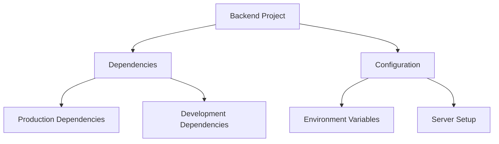
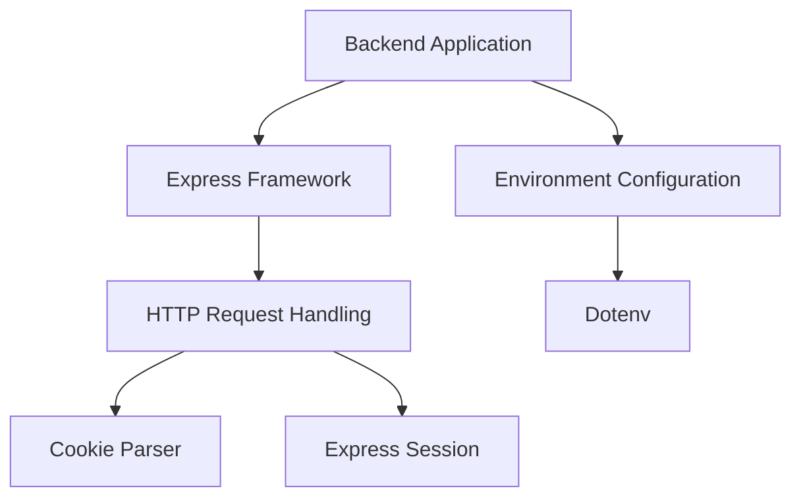
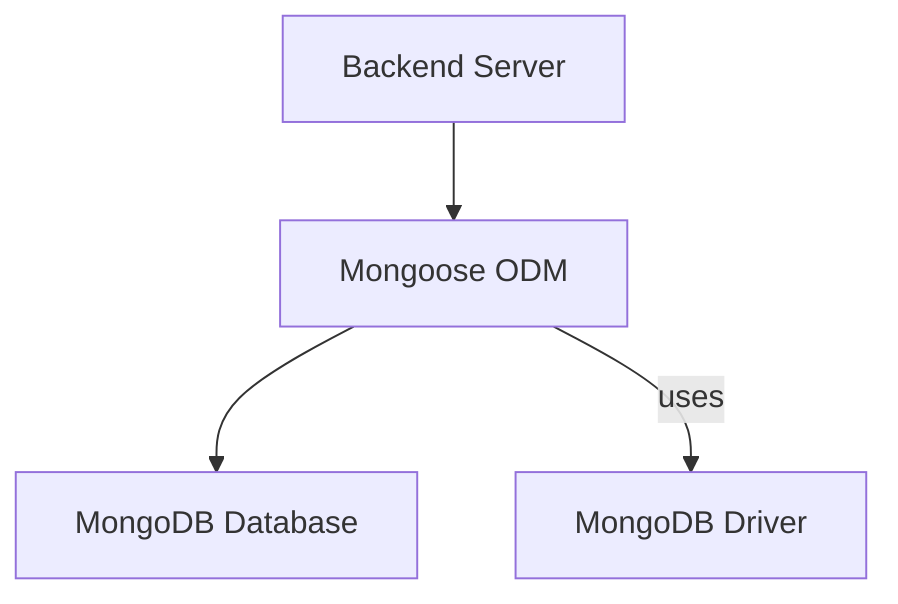
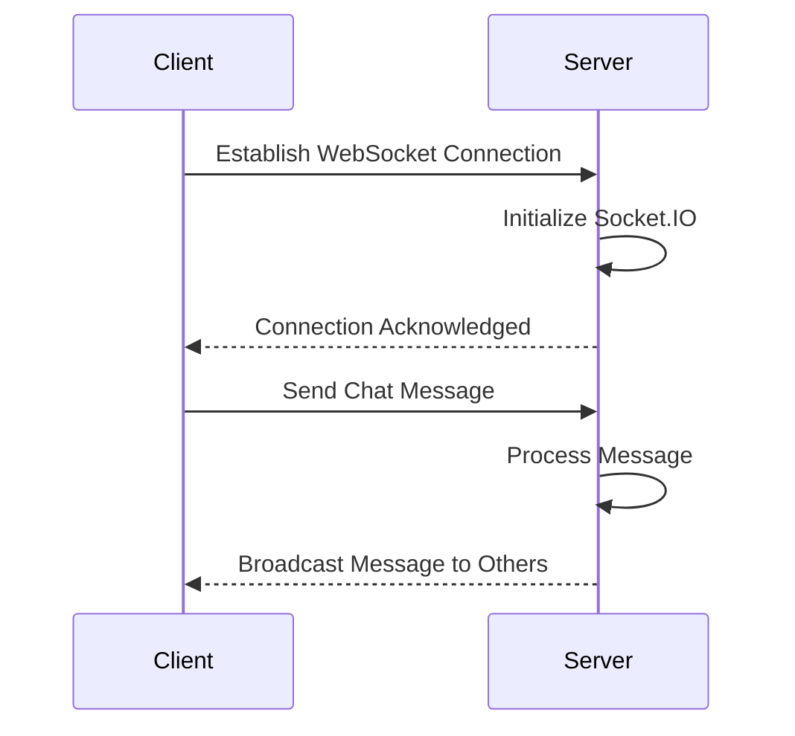
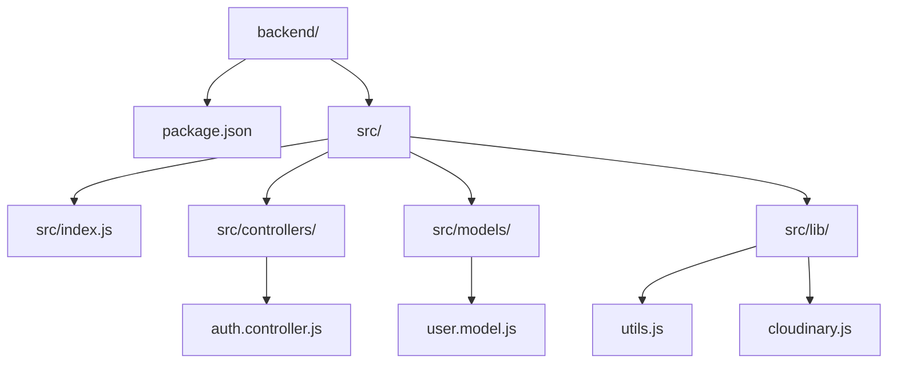
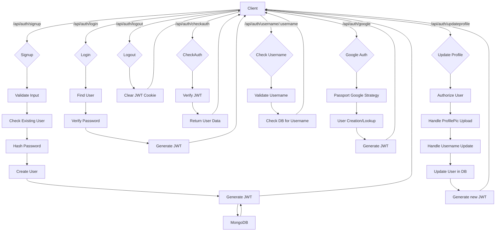
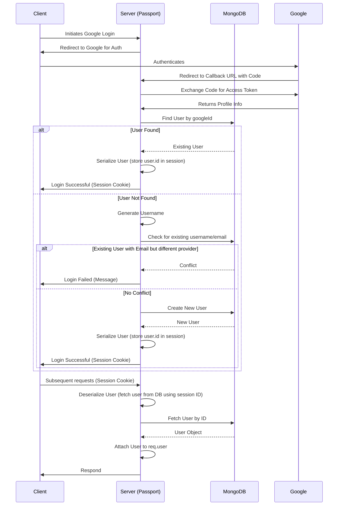

<!-- 1_overview.mdx -->
# Overview
[TOC]

This documentation provides a comprehensive guide to the MERN Chatapp, a real-time chat application built using the MERN (MongoDB, Express.js, React, Node.js) stack. It covers the architecture, setup, and key components of both the frontend and backend, offering insights into how the application is structured and how different parts interact.

The project is inspired by the tutorial available at [https://youtu.be/ntKkVrQqBYY?si=qz02jMCQ80RT1jaH](https://youtu.be/ntKkVrQqBYH?si=qz02jMCQ80RT1jaH).

## Project Goals

The primary goal of this project is to demonstrate a functional chat application leveraging the full MERN stack. This includes:
*   Real-time communication using WebSockets.
*   User authentication and authorization.
*   Persistent storage of chat messages and user data.
*   A responsive and intuitive user interface.

## System Architecture Overview

The MERN Chatapp follows a client-server architecture, where the React frontend communicates with the Express.js and Node.js backend. The backend, in turn, interacts with a MongoDB database for data persistence. Real-time features are typically handled via WebSockets (e.g., Socket.IO).

```mermaid
graph TD
    A[Client (React Frontend)] -->|HTTP/WebSockets| B(Server (Node.js/Express))
    B -->|MongoDB Driver| C[Database (MongoDB)]
    C --> B
    B --> A
    %% Corrected syntax: Added labels and clearer flow
```

---FILEBREAK---
<!-- 2_backendarchitecture.mdx -->
# Backend Architecture
[TOC]

The backend of the MERN Chatapp is built with Node.js and Express.js, providing a robust API for handling user authentication, chat message management, and real-time communication.

## Core Technologies

*   **Node.js**: JavaScript runtime environment.
*   **Express.js**: Web application framework for Node.js.
*   **MongoDB**: NoSQL database for storing user and chat data.
*   **Mongoose**: ODM (Object Data Modeling) library for MongoDB and Node.js.
*   **Socket.IO**: (Inferred) Library for real-time, bidirectional, event-based communication.

## Backend Structure

The backend typically organizes its code into several key directories, such as `controllers`, `models`, `routes`, and `middleware`, each serving a specific purpose.

```mermaid
graph TD
    A[Server Entry Point (e.g., server.js/app.js)] --> B(Routes)
    B --> C(Controllers)
    C --> D[Models (Mongoose)]
    D --> E[MongoDB Database]
    A --> F(Middleware)
    F --> B
    %% Corrected syntax: Added clear connections and entry point
```

## Key Backend Components

### API Routes

API routes define the endpoints through which the frontend interacts with the backend. Common routes include:
*   User authentication (login, signup).
*   Fetching user profiles.
*   Sending and retrieving messages.
*   Managing chat rooms/conversations.

### Controllers

Controllers contain the business logic for handling requests received by the routes. They interact with the models to perform database operations and prepare responses for the client.

### Models

Models define the schema for the data stored in MongoDB using Mongoose. They ensure data consistency and provide an interface for interacting with the database. Examples include `User` and `Message` models.

### Middleware

Middleware functions are executed before routes are processed. They are used for tasks like authentication, logging, and error handling. For instance, an authentication middleware might verify a user's JWT token before allowing access to protected routes.

---FILEBREAK---
<!-- 3_frontendarchitecture.mdx -->
# Frontend Architecture
[TOC]

The frontend of the MERN Chatapp is developed using React, providing a dynamic and interactive user interface for chat interactions.

## Core Technologies

*   **React**: A JavaScript library for building user interfaces.
*   **React Router**: (Inferred) For handling client-side routing.
*   **Axios / Fetch API**: (Inferred) For making HTTP requests to the backend.
*   **Socket.IO Client**: (Inferred) For establishing real-time communication with the backend.

## Frontend Structure

A typical React application is structured into components, pages, services, and utilities.

```mermaid
graph TD
    A[App Component] --> B(Pages/Views)
    B --> C(UI Components)
    B --> D(Services/API Calls)
    D --> E[Backend API]
    A --> F(Routing)
    F --> B
    C --> G[State Management (e.g., Context API/Redux)]
    G --> A
    %% Corrected syntax: Improved flow and added state management
```

## Key Frontend Components

### Pages/Views

These are top-level components that represent different screens or views of the application, such as:
*   **LoginPage**: Handles user login.
*   **SignupPage**: Handles new user registration.
*   **ChatPage**: The main interface for displaying chats and sending messages.

### UI Components

These are reusable, smaller components that form the building blocks of the UI. Examples include:
*   `InputField`
*   `MessageBubble`
*   `UserCard`
*   `ChatList`

### State Management

React applications often use state management solutions (like React Context API, Redux, or Zustand) to manage global application state, such as logged-in user information, active chat, and message history.

### API Services

These modules are responsible for interacting with the backend API, abstracting away the details of HTTP requests. They use libraries like Axios or the native Fetch API.

### Real-time Communication

The frontend utilizes a Socket.IO client to establish a WebSocket connection with the backend, enabling instant message delivery and other real-time features.

---FILEBREAK---
<!-- 4_setupandrun.mdx -->
# Setup and Running the Application
[TOC]

This section provides instructions on how to set up and run the MERN Chatapp locally.

## Prerequisites

Before you begin, ensure you have the following installed on your system:

*   **Node.js**: [https://nodejs.org/](https://nodejs.org/) (LTS version recommended)
*   **npm** or **yarn**: (Usually comes with Node.js)
*   **MongoDB**: [https://www.mongodb.com/try/download/community](https://www.mongodb.com/try/download/community) (MongoDB Community Server) or access to a cloud-hosted MongoDB instance (e.g., MongoDB Atlas).
*   **Git**: [https://git-scm.com/](https://git-scm.com/)

## Project Structure (Inferred)

A typical MERN project often has a root directory containing separate folders for the client (frontend) and server (backend).

```mermaid
graph TD
    A[Project Root] --> B[client/]
    A --> C[server/]
    B --> D[src/]
    B --> E[public/]
    B --> F[package.json (client)]
    C --> G[index.js/server.js]
    C --> H[models/]
    C --> I[routes/]
    C --> J[controllers/]
    C --> K[package.json (server)]
    K --> L[node_modules (server)]
    F --> M[node_modules (client)]
    %% Corrected syntax: Simplified nodes and clarified dependencies
```

## Step-by-Step Setup

### 1. Clone the Repository

First, clone the project repository from GitHub to your local machine:

```bash
git clone https://github.com/shinymack/Chat-App-MERN.git
cd Chat-App-MERN
```

### 2. Backend Setup

Navigate into the `server` directory (or wherever your backend code resides) and install dependencies.

```bash
cd server
npm install # or yarn install
```

#### Environment Variables

Create a `.env` file in the `server` directory and configure the following:

```
PORT=5000
MONGO_URI=your_mongodb_connection_string
JWT_SECRET=your_jwt_secret_key
```

*   `MONGO_URI`: Your MongoDB connection string (e.g., `mongodb://localhost:27017/chatapp` or your MongoDB Atlas connection string).
*   `JWT_SECRET`: A strong, random string used for signing JWT tokens.

#### Start the Backend Server

```bash
npm start # or yarn start
```

The backend server should now be running, typically on `http://localhost:5000`.

### 3. Frontend Setup

Open a new terminal, navigate back to the project root, and then into the `client` directory (or wherever your frontend code resides). Install dependencies.

```bash
cd ../client # or cd path/to/client
npm install # or yarn install
```

#### Environment Variables

Create a `.env` file in the `client` directory and configure any necessary environment variables, such as the backend API URL:

```
REACT_APP_API_BASE_URL=http://localhost:5000/api
REACT_APP_SOCKET_URL=http://localhost:5000
```

*   `REACT_APP_API_BASE_URL`: The base URL for your backend API.
*   `REACT_APP_SOCKET_URL`: The URL for your Socket.IO server.

#### Start the Frontend Development Server

```bash
npm start # or yarn start
```

The React development server should now open in your browser, typically at `http://localhost:3000`.

## Troubleshooting

*   **Port Conflicts**: If either the frontend or backend fails to start due to port conflicts, adjust the `PORT` variable in the `.env` file for the backend, or allow the React app to run on a different port when prompted.
*   **MongoDB Connection**: Ensure your MongoDB instance is running and your `MONGO_URI` is correct.
*   **Dependencies**: Double-check that all dependencies were installed correctly in both `client` and `server` directories.

---

<!-- 1_overview.mdx -->
# Overview
[TOC]

This documentation provides a comprehensive overview of the `backend` project, outlining its structure, dependencies, and key components. The project serves as the backend for a chat application, built using the MERN (MongoDB, Express, React, Node.js) stack. This document focuses on the backend's core functionalities, third-party integrations, and development environment setup.

## Project Structure
The `backend` directory contains the server-side logic and configuration. The `package-lock.json` file, analyzed here, details all the npm dependencies required for the project, both for production and development.



## Key Technologies and Dependencies

The `backend` leverages a range of Node.js packages to provide its functionality. These include:
- **Express.js**: For building the web server and handling API routes.
- **Mongoose**: An ODM (Object Data Modeling) library for MongoDB, used to interact with the database.
- **Socket.IO**: For real-time, bidirectional event-based communication, crucial for chat features.
- **Authentication Libraries**: `bcryptjs` for password hashing, `jsonwebtoken` for JWT creation and verification, `passport` and `passport-google-oauth20` for authentication strategies.
- **Cloudinary**: For cloud-based image and video management.
- **Dotenv**: For loading environment variables from a `.env` file.
- **Cookie-Parser** and **Express-Session**: For handling session management and cookies.

For development, `nodemon` is used to automatically restart the server upon file changes.

## Development Setup

To get started with the backend, ensure you have Node.js and npm installed. After cloning the repository, navigate to the `backend` directory and install the dependencies using npm.

### Installation Steps
1. Navigate to the `backend` directory:
   ```bash
   cd backend
   ```
2. Install dependencies:
   ```bash
   npm install
   ```
   This command reads the `package-lock.json` file and installs all specified packages.

### Running the Server
The `nodemon` development dependency suggests that the server can be run with live-reloading during development. A typical `start` script for development would be defined in `package.json` as:
```json
"scripts": {
  "start": "nodemon index.js"
}
```
(Assuming `index.js` is the main entry point.)

---FILEBREAK---
<!-- 2_backenddependencies.mdx -->
# Backend Dependencies
[TOC]

This section details the core dependencies used in the `backend` project, as specified in the `package-lock.json` file. These dependencies are crucial for the server's functionality, including web server setup, database interaction, authentication, real-time communication, and media management.

## 2.1 Production Dependencies

These packages are essential for the application's runtime functionality.

### 2.1.1 Web Server and Core Utilities
- **Express**: `express@^4.21.2` ([express](https://github.com/shinymack/Chat-App-MERN/backend/node_modules/express))
  - A fast, unopinionated, minimalist web framework for Node.js. It handles routing, middleware, and other HTTP utilities.
- **Cookie Parser**: `cookie-parser@^1.4.7` ([cookie-parser](https://github.com/shinymack/Chat-App-MERN/backend/node_modules/cookie-parser))
  - Parses cookies attached to the client request object, making them accessible via `req.cookies`.
- **Express Session**: `express-session@^1.18.1` ([express-session](https://github.com/shinymack/Chat-App-MERN/backend/node_modules/express-session))
  - Middleware for managing user sessions, essential for maintaining state across requests.
- **Dotenv**: `dotenv@^16.4.7` ([dotenv](https://github.com/shinymack/Chat-App-MERN/backend/node_modules/dotenv))
  - Loads environment variables from a `.env` file into `process.env`.


<!-- Corrected syntax -->

### 2.1.2 Database Management
- **Mongoose**: `mongoose@^8.9.5` ([mongoose](https://github.com/shinymack/Chat-App-MERN/backend/node_modules/mongoose))
  - An elegant MongoDB object modeling tool for Node.js. It provides a straightforward, schema-based solution to model your application data.
- **MongoDB Driver (Internal)**: The `mongoose` package internally depends on the `mongodb` package (`mongodb@6.17.0`). This driver handles the direct communication with the MongoDB database.



### 2.1.3 Authentication and Security
- **Bcryptjs**: `bcryptjs@^2.4.3` ([bcryptjs](https://github.com/shinymack/Chat-App-MERN/backend/node_modules/bcryptjs))
  - A library to hash passwords, enhancing security by storing hashed passwords instead of plaintext.
- **JSON Web Token**: `jsonwebtoken@^9.0.2` ([jsonwebtoken](https://github.com/shinymack/Chat-App-MERN/backend/node_modules/jsonwebtoken))
  - Used for generating and verifying JSON Web Tokens (JWTs) for stateless authentication.
- **Passport**: `passport@^0.7.0` ([passport](https://github.com/shinymack/Chat-App-MERN/backend/node_modules/passport))
  - Simple, unobtrusive authentication middleware for Node.js.
- **Passport Google OAuth 2.0**: `passport-google-oauth20@^2.0.0` ([passport-google-oauth20](https://github.com/shinymack/Chat-App-MERN/backend/node_modules/passport-google-oauth20))
  - A Passport strategy for authenticating with Google using the OAuth 2.0 API.

```mermaid
graph TD
    A[User Request] --> B{Authentication Middleware}
    B --|Login/Register| C[Bcryptjs (Hashing)]
    B --|Authenticated| D[JSON Web Token (JWT)]
    B --|Social Login| E[Passport]
    E --> E1[Passport-Google-OAuth20]
```

### 2.1.4 Real-time Communication
- **Socket.IO**: `socket.io@^4.8.1` ([socket.io](https://github.com/shinymack/Chat-App-MERN/backend/node_modules/socket.io))
  - Enables real-time, bidirectional, and event-based communication between the browser and the server. Essential for chat functionalities.
  - Internally depends on `engine.io` for low-level transport.



### 2.1.5 Media Management
- **Cloudinary**: `cloudinary@^2.5.1` ([cloudinary](https://github.com/shinymack/Chat-App-MERN/backend/node_modules/cloudinary))
  - Provides a powerful API for image and video management, including uploading, manipulation, and delivery.

```mermaid
graph TD
    A[Backend Server] --> B[Upload Media]
    B --> C[Cloudinary API]
    C --> D[Cloudinary Storage]
    D --|Retrieve Media| A
```

## 2.2 Development Dependencies
These packages are used during the development process and are not required for the production build.

- **Nodemon**: `nodemon@^3.1.9` ([nodemon](https://github.com/shinymack/Chat-App-MERN/backend/node_modules/nodemon))
  - A utility that monitors for any changes in your source and automatically restarts your server. Perfect for development.

```mermaid
graph LR
    Dev[Developer] --|Saves Code| FileSystem[File System]
    FileSystem --> Nodemon[Nodemon Watcher]
    Nodemon --> Server[Node.js Server]
    Server --|Restarts| Server
```

---

<!-- 1_overview.mdx -->
# Overview
[TOC]

This documentation provides a comprehensive overview of the backend services for the Chat App, focusing on its architecture, dependencies, and core functionalities. The backend is built using Node.js with Express, leveraging MongoDB for data persistence and Socket.IO for real-time communication. This section introduces the overall structure and the purpose of the application's server-side components.

## Project Structure
The backend is organized into a modular structure, separating concerns such as controllers, models, and utility functions.


*   `backend/package.json`: Defines project metadata, scripts, and dependencies.
*   `backend/src/`: Contains the main application source code.
*   `backend/src/index.js`: The entry point of the application.
*   `backend/src/controllers/`: Houses the logic for handling API requests.
*   `backend/src/models/`: Defines the Mongoose schemas and models.
*   `backend/src/lib/`: Contains utility functions and configurations.

## Key Technologies
The backend utilizes a stack of robust technologies to deliver its features.

*   **Node.js**: Asynchronous event-driven JavaScript runtime.
*   **Express**: Fast, unopinionated, minimalist web framework for Node.js.
*   **MongoDB**: NoSQL database for flexible data storage, accessed via Mongoose.
*   **Socket.IO**: Library for real-time, bidirectional, event-based communication.
*   **bcryptjs**: Library for hashing passwords.
*   **jsonwebtoken**: For creating and verifying JSON Web Tokens (JWTs) for authentication.
*   **cloudinary**: For cloud-based image and video management (e.g., profile pictures).
*   **passport-google-oauth20**: For Google OAuth 2.0 authentication.

### Dependencies
The primary dependencies listed in [backend/package.json](https://github.com/shinymack/Chat-App-MERN/backend/package.json) include:
*   `bcryptjs`: ^2.4.3
*   `cloudinary`: ^2.5.1
*   `cookie-parser`: ^1.4.7
*   `dotenv`: ^16.4.7
*   `express`: ^4.21.2
*   `express-session`: ^1.18.1
*   `jsonwebtoken`: ^9.0.2
*   `mongoose`: ^8.9.5
*   `passport`: ^0.7.0
*   `passport-google-oauth20`: ^2.0.0
*   `socket.io`: ^4.8.1

### Development Dependencies
*   `nodemon`: ^3.1.9 (for automatic server restarts during development)

## Backend Architecture Overview
The backend follows a typical MVC (Model-View-Controller) pattern, although `View` is minimal as it's an API-driven service.

```mermaid
graph TD
    A[Client Request] --> B{Router}
    B --> C[Controller]
    C --> D[Service/Utility Layer]
    C --> E[Model]
    E --> F[Database (MongoDB)]
    D --> F
    F --> E
    E --> C
    C --> B
    B --> G[Client Response]

    %% Corrected syntax: Changed 'API Gateway' to 'Router' for clarity in a simple Express app.
```
*   **Router**: Maps incoming requests to appropriate controller functions.
*   **Controller**: Contains the business logic, interacts with models and services, and prepares the response.
*   **Model**: Defines the schema for data stored in MongoDB and provides an interface for database operations.
*   **Service/Utility Layer**: Contains helper functions, external API integrations (like Cloudinary), and shared logic.
*   **Database (MongoDB)**: Persists application data.

---FILEBREAK---
<!-- 2_backendarchitecture.mdx -->
# Backend Architecture
[TOC]

The backend for the Chat App is designed to be robust and scalable, handling user authentication, profile management, and preparing the groundwork for real-time messaging. This section delves into the detailed architecture of the backend, including its core components and their interactions.

## 2.1 Core Backend Components

### 2.1.1 `package.json`
The [backend/package.json](https://github.com/shinymack/Chat-App-MERN/backend/package.json) file defines the project's metadata and manages its dependencies. It plays a crucial role in setting up the development and production environments.

```json
{
  "name": "backend",
  "version": "1.0.0",
  "main": "src/index.js",
  "scripts": {
    "dev": "nodemon src/index.js",
    "start": "node src/index.js"
  },
  "author": "",
  "type": "module",
  "license": "ISC",
  "description": "",
  "dependencies": {
    "bcryptjs": "^2.4.3",
    "cloudinary": "^2.5.1",
    "cookie-parser": "^1.4.7",
    "dotenv": "^16.4.7",
    "express": "^4.21.2",
    "express-session": "^1.18.1",
    "jsonwebtoken": "^9.0.2",
    "mongoose": "^8.9.5",
    "passport": "^0.7.0",
    "passport-google-oauth20": "^2.0.0",
    "socket.io": "^4.8.1"
  },
  "devDependencies": {
    "nodemon": "^3.1.9"
  }
}
```

#### Scripts
*   `dev`: `nodemon src/index.js` - Starts the server in development mode using `nodemon` for automatic restarts on file changes.
*   `start`: `node src/index.js` - Starts the server in production mode.

#### Dependencies Explained
*   **`bcryptjs`**: Used for hashing user passwords securely.
*   **`cloudinary`**: Integration for managing and uploading user profile pictures.
*   **`cookie-parser`**: Middleware to parse cookies attached to the client request object.
*   **`dotenv`**: Loads environment variables from a `.env` file into `process.env`.
*   **`express`**: The core web framework for handling routes and middleware.
*   **`express-session`**: Middleware for managing user sessions (especially for OAuth flows).
*   **`jsonwebtoken`**: Implements JWTs for stateless authentication.
*   **`mongoose`**: ODM (Object Data Modeling) library for MongoDB and Node.js.
*   **`passport`**, **`passport-google-oauth20`**: Authentication middleware for Node.js, specifically for Google OAuth 2.0.
*   **`socket.io`**: Enables real-time, bidirectional communication between web clients and the server.

### 2.1.2 Authentication Controller
The [backend/src/controllers/auth.controller.js](https://github.com/shinymack/Chat-App-MERN/backend/src/controllers/auth.controller.js) file is responsible for managing all user authentication and authorization related functionalities. It handles user registration, login, logout, session checking, and profile updates.



---FILEBREAK---
<!-- 2.1.2_authentication.mdx -->
# Backend Architecture: Authentication
[TOC]

This section details the authentication mechanisms implemented in the Chat App backend, specifically focusing on the [backend/src/controllers/auth.controller.js](https://github.com/shinymack/Chat-App-MERN/backend/src/controllers/auth.controller.js) file. It covers traditional email/password authentication as well as Google OAuth integration and user profile management.

## 2.1.2.1 User Signup (`signup`)
The `signup` function handles the registration of new users.

### Process Flow
1.  **Input Validation**: Checks if `username`, `email`, and `password` are provided and meet length requirements (username 3-20 chars, password >= 6 chars).
2.  **Existing User Check**: Queries the database to ensure the `email` and `username` are not already registered.
3.  **Password Hashing**: If unique, the password is hashed using `bcryptjs` with a salt generated by `genSalt(10)`.
4.  **User Creation**: A new `User` instance is created with the provided details and `authProvider: 'email'`.
5.  **Token Generation**: A JSON Web Token (JWT) is generated for the new user using `generateToken` and set as an HTTP-only cookie.
6.  **User Save**: The new user record is saved to the MongoDB database.
7.  **Response**: Returns the new user's `_id`, `username`, `email`, `profilePic`, and `authProvider`.

```javascript
// backend/src/controllers/auth.controller.js
export const signup = async (req, res) => {
    const {username, email, password} = req.body;
    try {
        if(!username || !email || !password) {
            return res.status(400).json({message: "Please fill in all fields."});
        }
        // ... (length validations)
        const user = await User.findOne({email});
        if (user) return res.status(400).json({message: "Email already exists."});
        
        const existingUserByUsername = await User.findOne({ username });
        if (existingUserByUsername) {
            return res.status(400).json({ message: "Username already exists. Please choose another." });
        }

        const salt = await bcrypt.genSalt(10);
        const hashedPassword = await bcrypt.hash(password, salt);

        const newUser = new User({
            username,
            email,
            password: hashedPassword,
            authProvider: 'email'
        });
        if(newUser){
            generateToken(newUser._id, res); // [lib/utils.js](https://github.com/shinymack/Chat-App-MERN/backend/src/lib/utils.js)
            await newUser.save();

            res.status(201).json({
                _id: newUser._id,
                username: newUser.username,
                email: newUser.email,   
                profilePic: newUser.profilePic,
                authProvider: newUser.authProvider
            });
        } else {
            res.status(400).json({message: "Invalid user data."});
        }
    } catch (error) {
        console.log("Error in signup controller", error.message)
        res.status(500).json({message: "Something went wrong."});
    }
};
```

## 2.1.2.2 User Login (`login`)
The `login` function authenticates existing users.

### Process Flow
1.  **Input**: Receives `email` and `password`.
2.  **Find User**: Queries the database for a user with the provided `email`.
3.  **Credential Check**:
    *   If no user is found, returns an error.
    *   If the user signed up via Google and has no password, prompts them to use Google login.
4.  **Password Verification**: Compares the provided password with the stored hashed password using `bcrypt.compare`.
5.  **Token Generation**: If credentials are correct, a new JWT is generated and set as an HTTP-only cookie.
6.  **Response**: Returns the authenticated user's details.

```javascript
// backend/src/controllers/auth.controller.js
export const login = async (req, res) => {
    const {email, password} = req.body;
    try {
        const user = await User.findOne({email});

        if(!user) {
            return res.status(400).json({message: "Invalid credentials."});
        }

        if(user.authProvider === 'google' && !user.password){
            return res.status(400).json({ message: "Please sign in with Google." });
        }

        const isPasswordCorrect = await bcrypt.compare(password, user.password);
        if(!isPasswordCorrect) {
            return res.status(400).json({message: "Invalid credentials."});
        }

        generateToken(user._id, res); // [lib/utils.js](https://github.com/shinymack/Chat-App-MERN/backend/src/lib/utils.js)
        res.status(200).json({
            _id: user._id,
            username: user.username,
            email: user.email,
            profilePic: user.profilePic,
            authProvider: user.authProvider,
        });
    } catch (error) {
        console.log("Error in login controller", error.message);
        res.status(500).json({message: "Something went wrong."});
    }
};
```

## 2.1.2.3 User Logout (`logout`)
The `logout` function clears the user's session.

### Process Flow
1.  **Clear Cookie**: Sets the "jwt" cookie to an empty string with `maxAge: 0`, effectively expiring it.
2.  **Response**: Confirms successful logout.

```javascript
// backend/src/controllers/auth.controller.js
export const logout = (req, res) => {
    try {
        res.cookie("jwt", "", {maxAge: 0});
        res.status(200).json({message: "Logged out successfully."})
    } catch(error) {
        console.log("Error in logout controller", error.message);
        res.status(500).json({message:"Internal Server Error"}); 
    }
};
```

## 2.1.2.4 Check Authentication Status (`checkAuth`)
The `checkAuth` function verifies if a user is currently authenticated. This is typically used to re-fetch user data on page load if a valid JWT cookie exists.

### Process Flow
1.  **Retrieve User**: Assumes `req.user` is populated by a prior authentication middleware (e.g., JWT verification).
2.  **Response**: Returns the authenticated user's details.

```javascript
// backend/src/controllers/auth.controller.js
export const checkAuth = (req, res) => {
    try {
        res.status(200).json({
            _id: req.user._id,
            username: req.user.username,
            email: req.user.email,
            profilePic: req.user.profilePic,
            authProvider: req.user.authProvider,
            createdAt: req.user.createdAt
        });
    } catch (error) {
        console.log("Error in checkAuth controller", error.message);
        res.status(500).json({message: "Internal Server Error"});
    }
};
```

## 2.1.2.5 Google Authentication Callback (`googleAuthCallback`)
This function handles the callback after a user authenticates via Google OAuth.

### Process Flow
1.  **User Check**: Verifies if `req.user` is populated by Passport.js (indicating successful Google authentication).
2.  **Token Generation**: If successful, a JWT is generated for the user and set as an HTTP-only cookie.
3.  **Redirect**: Redirects the user back to the frontend application.

```javascript
// backend/src/controllers/auth.controller.js
export const googleAuthCallback = async (req, res) => {
    const frontendUrl = process.env.FRONTEND_URL || 'http://localhost:5173';

    try {
        if (!req.user) {
            return res.redirect(`${frontendUrl}/login?error=google_auth_failed`);
        }

        generateToken(req.user._id, res); // [lib/utils.js](https://github.com/shinymack/Chat-App-MERN/backend/src/lib/utils.js)

        res.redirect(frontendUrl);

    } catch (error) {
        console.error("Error in googleAuthCallback: ", error.message);
        res.redirect(`${frontendUrl}/login?error=google_auth_processing_error`);
    }
};
```

## 2.1.2.6 Check Username Availability (`checkUsernameAvailability`)
This function allows clients to check if a desired username is available.

### Process Flow
1.  **Input Validation**: Validates the `username` parameter for length (3-20 characters).
2.  **Current User Check**: If the provided username is the same as the authenticated user's current username, it's considered available.
3.  **Database Check**: Queries the database to see if any other user already has the requested username.
4.  **Response**: Returns `available: true` or `false` along with a message.

```javascript
// backend/src/controllers/auth.controller.js
export const checkUsernameAvailability = async (req, res) => {
    try {
        const { username } = req.params;
        const currentUserId = req.user._id; 

        if (!username || username.trim().length < 3) {
            return res.status(400).json({ available: false, message: "Username must be at least 3 characters." });
        }
        if (username.trim().length > 20) {
            return res.status(400).json({ available: false, message: "Username cannot be more than 20 characters." });
        }
    
        if (req.user.username === username) {
            return res.status(200).json({ available: true, message: "This is your current username." });
        }

        const existingUser = await User.findOne({ username: username });

        if (existingUser) {
            return res.status(200).json({ available: false, message: "Username is already taken." });
        }

        res.status(200).json({ available: true, message: "Username is available." });

    } catch (error) {
        console.error("Error in checkUsernameAvailability:", error.message);
        res.status(500).json({ available: false, message: "Error checking username availability." });
    }
};
```

## 2.1.2.7 Update User Profile (`updateProfile`)
This function allows authenticated users to update their profile information, specifically their profile picture and username.

### Process Flow
1.  **Authorize User**: Ensures the request is from an authenticated user.
2.  **Fetch User**: Retrieves the current user's data from the database.
3.  **Handle Username Update**:
    *   If a new `username` is provided and it's different from the current one.
    *   Validates the new username (length, uniqueness).
    *   Updates the `username` field.
4.  **Handle Profile Picture Update**:
    *   If `profilePic` (expected as a base64 string) is provided.
    *   Uploads the image to Cloudinary using `cloudinary.uploader.upload`.
    *   Updates the `profilePic` field with the secure URL from Cloudinary.
5.  **Database Update**: Updates the user document in MongoDB using `findByIdAndUpdate`.
6.  **New Token Generation**: Generates a new JWT to ensure the cookie reflects any updated user information (like username) if it's encoded in the token.
7.  **Response**: Returns the updated user object.

```javascript
// backend/src/controllers/auth.controller.js
export const updateProfile = async (req, res) => {
    try {
        const { profilePic, username } = req.body;
        const userId = req.user._id;
        let userToUpdate = await User.findById(userId);

        if (!userToUpdate) {
            return res.status(404).json({ message: "User not found." });
        }

        const fieldsToUpdate = {};
        let newUsername = username ? username.trim() : null;
        let usernameChanged = false;

        if (newUsername && newUsername !== userToUpdate.username) {
            if (newUsername.length < 3 || newUsername.length > 20) {
                return res.status(400).json({ message: "Username must be between 3 and 20 characters." });
            }
            const existingUserWithNewUsername = await User.findOne({ username: newUsername, _id: { $ne: userId } });
            if (existingUserWithNewUsername) {
                return res.status(400).json({ message: "This username is already taken by someone else." });
            }
            fieldsToUpdate.username = newUsername;
            usernameChanged = true;
        }

        if (profilePic) {
            const uploadResponse = await cloudinary.uploader.upload(profilePic); // [lib/cloudinary.js](https://github.com/shinymack/Chat-App-MERN/backend/src/lib/cloudinary.js)
            fieldsToUpdate.profilePic = uploadResponse.secure_url;
        }

        if (Object.keys(fieldsToUpdate).length === 0) {
            return res.status(400).json({ message: "No changes provided to update." });
        }

        const updatedUser = await User.findByIdAndUpdate(userId, { $set: fieldsToUpdate }, { new: true });

        if (!updatedUser) {
            return res.status(404).json({ message: "Failed to update user."});
        }

        generateToken(updatedUser._id, res); // [lib/utils.js](https://github.com/shinymack/Chat-App-MERN/backend/src/lib/utils.js)

        res.status(200).json(updatedUser);

    } catch (error) {
        console.error("Error in updateProfile controller", error.message);
        if (error.code === 11000 && error.keyValue && error.keyValue.username) {
            return res.status(400).json({ message: "This username is already taken." });
        }
        res.status(500).json({ message: "Internal Server Error while updating profile." });
    }
};
```
---FILEBREAK---

---

<!-- 1_introduction.mdx -->
# 1. Introduction
[TOC]

This documentation provides a comprehensive overview of the backend services for a MERN (MongoDB, Express.js, React, Node.js) Chat Application. It details the architecture, core functionalities, and key components involved in handling user authentication, messaging, and friend management.

The backend is built with Node.js and Express.js, using MongoDB for data storage and leveraging various libraries for features like authentication (Passport.js), file uploads (Cloudinary), and real-time communication (Socket.io).

## 1.1 Project Structure
The backend is organized into several key directories:
- `controllers`: Contains the logic for handling API requests.
- `models`: Defines the Mongoose schemas for MongoDB documents.
- `routes`: Configures API endpoints and links them to controller functions.
- `lib`: Houses utility functions and configurations (database, Cloudinary, Passport, Socket.io).
- `middlewares`: (Not present in provided files, but typical for auth checks, etc.)

```mermaid
graph TD
    A[Root Directory] --> B[backend/]
    B --> C[src/]
    C --> D[controllers/]
    C --> E[lib/]
    C --> F[models/]
    C --> G[routes/]
    D --> D1[friend.controller.js]
    D --> D2[message.controller.js]
    E --> E1[cloudinary.js]
    E --> E2[db.js]
    E --> E3[passport.config.js]
    F --> F1[user.model.js] %% Inferred
    F --> F2[message.model.js]
    G --> G1[auth.route.js] %% Inferred
    G --> G2[friend.route.js]
    G --> G3[message.route.js]
    C --> C1[index.js]
```

## 1.2 Technologies Used
- **Node.js**: JavaScript runtime environment.
- **Express.js**: Web application framework for Node.js.
- **MongoDB**: NoSQL database.
- **Mongoose**: ODM (Object Data Modeling) library for MongoDB and Node.js.
- **Socket.io**: Library for real-time, bidirectional, event-based communication.
- **Passport.js**: Authentication middleware for Node.js.
- **Cloudinary**: Cloud-based image and video management.
- **Cors**: Middleware for enabling Cross-Origin Resource Sharing.
- **Cookie-parser**: Middleware for parsing cookies.
- **Express-session**: Middleware for managing user sessions.
- **Dotenv**: Module to load environment variables from a `.env` file.

## 1.3 Key Features
- User Authentication (Local and Google OAuth)
- Real-time Messaging
- Friend Request Management (Send, Accept, Reject, Remove)
- Image Uploads for Messages
- User Profile Management (Implicit through authentication)
- Production-ready deployment configuration

---FILEBREAK---
<!-- 2_backendarchitecture.mdx -->
# 2. Backend Architecture
[TOC]

The backend for this chat application is built using a typical MERN stack architecture, focusing on a RESTful API with added real-time capabilities via WebSockets (Socket.io).

## 2.1 Server Entry Point and Configuration
The application starts from [`backend/src/index.js`](https://github.com/shinymack/Chat-App-MERN/backend/src/index.js), which sets up the Express.js server, connects to the database, configures middleware, and defines API routes.

### 2.1.1 Main Server Setup
The `index.js` file handles:
- **Environment Variables**: Loading `.env` file using `dotenv`.
- **Database Connection**: Initiating MongoDB connection via [`connectDB`](https://github.com/shinymack/Chat-App-MERN/backend/src/lib/db.js).
- **Middleware**:
    - `cookieParser`: For parsing request cookies.
    - `express.json` and `express.urlencoded`: For parsing JSON and URL-encoded request bodies, with a 2MB limit for handling potential image uploads.
    - `cors`: Configured to allow requests from `http://localhost:5173` with credentials.
    - `express-session`: For managing user sessions, with secure cookies in production.
    - `passport.initialize()` and `passport.session()`: Essential for Passport.js authentication.
- **Route Definitions**: Mounting API routes for authentication, messages, and friends.
- **Production Static File Serving**: Serving frontend static assets when `NODE_ENV` is "production".
- **Server Listening**: Starting the server on the configured PORT, integrating with `socket.io`'s server.

```mermaid
graph TD
    A[Client Request] --> B[Express Server (index.js)]
    B --> C{Middleware Stack}
    C --> C1[Cookie Parser]
    C --> C2[Body Parsers (JSON, URL-encoded)]
    C --> C3[CORS]
    C --> C4[Session Management]
    C --> C5[Passport Initialization]
    C --> D{API Routes}
    D --> D1[/api/auth]
    D --> D2[/api/messages]
    D --> D3[/api/friends]
    B --> E[Socket.io Server]
    E --> F[Real-time Events]
    D --> G[Controllers]
    G --> H[Models]
    H --> I[MongoDB (db.js)]
    subgraph Initialization
        J[dotenv.config()] --> B
        K[configurePassport()] --> B
        L[connectDB()] --> B
    end
```

## 2.2 Database Layer
The application uses MongoDB as its database, with Mongoose as the ODM.

### 2.2.1 MongoDB Connection
The [`connectDB`](https://github.com/shinymack/Chat-App-MERN/backend/src/lib/db.js) function establishes a connection to MongoDB using the `MONGODB_URI` environment variable.

```mermaid
graph TD
    A[index.js] --> B[connectDB()]
    B --> C{Mongoose.connect(MONGODB_URI)}
    C -- On Success --> D[MongoDB connected]
    C -- On Error --> E[Log Connection Error]
```

### 2.2.2 Mongoose Models
While specific model files are not provided, the controllers imply the existence of at least `User` and `Message` models, defining their schemas and relationships.
- `User` model: Likely includes fields for `username`, `email`, `password` (for local auth), `googleId` (for OAuth), `profilePic`, `friends` (array of User IDs), `sentRequests` (array of User IDs), `friendRequests` (array of User IDs).
- `Message` model: Likely includes `senderId`, `receiverId`, `text`, `image`, `timestamp`.

## 2.3 Authentication and Authorization
Authentication is handled using Passport.js, supporting both local (implied by `User` model) and Google OAuth strategies. Sessions are used to maintain user state.

### 2.3.1 Passport.js Configuration
The [`configurePassport`](https://github.com/shinymack/Chat-App-MERN/backend/src/lib/passport.config.js) function sets up the Google OAuth 2.0 strategy and defines how users are serialized to and deserialized from the session.
- **GoogleStrategy**:
    - Uses `clientID`, `clientSecret`, and `callbackURL` from environment variables.
    - `scope` includes `profile` and `email`.
    - Handles finding or creating a user based on `googleId`.
    - Generates a unique `username` if necessary.
- **Serialization**: Stores `user.id` (MongoDB `_id`) in the session.
- **Deserialization**: Retrieves the full `User` object from the database using the stored ID, making it available as `req.user`.



## 2.4 Real-time Communication (Socket.io)
The application integrates Socket.io for real-time messaging, allowing instant updates between users without polling.

### 2.4.1 Socket.io Setup
The `socket.js` (inferred, as only `app, server` are imported from it in `index.js`) module likely exports an `io` instance attached to the Express `server` and functions to manage connected users' socket IDs.
- `getReceiverSocketId`: A helper function to retrieve the socket ID of a specific user.
- `io.to(receiverSocketId).emit("newMessage", newMessage)`: Used in the `sendMessage` controller to emit new messages directly to the intended receiver.

```mermaid
graph TD
    A[Client] -- Connect --> B[Socket.io Server]
    B --> C[User Connected (Map userId to socketId)]
    A[Client] -- Send Message --> D[Express API (sendMessage)]
    D --> E[Save Message to DB]
    D --> F[Get Receiver Socket ID]
    F -- If ID Exists --> G[Socket.io Server.to(receiverId).emit("newMessage", msg)]
    G --> H[Receiver Client (Receives "newMessage")]
```

## 2.5 Cloudinary Integration
Images sent in messages are uploaded to Cloudinary.

### 2.5.1 Cloudinary Configuration
The [`cloudinary.js`](https://github.com/shinymack/Chat-App-MERN/backend/src/lib/cloudinary.js) file configures the Cloudinary SDK using API credentials from environment variables.

```mermaid
graph TD
    A[sendMessage Controller] --> B[cloudinary.uploader.upload(image)]
    B --> C[Cloudinary Service]
    C --> D[Returns secure_url]
    D --> E[Save secure_url to Message Model]
```
---FILEBREAK---
<!-- 3_apiroutes.mdx -->
# 3. API Routes
[TOC]

The backend exposes several API endpoints for different functionalities, organized into `auth`, `messages`, and `friends` routes. All routes are prefixed with `/api`.

```mermaid
graph TD
    A[API Gateway] --> B[/api/auth]
    A --> C[/api/messages]
    A --> D[/api/friends]

    B --> B1[Auth Routes]
    C --> C1[Message Routes]
    D --> D1[Friend Routes]

    B1 --> B2[Local Login/Register (inferred)]
    B1 --> B3[Google OAuth]
    C1 --> C2[Get Users for Sidebar]
    C1 --> C3[Get Messages]
    C1 --> C4[Send Message]
    D1 --> D2[Send Friend Request]
    D1 --> D3[Accept Friend Request]
    D1 --> D4[Reject Friend Request]
    D1 --> D5[Remove Friend]
    D1 --> D6[Get Friends]
    D1 --> D7[Get Pending Requests]
    D1 --> D8[Get Sent Requests]
```

## 3.1 Message Routes
These routes handle all messaging-related operations, found in [`backend/src/controllers/message.controller.js`](https://github.com/shinymack/Chat-App-MERN/backend/src/controllers/message.controller.js).

### 3.1.1 Get Users for Sidebar
- **Endpoint**: `GET /api/messages/users` (inferred from common use case)
- **Controller**: `getUsersForSidebar`
- **Description**: Retrieves a list of all users in the system, excluding the currently logged-in user, primarily for display in a chat sidebar. Passwords are explicitly excluded from the response.
- **Authentication**: Requires a logged-in user (`req.user._id`).

```mermaid
sequenceDiagram
    participant C as Client
    participant S as Server
    participant DB as MongoDB

    C->>S: GET /api/messages/users
    S->>S: Authenticate User (check req.user)
    S->>DB: Find all Users WHERE _id != loggedInUserId, SELECT -password
    DB-->>S: Filtered User List
    S-->>C: 200 OK, User List (JSON)
    alt Error
        S-->>C: 500 Internal Server Error
    end
```

### 3.1.2 Get Messages
- **Endpoint**: `GET /api/messages/:id` (where `:id` is `userToChatId`)
- **Controller**: `getMessages`
- **Description**: Fetches all messages exchanged between the logged-in user and a specific chat partner (`userToChatId`). Messages are retrieved where either the logged-in user is the sender and the other user is the receiver, or vice versa.
- **Authentication**: Requires a logged-in user (`req.user._id`).

```mermaid
sequenceDiagram
    participant C as Client
    participant S as Server
    participant DB as MongoDB

    C->>S: GET /api/messages/userToChatId
    S->>S: Get loggedInUserId from req.user
    S->>DB: Find Messages WHERE (senderId=loggedInUserId AND receiverId=userToChatId) OR (senderId=userToChatId AND receiverId=loggedInUserId)
    DB-->>S: Array of Messages
    S-->>C: 200 OK, Messages Array (JSON)
    alt Error
        S-->>C: 500 Internal Server Error
    end
```

### 3.1.3 Send Message
- **Endpoint**: `POST /api/messages/send/:id` (where `:id` is `receiverId`)
- **Controller**: `sendMessage`
- **Description**: Sends a new message from the logged-in user to a specified receiver. Supports sending plain text and optional images. If an image is provided, it's uploaded to Cloudinary. After saving, it attempts to send the message in real-time using Socket.io if the receiver is online.
- **Request Body**: `{ text: string, image?: string (base64 or URL) }`
- **Authentication**: Requires a logged-in user (`req.user._id`).

```mermaid
sequenceDiagram
    participant C as Client
    participant S as Server
    participant CL as Cloudinary
    participant DB as MongoDB
    participant WS as WebSocket Server (Socket.io)

    C->>S: POST /api/messages/send/receiverId (text, image)
    S->>S: Get senderId from req.user
    opt If image exists
        S->>CL: Upload image
        CL-->>S: secure_url
        S->>S: Store secure_url
    end
    S->>S: Create New Message Object
    S->>DB: Save New Message
    DB-->>S: Message Saved
    S->>WS: Get Receiver Socket ID
    alt Receiver Socket ID exists
        WS-->>C: Emit "newMessage" to Receiver Client
    end
    S-->>C: 201 Created, New Message (JSON)
    alt Error
        S-->>C: 500 Internal Server Error
    end
```

## 3.2 Friend Routes
These routes manage friend requests and friend lists, found in [`backend/src/controllers/friend.controller.js`](https://github.com/shinymack/Chat-App-MERN/backend/src/controllers/friend.controller.js).

### 3.2.1 Send Friend Request
- **Endpoint**: `POST /api/friends/send-request`
- **Controller**: `sendFriendRequest`
- **Description**: Allows the logged-in user to send a friend request to another user identified by username or email. Includes checks to prevent sending requests to oneself, existing friends, already sent requests, or if a request has already been received from that user.
- **Request Body**: `{ identifier: string (username or email) }`
- **Authentication**: Requires a logged-in user (`req.user._id`).

```mermaid
sequenceDiagram
    participant C as Client
    participant S as Server
    participant DB as MongoDB

    C->>S: POST /api/friends/send-request (identifier)
    S->>S: Get senderId from req.user
    S->>DB: Find Receiver by username OR email
    alt Receiver Not Found
        S-->>C: 404 User not found
        return
    end
    S->>S: Check if senderId === receiverId
    S->>DB: Get Sender's profile (friends, sentRequests, friendRequests)
    alt Already Friends / Request Already Sent / Request Already Received
        S-->>C: 400 Bad Request (Appropriate Message)
        return
    end
    S->>S: Add receiverId to sender.sentRequests
    S->>S: Add senderId to receiver.friendRequests
    S->>DB: Save Sender and Receiver
    S-->>C: 200 OK, "Friend request sent successfully."
    alt Error
        S-->>C: 500 Internal Server Error
    end
```

### 3.2.2 Accept Friend Request
- **Endpoint**: `PUT /api/friends/accept-request/:senderId`
- **Controller**: `acceptFriendRequest`
- **Description**: Allows the logged-in user to accept a pending friend request from a specified `senderId`. Moves both users' IDs into each other's `friends` array and removes the request from `sentRequests` and `friendRequests`.
- **Authentication**: Requires a logged-in user (`req.user._id`).

```mermaid
sequenceDiagram
    participant C as Client
    participant S as Server
    participant DB as MongoDB

    C->>S: PUT /api/friends/accept-request/senderId
    S->>S: Get receiverId from req.user
    S->>DB: Find Sender and Receiver
    alt Users Not Found
        S-->>C: 404 User not found
        return
    end
    S->>S: Check if receiver.friendRequests includes senderId
    alt Request Not Found
        S-->>C: 400 Bad Request ("Friend request not found or already handled.")
        return
    end
    S->>S: Add senderId to receiver.friends
    S->>S: Add receiverId to sender.friends
    S->>S: Remove senderId from receiver.friendRequests
    S->>S: Remove receiverId from sender.sentRequests
    S->>DB: Save Receiver and Sender
    S-->>C: 200 OK, "Friend request accepted."
    alt Error
        S-->>C: 500 Internal Server Error
    end
```

### 3.2.3 Reject Friend Request
- **Endpoint**: `PUT /api/friends/reject-request/:senderId`
- **Controller**: `rejectFriendRequest`
- **Description**: Allows the logged-in user to reject a pending friend request from a specified `senderId`. Removes the request from both users' respective request lists.
- **Authentication**: Requires a logged-in user (`req.user._id`).

```mermaid
sequenceDiagram
    participant C as Client
    participant S as Server
    participant DB as MongoDB

    C->>S: PUT /api/friends/reject-request/senderId
    S->>S: Get receiverId from req.user
    S->>DB: Find Sender and Receiver
    alt Users Not Found
        S-->>C: 404 User not found
        return
    end
    S->>S: Remove senderId from receiver.friendRequests
    S->>S: Remove receiverId from sender.sentRequests
    alt Request Not Found after filtering
        S-->>C: 400 Bad Request ("Friend request not found or already handled.")
        return
    end
    S->>DB: Save Receiver and Sender
    S-->>C: 200 OK, "Friend request rejected."
    alt Error
        S-->>C: 500 Internal Server Error
    end
```

### 3.2.4 Remove Friend
- **Endpoint**: `DELETE /api/friends/remove/:friendId`
- **Controller**: `removeFriend`
- **Description**: Allows the logged-in user to remove an existing friend identified by `friendId`. Removes both users' IDs from each other's `friends` arrays.
- **Authentication**: Requires a logged-in user (`req.user._id`).

```mermaid
sequenceDiagram
    participant C as Client
    participant S as Server
    participant DB as MongoDB

    C->>S: DELETE /api/friends/remove/friendId
    S->>S: Get userId from req.user
    S->>DB: Find User and FriendToRemove
    alt Users Not Found
        S-->>C: 404 User not found
        return
    end
    S->>S: Check if user.friends includes friendId
    alt Not Friends
        S-->>C: 400 Bad Request ("This user is not in your friends list.")
        return
    end
    S->>S: Remove friendId from user.friends
    S->>S: Remove userId from friendToRemove.friends
    S->>DB: Save User and FriendToRemove
    S-->>C: 200 OK, "Friend removed successfully."
    alt Error
        S-->>C: 500 Internal Server Error
    end
```

### 3.2.5 Get Friends
- **Endpoint**: `GET /api/friends`
- **Controller**: `getFriends`
- **Description**: Retrieves a list of all friends for the currently logged-in user. Populates friend details (username, email, profile picture, _id).
- **Authentication**: Requires a logged-in user (`req.user._id`).

```mermaid
sequenceDiagram
    participant C as Client
    participant S as Server
    participant DB as MongoDB

    C->>S: GET /api/friends
    S->>S: Get userId from req.user
    S->>DB: Find User by userId, POPULATE "friends" (select username, email, profilePic, _id)
    alt User Not Found
        S-->>C: 404 User not found
        return
    end
    S-->>C: 200 OK, User's Friends Array (JSON)
    alt Error
        S-->>C: 500 Internal Server Error
    end
```

### 3.2.6 Get Pending Friend Requests
- **Endpoint**: `GET /api/friends/pending-requests`
- **Controller**: `getPendingRequests`
- **Description**: Retrieves a list of incoming friend requests for the logged-in user (users who sent requests to the current user). Populates sender details (username, email, profile picture, _id).
- **Authentication**: Requires a logged-in user (`req.user._id`).

```mermaid
sequenceDiagram
    participant C as Client
    participant S as Server
    participant DB as MongoDB

    C->>S: GET /api/friends/pending-requests
    S->>S: Get userId from req.user
    S->>DB: Find User by userId, POPULATE "friendRequests" (select username, email, profilePic, _id)
    alt User Not Found
        S-->>C: 404 User not found
        return
    end
    S-->>C: 200 OK, Incoming Friend Requests Array (JSON)
    alt Error
        S-->>C: 500 Internal Server Error
    end
```

### 3.2.7 Get Sent Friend Requests
- **Endpoint**: `GET /api/friends/sent-requests`
- **Controller**: `getSentRequests`
- **Description**: Retrieves a list of outgoing friend requests sent by the logged-in user. Populates receiver details (username, email, profile picture, _id).
- **Authentication**: Requires a logged-in user (`req.user._id`).

```mermaid
sequenceDiagram
    participant C as Client
    participant S as Server
    participant DB as MongoDB

    C->>S: GET /api/friends/sent-requests
    S->>S: Get userId from req.user
    S->>DB: Find User by userId, POPULATE "sentRequests" (select username, email, profilePic, _id)
    alt User Not Found
        S-->>C: 404 User not found
        return
    end
    S-->>C: 200 OK, Outgoing Friend Requests Array (JSON)
    alt Error
        S-->>C: 500 Internal Server Error
    end
```

---

<!-- 1_overview.mdx -->
# Overview
[TOC]

This documentation provides a comprehensive overview of the Chatty application, a MERN (MongoDB, Express.js, React, Node.js) stack project designed for real-time chat. It details the architecture, key components, and functionalities of both the backend and frontend.

The application facilitates user authentication, friend management, and instant messaging capabilities, leveraging WebSockets for real-time communication.

## Project Structure

The project is broadly divided into `backend` and `frontend` directories, each containing its own set of modules and configurations.

```mermaid
graph TD
    A[Chatty Application] --> B[Backend]
    A --> C[Frontend]

    B --> B1[Authentication]
    B --> B2[Messaging]
    B --> B3[Friend Management]
    B --> B4[Real-time Communication]

    C --> C1[User Interface]
    C --> C2[Client-side Logic]
    C --> C3[Build & Linting]

    B4 --> |Socket.IO| C2
    C2 --> |REST API| B1
    C2 --> |REST API| B2
    C2 --> |REST API| B3

    classDef folder fill:#e0f2f1,stroke:#00796b,stroke-width:2px;
    class A,B,C,B1,B2,B3,B4,C1,C2,C3 folder;
```

## Technologies Used

### Backend

*   **Node.js**: JavaScript runtime environment.
*   **Express.js**: Web application framework for Node.js.
*   **MongoDB**: NoSQL database for data storage.
*   **Mongoose**: ODM (Object Data Modeling) library for MongoDB.
*   **Socket.IO**: Library for real-time, bidirectional, event-based communication.
*   **JWT (JSON Web Tokens)**: For secure authentication.
*   **Passport.js**: For Google OAuth authentication.

### Frontend

*   **React**: JavaScript library for building user interfaces.
*   **Vite**: Next-generation frontend tooling.
*   **ESLint**: Pluggable JavaScript linter.

## Key Features

*   User registration and login (email/password and Google OAuth).
*   Real-time messaging between users.
*   Friend request system (send, accept, reject, remove).
*   Display of online users.
*   User profile management.

---FILEBREAK---
<!-- 2_backend.mdx -->
# Backend Architecture
[TOC]

The backend of the Chatty application is built with Node.js and Express.js, providing a RESTful API and WebSocket capabilities for real-time communication. It interacts with a MongoDB database to store user and message data.

## Core Components

The backend is structured into several key components:

*   **Models**: Define the schema and structure of data stored in MongoDB.
*   **Controllers**: Contain the business logic for handling requests and interacting with models.
*   **Routes**: Define the API endpoints and map them to controller functions.
*   **Middleware**: Functions executed before route handlers, primarily for authentication.
*   **Libraries**: Utility functions and WebSocket server setup.

```mermaid
graph TD
    A[Client] -->|HTTP/HTTPS| B[Express Server]
    B --> C{Middleware}
    C --> D[Routes]
    D --> E[Controllers]
    E --> F[Models]
    F --> G[MongoDB Database]

    B --> |WebSocket Connection| H[Socket.IO Server]
    H --> I[Real-time Events]
    I --> A
    E --> I

    subgraph Authentication Flow
        J[Login/Signup Request] --> C1[Auth Middleware]
        C1 --> K[Auth Controller]
        K --> L[User Model]
        L --> M[Generate JWT Token]
        M --> J
    end
```

## Database Models

The application uses two primary Mongoose models: [User](https://github.com/shinymack/Chat-App-MERN/backend/src/models/user.model.js) and [Message](https://github.com/shinymack/Chat-App-MERN/backend/src/models/message.model.js).

### 2.1 User Model
[TOC]

The [User model](https://github.com/shinymack/Chat-App-MERN/backend/src/models/user.model.js) defines the structure for user accounts, including authentication details and social connections.

**Schema Fields**:
*   `email`: User's email, unique and required.
*   `username`: Unique username, required, with length constraints.
*   `password`: Hashed password (for email authentication), minimum length 6.
*   `profilePic`: URL to the user's profile picture.
*   `friends`: An array of `ObjectId` references to other User documents, representing friends.
*   `friendRequests`: An array of `ObjectId` references to User documents who have sent a friend request to this user.
*   `sentRequests`: An array of `ObjectId` references to User documents to whom this user has sent a friend request.
*   `authProvider`: Enum `['email', 'google']`, indicates authentication method.
*   `googleId`: Unique ID for Google authenticated users, sparse.

**Pre-save Hook**:
A pre-save hook handles password management for Google authenticated users, ensuring that passwords are not required or set for them.

```mermaid
classDiagram
    class User {
        +String email
        +String username
        +String password
        +String profilePic
        +ObjectId[] friends
        +ObjectId[] friendRequests
        +ObjectId[] sentRequests
        +String authProvider
        +String googleId
        +timestamps
        +save()
    }
    class Message {
        +ObjectId senderId
        +ObjectId receiverId
        +String text
        +String image
        +timestamps
    }
    User "1" -- "*" Message : sends/receives
    User "1" -- "*" User : has friends
    User "1" -- "*" User : sends/receces requests
```

### 2.2 Message Model
[TOC]

The [Message model](https://github.com/shinymack/Chat-App-MERN/backend/src/models/message.model.js) defines the structure for individual messages exchanged between users.

**Schema Fields**:
*   `senderId`: `ObjectId` reference to the [User](https://github.com/shinymack/Chat-App-MERN/backend/src/models/user.model.js) who sent the message, required.
*   `receiverId`: `ObjectId` reference to the [User](https://github.com/shinymack/Chat-App-MERN/backend/src/models/user.model.js) who received the message, required.
*   `text`: The content of the message (optional, if an image is sent).
*   `image`: URL to an image attachment (optional, if text is sent).
*   `timestamps`: Automatically adds `createdAt` and `updatedAt` fields.

---FILEBREAK---
<!-- 2.3_backendroutes.mdx -->
# Backend Routes
[TOC]

The backend routes define the API endpoints for different functionalities like authentication, friend management, and messaging. All routes are prefixed with `/api`.

## 2.3.1 Authentication Routes
[TOC]

Defined in [backend/src/routes/auth.route.js](https://github.com/shinymack/Chat-App-MERN/backend/src/routes/auth.route.js), these routes handle user registration, login, logout, profile updates, and Google OAuth.

*   `POST /api/auth/signup`: Registers a new user.
*   `POST /api/auth/login`: Authenticates a user and sets a JWT cookie.
*   `POST /api/auth/logout`: Clears the JWT cookie, logging out the user.
*   `PUT /api/auth/update-profile`: Updates the authenticated user's profile. Requires [protectRoute](https://github.com/shinymack/Chat-App-MERN/backend/src/middleware/auth.middleware.js) middleware.
*   `GET /api/auth/username/check/:username`: Checks if a username is available. Requires [protectRoute](https://github.com/shinymack/Chat-App-MERN/backend/src/middleware/auth.middleware.js) middleware.
*   `GET /api/auth/check`: Checks if the user is authenticated. Requires [protectRoute](https://github.com/shinymack/Chat-App-MERN/backend/src/middleware/auth.middleware.js) middleware.
*   `GET /api/auth/google`: Initiates Google OAuth authentication flow.
*   `GET /api/auth/google/callback`: Handles the callback from Google OAuth.

```mermaid
graph TD
    A[Client] -- POST /signup --> B{Signup Controller}
    A -- POST /login --> C{Login Controller}
    A -- POST /logout --> D{Logout Controller}
    A -- PUT /update-profile --> E(protectRoute Middleware)
    E --> F{Update Profile Controller}
    A -- GET /username/check/:username --> E
    E --> G{Check Username Controller}
    A -- GET /check --> E
    E --> H{Check Auth Controller}
    A -- GET /google --> I[Google OAuth Init]
    I --> J[Google Auth Callback]
    J --> K{Google Auth Controller}

    B,C,D,F,G,H,K --> L[Auth Model]
```

## 2.3.2 Friend Management Routes
[TOC]

Defined in [backend/src/routes/friend.route.js](https://github.com/shinymack/Chat-App-MERN/backend/src/routes/friend.route.js), these routes manage friend requests and friend lists. All routes are protected by the [protectRoute](https://github.com/shinymack/Chat-App-MERN/backend/src/middleware/auth.middleware.js) middleware.

*   `POST /api/friends/request/send/`: Sends a friend request to a user.
*   `POST /api/friends/request/accept/:senderId`: Accepts a friend request from a specified sender.
*   `POST /api/friends/request/reject/:senderId`: Rejects a friend request from a specified sender.
*   `DELETE /api/friends/remove/:friendId`: Removes an existing friend.
*   `GET /api/friends/list`: Retrieves the current user's friends list.
*   `GET /api/friends/requests/pending`: Retrieves pending friend requests for the current user.
*   `GET /api/friends/requests/sent`: Retrieves friend requests sent by the current user.

```mermaid
graph TD
    A[Client] -- All routes protected by protectRoute --> B[Friend Routes]

    B -- POST /request/send/ --> C{Send Request Controller}
    B -- POST /request/accept/:senderId --> D{Accept Request Controller}
    B -- POST /request/reject/:senderId --> E{Reject Request Controller}
    B -- DELETE /remove/:friendId --> F{Remove Friend Controller}
    B -- GET /list --> G{Get Friends Controller}
    B -- GET /requests/pending --> H{Get Pending Requests Controller}
    B -- GET /requests/sent --> I{Get Sent Requests Controller}

    C,D,E,F,G,H,I --> J[User Model]
```

## 2.3.3 Message Routes
[TOC]

Defined in [backend/src/routes/message.route.js](https://github.com/shinymack/Chat-App-MERN/backend/src/routes/message.route.js), these routes handle message retrieval and sending. All routes are protected by the [protectRoute](https://github.com/shinymack/Chat-App-MERN/backend/src/middleware/auth.middleware.js) middleware.

*   `GET /api/messages/users`: Retrieves users for the sidebar display.
*   `GET /api/messages/:id`: Retrieves messages between the authenticated user and the user with the specified ID.
*   `POST /api/messages/send/:id`: Sends a message to the user with the specified ID.

```mermaid
graph TD
    A[Client] -- All routes protected by protectRoute --> B[Message Routes]

    B -- GET /users --> C{Get Users for Sidebar Controller}
    B -- GET /:id --> D{Get Messages Controller}
    B -- POST /send/:id --> E{Send Message Controller}

    C,D,E --> F[User Model]
    D,E --> G[Message Model]
    E --> H[Socket.IO for real-time update]
```

---FILEBREAK---
<!-- 2.4_backendmiddleware.mdx -->
# Backend Middleware and Utilities
[TOC]

This section details the core middleware and utility functions used in the backend to ensure security and facilitate real-time communication.

## 2.4.1 Authentication Middleware
[TOC]

The [protectRoute middleware](https://github.com/shinymack/Chat-App-MERN/backend/src/middleware/auth.middleware.js) is crucial for securing API endpoints by verifying the authenticity of incoming requests.

**Purpose**:
It checks for a JWT (JSON Web Token) in the request cookies, verifies its signature, and extracts the user ID. If valid, it attaches the user object to the request for subsequent route handlers; otherwise, it sends an unauthorized response.

**Flow**:
1.  Extracts `jwt` token from `req.cookies`.
2.  If no token, returns `401 Unauthorized`.
3.  Verifies the token using `jwt.verify` and `process.env.JWT_SECRET`.
4.  If token is invalid, returns `401 Unauthorized`.
5.  Finds the user in the database using the `userId` from the decoded token.
6.  If user not found, returns `404 Not Found`.
7.  Attaches the `user` object to `req.user`.
8.  Calls `next()` to proceed to the next middleware or route handler.

```mermaid
sequenceDiagram
    participant C as Client
    participant R as Request
    participant M as protectRoute Middleware
    participant U as User Model
    participant N as Next Route Handler

    C->>R: API Request (with 'jwt' cookie)
    R->>M: Execute protectRoute
    M->>M: Check req.cookies.jwt
    alt No Token
        M-->>C: 401 Unauthorized - No Token
    else Token Exists
        M->>M: jwt.verify(token, JWT_SECRET)
        alt Invalid Token
            M-->>C: 401 Unauthorized - Invalid Token
        else Valid Token
            M->>U: User.findById(decoded.userId)
            alt User Not Found
                U-->>M: null
                M-->>C: 404 Not Found
            else User Found
                U-->>M: user object
                M->>M: Set req.user = user
                M->>N: Call next()
                N-->>C: API Response
            end
        end
    end
```

## 2.4.2 Utility Functions
[TOC]

The [backend/src/lib/utils.js](https://github.com/shinymack/Chat-App-MERN/backend/src/lib/utils.js) file contains helper functions, such as `generateToken`, which is used during authentication.

### 2.4.2.1 `generateToken`
[TOC]

The `generateToken` function ([backend/src/lib/utils.js](https://github.com/shinymack/Chat-App-MERN/backend/src/lib/utils.js)) creates a JWT and sets it as an HTTP-only cookie.

**Purpose**:
To issue a secure, short-lived (7 days) JWT to the client upon successful authentication, stored in an HTTP-only cookie to prevent XSS attacks.

**Parameters**:
*   `userId`: The ID of the user for whom the token is being generated.
*   `res`: The Express response object to set the cookie.

**Functionality**:
1.  Signs a new JWT with the `userId` and `process.env.JWT_SECRET`.
2.  Sets the token as a cookie named `jwt` on the response object with:
    *   `maxAge`: 7 days.
    *   `httpOnly`: `true` (prevents client-side JavaScript access).
    *   `sameSite`: `"strict"` (CSRF protection).
    *   `secure`: `true` in production (cookie only sent over HTTPS).
3.  Returns the generated token string.

```mermaid
graph TD
    A[Login/Signup Controller] --> B{generateToken(userId, res)}
    B --> C[jwt.sign({userId}, JWT_SECRET, {expiresIn: "7d"})]
    C --> D[Set Cookie on res object]
    D --> E[HTTP-Only JWT Cookie]
    E --> F[Client Browser]
    B --> G[Return Token String]
```

---FILEBREAK---
<!-- 2.5_backendsocket.mdx -->
# Backend Real-time Communication
[TOC]

The Chatty application utilizes Socket.IO for real-time, bidirectional communication, primarily for chat messages and online user status. The [backend/src/lib/socket.js](https://github.com/shinymack/Chat-App-MERN/backend/src/lib/socket.js) file sets up and manages the Socket.IO server.

## 2.5.1 Socket.IO Server Setup
[TOC]

The Socket.IO server is initialized using an Express app and an HTTP server. It's configured with CORS to allow connections from the frontend.

**Key Components**:
*   `app`: An Express application instance.
*   `server`: An HTTP server created using `http.createServer(app)`.
*   `io`: The Socket.IO server instance, attached to the `server`.
*   `userSocketMap`: An object `{userId: socketId}` to keep track of online users and their corresponding socket IDs.

**CORS Configuration**:
The Socket.IO server is configured to accept connections from `http://localhost:5173`, which is the default development URL for the React frontend.

```mermaid
graph TD
    A[Express App] --> B[HTTP Server]
    B --> C[Socket.IO Server]
    C --> D{CORS Configuration}
    D --> E[http://localhost:5173]

    subgraph Socket Management
        F[Client Connection] --> C
        C --> G[io.on("connection")]
        G --> H[Store userSocketMap]
        H --> I[Emit "getOnlineUsers"]
        G --> J[io.on("disconnect")]
        J --> K[Delete from userSocketMap]
        K --> I
    end
```

## 2.5.2 Real-time Event Handling
[TOC]

The Socket.IO server listens for `connection` and `disconnect` events from clients and manages a map of online users.

**`connection` Event**:
1.  When a user connects, `io.on("connection", (socket) => { ... })` is triggered.
2.  The `userId` is extracted from `socket.handshake.query.userId`.
3.  If a `userId` is present, it's stored in `userSocketMap[userId] = socket.id`.
4.  The server then emits an `"getOnlineUsers"` event to all connected clients, broadcasting the updated list of online user IDs (`Object.keys(userSocketMap)`).

**`disconnect` Event**:
1.  When a user disconnects, `socket.on("disconnect", () => { ... })` is triggered for that specific socket.
2.  The `userId` associated with the disconnected `socket.id` is removed from `userSocketMap`.
3.  Again, the server emits an `"getOnlineUsers"` event to all connected clients with the updated list of online users.

## 2.5.3 `getReceiverSocketId` Utility
[TOC]

The `getReceiverSocketId` function ([backend/src/lib/socket.js](https://github.com/shinymack/Chat-App-MERN/backend/src/lib/socket.js)) provides a way to retrieve the socket ID of a specific user.

**Purpose**:
This function allows server-side logic (e.g., message controllers) to find the active socket of a target user, enabling the server to send private messages or notifications directly to that user's client.

**Parameters**:
*   `userId`: The ID of the target user.

**Returns**:
*   The `socketId` associated with the `userId` if the user is online, otherwise `undefined`.

```mermaid
graph TD
    A[Message Controller] --> B{getReceiverSocketId(receiverId)}
    B --> C[userSocketMap]
    C -->|Lookup socketId| D{Target User SocketId}
    D --> E[io.to(socketId).emit("newMessage", message)]
    E --> F[Receiver Client]
```

---FILEBREAK---
<!-- 3_frontend.mdx -->
# Frontend Architecture
[TOC]

The frontend of the Chatty application is built using React and Vite, providing a fast and reactive user interface for interacting with the backend services.

## 3.1 Project Setup
[TOC]

The frontend is initialized with a standard React + Vite setup.

*   **`frontend/index.html`**: The main entry point for the web application. It includes basic meta tags, a title "Chatty", and the `#root` div where the React application will be mounted. It links to `/src/main.jsx` as the module entry.
    *   [frontend/index.html](https://github.com/shinymack/Chat-App-MERN/frontend/index.html)
*   **`frontend/README.md`**: Provides a minimal setup guide for React in Vite, outlining the official plugins used.
    *   [frontend/README.md](https://github.com/shinymack/Chat-App-MERN/frontend/README.md)

```mermaid
graph TD
    A[index.html] --> B[<div id="root"></div>]
    B --> C[src/main.jsx (React App)]
    C --> D[React Components]
    D --> E[Vite Dev Server]

    subgraph Build Tools
        F[Vite]
        G[ESLint]
    end

    E -- HMR --> D
    F -- Bundles/Optimizes --> A
    G -- Lints Code --> D
```

## 3.2 Linting Configuration
[TOC]

ESLint is configured to maintain code quality and consistency across the frontend. The [frontend/eslint.config.js](https://github.com/shinymack/Chat-App-MERN/frontend/eslint.config.js) file specifies the linting rules.

**Configuration Details**:
*   **Ignores**: The `dist` directory is ignored to prevent linting built output.
*   **Files**: Applies to `**/*.{js,jsx}` files.
*   **Language Options**:
    *   `ecmaVersion: 2020`
    *   `globals: globals.browser` (browser environment globals)
    *   `parserOptions`:
        *   `ecmaVersion: 'latest'`
        *   `ecmaFeatures: { jsx: true }`
        *   `sourceType: 'module'`
*   **Settings**: React version is set to `18.3`.
*   **Plugins**: Includes `react`, `react-hooks`, and `react-refresh`.
*   **Rules**:
    *   Extends recommended rules from `js.configs.recommended`, `react.configs.recommended`, `react.configs['jsx-runtime']`, and `reactHooks.configs.recommended`.
    *   Custom rules:
        *   `react/jsx-no-target-blank`: `off`
        *   `react-refresh/only-export-components`: `warn` (allows constant exports)
        *   `react/prop-types`: `off` (presumably using TypeScript or another prop validation method)

```mermaid
graph TD
    A[Frontend Source Code] --> B[eslint.config.js]
    B --> C[ESLint Engine]
    C --> D{Rules Check}
    D --> E[Report/Fix Issues]

    subgraph Plugins
        P1[eslint-plugin-react]
        P2[eslint-plugin-react-hooks]
        P3[eslint-plugin-react-refresh]
    end

    B -- Uses --> P1
    B -- Uses --> P2
    B -- Uses --> P3
```

---

<!-- 1_overview.mdx -->
# Overview
[TOC]

This documentation provides a comprehensive guide to the `frontend` directory of the Chat-App-MERN project. It details the technologies used, the project structure, and the key components that constitute the user interface.

## Project Description
The `frontend` directory contains the client-side application for a chat application. It is built using modern JavaScript libraries and frameworks, offering a dynamic and interactive user experience. This application communicates with a backend server to handle user authentication, message exchange, and other real-time functionalities.

## Technologies Used
The frontend is primarily built with React and leverages a suite of modern development tools and libraries for styling, state management, and real-time communication.

### Core Technologies
*   **React:** A JavaScript library for building user interfaces.
*   **Vite:** A fast build tool that provides an instant development server and bundles your code for production.
*   **Tailwind CSS & DaisyUI:** Utility-first CSS framework and a React UI component library for rapid and consistent styling.
*   **Zustand:** A small, fast, and scalable bearbones state-management solution using simplified flux principles.
*   **Axios:** A promise-based HTTP client for making API requests.
*   **Socket.IO Client:** A JavaScript client for Socket.IO, enabling real-time bidirectional event-based communication.
*   **React Router DOM:** Declarative routing for React.js.

```mermaid
graph TD
    A[Frontend Application] --> B[React (UI)]
    B --> C[Vite (Build Tool)]
    B --> D[Tailwind CSS / DaisyUI (Styling)]
    B --> E[Zustand (State Management)]
    B --> F[React Router DOM (Routing)]
    A --> G[Axios (API Calls)]
    A --> H[Socket.IO Client (Real-time)]
    H --> I[Backend Server]
    G --> I
```
<!-- Corrected syntax -->

## Development Environment
The `frontend` project is configured with a development server powered by Vite, offering features like Hot Module Replacement (HMR) for a smooth development experience. ESLint is used for linting to ensure code quality and consistency.

### Development Dependencies
The `package-lock.json` file ([frontend/package-lock.json](https://github.com/shinymack/Chat-App-MERN/frontend/package-lock.json)) lists various development dependencies, including:
*   `@vitejs/plugin-react`: Vite plugin for React.
*   `autoprefixer`, `postcss`, `tailwindcss`: For CSS processing and styling.
*   `eslint`, `@eslint/js`, `eslint-plugin-react`, `eslint-plugin-react-hooks`, `eslint-plugin-react-refresh`: For linting and code quality.
*   `@types/react`, `@types/react-dom`: Type definitions for React and React DOM.

```mermaid
graph TD
    A[Developer Workflow] --> B[Code Editing]
    B --> C[Vite Dev Server]
    C --> D[Hot Module Replacement (HMR)]
    D --> E[Browser]
    B --> F[ESLint (Code Quality)]
    F --> G[Feedback / Warnings]
```
<!-- Corrected syntax -->

## Conclusion
This overview serves as an entry point for understanding the `frontend` application. Subsequent sections will delve deeper into specific aspects of the architecture and implementation.

---
<!-- 2_frontendarchitecture.mdx -->
# Frontend Architecture
[TOC]

The frontend application follows a component-based architecture, characteristic of React projects. This section outlines the high-level structure and the main architectural considerations.

## Application Structure
The `frontend` application is organized to promote modularity, reusability, and maintainability. While the specific file structure isn't provided in the `package-lock.json`, typical React applications often follow a structure similar to this:

```
frontend/
├── public/                     # Static assets
├── src/
│   ├── assets/                 # Images, icons, fonts
│   ├── components/             # Reusable UI components
│   ├── pages/                  # Page-specific components/views
│   ├── hooks/                  # Custom React hooks
│   ├── context/                # React Context for global state
│   ├── utils/                  # Utility functions
│   ├── services/               # API call logic (Axios, Socket.IO)
│   ├── store/                  # Zustand store definitions
│   ├── App.jsx                 # Main application component
│   └── main.jsx                # Entry point (ReactDOM.render)
├── index.html                  # HTML template
├── package.json
├── package-lock.json
└── vite.config.js              # Vite configuration
```

## Component-Based Design
React's core principle of component-based development is heavily utilized. The application is broken down into smaller, self-contained components that manage their own state and render their own UI.

```mermaid
graph TD
    A[App.jsx] --> B[Header]
    A --> C[Sidebar]
    A --> D[Main Content]
    D --> D1[Chat Window]
    D --> D2[User List]
    B --> B1[Logo]
    B --> B2[Navigation]
    style A fill:#f9f,stroke:#333,stroke-width:2px
    style B fill:#bbf,stroke:#333,stroke-width:2px
    style C fill:#bbf,stroke:#333,stroke-width:2px
    style D fill:#bbf,stroke:#333,stroke-width:2px
    style D1 fill:#ddf,stroke:#333,stroke-width:1px
    style D2 fill:#ddf,stroke:#333,stroke-width:1px
    style B1 fill:#ddf,stroke:#333,stroke-width:1px
    style B2 fill:#ddf,stroke:#333,stroke-width:1px
```
<!-- Corrected syntax -->

## State Management with Zustand
Zustand is employed for state management. It's a lightweight, performant, and flexible state management solution that uses a hook-based API, making it integrate seamlessly with React's functional components. Stores are typically defined in a dedicated `store` directory (e.g., `src/store/userStore.js`, `src/store/chatStore.js`).

### Zustand Principles
1.  **Simple API:** Zustand provides a minimal API focused on `create` and `useStore` hooks.
2.  **No boilerplate:** Reduces the amount of code needed to manage state compared to other solutions.
3.  **Direct mutations:** Allows direct mutations to the state within the store actions.

```mermaid
graph TD
    A[React Component] -->|useStore()| B[Zustand Store]
    B -->|Update State| C[Other React Components]
    C -->|Render Changes| A
    B -- Actions --> B
```
<!-- Corrected syntax -->

## Routing with React Router DOM
`react-router-dom` handles navigation within the single-page application. This allows for defining different views and components to be rendered based on the URL. Typical routes might include:
*   `/login`
*   `/register`
*   `/chat` (main chat interface)
*   `/profile/:userId`

## API Communication (Axios & Socket.IO Client)
The application interacts with the backend using two primary methods:
*   **Axios:** For standard HTTP requests (e.g., user authentication, fetching initial data).
*   **Socket.IO Client:** For real-time, bidirectional communication (e.g., sending and receiving messages, real-time user status updates).

```mermaid
graph TD
    A[Frontend] -->|HTTP Request (Axios)| B[Backend API]
    A -->|WebSocket (Socket.IO)| B
    B -->|Real-time Updates| A
```
<!-- Corrected syntax -->

This architectural overview provides a foundation for understanding how the frontend application is built and how its various parts interact.

---
<!-- 2.1_coreuicomponents.mdx -->
# Core UI Components
[TOC]

This section details the fundamental UI components and libraries that form the visual and interactive foundation of the frontend application. These components are typically found in the `src/components/` directory in a React project.

## React
React is the core library for building the user interface. It enables the creation of reusable UI components and efficient rendering of dynamic data. The `package-lock.json` indicates `react` version `18.3.1` is in use, along with `react-dom` for rendering to the DOM.

*   **React:** [package-lock.json](https://github.com/shinymack/Chat-App-MERN/frontend/package-lock.json) (`react: ^18.3.1`)
*   **React DOM:** [package-lock.json](https://github.com/shinymack/Chat-App-MERN/frontend/package-lock.json) (`react-dom: ^18.3.1`)

## Styling with Tailwind CSS and DaisyUI
The application leverages a modern styling approach with Tailwind CSS and DaisyUI.

### Tailwind CSS
Tailwind CSS is a utility-first CSS framework that provides low-level utility classes to build custom designs directly in your markup. This approach promotes rapid UI development and a consistent design system.
*   **Tailwind CSS:** [package-lock.json](https://github.com/shinymack/Chat-App-MERN/frontend/package-lock.json) (`tailwindcss: ^3.4.17`)

### DaisyUI
DaisyUI is a plugin for Tailwind CSS that adds component class names to Tailwind, allowing for building complex components with just a few classes. It provides pre-built components like buttons, modals, and navigation bars, further accelerating development and ensuring a cohesive look and feel.
*   **DaisyUI:** [package-lock.json](https://github.com/shinymack/Chat-App-MERN/frontend/package-lock.json) (`daisyui: ^4.12.23`)

```mermaid
graph TD
    A[Design System] --> B[Tailwind CSS (Utilities)]
    B --> C[DaisyUI (Components)]
    C --> D[React Components]
    D --> E[Rendered UI]
```
<!-- Corrected syntax -->

## Iconography with Lucide React and React Icons
The application incorporates icons from two popular libraries to enhance visual communication.

### Lucide React
Lucide is a fork of Feather Icons, offering a clean and consistent icon set. `lucide-react` provides these icons as React components, making them easy to integrate and style.
*   **Lucide React:** [package-lock.json](https://github.com/shinymack/Chat-App-MERN/frontend/package-lock.json) (`lucide-react: ^0.471.1`)

### React Icons
React Icons is a library that provides a vast collection of popular icon sets (Font Awesome, Material Design, etc.) as React components. This offers a wide range of choices for various UI elements.
*   **React Icons:** [package-lock.json](https://github.com/shinymack/Chat-App-MERN/frontend/package-lock.json) (`react-icons: ^5.5.0`)

```mermaid
graph TD
    A[Icon Needs] --> B[Lucide React (Minimalist Icons)]
    A --> C[React Icons (Diverse Collections)]
    B --> D[React Component]
    C --> D
    D --> E[Integrated UI]
```
<!-- Corrected syntax -->

## Notifications with React Hot Toast
`react-hot-toast` is used to provide simple, customizable, and accessible toast notifications, which are essential for providing user feedback on actions like successful message sends or error alerts.
*   **React Hot Toast:** [package-lock.json](https://github.com/shinymack/Chat-App-MERN/frontend/package-lock.json) (`react-hot-toast: ^2.5.1`)

```mermaid
graph TD
    A[User Action] --> B{Success or Failure?}
    B -->|Success| C[React Hot Toast (Success Message)]
    B -->|Failure| D[React Hot Toast (Error Message)]
    C --> E[Ephemeral Notification]
    D --> E
```
<!-- Corrected syntax -->

These core UI components work in conjunction to create a functional, aesthetically pleasing, and user-friendly frontend for the chat application.

---
<!-- 2.2_statemanagement.mdx -->
# State Management
[TOC]

The frontend application utilizes Zustand for efficient and streamlined state management. This section elaborates on the choice and usage of Zustand, contrasting it with other state management solutions.

## Zustand Overview
Zustand is a small, fast, and scalable state-management solution that takes a minimalist approach. Its core philosophy is to simplify state management in React applications by providing a hook-based API that feels native to React.

*   **Zustand:** [package-lock.json](https://github.com/shinymack/Chat-App-MERN/frontend/package-lock.json) (`zustand: ^5.0.3`)

### Key Features and Benefits
*   **Simplicity:** Minimal API, easy to learn and use.
*   **Performance:** Optimized for speed, often outperforming other state management libraries due to its direct state access.
*   **Flexibility:** Can be used with or without React, and integrates well with various architectural patterns.
*   **No boilerplate:** Reduces the amount of code needed to set up and manage state.
*   **Hook-based:** Naturally integrates with React's functional components and hooks.

## How Zustand Works
Zustand stores are essentially plain JavaScript objects with a `set` and `get` method. Components subscribe to parts of the store and re-render only when the subscribed part changes.

```mermaid
graph TD
    A[React Component] -->|Calls useStore()| B[Zustand Store]
    B -->|Selector (optional)| C[State Slice]
    C -->|Re-renders if changed| A
    A -->|Calls Action| B
    B -->|Updates State| B
```
<!-- Corrected syntax -->

### Example (Conceptual)
A typical Zustand store might look like this:

```javascript
// src/store/chatStore.js
import { create } from 'zustand';

const useChatStore = create((set) => ({
  messages: [],
  users: [],
  addMessage: (message) => set((state) => ({ messages: [...state.messages, message] })),
  setUsers: (users) => set({ users }),
  // ... other actions
}));

export default useChatStore;
```

And in a React component:

```javascript
import useChatStore from '../store/chatStore';

function ChatWindow() {
  const messages = useChatStore((state) => state.messages);
  const addMessage = useChatStore((state) => state.addMessage);

  // ... component logic
}
```

## Comparison with Other State Management Libraries (Implicit)
While not explicitly stated in the `package-lock.json`, the choice of Zustand often implies a preference over more complex state management libraries like Redux. The `package-lock.json` file doesn't list Redux or its related packages, further supporting the idea that a simpler solution like Zustand was preferred for this project.

## Integration with React DevTools
Zustand can be integrated with browser developer tools for better debugging and state inspection, providing a clear view of state changes over time.

This section provides an understanding of how state is managed in the frontend application, highlighting Zustand's role in maintaining a reactive and performant user experience.

---
<!-- 2.3_networkcommunication.mdx -->
# Network Communication
[TOC]

Effective communication with the backend server is crucial for any interactive application. The frontend utilizes two distinct libraries for network communication: Axios for traditional HTTP requests and Socket.IO Client for real-time, bidirectional communication.

## Axios for HTTP Requests
Axios is a popular, promise-based HTTP client that is used for making standard API calls to the backend. It simplifies the process of sending asynchronous HTTP requests to REST endpoints.

*   **Axios:** [package-lock.json](https://github.com/shinymack/Chat-App-MERN/frontend/package-lock.json) (`axios: ^1.7.9`)

### Key Features of Axios
*   **Promise-based:** Handles asynchronous operations using Promises, making it easier to work with `async/await`.
*   **Intercept requests/responses:** Allows transformation of requests and responses before they are handled by `then` or `catch`.
*   **Automatic JSON data transformation:** Automatically transforms request and response data to/from JSON.
*   **Browser and Node.js support:** Can be used in both frontend and backend JavaScript environments.

### Typical Use Cases
*   User authentication (login, registration)
*   Fetching initial data (e.g., list of chats, user profiles)
*   Updating user settings
*   Any non-real-time data exchange.

```mermaid
sequenceDiagram
    participant C as React Component
    participant A as Axios
    participant B as Backend API

    C->>A: Initiate HTTP Request (e.g., login)
    A->>B: Send Request (POST /login, GET /users)
    B-->>A: HTTP Response (JSON data, status code)
    A-->>C: Data or Error
    C->>C: Update UI based on response
```
<!-- Corrected syntax -->

## Socket.IO Client for Real-time Communication
For real-time features like instant messaging, presence detection, and live updates, the application employs the Socket.IO Client. This library provides a robust and efficient way to establish persistent, bidirectional communication channels between the client and server.

*   **Socket.IO Client:** [package-lock.json](https://github.com/shinymack/Chat-App-MERN/frontend/package-lock.json) (`socket.io-client: ^4.8.1`)

### Key Features of Socket.IO
*   **Real-time communication:** Enables instant data exchange.
*   **Event-driven:** Communication is based on emitting and listening for events.
*   **Automatic reconnection:** Handles disconnections and attempts to reconnect automatically.
*   **Fallback options:** Supports WebSockets, long polling, and other transport mechanisms to ensure connectivity in various environments.
*   **Broadcasting:** Allows sending messages to all connected clients or specific rooms.

### Typical Use Cases
*   Sending and receiving chat messages in real-time.
*   Displaying online/offline status of users.
*   Typing indicators.
*   Notifications for new messages or events.

```mermaid
sequenceDiagram
    participant C as React Component
    participant S as Socket.IO Client
    participant B as Backend Socket.IO Server

    C->>S: Connect to Socket.IO
    S->>B: Establish WebSocket Connection
    B-->>S: Connection Acknowledged
    C->>S: Emit "sendMessage" event with payload
    S->>B: Send "sendMessage" event
    B->>B: Process message, store in DB
    B->>S: Broadcast "newMessage" event to relevant clients
    S-->>C: Receive "newMessage" event
    C->>C: Update UI with new message
```
<!-- Corrected syntax -->

## Interplay Between Axios and Socket.IO
The two communication methods complement each other:
*   **Axios** is used for initial data loading and actions that don't require immediate, continuous updates.
*   **Socket.IO Client** handles the dynamic, real-time aspects of the chat application, ensuring a live user experience.

This dual approach ensures that the frontend can efficiently manage both static and real-time data interactions with the backend.

---
<!-- 2.4_routing.mdx -->
# Routing
[TOC]

Navigation within the frontend application is managed using `react-router-dom`, a declarative routing library for React. This section explains how `react-router-dom` facilitates single-page application (SPA) navigation and its role in the project.

## React Router DOM Overview
`react-router-dom` enables the creation of multiple views or "pages" within a single-page application without requiring full page reloads. It provides components that allow you to define routes, link to them, and render specific components based on the current URL.

*   **React Router DOM:** [package-lock.json](https://github.com/shinymack/Chat-App-MERN/frontend/package-lock.json) (`react-router-dom: ^7.1.1`)
*   **React Router (core):** [package-lock.json](https://github.com/shinymack/Chat-App-MERN/frontend/package-lock.json) (`react-router: ^7.6.2`)

### Key Concepts
*   **BrowserRouter:** A router that uses the HTML5 history API (`pushState`, `replaceState`, `popState`) to keep your UI in sync with the URL.
*   **Routes:** Components that define a mapping between a URL path and a React component.
*   **Route:** A component that renders some UI when its path matches the current URL.
*   **Link/NavLink:** Components used for navigation, similar to `<a>` tags but designed for client-side routing.
*   **useParams, useLocation, useNavigate:** Hooks for accessing route parameters, current location, and programmatically navigating.

## Routing Structure (Conceptual)
The `App.jsx` or a dedicated `Router.jsx` file would typically house the main routing configuration.

```javascript
// src/App.jsx (Conceptual)
import { BrowserRouter, Routes, Route } from 'react-router-dom';
import LoginPage from './pages/LoginPage';
import RegisterPage from './pages/RegisterPage';
import ChatPage from './pages/ChatPage';
import ProfilePage from './pages/ProfilePage';
import NotFoundPage from './pages/NotFoundPage';

function App() {
  return (
    <BrowserRouter>
      <Routes>
        <Route path="/login" element={<LoginPage />} />
        <Route path="/register" element={<RegisterPage />} />
        <Route path="/chat" element={<ChatPage />} />
        <Route path="/profile/:userId" element={<ProfilePage />} />
        <Route path="*" element={<NotFoundPage />} /> {/* Catch-all route */}
      </Routes>
    </BrowserRouter>
  );
}

export default App;
```

## Flow of Navigation
When a user interacts with a `Link` component or the URL changes directly, `react-router-dom` intercepts the change, matches the new URL to a defined `Route`, and renders the corresponding component without a full page refresh.

```mermaid
flowchart TD
    A[User clicks Link] --> B{URL Change Detected}
    B -- Matches /chat --> C[Render ChatPage]
    B -- Matches /login --> D[Render LoginPage]
    B -- No Match --> E[Render NotFoundPage]
    C --> F[User Interacts with ChatPage]
    D --> G[User Interacts with LoginPage]
```
<!-- Corrected syntax -->

## Protected Routes (Conceptual)
In a chat application, certain routes (like `/chat` or `/profile`) would typically be protected, meaning only authenticated users can access them. This is often implemented using a wrapper component around the `Route` element that checks for user authentication status.

```javascript
// src/components/ProtectedRoute.jsx (Conceptual)
import { Navigate } from 'react-router-dom';
import { useAuthStore } from '../store/authStore'; // Assuming an auth Zustand store

function ProtectedRoute({ children }) {
  const isAuthenticated = useAuthStore((state) => state.isAuthenticated);
  if (!isAuthenticated) {
    return <Navigate to="/login" replace />;
  }
  return children;
}

// Usage in App.jsx:
// <Route path="/chat" element={<ProtectedRoute><ChatPage /></ProtectedRoute>} />
```

This ensures a secure and intuitive navigation experience for users of the frontend application.

---

---

<!-- 1_overview.mdx -->
# 1. Overview

[TOC]

This documentation provides a comprehensive guide to the Chat-App-MERN frontend, analyzing its architecture, components, and functionalities. The application is built using React for the UI, Vite for fast development, and integrates with a backend (MERN stack, though only frontend files are provided here) for real-time communication and data management.

## 1.1 Project Structure

The frontend project is structured to separate concerns, with components handling specific UI elements, pages representing different views, and stores managing application state.

```mermaid
graph TD
    A[Frontend Application] --> B(package.json)
    A --> C(postcss.config.js)
    A --> D[src/]
    D --> D1(App.jsx)
    D --> D2[src/components/]
    D2 --> D2.1(AuthImagePattern.jsx)
    D2 --> D2.2(ChatContainer.jsx)
    D2 --> D2.3(ChatHeader.jsx)
    D2 --> D2.4(FriendsBox.jsx)
    D --> D3[src/pages/]
    D --> D4[src/store/]
    D --> D5[src/lib/]
    A -- Uses --> F[Backend API]
    A -- Uses --> G[Socket.io Server]
```

## 1.2 Key Technologies

The frontend leverages a modern stack for efficient development and a rich user experience:

-   **React**: A JavaScript library for building user interfaces.
-   **Vite**: A next-generation frontend tooling that provides an extremely fast development experience.
-   **Tailwind CSS & DaisyUI**: For rapid UI development and styling.
-   **Zustand**: A small, fast, and scalable bearbones state-management solution.
-   **Axios**: Promise-based HTTP client for the browser and Node.js.
-   **Socket.io-client**: For real-time, bidirectional event-based communication.
-   **React Router DOM**: For declarative routing in React applications.
-   **Lucide React**: A beautiful hand-crafted icon set.
-   **React Hot Toast**: For simple and elegant notifications.

## 1.3 Getting Started

To get the frontend running:

1.  **Clone the repository**: (Assuming a repository exists, for example `shinymack/Chat-App-MERN`)
    ```bash
    git clone https://github.com/shinymack/Chat-App-MERN.git
    cd Chat-App-MERN/frontend
    ```
2.  **Install dependencies**:
    ```bash
    npm install
    ```
3.  **Start the development server**:
    ```bash
    npm run dev
    ```
    This will typically start the application on `http://localhost:5173` (or another port as determined by Vite).
4.  **For mobile access**:
    ```bash
    npm run mobile
    ```
    This command will run Vite with host `0.0.0.0`, allowing access from other devices on the same network.

---
<!-- 2_frontendarchitecture.mdx -->
# 2. Frontend Architecture

[TOC]

The frontend architecture is designed around React components, state management using Zustand, and routing with React Router DOM. It follows a modular approach, separating concerns into distinct files and directories.

## 2.1 Main Application Flow

The `App.jsx` file is the entry point for the React application, defining the main routing logic and global context.

### 2.1.1 Routing and Authentication

The application uses `react-router-dom` to manage navigation between different pages. Authentication state, managed by `useAuthStore`, dictates access to routes.

-   [App.jsx](https://github.com/shinymack/Chat-App-MERN/frontend/src/App.jsx) defines the main routes:
    -   `/`: Home page (requires authentication).
    -   `/signup`: Sign-up page (redirects to `/` if authenticated).
    -   `/login`: Login page (redirects to `/` if authenticated).
    -   `/settings`: Settings page.
    -   `/profile`: Profile page (requires authentication).

```mermaid
graph TD
    A[App.jsx] --> B{Is Authenticated?}
    B -- Yes --> C[HomePage]
    B -- No --> D[LoginPage]
    D -- New User --> E[SignUpPage]
    C --> F[SettingsPage]
    C --> G[ProfilePage]
    F -- Updates --> H[Theme Store]
    G -- Uses --> I[Auth Store]
```

### 2.1.2 Global State Management

Global state, such as authentication status and theme, is managed using Zustand stores.

-   `useAuthStore`: Manages user authentication status, `authUser`, `isCheckingAuth`, and `onlineUsers`.
-   `useThemeStore`: Manages the application's current theme.

```mermaid
graph TD
    A[App.jsx] -- Uses --> B[useAuthStore]
    A -- Uses --> C[useThemeStore]
    B --> D[authUser, isCheckingAuth, onlineUsers]
    C --> E[theme]
    D -- Controls Access To --> F[Routes]
    E -- Applies To --> G[div data-theme]
```

## 2.2 Styling and Theming

The application uses a combination of PostCSS, Tailwind CSS, and DaisyUI for styling.

-   [postcss.config.js](https://github.com/shinymack/Chat-App-MERN/frontend/postcss.config.js): Configures PostCSS to use Tailwind CSS and Autoprefixer.
-   **Tailwind CSS**: A utility-first CSS framework for building custom designs.
-   **DaisyUI**: A Tailwind CSS component library that adds pre-built components and theme support.
-   `useThemeStore`: Dynamically sets the `data-theme` attribute on the root `div` in [App.jsx](https://github.com/shinymack/Chat-App-MERN/frontend/src/App.jsx) to apply different DaisyUI themes.

```mermaid
graph TD
    A[Styling Pipeline] --> B[postcss.config.js]
    B --> C[tailwindcss]
    B --> D[autoprefixer]
    C -- Provides Utilities --> E[UI Components]
    E -- Integrated With --> F[DaisyUI]
    F -- Theme Controlled By --> G[useThemeStore]
    G -- Applies data-theme to --> H[App Root Element]
```

---
<!-- 2.1_coreuicomponents.mdx -->
# 2.1 Core UI Components

[TOC]

This section details some of the core UI components that form the building blocks of the chat application's user interface. These components are designed to be reusable and handle specific aspects of the UI, often interacting with Zustand stores for state management.

## 2.1.1 AuthImagePattern

The `AuthImagePattern` component provides a decorative pattern and introductory text for authentication pages (Login, Sign Up). It's a purely presentational component.

-   **File**: [frontend/src/components/AuthImagePattern.jsx](https://github.com/shinymack/Chat-App-MERN/frontend/src/components/AuthImagePattern.jsx)
-   **Purpose**: Displays a background image pattern and dynamic title/subtitle on authentication screens.
-   **Props**: `title`, `subtitle`.

```mermaid
graph TD
    A[LoginPage] --> B[AuthImagePattern]
    C[SignUpPage] --> B
    B --> D{Styling: bg-base-200, animate-pulse}
    B -- Props --> E(title, subtitle)
```

## 2.1.2 ChatContainer

The `ChatContainer` component is responsible for displaying the chat messages for the currently selected user and providing an interface to send new messages.

-   **File**: [frontend/src/components/ChatContainer.jsx](https://github.com/shinymack/Chat-App-MERN/frontend/src/components/ChatContainer.jsx)
-   **Purpose**: Manages and displays chat messages, integrates with `ChatHeader` and `MessageInput`.
-   **Dependencies**: `useChatStore`, `useAuthStore`, `ChatHeader`, `MessageInput`, `MessageSkeleton`.
-   **Key Features**:
    -   Fetches and displays messages for `selectedUser`.
    -   Real-time message subscription.
    -   Auto-scrolling to the latest message.
    -   Displays sender's and receiver's messages differently.
    -   Supports text and image messages.

```mermaid
graph TD
    A[ChatContainer] -- Uses --> B[ChatHeader]
    A -- Uses --> C[MessageInput]
    A -- Uses --> D[MessageSkeleton]
    A -- Interacts With --> E[useChatStore]
    A -- Interacts With --> F[useAuthStore]
    E --> G(messages, selectedUser, isMessagesLoading)
    F --> H(authUser)
    G & H --> I[Render Message List]
    I -- Auto Scrolls --> J(messageEndRef)
```

## 2.1.3 ChatHeader

The `ChatHeader` component displays information about the currently selected chat user, including their name, profile picture, and online status.

-   **File**: [frontend/src/components/ChatHeader.jsx](https://github.com/shinymack/Chat-App-MERN/frontend/src/components/ChatHeader.jsx)
-   **Purpose**: Displays selected user's information and provides an option to deselect the chat.
-   **Dependencies**: `useAuthStore`, `useChatStore`.
-   **Key Features**:
    -   Shows `selectedUser`'s profile picture and username.
    -   Indicates online/offline status based on `onlineUsers`.
    -   Button to `setSelectedUser(null)` to close the chat.

```mermaid
graph TD
    A[ChatContainer] --> B[ChatHeader]
    B -- Uses --> C[useAuthStore]
    B -- Uses --> D[useChatStore]
    C --> E(onlineUsers)
    D --> F(selectedUser, setSelectedUser)
    F --> G[Display User Info]
    E --> G
    F -- Trigger --> H[Deselect User (X button)]
```

## 2.1.4 FriendsBox

The `FriendsBox` component provides a modal interface for managing friends, including viewing friends, handling pending requests, and sending new friend requests.

-   **File**: [frontend/src/components/FriendsBox.jsx](https://github.com/shinymack/Chat-App-MERN/frontend/src/components/FriendsBox.jsx)
-   **Purpose**: Centralized interface for friend management.
-   **Dependencies**: `useChatStore`.
-   **Key Features**:
    -   Tabbed interface for 'Friends', 'Pending Requests', and 'Sent Requests'.
    -   Form to send new friend requests by username/email.
    -   Actions to accept, reject, or remove friends.
    -   Uses `toggleFriendsBox` to open/close the modal.

```mermaid
graph TD
    A[FriendsBox] -- Uses --> B[useChatStore]
    B --> C(getFriends, users)
    B --> D(getPendingRequests, pendingRequests)
    B --> E(getSentRequests, sentRequests)
    B --> F(sendFriendRequest, acceptFriendRequest, rejectFriendRequest, removeFriend)
    A -- Manages State --> G[activeTab]
    A -- Manages State --> H[identifier for new friend]
    A --> I[Add Friend Form]
    A --> J[Tab Navigation]
    A --> K[Render Content based on activeTab]
    J -- Selects --> K
    I -- Calls --> F
    K -- Displays & Triggers Actions --> F
```
---

---

<!-- 1_overview.mdx -->
# 1. Overview

[TOC]

This documentation provides a comprehensive guide to the `Chat-App-MERN` frontend, focusing on its architecture, components, and utilities. The application is a real-time chat application built using the MERN stack (MongoDB, Express, React, Node.js). This section offers a high-level overview of the frontend structure and its core functionalities.

## 1.1 Project Structure

The frontend is organized into several key directories, each serving a specific purpose. This structure promotes modularity and maintainability, making it easier to navigate and understand the codebase.

```mermaid
graph TD
    A[frontend/] --> B[src/]
    B --> B1[components/]
    B --> B2[constants/]
    B --> B3[lib/]
    B --> B4[store/]
    B --> B5[styles/]
    B --> B6[main.jsx]
    B --> B7[App.jsx]
    B1 --> B1_1[MessageInput.jsx]
    B1 --> B1_2[Navbar.jsx]
    B1 --> B1_3[NoChatSelected.jsx]
    B1 --> B1_4[Sidebar.jsx]
    B1 --> B1_5[skeletons/]
    B1_5 --> B1_5_1[MessageSkeleton.jsx]
    B1_5 --> B1_5_2[SidebarSkeleton.jsx]
    B2 --> B2_1[index.js]
    B3 --> B3_1[axios.js]
    B3 --> B3_2[utils.js]
    B5 --> B5_1[index.css]
```

## 1.2 Core Technologies

The frontend leverages a set of modern web technologies to deliver a responsive and interactive user experience.

*   **React**: A JavaScript library for building user interfaces.
*   **Vite**: A fast build tool that provides a rapid development experience.
*   **Tailwind CSS**: A utility-first CSS framework for styling.
*   **DaisyUI**: A Tailwind CSS component library for ready-made UI components.
*   **Zustand**: A small, fast, and scalable bearbones state-management solution.
*   **React Router DOM**: Declarative routing for React.js.
*   **Axios**: Promise-based HTTP client for making API requests.
*   **Lucide React**: A beautiful collection of open-source icons.
*   **React Hot Toast**: A customizable and accessible toast notification system.

## 1.3 Application Flow

The main application flow involves user authentication, chat selection, message sending, and real-time updates.

```mermaid
sequenceDiagram
    participant User
    participant Browser
    participant Frontend
    participant Backend
    participant WebSocket

    User->>Browser: Access Chat App URL
    Browser->>Frontend: Load App.jsx
    Frontend->>Backend: Check User Authentication (initial load)
    alt User is Authenticated
        Frontend->>Frontend: Render Navbar, Sidebar, Chat Area
        Frontend->>Backend: Fetch Friends List
        Backend-->>Frontend: Friends List
        Frontend->>WebSocket: Establish Socket Connection (online status)
        User->>Frontend: Select a Friend
        Frontend->>Frontend: Display Chat History (if any)
        User->>Frontend: Type Message/Attach Image
        Frontend->>Frontend: Call sendMessage action
        Frontend->>Backend: Send Message (HTTP POST)
        Backend-->>Frontend: Message Sent Confirmation
        Backend->>WebSocket: Broadcast New Message to Recipients
        WebSocket-->>Recipient Frontend: New Message Received
        Recipient Frontend->>Recipient Frontend: Update Chat UI
    else User is not Authenticated
        Frontend->>Frontend: Render Login/Signup Page
        User->>Frontend: Enter Credentials
        Frontend->>Backend: Authenticate User
        Backend-->>Frontend: Authentication Token/Success
        Frontend->>Frontend: Redirect to Home Page (Authenticated Flow)
    end
```
---FILEBREAK---
<!-- 2_frontendarchitecture.mdx -->
# 2. Frontend Architecture

[TOC]

The frontend of the chat application is built with React, leveraging a component-based architecture for modularity and reusability. State management is handled primarily by Zustand, while `react-router-dom` manages navigation.

## 2.1 Component Structure

Components are the building blocks of the UI. They are organized into logical groups within the `src/components` directory.

```mermaid
graph TD
    A[src/components/] --> B[Navbar.jsx]
    A --> C[Sidebar.jsx]
    A --> D[MessageInput.jsx]
    A --> E[NoChatSelected.jsx]
    A --> F[skeletons/]
    F --> F1[MessageSkeleton.jsx]
    F --> F2[SidebarSkeleton.jsx]

    B -- Uses --> Store[useAuthStore, useChatStore]
    C -- Uses --> Store
    D -- Uses --> Store
```

## 2.2 State Management

The application uses [Zustand](https://github.com/pmndrs/zustand) for state management. This approach provides a lightweight and efficient way to manage global state, such as user authentication, chat data, and online status.

Key state stores:

*   **`useAuthStore`**: Manages user authentication status, `authUser` object, and `onlineUsers` list.
*   **`useChatStore`**: Manages chat-specific state, including the selected user, friends list, messages, and loading states.

## 2.3 API Communication

All communication with the backend API is handled through `axios`. A custom `axiosInstance` is configured to include credentials and dynamically adjust the base URL based on the environment.

*   **[frontend/src/lib/axios.js](https://github.com/shinymack/Chat-App-MERN/frontend/src/lib/axios.js)**: Configures the Axios instance.

```mermaid
graph TD
    A[Frontend Components] --> B[useChatStore / useAuthStore]
    B --> C[axiosInstance]
    C --> D[Backend API]
    C -- "Handles Cookies" --> D
    C -- "Dynamic baseURL" --> D
```

## 2.4 Styling

The application uses [Tailwind CSS](https://tailwindcss.com/) combined with [DaisyUI](https://daisyui.com/) for a modern and maintainable styling approach. Global styles are defined in `index.css`.

*   **[frontend/src/index.css](https://github.com/shinymack/Chat-App-MERN/frontend/src/index.css)**: Imports fonts and defines global Tailwind directives.
*   **[frontend/src/constants/index.js](https://github.com/shinymack/Chat-App-MERN/frontend/src/constants/index.js)**: Contains a list of available themes for potential theme switching functionality.

## 2.5 Utility Functions

A `utils.js` file provides helper functions that are commonly used across different components.

*   **[frontend/src/lib/utils.js](https://github.com/shinymack/Chat-App-MERN/frontend/src/lib/utils.js)**: Contains utility functions like `formatMessageTime`.
---FILEBREAK---
<!-- 2.1_coreuicomponents.mdx -->
# 2.1 Core UI Components

[TOC]

This section details the primary user interface components of the chat application frontend. Each component plays a crucial role in delivering the core chat experience.

## 2.1.1 Navbar

The `Navbar` component ([frontend/src/components/Navbar.jsx](https://github.com/shinymack/Chat-App-MERN/frontend/src/components/Navbar.jsx)) is the fixed header of the application, providing global navigation and user-specific actions.

### Functionality

*   **Brand Logo and Title**: Displays the application name "ShinyChat" and a logo, linking to the home page.
*   **Friends Button**: Toggles the visibility of the friends list/sidebar (via `toggleFriendsBox` from `useChatStore`).
*   **Settings Link**: Navigates to the settings page.
*   **User Profile Link**: (If authenticated) Navigates to the user's profile page.
*   **Logout Button**: (If authenticated) Initiates the logout process via `useAuthStore`.

### Dependencies

*   `react-router-dom`: For navigation links.
*   `useAuthStore`: To access `authUser` and `logout` functionality.
*   `useChatStore`: To access `toggleFriendsBox` functionality.
*   `lucide-react`: For icons (MessageSquare, LogOut, Settings, User, Users).

```mermaid
graph TD
    A[Navbar.jsx] --> B[Link (react-router-dom)]
    A --> C[useAuthStore]
    A --> D[useChatStore]
    A --> E[Lucide Icons]

    C -- Fetches --> C1[authUser]
    C -- Triggers --> C2[logout()]
    D -- Triggers --> D1[toggleFriendsBox()]
```

## 2.1.2 Sidebar

The `Sidebar` component ([frontend/src/components/Sidebar.jsx](https://github.com/shinymack/Chat-App-MERN/frontend/src/components/Sidebar.jsx)) displays the list of friends (or users) and allows the user to select a chat partner.

### Functionality

*   **Friends List**: Fetches and displays a list of friends using `getFriends` from `useChatStore`.
*   **Online/Offline Status**: Indicates whether a friend is online using `onlineUsers` from `useAuthStore`.
*   **Online Only Filter**: A checkbox to filter the list to show only online friends.
*   **Chat Selection**: Clicking on a friend sets them as the `selectedUser` in `useChatStore`, triggering the main chat area to display their conversation.
*   **Responsiveness**: Hides itself on small screens when a user is selected (`selectedUser` is true), revealing the chat window.

### Dependencies

*   `useEffect`, `useState`: React hooks for component lifecycle and local state.
*   `useChatStore`: For `getFriends`, `users`, `selectedUser`, `setSelectedUser`, `isUsersLoading`.
*   `useAuthStore`: For `onlineUsers`.
*   `SidebarSkeleton`: For displaying a loading state.
*   `lucide-react`: For the `Users` icon.

```mermaid
graph TD
    A[Sidebar.jsx] --> B[useChatStore]
    A --> C[useAuthStore]
    A --> D[SidebarSkeleton.jsx]
    A --> E[useEffect, useState]
    A -- Renders --> F[User List (Buttons)]

    B -- Provides --> B1[users, selectedUser, isUsersLoading]
    B -- Calls --> B2[getFriends()]
    B -- Calls --> B3[setSelectedUser(user)]
    C -- Provides --> C1[onlineUsers]
    F -- Click --> B3
    A -- If isUsersLoading --> D
```

## 2.1.3 Message Input

The `MessageInput` component ([frontend/src/components/MessageInput.jsx](https://github.com/shinymack/Chat-App-MERN/frontend/src/components/MessageInput.jsx)) provides the interface for composing and sending messages, including text and images.

### Functionality

*   **Text Input**: A text area for typing messages.
*   **Image Upload**: Allows users to select an image file.
*   **Image Preview**: Displays a preview of the selected image before sending, with an option to remove it.
*   **Send Button**: Sends the message (text, image, or both) when clicked. Disabled if no text or image is present.
*   **Error Handling**: Uses `react-hot-toast` to show errors, e.g., for non-image files.

### Dependencies

*   `useState`, `useRef`: React hooks for local state and direct DOM manipulation.
*   `useChatStore`: To access the `sendMessage` action.
*   `lucide-react`: For icons (`Image`, `Send`, `X`).
*   `react-hot-toast`: For displaying toast notifications.

```mermaid
graph TD
    A[MessageInput.jsx] --> B[useState]
    A --> C[useRef]
    A --> D[useChatStore]
    A --> E[Lucide Icons]
    A --> F[react-hot-toast]

    D -- Calls --> D1[sendMessage({text, image})]
    A -- Renders if imagePreview --> G[Image Preview]
    A -- On Submit --> D1
    A -- On Image Select --> H[handleImageChange]
    G -- On Click --> I[removeImage]
```

## 2.1.4 No Chat Selected

The `NoChatSelected` component ([frontend/src/components/NoChatSelected.jsx](https://github.com/shinymack/Chat-App-MERN/frontend/src/components/NoChatSelected.jsx)) is a placeholder displayed when no specific chat is active in the main content area.

### Functionality

*   **Welcome Message**: Displays a friendly welcome message to the user.
*   **Instruction**: Guides the user to select a conversation from the sidebar.
*   **Visual Appeal**: Includes a bouncing `MessageSquare` icon to draw attention.

### Dependencies

*   `lucide-react`: For the `MessageSquare` icon.

```mermaid
graph TD
    A[NoChatSelected.jsx] --> B[MessageSquare Icon]
    A -- Displays --> C[Welcome Message]
    A -- Displays --> D[Instruction Text]
```
---FILEBREAK---
<!-- 2.2_skeletoncomponents.mdx -->
# 2.2 Skeleton Components

[TOC]

Skeleton components are used to improve the user experience by providing visual feedback during data loading. Instead of a blank screen, users see a representation of the UI structure filling in as data arrives.

## 2.2.1 Message Skeleton

The `MessageSkeleton` component ([frontend/src/components/skeletons/MessageSkeleton.jsx](https://github.com/shinymack/Chat-App-MERN/frontend/src/components/skeletons/MessageSkeleton.jsx)) provides a loading animation for the chat message area.

### Functionality

*   **Simulates Messages**: Renders a series of "chat bubbles" and avatars that mimic the appearance of actual messages.
*   **Alternating Layout**: Alternates between `chat-start` and `chat-end` styles to simulate messages from different users.
*   **Placeholder Content**: Uses `skeleton` utility classes (likely from DaisyUI/Tailwind) to create animated loading blocks for avatars, headers, and message bubbles.

### Usage

This component would typically be rendered in place of the actual `Message` components when `isMessagesLoading` (or similar state) is true in the chat store.

```mermaid
graph TD
    A[Chat Area] -- While Loading --> B[MessageSkeleton.jsx]
    B -- Renders --> C[Skeleton Avatars]
    B -- Renders --> D[Skeleton Headers]
    B -- Renders --> E[Skeleton Chat Bubbles]
    C & D & E -- Use --> F[DaisyUI/Tailwind Skeleton Classes]
```

## 2.2.2 Sidebar Skeleton

The `SidebarSkeleton` component ([frontend/src/components/skeletons/SidebarSkeleton.jsx](https://github.com/shinymack/Chat-App-MERN/frontend/src/components/skeletons/SidebarSkeleton.jsx)) provides a loading animation for the sidebar (friends/contacts list).

### Functionality

*   **Simulates Contacts**: Renders a list of placeholder items that resemble individual contact entries in the sidebar.
*   **Avatar and Info Placeholders**: Each item includes a skeleton for the user's avatar and two lines of text for their name and status.
*   **Responsive**: Adjusts its layout for smaller and larger screens (e.g., hiding text on small screens) to match the actual `Sidebar` component's responsiveness.

### Usage

This component is rendered within the `Sidebar` component when the `isUsersLoading` state from `useChatStore` is true.

```mermaid
graph TD
    A[Sidebar.jsx] -- While isUsersLoading --> B[SidebarSkeleton.jsx]
    B -- Renders --> C[Header Skeleton]
    B -- Renders --> D[List of Skeleton Contacts]
    D --> D1[Skeleton Avatar]
    D --> D2[Skeleton User Info]
    C & D1 & D2 -- Use --> E[DaisyUI/Tailwind Skeleton Classes]
```
---FILEBREAK---
<!-- 3_utilitiesandconfiguration.mdx -->
# 3. Utilities and Configuration

[TOC]

This section covers the essential utility functions and configuration settings that support the frontend application, including API client setup, general utility helpers, and global constants.

## 3.1 Axios Instance

The `axiosInstance` ([frontend/src/lib/axios.js](https://github.com/shinymack/Chat-App-MERN/frontend/src/lib/axios.js)) is a pre-configured Axios client used for all HTTP requests to the backend API.

### Configuration

*   **`baseURL`**: Dynamically set based on the `NODE_ENV` environment variable.
    *   In `development` mode, it points to `http://localhost:5001/api`.
    *   In `production` mode, it points to `/api` (relative path, assuming the frontend and backend are served from the same origin).
*   **`withCredentials`**: Set to `true` to ensure that cookies (including authentication tokens) are sent with every request, which is crucial for maintaining user sessions.

### Importance

This centralized configuration ensures that all API calls consistently use the correct base URL and handle credentials properly, reducing boilerplate and potential errors.

```mermaid
graph TD
    A[Frontend Components] --> B[axiosInstance]
    B -- baseURL: "http://localhost:5001/api" (dev) --> C[Backend API]
    B -- baseURL: "/api" (prod) --> C
    B -- withCredentials: true --> C[Backend API]
    C -- Sets/Reads --> D[HTTP Cookies]
```

## 3.2 Utility Functions

The `utils.js` file ([frontend/src/lib/utils.js](https://github.com/shinymack/Chat-App-MERN/frontend/src/lib/utils.js)) contains general-purpose helper functions that can be reused across different parts of the application.

### `formatMessageTime(date)`

*   **Purpose**: Formats a given date string or object into a human-readable time string, including year, month, day, and 12-hour time.
*   **Parameters**:
    *   `date`: A `Date` object or a string that can be parsed into a `Date`.
*   **Return Value**: A formatted string (e.g., "Dec 31, 2023, 05:30 PM").

### Example Usage

```javascript
import { formatMessageTime } from "./utils";

const messageDate = "2023-12-31T17:30:00.000Z";
const formattedTime = formatMessageTime(messageDate); // "Dec 31, 2023, 05:30 PM"
```

## 3.3 Constants

The `index.js` file ([frontend/src/constants/index.js](https://github.com/shinymack/Chat-App-MERN/frontend/src/constants/index.js)) stores global constants that are used throughout the application.

### `THEMES` Array

*   **Purpose**: Exports an array of strings representing available themes, likely for a theme-switching feature powered by DaisyUI.
*   **Content**: Contains a comprehensive list of DaisyUI theme names (e.g., "light", "dark", "cupcake", "halloween", etc.).

### Example Usage

```javascript
import { THEMES } from "../constants";

// In a theme selector component:
<select>
    {THEMES.map((theme) => (
        <option key={theme} value={theme}>
            {theme}
        </option>
    ))}
</select>;
```

---

<!-- 1_introduction.mdx -->
# 1. Introduction
[TOC]

This documentation provides a comprehensive overview of the frontend architecture of the Chat-App-MERN project, focusing on key pages and their associated components and logic. The project is a chat application built using the MERN stack (MongoDB, Express, React, Node.js). This section will give a high-level understanding of the application's purpose and its main user interfaces.

## 1.1 Project Purpose
The Chat-App-MERN project aims to deliver a real-time chat experience, allowing users to communicate with friends, manage conversations, and handle authentication securely. The frontend, built with React, provides an interactive and responsive user interface for these functionalities.

## 1.2 Frontend Overview
The frontend is structured around several key pages and reusable components, utilizing state management for a seamless user experience. This documentation will delve into the structure and functionality of the `HomePage` and `LoginPage` as prime examples.

```mermaid
graph TD
    A[User] -->|Interacts with| B[Frontend Application]
    B -->|Displays| C[HomePage]
    B -->|Authenticates via| D[LoginPage]
    C -->|Uses| E[Components]
    C -->|Manages state with| F[Zustand Store]
    D -->|Authenticates with| G[Backend API]
    G -->|Utilizes| H[Google OAuth]

    style A fill:#f9f,stroke:#333,stroke-width:2px
    style B fill:#bbf,stroke:#333,stroke-width:2px
    style C fill:#ccf,stroke:#333,stroke-width:1px
    style D fill:#ccf,stroke:#333,stroke-width:1px
    style E fill:#cec,stroke:#333,stroke-width:1px
    style F fill:#fcf,stroke:#333,stroke-width:1px
    style G fill:#fbc,stroke:#333,stroke-width:1px
    style H fill:#fce,stroke:#333,stroke-width:1px
```

---FILEBREAK---
<!-- 2_frontend.mdx -->
# 2. Frontend Architecture
[TOC]

The frontend of the Chat-App-MERN application is built with React, leveraging a component-based architecture and state management with Zustand. This section provides an overview of the frontend's structure, focusing on how different parts of the application interact and manage data.

## 2.1 Core Pages
The application is structured around several key pages that users interact with. These pages serve as containers for various components and manage the overall layout and flow of the application.

### 2.1.1 HomePage
The `HomePage` component is the main dashboard for authenticated users. It displays the primary chat interface, including the sidebar for navigation, the chat container, and a friends list. Its structure is highly dynamic, adapting based on user interactions and selected chats.

- **Location**: [frontend/src/pages/HomePage.jsx](https://github.com/shinymack/Chat-App-MERN/frontend/src/pages/HomePage.jsx)
- **Key Components**:
    - `Sidebar`: Navigates through different sections (e.g., chats, profile).
    - `ChatContainer`: Displays messages for the currently selected chat.
    - `FriendsBox`: Shows a list of friends and allows initiating new chats.
    - `NoChatSelected`: A placeholder component shown when no chat is active.
- **State Management**: Uses `useChatStore` to manage `selectedUser` and `isFriendsBoxOpen`, which dictates the rendering of `ChatContainer`, `NoChatSelected`, and `FriendsBox`.

```mermaid
graph TD
    A[HomePage] -->|Uses| B(Sidebar)
    A -->|Conditional Render if !selectedUser| C(NoChatSelected)
    A -->|Conditional Render if selectedUser| D(ChatContainer)
    A -->|Conditional Render if isFriendsBoxOpen| E(FriendsBox)

    style A fill:#ccf,stroke:#333,stroke-width:1px
    style B fill:#cec,stroke:#333,stroke-width:1px
    style C fill:#fcf,stroke:#333,stroke-width:1px
    style D fill:#fcf,stroke:#333,stroke-width:1px
    style E fill:#fcf,stroke:#333,stroke-width:1px
```

### 2.1.2 LoginPage
The `LoginPage` component handles user authentication. It provides a form for email and password login, as well as an option to sign in using Google OAuth. It manages local form state and interacts with the authentication store.

- **Location**: [frontend/src/pages/LoginPage.jsx](https://github.com/shinymack/Chat-App-MERN/frontend/src/pages/LoginPage.jsx)
- **Key Components**:
    - `AuthImagePattern`: A decorative component for the login page layout.
- **State Management**: Uses `useState` for `showPassword` and `formData`, and `useAuthStore` for `login` functionality and `isLoggingIn` status.
- **External Authentication**: Integrates with Google OAuth via a backend endpoint.

```mermaid
graph TD
    A[LoginPage] -->|Manages| B(Form Data)
    A -->|Uses| C(useAuthStore)
    A -->|Renders| D(AuthImagePattern)
    C -->|Calls| E(login API)
    A -->|Links to| F(Google OAuth Backend)
    E -->|Updates| G(Authentication State)
    F -->|Redirects via| G

    style A fill:#ccf,stroke:#333,stroke-width:1px
    style B fill:#fcf,stroke:#333,stroke-width:1px
    style C fill:#cec,stroke:#333,stroke-width:1px
    style D fill:#fcf,stroke:#333,stroke-width:1px
    style E fill:#fbc,stroke:#333,stroke-width:1px
    style F fill:#fbc,stroke:#333,stroke-width:1px
    style G fill:#fcf,stroke:#333,stroke-width:1px
```

## 2.2 State Management
The frontend utilizes Zustand for state management, providing a simple and efficient way to handle global application state.

### 2.2.1 `useChatStore`
This store manages chat-related state, such as the currently selected user and the visibility of the friends box. It allows different components across the `HomePage` to react to changes in chat context.

### 2.2.2 `useAuthStore`
This store handles authentication-related state and actions, including user login status, the login process, and potentially user information after successful authentication. It centralizes authentication logic, making it accessible from components like `LoginPage`.

---FILEBREAK---
<!-- 2.3_components.mdx -->
# 2.3 Reusable Components
[TOC]

The frontend architecture heavily relies on reusable React components to build the user interface. These components encapsulate specific functionalities and UI elements, promoting modularity and maintainability.

## 2.3.1 AuthImagePattern
The `AuthImagePattern` component is a presentational component used on authentication pages (`LoginPage`, `SignupPage`). Its primary role is to display a visually appealing background with a title and subtitle, enhancing the user experience during authentication flows.

- **Usage**:
    - Provides a consistent visual theme across authentication pages.
    - Accepts `title` and `subtitle` props to customize content.
- **Location**: [frontend/src/components/AuthImagePattern.jsx](https://github.com/shinymack/Chat-App-MERN/frontend/src/components/AuthImagePattern.jsx) (inferred path, not explicitly provided but referenced by LoginPage.jsx)

## 2.3.2 ChatContainer
(Inferred Component) The `ChatContainer` component is responsible for displaying the messages of a selected chat. It likely includes message input, message display area, and potentially chat-specific controls.

- **Usage**: Rendered within `HomePage` when a user is selected.
- **Dependency**: Relies on `selectedUser` from `useChatStore`.
- **Location**: [frontend/src/components/ChatContainer.jsx](https://github.com/shinymack/Chat-App-MERN/frontend/src/components/ChatContainer.jsx) (inferred path)

## 2.3.3 FriendsBox
(Inferred Component) The `FriendsBox` component is designed to display a list of the user's friends or contacts. It might also allow users to search for friends, view their online status, or initiate new chats.

- **Usage**: Conditionally rendered within `HomePage` based on `isFriendsBoxOpen` state.
- **Dependency**: Relies on `isFriendsBoxOpen` from `useChatStore`.
- **Location**: [frontend/src/components/FriendsBox.jsx](https://github.com/shinymack/Chat-App-MERN/frontend/src/components/FriendsBox.jsx) (inferred path)

## 2.3.4 NoChatSelected
(Inferred Component) The `NoChatSelected` component is a placeholder displayed when no specific chat is active. It provides a friendly message or instructions to the user on how to start a conversation.

- **Usage**: Conditionally rendered within `HomePage` when `selectedUser` is null.
- **Location**: [frontend/src/components/NoChatSelected.jsx](https://github.com/shinymack/Chat-App-MERN/frontend/src/components/NoChatSelected.jsx) (inferred path)

## 2.3.5 Sidebar
(Inferred Component) The `Sidebar` component acts as the primary navigation for the application. It typically contains links to different sections (e.g., chats, profile, settings) and might display user information.

- **Usage**: Always rendered on the `HomePage`.
- **Location**: [frontend/src/components/Sidebar.jsx](https://github.com/shinymack/Chat-App-MERN/frontend/src/components/Sidebar.jsx) (inferred path)

```mermaid
graph TD
    A[HomePage] --> B(Sidebar)
    A --> C(ChatContainer)
    A --> D(FriendsBox)
    A --> E(NoChatSelected)
    F[LoginPage] --> G(AuthImagePattern)

    style A fill:#ccf,stroke:#333,stroke-width:1px
    style B fill:#cec,stroke:#333,stroke-width:1px
    style C fill:#cec,stroke:#333,stroke-width:1px
    style D fill:#cec,stroke:#333,stroke-width:1px
    style E fill:#cec,stroke:#333,stroke-width:1px
    style F fill:#ccf,stroke:#333,stroke-width:1px
    style G fill:#cec,stroke:#333,stroke-width:1px
```

---

<!-- 1_frontend.mdx -->
# Frontend Overview
[TOC]

This section provides a high-level overview of the frontend application architecture, its core technologies, and how different components interact to deliver the user interface. The frontend is built using React, managing state with Zustand, and styled with Tailwind CSS and DaisyUI.

## Core Technologies
The application's frontend leverages a modern JavaScript stack to ensure a responsive and dynamic user experience.

-   **React**: A declarative, component-based JavaScript library for building user interfaces.
-   **Zustand**: A fast and scalable state-management solution for React, providing a lightweight alternative to Redux.
-   **Tailwind CSS**: A utility-first CSS framework for rapidly building custom designs directly in your markup.
-   **DaisyUI**: A Tailwind CSS component library that provides ready-to-use UI components, simplifying development and ensuring consistency.
-   **Axios**: A promise-based HTTP client for the browser and Node.js, used for making API requests to the backend.
-   **React Hot Toast**: A lightweight and customizable toast notification library for React, used to display transient messages to the user.
-   **Lucide React**: A collection of beautiful and professional open-source icons for React projects.

## Frontend Architecture
The frontend is structured into several key areas: `pages`, `components`, `store`, and `lib`. This organization promotes modularity, reusability, and maintainability.

```mermaid
graph TD
    A[Frontend Application] --> B[Pages (e.g., ProfilePage)]
    B --> C[Components (e.g., UI Elements)]
    B --> D[State Management (Zustand Store)]
    D --> E[API Interactions (Axios, Lib)]
    E --> F[Backend API]
    C --> G[Styling (TailwindCSS, DaisyUI)]
    B --> H[Utilities (Lucide React, React Hot Toast)]
    A --> H
    A --> G

    subgraph User Interface
        B
        C
        G
        H
    end

    subgraph Data & Logic
        D
        E
    end
    <!-- Corrected syntax -->
```

## State Management with Zustand
Zustand is used for global state management, particularly for user authentication (`useAuthStore`). It provides a simple and effective way to share data across components without prop drilling.

```mermaid
graph TD
    A[React Components] -->|Access/Mutate| B[Zustand Store]
    B -->|State Updates| A
    B -->|API Calls| C[Backend API]
    C -->|Data Response| B
    <!-- Corrected syntax -->
```

## File Structure
The project's frontend directory is organized to separate concerns, making it easier to locate and manage different parts of the application.

```mermaid
graph TD
    A[frontend/] --> B[src/]
    B --> C[pages/]
    B --> D[components/]
    B --> E[store/]
    B --> F[lib/]
    C --> C1[ProfilePage.jsx]
    E --> E1[useAuthStore.js]
    F --> F1[axios.js]
    <!-- Corrected syntax -->
```

---FILEBREAK---
<!-- 2_frontend_pages.mdx -->
# Frontend Pages
[TOC]

This section details the top-level page components within the frontend application. Pages are responsible for orchestrating multiple components and often interact with state management stores or directly with API services to fetch and display data.

## 2.1 ProfilePage
The `ProfilePage.jsx` component ([`frontend/src/pages/ProfilePage.jsx`](https://github.com/shinymack/Chat-App-MERN/frontend/src/pages/ProfilePage.jsx)) is responsible for displaying and allowing users to manage their profile information, including their profile picture, username, and account details.

### 2.1.1 Overview
The `ProfilePage` is a central hub for user-specific settings and information. It allows for the update of a user's profile picture and username, and displays static information like email and membership date. It integrates with the authentication store for user data and uses `axiosInstance` for API calls.

```mermaid
graph TD
    A[ProfilePage] -->|Uses| B[useAuthStore]
    A -->|Manages Local State| C[useState: selectedImg, isEditingUsername, newUsername]
    A -->|Performs API Calls| D[axiosInstance]
    A -->|Displays Notifications| E[react-hot-toast]
    B -->|Provides| B1[authUser]
    B -->|Provides| B2[isUpdatingProfile]
    B -->|Provides| B3[updateProfile(data)]
    C -->|Affects UI| A
    D -->|Calls Backend| F[Auth API]
    E -->|Shows| E1[Toast Notifications]
    F -->|Returns Updated Data| B3
    <!-- Corrected syntax -->
```

### 2.1.2 State Management
The `ProfilePage` utilizes both global and local state management:

-   **Global State (Zustand)**:
    -   `authUser`: Fetched from [`useAuthStore`](https://github.com/shinymack/Chat-App-MERN/frontend/src/store/useAuthStore.js) to display current user data (username, email, profilePic, createdAt).
    -   `isUpdatingProfile`: A flag from `useAuthStore` indicating if a profile update operation is in progress, used to disable UI elements and show loading states.
    -   `updateProfile`: A function from `useAuthStore` to dispatch profile update requests to the backend.

-   **Local State (React `useState`)**:
    -   `selectedImg`: Stores the base64 representation of the newly selected profile image before uploading.
    -   `isEditingUsername`: A boolean flag to toggle between displaying the username and an editable input field.
    -   `newUsername`: Stores the value of the username input field when in edit mode.
    -   `usernameStatus`: An object (`{ checking: boolean, available: boolean, message: string }`) to manage the asynchronous username availability check, displaying real-time feedback to the user.

### 2.1.3 Functionality

#### Profile Picture Update
Users can upload a new profile picture.

-   **`handleImageUpload`**:
    -   Triggered when a file is selected via the hidden input.
    -   Reads the selected image file as a Data URL (base64).
    -   Updates `selectedImg` state to immediately preview the new image.
    -   Calls `updateProfile` from `useAuthStore` with the new `profilePic` (base64).
    -   Disables the upload button and shows "Updating profile..." message while `isUpdatingProfile` is true.

#### Username Editing and Debounced Validation
Users can edit their username, which includes a debounced real-time validation check.

-   **`isEditingUsername`**: Toggles the display between the static username and an input field with edit/save/cancel buttons.
-   **`newUsername`**: Binds to the input field. `onChange` updates this state and triggers the debounced check.
-   **`useEffect` for Debouncing**:
    -   Monitors changes in `newUsername`.
    -   Clears previous debounce timeouts to prevent redundant checks.
    -   If the username is too short (< 3 chars) or unchanged from the `authUser.username`, it sets appropriate `usernameStatus`.
    -   Otherwise, it sets `usernameStatus.checking` to `true` and initiates a 500ms debounce timer.
    -   After the delay, it calls `/auth/username/check/:newUsername` using `axiosInstance` to verify availability.
    -   Updates `usernameStatus` based on the API response, providing feedback (e.g., "Username available", "Username taken").
-   **`handleSaveUsername`**:
    -   Triggered when the save button is clicked.
    -   Checks `usernameStatus.available` and ensures the username is actually changed.
    -   Calls `updateProfile` from `useAuthStore` with the `newUsername`.
    -   Exits edit mode (`setIsEditingUsername(false)`) upon successful update.
-   **`handleCancelEdit`**:
    -   Resets `newUsername` to `authUser.username`.
    -   Resets `usernameStatus`.
    -   Exits edit mode.

### 2.1.4 UI Structure
The page is organized into several distinct sections:

-   **Header**: Displays "Profile" and "Your profile information".
-   **Profile Picture Section**:
    -   Displays the current `profilePic` (or `selectedImg` for preview, or a default avatar).
    -   An overlay camera icon (`<Camera>`) serves as a clickable label for the hidden file input.
    -   A text message indicates the upload status or prompts for action.
-   **User Info Section**:
    -   **Username Field**: Conditionally renders either a static `p` tag with an edit button or an `input` field with save and cancel buttons, along with real-time validation feedback.
    -   **Email Address Field**: Displays the `authUser.email`.
-   **Account Info Section**:
    -   Displays `Member Since` date (`authUser.createdAt`) and `Account Status`.

### 2.1.5 Dependencies
-   `useState`, `useEffect`, `useRef` from `react`
-   `useAuthStore` from [`../store/useAuthStore`](https://github.com/shinymack/Chat-App-MERN/frontend/src/store/useAuthStore.js)
-   `Camera`, `Mail`, `User`, `Edit`, `Save`, `X`, `Loader2` icons from `lucide-react`
-   `toast` from `react-hot-toast`
-   `axiosInstance` from [`../lib/axios`](https://github.com/shinymack/Chat-App-MERN/frontend/src/lib/axios.js)

```mermaid
graph TD
    A[ProfilePage.jsx] -->|Imports| B[useAuthStore.js]
    A -->|Imports| C[lucide-react icons]
    A -->|Imports| D[react-hot-toast]
    A -->|Imports| E[axiosInstance]
    B -->|Provides Auth User & Actions| F[Application State]
    E -->|Makes Requests To| G[Backend API]
    G -->|Responds With| E
    F -->|Updates UI Based On| A
    D -->|Displays Notifications In| A
    C -->|Renders Icons In| A
    <!-- Corrected syntax -->
```

---

<!-- 1_overview.mdx -->
# Overview
[TOC]

This documentation provides a comprehensive guide to the Chat-App-MERN project, focusing on the frontend architecture, authentication mechanisms, and UI components. The application is built using the MERN stack, offering real-time chat functionalities.

## Project Structure

The project is organized into `frontend` and `backend` directories. This documentation primarily focuses on the `frontend` aspect, detailing its pages, state management, and user interface elements.

```mermaid
graph TD
    A[Chat App MERN] --> B[Frontend]
    A --> C[Backend]
    B --> B1[src/]
    B1 --> B1.1[pages/]
    B1.1 --> B1.1.1[SettingsPage.jsx]
    B1.1 --> B1.1.2[SignUpPage.jsx]
    B1 --> B1.2[store/]
    B1.2 --> B1.2.1[useAuthStore.js]
    C --> C1[Server API]
    C1 --> C2[Database]
```

## Core Features

The chat application includes the following core features highlighted by the provided files:

*   **User Authentication**: Secure signup and login processes with both traditional email/password and Google OAuth.
*   **User Settings**: Personalization options, specifically theme selection for the chat interface.
*   **Real-time Communication**: Integration with WebSockets for real-time updates on online users and messages (implied by `socket.io-client` in `useAuthStore.js`).
*   **State Management**: Centralized state management using Zustand for authentication and other global states.

This documentation will delve into each of these areas, providing detailed explanations and diagrams.

---FILEBREAK---
<!-- 2_frontendarchitecture.mdx -->
# Frontend Architecture
[TOC]

The frontend of the Chat-App-MERN application is built with React, leveraging modern hooks for state management and functional components for UI. This section outlines the overall structure of the frontend, including its pages, components, and state management.

## Technology Stack

The primary technologies used in the frontend include:
*   **React**: For building the user interface.
*   **Zustand**: A fast and scalable state-management solution.
*   **Tailwind CSS/DaisyUI**: For styling and theming.
*   **Axios**: For making HTTP requests to the backend.
*   **Socket.io-client**: For real-time communication.
*   **React Router Dom**: For client-side routing.

## Page Structure

The application's user interface is organized into various pages, each responsible for a specific functionality. The provided files highlight two key pages:

*   **Settings Page**: Allows users to customize application settings, such as the theme. ([frontend/src/pages/SettingsPage.jsx](https://github.com/shinymack/Chat-App-MERN/frontend/src/pages/SettingsPage.jsx))
*   **Sign Up Page**: Handles new user registration, including traditional and Google authentication. ([frontend/src/pages/SignUpPage.jsx](https://github.com/shinymack/Chat-App-MERN/frontend/src/pages/SignUpPage.jsx))

## State Management

The application utilizes Zustand for efficient and simple state management. Global states, such as user authentication status and online users, are managed through dedicated stores.

```mermaid
graph TD
    A[Frontend Application] --> B[React Components]
    B --> C[Pages]
    C --> C1[SignUpPage]
    C --> C2[SettingsPage]
    C --> D[Zustand Stores]
    D --> D1[useAuthStore]
    D1 --> D1.1[Authentication State]
    D1 --> D1.2[Online Users]
    D --> D2[useThemeStore]
    D2 --> D2.1[Theme State]
    B --> E[Axios Instance]
    B --> F[Socket.IO Client]
    E --> G[Backend API]
    F --> G
```
<!-- Corrected syntax -->

### `useAuthStore`

This store is crucial for managing all authentication-related states and actions. It handles user signup, login, logout, profile updates, and real-time user status via WebSockets.
([frontend/src/store/useAuthStore.js](https://github.com/shinymack/Chat-App-MERN/frontend/src/store/useAuthStore.js))

### `useThemeStore`

(Inferred from `SettingsPage.jsx`) This store manages the active theme of the application, allowing users to switch between different visual styles.

## Communication with Backend

HTTP requests are handled via `axiosInstance`, a pre-configured Axios client, ensuring consistent communication with the backend API. Real-time features are powered by Socket.IO, establishing a persistent connection for updates like online user status.

---FILEBREAK---
<!-- 2.1_authentication.mdx -->
# Authentication
[TOC]

The authentication system is a critical part of the Chat-App-MERN application, enabling secure user registration, login, and session management. This section details the `SignUpPage` and the `useAuthStore` which together manage the entire authentication flow.

## Signup Process

The `SignUpPage` component ([frontend/src/pages/SignUpPage.jsx](https://github.com/shinymack/Chat-App-MERN/frontend/src/pages/SignUpPage.jsx)) provides the interface for new user registration. It supports both traditional email/password registration and Google OAuth.

### User Input and Validation

The page collects `username`, `email`, and `password` from the user. Client-side validation is performed using `validateForm` to ensure data integrity before submission.

```javascript
const validateForm = () => {
  if(!formData.username.trim()) return toast.error("Username is required");
  if(!formData.email.trim()) return toast.error("Email is required");
  if (!/\S+@\S+\.\S+/.test(formData.email)) return toast.error("Invalid email format");
  if (!formData.password) return toast.error("Password is required");
  if (formData.password.length < 6) return toast.error("Password must be at least 6 characters");
  return true;
};
```

### Traditional Signup Flow

Upon successful client-side validation, the `handleSubmit` function invokes the `signup` action from `useAuthStore`.

```mermaid
sequenceDiagram
    participant User
    participant SignUpPage
    participant useAuthStore
    participant BackendAPI
    User->>SignUpPage: Enters registration details
    SignUpPage->>SignUpPage: validateForm()
    alt Validation Successful
        SignUpPage->>useAuthStore: signup(formData)
        useAuthStore->>BackendAPI: POST /auth/signup
        BackendAPI-->>useAuthStore: Success Response (user data)
        useAuthStore->>useAuthStore: set authUser & connectSocket()
        useAuthStore-->>SignUpPage: Success
        SignUpPage->>User: "Account created successfully" toast
    else Validation Failed
        SignUpPage->>User: "Error" toast (e.g., "Username is required")
    end
```
<!-- Corrected syntax -->

### Google OAuth Signup

The `SignUpPage` also includes a "Sign up with Google" option. This redirects the user to the backend's Google authentication route.

```javascript
const backendDomain = import.meta.env.VITE_BACKEND_URL;
const googleAuthUrl = `${backendDomain}/api/auth/google`;
```

When a user clicks this button, they are redirected to `googleAuthUrl`, which initiates the OAuth flow on the backend.

## `useAuthStore` State Management

The `useAuthStore` ([frontend/src/store/useAuthStore.js](https://github.com/shinymack/Chat-App-MERN/frontend/src/store/useAuthStore.js)) manages all authentication-related state and actions:

*   **`authUser`**: Stores the currently authenticated user's data.
*   **`isSigningUp`, `isLoggingIn`, `isUpdatingProfile`, `isCheckingAuth`**: Boolean flags to indicate the loading status of various authentication operations.
*   **`onlineUsers`**: An array of user IDs that are currently online, updated via Socket.IO.
*   **`socket`**: The Socket.IO client instance for real-time communication.

### Key Actions

*   **`checkAuth()`**: Verifies the user's authentication status with the backend on application load.
*   **`signup(data)`**: Handles user registration, updates `authUser`, and connects the WebSocket.
*   **`login(data)`**: Handles user login, updates `authUser`, and connects the WebSocket.
*   **`logout()`**: Logs out the user, clears `authUser`, and disconnects the WebSocket.
*   **`updateProfile(data)`**: Updates the authenticated user's profile information.
*   **`connectSocket()`**: Establishes a WebSocket connection, passing the `userId` for identification. It also sets up a listener for `getOnlineUsers` events.
*   **`disconnectSocket()`**: Closes the WebSocket connection.

```mermaid
graph TD
    A[Application Load] --> B{isCheckingAuth}
    B -- True --> C[checkAuth()]
    C --> D[Backend API: GET /auth/check]
    D --> E{Auth Success?}
    E -- Yes --> F[Set authUser]
    E -- No --> G[Set authUser: null]
    F --> H[connectSocket()]
    H --> I[Socket.IO Server]
    G --> J[Render Auth UI]
    F --> J

    K[User Interaction] --> K1{Action?}
    K1 -- Signup --> L[signup(data)]
    K1 -- Login --> M[login(data)]
    K1 -- Logout --> N[logout()]
    K1 -- Update Profile --> O[updateProfile(data)]

    L --> D1[Backend API: POST /auth/signup]
    M --> D2[Backend API: POST /auth/login]
    N --> D3[Backend API: POST /auth/logout]
    O --> D4[Backend API: PUT /auth/update-profile]

    D1 --> F1[Set authUser & connectSocket()]
    D2 --> F2[Set authUser & connectSocket()]
    D3 --> G1[Set authUser: null & disconnectSocket()]
    D4 --> F3[Set authUser]
```
<!-- Corrected syntax -->

## Real-time Online Status

The `connectSocket` function initializes a Socket.IO connection. The `getOnlineUsers` event listener updates the `onlineUsers` state in real-time, allowing the application to display which users are currently active.

```javascript
socket.on("getOnlineUsers", (userIds) => {
    set({onlineUsers: userIds})
});
```

This ensures that the `onlineUsers` array in the `useAuthStore` always reflects the current online status of users.

---FILEBREAK---
<!-- 2.2_settingsandtheming.mdx -->
# Settings and Theming
[TOC]

The Chat-App-MERN application provides personalization options, specifically allowing users to customize their chat interface's theme. This functionality is managed through the `SettingsPage` component and an inferred `useThemeStore`.

## `SettingsPage` Overview

The `SettingsPage` component ([frontend/src/pages/SettingsPage.jsx](https://github.com/shinymack/Chat-App-MERN/frontend/src/pages/SettingsPage.jsx)) is responsible for displaying and managing user settings. Currently, its primary feature is theme selection.

### Theme Selection

Users can choose from a variety of predefined themes. The `THEMES` constant (inferred to be imported from `../constants`) provides a list of available theme names. Each theme is rendered as a clickable button, showcasing a preview of its primary, secondary, accent, and neutral colors.

```javascript
// Example from SettingsPage.jsx
{THEMES.map((t) => (
  <button
    key={t}
    className={`
      group flex flex-col items-center gap-1.5 p-2 rounded-lg transition-colors
      ${theme === t ? "bg-base-200" : "hover:bg-base-200/50"}
    `}
    onClick={() => setTheme(t)}
  >
    <div
      className="relative h-8 w-full rounded-md overflow-hidden"
      data-theme={t} // Applies the theme to this div for preview
    >
      <div className="absolute inset-0 grid grid-cols-4 gap-px p-1">
        <div className="rounded bg-primary"></div>
        <div className="rounded bg-secondary"></div>
        <div className="rounded bg-accent"></div>
        <div className="rounded bg-neutral"></div>
      </div>
    </div>
    <span className="text-[11px] font-medium truncate w-full text-center">
      {t.charAt(0).toUpperCase() + t.slice(1)}
    </span>
  </button>
))}
```

When a user clicks on a theme button, the `setTheme` function from `useThemeStore` is called, updating the application's global theme state.

## Theme Preview

A crucial part of the `SettingsPage` is the live preview section. This section renders a mock chat UI, allowing users to see how their selected theme will look in a real-world chat context before applying it.

### Mock Chat UI Structure

The preview includes:
*   A mock chat header with a user avatar and online status.
*   Example chat messages (`PREVIEW_MESSAGES`), demonstrating both sent and received message styles.
*   A mock chat input field with a send button.

```mermaid
graph TD
    A[SettingsPage] --> B[Theme Selection Grid]
    A --> C[Theme Preview Section]
    B --> B1[Theme Buttons (THEMES.map)]
    C --> C1[Rounded Border Container]
    C1 --> C2[Mock Chat UI]
    C2 --> C2.1[Chat Header]
    C2.1 --> C2.1.1[Avatar & Name]
    C2 --> C2.2[Chat Messages Area]
    C2.2 --> C2.2.1[Sent Message (primary)]
    C2.2 --> C2.2.2[Received Message (base-200)]
    C2 --> C2.3[Chat Input Area]
    C2.3 --> C2.3.1[Read-only Input]
    C2.3 --> C2.3.2[Send Button]

    B1 -- onClick --> D[setTheme(t) from useThemeStore]
    D --> C2.1.1[Applies theme via data-theme or CSS classes]
    D --> C2.2.1
    D --> C2.2.2
    D --> C2.3.2
```
<!-- Corrected syntax -->

The `data-theme={t}` attribute on the theme preview element, combined with CSS (likely DaisyUI's theme system), ensures that the selected theme is immediately applied to the preview section.

## `useThemeStore` (Inferred)

While the `useThemeStore` file was not provided, its usage in `SettingsPage.jsx` clearly indicates its role in managing the application's theme state. It likely contains:

*   **`theme`**: A state variable holding the name of the currently active theme.
*   **`setTheme(newTheme)`**: An action to update the `theme` state.

This store would be integrated with the global application state, possibly persisting the user's theme choice using local storage or user preferences stored in the backend.

---FILEBREAK---
<!-- 3_statemanagement.mdx -->
# State Management
[TOC]

The frontend of the Chat-App-MERN application utilizes Zustand for efficient and simple state management. Zustand is a small, fast, and scalable bear-bones state management solution that provides a centralized store for global application state.

## Zustand in Chat-App-MERN

Zustand stores are created using the `create` function, which accepts a function that defines the store's state and actions. The provided files highlight `useAuthStore.js`, a primary example of how Zustand is employed in this project.

```mermaid
graph TD
    A[React Components] --> B[useAuthStore hook]
    B --> C[Zustand Store]
    C --> C1[State (e.g., authUser, onlineUsers)]
    C --> C2[Actions (e.g., signup, login, connectSocket)]
    C1 -- updates --> B
    C2 -- dispatches --> C1
    C2 --> D[External Interactions]
    D --> D1[Backend API (Axios)]
    D --> D2[Socket.IO Server]
    D1 --> C2
    D2 --> C2
```
<!-- Corrected syntax -->

## `useAuthStore` Details

The `useAuthStore` ([frontend/src/store/useAuthStore.js](https://github.com/shinymack/Chat-App-MERN/frontend/src/store/useAuthStore.js)) is a central piece of the application's state management, handling everything related to user authentication and real-time user status.

### State Variables

The store manages several key pieces of state:

*   **`authUser`**: (`null` or `object`) Stores the currently authenticated user's data.
*   **`isSigningUp`**: (`boolean`) Indicates if a signup operation is in progress.
*   **`isLoggingIn`**: (`boolean`) Indicates if a login operation is in progress.
*   **`isUpdatingProfile`**: (`boolean`) Indicates if a profile update operation is in progress.
*   **`isCheckingAuth`**: (`boolean`) Indicates if the initial authentication check is in progress.
*   **`onlineUsers`**: (`array`) A list of user IDs currently online, updated via Socket.IO.
*   **`socket`**: (`Socket` object or `null`) The instance of the Socket.IO client.

### Actions

The `useAuthStore` exposes several actions to modify its state and interact with the backend or WebSocket server:

*   **`checkAuth()`**: Initiates an API call to `/auth/check` to verify the user's session. On success, it sets `authUser` and calls `connectSocket()`.
*   **`signup(data)`**: Sends user registration data to `/auth/signup`. On success, sets `authUser`, connects the socket, and shows a success toast.
*   **`logout()`**: Sends a logout request to `/auth/logout`. On success, clears `authUser`, disconnects the socket, and shows a success toast.
*   **`login(data)`**: Sends user login credentials to `/auth/login`. On success, sets `authUser`, connects the socket, and shows a success toast.
*   **`updateProfile(data)`**: Sends profile update data to `/auth/update-profile`. On success, updates `authUser` and shows a success toast.
*   **`connectSocket()`**: Initializes and connects a Socket.IO client, passing the `userId` as a query parameter. It also sets up a listener for `getOnlineUsers` events from the server.
*   **`disconnectSocket()`**: Disconnects the active Socket.IO client.

```javascript
export const useAuthStore = create((set, get) => ({
    authUser: null,
    isSigningUp: false,
    // ... other state variables
    socket: null,

    checkAuth: async () => { /* ... */ },
    signup: async (data) => { /* ... */ },
    logout: async () => { /* ... */ },
    login: async (data) => { /* ... */ },
    updateProfile: async (data) => { /* ... */ },

    connectSocket: () => {
        const { authUser } = get();
        if(!authUser || get().socket?.connected) return;

        const socket = io(BASE_URL, {
            query: {
                userId : authUser._id,
            },
        });
        socket.connect();
        set({socket: socket});

        socket.on("getOnlineUsers", (userIds) => {
            set({onlineUsers: userIds})
        });
    },

    disconnectSocket : () => {
        if(get().socket?.connected) get().socket.disconnect();
    }
}));
```

### Interactions with External Services

The actions within `useAuthStore` interact with two main external services:

1.  **Backend API**: All authentication-related operations (`signup`, `login`, `logout`, `checkAuth`, `updateProfile`) communicate with the backend via `axiosInstance`.
2.  **Socket.IO Server**: The `connectSocket` and `disconnectSocket` actions manage the WebSocket connection for real-time features, such as updating the `onlineUsers` list.

This centralized approach simplifies data flow and ensures consistency across the application.

---FILEBREAK---
<!-- 4_utilitiesandhelpers.mdx -->
# Utilities and Helpers
[TOC]

This section covers various utility functions and helper modules used throughout the frontend application, enhancing functionality and maintaining code quality.

## `axiosInstance`

The `axiosInstance` module (inferred from `frontend/src/store/useAuthStore.js`) is a pre-configured Axios client. It is used to make HTTP requests to the backend API, ensuring consistent headers, error handling, or base URLs across all API calls.

```javascript
// Example usage in useAuthStore.js
import { axiosInstance } from "../lib/axios";

// ...
try {
    const res = await axiosInstance.get("/auth/check");
    // ...
} catch (error) {
    // ...
}
```

This abstraction simplifies API interactions and promotes reusability.

## Toast Notifications

The application uses `react-hot-toast` for displaying user feedback, such as success messages after an action or error messages during form validation.

```javascript
// Example from SignUpPage.jsx
import toast from "react-hot-toast";

// ...
if(!formData.username.trim()) return toast.error("Username is required");
// ...
toast.success("Account created successfully");
```

## Constants (`THEMES`)

The `THEMES` constant (inferred from `frontend/src/pages/SettingsPage.jsx`) defines the available themes for the chat interface. Storing these as a constant ensures a single source of truth for theme names, making the application more maintainable and easier to extend.

```javascript
// Example from SettingsPage.jsx
import { THEMES } from "../constants"; // Inferred path
```

## Lucide Icons

The application uses icons from the `lucide-react` library (e.g., `Send`, `User`, `Mail`, `Lock`, `EyeOff`, `Eye`, `Loader2` from `SettingsPage.jsx` and `SignUpPage.jsx`). These vector icons provide a consistent and scalable visual language across the UI.

```javascript
// Example from SettingsPage.jsx
import { Send } from "lucide-react";

// Example from SignUpPage.jsx
import { MessageSquare, User, Mail, Lock, EyeOff, Eye, Loader2 } from "lucide-react";
```

## `AuthImagePattern` Component

The `AuthImagePattern` component (inferred from `frontend/src/pages/SignUpPage.jsx`) likely serves as a visual background or decorative element for authentication pages. It helps create a consistent and aesthetically pleasing design for login and signup forms.

```javascript
// Example from SignUpPage.jsx
import AuthImagePattern from "../components/AuthImagePattern";

// ...
<AuthImagePattern
  title="Join our community"
  subtitle="Connect with friends, share moments, and stay in touch with your loved ones."
/>
```

This component promotes UI consistency and reduces code duplication for common layout patterns on authentication pages.

---

<!-- 1_overview.mdx -->
# Overview

[TOC]

This documentation provides a comprehensive guide to the ChatApp project, a real-time chat application built with a MERN (MongoDB, Express.js, React, Node.js) stack. This section gives a high-level overview of the project's purpose, technologies used, and overall architecture.

## Project Purpose

ChatApp is designed to facilitate real-time communication between users, allowing them to send messages, manage friendships, and customize their chat experience.

## Technologies Used

### Frontend
- **React**: A JavaScript library for building user interfaces.
- **Zustand**: A small, fast, and scalable bear-necessities state management solution for React.
- **Tailwind CSS**: A utility-first CSS framework for rapidly building custom designs.
- **DaisyUI**: A Tailwind CSS component library that adds pre-built UI components.
- **Vite**: A fast build tool that provides an extremely fast development experience.

### General
- **Axios**: A promise-based HTTP client for the browser and Node.js.
- **Socket.IO**: A library that enables real-time, bidirectional, event-based communication.

## Overall Architecture

The application follows a client-server architecture. The frontend, built with React, interacts with a backend API to fetch and send data, as well as establish real-time communication via WebSockets.

```mermaid
graph TD
    A[Frontend (React/Vite)] -->|HTTP/REST API Calls| B[Backend (Node.js/Express)]
    A -->|WebSocket (Socket.IO)| B
    B -->|Database Operations| C[Database (MongoDB)]
    C --> B
    B --> A
    style A fill:#f9f,stroke:#333,stroke-width:2px
    style B fill:#bbf,stroke:#333,stroke-width:2px
    style C fill:#ccf,stroke:#333,stroke-width:2px
```

## Repository Structure

The project is organized into `frontend` and `backend` directories. This documentation focuses on the `frontend` part based on the provided files.

```mermaid
graph TD
    A[ChatApp Repository] --> B[frontend/]
    A --> C[backend/]
    B --> B1[frontend/src/]
    B --> B2[frontend/public/]
    B --> B3[frontend/package.json]
    B --> B4[frontend/tailwind.config.js]
    B --> B5[frontend/vite.config.js]
    B1 --> B1.1[frontend/src/store/]
    B1.1 --> B1.1.1[frontend/src/store/useChatStore.js]
    B1.1 --> B1.1.2[frontend/src/store/useThemeStore.js]
    style A fill:#ace,stroke:#333,stroke-width:2px
    style B fill:#f9f,stroke:#333,stroke-width:1px
    style C fill:#bbf,stroke:#333,stroke-width:1px
```

---FILEBREAK---
<!-- 2_frontend.mdx -->
# Frontend Overview

[TOC]

This section provides an overview of the frontend application's structure, configuration, and key state management mechanisms. The frontend is built using React with Vite for fast development, and utilizes Zustand for state management and Tailwind CSS with DaisyUI for styling.

## Project Configuration

The frontend project uses Vite as its build tool and React as its primary library. Configuration files define how the project is built and styled.

### Vite Configuration

The [vite.config.js](https://github.com/shinymack/Chat-App-MERN/frontend/vite.config.js) file specifies the Vite configuration. It primarily enables the React plugin.

```javascript
import { defineConfig } from 'vite'
import react from '@vitejs/plugin-react'

// https://vite.dev/config/
export default defineConfig({
  plugins: [react()],
})
```

### Tailwind CSS and DaisyUI Configuration

The [tailwind.config.js](https://github.com/shinymack/Chat-App-MERN/frontend/tailwind.config.js) file configures Tailwind CSS and integrates DaisyUI. It defines content paths for Tailwind to scan and lists all available DaisyUI themes, allowing for dynamic theme switching.

```mermaid
graph TD
    A[tailwind.config.js] --> B[content paths]
    A --> C[theme extension]
    A --> D[DaisyUI plugin]
    D --> D1[daisyui.themes array]
    B --> B1[./index.html]
    B --> B2[./src/**/*.{js,ts,jsx,tsx}]
    C --> C1[fontFamily: chivo]
```

## Package Management

The [package.json](https://github.com/shinymack/Chat-App-MERN/package.json) and [package-lock.json](https://github.com/shinymack/Chat-App-MERN/package-lock.json) files manage project dependencies and scripts. The main `package.json` at the root level defines general project scripts.

### Root `package.json` Scripts

The root `package.json` contains scripts for building and starting the entire application, coordinating both frontend and backend operations.

```json
{
  "name": "chatapp",
  "version": "1.0.0",
  "main": "index.js",
  "scripts": {
    "build" : "npm install --prefix backend && npm install --prefix frontend && npm run build --prefix frontend",
    "start" : "npm run start --prefix backend"
  },
  "keywords": [],
  "author": "",
  "license": "ISC",
  "description": ""
}
```

## Frontend State Management

The frontend utilizes Zustand for lightweight and efficient state management. Key application states, such as chat messages, user lists, and theme settings, are managed through dedicated stores.

```mermaid
graph TD
    A[Frontend Application] --> B[Zustand Stores]
    B --> B1[useChatStore]
    B --> B2[useThemeStore]
    B1 --> C[Chat-related State & Actions]
    B2 --> D[Theme-related State & Actions]
```

---FILEBREAK---
<!-- 2.1_statemanagement.mdx -->
# Frontend State Management

[TOC]

The frontend of the ChatApp uses Zustand for state management, offering a simple yet powerful way to manage global application state. Two primary stores have been identified: `useChatStore` for managing chat-related data and actions, and `useThemeStore` for handling theme preferences.

## 2.1.1 Chat Store (`useChatStore`)

The [useChatStore.js](https://github.com/shinymack/Chat-App-MERN/frontend/src/store/useChatStore.js) file defines the core state and actions for all chat-related functionalities, including message handling, user management, and friend requests.

### State Variables

The `useChatStore` manages the following state variables:

- `messages`: An array of messages for the currently selected chat.
- `users`: An array of friends.
- `pendingRequests`: An array of incoming friend requests.
- `sentRequests`: An array of outgoing friend requests.
- `selectedUser`: The currently selected user for chatting.
- `isUsersLoading`: A boolean indicating if friends list is being loaded.
- `isMessagesLoading`: A boolean indicating if messages are being loaded.
- `isFriendBoxOpen`: A boolean controlling the visibility of the friends management box.

```mermaid
graph TD
    A[useChatStore] -->|State| B(messages)
    A -->|State| C(users)
    A -->|State| D(pendingRequests)
    A -->|State| E(sentRequests)
    A -->|State| F(selectedUser)
    A -->|State| G(isUsersLoading)
    A -->|State| H(isMessagesLoading)
    A -->|State| I(isFriendBoxOpen)
```

### Actions

The store exposes several asynchronous and synchronous actions for interacting with the backend API and managing local state:

- `toggleFriendsBox()`: Toggles the `isFriendBoxOpen` state.
- `getFriends()`: Fetches the list of friends.
- `getPendingRequests()`: Fetches pending friend requests.
- `getSentRequests()`: Fetches sent friend requests.
- `sendFriendRequest(identifier)`: Sends a friend request to a user.
- `acceptFriendRequest(senderId)`: Accepts a pending friend request.
- `rejectFriendRequest(senderId)`: Rejects a pending friend request.
- `removeFriend(friendId)`: Removes an existing friend.
- `getMessages(userId)`: Fetches messages for a specific user.
- `sendMessage(messageData)`: Sends a new message to the `selectedUser`.
- `subscribeToMessages()`: Subscribes to new message events via Socket.IO.
- `unsubscribeFromMessages()`: Unsubscribes from new message events.
- `setSelectedUser(selectedUser)`: Sets the `selectedUser` state.

```mermaid
graph TD
    subgraph Chat Actions
        A[toggleFriendsBox]
        B[getFriends]
        C[getPendingRequests]
        D[getSentRequests]
        E[sendFriendRequest]
        F[acceptFriendRequest]
        G[rejectFriendRequest]
        H[removeFriend]
        I[getMessages]
        J[sendMessage]
        K[subscribeToMessages]
        L[unsubscribeFromMessages]
        M[setSelectedUser]
    end

    subgraph External Dependencies
        N[axiosInstance]
        O[toast]
        P[useAuthStore.getState().socket]
    end

    B --> N
    C --> N
    D --> N
    E --> N
    F --> N
    G --> N
    H --> N
    I --> N
    J --> N
    K --> P
    L --> P
    E --> D
    F --> B
    F --> C
    H --> B
    K --> I
    L --> I
```
<!-- Corrected syntax: Added subgraph titles, linked actions to their dependencies. -->

### Real-time Communication

The `subscribeToMessages` and `unsubscribeFromMessages` actions leverage `Socket.IO` via `useAuthStore` to handle real-time message updates. When a new message is received for the currently `selectedUser`, it is added to the `messages` array.

## 2.1.2 Theme Store (`useThemeStore`)

The [useThemeStore.js](https://github.com/shinymack/Chat-App-MERN/frontend/src/store/useThemeStore.js) file manages the application's theme preferences, allowing users to switch between different themes.

### State Variables

- `theme`: A string representing the current theme, initialized from `localStorage` or defaults to "dark".

### Actions

- `setTheme(theme)`: Sets the current theme, updates `localStorage`, and updates the store's `theme` state.

```mermaid
graph TD
    A[useThemeStore] -->|State| B(theme)
    A -->|Action| C[setTheme(theme)]
    C -->|Updates| B
    C -->|Persists to| D[localStorage ("chat-theme")]
```