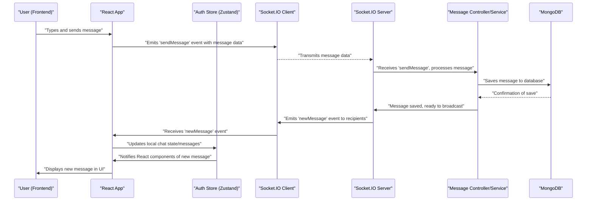

# System Overview

<TOC />

This document provides a high-level overview of the Chat-App-MERN project, detailing its purpose, architecture, and the core technologies used. The project aims to deliver a real-time chat application built with the MERN (MongoDB, Express, React, Node.js) stack, enhanced with Socket.IO for live communication.

## Project Purpose

The Chat-App-MERN project is designed to be a fully functional real-time chat application, demonstrating a comprehensive implementation of the MERN stack coupled with WebSocket technology. It provides users with a platform to communicate instantly, featuring user authentication, private messaging, and real-time updates.

The project is structured into distinct frontend and backend components, allowing for clear separation of concerns and scalability.

**Key Features:**

*   **User Authentication**: Secure user registration and login.
*   **Real-time Messaging**: Instant message delivery using WebSockets.
*   **Private Chats**: One-on-one messaging functionality.
*   **User Status**: Displaying online/offline status.
*   **Scalable Architecture**: Built on a modular MERN stack.

## Core Technology Stack

The application leverages a robust set of modern web technologies to deliver a fast, responsive, and reliable experience.

### Full Stack Overview

The project follows a typical MERN stack architecture:

*   **MongoDB**: NoSQL database for flexible and scalable data storage.
*   **Express.js**: Backend web application framework for Node.js.
*   **React**: Frontend JavaScript library for building user interfaces.
*   **Node.js**: JavaScript runtime environment for server-side logic.
*   **Socket.IO**: Library for real-time, bidirectional, event-based communication.

### Backend Dependencies

The backend is built with Node.js and Express.js, handling API requests, database interactions, and real-time communication. Key dependencies from `backend/package.json` include:

*   **`express`**: Fast, unopinionated, minimalist web framework for Node.js.
*   **`mongoose`**: MongoDB object modeling tool designed to work in an asynchronous environment.
*   **`socket.io`**: Enables real-time, bidirectional and event-based communication.
*   **`bcryptjs`**: Library for hashing passwords.
*   **`jsonwebtoken`**: For creating and verifying JSON Web Tokens for authentication.
*   **`dotenv`**: Loads environment variables from a `.env` file.
*   **`cloudinary`**: Cloud-based image and video management.
*   **`cookie-parser`**: Parse Cookie header and populate `req.cookies`.
*   **`passport`**, **`passport-google-oauth20`**: Authentication middleware for Google OAuth.

```json title="backend/package.json - Dependencies"
{
  "dependencies": {
    "bcryptjs": "^2.4.3",
    "cloudinary": "^2.5.1",
    "cookie-parser": "^1.4.7",
    "dotenv": "^16.4.7",
    "express": "^4.21.2",
    "express-session": "^1.18.1",
    "jsonwebtoken": "^9.0.2",
    "mongoose": "^8.9.5",
    "passport": "^0.7.0",
    "passport-google-oauth20": "^2.0.0",
    "socket.io": "^4.8.1"
  },
  "devDependencies": {
    "nodemon": "^3.1.9"
  }
}
```
[View on GitHub](https://github.com/shinymack/Chat-App-MERN/blob/main/backend/package.json)

### Frontend Dependencies

The frontend uses React for building the user interface, with various libraries to enhance user experience and connectivity. Key dependencies from `frontend/package.json` include:

*   **`react`**, **`react-dom`**: Core React libraries for UI development.
*   **`axios`**: Promise-based HTTP client for making API requests.
*   **`socket.io-client`**: Client-side library for Socket.IO.
*   **`react-router-dom`**: For declarative routing in React applications.
*   **`zustand`**: A small, fast, and scalable bearbones state-management solution.
*   **`lucide-react`**, **`react-icons`**: Icon libraries.
*   **`daisyui`**, **`tailwindcss`**: UI component library and CSS framework for styling.

```json title="frontend/package.json - Dependencies"
{
  "dependencies": {
    "axios": "^1.7.9",
    "cors": "^2.8.5",
    "lucide-react": "^0.471.1",
    "react": "^18.3.1",
    "react-dom": "^18.3.1",
    "react-hot-toast": "^2.5.1",
    "react-icons": "^5.5.0",
    "react-router-dom": "^7.1.1",
    "socket.io-client": "^4.8.1",
    "zustand": "^5.0.3"
  },
  "devDependencies": {
    "@vitejs/plugin-react": "^4.3.4",
    "autoprefixer": "^10.4.20",
    "daisyui": "^4.12.23",
    "postcss": "^8.5.0",
    "tailwindcss": "^3.4.17",
    "vite": "^6.3.5"
  }
}
```
[View on GitHub](https://github.com/shinymack/Chat-App-MERN/blob/main/frontend/package.json)

### Project Scripts

The root `package.json` orchestrates the build and start processes for both frontend and backend, simplifying deployment.

```json title="package.json - Root Scripts"
{
  "name": "chatapp",
  "version": "1.0.0",
  "main": "index.js",
  "scripts": {
    "build" : "npm install --prefix backend && npm install --prefix frontend && npm run build --prefix frontend",
    "start" : "npm run start --prefix backend"
  },
  "keywords": [],
  "author": "",
  "license": "ISC",
  "description": ""
}
```
[View on GitHub](https://github.com/shinymack/Chat-App-MERN/blob/main/package.json)

The `build` script first installs dependencies for both `backend` and `frontend`, then builds the frontend assets. The `start` script initiates the backend server. The backend also has its own `dev` script for development with `nodemon`.

```json title="backend/package.json - Scripts"
{
  "scripts": {
    "dev": "nodemon src/index.js",
    "start": "node src/index.js"
  }
}
```
[View on GitHub](https://github.com/shinymack/Chat-App-MERN/blob/main/backend/package.json)

## Architectural Overview

The application follows a client-server architecture with a clear separation between the frontend UI and the backend API and real-time server.


```mermaid
graph TD
    A["Frontend (React.js)"] -->|1. HTTP Requests (Axios)| B["Backend (Express.js)"]
    B -->|2. Database Operations (Mongoose)| C["MongoDB"]
    A --o|3. Real-time Communication (Socket.IO-Client)| D["Socket.IO Server (on Node.js/Express)"]
    D --o|4. Emit/Broadcast Events| A
    B --.->|5. Image Uploads| E["Cloudinary"]

    subgraph User Interaction Flow
        U["User"] --> A
    end
```


**Explanation:**

1.  **User Interface (React.js)**: The user interacts with the application through the React-based frontend. It manages state, renders components, and handles user input.
2.  **HTTP Requests (Axios)**: For operations like login, registration, fetching user profiles, or initial chat history, the frontend sends HTTP requests to the Express.js backend using `axios`.
3.  **Backend API (Express.js)**: The Express.js server handles all incoming HTTP requests, processes business logic, and interacts with the database. It also hosts the Socket.IO server.
4.  **Database (MongoDB)**: Mongoose is used by the Express.js server to interact with the MongoDB database for storing user data, messages, and chat room information.
5.  **Real-time Communication (Socket.IO)**: For instant messaging, the frontend establishes a WebSocket connection with the Socket.IO server. Messages and status updates are sent and received in real-time through this connection, bypassing traditional HTTP request-response cycles.
6.  **Cloudinary**: Handles image and media uploads, offloading storage and processing from the main backend server.

## Real-time Communication Flow

Socket.IO is central to the chat application's real-time capabilities. Here's a simplified sequence of how messages are sent and received:





**Explanation:**

1.  **User Action**: The user types a message and clicks send.
2.  **Frontend Emission**: The React application, via its Socket.IO client instance, emits a `sendMessage` event to the Socket.IO server, containing the message content and recipient information.
3.  **Server Reception & Processing**: The Socket.IO server receives the `sendMessage` event. It delegates processing to a message controller or service.
4.  **Database Storage**: The message controller saves the message to MongoDB.
5.  **Server Broadcast**: After successful storage, the Socket.IO server broadcasts a `newMessage` event to the relevant recipients (e.g., all users in a chat room, or the specific recipient in a private chat).
6.  **Client Reception & Update**: The recipients' Socket.IO clients receive the `newMessage` event. The React app updates its local state (e.g., using Zustand for state management) to include the new message.
7.  **UI Render**: The React components re-render to display the newly received message in the chat interface.

## Key Integration Points

Understanding the interaction between different parts of the system is crucial for development and debugging.

### API Endpoint Structure

The backend exposes RESTful API endpoints for user management, authentication, and initial data fetching. For example, user authentication endpoints might look like this:

```javascript title="backend/routes/auth.routes.js - Example Route"
import express from 'express';
import { signup, login, logout } from '../controllers/auth.controller.js';

const router = express.Router();

router.post("/signup", signup);
router.post("/login", login);
router.post("/logout", logout);

export default router;
```
[View on GitHub](https://github.com/shinymack/Chat-App-MERN/blob/main/backend/routes/auth.routes.js)

### State Management (Zustand)

The frontend uses `zustand` for managing global state, such as authentication status, selected conversations, and the active Socket.IO connection. This allows various components to access and update shared data efficiently.

```javascript title="frontend/src/zustand/useSocketStore.js - Socket.IO Store"
import { create } from 'zustand';

const useSocketStore = create((set) => ({
    socket: null,
    setSocket: (socket) => set({ socket }),
    onlineUsers: [],
    setOnlineUsers: (users) => set({ onlineUsers: users }),
}));

export default useSocketStore;
```
[View on GitHub](https://github.com/shinymack/Chat-App-MERN/blob/main/frontend/src/zustand/useSocketStore.js)

This `useSocketStore` example shows how the Socket.IO client instance and the list of online users are managed globally, making them accessible throughout the React application.

### Environment Variables

Both frontend and backend utilize environment variables (`.env` files) to manage sensitive information (e.g., database URIs, JWT secrets, Cloudinary API keys) and configuration settings (e.g., server port, API base URL). This promotes security and easy configuration across different deployment environments.

```javascript title="backend/.env.example - Environment Variables"
MONGO_DB_URI=
JWT_SECRET=
PORT=5000
CLOUDINARY_CLOUD_NAME=
CLOUDINARY_API_KEY=
CLOUDINARY_API_SECRET=
GOOGLE_CLIENT_ID=
GOOGLE_CLIENT_SECRET=
CLIENT_URL=
```
[View on GitHub](https://github.com/shinymack/Chat-App-MERN/blob/main/backend/.env.example)

### Cross-Origin Resource Sharing (CORS)

Given the separate frontend and backend deployments (even locally on different ports), CORS configuration is essential for allowing the frontend to make requests to the backend. The `cors` middleware is typically used on the Express.js server to permit requests from the frontend's origin.

```javascript title="backend/src/server.js - CORS Configuration"
import cors from 'cors';
// ... other imports ...

const app = express();
const PORT = process.env.PORT || 5000;

// ... other middleware ...

app.use(cors({
    origin: process.env.CLIENT_URL, // Allow requests from your frontend URL
    credentials: true, // Allow cookies to be sent
}));

// ... routes and server start ...
```
[View on GitHub](https://github.com/shinymack/Chat-App-MERN/blob/main/backend/src/server.js) (Conceptual snippet, actual implementation may vary slightly)

This setup ensures that the frontend running on a different domain or port (defined by `CLIENT_URL`) can securely communicate with the backend.

Next: [Getting Started](./1.2_getting-started.mdx)