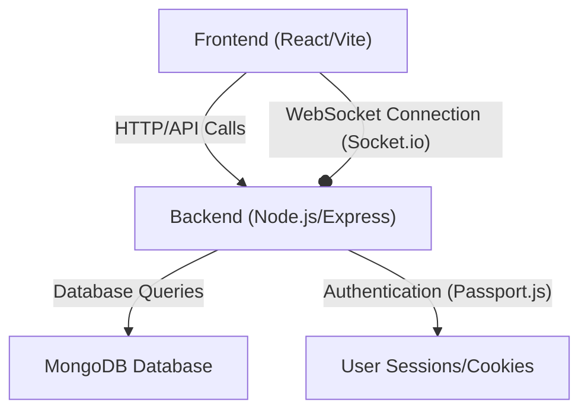

---
title: "Getting Started"
description: "Detailed instructions for setting up the development environment and running the application locally."
sidebar_position: 12
---

# Getting Started

<TOC />

Welcome to the Getting Started guide for the MERN Chatapp! This document provides detailed instructions to set up your development environment and run the application locally. Built with the MERN stack (MongoDB, Express.js, React, Node.js), this chatapp offers real-time messaging capabilities.

The project is inspired by a YouTube tutorial, providing a solid foundation for learning and developing MERN applications. You can find the original credits in the project's [README.md](https://github.com/shinymack/Chat-App-MERN/blob/main/README.md).

## Project Overview

This MERN Chatapp is structured into two main components: a `backend` (Node.js with Express.js) and a `frontend` (React). It leverages MongoDB for data persistence and implements real-time communication using Socket.io (though the provided snippets primarily show setup, Socket.io is used for real-time features). Authentication is handled via Passport.js with sessions and cookies.

### Core Technologies

The application relies on the following key technologies:

*   **MongoDB**: NoSQL database for flexible data storage.
*   **Express.js**: Backend web application framework for Node.js.
*   **React**: Frontend library for building user interfaces.
*   **Node.js**: JavaScript runtime for server-side logic.
*   **Socket.io**: Enables real-time, bidirectional, event-based communication.
*   **Passport.js**: Authentication middleware for Node.js.
*   **Vite**: Frontend build tool.

### Application Architecture

The architecture follows a standard client-server model, with the React frontend communicating with the Node.js/Express backend, which in turn interacts with the MongoDB database. Socket.io is integrated into the backend to handle real-time messaging, ensuring a responsive user experience.

Here's a high-level view of how the different components interact:





## Prerequisites

Before you begin, ensure you have the following software installed on your system:

*   **Node.js & npm**: The backend runs on Node.js, and both frontend and backend package management is handled by npm.
    *   [Download Node.js](https://nodejs.org/en/download/) (Includes npm).
*   **MongoDB**: The application uses MongoDB as its primary database.
    *   [Install MongoDB Community Server](https://www.mongodb.com/try/download/community).
    *   Alternatively, you can use a cloud-hosted solution like [MongoDB Atlas](https://www.mongodb.com/atlas/database).
*   **Git**: For cloning the repository.
    *   [Download Git](https://git-scm.com/downloads).

## Setting Up the Development Environment

Follow these steps to get the application up and running on your local machine.

### 1. Clone the Repository

First, clone the project repository from GitHub to your local machine:

```bash
git clone https://github.com/shinymack/Chat-App-MERN.git
cd Chat-App-MERN
```

### 2. Configure Environment Variables

The backend requires several environment variables, including database connection strings, session secrets, and port numbers. Create a `.env` file in the `backend` directory:

```bash
# In the root of the project, create backend/.env
touch backend/.env
```

Populate `backend/.env` with the following minimum required variables. Adjust `MONGO_URI` if you are using a different MongoDB setup (e.g., MongoDB Atlas connection string).

```env
MONGO_URI=mongodb://localhost:27017/chatapp
PORT=5000
SESSION_SECRET=a_very_secret_key_for_sessions
```

*   `MONGO_URI`: Your MongoDB connection string. For local MongoDB, `mongodb://localhost:27017/chatapp` is common.
*   `PORT`: The port on which the backend server will listen.
*   `SESSION_SECRET`: A strong, random string used to sign the session ID cookie.

### 3. Install Dependencies

The `package.json` at the root level contains a convenient `build` script that handles installing dependencies for both the frontend and backend.

```bash
npm run build
```

This command executes:
1.  `npm install --prefix backend`: Installs all dependencies listed in `backend/package.json`.
2.  `npm install --prefix frontend`: Installs all dependencies listed in `frontend/package.json`.
3.  `npm run build --prefix frontend`: Builds the React frontend for production.

### 4. Start the Application

Once dependencies are installed and the frontend is built, you can start the backend server. The root `package.json` also provides a `start` script for this.

```bash
npm start
```

This command executes `npm run start --prefix backend`, which in turn runs the backend server. You should see a message indicating the server is running and connected to the database.

**Console Output Example:**

```
server is running on PORT: 5000
MongoDB connected successfully!
```

The application will be accessible at `http://localhost:5000` (for the backend API) and `http://localhost:5173` (for the frontend development server if running separately, or served by the backend in production mode).

### Frontend Development (Optional)

If you want to run the frontend in development mode with hot-reloading (useful for active development), navigate to the `frontend` directory and start the Vite development server:

```bash
cd frontend
npm install # if not already done by `npm run build`
npm run dev
```

The frontend will typically run on `http://localhost:5173`. Make sure the backend server is also running for API calls.

## Code Structure and Key Files

Understanding the core files helps in navigating the codebase.

### `package.json` (Root)

The root `package.json` defines project-level scripts for managing both frontend and backend, simplifying common development tasks.

```json
{
  "name": "chatapp",
  "version": "1.0.0",
  "main": "index.js",
  "scripts": {
    "build" : "npm install --prefix backend && npm install --prefix frontend && npm run build --prefix frontend",
    "start" : "npm run start --prefix backend"
  },
  "keywords": [],
  "author": "",
  "license": "ISC",
  "description": ""
}
```

*   **`build` script**: Automates the installation of dependencies for both `backend` and `frontend` sub-projects and then builds the React frontend for production. This is the recommended first command after cloning.
*   **`start` script**: Initiates the backend server, making the application API and (in production mode) the frontend available.

[View `package.json` on GitHub](https://github.com/shinymack/Chat-App-MERN/blob/main/package.json)

### `backend/src/index.js`

This is the entry point for the backend application. It sets up the Express server, integrates middleware, defines API routes, and handles database connection and server listening.

```javascript
// ... imports ...

const __dirname = path.resolve();
dotenv.config();

configurePassport(); // Passport.js authentication setup

app.use(cookieParser());
app.use(express.json({limit : '2mb'}));
app.use(express.urlencoded({ limit: '2mb', extended: true }));
app.use(cors({
    origin: "http://localhost:5173", // Frontend origin
    credentials: true,
}));

app.use(session({
    secret: process.env.SESSION_SECRET,
    resave: false,
    saveUninitialized: false,
    cookie: {
        secure: process.env.NODE_ENV === "production",
        httpOnly: true,
        maxAge: 7 * 24 * 60 * 60 * 1000
    }
}));

app.use(passport.initialize());
app.use(passport.session());

app.use("/api/auth", authRoutes );
app.use("/api/messages", messageRoutes );
app.use("/api/friends", friendRoutes);


const PORT = process.env.PORT;
if(process.env.NODE_ENV === "production"){
    app.use(express.static(path.join(__dirname, "../frontend/dist")));

    app.get("*" , (req, res) => {
        res.sendFile(path.join(__dirname,"../frontend", "dist","index.html"));
    })
}

server.listen(PORT, () => {
    console.log("server is running on PORT: " + String(PORT));
    connectDB();
});
```

*   **Middleware Setup**: `express.json()`, `express.urlencoded()`, `cors()`, `cookieParser()`, `express-session`, and `passport` are configured here to handle request body parsing, cross-origin requests, session management, and user authentication.
*   **CORS Configuration**: The `cors` middleware is set to allow requests from `http://localhost:5173`, which is the default port for the React frontend development server. `credentials: true` is crucial for allowing cookies to be sent with cross-origin requests.
*   **Session Management**: `express-session` is configured with a `SESSION_SECRET` from environment variables, ensuring secure session cookies. The `secure` flag is set conditionally for production environments.
*   **Passport.js**: Initialized for authentication, managing user sessions. The `configurePassport()` function (defined in `backend/lib/passport.config.js`) sets up the authentication strategies.
*   **API Routes**: All API endpoints are prefixed with `/api/` and delegated to specific route handlers (`authRoutes`, `messageRoutes`, `friendRoutes`).
*   **Production Build Serving**: In a production environment (`NODE_ENV === "production"`), the backend serves the static files of the built React frontend, acting as a full-stack server.

[View `backend/src/index.js` on GitHub](https://github.com/shinymack/Chat-App-MERN/blob/main/backend/src/index.js)

### `frontend/src/main.jsx`

This file is the entry point for the React frontend application. It renders the main `App` component into the DOM.

```javascript
import { StrictMode } from 'react'
import { createRoot } from 'react-dom/client'
import './index.css'
import App from './App.jsx'
import { BrowserRouter } from 'react-router-dom'

createRoot(document.getElementById('root')).render(
  <StrictMode>
    <BrowserRouter>
      <App />
    </BrowserRouter>
  </StrictMode>,
)
```

*   **React Strict Mode**: Encapsulates the application to highlight potential problems in an application, especially useful during development.
*   **React Router**: `BrowserRouter` is used to enable client-side routing, allowing for navigation within the single-page application without full page reloads.
*   **App Component**: The main `App` component (defined in `frontend/src/App.jsx`) contains the overall layout and routing logic for the chat application.

[View `frontend/src/main.jsx` on GitHub](https://github.com/shinymack/Chat-App-MERN/blob/main/frontend/src/main.jsx)

## Key Integration Points

The integration between the frontend and backend is crucial for the MERN Chatapp's functionality.

### 1. API Communication

The React frontend communicates with the Node.js/Express backend primarily through RESTful API calls for authentication, sending/receiving messages, and managing friend lists.


```mermaid
sequenceDiagram
    participant F as "Frontend (React)"
    participant B as "Backend (Express)"
    participant D as "MongoDB"

    F->>+B: "POST /api/auth/login (User Credentials)"
    B->>D: "Query User (Username/Password)"
    alt Successful Login
        D-->>B: "User Found"
        B->>B: "Create Session, Set Cookie"
        B-->>-F: "Authentication Success (Set Cookie)"
        F->>+B: "GET /api/messages (Retrieve Messages)"
        B->>D: "Fetch Messages"
        D-->>B: "Message List"
        B-->>-F: "Message List JSON"
    else Failed Login
        D-->>B: "User Not Found / Incorrect Password"
        B-->>-F: "Authentication Failure (401 Unauthorized)"
    end
```


### 2. Real-time Communication with Socket.io

While not extensively shown in the provided snippets, a MERN Chatapp typically uses Socket.io for real-time features like instant message delivery, online user status, and typing indicators. The `backend/src/lib/socket.js` would handle the Socket.io server setup, and the frontend would connect to it.

### 3. Cross-Origin Resource Sharing (CORS)

The `cors` middleware in `backend/src/index.js` is vital for allowing the frontend (running on `http://localhost:5173`) to make requests to the backend (running on `http://localhost:5000`). The `credentials: true` option ensures that cookies (used for sessions) are sent with these cross-origin requests.

```javascript
app.use(cors({
    origin: "http://localhost:5173", // Explicitly allowing frontend origin
    credentials: true, // Allows sending cookies with cross-origin requests
}));
```

### 4. Authentication Flow with Passport.js

The backend uses Passport.js for robust authentication. When a user logs in, Passport creates a session and stores a session ID in a cookie (managed by `express-session` and `cookie-parser`). Subsequent requests from the frontend will include this cookie, allowing the backend to identify the authenticated user.

### Best Practices

*   **Environment Variables**: Always use environment variables (`.env` files) for sensitive information and configuration settings (e.g., database URIs, API keys, session secrets) to keep them out of version control.
*   **Modular Routing**: Organize your API routes into separate files (e.g., `auth.route.js`, `message.route.js`) for better maintainability and readability.
*   **CORS Configuration**: Be explicit with your `cors` origin settings, especially in production, to enhance security. Avoid using `*` for `origin` in production environments if credentials are involved.
*   **Production Deployment**: When deploying, ensure `NODE_ENV` is set to `"production"` to enable production-specific optimizations, stricter security settings (like secure cookies), and serving of static frontend assets by the backend.

By following these instructions and understanding the core components, you're well-equipped to run, explore, and contribute to the MERN Chatapp project.

Next: [API Design and Routing](./2.1_api-design-and-routing.mdx)
```