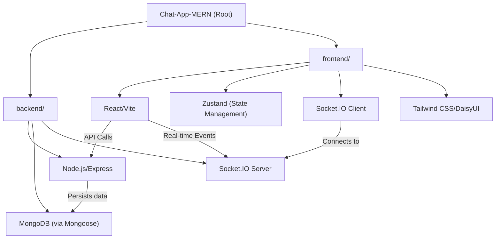
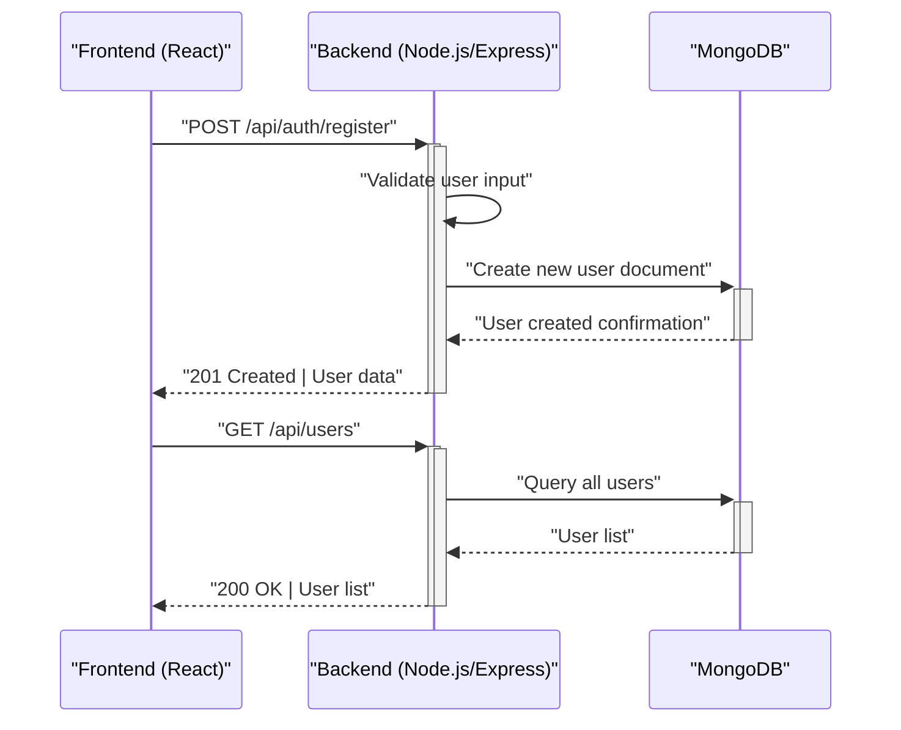

# Introduction and Project Overview

<TOC />

Welcome to the documentation for the Chat-App-MERN project! This document serves as a high-level overview, introducing the project's core purpose, the technologies it leverages, and its fundamental architecture. Developed as a modern real-time chat application, this project showcases a full-stack implementation using the MERN (MongoDB, Express.js, React, Node.js) stack, emphasizing effective communication between frontend and backend components.

The primary goal of this application is to provide a platform for real-time messaging, allowing users to register, log in, find other users, and engage in one-on-one or group conversations. It leverages modern web development practices, including component-based UI development, robust API design, and persistent data storage.

This project is a great learning resource for those interested in full-stack MERN development, real-time communication with Socket.IO, and state management using tools like Zustand.

## Project Purpose and Features

The Chat-App-MERN project aims to deliver a functional and interactive chat experience with the following key features:

*   **User Authentication**: Secure user registration and login functionality.
*   **Real-time Messaging**: Instant message sending and receiving through WebSockets.
*   **User Discovery**: Ability to find and connect with other registered users.
*   **Conversation Management**: Support for one-on-one chats.
*   **Modern UI**: A responsive and intuitive user interface built with React.
*   **Efficient Data Handling**: Backend APIs for managing users, messages, and conversations.

### Core Technologies

This application is built upon the robust MERN stack, complemented by several other essential libraries and tools:

| Category     | Technology       | Description                                              |
| :----------- | :--------------- | :------------------------------------------------------- |
| **Frontend** | React            | Declarative, component-based UI library.                 |
|              | Vite             | Fast development build tool for modern web projects.     |
|              | Zustand          | Small, fast, and scalable state-management solution.     |
|              | Socket.IO Client | Real-time bi-directional event-based communication.      |
|              | Tailwind CSS     | Utility-first CSS framework for rapid UI development.    |
|              | DaisyUI          | Tailwind CSS component library.                          |
|              | React Router DOM | Declarative routing for React applications.              |
|              | Axios            | Promise-based HTTP client for the browser and Node.js.   |
| **Backend**  | Node.js          | JavaScript runtime for server-side logic.                |
|              | Express.js       | Fast, unopinionated, minimalist web framework for Node.js.|
|              | MongoDB          | NoSQL database for flexible and scalable data storage.   |
|              | Mongoose         | MongoDB object data modeling (ODM) for Node.js.          |
|              | Socket.IO        | Real-time engine enabling bi-directional communication.  |
| **Tooling**  | ESLint           | Pluggable JavaScript linter.                             |
|              | Prettier         | Opinionated code formatter.                              |

## Project Structure Overview

The project follows a typical monorepo-like structure, separating the frontend and backend concerns into distinct directories. This separation enhances maintainability and allows for independent development and deployment of each part.





*Figure 1: High-level Project Structure and Technology Overview*

This diagram illustrates how the main components are organized and interact. The `backend` directory houses the Node.js/Express server, which interacts with MongoDB for data persistence and hosts the Socket.IO server for real-time communication. The `frontend` directory contains the React application, which consumes the backend APIs and connects to the Socket.IO server for live updates.

### Root `package.json`

The top-level `package.json` file serves primarily as an orchestrator for building and starting both the frontend and backend services. It defines scripts that streamline the development and deployment process.

```json
// package.json
{
  "name": "chatapp",
  "version": "1.0.0",
  "main": "index.js",
  "scripts": {
    "build" : "npm install --prefix backend && npm install --prefix frontend && npm run build --prefix frontend",
    "start" : "npm run start --prefix backend"
  },
  "keywords": [],
  "author": "",
  "license": "ISC",
  "description": ""
}
```
[View on GitHub](https://github.com/shinymack/Chat-App-MERN/blob/main/package.json)

*   `build`: This script is crucial for deployment. It first installs dependencies for both `backend` and `frontend` directories and then executes the `build` script defined within the `frontend`'s `package.json` to create a production-ready frontend bundle.
*   `start`: This script starts the backend server, typically for production environments, leveraging the `start` script defined in the `backend`'s `package.json`.

### Frontend `package.json`

The `frontend/package.json` details all the dependencies and scripts specific to the React application. It highlights the use of Vite for bundling and a rich set of libraries for UI, state management, and network communication.

```json
// frontend/package.json
{
  "name": "frontend",
  "private": true,
  "version": "0.0.0",
  "type": "module",
  "scripts": {
    "dev": "vite",
    "build": "vite build",
    "lint": "eslint .",
    "preview": "vite preview",
    "mobile": "vite --host"
  },
  "dependencies": {
    "axios": "^1.7.9",
    "cors": "^2.8.5",
    "lucide-react": "^0.471.1",
    "react": "^18.3.1",
    "react-dom": "^18.3.1",
    "react-hot-toast": "^2.5.1",
    "react-icons": "^5.5.0",
    "react-router-dom": "^7.1.1",
    "socket.io-client": "^4.8.1",
    "zustand": "^5.0.3"
  },
  "devDependencies": {
    "@eslint/js": "^9.17.0",
    "@types/react": "^18.3.18",
    "@types/react-dom": "^18.3.5",
    "@vitejs/plugin-react": "^4.3.4",
    "autoprefixer": "^10.4.20",
    "daisyui": "^4.12.23",
    "eslint": "^9.17.0",
    "eslint-plugin-react": "^7.37.2",
    "eslint-plugin-react-hooks": "^5.0.0",
    "eslint-plugin-react-refresh": "^0.4.16",
    "globals": "^15.14.0",
    "postcss": "^8.5.0",
    "tailwindcss": "^3.4.17",
    "vite": "^6.3.5"
  }
}
```
[View on GitHub](https://github.com/shinymack/Chat-App-MERN/blob/main/frontend/package.json)

Key dependencies include:
*   `axios`: For making HTTP requests to the backend API.
*   `react`, `react-dom`: Core React libraries.
*   `react-router-dom`: For client-side routing.
*   `socket.io-client`: The client-side library for WebSocket communication.
*   `zustand`: A lightweight state management library, likely used for global application state like user authentication status, conversations, and messages.
*   `daisyui`, `tailwindcss`: For styling the application.
*   `vite`: As the build tool, offering fast refresh and optimized builds.

### Frontend `README.md`

The frontend's `README.md` provides basic instructions for setting up and running the React application, generated by Vite.

```markdown
# React + Vite

This template provides a minimal setup to get React working in Vite with HMR and some ESLint rules.

Currently, two official plugins are available:

- [@vitejs/plugin-react](https://github.com/vitejs/vite-plugin-react/blob/main/packages/plugin-react/README.md) uses [Babel](https://babeljs.io/) for Fast Refresh
- [@vitejs/plugin-react-swc](https://github.com/vitejs/vite-plugin-react-swc) uses [SWC](https://swc.rs/) for Fast Refresh
```
[View on GitHub](https://github.com/shinymack/Chat-App-MERN/blob/main/frontend/README.md)

This snippet indicates that the project uses the `@vitejs/plugin-react` plugin, which leverages Babel for fast refresh during development, ensuring a smooth developer experience.

## Key Integration Points

The communication and interaction between the frontend and backend are crucial for the real-time chat application.

### API Calls for Data Management

The frontend utilizes `axios` to make RESTful API calls to the Express.js backend for operations that require data persistence or complex server-side logic, such as:
*   User registration and authentication (login/logout).
*   Fetching user profiles or lists of available users.
*   Retrieving past messages in a conversation.
*   Managing conversation metadata.





*Figure 2: Example API Call Sequence for User Management*

This sequence diagram illustrates common interactions where the frontend sends requests to the backend, which then interacts with the database to fulfill those requests and sends a response back to the frontend.

### Real-time Communication with Socket.IO

For real-time functionalities like sending and receiving messages instantly, the application uses Socket.IO. The frontend's `socket.io-client` connects to the `socket.io` server hosted on the backend, establishing a persistent bi-directional communication channel.

When a user sends a message, the frontend emits a `newMessage` event to the Socket.IO server, which then broadcasts this message to the recipient and possibly to other connected clients in the same conversation, ensuring instant delivery without the need for constant polling.

The use of Zustand on the frontend is particularly beneficial here, allowing messages received via Socket.IO to instantly update the global state, which then re-renders the UI to display new messages in real-time.

```javascript
// Example: frontend/src/context/socketContext.jsx (conceptual)
import { createContext, useContext, useEffect, useState } from "react";
import io from "socket.io-client";
import { useAuthStore } from "../store/authStore"; // Assuming an auth store

const SocketContext = createContext();

export const useSocketContext = () => {
    return useContext(SocketContext);
};

export const SocketContextProvider = ({ children }) => {
    const [socket, setSocket] = useState(null);
    const { user } = useAuthStore(); // Get authenticated user from Zustand store

    useEffect(() => {
        if (user) {
            const socketInstance = io("http://localhost:5000", { // Connect to backend
                query: {
                    userId: user._id, // Pass user ID for authentication on socket connection
                },
            });
            setSocket(socketInstance);

            // Clean up on component unmount or user logout
            return () => socketInstance.close();
        } else {
            if (socket) {
                socket.close();
                setSocket(null);
            }
        }
    }, [user]); // Reconnect/disconnect based on user authentication status

    return (
        <SocketContext.Provider value={{ socket }}>
            {children}
        </SocketContext.Provider>
    );
};
```
[View on GitHub (Conceptual example, actual file may vary)](https://github.com/shinymack/Chat-App-MERN/blob/main/frontend/src/context/socketContext.jsx)

This conceptual snippet illustrates how `socket.io-client` is initialized, typically with the user's ID for server-side authentication and tracking of active users. The `useEffect` hook ensures the socket connection is managed according to the user's authentication status.

### State Management with Zustand

Zustand plays a vital role in managing the application's global state on the frontend. It is likely used for:
*   **Authentication State**: Storing the logged-in user's information (`useAuthStore`).
*   **Conversations and Messages**: Managing the active conversation, list of messages, and users (`useConversationStore`).
*   **Socket Instance**: Possibly storing the Socket.IO client instance or its connection status.

```javascript
// Example: frontend/src/store/authStore.js (conceptual)
import { create } from "zustand";
import { persist } from "zustand/middleware";

export const useAuthStore = create(
    persist(
        (set) => ({
            user: null, // Initial user state
            login: (userData) => set({ user: userData }),
            logout: () => set({ user: null }),
            setUser: (userData) => set({ user: userData }), // For refreshing user data
        }),
        {
            name: "auth-storage", // Name of the item in local storage
            getStorage: () => localStorage, // Use local storage
        }
    )
);
```
[View on GitHub (Conceptual example, actual file may vary)](https://github.com/shinymack/Chat-App-MERN/blob/main/frontend/src/store/authStore.js)

This example shows a basic `authStore` using Zustand with `persist` middleware, which automatically saves and loads the user state from local storage. This ensures that the user remains logged in even after refreshing the page.

### Styling with Tailwind CSS and DaisyUI

The frontend's user interface is styled using Tailwind CSS, a utility-first framework, combined with DaisyUI, a component library built on top of Tailwind. This approach allows for rapid UI development and easy customization.

```javascript
// frontend/tailwind.config.js
/** @type {import('tailwindcss').Config} */
export default {
  content: [
    "./index.html",
    "./src/**/*.{js,ts,jsx,tsx}",
  ],
  theme: {
    extend: {},
  },
  plugins: [require("daisyui")], // DaisyUI plugin enabled
  daisyui: { // DaisyUI specific configurations
    themes: ["light", "dark", "cupcake"], // Enable specific themes
  }
}
```
[View on GitHub (Conceptual example, actual file may vary)](https://github.com/shinymack/Chat-App-MERN/blob/main/frontend/tailwind.config.js)

This configuration snippet shows how DaisyUI is integrated as a plugin into the Tailwind CSS setup, providing pre-built, accessible UI components that fit perfectly within the utility-first paradigm.

Next: [Backend Architecture and Services](./2_backend-architecture-and-services.mdx)