# Introduction and Project Overview

<TOC />

This document provides a comprehensive overview of the **Chat-App-MERN** project, a real-time chat application built using the MERN (MongoDB, Express.js, React.js, Node.js) stack. The goal of this project is to demonstrate a full-stack approach to developing interactive web applications with a focus on real-time communication capabilities.

The project is structured into distinct frontend and backend components, managed by a root-level orchestrator. This modular design facilitates development, scalability, and maintainability.

:::tip Credits
This project acknowledges the tutorial series by [YouTube Channel](https://youtu.be/ntKkVrQqBYY?si=qz02jMCQ80RT1jaH) for its foundational guidance.
:::

## Project Purpose and Core Technologies

The **Chat-App-MERN** is designed to be a fully functional real-time messaging platform, allowing users to register, log in, send instant messages, and interact in a dynamic environment. Its core purpose is to showcase the synergy of modern web technologies to deliver a responsive and engaging user experience.

The project leverages the **MERN stack**, a popular choice for building robust web applications:

*   **MongoDB:** A NoSQL database that stores user data, chat messages, and other application-related information. Its flexible schema allows for rapid iteration and scalability.
*   **Express.js:** A minimal and flexible Node.js web application framework that provides a robust set of features for web and mobile applications. It handles API routing, middleware, and server-side logic.
*   **React.js:** A declarative, component-based JavaScript library for building user interfaces. It powers the frontend of the chat application, providing a dynamic and responsive user experience.
*   **Node.js:** A JavaScript runtime built on Chrome's V8 JavaScript engine. It allows for server-side JavaScript execution, forming the backbone of the backend services.

Beyond the core MERN stack, the application incorporates several key technologies to achieve its real-time and interactive features:

*   **Socket.IO:** Enables real-time, bidirectional, and event-based communication between the client and server, essential for instant message delivery.
*   **JWT (JSON Web Tokens):** Used for secure, stateless authentication and authorization.
*   **Cloudinary:** A cloud-based image and video management service, likely used for user profile pictures or shared media.
*   **Zustand:** A small, fast, and scalable bear-necessities state-management solution for React, used in the frontend for managing application state efficiently.
*   **Tailwind CSS & DaisyUI:** For rapid and highly customizable UI development, ensuring a modern and appealing design.

## Project Architecture

The **Chat-App-MERN** project follows a typical client-server architecture, with the frontend communicating with the backend via RESTful APIs and real-time WebSockets.

Here's a high-level overview of the system architecture:


```mermaid
graph TD
    A["User (Browser/Mobile)"] --> B["Frontend (React.js / Vite)"]
    B -->|1. REST API Calls (Authentication, User Data)| C["Backend (Node.js / Express.js)"]
    C -->|2. Data Persistence (Mongoose ODM)| D["Database (MongoDB Atlas)"]
    B -- 3. Real-time Communication (Socket.IO Client) --> E["Real-time Layer (Socket.IO Server)"]
    E -- 4. Event Handling / Message Broadcasting --> C
    C -->|5. External Media Storage| F["Cloudinary (Image/File Uploads)"]
    C -- 6. Secure Authentication --> C_Auth["Authentication Services (JWT, Passport.js)"]
    C_Auth --> D
```


**Explanation of Flow:**

1.  **User Interaction:** A user interacts with the **Frontend**, which is a React.js application running in their browser or as a mobile web app.
2.  **API Communication:** The Frontend sends HTTP requests (GET, POST, PUT, DELETE) to the **Backend** (Node.js/Express.js) for operations like user authentication, fetching user lists, sending messages (initially), and managing profile data.
3.  **Data Management:** The Backend interacts with **MongoDB** (via Mongoose ODM) to store and retrieve application data such as user profiles, chat messages, and conversation histories.
4.  **Real-time Layer:** For instant messaging, the Frontend establishes a WebSocket connection with the **Socket.IO Server**. The Backend is also integrated with the Socket.IO Server to broadcast messages and real-time events to connected clients.
5.  **External Services:** The Backend integrates with **Cloudinary** for managing file uploads, such as user avatars or shared images within chats.
6.  **Authentication:** The Backend utilizes **JWT** and potentially **Passport.js** (as suggested by `passport-google-oauth20` dependency) to secure API endpoints and manage user sessions.

## Key Project Components and Dependencies

The project is organized into a monorepo-like structure, with a root `package.json` orchestrating the build and start processes for separate `backend` and `frontend` directories.

### Root `package.json`

This file acts as the central control for the entire application, defining scripts to manage both the frontend and backend installations and builds.

```json filename="package.json"
{
  "name": "chatapp",
  "version": "1.0.0",
  "main": "index.js",
  "scripts": {
    "build" : "npm install --prefix backend && npm install --prefix frontend && npm run build --prefix frontend",
    "start" : "npm run start --prefix backend"
  },
  "keywords": [],
  "author": "",
  "license": "ISC",
  "description": ""
}
```
[View on GitHub](https://github.com/shinymack/Chat-App-MERN/blob/main/package.json)

**Explanation:**
*   `"name": "chatapp"`: The overall project name.
*   `"scripts"`: Defines crucial commands:
    *   `build`: This script orchestrates the entire project build. It first installs dependencies for the `backend` then for the `frontend`, and finally runs the `build` script defined within the `frontend` project. This ensures both parts are ready for deployment.
    *   `start`: This script starts the backend server, which is the entry point for the running application.

### Backend `package.json`

Located in the `backend/` directory, this file lists all server-side dependencies and scripts.

```json filename="backend/package.json"
{
  "name": "backend",
  "version": "1.0.0",
  "main": "src/index.js",
  "scripts": {
    "dev": "nodemon src/index.js",
    "start": "node src/index.js"
  },
  "author": "",
  "type": "module",
  "license": "ISC",
  "description": "",
  "dependencies": {
    "bcryptjs": "^2.4.3",
    "cloudinary": "^2.5.1",
    "cookie-parser": "^1.4.7",
    "dotenv": "^16.4.7",
    "express": "^4.21.2",
    "express-session": "^1.18.1",
    "jsonwebtoken": "^9.0.2",
    "mongoose": "^8.9.5",
    "passport": "^0.7.0",
    "passport-google-oauth20": "^2.0.0",
    "socket.io": "^4.8.1"
  },
  "devDependencies": {
    "nodemon": "^3.1.9"
  }
}
```
[View on GitHub](https://github.com/shinymack/Chat-App-MERN/blob/main/backend/package.json)

**Key Backend Dependencies:**
*   `express`: The web framework for building REST APIs.
*   `mongoose`: An Object Data Modeling (ODM) library for MongoDB, simplifying database interactions.
*   `socket.io`: The server-side implementation for real-time communication.
*   `bcryptjs`: For hashing passwords securely.
*   `jsonwebtoken`: For creating and verifying JWTs for authentication.
*   `cookie-parser`: Middleware to parse cookies attached to the client request object.
*   `dotenv`: Loads environment variables from a `.env` file.
*   `cloudinary`: For managing cloud-based file storage (e.g., user avatars).
*   `passport`, `passport-google-oauth20`: Authentication middleware, indicating potential support for Google OAuth.
*   `nodemon` (dev dependency): Automatically restarts the Node.js server when file changes are detected, enhancing development workflow.

**Backend Scripts:**
*   `dev`: Starts the server using `nodemon` for development with hot-reloading.
*   `start`: Starts the server using `node`, typically for production environments.

### Frontend `package.json`

Found in the `frontend/` directory, this file details all client-side dependencies and scripts for the React application.

```json filename="frontend/package.json"
{
  "name": "frontend",
  "private": true,
  "version": "0.0.0",
  "type": "module",
  "scripts": {
    "dev": "vite",
    "build": "vite build",
    "lint": "eslint .",
    "preview": "vite preview",
    "mobile": "vite --host"
  },
  "dependencies": {
    "axios": "^1.7.9",
    "cors": "^2.8.5",
    "lucide-react": "^0.471.1",
    "react": "^18.3.1",
    "react-dom": "^18.3.1",
    "react-hot-toast": "^2.5.1",
    "react-icons": "^5.5.0",
    "react-router-dom": "^7.1.1",
    "socket.io-client": "^4.8.1",
    "zustand": "^5.0.3"
  },
  "devDependencies": {
    "@eslint/js": "^9.17.0",
    "@types/react": "^18.3.18",
    "@types/react-dom": "^18.3.5",
    "@vitejs/plugin-react": "^4.3.4",
    "autoprefixer": "^10.4.20",
    "daisyui": "^4.12.23",
    "eslint": "^9.17.0",
    "eslint-plugin-react": "^7.37.2",
    "eslint-plugin-react-hooks": "^5.0.0",
    "eslint-plugin-react-refresh": "^0.4.16",
    "globals": "^15.14.0",
    "postcss": "^8.5.0",
    "tailwindcss": "^3.4.17",
    "vite": "^6.3.5"
  }
}
```
[View on GitHub](https://github.com/shinymack/Chat-App-MERN/blob/main/frontend/package.json)

**Key Frontend Dependencies:**
*   `react`, `react-dom`: Core libraries for building the UI.
*   `vite`: A next-generation frontend tooling that provides an extremely fast development experience.
*   `axios`: A promise-based HTTP client for making API requests to the backend.
*   `react-router-dom`: For client-side routing and navigation within the application.
*   `socket.io-client`: The client-side library for establishing and managing WebSocket connections with the `socket.io` server.
*   `zustand`: A state management library for React.
*   `react-hot-toast`: For displaying stylish notifications to users.
*   `lucide-react`, `react-icons`: Collections of SVG icons for UI enhancements.
*   `tailwindcss`, `daisyui`, `postcss`, `autoprefixer` (dev dependencies): For styling the application, utilizing a utility-first CSS framework and a component library.
*   `eslint` (dev dependency): For linting and maintaining code quality.

**Frontend Scripts:**
*   `dev`: Starts the Vite development server.
*   `build`: Compiles the React application for production deployment.
*   `lint`: Runs ESLint to check for code quality issues.
*   `preview`: Serves the production build locally for testing.
*   `mobile`: Starts the Vite server with `--host` option, making it accessible from other devices on the same network, useful for mobile development.

## Build and Start Processes

The root `package.json` defines the high-level orchestration for setting up and running the application. This ensures a streamlined process for both development and deployment.

```mermaid
graph TD
    A["Initial Setup / Deployment"]
    subgraph Build Phase
        B1["Run Root 'npm run build'"]
        B1 --> B2["Install Backend Dependencies (npm install --prefix backend)"]
        B2 --> B3["Install Frontend Dependencies (npm install --prefix frontend)"]
        B3 --> B4["Build Frontend Assets (npm run build --prefix frontend)"]
        B4 --> C["Ready for Production Deployment"]
    end
    subgraph Start Phase
        A --> S1["Run Root 'npm run start'"]
        S1 --> S2["Start Backend Server (npm run start --prefix backend)"]
        S2 --> D["Application Running (Backend Active)"]
    end
```





**Explanation:**

*   **Build Process:** The `npm run build` command from the root directory executes a sequence of commands to prepare both frontend and backend for production. This involves installing all necessary dependencies for both parts and then compiling the React application into static assets.
*   **Start Process:** Once built, `npm run start` from the root directory initiates the backend server. The frontend assets would typically be served by a web server (like Nginx or directly by the Express backend if configured) or through a CDN after the build process is complete. In a development environment, `npm run dev` in both `frontend` and `backend` directories would run concurrently.

## Key Integration Points

Understanding how these components interact is crucial for developing and maintaining the Chat-App-MERN project.

*   **Frontend-Backend Communication (APIs):** The React frontend sends HTTP requests (using `axios`) to the Express.js backend for user authentication, fetching initial data, and any non-real-time operations. The backend exposes RESTful API endpoints for these interactions.
*   **Real-time Messaging (Socket.IO):** For instantaneous message exchange, the `socket.io-client` in the frontend establishes a persistent WebSocket connection with the `socket.io` server embedded in the Express.js backend. This allows for low-latency, bidirectional event-based communication, crucial for a chat application.
*   **Authentication Flow:** When a user logs in via the frontend, credentials are sent to the backend. The backend authenticates against MongoDB, generates a JWT, and sends it back to the client. This token is then stored (e.g., in `localStorage` or `cookies`) and sent with subsequent API requests for authorization.
*   **Database Interaction:** The Express.js backend uses Mongoose to interact with the MongoDB database. Mongoose provides a structured way to define schemas and perform CRUD (Create, Read, Update, Delete) operations on chat messages, user profiles, and conversation data.
*   **State Management:** `Zustand` in the frontend efficiently manages global and local UI state, ensuring that components re-render optimally when data changes, including real-time updates received via Socket.IO.
*   **Environment Variables:** The `dotenv` package in the backend ensures sensitive information (like database connection strings, API keys, JWT secrets) is kept out of the codebase and managed securely through environment variables.

Next: [Backend Architecture and Services](./2_backend-architecture-and-services.mdx)