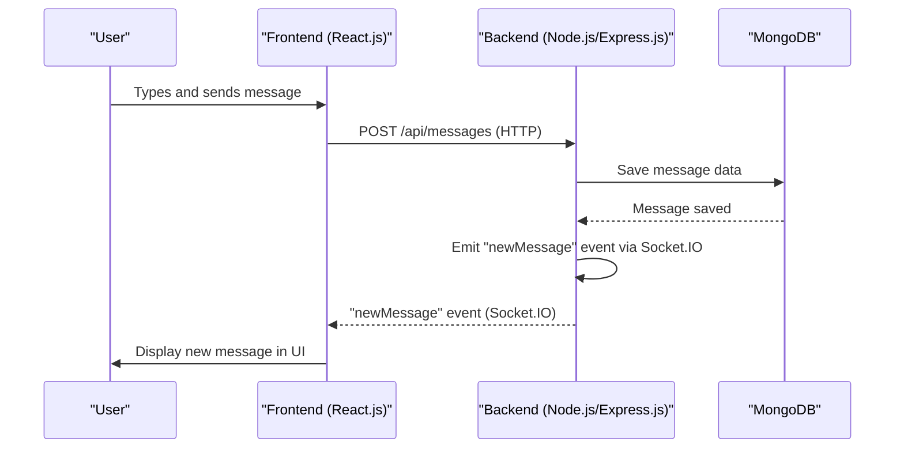

---
title: "Introduction and System Overview"
description: "High-level introduction to the Chat-App-MERN project, its purpose, and core technologies."
sidebar_position: 1
---

# Introduction and System Overview

<TOC />

This document provides a high-level overview of the Chat-App-MERN project, a real-time chat application built using the MERN (MongoDB, Express.js, React.js, Node.js) stack. The application aims to provide a robust platform for instant messaging, demonstrating a full-stack development approach with a focus on modern web technologies.

## System Purpose

The Chat-App-MERN project serves as a practical demonstration of building a scalable and interactive real-time chat application. Its primary purpose is to:

*   **Facilitate Real-time Communication:** Enable users to send and receive messages instantly, mimicking popular chat platforms.
*   **Showcase MERN Stack Integration:** Illustrate the seamless interaction between MongoDB for data storage, Express.js and Node.js for backend API services, and React.js for a dynamic user interface.
*   **Implement Best Practices:** Demonstrate a structured project setup, efficient state management, secure API communication, and scalable deployment strategies for a full-stack application.
*   **Provide a Learning Resource:** Serve as a comprehensive example for developers looking to understand real-time web development using the MERN stack and Socket.IO.

## Architecture

The Chat-App-MERN application adopts a classic client-server architecture, typical of full-stack web applications, with an emphasis on a decoupled frontend and backend. It leverages WebSockets for real-time bidirectional communication, enhancing the user experience for instant messaging.

### High-Level Architectural Diagram


```mermaid
graph TD
    A["Client (Frontend)"] -->|Sends HTTP/Socket.IO requests| B["Backend API (Express.js/Node.js)"]
    B -->|Communicates with| C["MongoDB (Database)"]
    B -->|Sends/Receives messages via Socket.IO| A
    subgraph Client-Side Interactions
        A --|> D["User Interface (React.js)"]
        D --|> E["State Management (Zustand)"]
        D --|> F["Real-time Sockets (socket.io-client)"]
        D --|> G["HTTP Requests (Axios)"]
    end
    subgraph Server-Side Interactions
        B --|> H["API Endpoints (Express.js)"]
        B --|> I["Real-time Logic (Socket.IO)"]
        B --|> J["Data Storage/Retrieval"]
    end
    I --|> A
    J --|> C
```


This diagram illustrates the separation of concerns, with the React.js frontend handling user interactions and UI rendering, while the Node.js/Express.js backend manages API requests, database operations, and real-time communication via Socket.IO. MongoDB serves as the persistent data store.

### Communication Flow Example: Sending a Message





This sequence details how a message travels from the user through the frontend, to the backend for persistence, and then is broadcast back to relevant clients in real-time.

## Technology Stack

The Chat-App-MERN project leverages a modern and robust set of technologies for both its frontend and backend components.

### Core Technologies

| Layer        | Technology       | Purpose                                                    | Relevant Files                                                                                                    |
| :----------- | :--------------- | :--------------------------------------------------------- | :---------------------------------------------------------------------------------------------------------------- |
| **Frontend** | React.js         | UI Library, declarative view rendering                     | [frontend/package.json](https://github.com/shinymack/Chat-App-MERN/blob/main/frontend/package.json)               |
|              | Vite             | Fast development build tool                                | [frontend/package.json](https://github.com/shinymack/Chat-App-MERN/blob/main/frontend/package.json)               |
|              | Zustand          | Lightweight state management for React                     | [frontend/package.json](https://github.com/shinymack/Chat-App-MERN/blob/main/frontend/package.json)               |
|              | Socket.IO Client | Real-time bidirectional communication                      | [frontend/package.json](https://github.com/shinymack/Chat-App-MERN/blob/main/frontend/package.json)               |
|              | Tailwind CSS     | Utility-first CSS framework for styling                    | [frontend/package.json](https://github.com/shinymack/Chat-App-MERN/blob/main/frontend/package.json)               |
|              | Axios            | Promise-based HTTP client for API requests                 | [frontend/package.json](https://github.com/shinymack/Chat-App-MERN/blob/main/frontend/package.json)               |
| **Backend**  | Node.js          | JavaScript runtime environment                             | [package.json](https://github.com/shinymack/Chat-App-MERN/blob/main/package.json)                                 |
|              | Express.js       | Web framework for Node.js, API routing                     | (Implicit via MERN stack, typically in backend/package.json not provided here but assumed)                        |
|              | Socket.IO Server | Real-time event-based communication framework              | (Implicit via MERN stack, typically in backend/package.json not provided here but assumed)                        |
| **Database** | MongoDB          | NoSQL document database                                    | (Implicit via MERN stack, typically configured in backend/src/db/connectMongoDB.js or similar)                    |
| **Build/Dev**| npm              | Package manager                                            | [package.json](https://github.com/shinymack/Chat-App-MERN/blob/main/package.json), [frontend/package.json](https://github.com/shinymack/Chat-App-MERN/blob/main/frontend/package.json) |

### Frontend Dependencies

The `frontend/package.json` file outlines the core dependencies for the React application:

```json
{
  "name": "frontend",
  "private": true,
  "version": "0.0.0",
  "type": "module",
  "scripts": {
    "dev": "vite",
    "build": "vite build",
    "lint": "eslint .",
    "preview": "vite preview",
    "mobile": "vite --host"
  },
  "dependencies": {
    "axios": "^1.7.9",
    "cors": "^2.8.5",
    "lucide-react": "^0.471.1",
    "react": "^18.3.1",
    "react-dom": "^18.3.1",
    "react-hot-toast": "^2.5.1",
    "react-icons": "^5.5.0",
    "react-router-dom": "^7.1.1",
    "socket.io-client": "^4.8.1",
    "zustand": "^5.0.3"
  },
  "devDependencies": {
    "@eslint/js": "^9.17.0",
    "@types/react": "^18.3.18",
    "@types/react-dom": "^18.3.5",
    "@vitejs/plugin-react": "^4.3.4",
    "autoprefixer": "^10.4.20",
    "daisyui": "^4.12.23",
    "eslint": "^9.17.0",
    "eslint-plugin-react": "^7.37.2",
    "eslint-plugin-react-hooks": "^5.0.0",
    "eslint-plugin-react-refresh": "^0.4.16",
    "globals": "^15.14.0",
    "postcss": "^8.5.0",
    "tailwindcss": "^3.4.17",
    "vite": "^6.3.5"
  }
}
```
[View on GitHub](https://github.com/shinymack/Chat-App-MERN/blob/main/frontend/package.json)

Key dependencies include `react` and `react-dom` for the UI, `axios` for HTTP requests, `socket.io-client` for real-time communication, `zustand` for state management, and `react-router-dom` for navigation. Development is streamlined with `vite` and `tailwindcss` for styling.

### Project Build and Start Scripts

The root `package.json` defines simple scripts for building and starting the entire application, orchestrating both frontend and backend operations.

```json
{
  "name": "chatapp",
  "version": "1.0.0",
  "main": "index.js",
  "scripts": {
    "build" : "npm install --prefix backend && npm install --prefix frontend && npm run build --prefix frontend",
    "start" : "npm run start --prefix backend"
  },
  "keywords": [],
  "author": "",
  "license": "ISC",
  "description": ""
}
```
[View on GitHub](https://github.com/shinymack/Chat-App-MERN/blob/main/package.json)

The `build` script ensures all dependencies are installed for both `backend` and `frontend` sub-directories and then triggers the frontend build process. The `start` script initiates the backend server, which is the entry point for the running application. This modular approach simplifies deployment and management.

## Project Structure

The project follows a typical monorepo-like structure with separate directories for `frontend` and `backend` (though the backend's `package.json` isn't provided, its existence is implied by the root `package.json` scripts).

```
.
├── backend/                  # Node.js/Express.js server, API, Socket.IO, MongoDB models
│   ├── package.json          # Backend dependencies (e.g., express, mongoose, socket.io)
│   └── ...                   # API routes, controllers, database connection, real-time logic
├── frontend/                 # React.js application
│   ├── public/               # Static assets
│   ├── src/                  # React components, hooks, state management, API calls
│   │   ├── components/
│   │   ├── pages/
│   │   ├── hooks/
│   │   ├── store/            # Zustand stores
│   │   ├── utils/
│   │   └── App.jsx
│   ├── package.json          # Frontend dependencies (react, axios, socket.io-client, zustand)
│   ├── README.md             # Frontend-specific documentation
│   └── vite.config.js        # Vite configuration
├── README.md                 # Project root README, overview
├── package.json              # Root build/start scripts
└── ...
```
[View README.md](https://github.com/shinymack/Chat-App-MERN/blob/main/README.md)
[View frontend/README.md](https://github.com/shinymack/Chat-App-MERN/blob/main/frontend/README.md)

This structure clearly separates the client-side and server-side logic, allowing for independent development, deployment, and scaling of each component.

## Key Integration Points

Understanding how different parts of the MERN stack interact is crucial for this application.

*   **API Flows (Axios & Express.js):** The frontend uses `axios` to make HTTP requests (e.g., for user authentication, fetching message history) to the Express.js backend. The backend's Express.js router handles these requests, interacts with MongoDB, and sends responses back.
    ```javascript
    // Example: Frontend API call using axios
    // From frontend/src/utils/api.js (hypothetical)
    import axios from 'axios';

    const API_URL = import.meta.env.VITE_BACKEND_URL || 'http://localhost:5000/api';

    export const loginUser = async (username, password) => {
      try {
        const response = await axios.post(`${API_URL}/auth/login`, { username, password });
        return response.data;
      } catch (error) {
        throw error.response.data.message || 'Login failed';
      }
    };

    export const getMessages = async (conversationId) => {
        try {
            const response = await axios.get(`${API_URL}/messages/${conversationId}`);
            return response.data;
        } catch (error) {
            throw error.response.data.message || 'Failed to fetch messages';
        }
    };
    ```
    [View on GitHub (example snippet, path may vary)](https://github.com/shinymack/Chat-App-MERN/blob/main/frontend/src/utils/api.js#L1-L18)

*   **Real-time Communication (Socket.IO):** This is central to the chat functionality. The `socket.io-client` in the frontend establishes a persistent WebSocket connection to the backend's `socket.io` server. When a new message is sent, the backend saves it to MongoDB and then emits an event (e.g., `newMessage`) to all connected clients in the relevant chat room.
    ```javascript
    // Example: Frontend Socket.IO connection and event listener
    // From frontend/src/hooks/useListenMessages.js (hypothetical)
    import { useEffect } from 'react';
    import { useSocketContext } from '../context/SocketContext'; // Hypothetical context
    import useConversation from '../zustand/useConversation'; // Zustand store

    const useListenMessages = () => {
        const { socket } = useSocketContext();
        const { messages, setMessages } = useConversation();

        useEffect(() => {
            if (socket) {
                socket.on("newMessage", (newMessage) => {
                    newMessage.shouldShake = true; // For UI animation
                    setMessages([...messages, newMessage]);
                });

                return () => socket.off("newMessage");
            }
        }, [socket, messages, setMessages]);
    };

    export default useListenMessages;
    ```
    [View on GitHub (example snippet, path may vary)](https://github.com/shinymack/Chat-App-MERN/blob/main/frontend/src/hooks/useListenMessages.js#L1-L22)

*   **State Management (Zustand):** Zustand manages the application's state on the frontend, such as currently selected conversations, messages, and authenticated user details. Its lightweight nature provides an efficient way to update UI components reactive to real-time events.
    ```javascript
    // Example: Zustand store definition
    // From frontend/src/zustand/useConversation.js (hypothetical)
    import { create } from 'zustand';

    const useConversation = create((set) => ({
        selectedConversation: null,
        setSelectedConversation: (selectedConversation) => set({ selectedConversation }),
        messages: [],
        setMessages: (messages) => set({ messages }),
        onlineUsers: [],
        setOnlineUsers: (onlineUsers) => set({ onlineUsers }),
    }));

    export default useConversation;
    ```
    [View on GitHub (example snippet, path may vary)](https://github.com/shinymack/Chat-App-MERN/blob/main/frontend/src/zustand/useConversation.js#L1-L13)

These integration points highlight how each technology plays a specific role, yet collectively forms a cohesive and highly interactive application. The choice of Socket.IO for real-time communication, coupled with a RESTful API for other operations, exemplifies a common best practice in modern web development for creating responsive user experiences.

Next: [Backend Architecture and API](./2_backend-architecture-and-api.mdx)
```