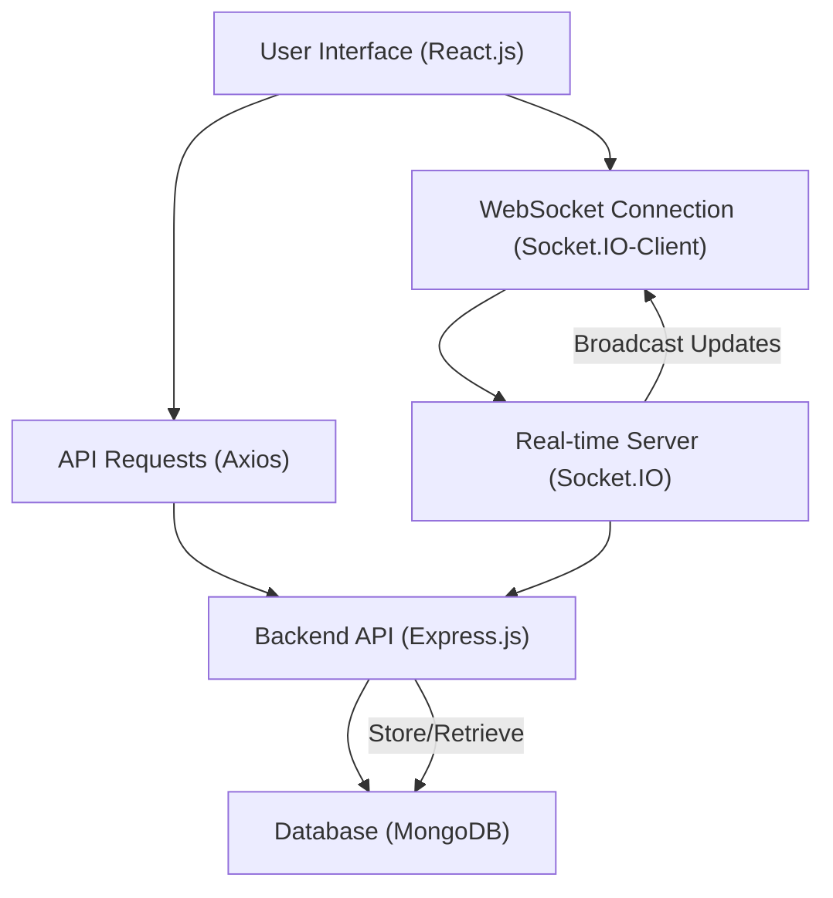
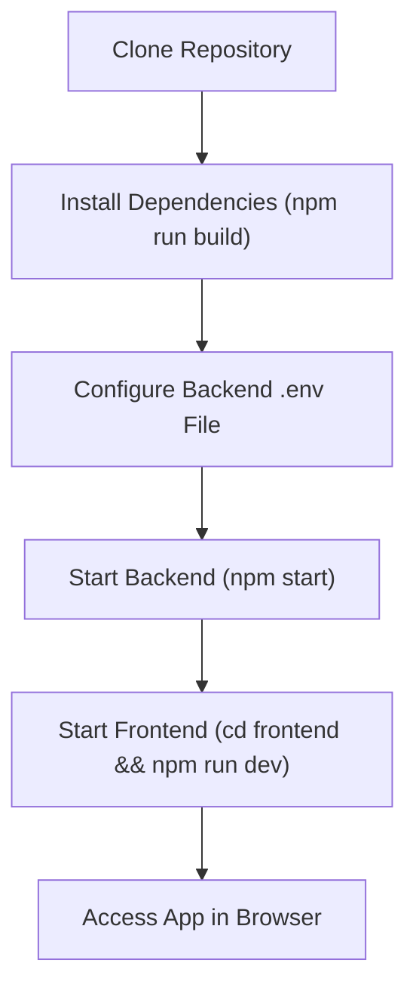

# Introduction and Project Setup

<TOC />

This document provides a comprehensive introduction to the Chat-App-MERN project, detailing its purpose, the core technologies employed, and the steps required to get the application up and running locally. This MERN (MongoDB, Express.js, React, Node.js) stack application serves as a real-time chat platform, demonstrating modern web development practices.

The project is built upon foundational concepts often found in full-stack applications, integrating a robust backend with a dynamic frontend to deliver a seamless user experience.

## Project Overview

The Chat-App-MERN project is designed to be a fully functional real-time chat application. Users can register, log in, send messages to each other, and see message updates in real-time. It leverages `socket.io` for bidirectional communication, ensuring instant message delivery and a responsive user interface.

**Key Features:**

*   **User Authentication**: Secure user registration and login using JWT (JSON Web Tokens) and `bcryptjs` for password hashing.
*   **Real-time Messaging**: Instant message sending and receiving powered by WebSockets via `socket.io`.
*   **MongoDB Database**: Persistent storage for user data and chat messages.
*   **Scalable Architecture**: A clear separation of concerns between frontend and backend.
*   **Responsive UI**: A modern, interactive user interface built with React.js.

## Technologies Used

This project is a classic MERN stack application, augmented with several additional libraries and tools to enhance development experience and application functionality.

| Category   | Technology   | Description                                                                 |
| :--------- | :----------- | :-------------------------------------------------------------------------- |
| **Backend** | Node.js      | JavaScript runtime environment.                                             |
|            | Express.js   | Web application framework for Node.js, handling API routes and middleware.  |
|            | MongoDB      | NoSQL database for storing user profiles and chat messages.                 |
|            | Socket.IO    | Enables real-time, bidirectional, event-based communication.                |
|            | JWT          | For secure user authentication and authorization.                           |
|            | Cloudinary   | Cloud-based image and video management (for profile pictures, if implemented). |
| **Frontend** | React.js     | JavaScript library for building user interfaces.                            |
|            | Vite         | Fast build tool for modern web projects.                                    |
|            | Zustand      | A small, fast, and scalable bearbones state-management solution for React. |
|            | Axios        | Promise-based HTTP client for making API requests.                         |
|            | Tailwind CSS | Utility-first CSS framework for rapid UI development.                       |
|            | DaisyUI      | Tailwind CSS component library.                                             |
| **Dev Tools** | Nodemon      | Automatically restarts the Node.js server during development.               |
|            | ESLint       | Pluggable linting utility for JavaScript.                                   |

### Architecture Overview

The following diagram illustrates the high-level architecture of the MERN Chat App, showcasing the interaction between its main components:





## Project Structure

The project is organized into a monorepo-like structure, with a root `package.json` to manage overall scripts and separate `backend` and `frontend` directories, each with its own `package.json` for managing specific dependencies and scripts.

```bash
.
├── backend/                  # Node.js/Express.js server, MongoDB models, API routes, Socket.IO
│   ├── src/                  # Backend source code
│   │   ├── controllers/      # Request handlers
│   │   ├── models/           # Mongoose schemas
│   │   ├── routes/           # API endpoints
│   │   ├── utils/            # Utility functions
│   │   └── index.js          # Entry point for backend server
│   ├── package.json          # Backend dependencies and scripts
│   └── ...
├── frontend/                 # React.js application
│   ├── public/               # Static assets
│   ├── src/                  # React source code
│   │   ├── assets/           # Images, icons
│   │   ├── components/       # Reusable UI components
│   │   ├── pages/            # Application views
│   │   ├── store/            # Zustand stores
│   │   ├── App.jsx           # Main React component
│   │   └── main.jsx          # React entry point
│   ├── package.json          # Frontend dependencies and scripts
│   └── ...
├── package.json              # Root-level scripts for managing both backend and frontend
├── README.md                 # Project README
└── ...
```

### Root `package.json`

The root `package.json` simplifies the build and start processes by orchestrating commands for both the frontend and backend.

```json
{
  "name": "chatapp",
  "version": "1.0.0",
  "main": "index.js",
  "scripts": {
    "build" : "npm install --prefix backend && npm install --prefix frontend && npm run build --prefix frontend",
    "start" : "npm run start --prefix backend"
  },
  "keywords": [],
  "author": "",
  "license": "ISC",
  "description": ""
}
```
*   The `build` script automates the installation of dependencies for both `backend` and `frontend` and then triggers the frontend build process.
    *   [View on GitHub](https://github.com/shinymack/Chat-App-MERN/blob/main/package.json#L6-L6)
*   The `start` script specifically runs the backend application.
    *   [View on GitHub](https://github.com/shinymack/Chat-App-MERN/blob/main/package.json#L7-L7)

### Backend `package.json`

The backend `package.json` details server-side dependencies and specific development and production scripts for the Node.js/Express application.

```json
{
  "name": "backend",
  "version": "1.0.0",
  "main": "src/index.js",
  "scripts": {
    "dev": "nodemon src/index.js",
    "start": "node src/index.js"
  },
  "dependencies": {
    "bcryptjs": "^2.4.3",
    "cloudinary": "^2.5.1",
    "cookie-parser": "^1.4.7",
    "dotenv": "^16.4.7",
    "express": "^4.21.2",
    "express-session": "^1.18.1",
    "jsonwebtoken": "^9.0.2",
    "mongoose": "^8.9.5",
    "passport": "^0.7.0",
    "passport-google-oauth20": "^2.0.0",
    "socket.io": "^4.8.1"
  },
  "devDependencies": {
    "nodemon": "^3.1.9"
  }
}
```
*   The `dev` script utilizes `nodemon` for automatic server restarts during development, enhancing productivity.
    *   [View on GitHub](https://github.com/shinymack/Chat-App-MERN/blob/main/backend/package.json#L6-L6)
*   Key dependencies like `mongoose` (for MongoDB interaction), `express` (web framework), `jsonwebtoken` (auth), `bcryptjs` (password hashing), `socket.io` (real-time), and `cloudinary` (for image management) are listed.
    *   [View on GitHub](https://github.com/shinymack/Chat-App-MERN/blob/main/backend/package.json#L13-L24)

### Frontend `package.json`

The frontend `package.json` specifies dependencies and scripts for the React.js application, managed with Vite.

```json
{
  "name": "frontend",
  "private": true,
  "version": "0.0.0",
  "type": "module",
  "scripts": {
    "dev": "vite",
    "build": "vite build",
    "lint": "eslint .",
    "preview": "vite preview",
    "mobile": "vite --host"
  },
  "dependencies": {
    "axios": "^1.7.9",
    "cors": "^2.8.5",
    "lucide-react": "^0.471.1",
    "react": "^18.3.1",
    "react-dom": "^18.3.1",
    "react-hot-toast": "^2.5.1",
    "react-icons": "^5.5.0",
    "react-router-dom": "^7.1.1",
    "socket.io-client": "^4.8.1",
    "zustand": "^5.0.3"
  },
  "devDependencies": {
    "@vitejs/plugin-react": "^4.3.4",
    "autoprefixer": "^10.4.20",
    "daisyui": "^4.12.23",
    "postcss": "^8.5.0",
    "tailwindcss": "^3.4.17",
    "vite": "^6.3.5"
  }
}
```
*   The `dev` script starts the Vite development server, enabling hot module replacement and a fast feedback loop.
    *   [View on GitHub](https://github.com/shinymack/Chat-App-MERN/blob/main/frontend/package.json#L7-L7)
*   Key dependencies include `react`, `react-router-dom` (for routing), `axios` (API calls), `socket.io-client` (real-time client), and `zustand` (state management).
    *   [View on GitHub](https://github.com/shinymack/Chat-App-MERN/blob/main/frontend/package.json#L14-L23)
*   Development dependencies like `tailwindcss`, `daisyui`, `postcss`, and `autoprefixer` are crucial for the styling and build process.
    *   [View on GitHub](https://github.com/shinymack/Chat-App-MERN/blob/main/frontend/package.json#L26-L34)

## Initial Setup

To get the Chat-App-MERN project running on your local machine, follow these steps. This process assumes you have Node.js and npm (or yarn) installed.

### 1. Clone the Repository

First, clone the project repository from GitHub to your local machine:

```bash
git clone https://github.com/shinymack/Chat-App-MERN.git
cd Chat-App-MERN
```

### 2. Install Dependencies

Use the root `build` script to install all necessary dependencies for both the backend and frontend. This single command streamlines the setup process:

```bash
npm run build
# This command effectively runs:
# npm install --prefix backend
# npm install --prefix frontend
# npm run build --prefix frontend
```
This will install `node_modules` in both the `backend` and `frontend` directories.

### 3. Environment Variables (Backend)

The backend requires environment variables, particularly for database connection and JWT secrets. Create a `.env` file in the `backend/` directory.

Example `backend/.env` file:

```dotenv
MONGO_DB_URI="mongodb+srv://<username>:<password>@cluster0.abcde.mongodb.net/chatapp?retryWrites=true&w=majority"
PORT=5000
JWT_SECRET="your_jwt_secret_key"
CLOUDINARY_CLOUD_NAME="your_cloudinary_cloud_name"
CLOUDINARY_API_KEY="your_cloudinary_api_key"
CLOUDINARY_API_SECRET="your_cloudinary_api_secret"
```
*   **`MONGO_DB_URI`**: Replace `<username>`, `<password>`, and `cluster0.abcde` with your MongoDB Atlas connection string or your local MongoDB URI.
*   **`JWT_SECRET`**: A strong, random string for signing JSON Web Tokens.
*   **Cloudinary Credentials**: If you plan to use image uploads (e.g., for user profile pictures), provide your Cloudinary credentials. These can be omitted if not using image uploads.

### 4. Start the Backend Server

Navigate to the root of the project and run the `start` script, which will initiate the backend server:

```bash
npm start
# This command effectively runs:
# npm run start --prefix backend
# which then executes: node src/index.js inside the backend folder
```
The backend server should start on `http://localhost:5000` (or the port specified in your `.env` file).

### 5. Start the Frontend Development Server

Open a **new terminal window** (keep the backend server running in the first terminal), navigate to the root of the project, and then into the `frontend` directory:

```bash
cd frontend
npm run dev
```
The frontend development server will start, usually on `http://localhost:5173` (or another available port). Open this URL in your web browser to access the application.

### Setup Flow Diagram

Here's a visual representation of the initial setup steps:





## Key Integration Points

*   **Authentication Flow**: The frontend sends user credentials to `/api/auth/login` or `/api/auth/signup`. The backend validates these, creates a JWT, and sends it back as an `httpOnly` cookie. Subsequent requests from the frontend automatically include this cookie for authentication.
*   **Real-time Communication**: After successful authentication, the frontend establishes a WebSocket connection to the backend using `socket.io-client`. The backend's `socket.io` server listens for events (e.g., `sendMessage`), processes them (e.g., saves to MongoDB), and broadcasts updates (e.g., `newMessage`) to relevant clients.
*   **API Interactions**: The `axios` library in the frontend is used to make RESTful API calls to the Express.js backend for operations like fetching messages, user profiles, or initiating chat sessions.
*   **State Management**: `Zustand` on the frontend manages global application state, such as the currently logged-in user, active chat, and incoming messages, ensuring a reactive UI.

Next: [Backend Architecture and APIs](./2_backend-architecture-apis.mdx)