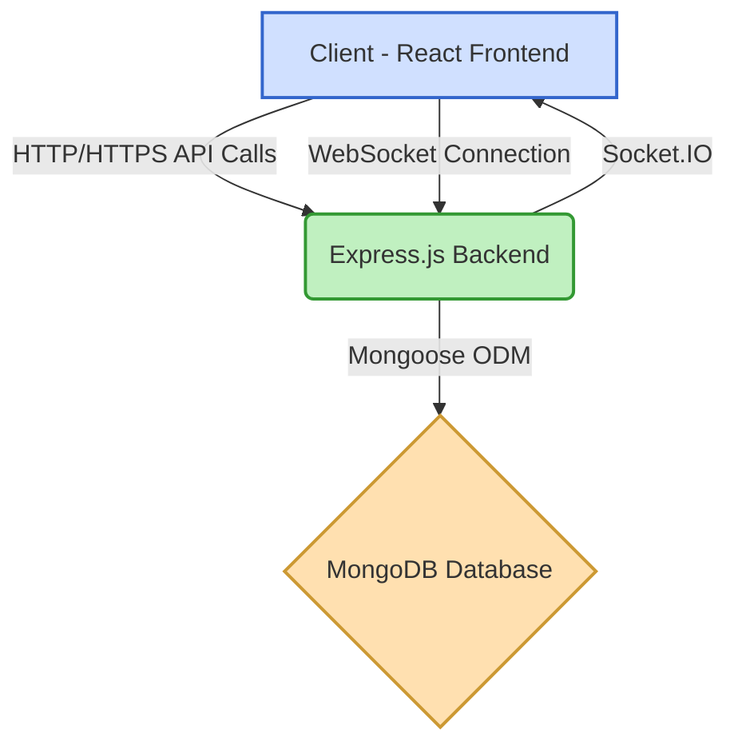
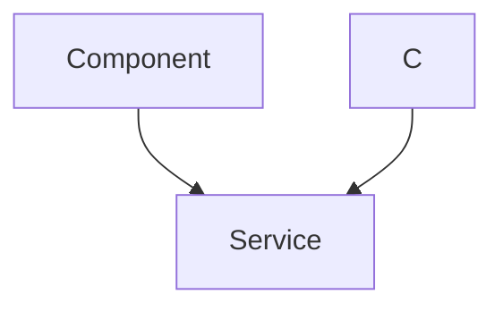

---
title: "Introduction and Project Setup"
description: "High-level overview of the Chat-App-MERN project, including its purpose, technologies, and initial setup instructions."
sidebar_position: 1
---

# Introduction and Project Setup

<TOC />

This document provides a comprehensive overview of the MERN Chat-App project, detailing its purpose, core functionalities, underlying technologies, and initial setup procedures. The application is designed to facilitate real-time communication between users, leveraging a robust MERN (MongoDB, Express.js, React, Node.js) stack for a full-stack, scalable solution.

## System Purpose

The MERN Chat-App aims to deliver a modern, responsive, and efficient platform for instant messaging. Its primary purpose is to enable users to:

*   **Register and Authenticate:** Securely create accounts and log in to access chat functionalities.
*   **Real-time Messaging:** Send and receive messages instantly within one-on-one or group conversations.
*   **User Management:** View online status, manage contacts, and initiate new chats.
*   **Scalable Communication:** Support a growing number of users and messages without significant performance degradation, particularly through WebSocket integration.

## Architecture

The application adopts a standard MERN stack architecture, which inherently provides a three-tier structure: frontend (React), backend (Express.js, Node.js), and database (MongoDB). This separation of concerns allows for independent development, deployment, and scaling of each component.

The interaction flow generally involves the React frontend communicating with the Express.js backend via RESTful APIs for data operations (authentication, user profiles, message history) and WebSocket connections for real-time messaging. MongoDB serves as the persistent data store for user information, messages, and conversation details.





*Figure 1: High-Level System Architecture Diagram.*

## Technology Stack

The project is built upon the robust and popular MERN stack, augmented with several libraries and frameworks to enhance development efficiency and user experience.

| Layer       | Technology        | Purpose                                                                | Key Libraries/Tools                                                     |
| :---------- | :---------------- | :--------------------------------------------------------------------- | :---------------------------------------------------------------------- |
| **Frontend** | React             | User Interface, interactive components, client-side routing.           | `react`, `react-dom`, `react-router-dom`, `axios`, `socket.io-client`, `zustand`, `daisyui`, `tailwindcss`, `vite` |
| **Backend** | Node.js / Express | RESTful API, WebSocket server, business logic, database interaction.  | *Not explicitly detailed in provided package.json but implied by MERN* |
| **Database** | MongoDB           | NoSQL document database for scalable and flexible data storage.        | *Not explicitly detailed in provided package.json but implied by MERN* |
| **Styling** | Tailwind CSS      | Utility-first CSS framework for rapid UI development.                  | `tailwindcss`, `daisyui`                                                |
| **Real-time** | Socket.IO         | Bidirectional event-based communication between client and server.     | `socket.io-client`                                                      |

### Frontend Dependencies

The `frontend/package.json` [View on GitHub](https://github.com/shinymack/Chat-App-MERN/blob/main/frontend/package.json) file outlines the client-side dependencies, essential for building the user interface and handling client-side logic.

```json
{
  "name": "frontend",
  "private": true,
  "version": "0.0.0",
  "type": "module",
  "scripts": {
    "dev": "vite",
    "build": "vite build",
    "lint": "eslint .",
    "preview": "vite preview",
    "mobile": "vite --host"
  },
  "dependencies": {
    "axios": "^1.7.9",
    "cors": "^2.8.5",
    "lucide-react": "^0.471.1",
    "react": "^18.3.1",
    "react-dom": "^18.3.1",
    "react-hot-toast": "^2.5.1",
    "react-icons": "^5.5.0",
    "react-router-dom": "^7.1.1",
    "socket.io-client": "^4.8.1",
    "zustand": "^5.0.3"
  },
  "devDependencies": {
    "@eslint/js": "^9.17.0",
    "@types/react": "^18.3.18",
    "@types/react-dom": "^18.3.5",
    "@vitejs/plugin-react": "^4.3.4",
    "autoprefixer": "^10.4.20",
    "daisyui": "^4.12.23",
    "eslint": "^9.17.0",
    "eslint-plugin-react": "^7.37.2",
    "eslint-plugin-react-hooks": "^5.0.0",
    "eslint-plugin-react-refresh": "^0.4.16",
    "globals": "^15.14.0",
    "postcss": "^8.5.0",
    "tailwindcss": "^3.4.17",
    "vite": "^6.3.5"
  }
}
```
*Code Snippet 1: `frontend/package.json` [View on GitHub](https://github.com/shinymack/Chat-App-MERN/blob/main/frontend/package.json#L1-L47) detailing frontend dependencies and development scripts.*

Notable dependencies include:
*   `axios`: A promise-based HTTP client for making API requests to the backend.
*   `react-router-dom`: For declarative routing in the React application.
*   `socket.io-client`: The client-side library for establishing and managing WebSocket connections for real-time features.
*   `zustand`: A small, fast, and scalable state-management solution for React.
*   `daisyui` and `tailwindcss`: For styling and component theming, providing a utility-first approach to UI development.
*   `vite`: A modern build tool that provides a faster and leaner development experience for web projects.

## Project Setup

To get the MERN Chat-App running locally, you'll need to clone the repository and install dependencies for both the frontend and backend. The root `package.json` [View on GitHub](https://github.com/shinymack/Chat-App-MERN/blob/main/package.json) provides convenient scripts for this.

### Initializing the Project

The root `package.json` contains a `build` script designed to streamline the setup process by installing dependencies in both the `backend` (implied by MERN stack) and `frontend` directories, and then building the frontend application.

```json
{
  "name": "chatapp",
  "version": "1.0.0",
  "main": "index.js",
  "scripts": {
    "build" : "npm install --prefix backend && npm install --prefix frontend && npm run build --prefix frontend",
    "start" : "npm run start --prefix backend"
  },
  "keywords": [],
  "author": "",
  "license": "ISC",
  "description": ""
}
```
*Code Snippet 2: `package.json` [View on GitHub](https://github.com/shinymack/Chat-App-MERN/blob/main/package.json#L1-L10) illustrating root-level scripts for project setup and execution.*

To set up the project:

1.  **Clone the Repository:**
    ```bash
    git clone https://github.com/shinymack/Chat-App-MERN.git
    cd Chat-App-MERN
    ```

2.  **Install Dependencies and Build Frontend:**
    Execute the `build` script from the root directory. This command will navigate into the `backend` and `frontend` subdirectories, install their respective `npm` dependencies, and then build the frontend for production.
    ```bash
    npm run build
    ```
    This single command simplifies the initial setup significantly, ensuring all required packages are installed and the frontend static assets are generated.

3.  **Start the Application:**
    Once built, you can start the backend server using the `start` script defined in the root `package.json`. This script assumes a `start` command exists within the `backend` directory's `package.json`.
    ```bash
    npm run start
    ```
    This will typically launch the Node.js/Express backend server, which will then serve the React frontend (or expose an API for the frontend to consume separately during development).

### Frontend Development Server

For active frontend development, you can leverage the `dev` script within the `frontend` directory. This uses Vite's development server for hot module reloading and a fast development loop.

```bash
cd frontend
npm run dev
```
To expose the Vite development server to other devices on the network, which is useful for mobile testing, the `mobile` script is available:

```bash
cd frontend
npm run mobile
```
This command starts the Vite development server with the `--host` flag, making it accessible via your local IP address.

## Key Integration Points

The successful operation of the MERN Chat-App hinges on several critical integration points between its frontend and backend components:

*   **API Calls for Authentication and Data:** The frontend uses `axios` to make HTTP requests to the backend for user registration, login, fetching user profiles, and retrieving message history. These are typically RESTful API endpoints.
*   **Real-time Communication with Socket.IO:** This is the backbone of the chat functionality. After authentication, the frontend establishes a WebSocket connection with the backend using `socket.io-client`. This persistent connection allows for instant message sending and receiving, as well as real-time updates on user status (online/offline, typing indicators).
*   **State Management (Zustand):** The frontend leverages `zustand` to manage global application state, including user authentication status, current chat room, message queues, and other UI-related states. This ensures a consistent and responsive user experience as data flows from the backend.
*   **Environment Variables:** Best practices dictate using environment variables (e.g., `.env` files, or Vite's `import.meta.env` for frontend) for sensitive information like API keys, database connection strings, and backend server URLs. This allows for flexible configuration across different deployment environments (development, staging, production) without altering codebase.
*   **CORS Configuration:** Given that the frontend and backend are likely served on different ports or domains during development (and potentially in production), Cross-Origin Resource Sharing (CORS) must be correctly configured on the Express.js backend. The frontend `package.json` includes `cors` as a dependency, which suggests the backend also uses it to allow requests from the frontend origin.

### Example Real-time Message Flow

The real-time messaging is a core feature, relying heavily on Socket.IO.





*Figure 2: Real-time Message Flow Diagram illustrating Socket.IO communication.*

This sequence highlights the immediate feedback and delivery expected in a chat application. Scalability insights here include optimizing database writes, efficient Socket.IO room management for group chats, and potentially using a message queue for high-throughput scenarios to decouple message processing from immediate sending.

Next: [Backend Architecture and API](./2_backend-architecture-api.mdx)
```