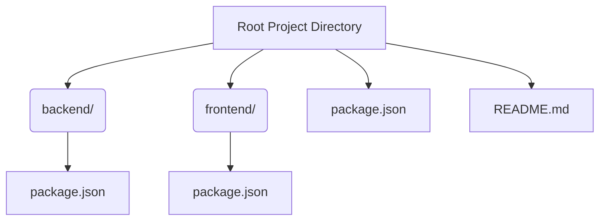
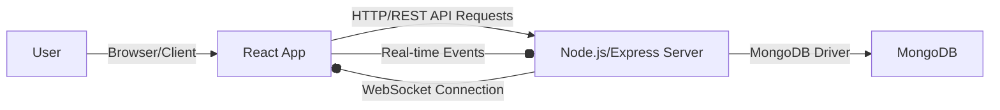

```mdx
---
title: "Introduction & Setup"
description: "High-level overview of the Chat-App-MERN project and initial setup instructions for both frontend and backend."
sidebar_position: 1
---

# Introduction & Setup
<TOC />

This section provides a high-level overview of the MERN Chatapp project, outlining its purpose, core technologies, and initial setup instructions. The project is a real-time chat application built using the MERN (MongoDB, Express.js, React, Node.js) stack, demonstrating a full-stack approach to web development with an emphasis on interactive, real-time communication.

## System Purpose & Overview

The MERN Chatapp aims to provide a functional foundation for a real-time messaging platform. It allows users to communicate instantly, leveraging the power of WebSockets for immediate message delivery. The architecture is designed to be scalable and maintainable, separating concerns between the frontend user interface, the backend API, and the database.

### Key Features
*   **Real-time Messaging**: Instant message delivery using WebSocket technology.
*   **MERN Stack**: Utilizes MongoDB for data storage, Express.js for the backend API, React for the frontend user interface, and Node.js as the JavaScript runtime environment.
*   **Modular Project Structure**: Separate `backend` and `frontend` directories facilitate development and deployment.

### Technology Stack

The project leverages a robust set of technologies, typical for modern full-stack JavaScript applications.

| Component      | Technology    | Role                                               |
| :------------- | :------------ | :------------------------------------------------- |
| **Frontend**   | React         | User Interface, interactive components             |
| **Backend API**| Express.js    | RESTful API endpoints, server-side logic           |
| **Database**   | MongoDB       | NoSQL database for message and user data persistence |
| **Runtime**    | Node.js       | JavaScript runtime for backend execution           |
| **Real-time**  | Socket.IO (implied) | Bidirectional communication for real-time features |

### Core Project Structure

The project maintains a clear separation of concerns, with distinct directories for the backend and frontend components. This structure is common in full-stack applications, promoting independent development, testing, and deployment of each part.





## Initial Setup

To get the MERN Chatapp running locally, you need to set up both the backend and frontend environments. The `package.json` at the root level defines convenience scripts to streamline this process.

### Prerequisites

Before proceeding, ensure you have the following installed on your system:

*   **Node.js**: Version 14 or higher (includes npm)
*   **npm**: Node Package Manager (comes with Node.js)
*   **Git**: For cloning the repository

### Cloning the Repository

First, clone the project repository to your local machine:

```bash
git clone https://github.com/shinymack/Chat-App-MERN.git
cd Chat-App-MERN
```

### Dependency Installation and Building

The root `package.json` includes a `build` script designed to automate the installation of dependencies for both the backend and frontend, and then build the frontend application.

The `build` script from the root `package.json` ([package.json#L5-L8](https://github.com/shinymack/Chat-App-MERN/blob/main/package.json#L5-L8)):

```json
{
  "name": "chatapp",
  "version": "1.0.0",
  "main": "index.js",
  "scripts": {
    "build" : "npm install --prefix backend && npm install --prefix frontend && npm run build --prefix frontend",
    "start" : "npm run start --prefix backend"
  },
  "keywords": [],
  "author": "",
  "license": "ISC",
  "description": ""
}
```

This script performs the following actions:
1.  `npm install --prefix backend`: Navigates into the `backend` directory and installs all its dependencies.
2.  `npm install --prefix frontend`: Navigates into the `frontend` directory and installs all its dependencies.
3.  `npm run build --prefix frontend`: Navigates into the `frontend` directory and executes its `build` script, typically compiling the React application into static assets.

To execute this, run the following command in the project root directory:

```bash
npm run build
```

This process ensures that all necessary packages are installed and the frontend is ready for deployment or serving.

### Starting the Application

Once dependencies are installed and the frontend is built, you can start the backend server using another convenience script defined in the root `package.json`.

The `start` script from the root `package.json` ([package.json#L7](https://github.com/shinymack/Chat-App-MERN/blob/main/package.json#L7)):

```json
    "start" : "npm run start --prefix backend"
```

This script executes `npm run start` within the `backend` directory, which typically starts the Node.js/Express server.

To start the application, run:

```bash
npm run start
```

### Project Flow and Interaction

After setup and startup, the application operates with the frontend client making requests to the backend API, and both potentially leveraging WebSockets for real-time updates.





This diagram illustrates the core interactions:
*   The `User` interacts with the `React App` (Frontend) via their browser.
*   The `Frontend` communicates with the `Backend` through HTTP/REST API calls for data retrieval, authentication, and other operations.
*   The `Backend` persists and retrieves data from `MongoDB`.
*   A bidirectional `WebSocket Connection` (likely Socket.IO) exists between the `Frontend` and `Backend` for real-time messaging and events.

## Key Insights & Best Practices

*   **Monorepo-like Structure**: While not a true monorepo with advanced tooling, the project uses a single root repository to manage both frontend and backend, which is convenient for smaller projects and allows for simplified shared scripts.
*   **Separation of Concerns**: The distinct `backend` and `frontend` folders reinforce the principle of separation of concerns, making it easier to manage code, scale components independently, and assign different teams if the project grows.
*   **Automated Setup Scripts**: The `build` and `start` scripts in the root `package.json` are excellent examples of how to streamline developer experience and ensure consistent setup across different environments.
*   **Real-time Capabilities**: The MERN stack, when combined with a technology like Socket.IO (implied for a chat app), is highly effective for building real-time applications, providing instant user feedback and interaction.

Next: [Backend Development](./2_backend_development.mdx)
```