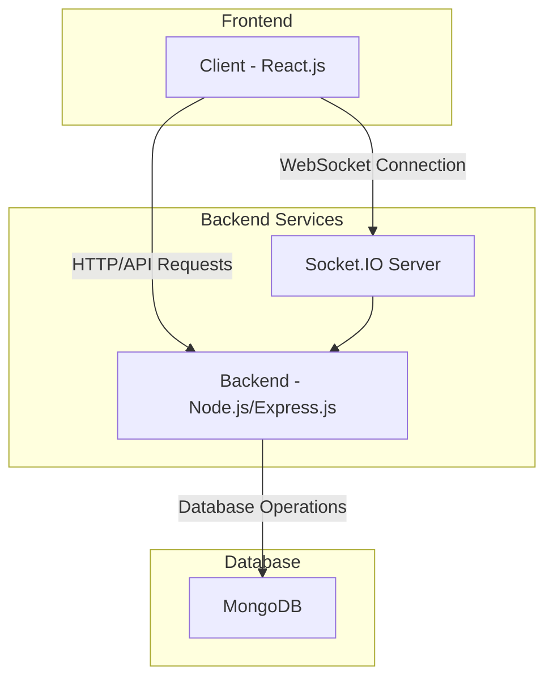
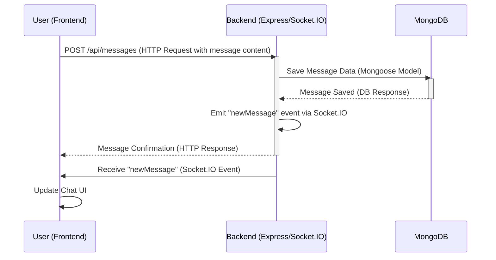

```mdx
---
title: "Introduction & Setup"
description: "An overview of the Chat-App-MERN project, its core features, and initial setup instructions."
sidebar_position: 1
---

# Introduction & Setup
<TOC />

## System Purpose
The MERN Chat App is a full-stack, real-time messaging application built using the MERN (MongoDB, Express.js, React, Node.js) stack. It provides users with the ability to register, log in, and engage in real-time conversations. The application emphasizes a modern, responsive user interface and robust backend services for managing user data and message persistence.

Key functionalities include:
*   **User Authentication**: Secure user registration and login functionality, including session management and Google OAuth integration.
*   **Real-time Messaging**: Instantaneous message exchange between users leveraging WebSocket technology.
*   **User Profiles**: Management of user information.
*   **Scalable Architecture**: Designed with a clear separation of concerns to facilitate future enhancements and maintenance.

This project is inspired by and credits the tutorial available at [https://youtu.be/ntKkVrQqBYY](https://youtu.be/ntKkVrQqBYY?si=qz02jMCQ80RT1jaH).

## System Architecture Overview
The MERN Chat App adheres to a classic three-tier architecture, separating the concerns of the presentation layer, the business logic layer, and the data layer. This design promotes modularity, scalability, and ease of maintenance.

*   **Presentation Layer (Frontend)**: Developed with React, this layer handles the user interface, user interactions, and makes API calls to the backend. It ensures a dynamic and responsive user experience.
*   **Business Logic Layer (Backend)**: Built with Node.js and Express.js, this layer acts as the application's API server. It manages user authentication, message processing, and interactions with the database. Real-time communication is facilitated by Socket.IO.
*   **Data Layer (Database)**: MongoDB, a NoSQL database, stores all application data, including user profiles, messages, and chat room information.





## Technology Stack
The MERN Chat App leverages a robust set of technologies, with a clear distinction between frontend and backend components. The root `package.json` coordinates the build and start processes for both.

| Layer    | Technology       | Version (from `package.json`) | Purpose                                             |
| :------- | :--------------- | :------------------------------ | :-------------------------------------------------- |
| **Root** | Node.js          | N/A                             | Orchestrates `build` and `start` scripts.           |
| **Backend** | Node.js/Express.js | ^4.21.2                         | RESTful API, server logic, authentication.          |
|          | MongoDB/Mongoose | ^8.9.5                          | NoSQL database, ODM for Node.js.                    |
|          | Socket.IO        | ^4.8.1                          | Real-time bidirectional event-based communication.  |
|          | bcryptjs         | ^2.4.3                          | Password hashing.                                   |
|          | jsonwebtoken     | ^9.0.2                          | User authentication via JWT.                        |
|          | passport-google-oauth20 | ^2.0.0                     | Google OAuth strategy for Passport.js.              |
|          | cloudinary       | ^2.5.1                          | Cloud-based image and video management.             |
|          | dotenv           | ^16.4.7                         | Environment variable management.                    |
|          | cookie-parser    | ^1.4.7                          | Parse Cookie header and populate `req.cookies`.     |
|          | nodemon (dev)    | ^3.1.9                          | Automatically restarts server on file changes.      |
| **Frontend** | React            | ^18.3.1                         | UI library for building interactive user interfaces.|
|          | Vite             | ^6.3.5                          | Fast build tool for modern web projects.            |
|          | Zustand          | ^5.0.3                          | Lightweight state management library.               |
|          | Axios            | ^1.7.9                          | Promise-based HTTP client for the browser and Node.js.|
|          | Socket.IO Client | ^4.8.1                          | Client-side library for Socket.IO.                  |
|          | React Router DOM | ^7.1.1                          | Declarative routing for React.                      |
|          | Tailwind CSS     | ^3.4.17                         | Utility-first CSS framework.                        |
|          | DaisyUI          | ^4.12.23                        | Tailwind CSS component library.                     |
|          | Lucide React     | ^0.471.1                        | Beautifully simple and consistent icons.            |
|          | react-hot-toast  | ^2.5.1                          | Headless, accessible and themeable React Hot Toast. |

The root `package.json` defines commands to streamline the setup process for the monorepo:
```json
{
  "name": "chatapp",
  "version": "1.0.0",
  "main": "index.js",
  "scripts": {
    "build" : "npm install --prefix backend && npm install --prefix frontend && npm run build --prefix frontend",
    "start" : "npm run start --prefix backend"
  },
  "keywords": [],
  "author": "",
  "license": "ISC",
  "description": ""
}
```
This configuration ([package.json#L4-L8](https://github.com/shinymack/Chat-App-MERN/blob/main/package.json#L4-L8)) ensures that running `npm run build` from the root directory will install dependencies for both the `backend` and `frontend`, and then build the frontend application. Similarly, `npm run start` will initiate the backend server.

The backend dependencies highlight the core functionalities of the server:
```json
{
  "name": "backend",
  "version": "1.0.0",
  "main": "src/index.js",
  "scripts": {
    "dev": "nodemon src/index.js",
    "start": "node src/index.js"
  },
  "author": "",
  "type": "module",
  "license": "ISC",
  "description": "",
  "dependencies": {
    "bcryptjs": "^2.4.3",
    "cloudinary": "^2.5.1",
    "cookie-parser": "^1.4.7",
    "dotenv": "^16.4.7",
    "express": "^4.21.2",
    "express-session": "^1.18.1",
    "jsonwebtoken": "^9.0.2",
    "mongoose": "^8.9.5",
    "passport": "^0.7.0",
    "passport-google-oauth20": "^2.0.0",
    "socket.io": "^4.8.1"
  },
  "devDependencies": {
    "nodemon": "^3.1.9"
  }
}
```
The dependencies in `backend/package.json` ([backend/package.json#L17-L38](https://github.com/shinymack/Chat-App-MERN/blob/main/backend/package.json#L17-L38)) showcase the array of tools used for secure authentication (`bcryptjs`, `jsonwebtoken`, `passport-google-oauth20`), database interaction (`mongoose`), real-time communication (`socket.io`), and environment management (`dotenv`).

## Core Application Features
The MERN Chat App focuses on delivering a seamless and interactive real-time messaging experience, underpinned by robust authentication and efficient data handling.

*   **User Authentication & Authorization**:
    *   **Local Strategy**: Users can sign up and log in using email and password, securely stored with `bcryptjs` hashing.
    *   **Google OAuth2.0**: Integration with `passport-google-oauth20` allows for convenient social login, enhancing user experience and simplifying the registration process.
    *   **JWT & Cookie-based Sessions**: `jsonwebtoken` is used to create secure, stateless tokens for authenticated users, managed through `cookie-parser` for session persistence.
*   **Real-time Chat Functionality**:
    *   Leveraging `socket.io`, the application provides instantaneous message delivery, typing indicators, and online status updates without constant polling.
    *   This is crucial for a responsive chat application, ensuring messages appear almost immediately after being sent.
*   **Media Handling with Cloudinary**:
    *   The backend integrates `cloudinary` to manage and store user-uploaded media files (e.g., profile pictures, image attachments), offloading storage concerns from the main server.
*   **State Management with Zustand**:
    *   On the frontend, `zustand` is used for efficient and lightweight global state management, handling user data, chat states, and real-time updates across components. This ensures a predictable and easy-to-manage application state.
*   **Routing with React Router DOM**:
    *   `react-router-dom` manages client-side navigation, allowing for a single-page application experience with distinct URLs for different views (e.g., login, chat rooms, profile).

The frontend's `package.json` reflects the tools for building an interactive and modern UI:
```json
{
  "name": "frontend",
  "private": true,
  "version": "0.0.0",
  "type": "module",
  "scripts": {
    "dev": "vite",
    "build": "vite build",
    "lint": "eslint .",
    "preview": "vite preview",
    "mobile": "vite --host"
  },
  "dependencies": {
    "axios": "^1.7.9",
    "cors": "^2.8.5",
    "lucide-react": "^0.471.1",
    "react": "^18.3.1",
    "react-dom": "^18.3.1",
    "react-hot-toast": "^2.5.1",
    "react-icons": "^5.5.0",
    "react-router-dom": "^7.1.1",
    "socket.io-client": "^4.8.1",
    "zustand": "^5.0.3"
  },
  "devDependencies": {
    "@eslint/js": "^9.17.0",
    "@types/react": "^18.3.18",
    "@types/react-dom": "^18.3.5",
    "@vitejs/plugin-react": "^4.3.4",
    "autoprefixer": "^10.4.20",
    "daisyui": "^4.12.23",
    "eslint": "^9.17.0",
    "eslint-plugin-react": "^7.37.2",
    "eslint-plugin-react-hooks": "^5.0.0",
    "eslint-plugin-react-refresh": "^0.4.16",
    "globals": "^15.14.0",
    "postcss": "^8.5.0",
    "tailwindcss": "^3.4.17",
    "vite": "^6.3.5"
  }
}
```
The `frontend/package.json` ([frontend/package.json#L13-L27](https://github.com/shinymack/Chat-App-MERN/blob/main/frontend/package.json#L13-L27)) dependencies show `axios` for HTTP requests, `socket.io-client` for real-time connectivity, and `zustand` for efficient state management. UI development is streamlined with `react`, `react-router-dom`, and styling frameworks like `tailwindcss` and `daisyui`.

### Message Flow Diagram
The following diagram illustrates a simplified flow of sending a message in the chat application:





## Project Structure
The project is organized into a monorepo structure, with distinct `backend` and `frontend` directories, and a root directory for global configurations and scripts.

```
.
├── backend/
│   ├── src/
│   │   ├── controllers/
│   │   ├── middleware/
│   │   ├── models/
│   │   ├── routes/
│   │   ├── utils/
│   │   ├── index.js
│   │   └── server.js
│   ├── .env
│   ├── package.json
│   └── ...
├── frontend/
│   ├── public/
│   ├── src/
│   │   ├── api/
│   │   ├── assets/
│   │   ├── components/
│   │   ├── hooks/
│   │   ├── pages/
│   │   ├── store/
│   │   ├── App.jsx
│   │   ├── main.jsx
│   │   └── ...
│   ├── package.json
│   ├── tailwind.config.js
│   ├── vite.config.js
│   └── ...
├── package.json
├── README.md
└── ...
```
*   **`backend/`**: Contains all server-side code. This includes API routes, controllers for handling requests, Mongoose models for database interactions, and middleware for authentication and error handling. The `src/index.js` serves as the entry point for the backend application.
*   **`frontend/`**: Houses all client-side code, primarily built with React. It includes components for UI elements, pages for different views, state management logic (using Zustand), and utility functions. `src/main.jsx` is the entry point for the React application.
*   **`package.json` (root)**: Manages global scripts for building and starting both frontend and backend components. This simplifies development workflow in a monorepo setup.
*   **`README.md`**: Provides a high-level overview of the project and initial setup instructions.

## Key Integration Points
The MERN Chat App's functionality relies heavily on several key integration points between its frontend, backend, and database components. Understanding these interactions is crucial for comprehending the system's robustness and scalability.

*   **Authentication Flow**:
    *   User credentials (email/password or Google OAuth token) are sent from the `frontend` to the `backend` via HTTP requests.
    *   The `backend` uses `bcryptjs` to hash passwords for local strategy or `passport-google-oauth20` to verify Google tokens.
    *   Upon successful authentication, `jsonwebtoken` creates a JWT, which is then sent back to the `frontend` (typically stored in an HTTP-only cookie by `cookie-parser`). This token is used to authorize subsequent API requests.
    *   **Best Practice**: Using HTTP-only cookies for JWT storage helps mitigate Cross-Site Scripting (XSS) attacks by preventing client-side JavaScript from accessing the token.
*   **Real-time Messaging with Socket.IO**:
    *   Once a user logs in, the `frontend` establishes a WebSocket connection with the `backend` using `socket.io-client`.
    *   When a message is sent from the `frontend`, it is first sent to the `backend` via a REST API endpoint (e.g., `POST /api/messages`).
    *   The `backend` saves the message to `MongoDB` via `mongoose` and then broadcasts the new message to relevant connected clients using `socket.io`. This dual approach (REST for persistence, WebSockets for real-time delivery) ensures both message durability and instant delivery.
    *   **Insight**: This separation of concerns—HTTP for initial data submission/persistence and WebSockets for real-time propagation—is a common pattern for scalable chat applications.
*   **State Management**:
    *   The `zustand` store on the `frontend` is a central point for managing application-wide state, including logged-in user details, active chat conversations, and incoming real-time messages.
    *   API responses and Socket.IO events directly trigger updates to the Zustand store, which in turn re-renders the React components, ensuring the UI reflects the latest state.
    *   **Best Practice**: Keeping the state management layer lean and focused (as with Zustand) improves performance and makes the application logic easier to debug and maintain.

Next: [Backend Architecture](./2_backend_architecture.mdx)
```