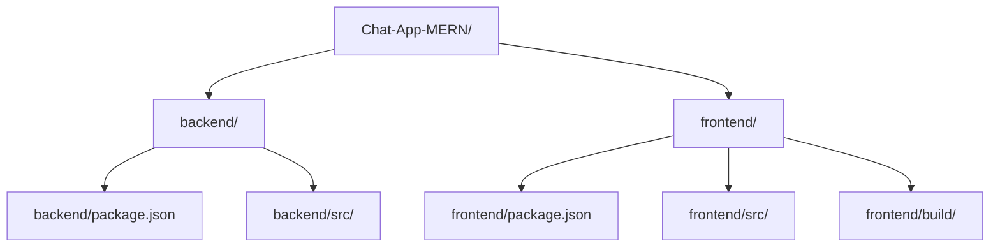

```mdx
---
title: "Introduction & Setup"
description: "An overview of the Chat-App-MERN project, its core features, and initial setup instructions."
sidebar_position: 1
---

# Introduction & Setup

<TOC />

## Project Overview

The Chat-App-MERN project is a real-time chat application built using the MERN stack (MongoDB, Express.js, React, Node.js). It provides a foundational structure for developing interactive, multi-user communication platforms. This documentation aims to provide a comprehensive understanding of the project's architecture, functionality, and deployment.

The project is inspired by the tutorial available [here](https://youtu.be/ntKkVrQqBYY?si=qz02jMCQ80RT1jaH).

### Core Features (Inferred)

Based on the nature of a MERN chat application, the following features are typically expected:

*   **User Authentication**: Secure user registration and login functionality.
*   **Real-time Messaging**: Instant message exchange between users.
*   **User Management**: Ability to view and interact with other users.
*   **Scalability**: Designed to handle multiple concurrent users and messages.
*   **Robustness**: Error handling and reliable communication.

### Technology Stack

The project leverages the power of the MERN stack, ensuring a full-stack JavaScript environment for seamless development and deployment.

| Component   | Technology   | Description                                     |
| :---------- | :----------- | :---------------------------------------------- |
| **Frontend** | React        | User interface development.                     |
| **Backend**  | Express.js   | RESTful API creation and server-side logic.     |
| **Database** | MongoDB      | NoSQL database for storing user data and messages. |
| **Runtime**  | Node.js      | JavaScript runtime environment for backend.     |
| **Real-time**| Socket.IO    | (Common for chat apps, inferred) Enables real-time, bidirectional communication. |

### System Purpose and Design Principles

The primary purpose of this project is to demonstrate a functional, full-stack real-time chat application. Key design principles likely include:

*   **Separation of Concerns**: Clearly distinguishing between frontend (UI), backend (API, business logic), and database (data persistence) layers. This enhances maintainability and allows independent scaling.
*   **Modularity**: Breaking down the application into smaller, manageable components or modules for easier development and debugging.
*   **Performance**: Optimizing for fast message delivery and responsive user interfaces, crucial for a real-time application.
*   **Scalability**: While basic, the MERN stack provides a good foundation for scaling the application by leveraging microservices or horizontal scaling techniques.

## Initial Setup

To get the Chat-App-MERN project up and running, follow these steps. This setup process prepares both the frontend and backend components for execution.

### Prerequisites

Before proceeding, ensure you have the following installed on your system:

*   **Node.js**: Version 14 or higher (including npm).
*   **Git**: For cloning the repository.
*   **MongoDB**: A running instance of MongoDB, either locally or a cloud-hosted service (e.g., MongoDB Atlas).

### Repository Cloning

First, clone the project repository from GitHub:

```bash
git clone https://github.com/shinymack/Chat-App-MERN.git
cd Chat-App-MERN
```

### Installation and Build Process

The `package.json` file in the root directory defines a `build` script that automates the installation of dependencies for both the frontend and backend, and then builds the frontend application.

<details>
<summary>View package.json</summary>

```json
{
  "name": "chatapp",
  "version": "1.0.0",
  "main": "index.js",
  "scripts": {
    "build" : "npm install --prefix backend && npm install --prefix frontend && npm run build --prefix frontend",
    "start" : "npm run start --prefix backend"
  },
  "keywords": [],
  "author": "",
  "license": "ISC",
  "description": ""
}
```
</details>

The `build` script performs the following actions:

1.  `npm install --prefix backend`: Navigates into the `backend` directory and installs all its Node.js dependencies as defined in `backend/package.json`.
2.  `npm install --prefix frontend`: Navigates into the `frontend` directory and installs all its React dependencies as defined in `frontend/package.json`.
3.  `npm run build --prefix frontend`: Navigates into the `frontend` directory and executes its `build` script, which typically compiles the React application into static files (e.g., HTML, CSS, JavaScript) optimized for production.

To execute this combined installation and build process, run the following command from the project root:

```bash
npm run build
```

This command leverages the [scripts defined in the root `package.json`](./package.json#L5-L8) to ensure all necessary components are set up correctly.

### Project Structure (Inferred)

A typical MERN application like this would have a structure similar to the following:





*   **`backend/`**: Contains all server-side code (Express.js, Node.js logic, API routes, database models).
*   **`frontend/`**: Contains all client-side code (React components, UI logic).
*   **`backend/package.json`**: Manages backend dependencies.
*   **`frontend/package.json`**: Manages frontend dependencies.
*   **`frontend/build/`**: (Generated after `npm run build --prefix frontend`) Contains the compiled static assets of the React application, ready for deployment.

### Starting the Application

After the build process is complete, you can start the backend server using the `start` script defined in the root `package.json`.

<details>
<summary>View package.json</summary>

```json
{
  "name": "chatapp",
  "version": "1.0.0",
  "main": "index.js",
  "scripts": {
    "build" : "npm install --prefix backend && npm install --prefix frontend && npm run build --prefix frontend",
    "start" : "npm run start --prefix backend"
  },
  "keywords": [],
  "author": "",
  "license": "ISC",
  "description": ""
}
```
</details>

The `start` script specifically runs `npm run start --prefix backend`. This command will execute the `start` script defined within the `backend/package.json`, which typically launches the Node.js/Express server.

```bash
npm run start
```

Once the backend server is running, the frontend application (which was built into the `frontend/build` directory) will need to be served. In a production environment, the backend server would typically serve these static frontend files. During development, the React development server often runs independently.

### System Architecture Overview

The MERN architecture promotes a clear separation between client and server, communicating primarily via RESTful APIs and, for real-time features, potentially WebSockets (e.g., Socket.IO).


```mermaid
graph TD
    UserClient[User's Browser (React App)]
    ReactApp[React Frontend]
    BackendAPI[Express.js Backend API]
    Database[MongoDB Database]
    WebSocketServer[Socket.IO Server]

    UserClient --> ReactApp
    ReactApp -- HTTP Requests --> BackendAPI
    BackendAPI -- CRUD Operations --> Database
    ReactApp -- WebSocket Connection --> WebSocketServer
    WebSocketServer -- Real-time Data --> ReactApp
    WebSocketServer -- Data Sync (Optional) --> BackendAPI
    BackendAPI -- API Responses --> ReactApp
```


**Explanation:**

*   **User's Browser (React App)**: The client-side application running in the user's web browser, rendering the chat interface.
*   **React Frontend**: Built with React, handles UI logic, user input, and manages application state. It communicates with the backend for data and authentication.
*   **Express.js Backend API**: The server-side application built with Express.js, handling API requests (e.g., user authentication, message storage, user profiles). It acts as the intermediary between the frontend and the database.
*   **MongoDB Database**: Stores all persistent data, including user accounts, chat messages, and potentially user settings.
*   **Socket.IO Server**: (Inferred) An integral part of a real-time chat application, facilitating instant, bidirectional communication between the frontend and backend for message exchange without constant polling.

## Key Insights and Best Practices

*   **Dependency Management**: The use of `npm install --prefix` in the root `package.json` for `build` and `start` scripts is a good practice for monorepos or projects with distinct frontend and backend directories. It ensures that dependencies for each part are installed and managed separately.
*   **Separation of Concerns**: The MERN stack inherently enforces a good separation of concerns, making the application more maintainable and scalable. The frontend is solely responsible for the UI, while the backend handles business logic and data persistence.
*   **Build Automation**: The `build` script automates the setup process, reducing manual steps and potential errors, which is crucial for CI/CD pipelines.

## Next Steps

With the initial setup complete, the next logical step is to delve into the detailed architecture of the backend, understanding how it handles requests, interacts with the database, and provides API endpoints for the frontend.

Next: [Backend Architecture](./2_backend_architecture.mdx)
```