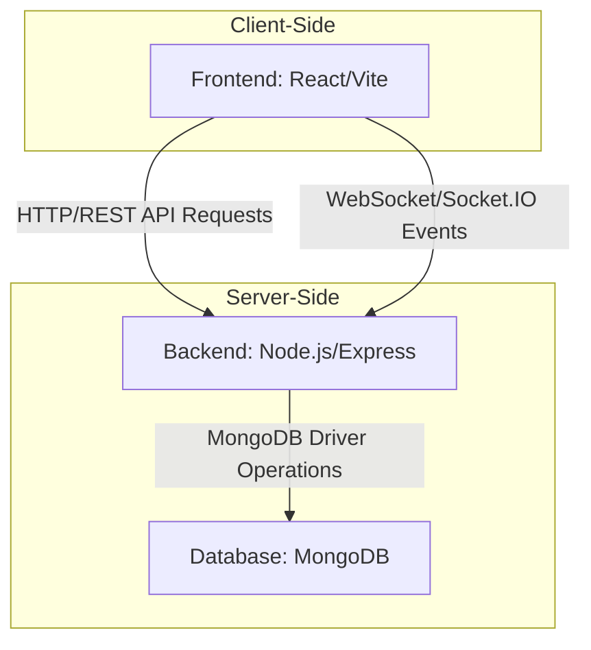

# Introduction & Setup

<TOC />

## System Purpose

The MERN Chat Application, titled "MERN Chatapp" as per its root [README.md](https://github.com/shinymack/Chat-App-MERN/blob/main/README.md), is designed to facilitate real-time communication between users. This project leverages the robust MERN (MongoDB, Express.js, React, Node.js) stack to provide a full-stack solution for a modern chat experience. The core purpose is to offer an interactive platform where users can send and receive messages instantly, showcasing typical features expected in contemporary messaging applications.

Key functionalities inherent to a chat application of this nature include:

*   **User Authentication:** Secure registration and login mechanisms for users to access the platform.
*   **Real-time Messaging:** Instantaneous transmission and reception of messages between participants.
*   **Message Persistence:** Storage of chat history for retrieval upon subsequent logins or application restarts.
*   **Scalability:** Designed with considerations for handling multiple concurrent users and high message volumes, a common requirement for real-time applications.

The project acknowledges its foundation from a tutorial, specifically crediting `https://youtu.be/ntKkVrQqBYY?si=qz02jMCKkVrQqBYY` in its [README.md](https://github.com/shinymack/Chat-App-MERN/blob/main/README.md), indicating a structured approach to development following established best practices.

## System Architecture Overview

The MERN Chat Application follows a classic three-tier architecture, a standard and scalable approach for modern web applications. This separation of concerns enhances maintainability, allows for independent scaling of components, and promotes a clear development workflow.

1.  **Presentation Layer (Frontend):** Built with React and utilizing Vite for a fast development experience, this layer is responsible for the user interface and user interaction. It sends requests to the backend for data and updates its state based on responses and real-time events.
2.  **Business Logic Layer (Backend):** Powered by Node.js with the Express.js framework, this layer handles all application logic, API routing, authentication, and communication with the database. It processes requests from the frontend, enforces business rules, and serves data. For real-time communication, a separate module (likely Socket.IO, inferred for a chat app) would manage WebSocket connections.
3.  **Data Storage Layer (Database):** MongoDB, a NoSQL database, stores application data such as user profiles, messages, and chat room information. Its flexible schema is well-suited for rapidly evolving application requirements, especially in data-intensive applications like chat.

This layered approach ensures that changes in one part of the system have minimal impact on others, promoting modularity and facilitating team collaboration.





*Figure 1: High-level System Architecture of the MERN Chat Application.* This diagram illustrates the interaction between the frontend, backend, and database components, highlighting both traditional HTTP communication and real-time WebSocket connections.

## Technology Stack

The MERN Chat Application is built upon a modern and widely adopted technology stack, primarily utilizing JavaScript across all layers for a unified development experience. The choice of technologies provides a robust foundation for building scalable, real-time applications.

| Layer          | Technology       | Purpose                                        | Version (from files) |
| :------------- | :--------------- | :--------------------------------------------- | :------------------- |
| **Frontend**   | React            | UI library for building interactive user interfaces. | N/A (implied by `frontend/README.md`) |
| **Frontend**   | Vite             | Next-generation frontend tooling for fast development and bundling. | N/A (implied by `frontend/README.md`) |
| **Backend**    | Node.js          | JavaScript runtime environment for server-side logic. | N/A (inferred from MERN) |
| **Backend**    | Express.js       | Fast, unopinionated, minimalist web framework for Node.js. | N/A (inferred from MERN) |
| **Database**   | MongoDB          | NoSQL database for flexible and scalable data storage. | N/A (inferred from MERN) |
| **Real-time**  | Socket.IO        | Library for real-time, bidirectional, event-based communication. | N/A (inferred for chat app) |
| **Tooling**    | npm              | Package manager for JavaScript dependencies.   | v9.6.7 (from `package-lock.json`) |
| **Tooling**    | ESLint           | Linter for identifying and reporting on patterns in JavaScript code. | N/A (implied by `frontend/README.md`) |
| **Tooling**    | Babel / SWC      | Transpilers for modern JavaScript syntax.      | N/A (implied by `frontend/README.md`) |

The root `package.json` file orchestrates the overall project setup, including scripts to manage both frontend and backend dependencies and build processes.

```json
{
  "name": "chatapp",
  "version": "1.0.0",
  "main": "index.js",
  "keywords": [],
  "author": "",
  "license": "ISC",
  "description": ""
}
```
*Code Snippet 1: Core metadata from the root `package.json` file. [package.json#L2-L9](https://github.com/shinymack/Chat-App-MERN/blob/main/package.json#L2-L9)*. This snippet defines the project's name, version, and the main entry point for the application.

The project utilizes `npm` scripts for managing its lifecycle, demonstrating a clear separation between frontend and backend build and start processes.

```json
  "scripts": {
    "build" : "npm install --prefix backend && npm install --prefix frontend && npm run build --prefix frontend",
    "start" : "npm run start --prefix backend"
  },
```
*Code Snippet 2: Build and start scripts from the root `package.json` file. [package.json#L5-L8](https://github.com/shinymack/Chat-App-MERN/blob/main/package.json#L5-L8)*. These commands highlight the monorepo-like structure, with distinct `backend` and `frontend` subdirectories, and sequential steps for setting up and running the application.

The frontend, based on `frontend/README.md`, uses Vite for its development environment, benefiting from its speed and modern features, alongside official React plugins.

```
# React + Vite

This template provides a minimal setup to get React working in Vite with HMR and some ESLint rules.

Currently, two official plugins are available:

- [@vitejs/plugin-react](https://github.com/vitejs/vite-plugin-react/blob/main/packages/plugin-react/README.md) uses [Babel](https://babeljs.io/) for Fast Refresh
- [@vitejs/plugin-react-swc](https://github.sw.rs/) uses [SWC](https://swc.rs/) for Fast Refresh
```
*Code Snippet 3: Excerpt from `frontend/README.md` detailing the React + Vite setup. [frontend/README.md#L1-L10](https://github.com/shinymack/Chat-App-MERN/blob/main/frontend/README.md#L1-L10)*. This snippet emphasizes the use of Vite with React, offering options for Babel or SWC for fast refresh capabilities and improved performance during development.

## Core Application Features

The MERN Chat Application, as implied by its title and technology stack, is designed to deliver a rich, interactive messaging experience. The core features revolve around user management and real-time communication.

*   **User Authentication and Authorization:** Users can register new accounts and log in securely. This system ensures that only authenticated users can access chat functionalities and interact with other users. Best practices would dictate using JSON Web Tokens (JWT) for stateless authentication between the frontend and backend.
*   **Real-time Messaging:** The most critical feature, enabling instant message exchange. This typically involves WebSockets (e.g., via Socket.IO) to maintain persistent connections between clients and the server, allowing messages to be pushed to recipients without constant polling.
*   **Message Persistence:** All sent messages are stored in the MongoDB database, ensuring that chat history is available even after users disconnect and reconnect. This provides a seamless user experience by maintaining conversation context.
*   **User Presence/Status (Implied):** While not explicitly stated in the provided files, a typical chat application would include features for showing which users are online, typing indicators, or read receipts, leveraging the real-time capabilities of Socket.IO.

The typical flow for a user interacting with the chat application, from authentication to sending a message, is depicted below:


```mermaid
flowchart LR
  User[User] -->|Initiates| SignupLogin[Signup/Login Page]
  SignupLogin -->|Credentials| BackendAuth[Backend: Authentication Service]
  BackendAuth -->|Valid?| ChatUI[Frontend: Chat Interface]
  BackendAuth --X|Invalid| SignupLogin
  ChatUI -->|Send Message Action| BackendChat[Backend: Chat Service]
  BackendChat -->|Save Message| MongoDB[Database: Messages Collection]
  MongoDB -->|Confirmation| BackendChat
  BackendChat -->|Emit Real-time Event| ChatUI
  ChatUI --.-> User[User]: Display Message
```


*Figure 2: Core Feature Flow for User Interaction and Messaging.* This flowchart illustrates the journey of a user from authentication through sending and receiving messages in real-time, highlighting the interaction between client, server, and database components.

## Project Structure

The project's `package.json` scripts (`"npm install --prefix backend && npm install --prefix frontend"`) clearly indicate a monorepo-like structure with distinct `backend` and `frontend` directories. This separation enforces modularity and allows for independent development, deployment, and scaling of each part of the application.

```
chatapp/
├── backend/
│   ├── ... (Node.js/Express application files)
│   ├── package.json
│   └── ...
├── frontend/
│   ├── public/
│   ├── src/
│   │   ├── assets/
│   │   ├── components/
│   │   ├── pages/
│   │   ├── App.jsx
│   │   └── main.jsx
│   ├── .eslintrc.cjs
│   ├── index.html
│   ├── vite.config.js
│   ├── package.json
│   └── README.md
├── package.json
├── package-lock.json
└── README.md
```
*Code Snippet 4: Inferred top-level project directory structure. [View on GitHub](https://github.com/shinymack/Chat-App-MERN/tree/main)*. This structure provides a clear separation of concerns, with the root managing overall build and start commands, and subdirectories housing specific application logic.

*   **`chatapp/`**: The root directory containing the overall project configuration files and orchestrating scripts.
*   **`backend/`**: This directory will house the Node.js and Express.js server-side application. It will contain API routes, controllers, database models, authentication logic, and real-time communication (Socket.IO) setup. It has its own `package.json` for backend-specific dependencies.
*   **`frontend/`**: This directory contains the React application built with Vite. It includes all client-side code, components, styling, static assets, and configurations for the frontend build process. It also has its own `package.json` and `README.md` ([View on GitHub](https://github.com/shinymack/Chat-App-MERN/blob/main/frontend/README.md)) for managing frontend-specific dependencies and build tools.

This organizational approach facilitates independent development cycles for the frontend and backend teams, allowing them to work concurrently while maintaining clear interface contracts.

## Key Integration Points

Effective integration between the MERN stack components is crucial for the seamless operation of the chat application.

*   **API Endpoints:** The frontend communicates with the backend primarily through RESTful API calls. These endpoints handle user authentication (login, registration), fetching chat history, user profiles, and potentially managing chat rooms. The backend's Express.js framework exposes these endpoints, parsing requests and returning JSON responses.
*   **Real-time WebSockets:** For instantaneous message delivery and updates (like user presence), the frontend establishes a WebSocket connection (via Socket.IO) with the backend. The backend manages these connections, broadcasts messages to relevant clients, and handles real-time events. This is distinct from HTTP requests and is essential for a true real-time experience.
*   **Database Interactions:** The backend serves as the sole interface to the MongoDB database. It performs CRUD (Create, Read, Update, Delete) operations on collections for users, messages, and any other application-specific data. Using an ODM (Object Data Modeling) library like Mongoose (common with MongoDB and Node.js) can streamline these interactions.
*   **Authentication Flow:** User authentication involves a multi-step process: frontend sends credentials, backend validates, issues a token (e.g., JWT), which frontend stores (e.g., in local storage). Subsequent API requests include this token for authorization, allowing the backend to verify the user's identity and permissions.

**Best Practices:**

*   **Separation of Concerns:** Maintain clear boundaries between frontend UI, backend logic, and database operations. This promotes code organization, testability, and easier debugging.
*   **Scalability:** Design the backend with statelessness in mind (especially for REST APIs) and utilize a real-time library like Socket.IO that supports horizontal scaling (e.g., with Redis adapter). MongoDB's sharding capabilities can further enhance database scalability.
*   **Modularity:** Break down complex features into smaller, reusable modules or components in both frontend and backend. This reduces complexity and improves maintainability.
*   **Error Handling:** Implement comprehensive error handling and logging across all layers to provide graceful degradation and aid in debugging. Frontend should provide user-friendly error messages, while backend should log detailed errors.

Next: [Backend Architecture](./2_backend_architecture.mdx)