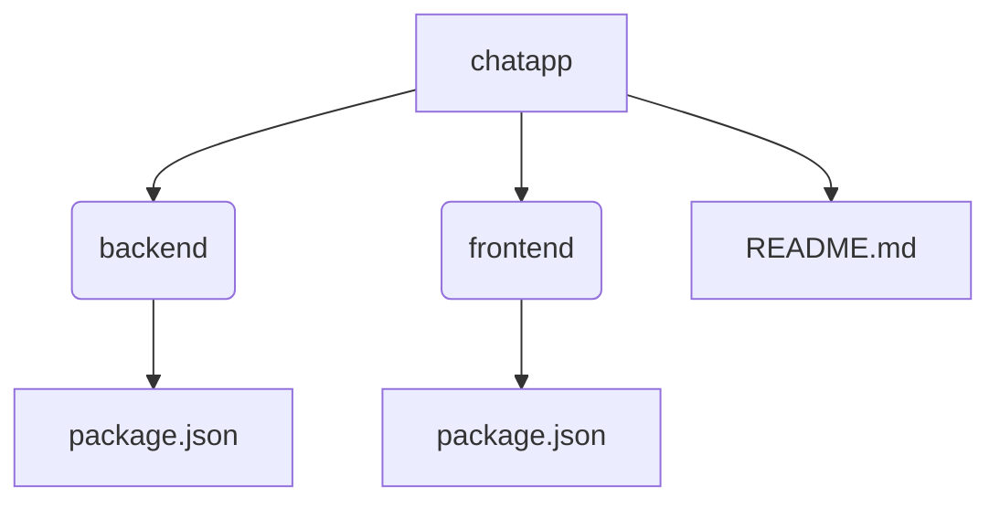
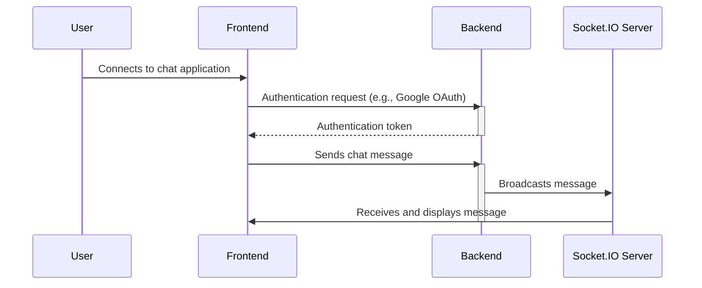

# Overview

<TOC />

This document provides an overview of the Chat-App-MERN application, a real-time chat application built using the MERN stack (MongoDB, Express.js, React, Node.js).  The application is structured into a frontend and a backend, each with its own dependencies and functionalities.  The core functionality relies on Socket.IO for real-time communication and Passport.js for user authentication. This application is based on a YouTube tutorial [Source](https://youtu.be/ntKkVrQqBYY?si=qz02jMCQ80RT1jaH).

## Project Structure

The project consists of three main parts: the main project directory, the backend, and the frontend.

`




The `chatapp` directory contains the main `package.json` file, which manages the build and start scripts for both the frontend and backend. The `backend` directory houses the server-side logic, and the `frontend` directory contains the client-side React application.  `README.md` provides a general overview of the project.

## Backend Overview

The backend, located in the `backend` directory, is built using Node.js and Express.js.  It handles user authentication, database interactions, and manages the Socket.IO server for real-time communication.

The `backend/package.json` file lists the project's dependencies:

```json
{
  "name": "backend",
  "version": "1.0.0",
  "main": "src/index.js",
  "scripts": {
    "dev": "nodemon src/index.js",
    "start": "node src/index.js"
  },
  "dependencies": {
    "bcryptjs": "^2.4.3",
    "cloudinary": "^2.5.1",
    "cookie-parser": "^1.4.7",
    "dotenv": "^16.4.7",
    "express": "^4.21.2",
    "express-session": "^1.18.1",
    "jsonwebtoken": "^9.0.2",
    "mongoose": "^8.9.5",
    "passport": "^0.7.0",
    "passport-google-oauth20": "^2.0.0",
    "socket.io": "^4.8.1"
  },
  "devDependencies": {
    "nodemon": "^3.1.9"
  }
}
```

*   **`express`**: The core framework for building the web server.
*   **`mongoose`**:  An Object Data Modeling (ODM) library for interacting with MongoDB.
*   **`passport` & `passport-google-oauth20`**:  For Google OAuth 2.0 authentication.
*   **`socket.io`**: Enables real-time, bidirectional communication between the server and clients.
*   **`bcryptjs`**: For password hashing.
*   **`jsonwebtoken`**: For creating and verifying JSON Web Tokens (JWTs) for secure authentication.
*   **`nodemon`**: A development tool that automatically restarts the server on code changes.


## Frontend Overview

The frontend, residing in the `frontend` directory, is a React application built using Vite.  It handles user interaction, rendering the chat interface, and communicating with the backend via Socket.IO.

The `frontend/package.json` file details its dependencies:

```json
{
  "name": "frontend",
  "private": true,
  "version": "0.0.0",
  "type": "module",
  "scripts": {
    "dev": "vite",
    "build": "vite build",
    "lint": "eslint .",
    "preview": "vite preview",
    "mobile": "vite --host"
  },
  "dependencies": {
    "axios": "^1.7.9",
    "cors": "^2.8.5",
    "lucide-react": "^0.471.1",
    "react": "^18.3.1",
    "react-dom": "^18.3.1",
    "react-hot-toast": "^2.5.1",
    "react-icons": "^5.5.0",
    "react-router-dom": "^7.1.1",
    "socket.io-client": "^4.8.1",
    "zustand": "^5.0.3"
  },
  // ...devDependencies
}
```

*   **`react` & `react-dom`**: The core React libraries.
*   **`react-router-dom`**: For client-side routing.
*   **`socket.io-client`**: The client-side library for Socket.IO communication.
*   **`axios`**: For making HTTP requests to the backend.
*   **`zustand`**: A small, fast, scalable state management solution.


## Application Flow

A simplified representation of the application flow is shown below:


`




This diagram illustrates the basic interaction between the user, frontend, and backend.  The user connects to the application, authenticates with the backend, and then sends and receives messages via Socket.IO.


## Build Process

The main `package.json` simplifies the build process:

```json
{
  "name": "chatapp",
  "version": "1.0.0",
  "scripts": {
    "build": "npm install --prefix backend && npm install --prefix frontend && npm run build --prefix frontend",
    "start": "npm run start --prefix backend"
  },
  // ...rest of package.json
}
```

The `build` script first installs dependencies for both the backend and frontend, then builds the frontend application. The `start` script launches the backend server.


Next: [Backend Development](./2_backend.mdx)