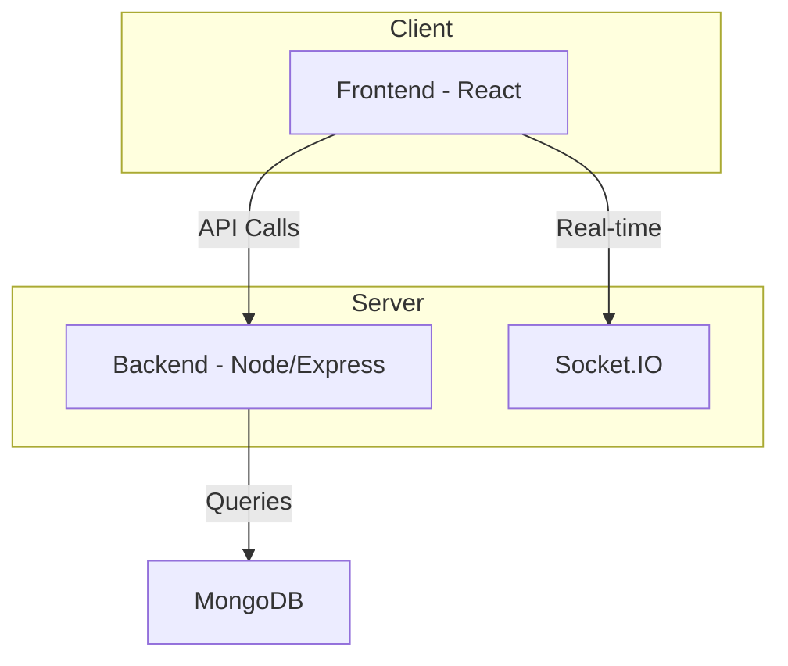
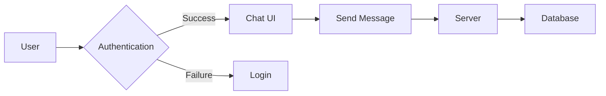

```mdx
---
title: "Overview"
description: "A high-level introduction to the Chat-App-MERN application."
sidebar_position: 1
---

# Overview

<TOC />

## System Purpose

This application is a real-time chat application built using the MERN stack (MongoDB, Express.js, React, Node.js).  Its core functionalities include:

* **User Registration and Authentication:**  Allows users to create accounts and securely log in to access the chat features. [View on GitHub](https://github.com/shinymack/Chat-App-MERN)
* **Real-time Messaging:** Enables users to send and receive messages instantly with other connected users. [View on GitHub](https://github.com/shinymack/Chat-App-MERN/blob/main/backend/README.md)
* **User Interaction:** Provides a user-friendly interface for interacting with the chat functionality. [View on GitHub](https://github.com/shinymack/Chat-App-MERN/blob/main/frontend/README.md)


## System Architecture Overview

The application follows a three-tier architecture:

* **Presentation Tier (Frontend):**  A React application handles user interface rendering and interactions.
* **Business Tier (Backend):** A Node.js and Express.js server manages API requests, business logic, and data processing.
* **Data Tier:** MongoDB stores user data and chat messages.





## Technology Stack

| Layer       | Technology          | Version (example) | Purpose                                      |
|--------------|----------------------|--------------------|----------------------------------------------|
| Frontend     | React                | (See frontend/package.json) | User interface and interaction               |
| Frontend     | Vite                 | (See frontend/package.json) | Build tool                                   |
| Backend      | Node.js              | (See backend/package.json) | Server-side JavaScript runtime              |
| Backend      | Express.js           | (See backend/package.json) | Web application framework                    |
| Database     | MongoDB              | (See backend/package.json) | NoSQL database for storing data               |
| Real-time    | Socket.IO            | (See backend/package.json) | Real-time communication                      |


Here's a snippet from the `package.json` showing the build scripts:

```json
{
  "scripts": {
    "build" : "npm install --prefix backend && npm install --prefix frontend && npm run build --prefix frontend",
    "start" : "npm run start --prefix backend"
  }
}
```
[View on GitHub](https://github.com/shinymack/Chat-App-MERN/blob/main/package.json#L6-L9)


## Core Application Features

* **Authentication:** Secure user login and registration using appropriate methods (details not provided in the given files).
* **Real-time Chat:**  Uses Socket.IO for instant message delivery and updates.  This ensures scalability and efficient communication between the client and server.  
* **Message Persistence:** Messages are stored in a database (MongoDB) for later retrieval.





## Project Structure

```
chatapp/
├── backend/
│   └── ...
├── frontend/
│   └── ...
└── package.json
```

The project is divided into a `backend` and `frontend` directory. The `package.json` file manages project dependencies and scripts for building and starting the application.


## Key Integration Points

* **State Management:** The provided files do not specify the state management solution used in the React frontend.  A proper solution (e.g., Context API, Redux, Zustand) should be implemented to manage application state efficiently.
* **API Flows:** The backend exposes API endpoints to handle user authentication, message sending, and retrieval.  These endpoints are accessed by the frontend via HTTP requests.
* **Authentication:** A robust authentication mechanism is critical for securing user data and preventing unauthorized access.
* **Database Interactions:** The backend interacts with MongoDB to store and retrieve user data and chat messages efficiently, optimizing queries for scalability.  The choice of MongoDB implies a schema-less design, allowing for flexibility but requiring careful consideration of data modeling and querying strategies.


Next: [System Architecture](./2_system-architecture.mdx)
```