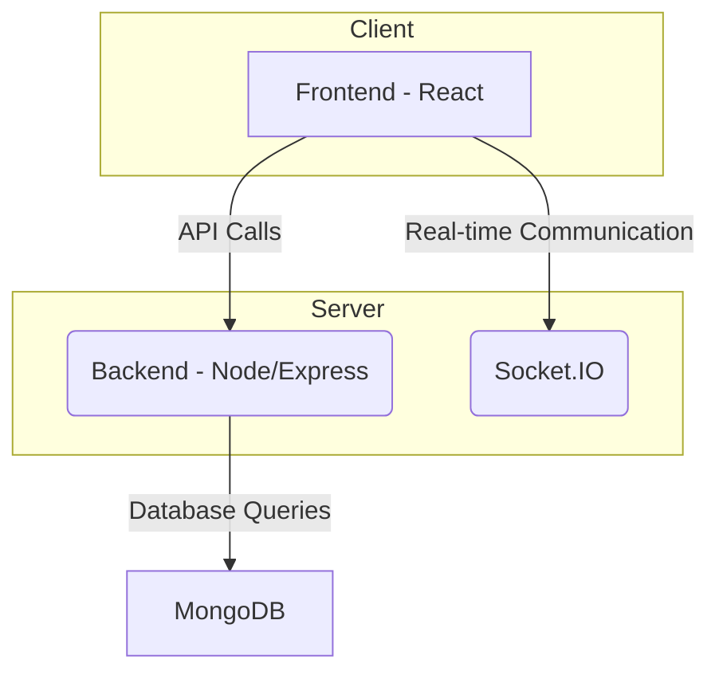
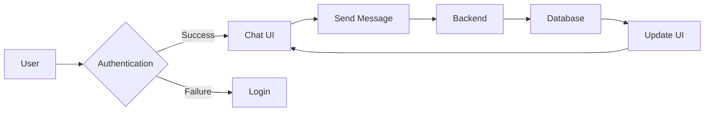

# Overview

<TOC />

## System Purpose

This project implements a real-time chat application using the MERN stack (MongoDB, Express.js, React, Node.js).  Core functionalities include:

*   **User Registration and Authentication:** Users can create accounts, log in, and securely manage their profiles. [View on GitHub](https://github.com/shinymack/Chat-App-MERN/blob/main/README.md)
*   **Real-time Messaging:** Users can send and receive messages instantly with other connected users.
*   **(Inferred from video link in README)** Potentially includes features like media sharing (images, videos etc).

## System Architecture Overview

The application follows a three-tier architecture:

*   **Presentation Tier:** The frontend (React) handles user interface interactions, rendering the chat interface, and managing user state.
*   **Business Tier:** The backend (Node.js with Express.js) handles API requests, business logic, authentication, and database interactions.
*   **Data Tier:** MongoDB stores user data, messages, and other application data.  Socket.IO facilitates real-time communication between the client and server.





## Technology Stack

The project utilizes the following technologies:

| Layer       | Technology             | Version      | Purpose                                           |
|-------------|-------------------------|---------------|---------------------------------------------------|
| Frontend    | React                   | ^18.3.1       | User interface and client-side logic              |
|             | React Router DOM         | ^7.1.1        | Client-side routing                               |
|             | Axios                   | ^1.7.9        | HTTP client for API calls                         |
|             | Socket.IO-Client        | ^4.8.1        | Real-time communication with the server           |
|             | Zustand                 | ^5.0.3        | State management                                   |
| Backend     | Node.js                 | (runtime)      | Server-side JavaScript runtime                     |
|             | Express.js              | ^4.21.2       | Web application framework                          |
|             | Mongoose                | ^8.9.5        | MongoDB ODM (Object Data Modeling)                |
|             | Socket.IO               | ^4.8.1        | Real-time communication                            |
|             | Bcrypt                  | ^2.4.3        | Password hashing                                  |
|             | Passport                | ^0.7.0        | Authentication middleware                          |
|             | Passport-Google-OAuth20 | ^2.0.0        | Google OAuth 2.0 authentication strategy        |
| Database    | MongoDB                 | (database)     | NoSQL database for storing application data         |


Here's a snippet from the backend `package.json` showing key dependencies:

```json
{
  "dependencies": {
    "express": "^4.21.2",
    "mongoose": "^8.9.5",
    "socket.io": "^4.8.1",
    "jsonwebtoken": "^9.0.2"
  }
}
```
[View on GitHub](https://github.com/shinymack/Chat-App-MERN/blob/main/backend/package.json)

And a snippet from the frontend `package.json`:

```json
{
  "dependencies": {
    "react": "^18.3.1",
    "react-dom": "^18.3.1",
    "react-router-dom": "^7.1.1",
    "socket.io-client": "^4.8.1"
  }
}
```
[View on GitHub](https://github.com/shinymack/Chat-App-MERN/blob/main/frontend/package.json)


## Core Application Features

*   **Authentication:**  Secure user authentication using Passport.js potentially with Google OAuth 2.0 for streamlined login.  Password hashing uses bcrypt for security.
*   **Real-time Chat:** Socket.IO enables real-time, bi-directional communication between clients and the server for instant messaging.
*   **(Inferred)**  Likely includes features for handling and storing chat messages in the database.





## Project Structure

```
chatapp/
├── backend/
│   └── src/
│       └── ...
├── frontend/
│   └── src/
│       └── ...
└── package.json
```

The project is structured into two main folders: `backend` and `frontend`, representing the server and client-side code respectively. The `package.json` at the root level manages the build process for both parts.


## Key Integration Points

*   **State Management:** The frontend uses Zustand for efficient and predictable state management.
*   **API Flows:** The frontend uses Axios to make HTTP requests to the backend APIs for data fetching and manipulation.
*   **Authentication:** Authentication is handled by Passport.js on the backend, with tokens likely used for secure communication.
*   **Database Interactions:** Mongoose facilitates interaction with the MongoDB database, ensuring efficient data storage and retrieval.  The choice of MongoDB supports scalability for managing a potentially large number of users and messages.  The use of Socket.IO for real-time updates is a key architectural decision that allows for efficient, low-latency communication between clients and the server, enhancing the user experience.


Next: [Backend Development](./2_backend.mdx)
```
