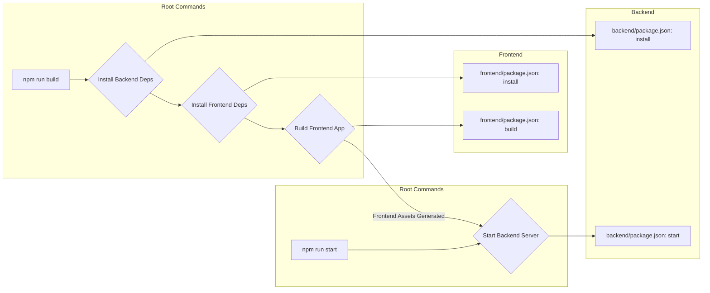

# Project Overview

<TOC />

Welcome to the GitDex documentation for the MERN Chat Application. This document provides a foundational understanding of the project, detailing its purpose, architectural design, and the fundamental technologies employed. Developed as a modern, real-time communication platform, this application leverages the power of the MERN (MongoDB, Express.js, React, Node.js) stack to deliver a robust and scalable chat experience.

The project is structured to offer a clear separation of concerns, with distinct `frontend` and `backend` components managed within a single repository, fostering a streamlined development and deployment workflow.

## System Purpose

The primary objective of the MERN Chat Application is to facilitate seamless, real-time communication between users. It aims to provide an intuitive and responsive user interface where individuals can exchange messages instantly.

### Key Features (Anticipated)

Based on the nature of a "MERN ChatApp," the following core features are typically anticipated:

*   **User Authentication**: Secure user registration and login functionality, ensuring that only authorized users can access the chat services. This is crucial for maintaining privacy and message integrity.
*   **Real-time Messaging**: Instantaneous delivery of messages between users, characteristic of modern chat applications. This feature usually relies on WebSocket technology (e.g., Socket.IO) for persistent, bi-directional communication.
*   **Persistent Chat History**: Messages are stored in a database, allowing users to retrieve past conversations upon logging in, ensuring continuity.
*   **Scalable Architecture**: Designed to handle a growing number of users and messages without significant performance degradation, utilizing Node.js's non-blocking I/O model and MongoDB's flexible document structure.
*   **Responsive User Interface**: A dynamic and interactive frontend built with React, ensuring a smooth user experience across various devices.

## Architecture Overview

The MERN Chat Application adheres to a standard client-server architecture, typical of full-stack web applications, but with a strong emphasis on real-time capabilities. The MERN stack provides a comprehensive framework for building such an application, where each component plays a distinct and vital role:

*   **MongoDB**: A NoSQL database that stores all application data, including user profiles, messages, and chat room information. Its flexible document model is well-suited for evolving data structures.
*   **Express.js**: A minimalist web framework for Node.js, forming the backbone of the backend API. It handles routing, middleware, and orchestrates interactions with the database.
*   **React**: A JavaScript library for building user interfaces, forming the frontend of the application. It provides a declarative and component-based approach to UI development, enhancing interactivity and maintainability.
*   **Node.js**: A JavaScript runtime environment that executes the backend logic. Its event-driven, non-blocking I/O model makes it highly efficient for real-time applications like chat services.

The interaction between these components is illustrated below:


```mermaid
graph TD
    A[React Frontend] -->|API Requests| B(Express.js Backend)
    A -->|WebSocket Connection (e.g., Socket.IO)| B
    B -->|Database Operations| C[MongoDB Database]
    C -->|Data Retrieval| B
    B -->|API Responses| A
    B -->|Real-time Events| A
```


*Figure 1: High-Level MERN Stack Architecture*

### Core Technologies

The choice of the MERN stack is strategic for a real-time chat application, offering several advantages:

*   **JavaScript Everywhere**: Using JavaScript across the entire stack (frontend, backend, database query language) simplifies development, reduces context switching, and allows for easier code sharing.
*   **Performance**: Node.js and Express.js provide a high-performance backend capable of handling many concurrent connections, which is essential for real-time features.
*   **Flexibility**: MongoDB's schema-less nature allows for rapid iteration and adaptation to changing data requirements, common in dynamic applications.
*   **Rich UI**: React's component-based architecture enables the creation of complex, interactive, and highly responsive user interfaces.

## Project Structure

This MERN Chat Application is organized as a monorepo, meaning both the frontend and backend components reside within the same Git repository but in separate directories. This structure simplifies dependency management, build processes, and overall project coordination.

The fundamental structure, as inferred from the build scripts, is as follows:

*   `chatapp/` (root directory)
    *   `backend/`
        *   Contains all server-side logic, API endpoints, database models, and real-time communication handlers.
    *   `frontend/`
        *   Contains all client-side code, React components, state management, and UI logic.
    *   `package.json` (root)
        *   Defines project-level metadata and orchestrates build and start commands for sub-projects.
    *   `README.md`
        *   Provides a high-level overview and credits for the project.

This clear separation enhances maintainability, allowing developers to work on either the frontend or backend without interfering with the other, while still benefiting from a unified project management approach.

### Build and Start Scripts

The `package.json` file at the root of the project (available at [package.json](https://github.com/shinymack/Chat-App-MERN/blob/main/package.json)) defines crucial scripts for managing the application's lifecycle, including dependency installation, building the frontend, and starting the backend server. These scripts exemplify how the monorepo structure is leveraged for operational tasks.

The relevant section from the `package.json` is shown below:

```json
// chatapp/package.json
{
  "name": "chatapp",
  "version": "1.0.0",
  "main": "index.js",
  "scripts": {
    "build" : "npm install --prefix backend && npm install --prefix frontend && npm run build --prefix frontend",
    "start" : "npm run start --prefix backend"
  },
  "keywords": [],
  "author": "",
  "license": "ISC",
  "description": ""
}
```

#### Script Analysis:

1.  **`build` Script**:
    *   `npm install --prefix backend`: Installs all Node.js dependencies specified in the `backend/package.json`. This ensures the server-side components have their required libraries.
    *   `npm install --prefix frontend`: Installs all Node.js dependencies specified in the `frontend/package.json`. This is necessary for the React application to build correctly.
    *   `npm run build --prefix frontend`: Executes the `build` script defined within the `frontend/package.json`. This typically compiles the React application into static assets (HTML, CSS, JavaScript bundles) suitable for production deployment. These assets are then often served by the backend.

    **WHY this design?** This sequential execution ensures that both parts of the application have their dependencies resolved and that the frontend is prepared for deployment *before* the application is run in a production-like environment. It enforces a controlled build process for the entire stack.

2.  **`start` Script**:
    *   `npm run start --prefix backend`: Executes the `start` script defined within the `backend/package.json`. This command typically initiates the Node.js server. In a MERN application, the backend server is often responsible for serving the static frontend assets (generated by the `frontend`'s build process) in addition to handling API requests and real-time communication.

    **WHY this design?** By only starting the backend from the root `package.json`, it implies that the backend is the central orchestrator for the running application. For production deployments, it's common for the Node.js server to serve the built React application, making a single `start` command sufficient after the `build` step.

This workflow highlights the integrated nature of the monorepo, where a single set of commands from the root can manage the entire application stack.





*Figure 2: Build and Start Workflow*

## Key Insights and Best Practices

Developing a MERN Chat Application, especially with a monorepo structure, offers several insights and reinforces best practices:

*   **Separation of Concerns**: The distinct `backend` and `frontend` directories strictly enforce the separation of server-side logic from client-side UI. This improves code organization, makes debugging easier, and allows different teams or individuals to work on specific parts of the application without conflicts.
*   **Real-time Communication**: While not explicitly mentioned in `package.json` or `README.md`, the "ChatApp" designation strongly implies the use of WebSocket technology (e.g., Socket.IO). Integrating Socket.IO into the Node.js backend and React frontend is crucial for the instant message delivery that defines a chat application.
*   **Scalability Considerations**: MERN applications, particularly with Node.js, are inherently scalable due to Node's non-blocking I/O. For chat applications, this means the server can handle many concurrent connections efficiently. When deploying, consider using process managers like PM2 for Node.js and load balancers to distribute traffic across multiple server instances.
*   **Database Design**: MongoDB's flexibility is excellent for chat applications, allowing for dynamic message structures (e.g., text, images, links). Careful consideration of indexing and aggregation pipelines will be essential for efficient querying of chat histories and user data.
*   **Security**: Authentication and authorization are paramount. Best practices include using secure password hashing (e.g., bcrypt), JWT (JSON Web Tokens) for session management, and proper input validation on both the frontend and backend to prevent common web vulnerabilities.
*   **Unified Tooling**: The `package.json` scripts at the root demonstrate a unified approach to managing the entire project. This simplifies the developer experience and ensures consistency in how the application is built and run.

## Conclusion

The MERN Chat Application, though presented with minimal initial files, establishes itself as a robust and modern communication platform. Its foundation on the MERN stack, coupled with a well-defined monorepo structure and orchestrated build/start scripts, points towards a project designed for maintainability, scalability, and an engaging user experience. The architectural choices align with industry best practices for full-stack, real-time web development, leveraging the power of JavaScript across the entire application stack.

This overview sets the stage for delving deeper into the specific implementations of the backend and frontend components.

Next: [Getting Started](./1.1_getting_started.mdx)