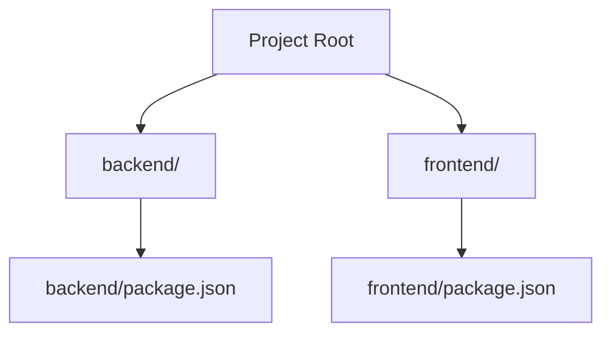

# System Overview and Setup

<TOC />

The Chat-App-MERN project is a real-time chat application built using the **MERN** stack (MongoDB, Express.js, React, Node.js). This document provides a high-level overview of the system's architecture, its core purpose, and essential instructions for getting started with the project's setup.

At its core, Chat-App-MERN facilitates instant messaging between users, demonstrating a practical implementation of full-stack web development principles combined with real-time communication capabilities using WebSockets.

## Project Purpose

The primary purpose of the Chat-App-MERN project is to serve as a comprehensive example of building a modern, real-time web application. It showcases:

*   **Full-Stack Integration**: How different components of the MERN stack work together seamlessly.
*   **Real-time Communication**: Implementation of WebSockets for instantaneous message delivery.
*   **Authentication & Authorization**: Secure user management and session handling.
*   **Scalable Architecture**: A foundation for building more complex real-time applications.

## Core Technologies

This project leverages the power of the MERN stack for its development:

*   **MongoDB**: A NoSQL database for flexible and scalable data storage.
*   **Express.js**: A robust web application framework for Node.js, forming the backend API.
*   **React**: A JavaScript library for building dynamic and interactive user interfaces.
*   **Node.js**: A JavaScript runtime environment, powering the backend server and its real-time capabilities.

## Overall System Architecture

The Chat-App-MERN is structured into distinct frontend and backend components, interacting to deliver a real-time messaging experience. The following diagram illustrates the high-level flow of data and interaction within the system.


```mermaid
graph TD
    A["User Browser (Client)"] -->|"Sends Requests, Receives Updates"| B["Frontend (React.js)"]
    B -->|"API Calls (HTTP/S)"| C["Backend (Node.js/Express.js)"]
    B --.->|"WebSocket Connection (Real-time)"| C
    C -->|"Data Persistence & Retrieval"| D["Database (MongoDB)"]

    subgraph Backend Services
        C
    end
    subgraph Client Application
        A
        B
    end
```


The client-side (User Browser and React Frontend) communicates with the Node.js/Express.js Backend via standard HTTP/S API calls for operations like authentication and message history. For real-time updates and instantaneous message exchange, a dedicated WebSocket connection is established between the frontend and backend. The Backend then interacts with MongoDB for all data storage and retrieval needs.

## Initial Setup and Project Structure

The project employs a common structure where frontend and backend components reside in separate directories within a single repository. This allows for independent development and deployment while maintaining a cohesive codebase.

### Project Structure Overview

While not explicitly shown in the `README.md`, the `package.json` scripts hint at a directory structure where `frontend` and `backend` are distinct sub-projects.





### Getting Started

The project's `package.json` file contains essential scripts for building and starting both the frontend and backend components. This centralizes the primary commands required for development and deployment.

Let's examine the relevant `package.json` scripts:

```json showLineNumbers
{
  "name": "chatapp",
  "version": "1.0.0",
  "main": "index.js",
  "scripts": {
    "build" : "npm install --prefix backend && npm install --prefix frontend && npm run build --prefix frontend",
    "start" : "npm run start --prefix backend"
  },
  "keywords": [],
  "author": "",
  "license": "ISC",
  "description": ""
}
```
[View `package.json` on GitHub](https://github.com/shinymack/Chat-App-MERN/blob/main/package.json)

The `package.json` defines two key scripts:

1.  **`build` Script**: This script is designed for preparing both the backend and frontend for production or initial setup.
    ```bash
    npm install --prefix backend && npm install --prefix frontend && npm run build --prefix frontend
    ```
    *   `npm install --prefix backend`: Navigates into the `backend` directory and installs all its dependencies.
    *   `npm install --prefix frontend`: Navigates into the `frontend` directory and installs all its dependencies.
    *   `npm run build --prefix frontend`: Executes the `build` script defined within the `frontend/package.json`, typically compiling the React application into static assets.

    To set up and build the project, run:
    ```bash
    npm run build
    ```

2.  **`start` Script**: This script is responsible for starting the application. As indicated, it specifically targets the backend.
    ```bash
    npm run start --prefix backend
    ```
    *   `npm run start --prefix backend`: Navigates into the `backend` directory and executes its `start` script. This usually fires up the Node.js server.

    To start the application after building, execute:
    ```bash
    npm run start
    ```

The `package-lock.json` file ensures consistent dependency versions across different environments, preventing unexpected issues due to version mismatches.

```json showLineNumbers
{
  "name": "chatapp",
  "version": "1.0.0",
  "lockfileVersion": 3,
  "requires": true,
  "packages": {
    "": {
      "name": "chatapp",
      "version": "1.0.0",
      "license": "ISC"
    }
  }
}
```
[View `package-lock.json` on GitHub](https://github.com/shinymack/Chat-App-MERN/blob/main/package-lock.json)

### Initial Project README

The provided `README.md` is concise, offering a quick title and acknowledging the tutorial source. It serves as a starting point for more detailed documentation.

```markdown showLineNumbers
## MERN Chatapp

credits : https://youtu.be/ntKkVrQqBYY?si=qz02jVrQqBYY
```
[View `README.md` on GitHub](https://github.com/shinymack/Chat-App-MERN/blob/main/README.md)

## Key Integration Points

For this system, the critical integration points revolve around how the frontend and backend communicate, especially for real-time features.

*   **HTTP/S REST API**: The frontend (React) makes standard HTTP requests (GET, POST, PUT, DELETE) to the backend (Express.js) for operations such as user authentication, fetching message history, and user profile management. This stateless communication ensures robust data handling.
*   **WebSockets (Socket.IO)**: For real-time messaging, the system establishes a persistent WebSocket connection. When a user sends a message, the frontend dispatches it over this socket to the backend. The backend then broadcasts this message to all relevant connected clients in real-time, bypassing the traditional request-response cycle of HTTP. This is crucial for the instant delivery experience of a chat application.
*   **Database Interactions**: The backend acts as the sole intermediary between the frontend and the MongoDB database. All data persistence and retrieval operations are handled by the backend, ensuring data integrity, security, and consistent schema application.

Understanding these integration points is crucial for debugging and extending the application, as issues often arise from mismatches or incorrect handling of data between these layers.

Next: [Backend Architecture and APIs](./2_backend-architecture-and-apis.mdx)