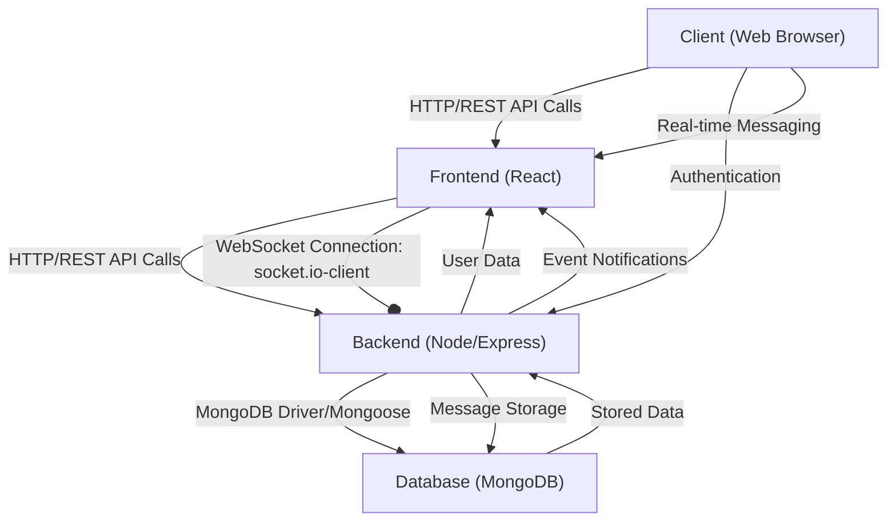
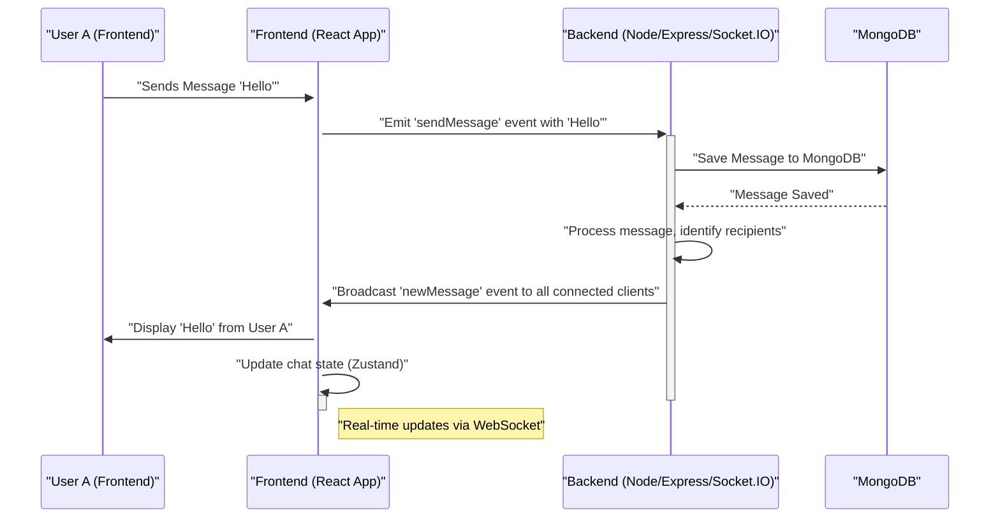

```md
---
title: "System Overview"
description: "A high-level introduction to the Chat-App-MERN project, its purpose, and core technologies."
sidebar_position: 1
---

# System Overview
<TOC />

Welcome to the System Overview documentation for the Chat-App-MERN project. This section provides a foundational understanding of the application's architecture, its core purpose, and the primary technologies powering its functionality. Built on the robust MERN (MongoDB, Express.js, React, Node.js) stack, this application aims to deliver a modern, scalable real-time chat experience.

The project's foundational ideas and structure are credited to a valuable tutorial: [MERN Chat App Tutorial](https://youtu.be/ntKkVrQqBYY?si=qz02jMCQ80RT1jaH).

## Project Purpose

The Chat-App-MERN project is designed as a full-stack real-time messaging application. Its primary purpose is to enable users to send and receive messages instantly, facilitated by persistent storage and a responsive user interface. Key features include:

*   **User Authentication**: Secure user registration and login.
*   **Real-time Messaging**: Instantaneous delivery of messages between users.
*   **Persistent Chat History**: Messages are stored and retrieved from a database.
*   **User Management**: Ability to view and manage user profiles.
*   **Scalable Architecture**: Designed with MERN principles to allow for future expansion and feature integration.

## Core Technologies (MERN Stack)

The application leverages the power of the MERN stack, a popular choice for developing robust web applications due to its JavaScript-centric nature and extensive ecosystem.

### MongoDB

As the database layer, **MongoDB** provides a flexible, document-oriented NoSQL database. It's ideal for chat applications where data structures can evolve and require high availability and scalability. All user data, chat messages, and other application-specific information are stored here.

### Express.js

**Express.js**, running on Node.js, forms the backend framework. It handles all API requests from the frontend, manages routing, middleware, and orchestrates interactions with the MongoDB database. It serves as the bridge between the client-side and the data layer, providing a robust RESTful API.

### React

The entire user interface is built using **React**, a declarative, component-based JavaScript library for building dynamic user interfaces. React's efficiency in rendering and managing UI states ensures a smooth and interactive experience for chat users.

### Node.js

**Node.js** is the JavaScript runtime environment that executes the Express.js backend. Its non-blocking, event-driven architecture is particularly well-suited for real-time applications like chat, handling many concurrent connections efficiently, especially when paired with technologies like Socket.IO.

## Frontend Technologies and Dependencies

The frontend of the chat application is powered by React, enhanced with a suite of modern libraries and frameworks for state management, routing, styling, and real-time communication.

### Key Frontend Dependencies

Here's a breakdown of essential dependencies found in `frontend/package.json`:

*   **`react` & `react-dom`**: Core libraries for building the UI.
*   **`react-router-dom`**: Manages client-side routing, allowing for navigation between different views without full page reloads.
*   **`axios`**: A popular promise-based HTTP client used for making API requests to the Express.js backend.
*   **`socket.io-client`**: The client-side library for establishing and managing real-time WebSocket connections with the backend.
*   **`zustand`**: A minimalist, fast, and scalable state-management solution used to manage global application state, such as authentication status and current chat context.
*   **`lucide-react` & `react-icons`**: Libraries providing a rich set of customizable icons for a modern UI.
*   **`daisyui` & `tailwindcss`**: A component library built on top of Tailwind CSS, providing beautiful, responsive UI components with minimal effort.
*   **`react-hot-toast`**: For elegant and responsive notifications to the user.

```json
// frontend/package.json snippets
{
  "name": "frontend",
  "private": true,
  "version": "0.0.0",
  "type": "module",
  "scripts": {
    "dev": "vite",
    "build": "vite build",
    "lint": "eslint .",
    "preview": "vite preview",
    "mobile": "vite --host"
  },
  "dependencies": {
    "axios": "^1.7.9",
    "cors": "^2.8.5",
    "lucide-react": "^0.471.1",
    "react": "^18.3.1",
    "react-dom": "^18.3.1",
    "react-hot-toast": "^2.5.1",
    "react-icons": "^5.5.0",
    "react-router-dom": "^7.1.1",
    "socket.io-client": "^4.8.1",
    "zustand": "^5.0.3"
  },
  "devDependencies": {
    "autoprefixer": "^10.4.20",
    "daisyui": "^4.12.23",
    "postcss": "^8.5.0",
    "tailwindcss": "^3.4.17",
    "vite": "^6.3.5"
  }
}
```
[View `frontend/package.json` on GitHub](https://github.com/shinymack/Chat-App-MERN/blob/main/frontend/package.json)

The `scripts` section reveals the use of `vite` for frontend development and building, indicating a modern development setup for fast refreshes and optimized production builds.

```json
// frontend/package.json: scripts
{
  "scripts": {
    "dev": "vite",
    "build": "vite build",
    "lint": "eslint .",
    "preview": "vite preview",
    "mobile": "vite --host"
  }
}
```

## Backend Technologies and Dependencies

The backend is built with Node.js and Express.js, handling user authentication, message storage, and real-time communication.

### Key Backend Dependencies

Key dependencies from `backend/package.json` highlight the robust features of the server:

*   **`express`**: The web framework for building RESTful APIs.
*   **`mongoose`**: An ODM (Object Data Modeling) library for MongoDB and Node.js, simplifying data interactions.
*   **`jsonwebtoken`**: For creating and verifying JSON Web Tokens (JWTs) used in user authentication.
*   **`bcryptjs`**: A library for hashing passwords securely.
*   **`cookie-parser`**: Middleware for parsing cookies attached to client requests.
*   **`dotenv`**: Loads environment variables from a `.env` file, keeping sensitive configurations out of the codebase.
*   **`cloudinary`**: For integrating cloud-based image and video management, likely used for user avatars or media sharing.
*   **`socket.io`**: The server-side library enabling real-time, bidirectional, and event-based communication between clients and the server using WebSockets.

```json
// backend/package.json snippets
{
  "name": "backend",
  "version": "1.0.0",
  "main": "src/index.js",
  "scripts": {
    "dev": "nodemon src/index.js",
    "start": "node src/index.js"
  },
  "author": "",
  "type": "module",
  "license": "ISC",
  "description": "",
  "dependencies": {
    "bcryptjs": "^2.4.3",
    "cloudinary": "^2.5.1",
    "cookie-parser": "^1.4.7",
    "dotenv": "^16.4.7",
    "express": "^4.21.2",
    "express-session": "^1.18.1",
    "jsonwebtoken": "^9.0.2",
    "mongoose": "^8.9.5",
    "passport": "^0.7.0",
    "passport-google-oauth20": "^2.0.0",
    "socket.io": "^4.8.1"
  },
  "devDependencies": {
    "nodemon": "^3.1.9"
  }
}
```
[View `backend/package.json` on GitHub](https://github.com/shinymack/Chat-App-MERN/blob/main/backend/package.json)

The `scripts` indicate `nodemon` for development (auto-restarting the server on changes) and `node` for production, pointing to `src/index.js` as the entry point.

```json
// backend/package.json: scripts
{
  "scripts": {
    "dev": "nodemon src/index.js",
    "start": "node src/index.js"
  }
}
```

## Root Project Configuration

The root `package.json` file serves as the orchestrator for the entire monorepo-style project, defining top-level scripts that simplify building and starting both frontend and backend components.

```json
// package.json snippets (root)
{
  "name": "chatapp",
  "version": "1.0.0",
  "main": "index.js",
  "scripts": {
    "build" : "npm install --prefix backend && npm install --prefix frontend && npm run build --prefix frontend",
    "start" : "npm run start --prefix backend"
  },
  "keywords": [],
  "author": "",
  "license": "ISC",
  "description": ""
}
```
[View `package.json` on GitHub](https://github.com/shinymack/Chat-App-MERN/blob/main/package.json)

The `build` script automates the installation of dependencies for both backend and frontend, and then triggers the frontend's build process. The `start` script, conversely, initiates the backend server after the necessary installations. This centralized approach streamlines deployment and local setup.

## System Architecture Diagram

This diagram illustrates the high-level flow of data and interactions within the MERN Chat Application.





## Real-time Communication Flow

A crucial aspect of any chat application is real-time communication. This sequence diagram illustrates how `socket.io` facilitates instant message exchange.





## Key Integration Points

Understanding how different parts of the system interact is vital for development and maintenance.

*   **Frontend-Backend API Interaction**: The React frontend communicates with the Express.js backend primarily through RESTful API calls using `axios`. These calls handle user authentication (login, registration), fetching chat histories, and initial user data. Data is typically exchanged as JSON.
*   **Real-time WebSocket Communication**: For live chat functionality, `socket.io-client` on the frontend establishes a persistent WebSocket connection with `socket.io` on the backend. This allows for instant bidirectional communication, essential for sending and receiving messages without polling. The backend broadcasts messages to relevant clients, ensuring all participants in a chat receive updates instantly.
*   **Backend-Database Interaction**: The Express.js backend uses `mongoose` to interact with MongoDB. Mongoose schemas define the structure of the data (users, messages, conversations), and Mongoose queries perform CRUD (Create, Read, Update, Delete) operations on the database.
*   **Authentication Flow**: User authentication typically involves the frontend sending credentials to the backend. The backend verifies these, generates a JWT (`jsonwebtoken`), and sets it as an `httpOnly` cookie. This token is then used by the frontend for subsequent authenticated requests. Passwords are securely hashed using `bcryptjs` before storage.
*   **State Management**: `zustand` is used on the frontend for global state management. This is crucial for managing user authentication status, selected chat, and incoming real-time messages, ensuring a consistent and responsive UI.

By understanding these integration points, developers can efficiently debug issues, extend functionality, and optimize the application's performance.

Next: [Backend Architecture and APIs](./2_backend-architecture-and-apis.mdx)
```