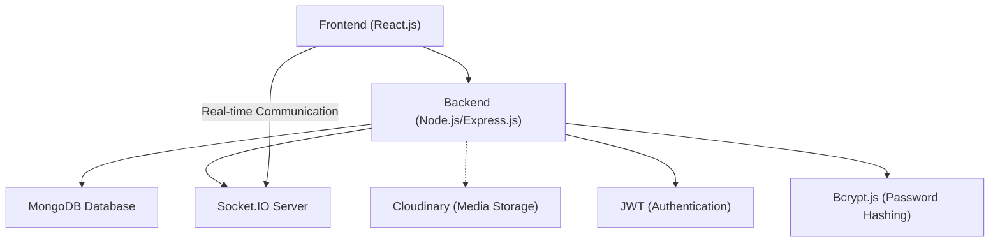
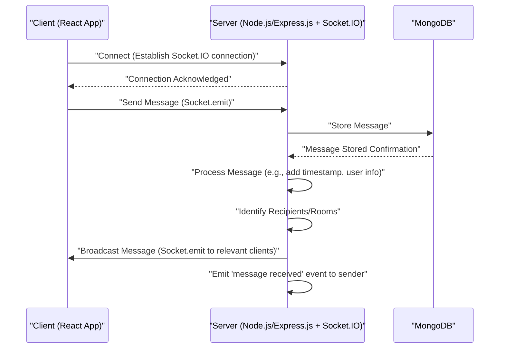

# System Overview
<TOC />

This document provides a high-level introduction to the Chat-App-MERN project, outlining its purpose, core technologies, and overall system architecture. The application is a full-stack chat platform built using the MERN (MongoDB, Express.js, React, Node.js) stack, designed to facilitate real-time messaging between users.

The project's primary goal is to demonstrate a robust, scalable, and interactive chat application, leveraging modern web development practices and technologies. It integrates real-time communication capabilities using Socket.IO, secure authentication with JWT and bcryptjs, and efficient data management with MongoDB and Mongoose.

## Project Purpose and Features

The Chat-App-MERN project aims to deliver a comprehensive chat experience with features commonly found in modern messaging applications. It serves as a practical example of building a full-stack application from the ground up, covering both frontend user interface development and backend API services.

Key features include:

*   **User Authentication**: Secure user registration and login functionality using JSON Web Tokens (JWT) and `bcryptjs` for password hashing.
*   **Real-time Messaging**: Instant message exchange between users facilitated by Socket.IO.
*   **User Management**: Ability to view and manage user profiles.
*   **Scalable Architecture**: A clear separation of frontend and backend concerns, allowing for independent development and deployment.
*   **Cloudinary Integration**: For potential media uploads or avatar management (indicated by dependencies).

## Core Technologies and Stack

The application is built on the MERN stack, a popular choice for full-stack JavaScript development due to its flexibility and performance.

### Frontend Technologies

The frontend is developed using React, a declarative, component-based JavaScript library for building user interfaces. It is set up with Vite for a fast development experience.

*   **React**: For building the user interface.
*   **Vite**: A fast build tool for modern web projects.
*   **Dependencies**: As observed in `frontend/README.md`, the frontend leverages standard React and Vite tooling.

```markdown
# React + Vite
```
_Snippet from `frontend/README.md` showcasing the frontend setup._
[View on GitHub](https://github.com/shinymack/Chat-App-MERN/blob/main/frontend/README.md)

### Backend Technologies

The backend is powered by Node.js and Express.js, providing a robust API layer and handling server-side logic, database interactions, and real-time communication.

*   **Node.js**: The JavaScript runtime environment.
*   **Express.js**: A fast, unopinionated, minimalist web framework for Node.js.
*   **MongoDB**: A NoSQL document database for storing application data.
*   **Mongoose**: An ODM (Object Data Modeling) library for MongoDB and Node.js, simplifying database interactions.
*   **Socket.IO**: A library for real-time, bidirectional, event-based communication.
*   **bcryptjs**: For hashing passwords securely.
*   **jsonwebtoken**: For creating and verifying JWTs for authentication.
*   **dotenv**: For managing environment variables.
*   **cookie-parser**: Middleware for parsing HTTP request cookies.
*   **cloudinary**: For cloud-based image and video management.
*   **passport-google-oauth20**: For Google OAuth integration (indicates potential social login).

The core backend dependencies illustrate the robust foundation of the server:

```json
{
  "name": "backend",
  "version": "1.0.0",
  "main": "src/index.js",
  "scripts": {
    "dev": "nodemon src/index.js",
    "start": "node src/index.js"
  },
  "dependencies": {
    "bcryptjs": "^2.4.3",
    "cloudinary": "^2.5.1",
    "cookie-parser": "^1.4.7",
    "dotenv": "^16.4.7",
    "express": "^4.21.2",
    "express-session": "^1.18.1",
    "jsonwebtoken": "^9.0.2",
    "mongoose": "^8.9.5",
    "passport": "^0.7.0",
    "passport-google-oauth20": "^2.0.0",
    "socket.io": "^4.8.1"
  },
  "devDependencies": {
    "nodemon": "^3.1.9"
  }
}
```
_Snippet from `backend/package.json` showing backend dependencies._
[View on GitHub](https://github.com/shinymack/Chat-App-MERN/blob/main/backend/package.json)

## System Architecture

The Chat-App-MERN project follows a client-server architecture. The frontend (React) communicates with the backend (Node.js/Express.js) via RESTful APIs and maintains real-time connections via WebSockets (Socket.IO). The backend, in turn, interacts with the MongoDB database.

Here's a simplified view of the system components and their interactions:





_High-level overview of the Chat-App-MERN system architecture._

### Project Structure and Root Scripts

The root `package.json` defines scripts to build and start both frontend and backend components, indicating a monolithic repository approach where both parts reside within the same project.

```json
{
  "name": "chatapp",
  "version": "1.0.0",
  "main": "index.js",
  "scripts": {
    "build" : "npm install --prefix backend && npm install --prefix frontend && npm run build --prefix frontend",
    "start" : "npm run start --prefix backend"
  },
  "keywords": [],
  "author": "",
  "license": "ISC",
  "description": ""
}
```
_Snippet from `package.json` showing root build and start scripts._
[View on GitHub](https://github.com/shinymack/Chat-App-MERN/blob/main/package.json)

The `build` script ensures that both the backend and frontend dependencies are installed, and the frontend is built for production. The `start` script then initiates the backend server.

### Real-time Communication Flow

Socket.IO is central to the application's real-time features. It establishes persistent connections between the client and server, enabling instant message delivery and other live updates.





_Sequence diagram illustrating the real-time message flow via Socket.IO._

## Key Integration Points

The core strength of the Chat-App-MERN project lies in the seamless integration between its different components.

1.  **Frontend-Backend API Interaction**: The React frontend makes HTTP requests to the Express.js backend for user authentication, fetching user data, retrieving message history, and managing profiles. JWTs ensure secure communication.
2.  **Backend-Database Interaction**: Express.js uses Mongoose to interact with MongoDB, performing CRUD (Create, Read, Update, Delete) operations on users, messages, and other data entities.
3.  **Real-time Communication**: Socket.IO bridges the frontend and backend for instant messaging. The backend emits events that the frontend listens to, updating the UI in real-time without requiring page reloads.
4.  **Authentication Flow**: Upon user login, the backend generates a JWT and sends it to the frontend, typically stored in an HTTP-only cookie. Subsequent authenticated requests from the frontend include this token for verification by the backend.
5.  **Environment Variables**: The use of `dotenv` ensures that sensitive configuration details (e.g., database connection strings, API keys) are kept out of the codebase and managed securely through environment variables.

Next: [Backend Architecture and APIs](./2_backend-architecture-and-apis.mdx)