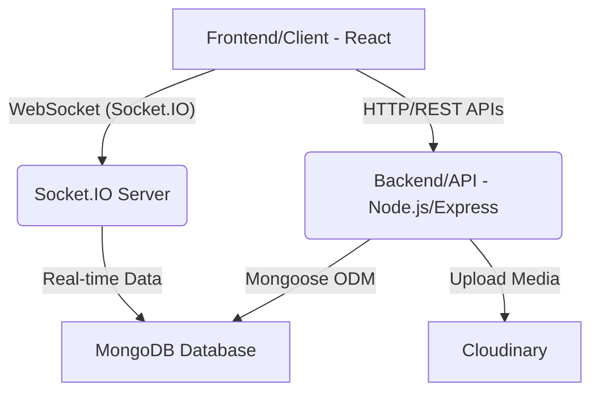

# System Overview
<TOC />

## System Purpose

The MERN Chat App is a real-time messaging application built using the MERN (MongoDB, Express.js, React, Node.js) stack. Its primary purpose is to facilitate instant communication between users, mimicking features found in modern chat platforms. The project aims to provide a robust foundation for real-time interactions, secure user authentication, and a responsive user interface.

Key functionalities that can be inferred from the project's dependencies include:

*   **Real-time Messaging:** Users can send and receive messages instantly, enabling dynamic and engaging conversations.
*   **User Authentication:** Secure sign-up and login mechanisms, including support for third-party authentication providers like Google.
*   **User Management:** Creation and management of user profiles.
*   **Media Handling:** Support for storing and serving user-uploaded content, such as profile pictures.
*   **Scalable Architecture:** Designed with modern web development practices to support a growing user base and increasing message traffic.

This project leverages a full-stack JavaScript approach, ensuring a consistent development environment across both frontend and backend components.

## Architecture

The Chat-App-MERN project follows a client-server architecture, typical for MERN stack applications, with an added layer for real-time communication and external services. It separates concerns into distinct layers: a frontend client, a backend API server, a NoSQL database, and dedicated services for real-time updates and cloud storage.

*   **Frontend (Client)**: Developed with React, this serves as the user interface, handling all user interactions, displaying chat messages, and managing user sessions. It communicates with the backend API for data exchange and directly with the Socket.IO server for real-time updates.
*   **Backend (API Server)**: Built with Node.js and Express.js, this layer provides the RESTful APIs for user authentication, message storage and retrieval, and other application logic. It interacts with the MongoDB database via Mongoose and integrates with external services like Cloudinary.
*   **Database (MongoDB)**: A NoSQL document database managed by Mongoose ODM, used for persisting user data, chat messages, and other application-specific information.
*   **Real-time Communication (Socket.IO)**: An integral part of the architecture, Socket.IO enables bidirectional, low-latency communication between the client and server, essential for instant message delivery and other real-time features.
*   **Cloud Storage (Cloudinary)**: An external service used for efficient storage and delivery of media assets, such as user avatars or shared images, offloading static file serving from the main backend.





*System Architecture Diagram: Illustrates the interaction between the frontend, backend, database, Socket.IO for real-time capabilities, and Cloudinary for media storage.*

## Technology Stack

The project embraces a modern, full-stack JavaScript technology stack, commonly known as MERN. This approach offers flexibility, scalability, and a cohesive development experience.

| Layer                | Technology             | Purpose                                                                                                                                                                                                                                       |
| :------------------- | :--------------------- | :-------------------------------------------------------------------------------------------------------------------------------------------------------------------------------------------------------------------------------------------- |
| **Frontend**         | React.js               | Declarative UI library for building interactive user interfaces.                                                                                                                                                                              |
|                      | Vite                   | Next-generation frontend tooling for fast development, serving, and building.                                                                                                                                                                 |
|                      | Zustand                | Lightweight, fast, and scalable state management solution for React applications.                                                                                                                                                             |
|                      | Axios                  | Promise-based HTTP client for making API requests from the browser.                                                                                                                                                                           |
|                      | Tailwind CSS, DaisyUI  | Utility-first CSS framework and component library for rapid and consistent UI styling.                                                                                                                                                        |
| **Backend**          | Node.js                | JavaScript runtime environment for server-side logic.                                                                                                                                                                                         |
|                      | Express.js             | Fast, unopinionated, minimalist web framework for Node.js, building RESTful APIs.                                                                                                                                                           |
|                      | Mongoose               | MongoDB object data modeling (ODM) library, providing a schema-based solution to model application data.                                                                                                                                      |
|                      | bcryptjs               | Library for hashing passwords, ensuring secure storage of user credentials.                                                                                                                                                                   |
|                      | jsonwebtoken (JWT)     | Used for creating and verifying JSON Web Tokens, commonly for stateless authentication.                                                                                                                                                       |
|                      | Passport.js, Passport-Google-OAuth20 | Authentication middleware for Node.js, supporting various strategies including Google OAuth for social logins.                                                                                                                  |
|                      | Cloudinary             | Cloud-based image and video management solution, handling uploads, transformations, and delivery of media assets.                                                                                                                             |
| **Real-time Comms.** | Socket.IO              | Enables real-time, bidirectional, event-based communication between client and server, ideal for chat applications.                                                                                                                           |
| **Database**         | MongoDB                | NoSQL document database, offering high performance, high availability, and easy scalability.                                                                                                                                                  |
| **Dev Tools**        | Nodemon                | Utility that automatically restarts the Node.js server upon file changes during development.                                                                                                                                                  |
|                      | ESLint                 | Pluggable linting utility for JavaScript and JSX, ensuring code quality and consistency.                                                                                                                                                      |

The root `package.json` orchestrates the build and start processes for both the backend and frontend, demonstrating a monorepo-like management approach:
```json
{
  "name": "chatapp",
  "version": "1.0.0",
  "main": "index.js",
  "scripts": {
    "build" : "npm install --prefix backend && npm install --prefix frontend && npm run build --prefix frontend",
    "start" : "npm run start --prefix backend"
  },
  "keywords": [],
  "author": "",
  "license": "ISC",
  "description": ""
}
```
[View on GitHub](https://github.com/shinymack/Chat-App-MERN/blob/main/package.json#L1-L12)

The backend leverages a comprehensive set of packages for its core functionalities:
```json
{
  "name": "backend",
  "version": "1.0.0",
  "main": "src/index.js",
  "scripts": {
    "dev": "nodemon src/index.js",
    "start": "node src/index.js"
  },
  "author": "",
  "type": "module",
  "license": "ISC",
  "description": "",
  "dependencies": {
    "bcryptjs": "^2.4.3",
    "cloudinary": "^2.5.1",
    "cookie-parser": "^1.4.7",
    "dotenv": "^16.4.7",
    "express": "^4.21.2",
    "express-session": "^1.18.1",
    "jsonwebtoken": "^9.0.2",
    "mongoose": "^8.9.5",
    "passport": "^0.7.0",
    "passport-google-oauth20": "^2.0.0",
    "socket.io": "^4.8.1"
  },
  "devDependencies": {
    "nodemon": "^3.1.9"
  }
}
```
[View on GitHub](https://github.com/shinymack/Chat-App-MERN/blob/main/backend/package.json#L1-L32)

Similarly, the frontend relies on a robust ecosystem to deliver a rich user experience:
```json
{
  "name": "frontend",
  "private": true,
  "version": "0.0.0",
  "type": "module",
  "scripts": {
    "dev": "vite",
    "build": "vite build",
    "lint": "eslint .",
    "preview": "vite preview",
    "mobile": "vite --host"
  },
  "dependencies": {
    "axios": "^1.7.9",
    "cors": "^2.8.5",
    "lucide-react": "^0.471.1",
    "react": "^18.3.1",
    "react-dom": "^18.3.1",
    "react-hot-toast": "^2.5.1",
    "react-icons": "^5.5.0",
    "react-router-dom": "^7.1.1",
    "socket.io-client": "^4.8.1",
    "zustand": "^5.0.3"
  },
  "devDependencies": {
    "@eslint/js": "^9.17.0",
    "@types/react": "^18.3.18",
    "@types/react-dom": "^18.3.5",
    "@vitejs/plugin-react": "^4.3.4",
    "autoprefixer": "^10.4.20",
    "daisyui": "^4.12.23",
    "eslint": "^9.17.0",
    "eslint-plugin-react": "^7.37.2",
    "eslint-plugin-react-hooks": "^5.0.0",
    "eslint-plugin-react-refresh": "^0.4.16",
    "globals": "^15.14.0",
    "postcss": "^8.5.0",
    "tailwindcss": "^3.4.17",
    "vite": "^6.3.5"
  }
}
```
[View on GitHub](https://github.com/shinymack/Chat-App-MERN/blob/main/frontend/package.json#L1-L46)

## Features

Based on the core technologies and dependencies, the Chat-App-MERN project is designed to deliver a comprehensive real-time chat experience:

*   **Real-time Messaging:**
    *   Leverages `socket.io` for instant message transmission and reception without page refreshes.
    *   Users can see messages appear in real-time as others type and send them.
    *   This is fundamental for an engaging chat experience, offering immediate feedback and interaction.

*   **Secure User Authentication:**
    *   **Local Authentication:** Utilizes `bcryptjs` for robust password hashing to protect user credentials and `jsonwebtoken` (JWT) for session management, providing a stateless authentication mechanism.
    *   **Social Authentication:** Integrates `passport` and `passport-google-oauth20` to allow users to sign up and log in using their Google accounts, enhancing convenience and reducing friction for new users. This method offloads credential management to a trusted third party.
    *   `cookie-parser` and `express-session` further enhance session management by handling cookies securely.

*   **User Profile Management:**
    *   Ability to create and manage user accounts.
    *   Integration with `cloudinary` suggests support for uploading and managing user profile pictures or other media, allowing for personalization.

*   **Responsive User Interface:**
    *   Built with React and styled using `tailwindcss` and `daisyui`, ensuring a modern, mobile-friendly design that adapts to various screen sizes.
    *   `react-hot-toast` provides transient, non-blocking notifications to the user for actions like message sent or errors.

*   **API-driven Communication:**
    *   The frontend uses `axios` to interact with the backend's RESTful APIs, facilitating operations like fetching chat history, user data, and sending non-real-time requests.
    *   This clear separation of concerns makes the application maintainable and scalable.

## Key Integration Points

Understanding the key integration points is crucial for comprehending how the various components of the Chat-App-MERN system work together to deliver its features.

1.  **Authentication and Authorization Flow:**
    *   Users can register/login using either local credentials or Google OAuth.
    *   For local login, `bcryptjs` hashes passwords on the backend before storing them in MongoDB. Upon successful login, a JSON Web Token (JWT) is issued using `jsonwebtoken`, signed by the server, and typically sent to the client as an HTTP-only cookie.
    *   For Google OAuth, `passport-google-oauth20` redirects the user to Google for authentication. After successful authentication, Google redirects back to the backend, where `passport` processes the callback, creates/logs in the user, and issues a JWT.
    *   Subsequent authenticated requests from the frontend include this JWT (e.g., in headers or cookies) for the backend to verify, granting access to protected resources.

    

```mermaid
    flowchart LR
        User -- 1. Login/Register --> Frontend
        Frontend -- 2. Local Auth Request (Credentials) --> Backend(Express.js API)
        Frontend -- 2a. Google Auth Init --> Backend
        Backend -- 3. Hash Pass (bcryptjs)/Verify JWT --> Database(MongoDB)
        Backend -- 3a. Redirect to Google --> Google(Google OAuth Service)
        Google -- 3b. User Authorizes --> Google
        Google -- 3c. Redirect to Backend (Auth Code) --> Backend
        Backend -- 4. Issues JWT (jsonwebtoken) --> Frontend
        Frontend -- 5. Store JWT (Cookie) --> Browser
        Frontend -- 6. Subsequent API Requests (with JWT) --> Backend
        Backend -- 7. Validates JWT --> Protected Resources
    ```


    *Authentication Flow Diagram: Shows both local and Google OAuth authentication paths, from user interaction to JWT issuance and subsequent protected API access.*

2.  **Real-time Communication (Socket.IO):**
    *   The `socket.io-client` on the frontend establishes a persistent WebSocket connection with the `socket.io` server running alongside the Express backend.
    *   When a user sends a message from the frontend, it's emitted to the Socket.IO server.
    *   The server then broadcasts this message to other connected clients in the relevant chat room, allowing all participants to receive the message instantly.
    *   This bi-directional communication ensures immediate updates for message delivery, typing indicators, and online status.

3.  **API Interactions:**
    *   `axios` in the frontend is the primary tool for making HTTP requests to the `Express.js` backend. This includes fetching initial chat data, user profiles, or triggering specific backend logic that doesn't require real-time updates.
    *   `cors` is enabled on the backend to allow requests from the frontend, especially when they are hosted on different origins during development or deployment.

4.  **State Management (Zustand):**
    *   `zustand` on the frontend efficiently manages the global state of the application. This includes user authentication status, current chat room, list of messages, and other UI-related states.
    *   Its lightweight nature ensures that the UI remains highly responsive as the application state changes, for example, when new messages arrive via Socket.IO.

This system is designed for modularity and scalability. By separating the frontend and backend, and using dedicated services for real-time communication and media storage, the application can independently scale each component. For instance, the Socket.IO server could be scaled horizontally to handle a large number of concurrent connections, while Cloudinary effectively manages media storage and delivery, reducing the load on the main backend server.

Next: [Backend Architecture and APIs](./2_backend-architecture-and-apis.mdx)