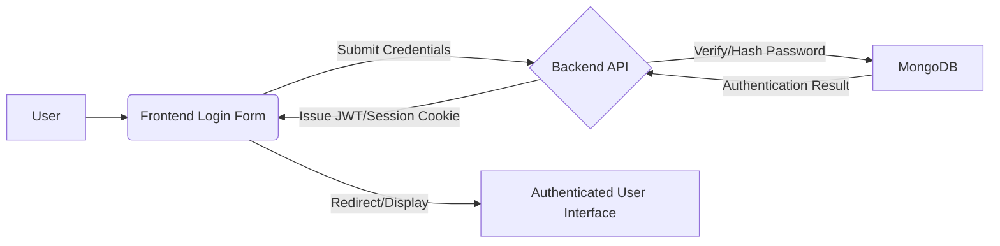

# System Overview

<TOC />

This document provides a comprehensive overview of the Chat-App-MERN project, a real-time chat application built using the MERN (MongoDB, Express.js, React, Node.js) stack. It aims to offer a detailed understanding of the system's purpose, architectural design, core technologies, and key features, catering to developers seeking to understand or contribute to the project.

## System Purpose

The Chat-App-MERN project is a modern, full-stack application designed to facilitate real-time communication between users. Its primary purpose is to provide a platform where users can register, log in, manage their profiles, and engage in instant messaging, akin to popular chat applications. The project leverages the power of the MERN stack to deliver a responsive and interactive user experience with robust backend services.

Key functionalities include:

*   **User Authentication and Authorization:** Secure registration and login mechanisms, including support for third-party authentication (e.g., Google OAuth).
*   **Real-time Messaging:** Instant sending and receiving of messages between users, powered by WebSockets.
*   **Profile Management:** Users can view and potentially update their profiles.
*   **Media Handling:** Support for uploading and managing user-generated content, such as profile pictures.
*   **Scalability Foundations:** Designed with considerations for handling concurrent users and message volumes inherent in chat applications.

This project draws inspiration from [https://youtu.be/ntKkVrQqBYY?si=qz02MCKkMB80RT1jaH](https://youtu.be/ntKkVrQqBYY?si=qz02MCKkMB80RT1jaH).

## Architecture

The Chat-App-MERN project adopts a classic client-server architecture, typical of web applications utilizing the MERN stack. It is fundamentally composed of three main layers: the frontend (client-side), the backend (server-side), and the database. These layers interact to provide a seamless real-time chat experience.

*   **Frontend (Client-side):** Built with React, this layer is responsible for the user interface and user experience. It handles presenting chat rooms, message feeds, user lists, and forms for authentication. It communicates with the backend via RESTful API calls for data retrieval/submission and utilizes WebSockets for real-time messaging.
*   **Backend (Server-side):** Developed with Node.js and Express.js, this layer acts as the application's core logic. It manages API endpoints, authenticates users, handles real-time connections via Socket.IO, processes business logic, and interacts with the database. It also integrates with external services like Cloudinary for media storage.
*   **Database:** MongoDB, a NoSQL document database, is used to store application data such as user profiles, messages, and chat room information. Mongoose, an ODM (Object Data Modeling) library, provides a straightforward, schema-based solution to model application data and interact with MongoDB from the Node.js backend.

The interaction between these components is visualized in the following architecture diagram:


```mermaid
graph TD
    A[Client Browser] --> B(React Frontend)
    B --> C{Express Backend}
    C --> D[MongoDB Database]
    C --> E[Cloudinary Service]
    B <-- F{Real-time via Socket.IO}
```


**Explanation:**
1.  **Client Browser** interacts with the **React Frontend**.
2.  The **React Frontend** communicates with the **Express Backend** for data and logic.
3.  The **Express Backend** persists and retrieves data from the **MongoDB Database**.
4.  The **Express Backend** also interfaces with **Cloudinary Service** for media storage and management.
5.  **Real-time updates** (e.g., new messages, online status) are facilitated between the **React Frontend** and **Express Backend** using Socket.IO, establishing persistent WebSocket connections.

## Technology Stack

The project leverages the comprehensive MERN stack, complemented by several powerful libraries and tools for a robust and feature-rich chat application.

| Layer             | Technology / Library | Purpose                                                                                                                                              |
| :---------------- | :------------------- | :--------------------------------------------------------------------------------------------------------------------------------------------------- |
| **Frontend**      | React                | JavaScript library for building user interfaces.                                                                                                     |
|                   | Vite                 | Next-generation frontend tooling, provides a fast development server and optimized build process.                                                    |
|                   | Axios                | Promise-based HTTP client for making API requests to the backend.                                                                                    |
|                   | React Router DOM     | Declarative routing for React applications.                                                                                                          |
|                   | Zustand              | Small, fast, and scalable bearbones state-management solution for React.                                                                           |
|                   | Socket.IO Client     | JavaScript client for real-time bi-directional communication with the backend.                                                                       |
|                   | Tailwind CSS         | Utility-first CSS framework for rapidly building custom designs.                                                                                     |
|                   | DaisyUI              | Tailwind CSS component library providing ready-made UI components.                                                                                 |
|                   | Lucide React         | A collection of beautiful, custom-built icons for React.                                                                                           |
|                   | React Hot Toast      | Lightweight, accessible, and customizable toast notifications.                                                                                       |
| **Backend**       | Node.js              | JavaScript runtime environment for server-side execution.                                                                                            |
|                   | Express.js           | Fast, unopinionated, minimalist web framework for Node.js.                                                                                           |
|                   | MongoDB              | NoSQL document database for storing application data.                                                                                                |
|                   | Mongoose             | MongoDB object data modeling (ODM) tool for Node.js, providing schema validation and easy interaction.                                               |
|                   | Socket.IO            | Real-time engine for bi-directional event-based communication.                                                                                       |
|                   | bcryptjs             | Library for hashing passwords securely.                                                                                                              |
|                   | jsonwebtoken         | Implementation of JSON Web Tokens (JWT) for secure authentication.                                                                                   |
|                   | Passport             | Simple, unobtrusive authentication middleware for Node.js.                                                                                           |
|                   | Passport Google OAuth| Passport strategy for authenticating with Google using the OAuth 2.0 API.                                                                            |
|                   | Cloudinary           | Cloud-based image and video management service for uploads and transformations.                                                                      |
|                   | dotenv               | Loads environment variables from a `.env` file.                                                                                                      |
|                   | Cookie-Parser        | Parse Cookie header and populate `req.cookies` with an object keyed by the cookie names.                                                             |
|                   | Express-Session      | Simple session middleware for Express.                                                                                                               |
| **Development**   | Nodemon              | Utility that monitors for any changes in your Node.js application and automatically restarts the server.                                             |
|                   | Vite                 | Development server for frontend.                                                                                                                     |
|                   | ESLint               | Pluggable JavaScript linter.                                                                                                                         |
|                   | Autoprefixer         | PostCSS plugin to parse CSS and add vendor prefixes to CSS rules using values from Can I Use.                                                        |
|                   | PostCSS              | Tool for transforming CSS with JavaScript plugins.                                                                                                   |

The project's build and development scripts are defined across its `package.json` files. The root `package.json` orchestrates the setup and startup of both frontend and backend components.

**Root `package.json` Scripts:**
[View on GitHub](https://github.com/shinymack/Chat-App-MERN/blob/main/package.json)
```json
{
  "name": "chatapp",
  "version": "1.0.0",
  "main": "index.js",
  "scripts": {
    "build" : "npm install --prefix backend && npm install --prefix frontend && npm run build --prefix frontend",
    "start" : "npm run start --prefix backend"
  },
  "keywords": [],
  "author": "",
  "license": "ISC",
  "description": ""
}
```
*   **`npm run build`**: This script streamlines the setup by installing dependencies for both backend and frontend, then triggers the frontend's build process. This ensures that the entire application is ready for deployment or production environments.
*   **`npm run start`**: This command initiates the backend server, making the API and WebSocket services available. The frontend must be served separately or built and served statically.

**Backend `package.json` Scripts:**
[View on GitHub](https://github.com/shinymack/Chat-App-MERN/blob/main/backend/package.json)
```json
{
  "name": "backend",
  "version": "1.0.0",
  "main": "src/index.js",
  "scripts": {
    "dev": "nodemon src/index.js",
    "start": "node src/index.js"
  },
  "author": "",
  "type": "module",
  "license": "ISC",
  "description": "",
  "dependencies": {
    // ... dependencies ...
  },
  "devDependencies": {
    "nodemon": "^3.1.9"
  }
}
```
*   **`npm run dev`**: Uses `nodemon` to run `src/index.js`, automatically restarting the server on file changes. Ideal for rapid development.
*   **`npm run start`**: Executes `src/index.js` directly with Node.js, suitable for production environments.

**Frontend `package.json` Scripts:**
[View on GitHub](https://github.com/shinymack/Chat-App-MERN/blob/main/frontend/package.json)
```json
{
  "name": "frontend",
  "private": true,
  "version": "0.0.0",
  "type": "module",
  "scripts": {
    "dev": "vite",
    "build": "vite build",
    "lint": "eslint .",
    "preview": "vite preview",
    "mobile": "vite --host"
  },
  "dependencies": {
    // ... dependencies ...
  },
  "devDependencies": {
    // ... devDependencies ...
  }
}
```
*   **`npm run dev`**: Starts the Vite development server for the frontend, providing hot module replacement (HMR) for a smooth development experience.
*   **`npm run build`**: Compiles the React application into static assets for production deployment using Vite.
*   **`npm run lint`**: Runs ESLint to check for code quality and style issues.
*   **`npm run preview`**: Serves the production build locally for testing before deployment.
*   **`npm run mobile`**: Starts the Vite development server accessible over the local network, useful for testing on mobile devices.

## Features

The Chat-App-MERN project incorporates several key features essential for a modern chat application:

### 1. User Authentication and Authorization
The application provides robust user authentication, allowing users to securely register and log in. This includes both traditional email/password authentication and simplified sign-in via Google OAuth.

**Flow of User Authentication:**





**Explanation:**
1.  **User** interacts with the **Frontend Login Form**.
2.  Credentials are **Submitted** to the **Backend API**.
3.  The **Backend API** **Verifies/Hashes Password** against **MongoDB**.
4.  **Authentication Result** is sent back to the **Backend API**.
5.  On success, the **Backend API** **Issues JWT/Session Cookie** to the **Frontend Login Form**.
6.  The **Frontend** then **Redirects/Displays** the **Authenticated User Interface**.

*   **Secure Password Hashing:** `bcryptjs` is used on the backend to hash user passwords before storing them in MongoDB, ensuring that even if the database is compromised, passwords remain secure.
*   **JSON Web Tokens (JWT):** `jsonwebtoken` is employed for stateless authentication. Upon successful login, the backend issues a JWT, which the frontend stores and sends with subsequent requests to access protected resources.
*   **OAuth 2.0 with Passport.js:** `passport` and `passport-google-oauth20` provide a flexible authentication layer, enabling users to sign up and log in using their Google accounts, enhancing convenience and reducing friction.
*   **Session Management:** `cookie-parser` and `express-session` are used for managing user sessions, especially relevant for traditional login flows and maintaining state on the server.

### 2. Real-time Messaging
The core of any chat application is its ability to deliver messages in real-time. This project achieves this using WebSockets.

*   **Socket.IO:** Both `socket.io` (backend) and `socket.io-client` (frontend) are integrated to establish and manage persistent WebSocket connections. This allows for instant, bi-directional communication, enabling messages to be delivered to recipients without requiring page refreshes or polling.
*   **Event-driven Communication:** Messages, typing indicators, and online status updates are exchanged as events over the WebSocket connection, ensuring low-latency interactions.

### 3. Profile Management and Media Uploads
Users can manage aspects of their profile, including potentially uploading profile pictures.

*   **Cloudinary Integration:** `cloudinary` is utilized on the backend to handle media file uploads. This offloads storage and image manipulation tasks to a specialized cloud service, improving performance and scalability. Frontend uploads are sent to the backend, which then forwards them to Cloudinary.

### 4. Responsive User Interface
The frontend is built to be intuitive and responsive across various devices.

*   **React:** Provides a component-based architecture for building a modular and maintainable UI.
*   **Tailwind CSS & DaisyUI:** These frameworks streamline UI development, offering a vast array of utility classes and pre-built components to create a visually appealing and consistent user experience with minimal custom CSS.
*   **Lucide React & React Icons:** Enhance the UI with a rich set of vector icons.

### 5. Client-side State Management
`zustand` manages the application's global state on the frontend.

*   **Zustand:** A lightweight and flexible state management library that provides a simple API for creating stores and managing state, leading to cleaner and more predictable code. This is crucial for managing chat states (e.g., active conversations, user online status, pending messages) efficiently.

## Key Integration Points

Understanding how different parts of the Chat-App-MERN project interact is crucial for development and maintenance.

*   **API and WebSocket Communication:** The frontend communicates with the backend primarily through two channels:
    *   **RESTful APIs (via Axios):** Used for non-real-time operations such as user registration, login, profile updates, and fetching historical data. These are standard HTTP requests.
    *   **WebSockets (via Socket.IO):** Essential for real-time features like sending/receiving messages, typing indicators, and online/offline status updates. The frontend establishes a persistent WebSocket connection to the backend after authentication.
*   **Authentication Flow:** The authentication mechanism is a critical integration point.
    1.  User submits credentials (or clicks "Sign in with Google") from the React frontend.
    2.  The frontend sends this to the Express backend.
    3.  The backend validates credentials (hashing with `bcryptjs`, checking against `mongoose`/MongoDB, or redirecting to Google OAuth).
    4.  Upon success, a JWT is issued by `jsonwebtoken` (for stateless API calls) or a session is established (`express-session`, `cookie-parser`).
    5.  The JWT/session cookie is sent back to the frontend.
    6.  For subsequent requests to protected routes, the frontend includes the JWT in the request headers, which the backend verifies using `jsonwebtoken` and `passport`.
*   **Database Interaction:** All persistent data operations (CRUD for users, messages, conversations) flow from the Express backend to MongoDB via Mongoose. The backend is the sole intermediary between the frontend and the database, ensuring data integrity and security.
*   **Media Uploads:** When a user uploads a file (e.g., a profile picture), the frontend sends it to a specific backend API endpoint. The backend then uses the `cloudinary` SDK to upload the file to Cloudinary, receiving a URL in return. This URL is then stored in MongoDB (e.g., as part of the user's profile) and sent back to the frontend for display.
*   **Environment Variables:** `dotenv` is used across the backend to securely manage sensitive information like database connection strings, JWT secrets, Cloudinary API keys, and Google OAuth credentials. This separation is vital for security and ease of deployment across different environments.
*   **Scalability Insights:** For a chat application, scalability is paramount. The MERN stack, while powerful, requires careful consideration.
    *   **Stateless Backend (JWT-based):** Facilitates horizontal scaling of the backend by allowing any server instance to handle any request without relying on in-memory session data.
    *   **MongoDB Sharding:** For very large datasets, MongoDB can be sharded to distribute data across multiple machines.
    *   **Socket.IO Adapters:** For multi-instance Node.js deployments (load balancing), Socket.IO needs a custom adapter (e.g., `socket.io-redis`) to ensure messages are correctly broadcasted across all connected clients, regardless of which backend server instance they are connected to.
    *   **Cloudinary for Media:** Offloading media storage and processing significantly reduces the load on the application servers.

Next: [Backend Architecture](./2_backend-architecture.mdx)