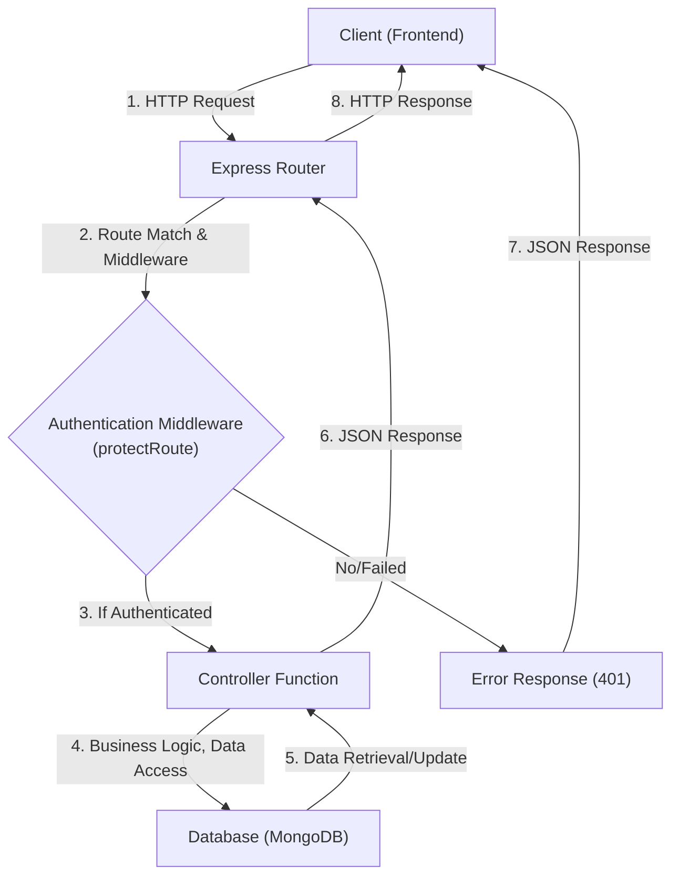

---
title: "API Design and Routing"
description: "Explains the structure of backend API endpoints, route definitions, and associated controller logic."
sidebar_position: 21
---

# API Design and Routing

<TOC />

This section delves into the architecture of the backend API, focusing on how endpoints are defined, requests are routed, and business logic is handled by controllers. Understanding this structure is crucial for navigating the server-side operations, from user authentication to managing friend requests and messaging.

The API follows a modular approach, separating concerns into distinct route files and their corresponding controller functions. This ensures maintainability, scalability, and a clear separation of duties.

## Core API Structure

The backend API is built using Node.js with the Express.js framework. It organizes endpoints into feature-specific route files, each responsible for defining the HTTP methods and paths for a particular domain (e.g., authentication, friends, messages). These routes then delegate the actual request processing to controller functions.

### Request Flow Overview

The diagram below illustrates the typical lifecycle of an API request, from the client's initiation to the backend's response.





## Authentication Routes and Controller

The `auth.route.js` file defines all endpoints related to user authentication, including signup, login, logout, profile updates, and Google OAuth. The `auth.controller.js` implements the business logic for each of these operations.

### Auth Route Definitions

The `auth.route.js` centralizes all authentication-related API endpoints. It imports controller functions and applies middleware like `protectRoute` where necessary to secure endpoints.

```javascript showLineNumbers {1, 5-7, 9-10, 12, 14, 16-17, 19, 21, 23, 25-33}
// backend/src/routes/auth.route.js
import express from "express"
import passport from 'passport';
import { login, logout, signup, updateProfile, checkAuth, googleAuthCallback, checkUsernameAvailability} from  "../controllers/auth.controller.js"
import { protectRoute } from "../middleware/auth.middleware.js"
const router = express.Router();

router.post("/signup", signup);

router.post("/login", login);

router.post("/logout", logout);

router.put("/update-profile", protectRoute ,updateProfile)

router.get("/username/check/:username", protectRoute, checkUsernameAvailability);

router.get("/check", protectRoute, checkAuth)

router.get(
    '/google',
    passport.authenticate('google', { scope: ['profile', 'email'] })
);
router.get(
    '/google/callback',
    passport.authenticate('google', {
        // successRedirect: 'http://localhost:5173/', 
        failureRedirect: 'http://localhost:5173/login', 
        failureMessage: true // Allows passing failure messages
    }),
    googleAuthCallback 
);
export default router;
```
<p align="center">
    <i>View on GitHub: <a href="https://github.com/shinymack/Chat-App-MERN/blob/main/backend/src/routes/auth.route.js">auth.route.js</a></i>
</p>

Key aspects of `auth.route.js`:
*   **`router.post("/signup", signup);`**: Handles new user registration.
*   **`router.put("/update-profile", protectRoute, updateProfile)`**: An example of a protected route requiring user authentication (`protectRoute` middleware).
*   **Google OAuth Endpoints**: Integrates Passport.js for Google authentication, defining the initiation and callback routes.

### Auth Controller Logic

The `auth.controller.js` contains functions that encapsulate the core business logic for authentication. Each function handles a specific API endpoint, processing request data, interacting with the database, and sending appropriate responses.

#### User Signup

The `signup` function demonstrates essential steps for new user registration: input validation, checking for existing users, password hashing, user creation, and JWT generation.

```javascript showLineNumbers {3-11, 25-28, 41-43}
// backend/src/controllers/auth.controller.js
export const signup = async (req, res) => {
    const {username, email, password} = req.body;
    try {
        if(!username || !email || !password) {
            return res.status(400).json({message: "Please fill in all fields."});
        }
        if (username.length < 3) {
            return res.status(400).json({ message: "Username must be at least 3 characters." });
        }
        if (username.length > 20) {
            return res.status(400).json({ message: "Username cannot be more than 20 characters." });
        }
        if (password.length < 6) {
            return res.status(400).json({message: "Password must be at least 6 characters."});
        }
        const user = await User.findOne({email});
        if (user) return res.status(400).json({message: "Email already exists."});
        
        const existingUserByUsername = await User.findOne({ username });
        if (existingUserByUsername) {
            return res.status(400).json({ message: "Username already exists. Please choose another." });
        }

        const salt = await bcrypt.genSalt(10);
        const hashedPassword = await bcrypt.hash(password, salt);

        const newUser = new User({
            username,
            email,
            password: hashedPassword,
            authProvider: 'email'
        });
        if(newUser){
            //generate jwt token here
            generateToken(newUser._id, res);
            await newUser.save();

            res.status(201).json({
                _id: newUser._id,
                username: newUser.username,
                email: newUser.email,   
                profilePic: newUser.profilePic,
                authProvider: newUser.authProvider
            });
        } else {
            res.status(400).json({message: "Invalid user data."});
        }
    } catch (error) {
        console.log("Error in signup controller", error.message)
        res.status(500).json({message: "Something went wrong."});
    }
};
```
<p align="center">
    <i>View on GitHub: <a href="https://github.com/shinymack/Chat-App-MERN/blob/main/backend/src/controllers/auth.controller.js#L7-L54">auth.controller.js#L7-L54</a></i>
</p>

#### Profile Update

The `updateProfile` function allows authenticated users to change their profile picture and username. It includes logic for validating the new username and uploading images to Cloudinary.

```javascript showLineNumbers {6-12, 19-20, 24-28, 32-35, 41-42}
// backend/src/controllers/auth.controller.js
export const updateProfile = async (req, res) => {
    try {
        const { profilePic, username } = req.body; 
        const userId = req.user._id;
        let userToUpdate = await User.findById(userId);

        if (!userToUpdate) {
            return res.status(404).json({ message: "User not found." });
        }

        const fieldsToUpdate = {};
        let newUsername = username ? username.trim() : null;
        let usernameChanged = false;

        if (newUsername && newUsername !== userToUpdate.username) {
            if (newUsername.length < 3 || newUsername.length > 20) {
                return res.status(400).json({ message: "Username must be between 3 and 20 characters." });
            }

            const existingUserWithNewUsername = await User.findOne({ username: newUsername, _id: { $ne: userId } });
            if (existingUserWithNewUsername) {
                return res.status(400).json({ message: "This username is already taken by someone else." });
            }
            fieldsToUpdate.username = newUsername;
            usernameChanged = true;
        }

        if (profilePic) {
            const uploadResponse = await cloudinary.uploader.upload(profilePic);
            fieldsToUpdate.profilePic = uploadResponse.secure_url;
        }

        if (Object.keys(fieldsToUpdate).length === 0) {
            return res.status(400).json({ message: "No changes provided to update." });
        }

        const updatedUser = await User.findByIdAndUpdate(userId, { $set: fieldsToUpdate }, { new: true });

        if (!updatedUser) {
            return res.status(404).json({ message: "Failed to update user."});
        }

        generateToken(updatedUser._id, res);

        res.status(200).json(updatedUser);

    } catch (error) {
        console.error("Error in updateProfile controller", error.message);
        if (error.code === 11000 && error.keyValue && error.keyValue.username) { 
            return res.status(400).json({ message: "This username is already taken." });
        }
        res.status(500).json({ message: "Internal Server Error while updating profile." });
    }
};
```
<p align="center">
    <i>View on GitHub: <a href="https://github.com/shinymack/Chat-App-MERN/blob/main/backend/src/controllers/auth.controller.js#L145-L211">auth.controller.js#L145-L211</a></i>
</p>

This controller function highlights:
*   **User Validation**: Ensures the user exists before attempting an update.
*   **Conditional Updates**: Fields are updated only if provided in the request body.
*   **Username Uniqueness**: Checks for existing usernames to prevent duplicates, excluding the current user's own ID.
*   **Cloudinary Integration**: For handling profile picture uploads.
*   **Token Refresh**: A new JWT is generated and set to ensure the cookie reflects any updated user information, like the username.

### Authentication Flow Diagram

This sequence diagram illustrates the steps involved when a user attempts to sign up or log in.


```mermaid
sequenceDiagram
    participant U as "User"
    participant F as "Frontend (React)"
    participant R as "Auth Route (Express)"
    participant C as "Auth Controller"
    participant DB as "MongoDB"
    participant H as "Bcrypt"
    participant J as "JWT Utility"

    U->>+F: "Submit Signup/Login Form"
    F->>+R: "POST /api/auth/signup or /api/auth/login\n(with credentials)"
    R->>C: "Call signup/login Controller"
    C->>DB: "Query User (check email/username)"
    alt User Exists (Login)
        DB-->>C: "User Data"
        C->>H: "Compare Password"
        H-->>C: "Password Valid (boolean)"
        alt Password Invalid
            C-->>R: "400 Invalid Credentials"
            R-->>-F: "Error Response"
            F->>-U: "Display Error"
        else Password Valid
            C->>J: "Generate JWT"
            J-->>C: "JWT Token"
            C-->>R: "200 OK & Set JWT Cookie"
            R-->>-F: "Success Response"
            F->>-U: "Redirect to Dashboard"
        end
    else New User (Signup)
        DB-->>C: "No Existing User"
        C->>H: "Hash Password"
        H-->>C: "Hashed Password"
        C->>DB: "Create New User"
        DB-->>C: "New User Object"
        C->>J: "Generate JWT"
        J-->>C: "JWT Token"
        C-->>R: "201 Created & Set JWT Cookie"
        R-->>-F: "Success Response"
        F->>-U: "Redirect to Dashboard"
    end
```


## Friend Management Routes and Controller

The `friend.route.js` file handles all API calls related to managing friend relationships, such as sending, accepting, rejecting requests, and listing friends. All these routes are protected by authentication middleware.

```javascript showLineNumbers
// backend/src/routes/friend.route.js
import express from "express";
import {
    sendFriendRequest,
    acceptFriendRequest,
    rejectFriendRequest,
    removeFriend,
    getFriends,
    getPendingRequests,
    getSentRequests
} from "../controllers/friend.controller.js";
import { protectRoute } from "../middleware/auth.middleware.js";

const router = express.Router();

// All routes here should be protected
router.use(protectRoute);

router.post("/request/send/", sendFriendRequest);

router.post("/request/accept/:senderId", acceptFriendRequest);

router.post("/request/reject/:senderId", rejectFriendRequest);

router.delete("/remove/:friendId", removeFriend);

router.get("/list", getFriends);

router.get("/requests/pending", getPendingRequests);

router.get("/requests/sent", getSentRequests);

export default router;
```
<p align="center">
    <i>View on GitHub: <a href="https://github.com/shinymack/Chat-App-MERN/blob/main/backend/src/routes/friend.route.js">friend.route.js</a></i>
</p>

Key features:
*   **`router.use(protectRoute);`**: A concise way to apply the `protectRoute` middleware to all subsequent routes defined in this router, ensuring that only authenticated users can access friend management features.
*   **Semantic Endpoints**: Routes like `/request/send`, `/request/accept/:senderId`, `/remove/:friendId` are clearly named to reflect their purpose and often use URL parameters to identify specific users or requests.

## Message Routes and Controller

The `message.route.js` defines endpoints for fetching user conversations, retrieving messages within a specific chat, and sending new messages. Like friend management, all message-related operations require authentication.

```javascript showLineNumbers
// backend/src/routes/message.route.js
import express from "express"
import { protectRoute } from "../middleware/auth.middleware.js";
import { getUsersForSidebar, getMessages, sendMessage } from "../controllers/message.controller.js";
const router = express.Router();

router.get("/users", protectRoute, getUsersForSidebar);

router.get("/:id", protectRoute, getMessages);

router.post("/send/:id", protectRoute, sendMessage);

export default router;
```
<p align="center">
    <i>View on GitHub: <a href="https://github.com/shinymack/Chat-App-MERN/blob/main/backend/src/routes/message.route.js">message.route.js</a></i>
</p>

This setup for messaging API endpoints shows:
*   **Dedicated Routes**: Each route targets a specific messaging functionality.
*   **`protectRoute` Middleware**: Ensures that only authenticated users can access message data or send messages, critical for privacy and security.
*   **Dynamic Routing**: The `/:id` parameter allows fetching messages for a specific conversation partner or sending a message to a particular user, identifying the target user by their ID.

## Key Integration Points

*   **Middleware for Security**: The `protectRoute` middleware is fundamental. It checks for a valid JWT in the request cookie, authenticates the user, and attaches user details to `req.user`. This ensures that sensitive routes are only accessible by authenticated users.
    ```javascript
    // backend/src/middleware/auth.middleware.js snippet
    import jwt from "jsonwebtoken";
    import User from "../models/user.model.js";

    export const protectRoute = async (req, res, next) => {
        try {
            const token = req.cookies.jwt;
            if (!token) {
                return res.status(401).json({ message: "Unauthorized - No Token Provided" });
            }
            const decoded = jwt.verify(token, process.env.JWT_SECRET);
            if (!decoded) {
                return res.status(401).json({ message: "Unauthorized - Invalid Token" });
            }
            const user = await User.findById(decoded.userId).select("-password");
            if (!user) {
                return res.status(404).json({ message: "User not found" });
            }
            req.user = user;
            next();
        } catch (error) {
            console.log("Error in protectRoute middleware", error.message);
            res.status(500).json({ message: "Internal Server Error" });
        }
    };
    ```
    <p align="center">
        <i>View on GitHub: <a href="https://github.com/shinymack/Chat-App-MERN/blob/main/backend/src/middleware/auth.middleware.js">auth.middleware.js</a></i>
    </p>

*   **Error Handling**: Controllers consistently include `try-catch` blocks to gracefully handle errors, log them, and send appropriate HTTP status codes and messages to the client. This is crucial for debugging and providing a good user experience.
*   **Modular Design**: The separation of routes, controllers, and middleware promotes a clean, organized codebase, making it easier to scale, test, and debug individual components.
*   **Google OAuth with Passport.js**: The integration of Passport.js simplifies the complex flow of OAuth 2.0, providing clear endpoints for initiation and callback handling. The `googleAuthCallback` controller then issues a JWT, seamlessly integrating Google-authenticated users into the application's session management.

Next: [Data Management and Persistence](./2.2_data-management-and-persistence.mdx)
```