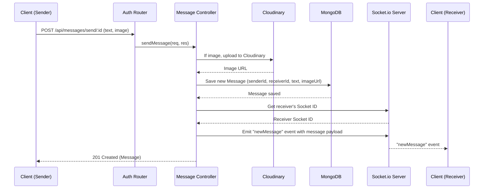

# API Endpoints and Controllers

<TOC />

This section details the RESTful API endpoints that form the backbone of the backend, along with the corresponding controllers responsible for handling business logic, data validation, and interactions with the database and external services. The API is structured to support user authentication, authorization, and real-time messaging capabilities.

## Backend Request Flow Architecture

The backend follows a typical layered architecture, where incoming requests traverse through routes, potentially authenticated by middleware, and then delegated to controllers for processing. These controllers interact with data models and external services, finally returning a response to the client.


```mermaid
graph TD
    A[Client Request] --> B{Router / Routes};
    B --> C{Authentication Middleware};
    C -- If Authenticated --> D[Controller];
    D --> E[Data Model / MongoDB];
    D -- Optional --> F[External Services (Cloudinary, Socket.io)];
    E --> D;
    F --> D;
    D --> G[Response];
    G --> A;
```


## Authentication API

The authentication module provides robust mechanisms for user registration, login, session management, profile updates, and Google OAuth integration.

### Authentication Routes

The `auth.route.js` file ([View on GitHub](https://github.com/shinymack/Chat-App-MERN/blob/main/backend/src/routes/auth.route.js)) defines the API routes for user authentication and profile management. These routes direct incoming HTTP requests to specific controller functions, often with middleware for security checks.

| Method | Path                            | Description                                    | Controller Function             | Middleware            |
| :----- | :------------------------------ | :--------------------------------------------- | :------------------------------ | :-------------------- |
| `POST` | `/api/auth/signup`              | Registers a new user account.                  | `signup`                        | None                  |
| `POST` | `/api/auth/login`               | Authenticates a user and establishes a session.| `login`                         | None                  |
| `POST` | `/api/auth/logout`              | Terminates the user's session.                 | `logout`                        | None                  |
| `PUT`  | `/api/auth/update-profile`      | Updates a user's profile information.          | `updateProfile`                 | `protectRoute`        |
| `GET`  | `/api/auth/username/check/:username` | Checks if a username is available.             | `checkUsernameAvailability`     | `protectRoute`        |
| `GET`  | `/api/auth/check`               | Verifies current user's authentication status. | `checkAuth`                     | `protectRoute`        |
| `GET`  | `/api/auth/google`              | Initiates Google OAuth login flow.             | `passport.authenticate('google')` | None                  |
| `GET`  | `/api/auth/google/callback`     | Callback URI for Google OAuth, handles success/failure. | `googleAuthCallback`            | `passport.authenticate('google')` |

A key aspect of the authentication routes is the `protectRoute` middleware, ensuring that only authenticated users can access certain sensitive endpoints.

```javascript
// backend/src/routes/auth.route.js
import express from "express"
import passport from 'passport';
import { login, logout, signup, updateProfile, checkAuth, googleAuthCallback, checkUsernameAvailability} from  "../controllers/auth.controller.js"
import { protectRoute } from "../middleware/auth.middleware.js"

const router = express.Router();

router.post("/signup", signup);
router.post("/login", login);
router.post("/logout", logout);
router.put("/update-profile", protectRoute ,updateProfile) // Protected route for profile updates

router.get("/google", passport.authenticate('google', { scope: ['profile', 'email'] }));
router.get("/google/callback",
    passport.authenticate('google', { failureRedirect: 'http://localhost:5173/login', failureMessage: true }),
    googleAuthCallback
);

export default router;
```
[[backend/src/routes/auth.route.js#L1-L22](https://github.com/shinymack/Chat-App-MERN/blob/main/backend/src/routes/auth.route.js#L1-L22)]

### Authentication Controllers

The `auth.controller.js` file ([View on GitHub](https://github.com/shinymack/Chat-App-MERN/blob/main/backend/src/controllers/auth.controller.js)) contains the business logic for all authentication-related operations.

#### `signup`

Handles new user registration. It performs extensive input validation for username, email, and password, checks for existing users, hashes the password using `bcryptjs` for security, and then creates a new user in the database. Upon successful registration, a JSON Web Token (JWT) is generated and set as an HTTP-only cookie for session management.

**Insights:** Robust validation and password hashing are critical security measures. Storing JWTs in HTTP-only cookies mitigates XSS attacks.

```javascript
// backend/src/controllers/auth.controller.js
export const signup = async (req, res) => {
    const {username, email, password} = req.body;
    try {
        if(!username || !email || !password) {
            return res.status(400).json({message: "Please fill in all fields."});
        }
        if (username.length < 3 || username.length > 20) {
            return res.status(400).json({ message: "Username must be between 3 and 20 characters." });
        }
        if (password.length < 6) {
            return res.status(400).json({message: "Password must be at least 6 characters."});
        }
        const user = await User.findOne({email});
        if (user) return res.status(400).json({message: "Email already exists."});
        
        const existingUserByUsername = await User.findOne({ username });
        if (existingUserByUsername) {
            return res.status(400).json({ message: "Username already exists. Please choose another." });
        }
        const salt = await bcrypt.genSalt(10);
        const hashedPassword = await bcrypt.hash(password, salt);
        const newUser = new User({
            username, email, password: hashedPassword, authProvider: 'email'
        });
        if(newUser){
            generateToken(newUser._id, res); // Generate JWT
            await newUser.save();
            res.status(201).json({ _id: newUser._id, username: newUser.username, email: newUser.email, profilePic: newUser.profilePic, authProvider: newUser.authProvider });
        } else {
            res.status(400).json({message: "Invalid user data."});
        }
    } catch (error) {
        console.log("Error in signup controller", error.message)
        res.status(500).json({message: "Something went wrong."});
    }
};
```
[[backend/src/controllers/auth.controller.js#L7-L49](https://github.com/shinymack/Chat-App-MERN/blob/main/backend/src/controllers/auth.controller.js#L7-L49)]

#### `login`

Authenticates a user by verifying their email and password. It checks if the user exists, handles cases for Google-authenticated users without passwords, and compares the provided password with the stored hashed password using `bcrypt.compare`. On successful authentication, a JWT is generated.

**Best Practices:** Always hash passwords and use secure comparison methods. Provide generic error messages for invalid credentials to prevent user enumeration attacks.

#### `logout`

Clears the JWT cookie, effectively logging the user out.

#### `checkAuth`

Used to verify if a user is currently authenticated. It relies on the `protectRoute` middleware to populate `req.user` with the authenticated user's details, which are then returned.

#### `googleAuthCallback`

This controller is invoked after a user successfully authenticates via Google OAuth. It sets a new JWT cookie for the user and redirects them to the frontend application.

**Insight:** This callback is crucial for integrating third-party authentication services, ensuring a seamless user experience post-OAuth.

#### `checkUsernameAvailability`

Allows checking if a desired username is available. It validates username length and ensures the requested username isn't already taken by another user, while also allowing the current user to keep their existing username.

#### `updateProfile`

Facilitates updating a user's profile, specifically their `profilePic` and `username`. It supports uploading new profile pictures to Cloudinary and updates the username, ensuring uniqueness checks for the new username. A new JWT is issued if the profile is successfully updated.

**Scalability:** Using external cloud storage like Cloudinary for image uploads offloads static file serving from the backend, improving performance and scalability. Re-issuing a JWT on profile updates ensures that any cached user data in the token (if present) is refreshed.

```javascript
// backend/src/controllers/auth.controller.js
export const updateProfile = async (req, res) => {
    try {
        const { profilePic, username } = req.body;
        const userId = req.user._id;
        let userToUpdate = await User.findById(userId);

        if (!userToUpdate) return res.status(404).json({ message: "User not found." });

        const fieldsToUpdate = {};
        let newUsername = username ? username.trim() : null;

        if (newUsername && newUsername !== userToUpdate.username) {
            if (newUsername.length < 3 || newUsername.length > 20) {
                return res.status(400).json({ message: "Username must be between 3 and 20 characters." });
            }
            const existingUserWithNewUsername = await User.findOne({ username: newUsername, _id: { $ne: userId } });
            if (existingUserWithNewUsername) {
                return res.status(400).json({ message: "This username is already taken by someone else." });
            }
            fieldsToUpdate.username = newUsername;
        }

        if (profilePic) {
            const uploadResponse = await cloudinary.uploader.upload(profilePic);
            fieldsToUpdate.profilePic = uploadResponse.secure_url;
        }

        if (Object.keys(fieldsToUpdate).length === 0) {
            return res.status(400).json({ message: "No changes provided to update." });
        }

        const updatedUser = await User.findByIdAndUpdate(userId, { $set: fieldsToUpdate }, { new: true });
        if (!updatedUser) return res.status(404).json({ message: "Failed to update user."});

        generateToken(updatedUser._id, res); // Refresh JWT with potentially new info
        res.status(200).json(updatedUser);

    } catch (error) {
        console.error("Error in updateProfile controller", error.message);
        if (error.code === 11000 && error.keyValue && error.keyValue.username) {
            return res.status(400).json({ message: "This username is already taken." });
        }
        res.status(500).json({ message: "Internal Server Error while updating profile." });
    }
};
```
[[backend/src/controllers/auth.controller.js#L143-L194](https://github.com/shinymack/Chat-App-MERN/blob/main/backend/src/controllers/auth.controller.js#L143-L194)]

## Messaging API

The messaging module enables users to retrieve conversations, fetch lists of other users, and send real-time text and image messages.

### Messaging Routes

The `message.route.js` file ([View on GitHub](https://github.com/shinymack/Chat-App-MERN/blob/main/backend/src/routes/message.route.js)) defines the API routes for message-related functionalities. All messaging routes are protected, requiring user authentication.

| Method | Path                            | Description                                        | Controller Function     | Middleware     |
| :----- | :------------------------------ | :------------------------------------------------- | :---------------------- | :------------- |
| `GET`  | `/api/messages/users`           | Retrieves a list of users for the sidebar (excluding the logged-in user). | `getUsersForSidebar`    | `protectRoute` |
| `GET`  | `/api/messages/:id`             | Fetches messages between the logged-in user and a specific chat partner. | `getMessages`           | `protectRoute` |
| `POST` | `/api/messages/send/:id`        | Sends a new message (text or image) to a specified receiver. | `sendMessage`           | `protectRoute` |

```javascript
// backend/src/routes/message.route.js
import express from "express"
import { protectRoute } from "../middleware/auth.middleware.js";
import { getUsersForSidebar, getMessages, sendMessage } from "../controllers/message.controller.js";

const router = express.Router();

router.get("/users", protectRoute, getUsersForSidebar); // Get all users except logged in one
router.get("/:id", protectRoute, getMessages); // Get messages for a specific conversation
router.post("/send/:id", protectRoute, sendMessage); // Send a message

export default router;
```
[[backend/src/routes/message.route.js#L1-L12](https://github.com/shinymack/Chat-App-MERN/blob/main/backend/src/routes/message.route.js#L1-L12)]

### Messaging Controllers

The `message.controller.js` file ([View on GitHub](https://github.com/shinymack/Chat-App-MERN/blob/main/backend/src/controllers/message.controller.js)) encapsulates the business logic for real-time messaging.

#### `getUsersForSidebar`

Retrieves a list of all users registered in the system, excluding the currently logged-in user. This is typically used to populate a chat sidebar where users can initiate new conversations.

**Efficiency:** The `.select("-password")` ensures that sensitive password hashes are not sent to the client, even if the query inadvertently retrieves them.

#### `getMessages`

Fetches all messages exchanged between the currently authenticated user and a specified chat partner. The query intelligently retrieves messages where either user is the sender or receiver.

```javascript
// backend/src/controllers/message.controller.js
export const getMessages = async (req, res) => {
    try {
        const {id : userToChatId } = req.params;
        const myId = req.user._id;

        const messages = await Message.find({
            $or: [ // Find messages where:
                {senderId: myId, receiverId:userToChatId}, // I sent to them
                {senderId: userToChatId, receiverId: myId}  // They sent to me
            ]
        });
        res.status(200).json(messages);
    } catch (error) {
        console.log("Error in getMessages controller:  ", error);
        res.status(500).json({ error: "Internal Server Error" });
    }
};
```
[[backend/src/controllers/message.controller.js#L26-L40](https://github.com/shinymack/Chat-App-MERN/blob/main/backend/src/controllers/message.controller.js#L26-L40)]

#### `sendMessage`

Handles sending new messages. It supports both text and image messages. If an image is provided, it's uploaded to Cloudinary, and the secure URL is stored. After saving the message, it leverages Socket.io to emit the new message in real-time to the receiver if they are currently online.

**Real-time Communication:** The integration with Socket.io is crucial for a responsive chat application, providing instant message delivery without requiring the client to poll for updates.

```javascript
// backend/src/controllers/message.controller.js
import User from "../models/user.model.js";
import Message from "../models/message.model.js";
import cloudinary from "../lib/cloudinary.js";
import { getReceiverSocketId, io } from "../lib/socket.js";

export const sendMessage = async (req, res) => {
    try {
        const { text, image } = req.body;
        const { id: receiverId } = req.params;
        const senderId = req.user._id;

        let imageUrl;
        if (image) {
            const uploadResponse = await cloudinary.uploader.upload(image);
            imageUrl = uploadResponse.secure_url;
        }
        const newMessage = new Message({
            senderId, receiverId, text, image: imageUrl,
        });

        await newMessage.save();

        const receiverSocketId = getReceiverSocketId(receiverId);

        if(receiverSocketId) {
            io.to(receiverSocketId).emit("newMessage", newMessage); // Emit message in real-time
        }

        res.status(201).json(newMessage);   
        
    } catch (error) {
        console.log("Error in sendMessage controller:  ", error);
        res.status(500).json({ error: "Internal Server Error" });
    }
};
```
[[backend/src/controllers/message.controller.js#L2-L25](https://github.com/shinymack/Chat-App-MERN/blob/main/backend/src/controllers/message.controller.js#L2-L25)]

### Message Sending Flow

The `sendMessage` operation demonstrates a common pattern for real-time applications involving external services and WebSockets.





## Key Integration Points

The API endpoints and their controllers are central to the application's functionality, integrating several key components:

*   **State Management:** JWTs are used for session management, providing a stateless authentication mechanism where the token itself contains necessary user information (or a reference to it).
*   **API Flows:** The sequential nature of middleware, route handlers, and controller logic ensures that requests are processed securely and efficiently. For instance, `protectRoute` acts as a gatekeeper, ensuring that only authorized users can access sensitive messaging and profile update functionalities.
*   **Authentication:** The system supports both traditional email/password authentication (with `bcrypt` for secure storage) and integrates with Google OAuth via `passport.js` for enhanced user convenience. JWTs are consistently used to maintain user sessions across both authentication providers.
*   **Database Interactions:** Controllers directly interact with MongoDB (via Mongoose models) to store and retrieve user and message data, leveraging Mongoose's powerful querying capabilities for operations like fetching conversation history or user lists.
*   **External Services:** Cloudinary is seamlessly integrated for handling image uploads, offloading storage and optimization concerns from the backend server.
*   **Real-time Communication:** Socket.io is a critical component, enabling instant message delivery and other real-time interactions, fostering a dynamic and responsive user experience.

These integrations highlight a modern, scalable approach to building web applications, combining robust security practices with efficient data handling and real-time capabilities.

Next: [Data Models and Schema](./2.2_data-models-and-schema.mdx)