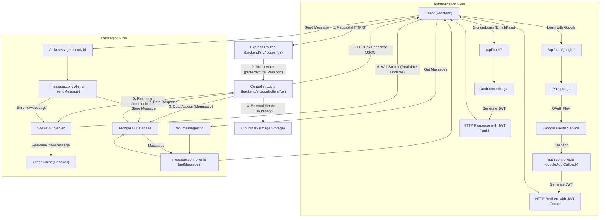
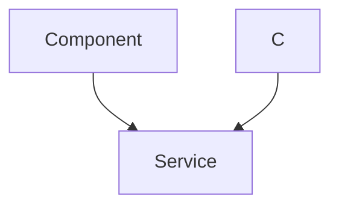

---
title: "API Endpoints and Controllers"
description: "Documentation of the various REST API endpoints and their corresponding controller logic."
sidebar_position: 21
---

# API Endpoints and Controllers
<TOC />

This section provides comprehensive documentation of the REST API endpoints, detailing their purpose, the underlying controller logic, and interactions with the system. The API serves as the primary interface for client applications (frontend) to interact with the backend services, managing user authentication, profile management, and real-time messaging.

## Authentication Endpoints and Controllers

The authentication module handles user registration, login, logout, session management, and profile updates. It supports both traditional email/password authentication and Google OAuth. The core logic resides in [auth.controller.js](https://github.com/shinymack/Chat-App-MERN/blob/main/backend/src/controllers/auth.controller.js) and is exposed via routes defined in [auth.route.js](https://github.com/shinymack/Chat-App-MERN/blob/main/backend/src/routes/auth.route.js).

### User Registration (`/api/auth/signup`)

**Purpose:** Allows new users to create an account with a unique username and email.

**Functionality:**
*   **Input Validation:** Ensures `username`, `email`, and `password` are provided and meet length requirements (username 3-20 chars, password >= 6 chars).
*   **Uniqueness Checks:** Verifies that both the provided `email` and `username` do not already exist in the database.
*   **Password Hashing:** Uses `bcryptjs` to hash the user's password securely before storage.
*   **JWT Generation:** Upon successful registration, a JSON Web Token (JWT) is generated and set as an HTTP-only cookie for session management.
*   **User Creation:** A new `User` document is created in the database with `authProvider` set to 'email'.

**Insights:**
*   The use of `bcryptjs` with a salt round of 10 provides a strong, industry-standard approach to password security.
*   Generating a JWT immediately after signup streamlines the user experience, allowing them to be logged in without an extra step.
*   Extensive input validation at the controller level prevents common security vulnerabilities and ensures data integrity.

```javascript
// backend/src/controllers/auth.controller.js
export const signup = async (req, res) => {
    const {username, email, password} = req.body;
    try {
        if(!username || !email || !password) {
            return res.status(400).json({message: "Please fill in all fields."});
        }
        if (username.length < 3) {
            return res.status(400).json({ message: "Username must be at least 3 characters." });
        }
        // ...
        const user = await User.findOne({email});
        if (user) return res.status(400).json({message: "Email already exists."});
        
        const existingUserByUsername = await User.findOne({ username });
        if (existingUserByUsername) {
            return res.status(400).json({ message: "Username already exists. Please choose another." });
        }

        const salt = await bcrypt.genSalt(10);
        const hashedPassword = await bcrypt.hash(password, salt);

        const newUser = new User({
            username, email, password: hashedPassword, authProvider: 'email'
        });
        if(newUser){
            generateToken(newUser._id, res);
            await newUser.save();
            res.status(201).json({
                _id: newUser._id, username: newUser.username, email: newUser.email,   
                profilePic: newUser.profilePic, authProvider: newUser.authProvider
            });
        } else { res.status(400).json({message: "Invalid user data."}); }
    } catch (error) {
        console.log("Error in signup controller", error.message)
        res.status(500).json({message: "Something went wrong."});
    }
};
```
[View signup controller on GitHub](https://github.com/shinymack/Chat-App-MERN/blob/main/backend/src/controllers/auth.controller.js#L6-L58)

### User Login (`/api/auth/login`)

**Purpose:** Authenticates existing users based on their email and password.

**Functionality:**
*   **User Lookup:** Finds a user by `email`.
*   **Credential Validation:** Compares the provided `password` with the stored hashed password using `bcrypt.compare()`.
*   **Google Auth Check:** Prevents users who signed up via Google from logging in with email/password if they don't have a local password set.
*   **JWT Generation:** On successful authentication, a new JWT is generated and set as an HTTP-only cookie.

### User Logout (`/api/auth/logout`)

**Purpose:** Terminates the user's session.

**Functionality:**
*   Clears the `jwt` cookie by setting its `maxAge` to 0, effectively expiring it.

### Check Authentication Status (`/api/auth/check`)

**Purpose:** Verifies if a user is currently authenticated and retrieves their profile information.

**Functionality:**
*   Utilizes the `protectRoute` middleware to ensure a valid JWT is present.
*   If authenticated, returns the user's details (`_id`, `username`, `email`, `profilePic`, `authProvider`, `createdAt`) from the `req.user` object populated by the middleware.

### Google OAuth Integration

The application integrates with Google for authentication, providing a seamless signup/login experience.

*   **Initiate Google Auth (`/api/auth/google`):**
    *   Redirects the user to Google's authentication page.
    *   Uses `passport.authenticate('google', { scope: ['profile', 'email'] })` to request necessary user data.

*   **Google Auth Callback (`/api/auth/google/callback`):**
    *   Handles the redirect back from Google after user authentication.
    *   `passport.authenticate('google', { ... })` processes the Google response.
    *   If authentication is successful, the `googleAuthCallback` controller is invoked.
    *   A JWT is generated for the new/existing user and the user is redirected to the frontend URL.
    *   Handles failure redirects to the login page with an error message.

```javascript
// backend/src/routes/auth.route.js
router.get(
    '/google',
    passport.authenticate('google', { scope: ['profile', 'email'] })
);
router.get(
    '/google/callback',
    passport.authenticate('google', {
        // successRedirect: 'http://localhost:5173/', 
        failureRedirect: 'http://localhost:5173/login', 
        failureMessage: true // Allows passing failure messages
    }),
    googleAuthCallback 
);
```
[View Google Auth routes on GitHub](https://github.com/shinymack/Chat-App-MERN/blob/main/backend/src/routes/auth.route.js#L26-L35)

### Username Availability Check (`/api/auth/username/check/:username`)

**Purpose:** Allows the frontend to check if a desired username is available before a user attempts to update their profile or during signup.

**Functionality:**
*   **Path Parameter:** Takes the `username` as a URL parameter.
*   **Validation:** Checks if the username meets length requirements (3-20 characters).
*   **Self-Check:** Returns `available: true` if the requested username is the current authenticated user's existing username.
*   **Database Lookup:** Queries the `User` model to see if any other user has the specified `username`.

**Best Practices:**
*   Real-time availability checks enhance user experience by providing immediate feedback on username choices.
*   Pre-validation at the client-side combined with server-side validation ensures robust input handling.

### Profile Update (`/api/auth/update-profile`)

**Purpose:** Enables authenticated users to update their profile picture and username.

**Functionality:**
*   **Authentication:** Requires `protectRoute` middleware, ensuring only logged-in users can update their own profile.
*   **Username Update:**
    *   Validates new username length (3-20 characters).
    *   Checks for uniqueness against other users (excluding the current user).
    *   Updates the `username` field if valid and unique.
*   **Profile Picture Update:**
    *   If `profilePic` (expected as a base64 string or similar) is provided, it uploads the image to Cloudinary.
    *   Stores the `secure_url` from Cloudinary in the `profilePic` field.
*   **Database Update:** Uses `findByIdAndUpdate` to atomic update the user document.
*   **JWT Refresh:** A new JWT is generated upon successful update to reflect any changes in user data that might be encoded in the token (e.g., username).

```javascript
// backend/src/controllers/auth.controller.js
export const updateProfile = async (req, res) => {
    try {
        const { profilePic, username } = req.body;
        const userId = req.user._id;
        let userToUpdate = await User.findById(userId);

        if (!userToUpdate) return res.status(404).json({ message: "User not found." });

        const fieldsToUpdate = {};
        let newUsername = username ? username.trim() : null;

        if (newUsername && newUsername !== userToUpdate.username) {
            if (newUsername.length < 3 || newUsername.length > 20) {
                return res.status(400).json({ message: "Username must be between 3 and 20 characters." });
            }
            const existingUserWithNewUsername = await User.findOne({ username: newUsername, _id: { $ne: userId } });
            if (existingUserWithNewUsername) {
                return res.status(400).json({ message: "This username is already taken by someone else." });
            }
            fieldsToUpdate.username = newUsername;
        }

        if (profilePic) {
            const uploadResponse = await cloudinary.uploader.upload(profilePic);
            fieldsToUpdate.profilePic = uploadResponse.secure_url;
        }

        if (Object.keys(fieldsToUpdate).length === 0) {
            return res.status(400).json({ message: "No changes provided to update." });
        }

        const updatedUser = await User.findByIdAndUpdate(userId, { $set: fieldsToUpdate }, { new: true });
        if (!updatedUser) return res.status(404).json({ message: "Failed to update user."});

        generateToken(updatedUser._id, res);
        res.status(200).json(updatedUser);

    } catch (error) {
        console.error("Error in updateProfile controller", error.message);
        if (error.code === 11000 && error.keyValue && error.keyValue.username) {
            return res.status(400).json({ message: "This username is already taken." });
        }
        res.status(500).json({ message: "Internal Server Error while updating profile." });
    }
};
```
[View updateProfile controller on GitHub](https://github.com/shinymack/Chat-App-MERN/blob/main/backend/src/controllers/auth.controller.js#L182-L245)

## Messaging Endpoints and Controllers

The messaging module enables users to send and receive direct messages. It integrates with real-time WebSocket communication for instant message delivery. The logic is implemented in [message.controller.js](https://github.com/shinymack/Chat-App-MERN/blob/main/backend/src/controllers/message.controller.js) and routed via [message.route.js](https://github.com/shinymack/Chat-App-MERN/blob/main/backend/src/routes/message.route.js).

### Get Users for Sidebar (`/api/messages/users`)

**Purpose:** Retrieves a list of all other registered users, excluding the currently logged-in user, for display in a chat sidebar.

**Functionality:**
*   **Authentication:** Protected by `protectRoute` middleware.
*   **User Filtering:** Queries the `User` model to find all users whose `_id` is not equal to the `loggedInUserId`.
*   **Sensitive Data Exclusion:** Uses `.select("-password")` to prevent sending hashed passwords to the client.

```javascript
// backend/src/controllers/message.controller.js
export const getUsersForSidebar = async (req, res) => {
    try {
        const loggedInUserId = req.user._id;
        const filteredUsers = await User.find({
            _id: { $ne: loggedInUserId }}).select("-password");  
        res.status(200).json(filteredUsers);
    }
    catch (error) {
        console.log("Error in getUsersForSidebar: ", error);
        res.status(500).json({ error: "Internal Server Error" });
    }
};
```
[View getUsersForSidebar controller on GitHub](https://github.com/shinymack/Chat-App-MERN/blob/main/backend/src/controllers/message.controller.js#L7-L18)

### Get Conversation Messages (`/api/messages/:id`)

**Purpose:** Fetches all messages exchanged between the logged-in user and a specific chat partner.

**Functionality:**
*   **Authentication:** Protected by `protectRoute` middleware.
*   **Path Parameter:** `id` represents the `_id` of the user to chat with.
*   **Message Retrieval:** Queries the `Message` model using an `$or` condition to find messages where:
    *   `senderId` is the logged-in user and `receiverId` is the chat partner, OR
    *   `senderId` is the chat partner and `receiverId` is the logged-in user.

### Send Message (`/api/messages/send/:id`)

**Purpose:** Allows an authenticated user to send a new message to another user.

**Functionality:**
*   **Authentication:** Protected by `protectRoute` middleware.
*   **Path Parameter:** `id` represents the `_id` of the receiver user.
*   **Input:** Expects `text` and/or `image` (base64 string) in the request body.
*   **Image Upload:** If an `image` is provided, it's uploaded to Cloudinary, and the `secure_url` is stored.
*   **Message Creation:** A new `Message` document is created in the database.
*   **Real-time Delivery:**
    *   Retrieves the `socketId` of the receiver using `getReceiverSocketId()`.
    *   If the receiver is online (has an active socket connection), the new message is emitted to their socket using `io.to(receiverSocketId).emit("newMessage", newMessage)`.

**Scalability Considerations:**
*   Using Cloudinary for image storage offloads media management from the primary application server, improving performance and scalability.
*   WebSocket integration allows for efficient real-time communication without constant polling, reducing server load for active chats.

```javascript
// backend/src/controllers/message.controller.js
export const sendMessage = async (req, res) => {
    try {
        const { text, image } = req.body;
        const { id: receiverId } = req.params;
        const senderId = req.user._id;

        let imageUrl;
        if (image) {
            const uploadResponse = await cloudinary.uploader.upload(image);
            imageUrl = uploadResponse.secure_url;
        }
        const newMessage = new Message({
            senderId, receiverId, text, image: imageUrl,
        });

        await newMessage.save();

        const receiverSocketId = getReceiverSocketId(receiverId);

        if(receiverSocketId) {
            io.to(receiverSocketId).emit("newMessage", newMessage);
        }

        res.status(201).json(newMessage);   
        
    } catch (error) {
        console.log("Error in sendMessage controller:  ", error);
        res.status(500).json({ error: "Internal Server Error" });
    }
};
```
[View sendMessage controller on GitHub](https://github.com/shinymack/Chat-App-MERN/blob/main/backend/src/controllers/message.controller.js#L42-L68)

## Architecture Overview

The API design follows a typical RESTful pattern, leveraging Node.js with Express for routing and MongoDB for data persistence. Authentication is handled using JWTs for session management and Passport.js for OAuth strategies. Real-time communication is facilitated by Socket.io.





## Key Integration Points

### Authentication Flow and State Management

The authentication system is critical for securing the application. It leverages:
*   **JWTs:** Stateless tokens for maintaining user sessions. They are stored as HTTP-only cookies, providing protection against XSS attacks.
*   **`protectRoute` Middleware:** This custom middleware ([auth.middleware.js](https://github.com/shinymack/Chat-App-MERN/blob/main/backend/src/middleware/auth.middleware.js)) intercepts requests to protected routes, decodes the JWT, verifies its authenticity, and populates `req.user` with authenticated user data. This is a robust pattern for access control.
*   **`generateToken` Utility:** Encapsulates the JWT creation and cookie setting logic, ensuring consistency across login, signup, and profile update flows.

```javascript
// backend/src/lib/utils.js (simplified, actual content not provided but inferred)
import jwt from "jsonwebtoken";

export const generateToken = (userId, res) => {
    const token = jwt.sign({ userId }, process.env.JWT_SECRET, {
        expiresIn: '15d' // Token expires in 15 days
    });

    res.cookie("jwt", token, {
        maxAge: 15 * 24 * 60 * 60 * 1000, // 15 days in milliseconds
        httpOnly: true, // prevent XSS attacks cross-site scripting attacks
        sameSite: "strict", // CSRF attacks cross-site request forgery attacks
        secure: process.env.NODE_ENV !== "development", // cookie will only be sent over HTTPS in production
    });
};
```
[View generateToken utility (inferred)](https://github.com/shinymack/Chat-App-MERN/blob/main/backend/src/lib/utils.js)

### Real-time Messaging with Socket.io

The integration of Socket.io for messaging transforms the application from a traditional request-response model to a dynamic, real-time communication platform.
*   **Centralized Socket Management:** The `io` instance and `getReceiverSocketId` function ([backend/src/lib/socket.js](https://github.com/shinymack/Chat-App-MERN/blob/main/backend/src/lib/socket.js)) ensure that active users can be identified by their socket IDs and targeted for message delivery.
*   **Decoupled Communication:** When a message is sent via HTTP (`sendMessage` controller), the server also emits the message directly to the receiver's connected WebSocket, bypassing the need for the receiver to poll the API for new messages. This significantly reduces latency and improves user experience.





### Dependency Management

The project relies on a set of robust libraries and services:

| Layer / Type       | Technology    | Purpose                                                                                |
| :----------------- | :------------ | :------------------------------------------------------------------------------------- |
| **Authentication** | `bcryptjs`    | Hashing passwords for secure storage.                                                  |
|                    | `jsonwebtoken`| Creating and verifying JWTs for session management.                                    |
|                    | `passport`    | Middleware for handling OAuth strategies (e.g., Google).                               |
|                    | `passport-google-oauth20` | Google OAuth 2.0 strategy for Passport.js.                                    |
| **Database**       | `mongoose`    | ODM for MongoDB, simplifying data interaction.                                         |
|                    | `MongoDB`     | NoSQL database for flexible data storage.                                              |
| **Web Server**     | `express`     | Fast, unopinionated, minimalist web framework for Node.js.                             |
|                    | `cookie-parser`| Parse Cookie header and populate `req.cookies` with an object keyed by cookie names.   |
| **Real-time Comm.**| `socket.io`   | Enables real-time, bidirectional, event-based communication.                           |
| **Cloud Services** | `cloudinary`  | Cloud-based image and video management, handling uploads and storage for `profilePic` and `image` in messages. |
| **Utilities**      | `dotenv`      | Loads environment variables from a `.env` file.                                        |

### Insights and Best Practices

*   **Error Handling:** All controllers include `try...catch` blocks to gracefully handle errors, logging them and returning appropriate HTTP status codes (e.g., 500 for server errors, 400 for bad requests).
*   **Security:**
    *   HTTP-only cookies for JWTs mitigate XSS risks.
    *   `sameSite: "strict"` cookie attribute helps prevent CSRF attacks.
    *   Password hashing is standard practice.
    *   Input validation protects against malicious data.
*   **Modularity:** The separation of routes, controllers, and middleware (`auth.middleware.js`, `utils.js`) promotes a clean architecture, making the codebase easier to understand, test, and maintain.
*   **Scalability:**
    *   External services like Cloudinary for media storage reduce the load on the application server.
    *   Socket.io's efficient real-time communication minimizes constant polling, benefiting application performance under heavy load.
    *   The use of MongoDB allows for flexible schema and horizontal scaling if needed.

Next: [Data Models and Schema](./2.2_data-models-and-schema.mdx)
```