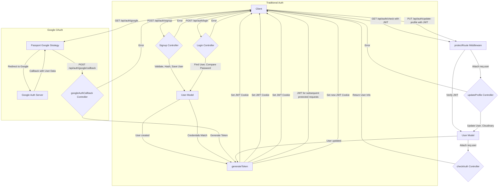
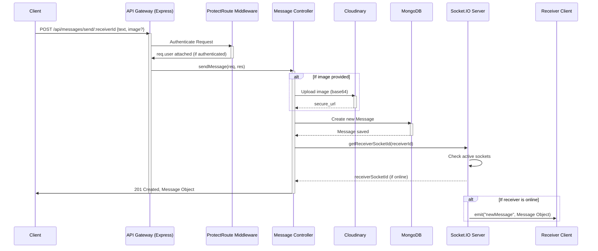

# API Endpoints & Controllers

<TOC />

This section delves into the core of the application's backend—its API endpoints and the controllers that handle incoming requests. As a MERN stack application, it provides a robust RESTful API for user authentication, profile management, and real-time messaging. This document outlines the structure, functionality, and interactions of the routes and controllers, emphasizing security, efficiency, and maintainability.

## 1. Authentication Module

The authentication module manages user registration, login, logout, session verification, profile updates, and integrates with Google OAuth for seamless sign-in. It relies on `bcrypt` for password hashing, JSON Web Tokens (JWTs) for session management, and `passport.js` for OAuth strategies.

### 1.1. Auth Controllers (`backend/src/controllers/auth.controller.js`)

This file contains the core logic for all authentication-related operations. Each exported function serves as a handler for a specific API endpoint.

*   **WHAT:** Handles all user authentication and profile management business logic.
*   **WHY:** Centralizes authentication logic, ensures data integrity, applies security measures like password hashing, and provides various ways for users to manage their accounts.
*   **HOW:** Interacts with the `User` model, uses `bcryptjs` for secure password handling, `jsonwebtoken` (via `generateToken` utility) for session management, and `cloudinary` for profile picture storage.

#### `signup`

Handles new user registration.

*   **WHAT:** Registers a new user with a unique username and email, hashes their password, and issues a JWT.
*   **WHY:** Provides a secure onboarding process for new users, enforcing data validation rules.
*   **HOW:**
    1.  **Input Validation:** Checks for presence of username, email, password, and length constraints for username (3-20 chars) and password (min 6 chars).
    2.  **Uniqueness Checks:** Verifies that the provided email and username are not already registered using `User.findOne()`.
    3.  **Password Hashing:** Generates a salt and hashes the password using `bcrypt.genSalt(10)` and `bcrypt.hash()`, ensuring passwords are never stored in plaintext.
    4.  **User Creation:** Creates a new `User` document in the database with the hashed password and `authProvider: 'email'`.
    5.  **Token Generation:** Calls the `generateToken` utility function to create and set a JWT cookie for the new user, immediately logging them in.
    6.  **Response:** Returns the newly created user's public details (excluding password) with a `201 Created` status.

```javascript filename="backend/src/controllers/auth.controller.js" {10-48}
export const signup = async (req, res) => {
    // console.log(req.body); //debugging
    const {username, email, password} = req.body;
    try {
        if(!username || !email || !password) {
            return res.status(400).json({message: "Please fill in all fields."});
        }
        if (username.length < 3) {
            return res.status(400).json({ message: "Username must be at least 3 characters." });
        }
        if (username.length > 20) {
            return res.status(400).json({ message: "Username cannot be more than 20 characters." });
        }
        if (password.length < 6) {
            return res.status(400).json({message: "Password must be at least 6 characters."});
        }
        const user = await User.findOne({email});
        if (user) return res.status(400).json({message: "Email already exists."});
        
        const existingUserByUsername = await User.findOne({ username });
        if (existingUserByUsername) {
            return res.status(400).json({ message: "Username already exists. Please choose another." });
        }

        const salt = await bcrypt.genSalt(10);
        const hashedPassword = await bcrypt.hash(password, salt);

        const newUser = new User({
            username,
            email,
            password: hashedPassword,
            authProvider: 'email'
        });
        if(newUser){
            //generate jwt token here
            generateToken(newUser._id, res);
            await newUser.save();

            res.status(201).json({
                _id: newUser._id,
                username: newUser.username,
                email: newUser.email,   
                profilePic: newUser.profilePic,
                authProvider: newUser.authProvider
            });
        } else {
            res.status(400).json({message: "Invalid user data."});
        }
    } catch (error) {
        console.log("Error in signup controller", error.message)
        res.status(500).json({message: "Something went wrong."});
    }
};
```
_Full file: [backend/src/controllers/auth.controller.js](https://github.com/shinymack/Chat-App-MERN/blob/main/backend/src/controllers/auth.controller.js)_

#### `login`

Authenticates an existing user.

*   **WHAT:** Verifies user credentials (email and password) and issues a JWT upon successful login.
*   **WHY:** Provides a secure way for registered users to access the application.
*   **HOW:**
    1.  **User Lookup:** Finds the user by `email`.
    2.  **Credential Check:** If user exists, it checks if `authProvider` is 'google' without a password set, guiding them to Google login. Otherwise, it compares the provided password with the stored hashed password using `bcrypt.compare()`.
    3.  **Token Generation:** If credentials are correct, `generateToken` issues a new JWT cookie.
    4.  **Response:** Returns user details (excluding password) with a `200 OK` status.

```javascript filename="backend/src/controllers/auth.controller.js" {53-73}
export const login = async (req, res) => {
    const {email, password} = req.body;
    try {
        const user = await User.findOne({email});

        if(!user) {
            return res.status(400).json({message: "Invalid credentials."});
        }

        if(user.authProvider === 'google' && !user.password){
            return res.status(400).json({ message: "Please sign in with Google." });
        }

        const isPasswordCorrect = await bcrypt.compare(password, user.password);
        if(!isPasswordCorrect) {
            return res.status(400).json({message: "Invalid credentials."});
        }

        generateToken(user._id, res);
        res.status(200).json({
            _id: user._id,
            username: user.username,
            email: user.email,
            profilePic: user.profilePic,
            authProvider: user.authProvider,
        });
    } catch (error) {
        console.log("Error in login controller", error.message);
        res.status(500).json({message: "Something went wrong."});
    }
};
```
_Full file: [backend/src/controllers/auth.controller.js](https://github.com/shinymack/Chat-App-MERN/blob/main/backend/src/controllers/auth.controller.js)_

#### `logout`

Terminates the user's session.

*   **WHAT:** Clears the JWT cookie from the client.
*   **WHY:** Securely ends a user session, preventing unauthorized access after logging out.
*   **HOW:** Sets the `jwt` cookie's `maxAge` to `0`, effectively expiring and removing it from the browser.

#### `checkAuth`

Verifies the current user's authentication status.

*   **WHAT:** Returns the authenticated user's details.
*   **WHY:** Allows the frontend to check if a user is currently logged in and retrieve their basic information without requiring a full re-login. This relies on the `protectRoute` middleware to have successfully verified the JWT and attached the user object to `req`.
*   **HOW:** Accesses `req.user` (populated by `protectRoute` middleware) and returns the user's details.

#### `googleAuthCallback`

Handles the callback from Google OAuth.

*   **WHAT:** Processes the successful authentication callback from Google, generates a JWT for the user, and redirects to the frontend.
*   **WHY:** Integrates Google as an authentication provider, offering a convenient sign-in option.
*   **HOW:**
    1.  **User Verification:** Checks if `req.user` (populated by Passport.js Google strategy) exists.
    2.  **Token Generation:** Calls `generateToken` for the Google-authenticated user.
    3.  **Redirection:** Redirects the user to the frontend application, either the main page or a login error page if authentication failed.

#### `checkUsernameAvailability`

Checks if a username is available.

*   **WHAT:** Determines if a given username is unique and meets specified criteria (length, character limits).
*   **WHY:** Enhances user experience during registration and profile updates by providing immediate feedback on username choices.
*   **HOW:**
    1.  **Validation:** Checks username length (3-20 characters).
    2.  **Current User Check:** Compares the requested username against the `req.user.username` to allow users to keep their existing username.
    3.  **Database Query:** Uses `User.findOne()` to check for existing users with the requested username.
    4.  **Response:** Returns `{ available: boolean, message: string }`.

#### `updateProfile`

Updates the authenticated user's profile information.

*   **WHAT:** Allows an authenticated user to update their username and profile picture.
*   **WHY:** Provides users with control over their personal profile information within the application.
*   **HOW:**
    1.  **User Lookup:** Finds the user by `userId` (from `req.user._id`).
    2.  **Username Update:**
        *   Validates new username length (3-20 characters).
        *   Checks for uniqueness against other users using `User.findOne({ username: newUsername, _id: { $ne: userId } })`.
        *   Updates the `username` field if valid and unique.
    3.  **Profile Picture Update:** If `profilePic` is provided (assumed base64 string), it uploads the image to `cloudinary.com` using `cloudinary.uploader.upload()` and stores the secure URL.
    4.  **Database Update:** Uses `User.findByIdAndUpdate()` with `$set` to update the user document.
    5.  **Token Refresh:** Calls `generateToken` again to refresh the JWT cookie with potentially updated user information (e.g., new username).
    6.  **Response:** Returns the `updatedUser` object with a `200 OK` status.

```javascript filename="backend/src/controllers/auth.controller.js" {143-188}
export const updateProfile = async (req, res) => {
    try {
        const { profilePic, username } = req.body; // Expect username now
        const userId = req.user._id;
        let userToUpdate = await User.findById(userId);

        if (!userToUpdate) {
            return res.status(404).json({ message: "User not found." });
        }

        const fieldsToUpdate = {};
        let newUsername = username ? username.trim() : null;
        let usernameChanged = false;

        // Handle username update
        if (newUsername && newUsername !== userToUpdate.username) {
            // Validate new username (length, characters - could reuse parts of checkUsernameAvailability logic or rely on schema)
            if (newUsername.length < 3 || newUsername.length > 20) {
                return res.status(400).json({ message: "Username must be between 3 and 20 characters." });
            }
            // const usernameRegex = /^[a-zA-Z0-9_]+$/; // Example regex
            // if (!usernameRegex.test(newUsername)) {
            //     return res.status(400).json({ message: "Username contains invalid characters." });
            // }

            const existingUserWithNewUsername = await User.findOne({ username: newUsername, _id: { $ne: userId } });
            if (existingUserWithNewUsername) {
                return res.status(400).json({ message: "This username is already taken by someone else." });
            }
            fieldsToUpdate.username = newUsername;
            usernameChanged = true;
        }

        // Handle profile picture update
        if (profilePic) {
            // Assuming profilePic is a base64 string or similar that Cloudinary handles
            const uploadResponse = await cloudinary.uploader.upload(profilePic);
            fieldsToUpdate.profilePic = uploadResponse.secure_url;
        }

        if (Object.keys(fieldsToUpdate).length === 0) {
            return res.status(400).json({ message: "No changes provided to update." });
        }

        const updatedUser = await User.findByIdAndUpdate(userId, { $set: fieldsToUpdate }, { new: true });

        if (!updatedUser) {
            // Should not happen if userToUpdate was found initially unless deleted concurrently
            return res.status(404).json({ message: "Failed to update user."});
        }

        // If username changed OR if you always want to refresh the token on profile update
        // It's good practice to issue a new token if sensitive/display info in it changes
        // For simplicity here, we'll assume generateToken will be called to refresh cookie with potentially new info
        generateToken(updatedUser._id, res); // This will set a new cookie with the same name, overriding the old one.

        res.status(200).json(updatedUser);

    } catch (error) {
        console.error("Error in updateProfile controller", error.message);
        if (error.code === 11000 && error.keyValue && error.keyValue.username) { // Duplicate key error from DB
            return res.status(400).json({ message: "This username is already taken." });
        }
        res.status(500).json({ message: "Internal Server Error while updating profile." });
    }
};
```
_Full file: [backend/src/controllers/auth.controller.js](https://github.com/shinymack/Chat-App-MERN/blob/main/backend/src/controllers/auth.controller.js)_

### 1.2. Auth Routes (`backend/src/routes/auth.route.js`)

This file defines the API endpoints for authentication and links them to the corresponding controller functions.

*   **WHAT:** Maps HTTP methods and paths to specific controller functions.
*   **WHY:** Organizes API structure, defines entry points for authentication, and applies middleware (like `protectRoute`) to secure endpoints.
*   **HOW:** Uses `express.Router()` to define routes. The `protectRoute` middleware ensures that only authenticated users can access certain endpoints. `passport.authenticate` is used for Google OAuth.

```javascript filename="backend/src/routes/auth.route.js" {5-29}
import express from "express"
import passport from 'passport';
import { login, logout, signup, updateProfile, checkAuth, googleAuthCallback, checkUsernameAvailability} from  "../controllers/auth.controller.js"
import { protectRoute } from "../middleware/auth.middleware.js"
const router = express.Router();

router.post("/signup", signup);

router.post("/login", login);

router.post("/logout", logout);

router.put("/update-profile", protectRoute ,updateProfile)

router.get("/username/check/:username", protectRoute, checkUsernameAvailability);

router.get("/check", protectRoute, checkAuth)

router.get(
    '/google',
    passport.authenticate('google', { scope: ['profile', 'email'] })
);
router.get(
    '/google/callback',
    passport.authenticate('google', {
        // successRedirect: 'http://localhost:5173/', 
        failureRedirect: 'http://localhost:5173/login', 
        failureMessage: true // Allows passing failure messages
    }),
    googleAuthCallback 
);
export default router;
```
_Full file: [backend/src/routes/auth.route.js](https://github.com/shinymack/Chat-App-MERN/blob/main/backend/src/routes/auth.route.js)_

#### Auth Route Details:

*   `POST /api/auth/signup`: Public route for user registration.
*   `POST /api/auth/login`: Public route for user login.
*   `POST /api/auth/logout`: Protected route to clear the JWT cookie.
*   `PUT /api/auth/update-profile`: **Protected** route to update user's profile details.
*   `GET /api/auth/username/check/:username`: **Protected** route to check username availability.
*   `GET /api/auth/check`: **Protected** route to verify current authentication status.
*   `GET /api/auth/google`: Initiates Google OAuth flow.
*   `GET /api/auth/google/callback`: Callback URL for Google OAuth, handled by `passport.authenticate` and `googleAuthCallback`.

### Authentication Flow Diagram

The following diagram illustrates the primary authentication flows, including both traditional email/password and Google OAuth.





## 2. Messaging Module

The messaging module enables real-time communication between users. It handles fetching user lists for chat, retrieving message history, and sending new messages, including images. Real-time updates are powered by `Socket.IO`.

### 2.1. Message Controllers (`backend/src/controllers/message.controller.js`)

This file contains the logic for handling all chat-related operations.

*   **WHAT:** Manages fetching chat participants, retrieving message history, and processing new messages.
*   **WHY:** Provides the core functionality for the application's real-time chat feature, ensuring messages are stored and delivered efficiently.
*   **HOW:** Interacts with `User` and `Message` models, uses `cloudinary` for image uploads, and `socket.io` for real-time message delivery.

#### `getUsersForSidebar`

Retrieves a list of users eligible for chat.

*   **WHAT:** Fetches all registered users except the currently logged-in user.
*   **WHY:** Populates the sidebar in the chat interface, allowing the user to select a recipient.
*   **HOW:** Uses `User.find({ _id: { $ne: loggedInUserId } }).select("-password")` to get all users excluding the current one and omits their password hash for security.

#### `getMessages`

Retrieves the conversation history between two users.

*   **WHAT:** Fetches all messages exchanged between the authenticated user and a specific chat partner.
*   **WHY:** Displays the history of a chat conversation when a user selects a chat partner.
*   **HOW:** Queries the `Message` model using `$or` to find messages where the `senderId` and `receiverId` match either the current user and the chat partner, or vice-versa.

```javascript filename="backend/src/controllers/message.controller.js" {27-38}
export const getMessages = async (req, res) => {
    try {
        const {id : userToChatId } = req.params;
        const myId = req.user._id;

        const messages = await Message.find({
            $or: [
                {senderId: myId, receiverId:userToChatId},
                {senderId: userToChatId, receiverId: myId}
            ]
        });
        res.status(200).json(messages);
    } catch (error) {
        console.log("Error in getMessages controller:  ", error);
        res.status(500).json({ error: "Internal Server Error" });
    }
};
```
_Full file: [backend/src/controllers/message.controller.js](https://github.com/shinymack/Chat-App-MERN/blob/main/backend/src/controllers/message.controller.js)_

#### `sendMessage`

Handles sending new messages, including text and images.

*   **WHAT:** Creates a new message, stores it in the database, and dispatches it in real-time to the receiver via WebSockets.
*   **WHY:** The core functionality for users to send messages to each other, supporting both text and media, with immediate delivery.
*   **HOW:**
    1.  **Image Upload:** If an `image` (base64) is present in the request body, it's uploaded to `cloudinary` and the `secure_url` is retrieved.
    2.  **Message Creation:** A new `Message` document is created with `senderId`, `receiverId`, `text`, and `imageUrl`.
    3.  **Database Save:** The new message is saved to MongoDB.
    4.  **Real-time Delivery:** `getReceiverSocketId` is used to find the `socket.io` ID of the receiver. If found, `io.to(receiverSocketId).emit("newMessage", newMessage)` sends the message in real-time.
    5.  **Response:** Returns the newly created message with a `201 Created` status.

```javascript filename="backend/src/controllers/message.controller.js" {42-68}
export const sendMessage = async (req, res) => {
    try {
        const { text, image } = req.body;
        const { id: receiverId } = req.params;
        const senderId = req.user._id;

        let imageUrl;
        if (image) {
            const uploadResponse = await cloudinary.uploader.upload(image);

            imageUrl = uploadResponse.secure_url;
        }
        const newMessage = new Message({
            senderId,
            receiverId,
            text,
            image: imageUrl,
        });

        await newMessage.save();

        const receiverSocketId = getReceiverSocketId(receiverId);

        if(receiverSocketId) {
            io.to(receiverSocketId).emit("newMessage", newMessage);
        }


        res.status(201).json(newMessage);   
        
    } catch (error) {
        console.log("Error in sendMessage controller:  ", error);
        res.status(500).json({ error: "Internal Server Error" });
    }
};
```
_Full file: [backend/src/controllers/message.controller.js](https://github.com/shinymack/Chat-App-MERN/blob/main/backend/src/controllers/message.controller.js)_

### 2.2. Message Routes (`backend/src/routes/message.route.js`)

This file defines the API endpoints for messaging and links them to the corresponding controller functions.

*   **WHAT:** Maps HTTP methods and paths to specific message controller functions.
*   **WHY:** Structures the API for chat interactions and applies the `protectRoute` middleware to ensure only authenticated users can send or view messages.
*   **HOW:** Uses `express.Router()` to define routes, each protected by `auth.middleware.js#protectRoute`.

```javascript filename="backend/src/routes/message.route.js" {5-12}
import express from "express"
import { protectRoute } from "../middleware/auth.middleware.js";
import { getUsersForSidebar, getMessages, sendMessage } from "../controllers/message.controller.js";
const router = express.Router();

router.get("/users", protectRoute, getUsersForSidebar);

router.get("/:id", protectRoute, getMessages);

router.post("/send/:id", protectRoute, sendMessage);

export default router;
```
_Full file: [backend/src/routes/message.route.js](https://github.com/shinymack/Chat-App-MERN/blob/main/backend/src/routes/message.route.js)_

#### Message Route Details:

*   `GET /api/messages/users`: **Protected** route to fetch users for the chat sidebar.
*   `GET /api/messages/:id`: **Protected** route to get messages between the current user and `id`.
*   `POST /api/messages/send/:id`: **Protected** route to send a new message to `id`.

### Message Sending Flow Diagram

This sequence diagram illustrates the process of sending a message, including image upload and real-time delivery.





## 3. Key Integration Points & Best Practices

The design of these API endpoints and controllers reflects several best practices:

*   **Separation of Concerns:** Routes (`.route.js`) are responsible for defining API paths and applying middleware, while controllers (`.controller.js`) encapsulate the business logic. This clear division makes the codebase modular, testable, and easier to understand.
*   **Security:**
    *   **Password Hashing:** `bcryptjs` is used for securely hashing user passwords, protecting against direct data breaches.
    *   **JWT Authentication:** JSON Web Tokens provide a stateless, scalable method for user authentication and session management.
    *   **Middleware (`protectRoute`):** Centralizes authorization logic, ensuring that sensitive endpoints are only accessible to authenticated users. This prevents unauthorized data access and manipulation.
    *   **Input Validation:** Controllers explicitly validate incoming data (e.g., username/password length, uniqueness) to prevent common vulnerabilities and ensure data integrity.
*   **Scalability & Performance:**
    *   **Cloudinary Integration:** Offloads image storage and delivery to a specialized service, reducing server load and improving media handling performance.
    *   **Asynchronous Operations:** Extensive use of `async/await` for database operations and external API calls (like Cloudinary) ensures that the server remains non-blocking and responsive.
    *   **Socket.IO for Real-time:** Enables efficient, low-latency communication for chat features without constantly polling the server.
*   **Robust Error Handling:** Each controller function includes `try...catch` blocks to gracefully handle errors, log them, and return appropriate HTTP status codes and user-friendly messages. This improves API reliability and client-side error management.
*   **RESTful Principles:** The API generally adheres to RESTful conventions, using appropriate HTTP methods (POST for creation, GET for retrieval, PUT for updates) and clear resource-based URLs.

This detailed structure of API endpoints and controllers ensures a secure, efficient, and scalable backend for the MERN chat application.

---
Next: [Data Models & Database](./2.2_data_models_database.mdx)