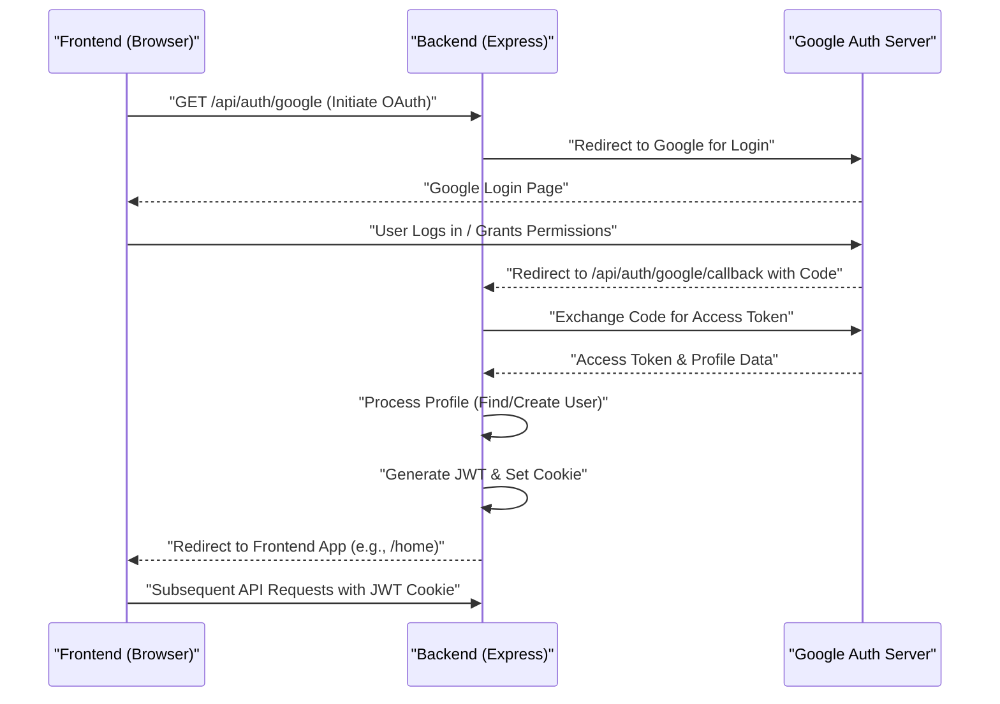

---
title: "Authentication and Authorization"
description: "Details on user authentication, authorization middleware, and session management."
sidebar_position: 21
---

# Authentication and Authorization

<TOC />

This section delves into the core mechanisms for user authentication and authorization within the application's backend. It covers traditional email/password registration, Google OAuth integration, session management using JWTs, and middleware for protecting routes.

## User Authentication

The application supports both traditional email/password authentication and Google OAuth for user sign-up and login.

### Email and Password Authentication

Users can register and log in using their email and a password. Passwords are securely hashed using `bcryptjs` before storage. Upon successful login or sign-up, a JSON Web Token (JWT) is generated and set as an HTTP-only cookie to manage the user session.

#### User Registration (`signup`)

The `signup` controller handles new user registrations. It performs input validation (username and password length, unique email/username checks), hashes the password, creates a new user record, and then issues a JWT.

```javascript showLineNumbers
// backend/src/controllers/auth.controller.js
// Lines 7-42
export const signup = async (req, res) => {
    const {username, email, password} = req.body;
    try {
        if(!username || !email || !password) {
            return res.status(400).json({message: "Please fill in all fields."});
        }
        if (username.length < 3) {
            return res.status(400).json({ message: "Username must be at least 3 characters." });
        }
        if (username.length > 20) {
            return res.status(400).json({ message: "Username cannot be more than 20 characters." });
        }
        if (password.length < 6) {
            return res.status(400).json({message: "Password must be at least 6 characters."});
        }
        const user = await User.findOne({email});
        if (user) return res.status(400).json({message: "Email already exists."});
        
        const existingUserByUsername = await User.findOne({ username });
        if (existingUserByUsername) {
            return res.status(400).json({ message: "Username already exists. Please choose another." });
        }

        const salt = await bcrypt.genSalt(10);
        const hashedPassword = await bcrypt.hash(password, salt);

        const newUser = new User({
            username,
            email,
            password: hashedPassword,
            authProvider: 'email'
        });
        if(newUser){
            generateToken(newUser._id, res); // Generate and set JWT
            await newUser.save();

            res.status(201).json({
                _id: newUser._id,
                username: newUser.username,
                email: newUser.email,   
                profilePic: newUser.profilePic,
                authProvider: newUser.authProvider
            });
        } else {
            res.status(400).json({message: "Invalid user data."});
        }
    } catch (error) {
        console.log("Error in signup controller", error.message)
        res.status(500).json({message: "Something went wrong."});
    }
};
```
[View on GitHub](https://github.com/shinymack/Chat-App-MERN/blob/main/backend/src/controllers/auth.controller.js#L7-L42)

#### User Login (`login`)

The `login` controller authenticates users by verifying their provided credentials against stored records. It checks the email, compares the hashed password, handles Google-only accounts attempting traditional login, and issues a new JWT upon success.

```javascript showLineNumbers
// backend/src/controllers/auth.controller.js
// Lines 44-73
export const login = async (req, res) => {
    const {email, password} = req.body;
    try {
        const user = await User.findOne({email});

        if(!user) {
            return res.status(400).json({message: "Invalid credentials."});
        }

        if(user.authProvider === 'google' && !user.password){
            return res.status(400).json({ message: "Please sign in with Google." });
        }

        const isPasswordCorrect = await bcrypt.compare(password, user.password);
        if(!isPasswordCorrect) {
            return res.status(400).json({message: "Invalid credentials."});
        }

        generateToken(user._id, res); // Generate and set JWT
        res.status(200).json({
            _id: user._id,
            username: user.username,
            email: user.email,
            profilePic: user.profilePic,
            authProvider: user.authProvider,
        });
    } catch (error) {
        console.log("Error in login controller", error.message);
        res.status(500).json({message: "Something went wrong."});
    }
};
```
[View on GitHub](https://github.com/shinymack/Chat-App-MERN/blob/main/backend/src/controllers/auth.controller.js#L44-L73)

### Google OAuth Integration

The application integrates with Google for third-party authentication using `passport.js` and `passport-google-oauth20`.

#### Passport Configuration

The `passport.config.js` file sets up the Google Strategy. It defines how to retrieve user profile information from Google, and either finds an existing user or creates a new one with `authProvider: 'google'`. It also handles serialization and deserialization of user data for session management.

```javascript showLineNumbers
// backend/src/lib/passport.config.js
// Lines 11-66
export const configurePassport = () => {
    passport.use(new GoogleStrategy({
        clientID: process.env.GOOGLE_CLIENT_ID,
        clientSecret: process.env.GOOGLE_CLIENT_SECRET,
        callbackURL: process.env.GOOGLE_CALLBACK_URL,
        scope: ['profile', 'email'] 
    },
    async (accessToken, refreshToken, profile, done) => {
        try {
            let user = await User.findOne({ googleId: profile.id });

            if (user) {
                return done(null, user);
            } else {
                let username = profile.displayName.replace(/\s+/g, '').toLowerCase() || `user${Date.now()}`;

                const existingUserByUsername = await User.findOne({ username });
                if (existingUserByUsername) {
                    username = `${username}${Date.now().toString().slice(-4)}`; // Make it more unique
                }
                if (username.length > 20) username = username.substring(0,20);

                const newUser = new User({
                    googleId: profile.id,
                    email: profile.emails && profile.emails[0] ? profile.emails[0].value : null,
                    username: username,
                    authProvider: 'google',
                });

                if (!newUser.email) {
                    return done(new Error("Email not provided by Google. Cannot create account."), null);
                }

                const existingUserByEmail = await User.findOne({ email: newUser.email });
                if (existingUserByEmail && existingUserByEmail.authProvider !== 'google') {
                    return done(null, false, { message: `An account with email ${newUser.email} already exists. Please sign in using your original method.` });
                }

                await newUser.save();
                return done(null, newUser);
            }
        } catch (error) {
            return done(error, null);
        }
    }));

    passport.serializeUser((user, done) => {
        done(null, user.id);
    });

    passport.deserializeUser(async (id, done) => {
        try {
            const user = await User.findById(id);
            done(null, user);
        } catch (error) {
            done(error, null);
        }
    });
};
```
[View on GitHub](https://github.com/shinymack/Chat-App-MERN/blob/main/backend/src/lib/passport.config.js#L11-L66)

#### Google OAuth Flow

The authentication flow for Google involves a redirect to Google's authentication page and then a callback to the application's backend.





## Authorization Middleware

The `protectRoute` middleware is central to securing API endpoints, ensuring that only authenticated users can access specific resources.

### `protectRoute` Middleware

This middleware extracts the JWT from the request cookies, verifies its authenticity and expiration, and then retrieves the corresponding user from the database. If successful, the user object is attached to `req.user`, allowing subsequent controllers to access authenticated user data.

```javascript showLineNumbers
// backend/src/middleware/auth.middleware.js
// Lines 3-27
import jwt from "jsonwebtoken"
import User from "../models/user.model.js"

export const protectRoute = async (req, res, next) => {
    try {
        const token = req.cookies.jwt;
        if(!token){
            return res.status(401).json({message: "Unauthorized - No Token Provided"});
        }

        const decoded = jwt.verify(token, process.env.JWT_SECRET)

        if(!decoded) {
            return res.status(401).json({message: "Unauthorized - Invalid Token"});
        }
        const user = await User.findById(decoded.userId).select("-password");

        if(!user) {
            return res.status(404).json({message: "User not found"});
        }
        req.user = user;

        next(); // Proceed to the next middleware/controller
    } catch (error) {
        console.log("Error in protectRoute middleware", error.message);
        res.status(500).json({message: "Internal Server Error"});
    }
};
```
[View on GitHub](https://github.com/shinymack/Chat-App-MERN/blob/main/backend/src/middleware/auth.middleware.js#L3-L27)

### Protected Routes Example

Routes like `/api/auth/check` and `/api/auth/update-profile` utilize `protectRoute` to ensure that only authenticated users can access them.

```javascript showLineNumbers
// backend/src/routes/auth.route.js
// Lines 16-20
router.put("/update-profile", protectRoute ,updateProfile)

router.get("/username/check/:username", protectRoute, checkUsernameAvailability);

router.get("/check", protectRoute, checkAuth)
```
[View on GitHub](https://github.com/shinymack/Chat-App-MERN/blob/main/backend/src/routes/auth.route.js#L16-L20)

## Session Management

User sessions are managed through JWTs, which are issued upon successful authentication and stored as HTTP-only cookies.

### JWT Generation

The `generateToken` utility function creates a JWT with the user's ID and signs it using a secret key. This token is then set as an HTTP-only cookie, making it inaccessible to client-side JavaScript, thus mitigating XSS attacks.

```javascript
// backend/src/lib/utils.js (conceptual, as the file isn't provided but generateToken is used)
// Example of generateToken implementation
import jwt from 'jsonwebtoken';

export const generateToken = (userId, res) => {
    const token = jwt.sign({ userId }, process.env.JWT_SECRET, {
        expiresIn: '15d',
    });

    res.cookie("jwt", token, {
        maxAge: 15 * 24 * 60 * 60 * 1000, // 15 days
        httpOnly: true, // prevent XSS attacks cross-site scripting attacks
        sameSite: "strict", // CSRF attacks cross-site request forgery attacks
        secure: process.env.NODE_ENV !== "development", // https
    });
};
```

### User Logout (`logout`)

The `logout` controller handles session termination by clearing the `jwt` cookie.

```javascript showLineNumbers
// backend/src/controllers/auth.controller.js
// Lines 75-82
export const logout = (req, res) => {
    try {
        res.cookie("jwt", "", {maxAge: 0});
        res.status(200).json({message: "Logged out successfully."})
    } catch(error) {
        console.log("Error in logout controller", error.message);
        res.status(500).json({message:"Internal Server Error"}); 
    }
};
```
[View on GitHub](https://github.com/shinymack/Chat-App-MERN/blob/main/backend/src/controllers/auth.controller.js#L75-L82)

## Profile Management

Authenticated users can update their profile information, including their username and profile picture.

### Update Profile (`updateProfile`)

The `updateProfile` controller allows authenticated users to change their username and/or update their profile picture. It includes validation for the new username and integrates with Cloudinary for image uploads. A new JWT is issued after an update to reflect potential changes in user data.

```javascript showLineNumbers
// backend/src/controllers/auth.controller.js
// Lines 174-232
export const updateProfile = async (req, res) => {
    try {
        const { profilePic, username } = req.body;
        const userId = req.user._id;
        let userToUpdate = await User.findById(userId);

        if (!userToUpdate) {
            return res.status(404).json({ message: "User not found." });
        }

        const fieldsToUpdate = {};
        let newUsername = username ? username.trim() : null;
        let usernameChanged = false;

        // Handle username update
        if (newUsername && newUsername !== userToUpdate.username) {
            if (newUsername.length < 3 || newUsername.length > 20) {
                return res.status(400).json({ message: "Username must be between 3 and 20 characters." });
            }

            const existingUserWithNewUsername = await User.findOne({ username: newUsername, _id: { $ne: userId } });
            if (existingUserWithNewUsername) {
                return res.status(400).json({ message: "This username is already taken by someone else." });
            }
            fieldsToUpdate.username = newUsername;
            usernameChanged = true;
        }

        // Handle profile picture update
        if (profilePic) {
            const uploadResponse = await cloudinary.uploader.upload(profilePic);
            fieldsToUpdate.profilePic = uploadResponse.secure_url;
        }

        if (Object.keys(fieldsToUpdate).length === 0) {
            return res.status(400).json({ message: "No changes provided to update." });
        }

        const updatedUser = await User.findByIdAndUpdate(userId, { $set: fieldsToUpdate }, { new: true });

        if (!updatedUser) {
            return res.status(404).json({ message: "Failed to update user."});
        }

        generateToken(updatedUser._id, res); // Refresh JWT with potentially new user info

        res.status(200).json(updatedUser);

    } catch (error) {
        console.error("Error in updateProfile controller", error.message);
        if (error.code === 11000 && error.keyValue && error.keyValue.username) {
            return res.status(400).json({ message: "This username is already taken." });
        }
        res.status(500).json({ message: "Internal Server Error while updating profile." });
    }
};
```
[View on GitHub](https://github.com/shinymack/Chat-App-MERN/blob/main/backend/src/controllers/auth.controller.js#L174-L232)

## Key Integration Points

### Authentication System Overview

The following diagram illustrates the primary components and their interactions within the application's authentication and authorization system.


```mermaid
graph TD
    A["Frontend (React App)"] -->|1. POST /api/auth/signup| B["Auth Routes (auth.route.js)"]
    A -->|2. POST /api/auth/login| B
    A -->|3. GET /api/auth/google| B
    A -->|4. Requests to Protected Routes| C["Auth Middleware (protectRoute)"]

    B -->|Calls Controller (e.g., signup)| D["Auth Controllers (auth.controller.js)"]
    B -->|Uses Passport.js for Google| E["Passport Config (passport.config.js)"]

    D -->|Validates & Hashes Passwords| F["bcryptjs"]
    D -->|Generates/Verifies JWT| G["jsonwebtoken"]
    D -->|Interacts with DB| H["User Model (Mongoose)"]
    D -->|Uploads Profile Pic| I["Cloudinary Service"]

    E -->|Manages Google Auth Strategy| F
    E -->|Stores/Retrieves User from DB| H

    C -->|Verifies JWT from Cookie| G
    C -->|Fetches User by ID| H
    C -->|Attaches user to req.user| D

    G -->|Sets/Clears JWT Cookie| A
    H -->|Stores User Data| J["MongoDB Database"]
    I -->|Image Storage| K["Cloudinary Storage"]

    style A fill:#DCE775,stroke:#9CCC65,stroke-width:2px
    style B fill:#90CAF9,stroke:#42A5F5,stroke-width:2px
    style C fill:#FFD54F,stroke:#FFCA28,stroke-width:2px
    style D fill:#B39DDB,stroke:#7E57C2,stroke-width:2px
    style E fill:#B39DDB,stroke:#7E57C2,stroke-width:2px
    style F fill:#80CBC4,stroke:#26A69A,stroke-width:2px
    style G fill:#80CBC4,stroke:#26A69A,stroke-width:2px
    style H fill:#E6EE9C,stroke:#D4E157,stroke-width:2px
    style I fill:#F06292,stroke:#EC407A,stroke-width:2px
    style J fill:#A1887F,stroke:#795548,stroke-width:2px
    style K fill:#F06292,stroke:#EC407A,stroke-width:2px
```


### Best Practices

*   **HTTP-Only Cookies**: JWTs are stored in HTTP-only cookies, which prevents client-side JavaScript from accessing them, reducing the risk of XSS attacks.
*   **Secure Password Hashing**: `bcryptjs` is used with a salt factor of 10 to securely hash passwords, protecting them against brute-force and rainbow table attacks.
*   **Input Validation**: Extensive validation is performed on user inputs during registration and profile updates to prevent common vulnerabilities and ensure data integrity.
*   **Separation of Concerns**: Authentication logic is cleanly separated into controllers, middleware, and configuration files, enhancing maintainability and readability.
*   **Error Handling**: Comprehensive `try-catch` blocks are used across all controllers and middleware to gracefully handle errors and return informative messages.

Next: [User, Friend, and Message Management](./2.2_user-friend-message-management.mdx)
```