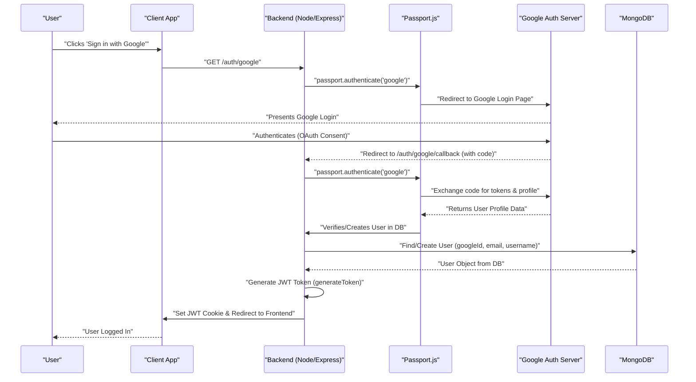

# Authentication and Authorization

<TOC />

Authentication and authorization are fundamental pillars of any secure application, ensuring that users are who they claim to be and have the appropriate permissions to access resources. This section details the strategies and implementations for user management, including standard email/password authentication, Google OAuth, and secure session management using JSON Web Tokens (JWTs).

The backend handles user registration, login, logout, profile updates, and authentication checks, integrating with MongoDB for user data storage and Passport.js for OAuth flows.

## Core Authentication Mechanisms

The system supports two primary authentication methods:

1.  **Email/Password Authentication:** Traditional signup and login using a username, email, and password. Passwords are securely hashed using `bcrypt`.
2.  **Google OAuth 2.0:** Users can sign in using their Google accounts, simplifying the registration process and leveraging Google's robust authentication.

### User Registration (Signup)

The `signup` controller handles new user registrations. It performs robust validation on incoming data, ensuring usernames and passwords meet specified criteria and that email/username are unique. Passwords are then securely hashed using `bcrypt` before being stored in the database. Upon successful registration, a JWT is generated and set as an HTTP-only cookie to establish the user's session.

```javascript showLineNumbers
// backend/src/controllers/auth.controller.js
export const signup = async (req, res) => {
    const {username, email, password} = req.body;
    try {
        if(!username || !email || !password) {
            return res.status(400).json({message: "Please fill in all fields."});
        }
        if (username.length < 3 || username.length > 20) {
            return res.status(400).json({ message: "Username must be between 3 and 20 characters." });
        }
        if (password.length < 6) {
            return res.status(400).json({message: "Password must be at least 6 characters."});
        }
        const user = await User.findOne({email});
        if (user) return res.status(400).json({message: "Email already exists."});

        const existingUserByUsername = await User.findOne({ username });
        if (existingUserByUsername) {
            return res.status(400).json({ message: "Username already exists. Please choose another." });
        }

        const salt = await bcrypt.genSalt(10);
        const hashedPassword = await bcrypt.hash(password, salt);

        const newUser = new User({
            username,
            email,
            password: hashedPassword,
            authProvider: 'email'
        });
        if(newUser){
            generateToken(newUser._id, res); // Generate and set JWT token
            await newUser.save();

            res.status(201).json({
                _id: newUser._id,
                username: newUser.username,
                email: newUser.email,
                profilePic: newUser.profilePic,
                authProvider: newUser.authProvider
            });
        } else {
            res.status(400).json({message: "Invalid user data."});
        }
    } catch (error) {
        console.log("Error in signup controller", error.message)
        res.status(500).json({message: "Something went wrong."});
    }
};
```
[View on GitHub](https://github.com/shinymack/Chat-App-MERN/blob/main/backend/src/controllers/auth.controller.js#L6-L56)

#### Signup Flow


```mermaid
graph TD
    A["Client App"] --> B{"User Enters Signup Details"}
    B --> C["API: POST /auth/signup"]
    C --> D["Auth Controller (signup)"]
    D --> E{"Input Validation (Username, Email, Password)"}
    E --> F{"Check Uniqueness (Email, Username)"}
    F --> G["Hash Password (bcrypt)"]
    G --> H["Create New User (MongoDB)"]
    H --> I["Generate JWT Token"]
    I --> J["Set JWT Cookie (HTTP-Only)"]
    J --> K["Success Response (User Data)"]
    E --&gt; L["Error: Bad Request"]
    F --&gt; L
    H --&gt; L["Error: Invalid User Data"]
    style K fill:#dff0d8,stroke:#3c763d,stroke-width:2px;
    style L fill:#f2dede,stroke:#a94442,stroke-width:2px;
```


### User Login

The `login` controller verifies user credentials for email/password-based accounts. It fetches the user by email, compares the provided password with the stored hashed password using `bcrypt.compare`, and if successful, issues a new JWT token. It also includes logic to prevent email users from logging in via password if they originally signed up with Google.

```javascript showLineNumbers
// backend/src/controllers/auth.controller.js
export const login = async (req, res) => {
    const {email, password} = req.body;
    try {
        const user = await User.findOne({email});

        if(!user) {
            return res.status(400).json({message: "Invalid credentials."});
        }

        if(user.authProvider === 'google' && !user.password){
            return res.status(400).json({ message: "Please sign in with Google." });
        }

        const isPasswordCorrect = await bcrypt.compare(password, user.password);
        if(!isPasswordCorrect) {
            return res.status(400).json({message: "Invalid credentials."});
        }

        generateToken(user._id, res); // Generate and set JWT token
        res.status(200).json({
            _id: user._id,
            username: user.username,
            email: user.email,
            profilePic: user.profilePic,
            authProvider: user.authProvider,
        });
    } catch (error) {
        console.log("Error in login controller", error.message);
        res.status(500).json({message: "Something went wrong."});
    }
};
```
[View on GitHub](https://github.com/shinymack/Chat-App-MERN/blob/main/backend/src/controllers/auth.controller.js#L58-L91)

### Google OAuth Integration

The application integrates with Google for third-party authentication using Passport.js. The `passport.config.js` file sets up the `GoogleStrategy`, which handles the OAuth flow.

#### Passport.js Configuration

The `configurePassport` function initializes the Google OAuth 2.0 strategy. It handles the callback from Google, either finding an existing user by `googleId` or creating a new user if one doesn't exist. It also includes logic to generate a unique username for new Google users and prevents creating a Google account if an email account already exists with the same email.

```javascript showLineNumbers
// backend/src/lib/passport.config.js
import passport from 'passport';
import { Strategy as GoogleStrategy } from 'passport-google-oauth20';
import User from '../models/user.model.js';
import dotenv from 'dotenv';

dotenv.config();

export const configurePassport = () => {
    passport.use(new GoogleStrategy({
        clientID: process.env.GOOGLE_CLIENT_ID,
        clientSecret: process.env.GOOGLE_CLIENT_SECRET,
        callbackURL: process.env.GOOGLE_CALLBACK_URL,
        scope: ['profile', 'email']
    },
    async (accessToken, refreshToken, profile, done) => {
        try {
            let user = await User.findOne({ googleId: profile.id });

            if (user) {
                return done(null, user);
            } else {
                let username = profile.displayName.replace(/\s+/g, '').toLowerCase() || `user${Date.now()}`;

                const existingUserByUsername = await User.findOne({ username });
                if (existingUserByUsername) {
                    username = `${username}${Date.now().toString().slice(-4)}`; // Make it more unique
                }
                if (username.length > 20) username = username.substring(0,20);

                const newUser = new User({
                    googleId: profile.id,
                    email: profile.emails && profile.emails[0] ? profile.emails[0].value : null,
                    username: username,
                    authProvider: 'google',
                });

                if (!newUser.email) {
                    return done(new Error("Email not provided by Google. Cannot create account."), null);
                }

                const existingUserByEmail = await User.findOne({ email: newUser.email });
                if (existingUserByEmail && existingUserByEmail.authProvider !== 'google') {
                    return done(null, false, { message: `An account with email ${newUser.email} already exists. Please sign in using your original method.` });
                }

                await newUser.save();
                return done(null, newUser);
            }
        } catch (error) {
            return done(error, null);
        }
    }));

    passport.serializeUser((user, done) => {
        done(null, user.id);
    });

    passport.deserializeUser(async (id, done) => {
        try {
            const user = await User.findById(id);
            done(null, user);
        } catch (error) {
            done(error, null);
        }
    });
};
```
[View on GitHub](https://github.com/shinymack/Chat-App-MERN/blob/main/backend/src/lib/passport.config.js#L11-L76)

#### Google OAuth Flow





### Session Management with JWTs

JSON Web Tokens (JWTs) are used for stateless session management. Upon successful login or signup, a JWT containing the user's ID is generated and sent back to the client as an HTTP-only cookie. This token is then automatically sent with subsequent requests to the server.

The `generateToken` utility (from `backend/src/lib/utils.js`, not shown in full here) signs a JWT with the user's ID and sets it in an HTTP-only cookie, preventing client-side JavaScript access and reducing XSS attack vectors.

#### Protecting Routes

The `protectRoute` middleware is used to ensure that only authenticated users can access certain API endpoints. This middleware intercepts requests, extracts the JWT from the cookie, verifies its authenticity, and attaches the authenticated user's details (`req.user`) to the request object for downstream controllers. If the token is invalid or missing, the request is rejected.

```javascript
// Example usage in routes (auth.route.js)
// backend/src/routes/auth.route.js
import { protectRoute } from "../middleware/auth.middleware.js"

// ...

router.put("/update-profile", protectRoute ,updateProfile)
router.get("/username/check/:username", protectRoute, checkUsernameAvailability);
router.get("/check", protectRoute, checkAuth)
```
[View on GitHub](https://github.com/shinymack/Chat-App-MERN/blob/main/backend/src/routes/auth.route.js#L9-L20)

### User Logout

The `logout` controller simply clears the JWT cookie by setting its `maxAge` to 0, effectively ending the user's session on the client side.

```javascript showLineNumbers
// backend/src/controllers/auth.controller.js
export const logout = (req, res) => {
    try {
        res.cookie("jwt", "", {maxAge: 0}); // Clear the JWT cookie
        res.status(200).json({message: "Logged out successfully."})
    } catch(error) {
        console.log("Error in logout controller", error.message);
        res.status(500).json({message:"Internal Server Error"});
    }
};
```
[View on GitHub](https://github.com/shinymack/Chat-App-MERN/blob/main/backend/src/controllers/auth.controller.js#L93-L101)

### Checking Authentication Status

The `checkAuth` endpoint allows the frontend to verify if a user is currently authenticated and retrieve their basic profile information. This is protected by `protectRoute`, ensuring only valid sessions can access it.

```javascript showLineNumbers
// backend/src/controllers/auth.controller.js
export const checkAuth = (req, res) => {
    try {
        res.status(200).json({
            _id: req.user._id,
            username: req.user.username,
            email: req.user.email,
            profilePic: req.user.profilePic,
            authProvider: req.user.authProvider,
            createdAt: req.user.createdAt
        });
    } catch (error) {
        console.log("Error in checkAuth controller", error.message);
        res.status(500).json({message: "Internal Server Error"});
    }
};
```
[View on GitHub](https://github.com/shinymack/Chat-App-MERN/blob/main/backend/src/controllers/auth.controller.js#L104-L119)

## User Profile Management

The backend provides endpoints for users to manage aspects of their profile.

### Checking Username Availability

The `checkUsernameAvailability` endpoint allows users to check if a desired username is already taken. It validates username length and ensures that the requested username isn't already assigned to another user, or if it's the current user's existing username.

```javascript showLineNumbers
// backend/src/controllers/auth.controller.js
export const checkUsernameAvailability = async (req, res) => {
    try {
        const { username } = req.params;
        const currentUserId = req.user._id;

        if (!username || username.trim().length < 3 || username.trim().length > 20) {
            return res.status(400).json({ available: false, message: "Username must be between 3 and 20 characters." });
        }

        // Check if the username is the current user's existing username
        if (req.user.username === username) {
            return res.status(200).json({ available: true, message: "This is your current username." });
        }

        const existingUser = await User.findOne({ username: username });

        if (existingUser) {
            return res.status(200).json({ available: false, message: "Username is already taken." });
        }

        res.status(200).json({ available: true, message: "Username is available." });

    } catch (error) {
        console.error("Error in checkUsernameAvailability:", error.message);
        res.status(500).json({ available: false, message: "Error checking username availability." });
    }
};
```
[View on GitHub](https://github.com/shinymack/Chat-App-MERN/blob/main/backend/src/controllers/auth.controller.js#L143-L177)

### Updating User Profile

The `updateProfile` controller allows authenticated users to modify their username and profile picture. It handles validations for the new username (uniqueness, length) and integrates with Cloudinary for secure image storage if a new profile picture is provided. After a successful update, a new JWT is issued to ensure the cookie reflects any updated user information.

```javascript showLineNumbers
// backend/src/controllers/auth.controller.js
export const updateProfile = async (req, res) => {
    try {
        const { profilePic, username } = req.body;
        const userId = req.user._id;
        let userToUpdate = await User.findById(userId);

        if (!userToUpdate) {
            return res.status(404).json({ message: "User not found." });
        }

        const fieldsToUpdate = {};
        let newUsername = username ? username.trim() : null;

        // Handle username update
        if (newUsername && newUsername !== userToUpdate.username) {
            if (newUsername.length < 3 || newUsername.length > 20) {
                return res.status(400).json({ message: "Username must be between 3 and 20 characters." });
            }
            const existingUserWithNewUsername = await User.findOne({ username: newUsername, _id: { $ne: userId } });
            if (existingUserWithNewUsername) {
                return res.status(400).json({ message: "This username is already taken by someone else." });
            }
            fieldsToUpdate.username = newUsername;
        }

        // Handle profile picture update
        if (profilePic) {
            const uploadResponse = await cloudinary.uploader.upload(profilePic);
            fieldsToUpdate.profilePic = uploadResponse.secure_url;
        }

        if (Object.keys(fieldsToUpdate).length === 0) {
            return res.status(400).json({ message: "No changes provided to update." });
        }

        const updatedUser = await User.findByIdAndUpdate(userId, { $set: fieldsToUpdate }, { new: true });

        if (!updatedUser) {
            return res.status(404).json({ message: "Failed to update user."});
        }

        generateToken(updatedUser._id, res); // Refresh JWT cookie with potentially new info

        res.status(200).json(updatedUser);

    } catch (error) {
        console.error("Error in updateProfile controller", error.message);
        if (error.code === 11000 && error.keyValue && error.keyValue.username) {
            return res.status(400).json({ message: "This username is already taken." });
        }
        res.status(500).json({ message: "Internal Server Error while updating profile." });
    }
};
```
[View on GitHub](https://github.com/shinymack/Chat-App-MERN/blob/main/backend/src/controllers/auth.controller.js#L190-L248)

## User Data Model

The `User` model in MongoDB defines the schema for storing user information. Key fields relevant to authentication include:

*   **`email`**: Unique, required for all users.
*   **`username`**: Unique, required, with length constraints.
*   **`password`**: Stored as a hash (for 'email' `authProvider`). Not required for 'google' authenticated users.
*   **`authProvider`**: An enum (`'email'`, `'google'`) indicating how the user registered. This is crucial for distinguishing login methods.
*   **`googleId`**: Unique and sparse, present only for users authenticated via Google.

A `pre('save')` hook ensures that `password` is explicitly `undefined` for Google-authenticated users if not modified, and that an email-authenticated user always has a password.

```javascript showLineNumbers
// backend/src/models/user.model.js
import mongoose from "mongoose"

const  userSchema = new mongoose.Schema(
    {
        email: {
            type: String,
            required: true,
            unique: true
        },
        username: {
            type: String,
            required: [true, "Username is required"],
            unique: true,
            trim: true,
            minlength: [3, "Username must be at least 3 characters long"],
            maxlength: [20, "Username cannot be more than 20 characters long"]
        }
        ,
        password: {
            type: String,
            minlength: 6,
        },
        profilePic: {
            type: String,
            default: "",
        },
        friends: [{
            type: mongoose.Schema.Types.ObjectId,
            ref: "User",
            default: []
        }],
        friendRequests: [{
            type: mongoose.Schema.Types.ObjectId,
            ref: "User",
            default: []
        }],
        sentRequests: [{
            type: mongoose.Schema.Types.ObjectId,
            ref: "User",
            default: []
        }],
        authProvider: {
            type: String,
            enum: ['email', 'google'],
            default: 'email'
        },
        googleId: {
            type: String,
            unique: true,
            sparse: true
        },
    },
    {
        timestamps: true
    }
);

userSchema.pre('save', async function(next) {
    if (this.authProvider === 'google' && !this.isModified('password')) {
        this.password = undefined; // Ensure password is not saved for Google users
    }
    if (this.authProvider === 'email' && !this.password && this.isNew) {
        return next(new Error('Password is required for email signup.'));
    }
    next();
});

const User = mongoose.model("User", userSchema);

export default User;
```
[View on GitHub](https://github.com/shinymack/Chat-App-MERN/blob/main/backend/src/models/user.model.js#L3-L73)

## Key Integration Points

*   **Secure Password Handling:** `bcrypt` is consistently used for hashing passwords at signup and comparing them at login, protecting against plaintext storage.
*   **JWT for Session Management:** JWTs provide a scalable and stateless approach to session management, with tokens stored in HTTP-only cookies for enhanced security.
*   **Middleware for Authorization:** The `protectRoute` middleware effectively guards authenticated endpoints, centralizing authorization logic.
*   **Flexible Authentication:** Supporting both traditional email/password and Google OAuth broadens user accessibility while managing distinct user states (via `authProvider` and `googleId`).
*   **Unique Constraints:** MongoDB's `unique` and `sparse` indexes on `email`, `username`, and `googleId` ensure data integrity and prevent duplicate user entries.
*   **Cloudinary Integration:** For profile picture management, Cloudinary offers a robust solution for image storage and delivery, offloading media handling from the main server.

Next: [Messaging and Friend Management](./2.2_messaging-and-friend-management.mdx)