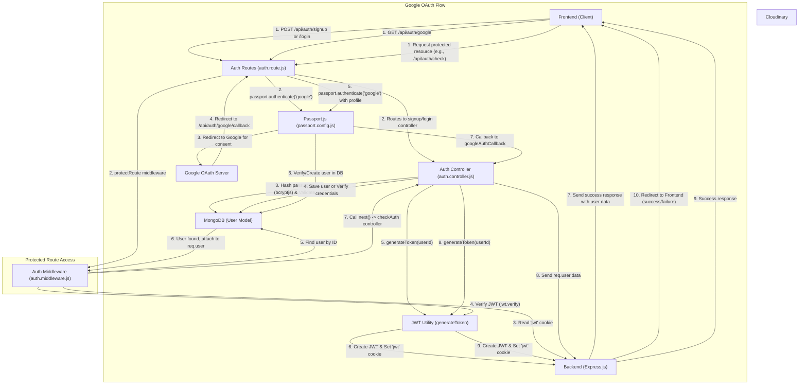
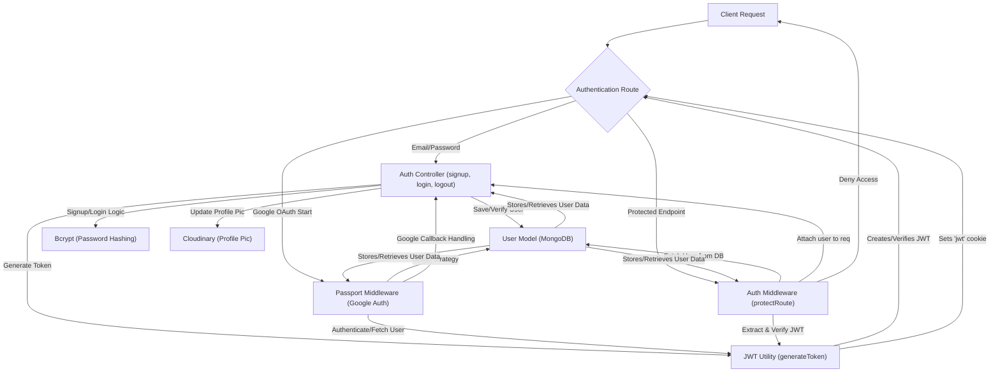

# Authentication and Authorization
<TOC />

This section details the backend mechanisms for user authentication, authorization, and session management. It covers traditional email/password login, Google OAuth integration, and ensures secure access to protected routes.

## Core Concepts

The system employs a robust authentication flow utilizing JSON Web Tokens (JWT) for session management and Passport.js for OAuth.

*   **Authentication**: Verifying a user's identity. This includes:
    *   **Email/Password**: Traditional signup and login process.
    *   **Google OAuth**: Delegated authentication via Google.
*   **Authorization**: Determining what a verified user is allowed to do.
*   **Session Management**: Maintaining user state across multiple requests using JWTs stored in HTTP-only cookies.

## File Structure

The authentication and authorization logic is distributed across several key files:

*   `backend/src/controllers/auth.controller.js`: Contains the core logic for user signup, login, logout, profile updates, and Google OAuth callbacks.
*   `backend/src/routes/auth.route.js`: Defines API endpoints for authentication actions and integrates with Passport.js for Google OAuth.
*   `backend/src/middleware/auth.middleware.js`: Implements a `protectRoute` middleware to verify JWTs and secure API endpoints.
*   `backend/src/lib/passport.config.js`: Configures Passport.js for Google OAuth 2.0 strategy, including serialization and deserialization of user sessions.

## Authentication Flows

### Email and Password Authentication

Users can sign up and log in using their email and a password. The process involves:

1.  **Signup**:
    *   Collects `username`, `email`, and `password`.
    *   Validates input length and uniqueness of `username` and `email`.
    *   Hashes the `password` using `bcryptjs`.
    *   Creates a new `User` in the database.
    *   Generates a JWT and sets it as an HTTP-only cookie.
    *   Returns user details (excluding password).

    ```javascript
    // backend/src/controllers/auth.controller.js
    export const signup = async (req, res) => {
        const {username, email, password} = req.body;
        try {
            // ... input validation ...
            const salt = await bcrypt.genSalt(10);
            const hashedPassword = await bcrypt.hash(password, salt);

            const newUser = new User({
                username,
                email,
                password: hashedPassword,
                authProvider: 'email'
            });
            if(newUser){
                generateToken(newUser._id, res); // Generate JWT and set cookie
                await newUser.save();

                res.status(201).json({
                    _id: newUser._id,
                    username: newUser.username,
                    email: newUser.email,
                    profilePic: newUser.profilePic,
                    authProvider: newUser.authProvider
                });
            } // ... error handling ...
        } // ... error handling ...
    };
    ```
    [View on GitHub](https://github.com/shinymack/Chat-App-MERN/blob/main/backend/src/controllers/auth.controller.js#L7-L51)

2.  **Login**:
    *   Collects `email` and `password`.
    *   Finds the user by `email`.
    *   Compares the provided `password` with the stored hashed password using `bcrypt.compare`.
    *   If credentials are valid, generates a JWT and sets it as an HTTP-only cookie.
    *   Returns user details.

    ```javascript
    // backend/src/controllers/auth.controller.js
    export const login = async (req, res) => {
        const {email, password} = req.body;
        try {
            const user = await User.findOne({email});
            if(!user) {
                return res.status(400).json({message: "Invalid credentials."});
            }
            if(user.authProvider === 'google' && !user.password){
                return res.status(400).json({ message: "Please sign in with Google." });
            }
            const isPasswordCorrect = await bcrypt.compare(password, user.password);
            if(!isPasswordCorrect) {
                return res.status(400).json({message: "Invalid credentials."});
            }
            generateToken(user._id, res); // Generate JWT and set cookie
            res.status(200).json({
                _id: user._id,
                username: user.username,
                email: user.email,
                profilePic: user.profilePic,
                authProvider: user.authProvider,
            });
        } // ... error handling ...
    };
    ```
    [View on GitHub](https://github.com/shinymack/Chat-App-MERN/blob/main/backend/src/controllers/auth.controller.js#L53-L80)

3.  **Logout**:
    *   Clears the `jwt` cookie by setting its `maxAge` to 0.

    ```javascript
    // backend/src/controllers/auth.controller.js
    export const logout = (req, res) => {
        try {
            res.cookie("jwt", "", {maxAge: 0});
            res.status(200).json({message: "Logged out successfully."})
        } catch(error) {
            console.log("Error in logout controller", error.message);
            res.status(500).json({message:"Internal Server Error"});
        }
    };
    ```
    [View on GitHub](https://github.com/shinymack/Chat-App-MERN/blob/main/backend/src/controllers/auth.controller.js#L82-L90)

### Google OAuth Integration

The application supports signing in with Google using Passport.js.

1.  **Configuration**:
    *   `passport.config.js` sets up `GoogleStrategy` with client ID, secret, and callback URL.
    *   The `verify` callback handles finding or creating a user based on Google profile data. It ensures uniqueness of username and handles cases where an email already exists with a different auth provider.
    *   `serializeUser` and `deserializeUser` methods manage storing and retrieving user information from the session.

    ```javascript
    // backend/src/lib/passport.config.js
    export const configurePassport = () => {
        passport.use(new GoogleStrategy({
            clientID: process.env.GOOGLE_CLIENT_ID,
            clientSecret: process.env.GOOGLE_CLIENT_SECRET,
            callbackURL: process.env.GOOGLE_CALLBACK_URL,
            scope: ['profile', 'email']
        },
        async (accessToken, refreshToken, profile, done) => {
            try {
                let user = await User.findOne({ googleId: profile.id });
                if (user) {
                    return done(null, user);
                } else {
                    // ... username generation and conflict handling ...
                    const newUser = new User({
                        googleId: profile.id,
                        email: profile.emails && profile.emails[0] ? profile.emails[0].value : null,
                        username: username,
                        authProvider: 'google',
                    });
                    // ... email existence and conflict handling ...
                    await newUser.save();
                    return done(null, newUser);
                }
            } catch (error) {
                return done(error, null);
            }
        }));
        // ... serializeUser and deserializeUser ...
    };
    ```
    [View on GitHub](https://github.com/shinymack/Chat-App-MERN/blob/main/backend/src/lib/passport.config.js#L10-L69)

2.  **Routes**:
    *   `/auth/google` initiates the Google OAuth flow.
    *   `/auth/google/callback` is the redirect URI where Google sends the user back after authentication. Passport.js handles verification, and then `googleAuthCallback` generates a JWT and redirects to the frontend.

    ```javascript
    // backend/src/routes/auth.route.js
    router.get(
        '/google',
        passport.authenticate('google', { scope: ['profile', 'email'] })
    );
    router.get(
        '/google/callback',
        passport.authenticate('google', {
            // successRedirect: 'http://localhost:5173/',
            failureRedirect: 'http://localhost:5173/login',
            failureMessage: true
        }),
        googleAuthCallback
    );
    ```
    [View on GitHub](https://github.com/shinymack/Chat-App-MERN/blob/main/backend/src/routes/auth.route.js#L23-L33)

### Profile Management

Users can update their profile information, such as `profilePic` and `username`.

*   The `updateProfile` controller handles logic for updating user details, including uploading new profile pictures to Cloudinary and validating username uniqueness and length.
*   A new JWT is generated upon successful profile update to reflect any changes that might be included in the token payload or to refresh the cookie's lifespan.

```javascript
// backend/src/controllers/auth.controller.js
export const updateProfile = async (req, res) => {
    try {
        const { profilePic, username } = req.body;
        const userId = req.user._id;
        let userToUpdate = await User.findById(userId);

        if (!userToUpdate) return res.status(404).json({ message: "User not found." });

        const fieldsToUpdate = {};
        let newUsername = username ? username.trim() : null;

        if (newUsername && newUsername !== userToUpdate.username) {
            if (newUsername.length < 3 || newUsername.length > 20) {
                return res.status(400).json({ message: "Username must be between 3 and 20 characters." });
            }
            const existingUserWithNewUsername = await User.findOne({ username: newUsername, _id: { $ne: userId } });
            if (existingUserWithNewUsername) {
                return res.status(400).json({ message: "This username is already taken by someone else." });
            }
            fieldsToUpdate.username = newUsername;
        }

        if (profilePic) {
            const uploadResponse = await cloudinary.uploader.upload(profilePic);
            fieldsToUpdate.profilePic = uploadResponse.secure_url;
        }

        if (Object.keys(fieldsToUpdate).length === 0) {
            return res.status(400).json({ message: "No changes provided to update." });
        }

        const updatedUser = await User.findByIdAndUpdate(userId, { $set: fieldsToUpdate }, { new: true });
        generateToken(updatedUser._id, res); // Refresh token
        res.status(200).json(updatedUser);

    } catch (error) {
        console.error("Error in updateProfile controller", error.message);
        if (error.code === 11000 && error.keyValue && error.keyValue.username) {
            return res.status(400).json({ message: "This username is already taken." });
        }
        res.status(500).json({ message: "Internal Server Error while updating profile." });
    }
};
```
[View on GitHub](https://github.com/shinymack/Chat-App-MERN/blob/main/backend/src/controllers/auth.controller.js#L182-L242)

### Username Availability Check

Before a user updates their username or during signup, the `checkUsernameAvailability` endpoint allows the frontend to verify if a desired username is already taken or meets validation criteria.

```javascript
// backend/src/controllers/auth.controller.js
export const checkUsernameAvailability = async (req, res) => {
    try {
        const { username } = req.params;
        const currentUserId = req.user._id;

        if (!username || username.trim().length < 3) {
            return res.status(400).json({ available: false, message: "Username must be at least 3 characters." });
        }
        if (username.trim().length > 20) {
            return res.status(400).json({ available: false, message: "Username cannot be more than 20 characters." });
        }

        if (req.user.username === username) {
            return res.status(200).json({ available: true, message: "This is your current username." });
        }

        const existingUser = await User.findOne({ username: username });

        if (existingUser) {
            return res.status(200).json({ available: false, message: "Username is already taken." });
        }

        res.status(200).json({ available: true, message: "Username is available." });

    } catch (error) {
        console.error("Error in checkUsernameAvailability:", error.message);
        res.status(500).json({ available: false, message: "Error checking username availability." });
    }
};
```
[View on GitHub](https://github.com/shinymack/Chat-App-MERN/blob/main/backend/src/controllers/auth.controller.js#L141-L177)

## Authorization (Protecting Routes)

The `protectRoute` middleware ensures that only authenticated users can access specific API endpoints.

1.  **Token Retrieval**: Extracts the JWT from the `jwt` HTTP-only cookie.
2.  **Token Verification**: Uses `jwt.verify` to validate the token against the `JWT_SECRET`.
3.  **User Lookup**: Decodes the user ID from the token and fetches the corresponding user from the database.
4.  **User Attachment**: Attaches the authenticated user object (`req.user`) to the request for subsequent middleware or controller functions.
5.  **Error Handling**: Returns `401 Unauthorized` for missing, invalid, or expired tokens, and `404 Not Found` if the user associated with the token doesn't exist.

```javascript
// backend/src/middleware/auth.middleware.js
import jwt from "jsonwebtoken"
import User from "../models/user.model.js"

export const protectRoute = async (req, res, next) => {
    try {
        const token = req.cookies.jwt; // Get token from cookie
        if(!token){
            return res.status(401).json({message: "Unauthorized - No Token Provided"});
        }

        const decoded = jwt.verify(token, process.env.JWT_SECRET) // Verify token

        if(!decoded) {
            return res.status(401).json({message: "Unauthorized - Invalid Token"});
        }
        const user = await User.findById(decoded.userId).select("-password"); // Find user

        if(!user) {
            return res.status(404).json({message: "User not found"});
        }
        req.user = user; // Attach user to request

        next(); // Proceed to next middleware/controller
    } catch (error) {
        console.log("Error in protectRoute middleware", error.message);
        res.status(500).json({message: "Internal Server Error"});
    }
};
```
[View on GitHub](https://github.com/shinymack/Chat-App-MERN/blob/main/backend/src/middleware/auth.middleware.js#L4-L29)

### Authentication Flow Diagram





## Key Integration Points

*   **JWT for Session Management**: Instead of traditional server-side sessions, JWTs provide a stateless authentication mechanism. The `generateToken` utility creates an HTTP-only cookie, securing the token from client-side JavaScript access, which helps mitigate XSS attacks.
*   **Passport.js**: Seamlessly integrates Google OAuth, abstracting away complex OAuth flows and providing a consistent API for authentication strategies.
*   **Middleware Chaining**: The `protectRoute` middleware is crucial for applying authorization checks globally or on specific routes before the controller logic executes. This enforces security policies uniformly.
*   **`req.user` Object**: After successful authentication via JWT or Passport.js, the authenticated user's information is readily available through `req.user`, simplifying access to user-specific data in controllers.
*   **Error Handling**: Robust `try...catch` blocks and specific HTTP status codes (e.g., `400 Bad Request`, `401 Unauthorized`, `500 Internal Server Error`) provide clear feedback to the client regarding authentication and authorization issues.
*   **Profile Updates**: Updating user information like username or profile picture requires re-issuing a JWT to ensure the client's cookie reflects any changes that might be part of the token payload or to refresh its validity.

### Backend Authentication Components Relationship





Next: [Messaging and Friend Management](./2.2_messaging-and-friend-management.mdx)