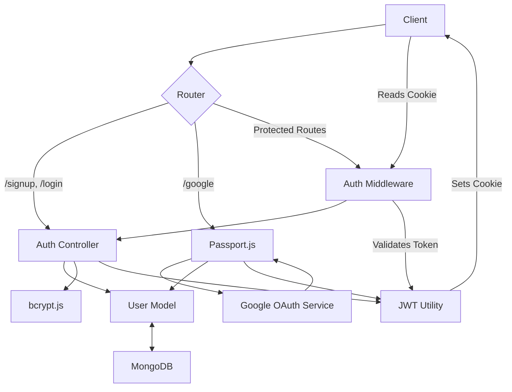
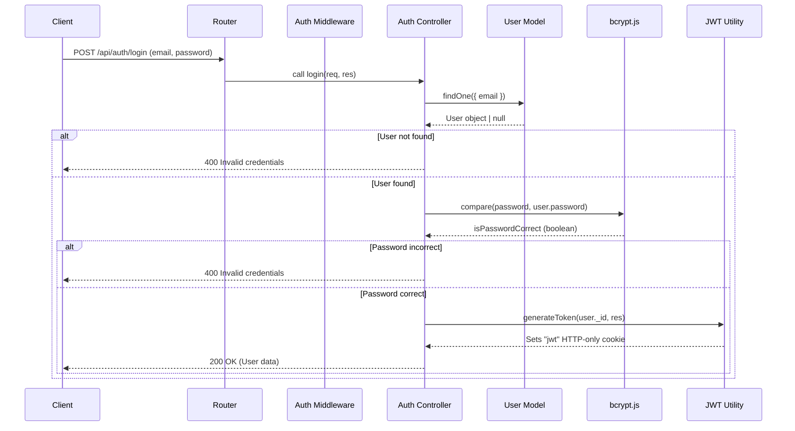

# Authentication and Authorization
<TOC />

Authentication and authorization are fundamental aspects of securing any application, especially a real-time chat application where user data privacy and access control are paramount. This section details the backend mechanisms implemented to manage user registration, login, session management, and access control. It covers both traditional email/password authentication and modern OAuth 2.0 integration with Google, ensuring a secure and flexible user experience.

## System Purpose

The authentication and authorization system provides the following core functionalities:

*   **User Registration:** Allows new users to create accounts using an email and password, or through Google OAuth. Includes robust input validation for username and password.
*   **User Login:** Facilitates secure access for registered users via email/password or Google credentials.
*   **Session Management:** Utilizes JSON Web Tokens (JWT) for stateless authentication, transmitted via HTTP-only cookies to enhance security.
*   **Access Control:** Employs middleware to protect routes, ensuring that only authenticated users can access sensitive endpoints and resources.
*   **Profile Management:** Enables authenticated users to update their profile information, such as their username and profile picture.
*   **Username Availability Check:** Provides an endpoint for real-time validation of usernames during registration or profile updates.
*   **Google OAuth 2.0 Integration:** Seamlessly integrates with Google for user authentication, simplifying the registration and login process for users.

## Architecture

The authentication and authorization architecture is designed for clarity, security, and scalability. It leverages standard Node.js patterns, Express.js routing, and dedicated middleware.

The core components interact as follows:

1.  **Client Request:** A user initiates an authentication action (e.g., signup, login, Google auth).
2.  **Auth Routes:** Defined in `backend/src/routes/auth.route.js`, these routes direct the incoming requests to the appropriate controller functions.
3.  **Authentication Middleware:** The `backend/src/middleware/auth.middleware.js` module, specifically the `protectRoute` middleware, intercepts requests to protected routes. It validates JWTs from cookies and attaches the authenticated user's data to the request object.
4.  **Auth Controllers:** Located in `backend/src/controllers/auth.controller.js`, these functions encapsulate the business logic for user registration, login, logout, profile updates, and Google OAuth callbacks. They interact with the User Model and various utility functions.
5.  **User Model:** Defines the schema for user data storage, including fields for email, password (hashed), username, Google ID, profile picture, and authentication provider.
6.  **Passport Configuration:** `backend/src/lib/passport.config.js` configures `passport.js` for Google OAuth, handling the strategy definition, user serialization, and deserialization.
7.  **Security Utilities:** `bcrypt.js` is used for password hashing, and a custom `generateToken` utility handles JWT creation and cookie management.





*Figure 1: High-level Authentication Architecture*

## Technology Stack

The backend uses a robust set of technologies for authentication and authorization:

| Layer/Technology | Purpose                                                                 | Key Files/Usage                                                                                                                                                                                                                                    |
| :--------------- | :---------------------------------------------------------------------- | :------------------------------------------------------------------------------------------------------------------------------------------------------------------------------------------------------------------------------------------------- |
| **Framework**    | Express.js                                                              | Web application framework for handling routes and requests.                                                                                                                                                                                        | `backend/src/routes/auth.route.js`                                                                                                                                                                                                                     |
| **Database**     | Mongoose (ODM for MongoDB)                                              | Object Data Modeling for interacting with MongoDB, defining User schema.                                                                                                                                                                           | `backend/src/models/user.model.js` (implicit from context, as User is imported), `backend/src/controllers/auth.controller.js`, `backend/src/lib/passport.config.js`, `backend/src/middleware/auth.middleware.js`                                |
| **Password Hashing** | bcrypt.js                                                               | Securely hashes user passwords before storing them in the database and compares them during login.                                                                                                                                                 | `backend/src/controllers/auth.controller.js`                                                                                                                                                                                                       |
| **JWT**          | jsonwebtoken                                                            | Creates and verifies JSON Web Tokens for session management.                                                                                                                                                                                       | `backend/src/lib/utils.js` (implicit from context, via `generateToken`), `backend/src/middleware/auth.middleware.js`                                                                                                                                |
| **OAuth**        | passport.js, passport-google-oauth20                                    | Middleware for handling Google OAuth 2.0 authentication strategy.                                                                                                                                                                                  | `backend/src/lib/passport.config.js`, `backend/src/routes/auth.route.js`                                                                                                                                                                           |
| **Middleware**   | Custom (`protectRoute`)                                                 | Ensures only authenticated users can access certain routes by validating JWT.                                                                                                                                                                      | `backend/src/middleware/auth.middleware.js`, `backend/src/routes/auth.route.js`                                                                                                                                                                    |
| **Cloud Storage**| Cloudinary (implicit from snippet)                                      | Handles storage and management of user profile pictures.                                                                                                                                                                                           | `backend/src/controllers/auth.controller.js` (imported but `uploader.upload` is commented out, indicating potential future use or a WIP)                                                                                                              |

## Authentication Mechanisms

### Email/Password Authentication

The primary method for user authentication involves a traditional email and password combination. This process includes validation, secure password storage, and JWT-based session management.

#### User Registration (`/signup`)

The `signup` controller handles the creation of new user accounts. It performs extensive input validation to ensure data integrity and security before hashing the password and saving the user to the database. Upon successful registration, a JWT is generated and set as an HTTP-only cookie.

```javascript
export const signup = async (req, res) => {
    const {username, email, password} = req.body;
    try {
        if(!username || !email || !password) {
            return res.status(400).json({message: "Please fill in all fields."});
        }
        if (username.length < 3 || username.length > 20) {
            return res.status(400).json({ message: "Username must be between 3 and 20 characters." });
        }
        if (password.length < 6) {
            return res.status(400).json({message: "Password must be at least 6 characters."});
        }
        const user = await User.findOne({email});
        if (user) return res.status(400).json({message: "Email already exists."});
        
        const existingUserByUsername = await User.findOne({ username });
        if (existingUserByUsername) {
            return res.status(400).json({ message: "Username already exists. Please choose another." });
        }

        const salt = await bcrypt.genSalt(10);
        const hashedPassword = await bcrypt.hash(password, salt);

        const newUser = new User({
            username,
            email,
            password: hashedPassword,
            authProvider: 'email'
        });
        if(newUser){
            generateToken(newUser._id, res); // Generate and set JWT
            await newUser.save();

            res.status(201).json({
                _id: newUser._id,
                username: newUser.username,
                email: newUser.email,   
                profilePic: newUser.profilePic,
                authProvider: newUser.authProvider
            });
        } else {
            res.status(400).json({message: "Invalid user data."});
        }
    } catch (error) {
        console.log("Error in signup controller", error.message)
        res.status(500).json({message: "Something went wrong."});
    }
};
```
[backend/src/controllers/auth.controller.js#L5-L57](https://github.com/shinymack/Chat-App-MERN/blob/main/backend/src/controllers/auth.controller.js#L5-L57)

**Best Practice:** Using `bcrypt.js` with a salt round of 10 ensures strong password hashing, making brute-force attacks significantly more difficult. Unique email and username checks prevent duplicate accounts and maintain data integrity.

#### User Login (`/login`)

The `login` controller verifies user credentials against stored hashed passwords. It also includes a check to prevent users who registered via Google from attempting to log in with an email/password combination. On successful authentication, a new JWT is issued.

```javascript
export const login = async (req, res) => {
    const {email, password} = req.body;
    try {
        const user = await User.findOne({email});

        if(!user) {
            return res.status(400).json({message: "Invalid credentials."});
        }

        if(user.authProvider === 'google' && !user.password){
            return res.status(400).json({ message: "Please sign in with Google." });
        }

        const isPasswordCorrect = await bcrypt.compare(password, user.password);
        if(!isPasswordCorrect) {
            return res.status(400).json({message: "Invalid credentials."});
        }

        generateToken(user._id, res); // Generate and set JWT
        res.status(200).json({
            _id: user._id,
            username: user.username,
            email: user.email,
            profilePic: user.profilePic,
            authProvider: user.authProvider,
        });
    } catch (error) {
        console.log("Error in login controller", error.message);
        res.status(500).json({message: "Something went wrong."});
    }
};
```
[backend/src/controllers/auth.controller.js#L59-L89](https://github.com/shinymack/Chat-App-MERN/blob/main/backend/src/controllers/auth.controller.js#L59-L89)

#### User Logout (`/logout`)

The `logout` controller simply clears the JWT cookie, effectively ending the user's session.

```javascript
export const logout = (req, res) => {
    try {
        res.cookie("jwt", "", {maxAge: 0}); // Clear the JWT cookie
        res.status(200).json({message: "Logged out successfully."})
    } catch(error) {
        console.log("Error in logout controller", error.message);
        res.status(500).json({message:"Internal Server Error"}); 
    }
};
```
[backend/src/controllers/auth.controller.js#L92-L100](https://github.com/shinymack/Chat-App-MERN/blob/main/backend/src/controllers/auth.controller.js#L92-L100)

### Google OAuth Authentication

Google OAuth provides a convenient and secure way for users to authenticate without creating a new password. The integration relies on `passport.js`.

#### Passport Configuration

The `configurePassport` function initializes the Google OAuth 2.0 strategy. It defines how user information received from Google is processed: checking for existing users, creating new ones, and handling potential email conflicts.

```javascript
import passport from 'passport';
import { Strategy as GoogleStrategy } from 'passport-google-oauth20';
import User from '../models/user.model.js'; 
import dotenv from 'dotenv';

dotenv.config(); 

export const configurePassport = () => {
    passport.use(new GoogleStrategy({
        clientID: process.env.GOOGLE_CLIENT_ID,
        clientSecret: process.env.GOOGLE_CLIENT_SECRET,
        callbackURL: process.env.GOOGLE_CALLBACK_URL,
        scope: ['profile', 'email'] 
    },
    async (accessToken, refreshToken, profile, done) => {
        try {
            let user = await User.findOne({ googleId: profile.id });

            if (user) {
                return done(null, user); // User exists, log them in
            } else {
                let username = profile.displayName.replace(/\s+/g, '').toLowerCase() || `user${Date.now()}`;

                const existingUserByUsername = await User.findOne({ username });
                if (existingUserByUsername) {
                    username = `${username}${Date.now().toString().slice(-4)}`; // Make unique if needed
                }
                if (username.length > 20) username = username.substring(0,20);


                const newUser = new User({
                    googleId: profile.id,
                    email: profile.emails && profile.emails[0] ? profile.emails[0].value : null,
                    username: username,
                    authProvider: 'google',
                });

                if (!newUser.email) {
                    return done(new Error("Email not provided by Google. Cannot create account."), null);
                }

                const existingUserByEmail = await User.findOne({ email: newUser.email });
                if (existingUserByEmail && existingUserByEmail.authProvider !== 'google') {
                    // Prevent Google login if email already exists with a different provider
                    return done(null, false, { message: `An account with email ${newUser.email} already exists. Please sign in using your original method.` });
                }

                await newUser.save();
                return done(null, newUser); // New user created
            }
        } catch (error) {
            return done(error, null);
        }
    }));

    passport.serializeUser((user, done) => {
        done(null, user.id);
    });

    passport.deserializeUser(async (id, done) => {
        try {
            const user = await User.findById(id);
            done(null, user);
        } catch (error) {
            done(error, null);
        }
    });
};
```
[backend/src/lib/passport.config.js#L1-L67](https://github.com/shinymack/Chat-App-MERN/blob/main/backend/src/lib/passport.config.js#L1-L67)

**Insight:** The `passport.serializeUser` and `deserializeUser` methods are crucial for maintaining user sessions. `serializeUser` determines which user data (typically just the user ID) should be stored in the session, while `deserializeUser` retrieves the full user object from the database using that ID for each subsequent request. This means `req.user` will contain the full user object after deserialization.

#### Google OAuth Callback (`/google/callback`)

After Google authenticates the user, it redirects to the `callbackURL`. The `googleAuthCallback` controller then handles the post-authentication logic, which involves generating a JWT and redirecting the user back to the frontend.

```javascript
export const googleAuthCallback = async (req, res) => {
    const frontendUrl = process.env.FRONTEND_URL || 'http://localhost:5173';

    try {
        if (!req.user) { // If Passport failed to authenticate
            return res.redirect(`${frontendUrl}/login?error=google_auth_failed`);
        }

        generateToken(req.user._id, res); // Generate JWT for the authenticated Google user

        res.redirect(frontendUrl); // Redirect to the frontend application

    } catch (error) {
        console.error("Error in googleAuthCallback: ", error.message);
        res.redirect(`${frontendUrl}/login?error=google_auth_processing_error`);
    }
};
```
[backend/src/controllers/auth.controller.js#L123-L140](https://github.com/shinymack/Chat-App-MERN/blob/main/backend/src/controllers/auth.controller.js#L123-L140)

## Authorization and Access Control

Authorization ensures that authenticated users have the necessary permissions to perform specific actions or access certain resources.

### `protectRoute` Middleware

The `protectRoute` middleware is a critical component for enforcing authorization. It verifies the authenticity of the JWT provided in the request cookie. If the token is valid, it decodes it, fetches the corresponding user from the database, and attaches the user object (`req.user`) to the request. This allows subsequent controllers to access the authenticated user's data.

```javascript
import jwt from "jsonwebtoken"
import User from "../models/user.model.js"

export const protectRoute = async (req, res, next) => {
    try {
        const token = req.cookies.jwt; // Get JWT from cookie
        if(!token){
            return res.status(401).json({message: "Unauthorized - No Token Provided"});
        }

        const decoded = jwt.verify(token, process.env.JWT_SECRET) // Verify token

        if(!decoded) {
            return res.status(401).json({message: "Unauthorized - Invalid Token"});
        }
        const user = await User.findById(decoded.userId).select("-password"); // Find user and exclude password

        if(!user) {
            return res.status(404).json({message: "User not found"});
        }
        req.user = user; // Attach user to request object

        next(); // Proceed to the next middleware/controller
    } catch (error) {
        console.log("Error in protectRoute middleware", error.message);
        res.status(500).json({message: "Internal Server Error"});

    }

};
```
[backend/src/middleware/auth.middleware.js#L1-L28](https://github.com/shinymack/Chat-App-MERN/blob/main/backend/src/middleware/auth.middleware.js#L1-L28)

### `checkAuth` Endpoint

This endpoint demonstrates the usage of `protectRoute`. When an authenticated user hits `/check`, the `protectRoute` middleware verifies their token and attaches their user object to `req.user`. The controller then simply responds with the user's data. This is useful for frontend applications to verify authentication status and retrieve user details upon loading.

```javascript
export const checkAuth = (req, res) => {
    try {
        res.status(200).json({
            _id: req.user._id,
            username: req.user.username,
            email: req.user.email,
            profilePic: req.user.profilePic,
            authProvider: req.user.authProvider,
            createdAt: req.user.createdAt
        });
    } catch (error) {
        console.log("Error in checkAuth controller", error.message);
        res.status(500).json({message: "Internal Server Error"});
    }
};
```
[backend/src/controllers/auth.controller.js#L103-L117](https://github.com/shinymack/Chat-App-MERN/blob/main/backend/src/controllers/auth.controller.js#L103-L117)

## User Profile Management

Authenticated users can manage aspects of their profile, such as their username and profile picture.

### `updateProfile` Endpoint

This controller allows an authenticated user to update their username and profile picture. It includes validation for the new username (length, uniqueness) and integrates with Cloudinary for image uploads. A new JWT is issued upon successful update to reflect any changes in user data embedded in the token.

```javascript
export const updateProfile = async (req, res) => {
    try {
        const { profilePic, username } = req.body;
        const userId = req.user._id;
        let userToUpdate = await User.findById(userId);

        if (!userToUpdate) {
            return res.status(404).json({ message: "User not found." });
        }

        const fieldsToUpdate = {};
        let newUsername = username ? username.trim() : null;

        // Handle username update
        if (newUsername && newUsername !== userToUpdate.username) {
            if (newUsername.length < 3 || newUsername.length > 20) {
                return res.status(400).json({ message: "Username must be between 3 and 20 characters." });
            }
            const existingUserWithNewUsername = await User.findOne({ username: newUsername, _id: { $ne: userId } });
            if (existingUserWithNewUsername) {
                return res.status(400).json({ message: "This username is already taken by someone else." });
            }
            fieldsToUpdate.username = newUsername;
        }

        // Handle profile picture update
        if (profilePic) {
            const uploadResponse = await cloudinary.uploader.upload(profilePic);
            fieldsToUpdate.profilePic = uploadResponse.secure_url;
        }

        if (Object.keys(fieldsToUpdate).length === 0) {
            return res.status(400).json({ message: "No changes provided to update." });
        }

        const updatedUser = await User.findByIdAndUpdate(userId, { $set: fieldsToUpdate }, { new: true });

        if (!updatedUser) {
            return res.status(404).json({ message: "Failed to update user."});
        }
        
        generateToken(updatedUser._id, res); // Issue new token with potentially updated user info

        res.status(200).json(updatedUser);

    } catch (error) {
        console.error("Error in updateProfile controller", error.message);
        if (error.code === 11000 && error.keyValue && error.keyValue.username) {
            return res.status(400).json({ message: "This username is already taken." });
        }
        res.status(500).json({ message: "Internal Server Error while updating profile." });
    }
};
```
[backend/src/controllers/auth.controller.js#L168-L232](https://github.com/shinymack/Chat-App-MERN/blob/main/backend/src/controllers/auth.controller.js#L168-L232)

### `checkUsernameAvailability` Endpoint

This utility endpoint allows the frontend to check if a desired username is available. It performs validation on username length and checks against existing usernames in the database, excluding the current user's own username if they are trying to update it.

```javascript
export const checkUsernameAvailability = async (req, res) => {
    try {
        const { username } = req.params;
        const currentUserId = req.user._id; 

        if (!username || username.trim().length < 3) {
            return res.status(400).json({ available: false, message: "Username must be at least 3 characters." });
        }
        if (username.trim().length > 20) {
            return res.status(400).json({ available: false, message: "Username cannot be more than 20 characters." });
        }
    
        // Check if the username is the current user's existing username
        if (req.user.username === username) {
            return res.status(200).json({ available: true, message: "This is your current username." });
        }

        const existingUser = await User.findOne({ username: username });

        if (existingUser) {
            return res.status(200).json({ available: false, message: "Username is already taken." });
        }

        res.status(200).json({ available: true, message: "Username is available." });

    } catch (error) {
        console.error("Error in checkUsernameAvailability:", error.message);
        res.status(500).json({ available: false, message: "Error checking username availability." });
    }
};
```
[backend/src/controllers/auth.controller.js#L143-L165](https://github.com/shinymack/Chat-App-MERN/blob/main/backend/src/controllers/auth.controller.js#L143-L165)

## Routing

All authentication-related API endpoints are consolidated in `backend/src/routes/auth.route.js`. This file defines the HTTP methods and paths, linking them to the respective controller functions and applying middleware where necessary.

```javascript
import express from "express"
import passport from 'passport';
import { login, logout, signup, updateProfile, checkAuth, googleAuthCallback, checkUsernameAvailability} from  "../controllers/auth.controller.js"
import { protectRoute } from "../middleware/auth.middleware.js"
const router = express.Router();

router.post("/signup", signup); // Public route for new user registration

router.post("/login", login); // Public route for user login

router.post("/logout", logout); // Protected route to log out
// Note: While logout doesn't strictly need protectRoute,
// it's often good practice to ensure only active users can attempt to logout.
// The current implementation is simple and doesn't explicitly check req.user.

router.put("/update-profile", protectRoute ,updateProfile) // Protected route for profile updates

router.get("/username/check/:username", protectRoute, checkUsernameAvailability); // Protected route for username availability check

router.get("/check", protectRoute, checkAuth) // Protected route to check authentication status

router.get(
    '/google',
    passport.authenticate('google', { scope: ['profile', 'email'] }) // Initiates Google OAuth flow
);
router.get(
    '/google/callback',
    passport.authenticate('google', {
        failureRedirect: 'http://localhost:5173/login', 
        failureMessage: true 
    }),
    googleAuthCallback // Handles callback after successful Google authentication
);
export default router;
```
[backend/src/routes/auth.route.js#L1-L32](https://github.com/shinymack/Chat-App-MERN/blob/main/backend/src/routes/auth.route.js#L1-L32)
**Insight:** Routes like `/update-profile`, `/username/check`, and `/check` are explicitly protected using `protectRoute`, ensuring that only authenticated users can access them. The Google OAuth flow involves dedicated routes for initiating authentication and handling the callback.

## Key Integration Points

### Authentication Flow (Email/Password Login)





*Figure 2: Email/Password Login Sequence Diagram*

*   **State Management:** The backend manages authentication state primarily through JWTs stored in HTTP-only cookies. This makes the authentication stateless on the server, which is beneficial for scalability. The JWT contains only the user ID, meaning sensitive user data is not directly exposed in the token.
*   **API Flows:**
    *   **Registration/Login:** Client sends credentials, backend validates, hashes (if applicable), saves, generates JWT, and sets cookie.
    *   **Protected Routes:** Client sends request with JWT cookie, `protectRoute` middleware verifies, attaches user to `req`, controller processes.
    *   **Logout:** Backend clears JWT cookie.
    *   **Google Auth:** Client redirects to Google, Google authenticates, redirects back to backend callback, backend generates JWT, redirects to frontend.
*   **Scalability:** The use of stateless JWTs allows horizontal scaling of backend services without requiring complex session management across multiple instances. Database operations (user lookup) are the primary bottleneck, which can be mitigated with appropriate indexing on `email`, `username`, and `googleId` fields in the User model.
*   **Security Considerations:**
    *   **HTTP-only cookies:** Prevent client-side JavaScript from accessing the JWT, mitigating XSS attacks.
    *   **Secure flag for cookies:** (Implicit, but critical for production) Ensures cookies are only sent over HTTPS.
    *   **CSRF Protection:** While JWT in HTTP-only cookies provides some protection against CSRF, for sensitive operations, additional CSRF tokens might be considered, though often less critical for pure API applications that don't render HTML forms directly.
    *   **Robust Input Validation:** Prevents common injection attacks and ensures data integrity.
    *   **Error Handling:** Consistent error responses help debug issues and prevent information leakage.

Next: [Chat and Friend Management](./2.2_chat-and-friend-management.mdx)