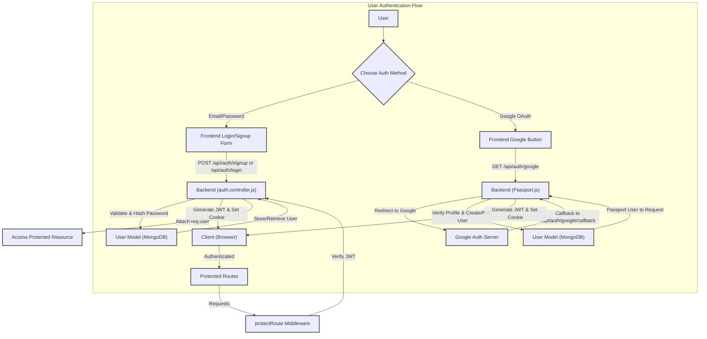

---
title: "Authentication and User Management"
description: "Explains the backend implementation of user authentication, registration, and profile management."
sidebar_position: 21
---

# Authentication and User Management

<TOC />

This section details the robust backend implementation for user authentication, registration, and profile management within the application. It covers both traditional email/password authentication and seamless integration with Google OAuth, ensuring a secure and user-friendly experience.

## User Registration and Login

The core authentication logic resides in `auth.controller.js`, handling user registration (signup) and login. This includes input validation, password hashing, and JWT token generation for session management.

### User Signup

The `signup` function handles new user registration. It performs several validation checks before creating a new user record:

*   **Required Fields**: Ensures `username`, `email`, and `password` are provided.
*   **Length Constraints**: Username must be between 3 and 20 characters; password must be at least 6 characters.
*   **Uniqueness**: Checks if the email or username already exists in the database.
*   **Password Hashing**: Uses `bcryptjs` to securely hash passwords before storing them.
*   **JWT Generation**: A JSON Web Token (JWT) is generated upon successful registration to establish the user's session.

```javascript
// backend/src/controllers/auth.controller.js
export const signup = async (req, res) => {
    const {username, email, password} = req.body;
    try {
        if(!username || !email || !password) {
            return res.status(400).json({message: "Please fill in all fields."});
        }
        // ... (validation logic) ...
        const salt = await bcrypt.genSalt(10);
        const hashedPassword = await bcrypt.hash(password, salt);

        const newUser = new User({
            username,
            email,
            password: hashedPassword,
            authProvider: 'email'
        });
        if(newUser){
            generateToken(newUser._id, res); // Generates and sets JWT cookie
            await newUser.save();
            res.status(201).json({
                _id: newUser._id,
                username: newUser.username,
                email: newUser.email,   
                profilePic: newUser.profilePic,
                authProvider: newUser.authProvider
            });
        } else {
            res.status(400).json({message: "Invalid user data."});
        }
    } catch (error) {
        console.log("Error in signup controller", error.message)
        res.status(500).json({message: "Something went wrong."});
    }
};
```
[View on GitHub](https://github.com/shinymack/Chat-App-MERN/blob/main/backend/src/controllers/auth.controller.js#L7-L55)

### User Login

The `login` function authenticates existing users:

*   **Credential Verification**: Finds the user by email and compares the provided password with the stored hashed password using `bcrypt.compare()`.
*   **Google Auth Check**: Prevents email/password login for accounts originally created via Google OAuth.
*   **JWT Generation**: Issues a new JWT upon successful login.

```javascript
// backend/src/controllers/auth.controller.js
export const login = async (req, res) => {
    const {email, password} = req.body;
    try {
        const user = await User.findOne({email});

        if(!user) {
            return res.status(400).json({message: "Invalid credentials."});
        }

        if(user.authProvider === 'google' && !user.password){
            return res.status(400).json({ message: "Please sign in with Google." });
        }

        const isPasswordCorrect = await bcrypt.compare(password, user.password);
        if(!isPasswordCorrect) {
            return res.status(400).json({message: "Invalid credentials."});
        }

        generateToken(user._id, res); // Generates and sets JWT cookie
        res.status(200).json({
            _id: user._id,
            username: user.username,
            email: user.email,
            profilePic: user.profilePic,
            authProvider: user.authProvider,
        });
    } catch (error) {
        console.log("Error in login controller", error.message);
        res.status(500).json({message: "Something went wrong."});
    }
};
```
[View on GitHub](https://github.com/shinymack/Chat-App-MERN/blob/main/backend/src/controllers/auth.controller.js#L57-L87)

### Logout

The `logout` function simply clears the `jwt` cookie, effectively ending the user's session.

```javascript
// backend/src/controllers/auth.controller.js
export const logout = (req, res) => {
    try {
        res.cookie("jwt", "", {maxAge: 0});
        res.status(200).json({message: "Logged out successfully."})
    } catch(error) {
        console.log("Error in logout controller", error.message);
        res.status(500).json({message:"Internal Server Error"}); 
    }
};
```
[View on GitHub](https://github.com/shinymack/Chat-App-MERN/blob/main/backend/src/controllers/auth.controller.js#L89-L97)

## Google OAuth Integration

The application leverages Passport.js with `passport-google-oauth20` for Google-based authentication. This provides a streamlined login experience for users with Google accounts.

### Passport Configuration

The `passport.config.js` file sets up the Google Strategy:
*   It uses `clientID`, `clientSecret`, and `callbackURL` from environment variables.
*   Upon successful Google authentication, the `verify` callback function checks if the user already exists (by `googleId` or `email`).
*   If a new user, a record is created with `authProvider: 'google'`. A unique username is generated, handling potential clashes.
*   It also prevents Google sign-in if an email account with the same email already exists (and is not a Google-linked account).
*   `passport.serializeUser` and `passport.deserializeUser` handle storing and retrieving user information from the session.

```javascript
// backend/src/lib/passport.config.js
import passport from 'passport';
import { Strategy as GoogleStrategy } from 'passport-google-oauth20';
import User from '../models/user.model.js'; 
import dotenv from 'dotenv';

dotenv.config(); 

export const configurePassport = () => {
    passport.use(new GoogleStrategy({
        clientID: process.env.GOOGLE_CLIENT_ID,
        clientSecret: process.env.GOOGLE_CLIENT_SECRET,
        callbackURL: process.env.GOOGLE_CALLBACK_URL,
        scope: ['profile', 'email'] 
    },
    async (accessToken, refreshToken, profile, done) => {
        try {
            let user = await User.findOne({ googleId: profile.id });
            if (user) {
                return done(null, user);
            } else {
                let username = profile.displayName.replace(/\s+/g, '').toLowerCase() || `user${Date.now()}`;
                const existingUserByUsername = await User.findOne({ username });
                if (existingUserByUsername) {
                    username = `${username}${Date.now().toString().slice(-4)}`;
                }
                // ... (username length validation) ...
                const newUser = new User({
                    googleId: profile.id,
                    email: profile.emails && profile.emails[0] ? profile.emails[0].value : null,
                    username: username,
                    authProvider: 'google',
                });
                if (!newUser.email) {
                    return done(new Error("Email not provided by Google. Cannot create account."), null);
                }
                const existingUserByEmail = await User.findOne({ email: newUser.email });
                if (existingUserByEmail && existingUserByEmail.authProvider !== 'google') {
                    return done(null, false, { message: `An account with email ${newUser.email} already exists.` });
                }
                await newUser.save();
                return done(null, newUser);
            }
        } catch (error) {
            return done(error, null);
        }
    }));
    // ... (serialize/deserialize user) ...
};
```
[View on GitHub](https://github.com/shinymack/Chat-App-MERN/blob/main/backend/src/lib/passport.config.js#L10-L74)

### Google Auth Callback

After Google successfully authenticates the user, the `googleAuthCallback` controller function is invoked. This function:
*   Ensures a user object is present from Passport.js.
*   Generates a JWT token for the authenticated user.
*   Redirects the user back to the frontend application, establishing their session.

```javascript
// backend/src/controllers/auth.controller.js
export const googleAuthCallback = async (req, res) => {
 const frontendUrl = process.env.FRONTEND_URL || 'http://localhost:5173';

    try {
        if (!req.user) {
            return res.redirect(`${frontendUrl}/login?error=google_auth_failed`);
        }
        generateToken(req.user._id, res);
        res.redirect(frontendUrl);

    } catch (error) {
        console.error("Error in googleAuthCallback: ", error.message);
        res.redirect(`${frontendUrl}/login?error=google_auth_processing_error`);
    }
};
```
[View on GitHub](https://github.com/shinymack/Chat-App-MERN/blob/main/backend/src/controllers/auth.controller.js#L125-L144)

## User Profile Management

The system provides functionalities for managing user profiles, including checking username availability and updating user details.

### Check Username Availability

This endpoint allows the frontend to verify if a desired username is available before a user attempts to change it or during registration.

```javascript
// backend/src/controllers/auth.controller.js
export const checkUsernameAvailability = async (req, res) => {
    try {
        const { username } = req.params;
        const currentUserId = req.user._id; 

        if (!username || username.trim().length < 3) {
            return res.status(400).json({ available: false, message: "Username must be at least 3 characters." });
        }
        // ... (length validation) ...
        if (req.user.username === username) {
            return res.status(200).json({ available: true, message: "This is your current username." });
        }

        const existingUser = await User.findOne({ username: username });

        if (existingUser) {
            return res.status(200).json({ available: false, message: "Username is already taken." });
        }

        res.status(200).json({ available: true, message: "Username is available." });

    } catch (error) {
        console.error("Error in checkUsernameAvailability:", error.message);
        res.status(500).json({ available: false, message: "Error checking username availability." });
    }
};
```
[View on GitHub](https://github.com/shinymack/Chat-App-MERN/blob/main/backend/src/controllers/auth.controller.js#L146-L184)

### Update Profile

The `updateProfile` function handles changes to a user's `profilePic` and `username`.
*   **Username Update**: Validates the new username, checks for uniqueness (excluding the current user), and updates the database.
*   **Profile Picture Update**: If a `profilePic` is provided (assumed to be a base64 string or similar), it uploads it to Cloudinary and stores the secure URL.
*   **Token Refresh**: A new JWT is issued upon successful profile update to reflect any changes in user data that might be encoded in the token or to simply refresh the session.

```javascript
// backend/src/controllers/auth.controller.js
export const updateProfile = async (req, res) => {
    try {
        const { profilePic, username } = req.body;
        const userId = req.user._id;
        let userToUpdate = await User.findById(userId);

        // ... (validation and update logic) ...
        const uploadResponse = await cloudinary.uploader.upload(profilePic);
        fieldsToUpdate.profilePic = uploadResponse.secure_url;
        // ...

        const updatedUser = await User.findByIdAndUpdate(userId, { $set: fieldsToUpdate }, { new: true });
        generateToken(updatedUser._id, res); // Refresh JWT
        res.status(200).json(updatedUser);

    } catch (error) {
        console.error("Error in updateProfile controller", error.message);
        res.status(500).json({ message: "Internal Server Error while updating profile." });
    }
};
```
[View on GitHub](https://github.com/shinymack/Chat-App-MERN/blob/main/backend/src/controllers/auth.controller.js#L191-L260)

## User Model and Middleware

### User Model

The `user.model.js` defines the Mongoose schema for user data.
*   Includes fields for `email`, `username`, `password`, `profilePic`, `friends`, `friendRequests`, `sentRequests`, `authProvider`, and `googleId`.
*   `email` and `username` are set to be `unique`.
*   `password` is required only for `email` authenticated users and is `undefined` for `google` authenticated users.
*   `authProvider` distinguishes between 'email' and 'google' accounts.
*   `googleId` is `unique` and `sparse` to allow null values for email-authenticated users.
*   `timestamps` are enabled for `createdAt` and `updatedAt` fields.
*   A pre-save hook handles password logic based on `authProvider`.

```javascript
// backend/src/models/user.model.js
import mongoose from "mongoose"

const  userSchema = new mongoose.Schema(
    {
        email: { 
            type: String,
            required: true,
            unique: true
        },
        username: {
            type: String,
            required: [true, "Username is required"],
            unique: true,
            trim: true,
            minlength: [3, "Username must be at least 3 characters long"],
            maxlength: [20, "Username cannot be more than 20 characters long"]
        },
        password: {
            type: String,
            minlength: 6,
        },
        // ... (other fields like profilePic, friends, friendRequests) ...
        authProvider: {
            type: String,
            enum: ['email', 'google'],
            default: 'email'
        },
        googleId: {
            type: String,
            unique: true,
            sparse: true
        },
    },
    { 
        timestamps: true
    } 
);

userSchema.pre('save', async function(next) {
    if (this.authProvider === 'google' && !this.isModified('password')) {
        this.password = undefined;
    }
    if (this.authProvider === 'email' && !this.password && this.isNew) {
        return next(new Error('Password is required for email signup.'));
    }
    next();
});

const User = mongoose.model("User", userSchema);

export default User;
```
[View on GitHub](https://github.com/shinymack/Chat-App-MERN/blob/main/backend/src/models/user.model.js#L3-L65)

### Authentication Middleware (`protectRoute`)

The `auth.middleware.js` contains the `protectRoute` middleware, which is crucial for securing routes that require user authentication.
*   It extracts the JWT from the request cookies.
*   Verifies the token using `jwt.verify()` and the `JWT_SECRET`.
*   Finds the user based on the `userId` decoded from the token.
*   Attaches the authenticated user object (`req.user`) to the request for subsequent middleware or controllers.
*   Returns 401 (Unauthorized) if no token, an invalid token, or no user found.

```javascript
// backend/src/middleware/auth.middleware.js
import jwt from "jsonwebtoken"
import User from "../models/user.model.js"

export const protectRoute = async (req, res, next) => {
    try {
        const token = req.cookies.jwt;
        if(!token){
            return res.status(401).json({message: "Unauthorized - No Token Provided"});
        }

        const decoded = jwt.verify(token, process.env.JWT_SECRET)

        if(!decoded) {
            return res.status(401).json({message: "Unauthorized - Invalid Token"});
        }
        const user = await User.findById(decoded.userId).select("-password");

        if(!user) {
            return res.status(404).json({message: "User not found"});
        }
        req.user = user; // Attach user to request

        next(); // Proceed to the next middleware/controller
    } catch (error) {
        console.log("Error in protectRoute middleware", error.message);
        res.status(500).json({message: "Internal Server Error"});
    }
};
```
[View on GitHub](https://github.com/shinymack/Chat-App-MERN/blob/main/backend/src/middleware/auth.middleware.js#L3-L30)

## Authentication Flow Diagram

The following diagram illustrates the high-level flow for both email/password and Google OAuth authentication.





## Profile Update Sequence

This sequence diagram details the steps involved when a user updates their profile.


```mermaid
sequenceDiagram
    participant F as "Frontend"
    participant B as "Backend (auth.controller)"
    participant C as "Cloudinary"
    participant M as "MongoDB (User Model)"

    F->>+B: "PUT /api/auth/updateProfile (profilePic, username)"
    B->>M: "Find User by ID (req.user._id)"
    M-->>B: "User Data"

    alt "If Username Changed"
        B->>B: "Validate New Username"
        B->>M: "Check Username Uniqueness (exclude current user)"
        M-->>B: "Availability Status"
        alt "If Username Not Available"
            B-->>-F: "400 Bad Request ('Username taken')"
        end
    end

    alt "If Profile Picture Provided"
        B->>+C: "Upload Image (base64)"
        C-->>-B: "Secure URL"
        B->>B: "Update fieldsToUpdate with new profilePic URL"
    end

    B->>M: "Update User (findByIdAndUpdate)"
    M-->>B: "Updated User Data"
    B->>B: "Generate New JWT (generateToken)"
    B-->>-F: "200 OK (Updated User Data, new JWT in cookie)"
```


## Key Integration Points

*   **JWT for Session Management**: The `generateToken` utility (from `backend/src/lib/utils.js`, not included in snippets but implied) is crucial for creating and setting secure, HTTP-only JWT cookies, ensuring stateless authentication for subsequent requests.
*   **Passport.js for Third-Party Auth**: Passport.js provides a flexible and extensible framework for integrating various authentication strategies, with Google OAuth being a prime example here. Its serialization/deserialization mechanisms integrate seamlessly with session management.
*   **Mongoose Pre-Save Hooks**: The `userSchema.pre('save')` hook in `user.model.js` is vital for conditional logic, such as ensuring passwords are not saved for Google-authenticated users and enforcing password requirements for email signups.
*   **`protectRoute` Middleware**: This middleware acts as the gatekeeper for all authenticated endpoints, centralizing token verification and ensuring that `req.user` is populated with the authenticated user's data before reaching the route handler.
*   **Cloudinary Integration**: For profile picture management, direct upload from the backend to Cloudinary simplifies storage and delivery of media assets.
*   **Frontend-Backend Communication**: Clear redirects (e.g., after Google OAuth) and informative error messages (e.g., for validation failures) are essential for a smooth user experience.

This robust authentication and user management system forms the secure foundation for the entire chat application, handling various user scenarios from initial registration to profile customization and secure session maintenance.

Next: [Messaging and Real-time Communication](./2.2_messaging-and-real-time-communication.mdx)
```