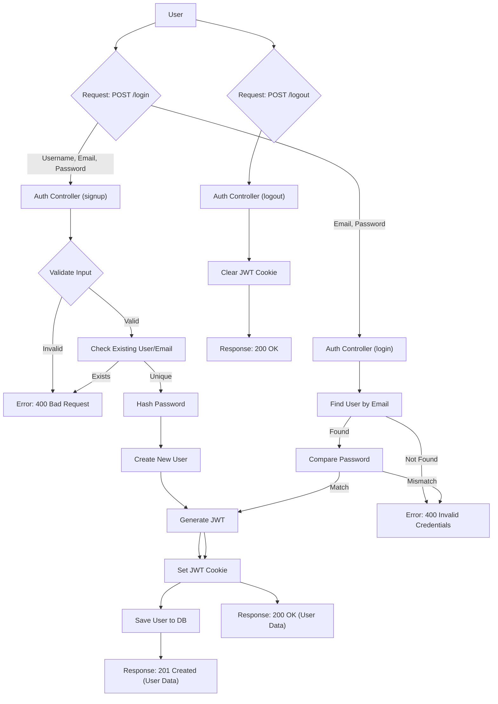
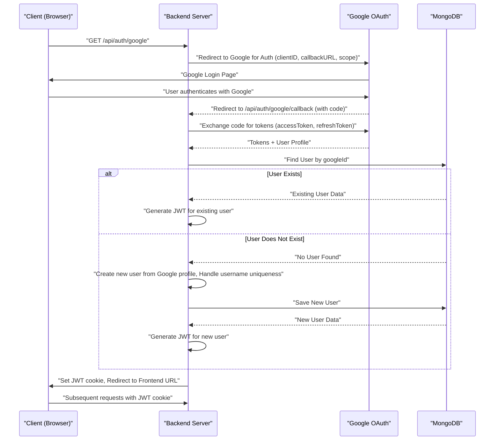

# Authentication and User Management

<TOC />

This section delves into the core functionalities for user authentication, authorization, and profile management within the backend. It covers traditional email/password registration, secure login, session management using JWTs, and integration with Google OAuth for streamlined sign-ins. User profiles can be updated with new usernames and profile pictures, ensuring a dynamic and personalized user experience.

## User Authentication Flows

The authentication system supports both traditional email/password and Google OAuth methods. JWTs are used for session management, securely passed via HTTP-only cookies.

### Email and Password Authentication

Users can register with a unique username, email, and password. The system includes robust validation for all input fields and securely hashes passwords using `bcryptjs`.

#### User Registration (Signup)

The `signup` controller handles new user registrations. It validates input, checks for existing users, hashes passwords, and generates a JWT for the newly created user.

```javascript
// backend/src/controllers/auth.controller.js
export const signup = async (req, res) => {
    const {username, email, password} = req.body;
    try {
        if(!username || !email || !password) {
            return res.status(400).json({message: "Please fill in all fields."});
        }
        // ... (validation checks for username and password length)
        const user = await User.findOne({email});
        if (user) return res.status(400).json({message: "Email already exists."});
        
        const existingUserByUsername = await User.findOne({ username });
        if (existingUserByUsername) {
            return res.status(400).json({ message: "Username already exists. Please choose another." });
        }

        const salt = await bcrypt.genSalt(10);
        const hashedPassword = await bcrypt.hash(password, salt);

        const newUser = new User({
            username,
            email,
            password: hashedPassword,
            authProvider: 'email'
        });
        if(newUser){
            generateToken(newUser._id, res); // Generate JWT and set as cookie
            await newUser.save();
            res.status(201).json({
                _id: newUser._id, username: newUser.username, email: newUser.email, profilePic: newUser.profilePic, authProvider: newUser.authProvider
            });
        } else {
            res.status(400).json({message: "Invalid user data."});
        }
    } catch (error) {
        console.log("Error in signup controller", error.message)
        res.status(500).json({message: "Something went wrong."});
    }
};
```
[View on GitHub](https://github.com/shinymack/Chat-App-MERN/blob/main/backend/src/controllers/auth.controller.js#L7-L58)

#### User Login

The `login` controller authenticates users by verifying their email and hashed password. It also handles cases where a user might have registered via Google and attempts to log in with an email/password.

```javascript
// backend/src/controllers/auth.controller.js
export const login = async (req, res) => {
    const {email, password} = req.body;
    try {
        const user = await User.findOne({email});

        if(!user) {
            return res.status(400).json({message: "Invalid credentials."});
        }

        // Prevent email/password login for Google-registered users without a password
        if(user.authProvider === 'google' && !user.password){
            return res.status(400).json({ message: "Please sign in with Google." });
        }

        const isPasswordCorrect = await bcrypt.compare(password, user.password);
        if(!isPasswordCorrect) {
            return res.status(400).json({message: "Invalid credentials."});
        }

        generateToken(user._id, res); // Generate JWT and set as cookie
        res.status(200).json({
            _id: user._id, username: user.username, email: user.email, profilePic: user.profilePic, authProvider: user.authProvider,
        });
    } catch (error) {
        console.log("Error in login controller", error.message);
        res.status(500).json({message: "Something went wrong."});
    }
};
```
[View on GitHub](https://github.com/shinymack/Chat-App-MERN/blob/main/backend/src/controllers/auth.controller.js#L60-L92)

#### Logout

The `logout` controller invalidates the user's session by clearing the JWT cookie.

```javascript
// backend/src/controllers/auth.controller.js
export const logout = (req, res) => {
    try {
        res.cookie("jwt", "", {maxAge: 0}); // Clear the JWT cookie
        res.status(200).json({message: "Logged out successfully."})
    } catch(error) {
        console.log("Error in logout controller", error.message);
        res.status(500).json({message:"Internal Server Error"}); 
    }
};
```
[View on GitHub](https://github.com/shinymack/Chat-App-MERN/blob/main/backend/src/controllers/auth.controller.js#L94-L102)

#### Authentication Flow Diagram

The following diagram illustrates the standard email/password authentication process.





### Google OAuth Integration

Google authentication is implemented using `passport.js` and `passport-google-oauth20`. This allows users to quickly sign up or log in using their Google accounts.

#### Passport Configuration

The `passport.config.js` file sets up the Google Strategy, defining how user profiles are handled upon successful authentication. It creates new users if they don't exist or links existing accounts based on `googleId`.

```javascript
// backend/src/lib/passport.config.js
import passport from 'passport';
import { Strategy as GoogleStrategy } from 'passport-google-oauth20';
import User from '../models/user.model.js'; 
// ... dotenv config

export const configurePassport = () => {
    passport.use(new GoogleStrategy({
        clientID: process.env.GOOGLE_CLIENT_ID,
        clientSecret: process.env.GOOGLE_CLIENT_SECRET,
        callbackURL: process.env.GOOGLE_CALLBACK_URL,
        scope: ['profile', 'email'] 
    },
    async (accessToken, refreshToken, profile, done) => {
        try {
            let user = await User.findOne({ googleId: profile.id });
            if (user) {
                return done(null, user); // User already exists
            } else {
                let username = profile.displayName.replace(/\s+/g, '').toLowerCase() || `user${Date.now()}`;
                // ... (username uniqueness handling)
                const newUser = new User({
                    googleId: profile.id,
                    email: profile.emails && profile.emails[0] ? profile.emails[0].value : null,
                    username: username,
                    authProvider: 'google',
                });
                if (!newUser.email) {
                    return done(new Error("Email not provided by Google. Cannot create account."), null);
                }
                const existingUserByEmail = await User.findOne({ email: newUser.email });
                if (existingUserByEmail && existingUserByEmail.authProvider !== 'google') {
                    return done(null, false, { message: `An account with email ${newUser.email} already exists. Please sign in using your original method.` });
                }
                await newUser.save();
                return done(null, newUser); // Create new user
            }
        } catch (error) {
            return done(error, null);
        }
    }));
    // ... serializeUser and deserializeUser methods
};
```
[View on GitHub](https://github.com/shinymack/Chat-App-MERN/blob/main/backend/src/lib/passport.config.js#L10-L74)

#### Google OAuth Flow Diagram

This sequence diagram illustrates the steps involved in authenticating a user via Google.





## User Model and Schema

The `user.model.js` defines the schema for user data, including fields for email, username, password (optional for Google OAuth), profile picture, social connections (friends, requests), and the authentication provider.

```javascript
// backend/src/models/user.model.js
import mongoose from "mongoose"

const  userSchema = new mongoose.Schema(
    {
        email: { 
            type: String, required: true, unique: true
        },
        username: {
            type: String, required: [true, "Username is required"], unique: true, trim: true,
            minlength: [3, "Username must be at least 3 characters long"],
            maxlength: [20, "Username cannot be more than 20 characters long"]
        },
        password: { type: String, minlength: 6 },
        profilePic: { type: String, default: "" },
        friends: [{ type: mongoose.Schema.Types.ObjectId, ref: "User", default: [] }],
        friendRequests: [{ type: mongoose.Schema.Types.ObjectId, ref: "User", default: [] }],
        sentRequests: [{ type: mongoose.Schema.Types.ObjectId, ref: "User", default: [] }],
        authProvider: { type: String, enum: ['email', 'google'], default: 'email' },
        googleId: { type: String, unique: true, sparse: true }, // Sparse index for optional unique field
    },
    { timestamps: true } 
);

userSchema.pre('save', async function(next) {
    // If authenticated via Google and no password provided, ensure password field is undefined
    if (this.authProvider === 'google' && !this.isModified('password')) {
        this.password = undefined;
    }
    // For email signup, require a password
    if (this.authProvider === 'email' && !this.password && this.isNew) {
        return next(new Error('Password is required for email signup.'));
    }
    next();
});

const User = mongoose.model("User", userSchema);

export default User;
```
[View on GitHub](https://github.com/shinymack/Chat-App-MERN/blob/main/backend/src/models/user.model.js)

The `pre('save')` hook ensures that users authenticated via Google do not necessarily have a password stored, and that email-registered users always have one.

## User Profile Management

The system provides functionalities for checking username availability and updating user profiles.

#### Check Username Availability

Before allowing a username change or during signup, the `checkUsernameAvailability` controller verifies if a desired username is already taken or meets length requirements.

```javascript
// backend/src/controllers/auth.controller.js
export const checkUsernameAvailability = async (req, res) => {
    try {
        const { username } = req.params;
        const currentUserId = req.user._id; 

        if (!username || username.trim().length < 3 || username.trim().length > 20) {
            return res.status(400).json({ available: false, message: "Username must be between 3 and 20 characters." });
        }
    
        // If the username is the current user's existing username, it's available for them
        if (req.user.username === username) {
            return res.status(200).json({ available: true, message: "This is your current username." });
        }

        const existingUser = await User.findOne({ username: username });

        if (existingUser) {
            return res.status(200).json({ available: false, message: "Username is already taken." });
        }

        res.status(200).json({ available: true, message: "Username is available." });

    } catch (error) {
        console.error("Error in checkUsernameAvailability:", error.message);
        res.status(500).json({ available: false, message: "Error checking username availability." });
    }
};
```
[View on GitHub](https://github.com/shinymack/Chat-App-MERN/blob/main/backend/src/controllers/auth.controller.js#L148-L187)

#### Update Profile

Users can update their profile picture and username. Profile picture uploads are handled via Cloudinary, and username changes are validated for uniqueness.

```javascript
// backend/src/controllers/auth.controller.js
export const updateProfile = async (req, res) => {
    try {
        const { profilePic, username } = req.body;
        const userId = req.user._id;
        let userToUpdate = await User.findById(userId);

        if (!userToUpdate) {
            return res.status(404).json({ message: "User not found." });
        }

        const fieldsToUpdate = {};
        let newUsername = username ? username.trim() : null;

        // Handle username update logic (validation, uniqueness check)
        if (newUsername && newUsername !== userToUpdate.username) {
            // ... (username length validation)
            const existingUserWithNewUsername = await User.findOne({ username: newUsername, _id: { $ne: userId } });
            if (existingUserWithNewUsername) {
                return res.status(400).json({ message: "This username is already taken by someone else." });
            }
            fieldsToUpdate.username = newUsername;
        }

        // Handle profile picture update via Cloudinary
        if (profilePic) {
            const uploadResponse = await cloudinary.uploader.upload(profilePic);
            fieldsToUpdate.profilePic = uploadResponse.secure_url;
        }

        if (Object.keys(fieldsToUpdate).length === 0) {
            return res.status(400).json({ message: "No changes provided to update." });
        }

        const updatedUser = await User.findByIdAndUpdate(userId, { $set: fieldsToUpdate }, { new: true });

        generateToken(updatedUser._id, res); // Refresh JWT cookie
        res.status(200).json(updatedUser);

    } catch (error) {
        console.error("Error in updateProfile controller", error.message);
        if (error.code === 11000 && error.keyValue && error.keyValue.username) {
            return res.status(400).json({ message: "This username is already taken." });
        }
        res.status(500).json({ message: "Internal Server Error while updating profile." });
    }
};
```
[View on GitHub](https://github.com/shinymack/Chat-App-MERN/blob/main/backend/src/controllers/auth.controller.js#L190-L260)

## Routing and Middleware

The authentication routes are defined in `auth.route.js`. The `protectRoute` middleware ensures that certain endpoints (like `updateProfile`, `checkAuth`, `checkUsernameAvailability`) are only accessible to authenticated users.

```javascript
// backend/src/routes/auth.route.js
import express from "express"
import passport from 'passport';
import { login, logout, signup, updateProfile, checkAuth, googleAuthCallback, checkUsernameAvailability} from  "../controllers/auth.controller.js"
import { protectRoute } from "../middleware/auth.middleware.js" // Protects routes with JWT

const router = express.Router();

router.post("/signup", signup);
router.post("/login", login);
router.post("/logout", logout);

router.put("/update-profile", protectRoute ,updateProfile)
router.get("/username/check/:username", protectRoute, checkUsernameAvailability);
router.get("/check", protectRoute, checkAuth) // Checks if user is authenticated and returns user data

// Google OAuth routes
router.get(
    '/google',
    passport.authenticate('google', { scope: ['profile', 'email'] })
);
router.get(
    '/google/callback',
    passport.authenticate('google', {
        failureRedirect: 'http://localhost:5173/login', 
        failureMessage: true 
    }),
    googleAuthCallback 
);
export default router;
```
[View on GitHub](https://github.com/shinymack/Chat-App-MERN/blob/main/backend/src/routes/auth.route.js)

The `protectRoute` middleware (not detailed here but referenced) extracts the JWT from the request, verifies it, and attaches the authenticated user's information to `req.user`, making it available in subsequent controller functions.

## Key Integration Points

*   **JWT Generation and Verification**: The `generateToken` utility is central to creating and managing user sessions. It creates an HTTP-only cookie, providing security benefits against XSS attacks. The `protectRoute` middleware is essential for verifying this token on protected routes.
*   **Password Hashing**: `bcryptjs` is critical for storing user passwords securely, ensuring that even if the database is compromised, passwords cannot be easily deciphered.
*   **Google OAuth with Passport.js**: The integration with Passport.js streamlines the Google authentication process, handling redirects, token exchanges, and user profile management seamlessly. It correctly identifies existing users or creates new ones based on their Google ID and email.
*   **Cloudinary Integration**: For profile picture updates, Cloudinary is used to store and manage image assets, offloading media storage from the main server.
*   **User Schema Validation**: The Mongoose schema for `User` includes various validations (e.g., `required`, `unique`, `minlength`, `maxlength`) to maintain data integrity and enforce business rules at the database level. The `sparse` option on `googleId` is crucial, allowing `null` values while maintaining uniqueness for non-null ones.
*   **Error Handling**: Consistent error handling across controllers ensures that appropriate HTTP status codes and messages are returned to the client, improving API reliability and debugging.

Next: [Messaging and Friend System](./2.2_messaging-and-friend-system.mdx)